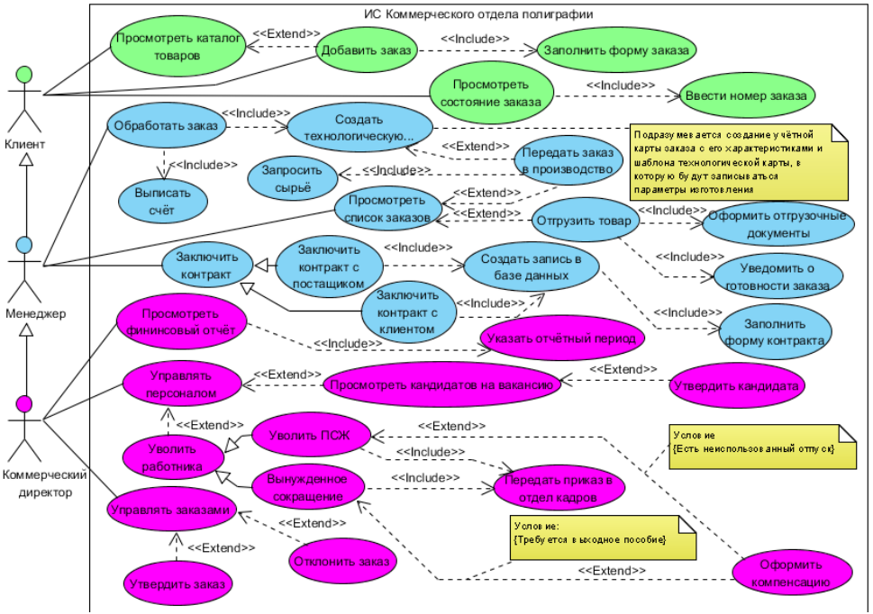
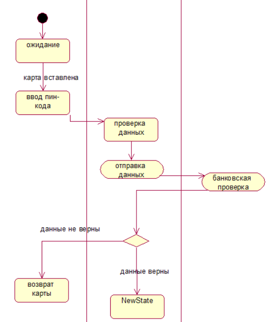
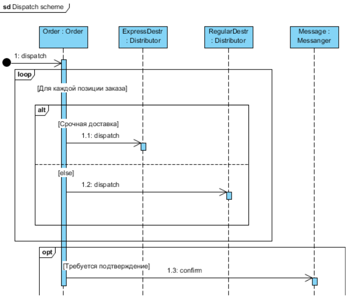
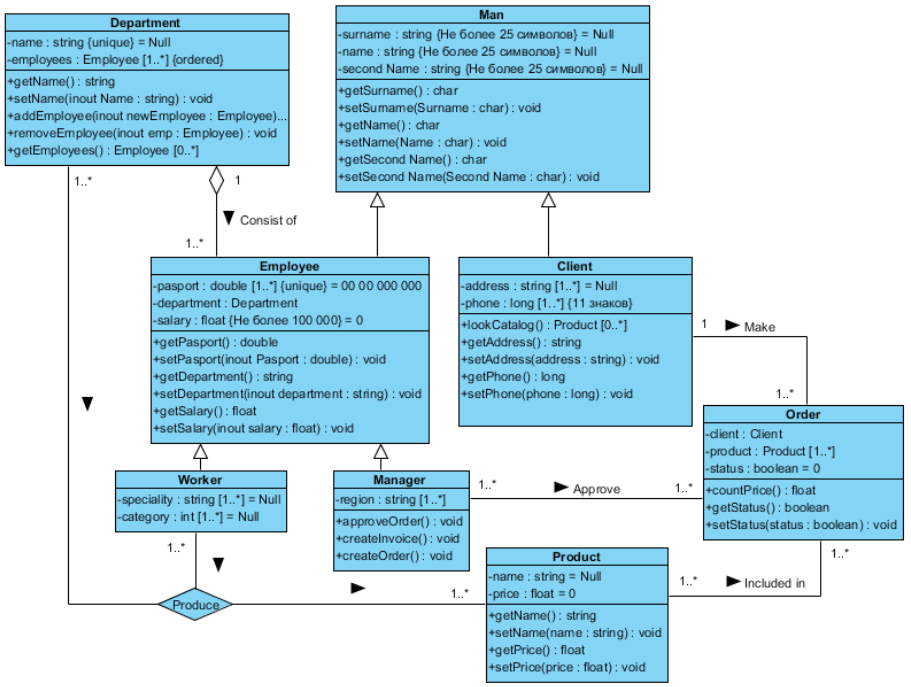
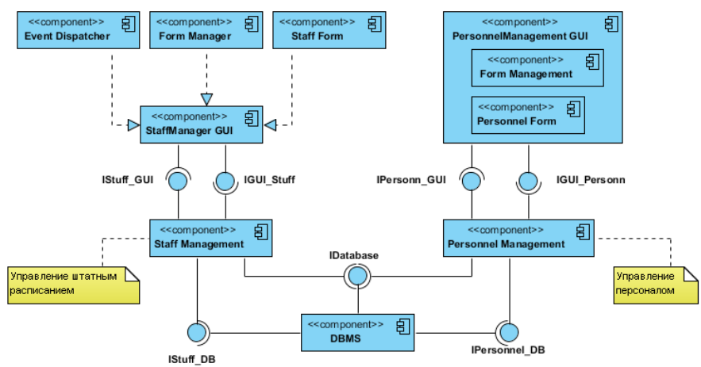
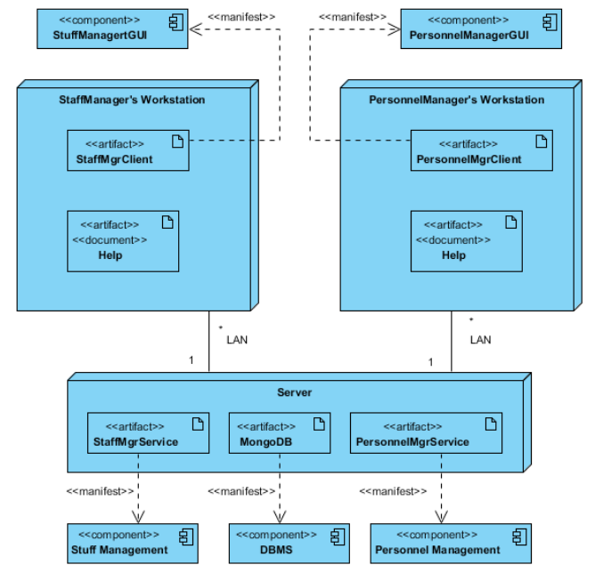

[содержание](/readme.md)

# Проектирование информационных систем на основе унифицированного языка моделирования UML

## Основы унифицированного языка моделирования UML

Существует большое количество инструментальных средств, используемых для реализации проекта ИС от этапа анализа до создания программногокода. Отдельно выделяют так называемые CASE-средства верхнего уровня (upper CASE tools) и CASE-средства нижнего уровня (lower CASE tools).

Среди основных проблем использования CASE-средств верхнего уровня выделяют проблемы их адаптации под конкретные проекты, так как они жестко регламентируют процесс разработки и не дают возможности организовать работу на уровне отдельных элементов проекта. Альтернативой им может стать использование CASE-средства нижнего уровня, но их использование влечет другие проблемы – трудности в организации взаимодействия между командами, работающими над различными элементами проекта.

Средством, позволяющим объединить эти подходы, явился унифицированный язык объектно-ориентированного моделирования (Unified Modeling Language – UML). К преимуществам языка UML можно отнести разнообразные инструментальные средства, которые как поддерживают жизненный цикл ИС, так и позволяют настроить и отразить специфику деятельности разработчиков различных элементов проекта.

В конце 1980-х годов получили большое распространение объектно-ориентированные языки программирования. Тенденции их активного использования определили задачи разработки языка
моделирования, дающего возможность реализовать объектно-ориентированный подход и построить
наилучшую модель системы с указанием ее значимых свойств. Этим языком стал UML. В настоящее время UML как нотация моделирования ИС поддерживается рядом объектно-ориентированных CASE-продуктов.

Основными характеристиками объектно-ориентированного языка моделирования UML являются:
- организация взаимодействия заказчика и разработчика (групп разработчиков) ИС путем построения репрезентативных визуальных моделей;
- специализация базовых обозначений для конкретной предметной области.

Базовый набор диаграмм UML содержится в большом количестве средств моделирования. Однако в связи с тем, что каждая прикладная задача имеет свои особенности и не требует всех концепций в каждом приложении, язык предоставляет пользователям такие возможности, как:
- моделирование с использованием только средств «ядра» для типовых приложений;
- моделирование с использованием дополнительных условных обозначений, если они отсутствуют в «ядре», или специализация нотации и ограничений для данной предметной области.

Для поддержки моделирования различных этапов жизненного цикла ИС язык UML предлагает
целую совокупность диаграмм.

При разработке **концептуальной модели** применяют диаграммы вариантов использования и диаграммы деятельности, модели бизнес-объектов, диаграммы последовательностей.

На этапе работы над **логической моделью** ИС описать требования к системе позволяют диаграммы вариантов использования, а при предварительном проектировании используют диаграммы классов, диаграммы состояний, диаграммы последовательностей.

Детальное проектирование при разработке **физической модели** выполняют с применением диаграмм классов, диаграмм развертывания, диаграмм компонентов.

Далее будут подробнее рассмотрены перечисленные диаграммы с указанием их назначения в процессе проектирования ИС.

## Проектирование логической модели ИС и моделей баз данных

Одной из диаграмм, применяющихся на этапе проектирования логической модели ИС, является **диаграмма вариантов использования** (диаграмма прецедентов, use case diagram), предназначенная для построения на концептуальном уровне модели того, как функционирует система в окружающей среде.
Основными элементами для построения модели прецедентов на диаграмме являются:

- актёр (actor) – элемент, обозначающий роли пользователя, который взаимодействует с
определенной сущностью;
- прецедент – элемент, отражающий действия, выполняемые системой (в т.ч., с указанием
возможных вариантов), которые приводят к результатам, наблюдаемым актерами.

Между прецедентами в модели могут быть установлены связи, такие, как:
- обобщение (Generalization) – указывает общность ролей;
- включение (include) – указывает взаимосвязь нескольких вариантов использования, базовый
из которых всегда использует функциональное поведение связанных с ним прецедентов;
- расширение (extend) – указывает взаимосвязь базового варианта использования и вариантов использования, являющихся его специальными случаями.

Пример **диаграммы вариантов использования**:

Более детально описать бизнес-процессы позволяют диаграммы деятельности и диаграммы последовательностей.

**Диаграмма деятельности** (activity diagram) — диаграмма, использующаяся при моделировании
бизнес-процессов, на которой представлено разложение на составные части некоторой деятельности, а именно: скоординированного выполнения отдельных действий и вложенных видов деятельности, которые соединяются между собой потоками от выходов одного узла к входам другого, с указанием их исполнителей.

Пример диаграммы деятельности:

Разработанные на этапе построения моделей бизнес-прецедентов диаграммы видов деятельности
могут корректироваться вследствие выявления новых подробностей в описании бизнес-процессов объекта
автоматизации на этапах анализа и проектирования.

**Диаграмма последовательности** (sequence diagram) — диаграмма, отражающая упорядоченные
по времени проявления взаимодействия объектов.

На диаграмме данного типа слева направо помещаются основные элементы:
- объекты;
- вертикальные линии (lifeline), моделирующие течение времени при выполнении действий объектом; - стрелки, определяющие действия, выполняемые объектом.

Пример диаграммы последовательности:

В результате построения диаграмм на этом этапе разработаны подробные описания действий
специалистов по внедрению ИС, которые необходимы для обеспечения ее функциональности.

На этапе формирования требований разрабатывается модель системных прецедентов, на которой для внутренних и внешних исполнителей указываются их конкретные обязанности с использованием ИС. 
Модели системных прецедентов разрабатываются на основе бизнес-моделей, построенных на предыдущем этапе, однако при этом необходимо детально описать прецеденты с определениями используемых данных и указанием последовательности их выполнения, то есть подробно описать реализацию функций проектируемой системы.

На этапе анализа требований и предварительного проектирования системы на основе построенных
моделей системных прецедентов строятся диаграммы классов системы.

Диаграмма классов, являясь логическим представлением модели, представляет детальную информацию о структуре модели системы с использованием терминологии классов объектно-ориентированного программирования, а именно: о внутреннем устройстве системы (об архитектуре системы). На диаграмме классов могут быть указаны внутренняя структура и типы отношений между отдельными объектами и подсистемами, что приводит к развитию концептуальной модели системы.

Класс в языке UML обозначает некоторое множество объектов, обладающих одинаковой структурой и взаимосвязями с объектами других классов. В диаграммах классов системы указываются объекты из
модели системных прецедентов с их описанием и указанием взаимосвязей между классами.

Синтаксис диаграмм классов является эффективным средством структурирования требований к элементам проектируемой системы, к их данным, интерфейсам, функциональности.

Пример диаграммы классов:

На этом этапе проектирования подробно описаны состав и функции системы в соответствии
с разработанными бизнес-моделями, что дает уверенность в соответствии проектируемой системы
требованиям заказчика.

На следующем этапе элементы разработанных моделей классов отображаются в элементы моделей
базы данных и приложений, а именно:
- классы – в таблицы;
- атрибуты – в столбцы;
- типы – в типы данных СУБД;
- ассоциации – в связи между таблицами (в том числе, создавая дополнительные таблицы связей);
- приложения – в классы с определенными методами и атрибутами, связанными с данными в
базе.

В модели базы данных для каждого простого класса формируется таблица, которая включает
столбцы, поставленные в соответствие атрибутам класса.

Классы подтипов могут отображаться в таблицы несколькими способами:
- в случае отображения одной таблицы на класс отдельная таблица формируется для каждого
класса с установлением последующих связей;
- в случае отображения одной таблицы на суперкласс для суперкласса создается таблица, а
затем в таблицы подклассов размещаются столбцы для атрибутов суперкласса;
- в случае отображения одной таблицы на иерархию формируется единая таблица, в которой
расположены атрибуты суперкласса и всех подклассов с добавлением дополнительных столбцов для
определения исходных таблиц подклассов.

Язык UML для разработки проекта БД предлагает специальный профиль Profile for Database Design, в
котором используются основные компоненты диаграмм, такие, как: таблица, столбец, ключи, связи, домен, процедура и тд. На диаграммах также можно указывать дополнительные характеристики столбцов и таблиц: ограничения, триггеры, типы данных и тд. В результате этого этапа проект базы данных и приложений системы становится детально описанным.

## Проектирование физической модели ИС

Следующий этап проектирования системы включает в себя дополнения модели баз данных
и приложений диаграммами их размещения на технических средствах.

На данном этапе рассматриваются такие понятия UML, как:
- компонент – элемент физического представления системы, реализующий определенный набор интерфейсов;
- зависимость – связь между двумя элементами, обозначающая ситуацию, при которой изменение
одного элемента модели влечет за собой изменение ее другого элемента;
- процессор и устройство – узел, выполняющий и не выполняющий обработку данных соответственно;
- соединение – связь между процессорами и устройствами.

Наиболее полно особенности физического представления системы на языке UML позволяют диаграммы компонентов и диаграммы развертывания.

Диаграмма компонентов (component diagram) отображает иерархию подсистем, структурных компонентов и зависимостей между ними. Физическими компонентами выступают базы данных, исполняемые файлы, приложения, библиотеки, интерфейсы ИС и т.д. В случае использования диаграммы компонентов для
отображения внутренней структуры компонентов, интерфейсы составного компонента делегируются
в определенные интерфейсы внутренних компонентов.

Основными целями построения диаграмм компонентов являются:
- определение архитектуры проектируемой системы;
- построение концептуальной и физической моделей баз данных;
- представление структуры исходного и специфики исполняемого кода системы;
- многократное использование определенных фрагментов программного кода.

Пример диаграммы компонентов:

Для описания аппаратной конфигурации ИС применяют диаграмму развертывания (deployment
diagram).

С помощью диаграммы развертывания моделируют физическое распределение различных
программных, информационных, аппаратных компонентов системы по комплексу технических
средств. Особое внимание на диаграмме развертывания уделяется отображению того, какие
используются аппаратные компоненты («узлы» - серверы баз данных и приложений, веб-верверы),
какие программные компоненты («артефакты» - базы данных, веб-приложения) работают на
каждом из них и как части комплекса соединены друг с другом.

Пример диаграммы развертывания:

Таким образом, в случае проектирования сложной ИС ее необходимо разделить на части и
исследовать каждую часть отдельно. Существуют два основных способа разбиения ИС на такие
подсистемы:
- структурная (функциональная) декомпозиция;
- объектная (компонентная) декомпозиция.

Характерной особенностью объектной декомпозиции является выделением объектов (компонен-
тов), взаимодействующих между собой, выполняющих определенные функции (методы) объекта.
При проектировании ИС язык UML используют для визуального моделирования системы при ее
разбиении на объекты. В случае функциональной декомпозиции ИС при проектировании использование
UML нецелесообразно, здесь применяются другие структурные нотации, рассмотренные в предыдущих
разделах.
