<table style="width: 100%;"><tr><td style="width: 40%;">
<a href="../articles/5_1_1_4_analiz.md">Анализ предметной области. Основные понятия системного и структурного анализа.
</a></td><td style="width: 20%;">
<a href="../readme.md">Содержание
</a></td><td style="width: 40%;">
<a href="../articles/5_1_1_10_uml_uc_spec.md">Спецификация вариантов использования
</a></td><tr></table>

# Диаграмма прецедентов (вариантов использования или Use Case)

Используемые материалы:

* [Диаграмма прецедентов (простенько, но не полно)](https://planerka.info/item/diagramma-precedentov-variantov-ispolzovaniya-uml/)
* [Более полное описание](https://intuit.ru/studies/courses/32/32/lecture/1004)
* [Конспект лекции (с видео) от WorldSkills](https://nationalteam.worldskills.ru/skills/proektirovanie-use-case-diagrammy-opredelenie-funktsionalnykh-vozmozhnostey-sistemy/)

## Диаграмма вариантов использования, общие понятия

**Диаграмма вариантов использования** (use case diagram) — диаграмма, на которой изображаются отношения между *акторами* и *вариантами использования* (*прецедентами*).

>Актор это калька с английского *Actor* что расшифровывается как *действующее лицо* (**Act** - действие, суффикс **-or** - человек, осуществляющий действие) 

**Диаграмма вариантов использования** - это исходное концептуальное представление или концептуальная модель системы в процессе ее проектирования и разработки. Создание диаграммы вариантов использования имеет следующие цели:

* Определить общие границы и контекст моделируемой предметной области на начальных этапах проектирования системы
* Сформулировать общие требования к функциональному поведению проектируемой системы
* Разработать исходную концептуальную модель системы для ее последующей детализации в форме логических и физических моделей
* Подготовить исходную документацию для взаимодействия разработчиков системы с ее заказчиками и пользователями

Назначение данной диаграммы состоит в следующем: проектируемая информационная система представляется в форме так называемых *вариантов использования*, с которыми взаимодействуют внешние сущности или *акторы*. При этом *актором* или действующим лицом называется любой объект, субъект или система, взаимодействующая с моделируемой бизнес-системой извне. Это может быть человек, техническое устройство, программа или любая другая система, которая служит источником воздействия на моделируемую систему так, как определит разработчик. *Вариант использования* служит для описания сервисов, которые система предоставляет *актору*. Другими словами каждый *вариант использования* определяет набор действий, совершаемый системой при диалоге с *актором*. При этом ничего не говорится о том, каким образом будет реализовано взаимодействие акторов с системой и собственно выполнение *вариантов использования*.

Рассматривая диаграмму *вариантов использования* в качестве модели бизнес-системы, можно ассоциировать ее с "черным ящиком". Концептуальный характер этой диаграммы проявляется в том, что подробная детализация диаграммы или включение в нее элементов физического уровня представления на начальном этапе проектирования скорее имеет отрицательный характер, поскольку предопределяет способы реализации поведения системы. Эти аспекты должны быть сознательно скрыты от разработчика на диаграмме *вариантов использования*.

В самом общем случае, диаграмма *вариантов использования* представляет собой граф специального вида, который является графической нотацией для представления конкретных *вариантов использования*, *акторов* и отношений между этими элементами. При этом отдельные элементы диаграммы заключают в прямоугольник, который обозначает границы проектируемой системы. В то же время отношения, которые могут быть изображены на данном графе, представляют собой только фиксированные типы взаимосвязей между *акторами* и *вариантами использования*, которые в совокупности описывают сервисы или функциональные требования к моделируемой системе.

Базовыми элементами диаграммы вариантов использования являются *вариант использования* и *актор*.

**Вариант использования** (use case) — последовательность действий, которые система или другая сущность могут выполнять в процессе взаимодействия с *акторами* (во многих источниках *вариант использования* называют *прецедентом*, не надо пугаться и путаться - это одно и то же).

*Вариант использования* представляет собой спецификацию общих особенностей поведения или функционирования моделируемой системы без рассмотрения внутренней структуры этой системы. Несмотря на то, что каждый вариант использования определяет последовательность действий, которые должны быть выполнены проектируемой системой при взаимодействии ее с соответствующим актором, сами эти действия не изображаются на рассматриваемой диаграмме.

Содержание *варианта использования* может быть представлено в форме дополнительного пояснительного текста, который раскрывает смысл или семантику действий при выполнении данного *варианта использования*. Такой пояснительный текст получил название текста-сценария или просто сценария. Далее рассматривается один из шаблонов, который может быть рекомендован для написания сценариев вариантов использования.

Отдельный *вариант использования* обозначается на диаграмме эллипсом, внутри которого содержится его краткое имя в форме **отглагольного существительного** с пояснительными словами. Сам **текст** имени варианта использования должен начинаться **с заглавной буквы**.

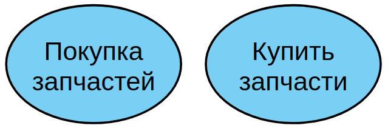

Цель *варианта использования* заключается в том, чтобы зафиксировать некоторый аспект или фрагмент поведения проектируемой системы без указания особенностей реализации данной функциональности. В этом смысле каждый *вариант использования* соответствует отдельному сервису, который предоставляет моделируемая система по запросу *актора*, т.е. определяет один из способов применения системы. Сервис, который инициализируется по запросу *актора*, должен представлять собой **законченную последовательность действий**. Это означает, что после того как система закончит обработку запроса *актора*, она должна возвратиться в исходное состояние, в котором снова готова к выполнению следующих запросов.

Диаграмма *вариантов использования* содержит конечное множество *вариантов использования*, которые в целом должны определять все возможные стороны ожидаемого поведения системы. Для удобства множество *вариантов использования* может рассматриваться как отдельный пакет. Применение *вариантов использования* на всех этапах работы над проектом позволяет не только достичь требуемого уровня унификации обозначений для представления функциональности подсистем и системы в целом, но и является мощным средством последовательного уточнения требований к проектируемой системе на основе их итеративного обсуждения со всеми заинтересованными специалистами.

Примерами *вариантов использования* могут быть следующие действия: проверка состояния текущего счета клиента, оформление заказа на покупку товара, получение дополнительной информации о кредитоспособности клиента, отображение графической формы на экране монитора и другие действия.

**Актор (actor)** — согласованное множество ролей, которые играют внешние сущности по отношению к *вариантам использования* при взаимодействии с ними.

*Актор* представляет собой любую внешнюю по отношению к моделируемой системе сущность, которая взаимодействует с системой и использует ее функциональные возможности для достижения определенных целей или решения частных задач. Каждый *актор* может рассматриваться как некая отдельная роль относительно конкретного варианта использования. Стандартным графическим обозначением актора на диаграммах является фигурка "человечка", под которой записывается имя актора

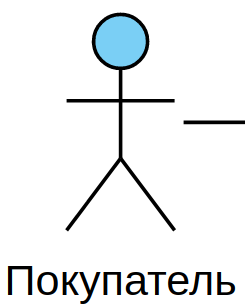

Имена *акторов* должны начинаться с заглавной буквы и следовать рекомендациям использования имен для типов и классов модели.

Имя *актора* должно быть достаточно информативным с точки зрения семантики. Для этой цели подходят наименования должностей в компании (например, Продавец, Кассир, Менеджер, Президент).

*Акторы* используются для моделирования внешних по отношению к проектируемой системе сущностей, которые взаимодействуют с системой. В качестве *акторов* могут выступать другие системы, в том числе подсистемы проектируемой системы или ее отдельные классы. Важно понимать, что каждый *актор* определяет согласованное множество ролей, в которых могут выступать пользователи данной системы в процессе взаимодействия с ней. В каждый момент времени с системой взаимодействует вполне определенный пользователь, при этом он играет или выступает в одной из таких ролей. Наиболее наглядный пример *актора* — конкретный покупатель в магазине автозапчастей.

Поскольку в общем случае *актор* всегда находится вне системы, его внутренняя структура никак не определяется. Для *актора* имеет значение только его внешнее представление, т.е. то, как он воспринимается со стороны системы. *Акторы* взаимодействуют с системой посредством передачи и приема сообщений от *вариантов использования*. Сообщение представляет собой запрос актором сервиса от системы и получение этого сервиса. Это взаимодействие может быть выражено посредством ассоциаций между отдельными акторами и вариантами использования. Кроме этого, с *акторами* могут быть связаны интерфейсы, которые определяют, каким образом другие элементы модели взаимодействуют с этими *акторами*.

## Отношения на диаграмме вариантов использования

Между элементами диаграммы *вариантов использования* могут существовать различные *отношения*, которые описывают взаимодействие экземпляров одних *акторов* и *вариантов использования* с экземплярами других *акторов* и *вариантов*. Один *актор* может взаимодействовать с несколькими *вариантами использования*. В этом случае этот *актор* обращается к нескольким сервисам данной системы. В свою очередь один *вариант использования* может взаимодействовать с несколькими *акторами*, предоставляя для всех них свой сервис.

В то же время два *варианта использования*, определенные в рамках одной моделируемой системы, также могут взаимодействовать друг с другом, однако характер этого взаимодействия будет отличаться от взаимодействия с *акторами*. В обоих случаях способы взаимодействия элементов модели предполагают обмен сигналами или сообщениями, которые инициируют реализацию функционального поведения моделируемой системы.

В языке UML имеется несколько стандартных видов отношений между акторами и вариантами использования:

* ассоциации (association relationship)
* включения (include relationship)
* расширения (extend relationship)
* обобщения (generalization relationship)

**Отношение ассоциации** – одно из фундаментальных понятий в языке UML и в той или иной степени используется при построении всех графических моделей систем в форме канонических диаграмм. Применительно к диаграммам *вариантов использования* *ассоциация* служит для обозначения специфической роли *актора* при его взаимодействии с отдельным *вариантом использования*. На диаграмме вариантов использования *отношение ассоциации* обозначается сплошной линией между *актором* и *вариантом использования*. Эта линия может иметь некоторые дополнительные обозначения, например, *имя* и *кратность*.

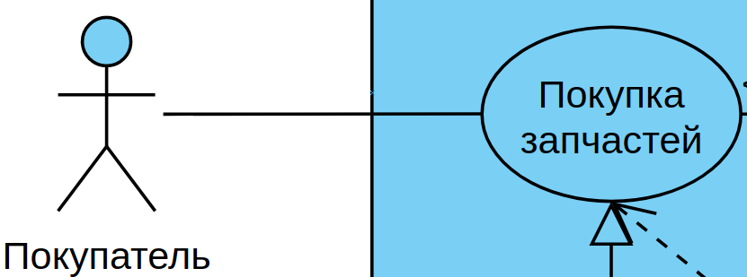

В контексте диаграммы *вариантов использования* **отношение ассоциации** между *актором* и *вариантом использования* может указывать на то, что *актор* инициирует соответствующий *вариант использования*. Такого актора называют главным. В других случаях подобная ассоциация может указывать на актора, которому предоставляется справочная информация о результатах функционирования моделируемой системы. Таких акторов часто называют второстепенными.

**Включение (include)** в языке UML — это разновидность отношения зависимости между базовым вариантом использования и его специальным случаем. При этом отношением зависимости (dependency) является такое отношение между двумя элементами модели, при котором изменение одного элемента (независимого) приводит к изменению другого элемента (зависимого).

Отношение включения устанавливается только **между двумя вариантами использования** и указывает на то, что заданное поведение для одного варианта использования включается в качестве составного фрагмента в последовательность поведения другого варианта использования.

Так, например, отношение включения, направленное от варианта использования "Предоставление кредита в банке" к варианту использования "Проверка платежеспособности клиента", указывает на то, что каждый экземпляр первого варианта использования **всегда** включает в себя функциональное поведение или выполнение второго варианта использования. В этом смысле поведение второго варианта использования является частью поведения первого варианта использования на данной диаграмме. Графически данное отношение обозначается как отношение зависимости в форме пунктирной линии со стрелкой, направленной от базового варианта использования к включаемому варианту использования. При этом данная линия помечается стереотипом "include".

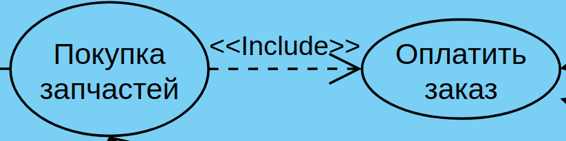

Семантика этого отношения определяется следующим образом. Процесс выполнения базового варианта использования включает в себя, как собственное, подмножество последовательность действий, которая определена для включаемого варианта использования. При этом выполнение включаемой последовательности действий происходит всегда при инициировании базового варианта использования.

Один вариант использования может входить в несколько других вариантов, а также содержать в себе другие варианты. Включаемый вариант использования является независимым от базового варианта в том смысле, что он предоставляет последнему инкапсулированное поведение, детали реализации которого скрыты от последнего и могут быть легко перераспределены между несколькими включаемыми вариантами использования. Более того, базовый вариант зависит только от результатов выполнения включаемого в него варианта использования, но не от структуры включаемых в него вариантов.

В нашем случае *прецедент* "оплатить заказ" на входе получает список товаров (причем не важно откуда, от клиента в магазине или от онлайн-покупателя на сайте).

**Отношение расширения** (extend) определяет взаимосвязь базового варианта использования с другим вариантом использования, функциональное поведение которого задействуется базовым не всегда, а только при выполнении дополнительных условий.

В языке UML отношение расширения является зависимостью, направленной к базовому варианту использования и соединенной с ним в так называемой точке расширения. Отношение расширения между вариантами использования обозначается как отношение зависимости в форме пунктирной линии со стрелкой, направленной от того варианта использования, который является расширением для базового варианта использования. Данная линия со стрелкой должна быть помечена стереотипом "extend".

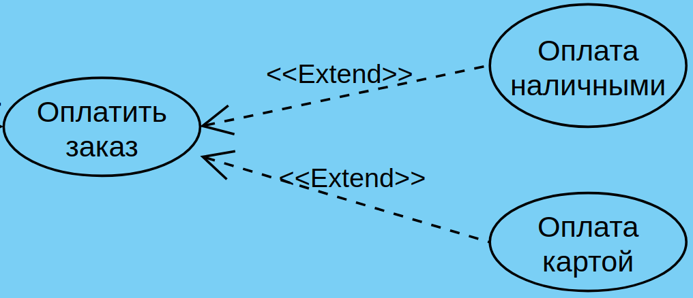

В нашем случае, при оплате в магазине доступны оба расширения, а при оплате на сайте только оплата картой (на самом деле второй вариант сложнее: нужно выделить отдельный прецедент "онлайн оплата" с расширениями "оплата картой", "оплата при получении" и т.п.)

Два и более актора могут иметь общие свойства, т.е. взаимодействовать с одним и тем же множеством вариантов использования одинаковым образом. Такая общность свойств и поведения представляется в виде **отношения обобщения** с другим, возможно, абстрактным актором, который моделирует соответствующую общность ролей.

Графически *отношение обобщения* обозначается сплошной линией со стрелкой в форме незакрашенного треугольника, которая указывает на родительский вариант использования.

**Границы проектируемой системы**. В начале лекции про них упоминалось - прямоугольник, который ограничивает проектируемкю модель (т.е. наши варианты использования). Еще раз обращаю внимание, акторы не входят в модель и рисуются за пределами системы.

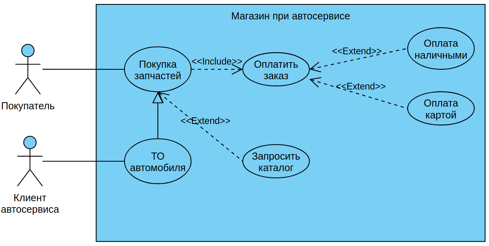

Мы рассмотрели только базовые элементы для диаграммы вариантов использования, на самом деле их больше. Но для нашего уровня обучения этого достаточно.

## Разбор скринкаста семинара "Системный анализ и проектирование"

Текст задания:

>Пользователь устанавливает приложение и регистрируется, указав ФИО и лицевой счёт, пароль. Так же пользователь может прикрепить данные банковской карты для быстрой оплаты, но не обязательно.
>
>Работа возможна только для авторизованного пользователя.
>
>Пользователь может оплатить услуги за электроэнергию, введя показания индивидуального прибора учёта. При введении показаний пользователь может запросить отчёт по оплате своего лицевого счёта, указав период для отчёта.
>
>Если карта не "привязана" к аккаунту, то пользователь вводит данные банковской карты и подтверждает оплату. Если карта "привязана", пользователь подтверждает оплату. После оплаты приложение генерирует квитанцию об оплате, которую пользователь может скачать. При закрытии приложения квитанция не сохраняется.

В **Visio** создаёте новый документ и открываете *Дополнительные фигуры* -> *Программы и базы данных* -> *Программное обеспечение* -> *Сценарии выполнения UML*

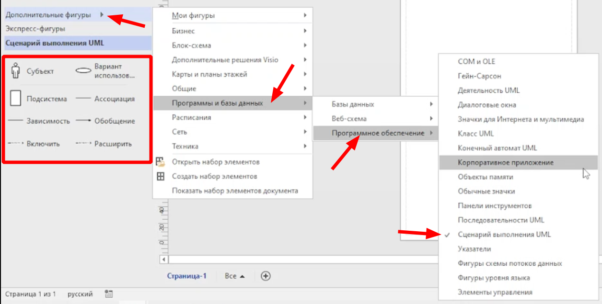

>Цвет моих диаграмм отличается от сделанных в **Visio**, т.к. я делаю в [visual-paradigm онлайн](https://online.visual-paradigm.com)

Порядок работы:

* определяем акторов
* определяем варианты использования
* определяем виды взаимодействия
* строим диаграмму

1. Рисуем прямоугольник подсистемы:

    

2. Определяем акторов

    В нашей системе это обычный **пользователь** и **авторизованный пользователь**. Рисуем их рядом с нашей подсистемой, причём учитываем, что **авторизованный пользователь** наследует (обобщает) свойства обычного **пользователя** (может прикрепить карту) и рисуем связь "обобщение":

    

3. Определение вариантов использования

    >Обратите внимание: связи между акторами и прецедентами **прямые** и рисуются без всяких стрелок

    * **установка приложения** - такой вариант использования есть в описании предметной области, но т.к. он не относится к подсистеме, то его рисуем за пределами подсистемы

        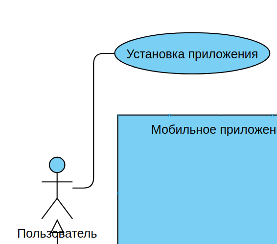

    * у обычного пользователя есть только один вариант использования: **регистрация**

        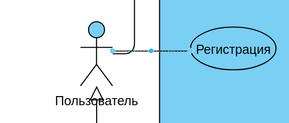

        Но при регистрации возникают дополнительные действия (прецеденты): ввод ФИО, лицевого счёта и пароля, и не обязательный ввод данных карты.

        Для обязательных прецедентов используется отношение **включения**, для не обязательных - **расширения**

        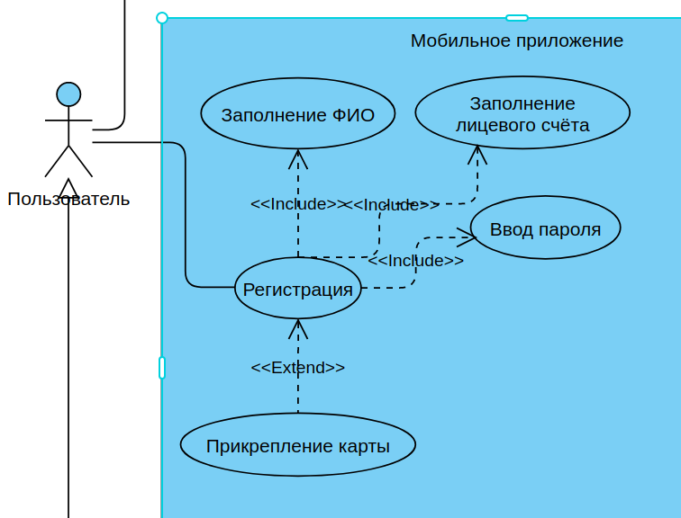

    * **оплата услуг** авторизованным пользователем. Причём пользователь **должен** внести показания прибора учета. И **может** запросить отчет с **возможным** выбором периода

        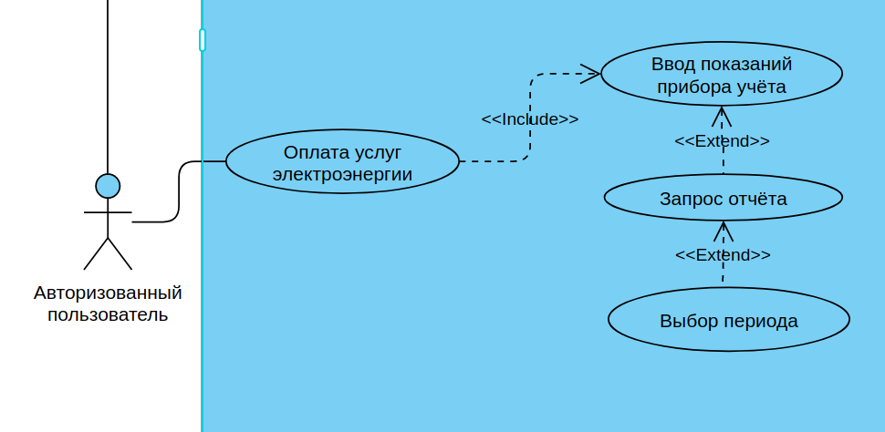

        После ввода показаний прибора учёта пользователь **должен** подтвердить оплату (обязательное действие, поэтому делаем включение). Если карта не была привязана в личном кабинете, то добавляем через включение действие **ввод данных карты**. **Visio** не полностью реализует стандарт UML - для альтернативных действий там есть специальные формы прецедентов. Но можно альтернативность прецедента акцентировать надписью на стрелке (тип ассоциации и так понятен по направлению стрелки)        

        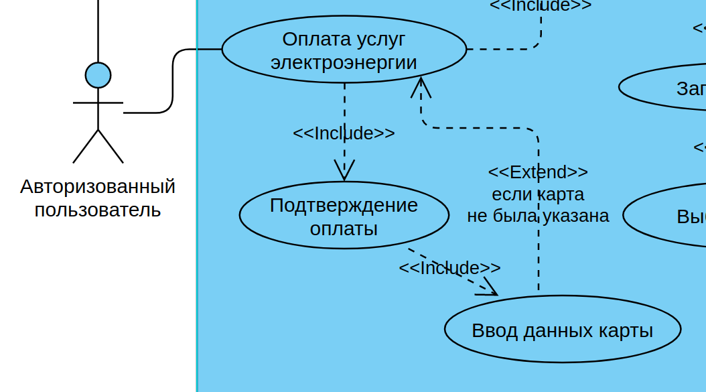

        После подтверждения оплаты система **генерирует квитанцию** (делает это всегда, поэтому включение). Действия пользователя в этом случае не описаны, но т.к. сказано, что система не хранит квитанции, то напрашивается расширение для **сохранения квитанции**

        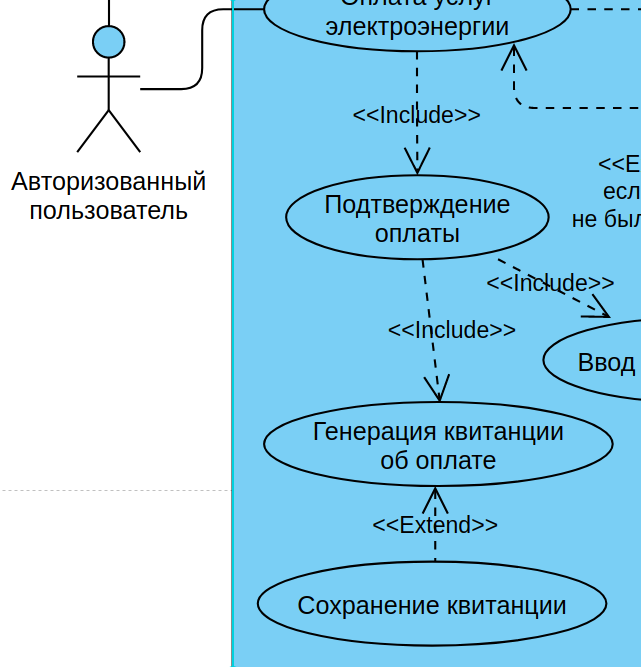
     
    * после всего вспомнили, что обычному пользователю для превращения в авторизованного нужно **авторизоваться** и, хотя этого нет в описании предметной области, добавляем этот прецедент:

        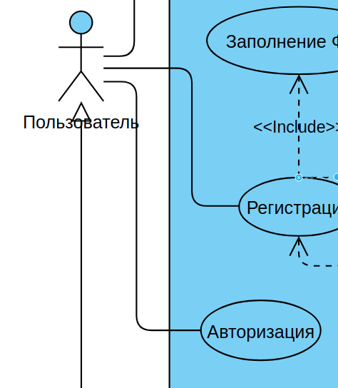

Итоговый вариант диаграммы прецедентов:

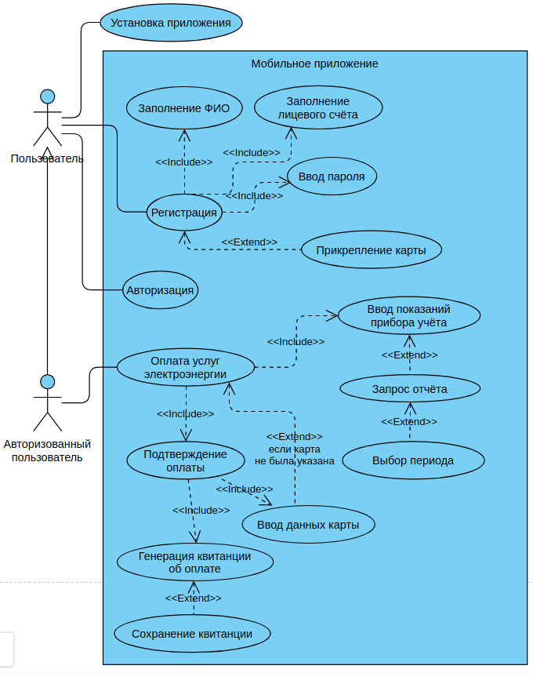

# Задание для самостоятельной работы:

>Программа для фитнес-центра по распределению фитнес – расписания и контроля его соблюдения 
>
>Предполагается, что в системе фитнес центра будет 3 роли пользователей: клиенты, тренеры, администраторы.
>Авторизация в системе производится по телефону и паролю.
>
>Клиенты могут зарегистрироваться в системе, указав ФИО, телефон, пароль, дату рождения, фото профиля, пол. 
>
>Администраторы – пользователи с уже заполненным профилем. Они могут добавлять новых тренеров и записывать их на различные курсы обучения с целью поддержки и улучшения их профессиональной квалификации. Постоянным клиентам администраторы могут предоставлять скидки на тренировки.
>
>Любой клиент после авторизации может выбрать себе тренера (если у него нет такового).  В этом случае клиент видит список тренеров с именем, фото, полом, стажем работы и списком достижений. Клиент может отправить заявку любому из тренеров, написав при этом цель, которую он хочет достигнуть при тренировках.
>
>Тренер после авторизации видит новые заявки от клиентов и их количество (если таковые имеются).  Тренер может принять заявку или отклонить. В случае отказа, тренер должен указать причину. В случае подтверждения заявки тренер должен выставить план индивидуальных занятий для клиента. Выбрав из списка клиентов без плана тренировок, тренер видит цель клиента, его возраст и планирует даты тренировочного цикла. Для индивидуальных занятий тренер может выбрать упражнения, указывая при этом его вид (приседания, отжимания и т.д.), частоту выполнения (сколько раз в неделю), число подходов и число повторений в каждом подходе.
>
>Клиент, отправивший заявку, но не получивший ответа, видит список своих заявок с результатами (в том числе с указанием причины при отказе) и количеством дней ожидания ответа. Получив план тренировок, клиент видит экран с 2 вкладками: план тренировок (дата-список упражнений через запятую) и сегодняшний перечень индивидуальных занятий. Для последней выводится список: вид упражнения, количество повторов и Checkbox, позволяющий отметить выполнения, упражнения. Несмотря на это, упражнение не будет засчитано системой до тех пор, пока клиент не укажет показатель своего пульса во время выполнения упражнения. Сверху выводится сегодняшний прогресс (по количеству выполненных упражнений) в процентах с графическим отображением. 
>
>Тренер также может посмотреть список своих текущих клиентов с указанием у каждого: проценты выполнения всего цикла тренировок (зависит от длительности цикла) и процента выполненных упражнений (т.к. некоторые упражнения могут быть пропущены). По каждому клиенту выводится средний показатель пульса во время выполнения упражнений.

<table style="width: 100%;"><tr><td style="width: 40%;">
<a href="../articles/5_1_1_4_analiz.md">Анализ предметной области. Основные понятия системного и структурного анализа.
</a></td><td style="width: 20%;">
<a href="../readme.md">Содержание
</a></td><td style="width: 40%;">
<a href="../articles/5_1_1_10_uml_uc_spec.md">Спецификация вариантов использования
</a></td><tr></table>