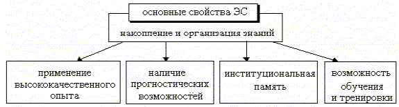
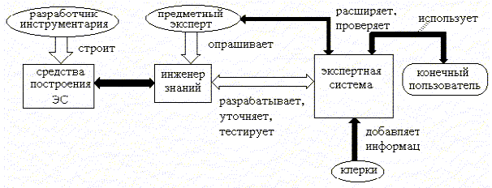
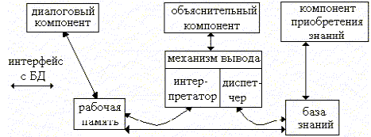
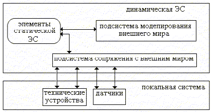
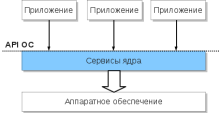
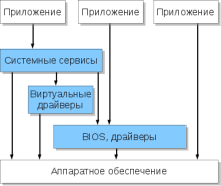
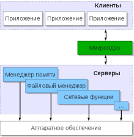

# Особенности информационного, программного и технического обеспечения различных видов информационных систем. Экспертные системы. Системы реального времени

* [ВВЕДЕНИЕ В ЭКСПЕРТНЫЕ СИСТЕМЫ. ОСНОВНЫЕ ПОНЯТИЯ И ОПРЕДЕЛЕНИЯ](#ВВЕДЕНИЕ-В-ЭКСПЕРТНЫЕ-СИСТЕМЫ-ОСНОВНЫЕ-ПОНЯТИЯ-И-ОПРЕДЕЛЕНИЯ)
* Системы реального времени

[_]: https://center-yf.ru/data/stat/Programmnoe-obespechenie-informacionnyh-sistem.php

Обеспечение информационных систем подразделяется на: информационное, техническое, математическое и программное, методическое, лингвистическое, правовое и организационное.

**Информационное** обеспечение включает совокупность данных, методы построения БД, а также проектных решений по объёмам, размещению, формам организации информации, циркулирующей в ИС организации.

[Техническое обеспечение]: https://center-yf.ru/data/stat/tehnicheskoe-obespechenie.php

**Техническое** обеспечение - комплекс ТС, предназначенных для работы ИС, документация на эти средства и технологические процессы.

**Математическое** обеспечение - совокупность математических методов, моделей, алгоритмов обработки информации, используемых при решении функциональных и проектных задач в ИС.

**Программное** обеспечение - совокупность программ для реализации целей, задач ИС и нормального функционирования как отдельных, так комплекса ТС.

**Методическое** и **организационное** обеспечение - комплекс методов, средств и документов, регламентирующих взаимодействие персонала ИС с программно-техническими средствами (ПТС) и между собой в процессе разработки и эксплуатации ИС.

**Лингвистическое** обеспечение - совокупность языков общения персонала ИС и пользователей с программно-техническим и информационным обеспечением, а также сумму терминов, используемых в ИС.
 
**Правовое** обеспечение - правовые нормы, используемые для соблюдения законности (законы, указы, постановления государственных органов власти, приказы и инструкции вышестоящих органов и руководителей организации).

## Анализ информации

С появлением первых электронных библиографических поисковых механизмов, входящих в состав автоматизированных информационно-поисковых систем и попыткой создания Электронных каталогов (ЭК) остро возникла проблема расширения поисковых элементов. Элементов библиографических описаний документов, хранящихся в полях «заглавия», «фамилии авторов» и «выходные данные» (вербальные данные) в большинстве случаев недостаточно для проведения релевантного поиска необходимых пользователям документов, если заранее неизвестны эти элементы. Заглавия всё чаще неинформативны, они не отражают ни тематики, ни содержаний документов. Наибольшие проблемы возникают при организации тематического поиска.

В качестве поисковых элементов в АИПС используется лингвистическое обеспечение, базирующееся на информационно-поисковых языках (ИПЯ), к которым относятся различные термины и словосочетания, входящие в состав классификационных систем (УДУ, ББК, ГРНТИ и др.), ключевых слов, тематических рубрик, алфавитно-предметных указателей (АПУ) и т.п. При формировании поискового запроса можно использовать классификаторы (УДК, ДДК, ББК, ГРНТИ и др.), но даже специалисты знают наизусть ограниченный набор классификационных индексов, как правило, лишь в какой-нибудь одной классификационной системе. Для пользователей это нереально по многим причинам. Одна из причин качественного поиска – отсутствие средств, способствующих осуществлению эффективных поисковых стратегий неподготовленным пользователем.

Так, например, ключевые слова, хотя и помогают при поиске документов, не позволяют во всех случаях обеспечить релевантный отбор необходимых документов. Ряд специалистов предложил решить эту проблему путём создания электронных тезаурусов и рубрикаторов, ссылки на которые можно было бы организовать при росписи документов.

В этом случае выделяют следующую последовательность работы:

- индексирование информации;
- составление тезауруса;
- организация и проведение поисков на основе широкого использования электронных рубрикаторов и тезаурусов. Этот достаточно трудоёмкий и неэффективный процесс всё равно в ряде случаев не позволяет решать данную проблему.

При этом эксперты считают, что функционирующие классификационные системы вряд ли сохранятся далее первых двух десятилетий грядущего века, если не найдут сил и возможности для коренных преобразований.

Может сложиться впечатление, что решить проблему релевантного и пертинентного поиска невозможно. Отчасти с этим приходится согласиться, особенно при проведении поисков в Интернете.

Однако ряд специалистов и организаций предлагают индексировать полные тексты и формировать объединённый СПА (справочно-поискового аппарата) для электронных и печатных ресурсов. Считается, что индексы в электронном (машиночитаемом) виде должны присутствовать вместе с их библиографическими описаниями (БО). Это направление получило название «вычислительная лингвистика». При этом пристальное внимание уделяется формированию метаданных.

Метаданные – информация об информации; информация, формируемая издателями электронных ресурсов, представляющая обязательный минимум сведений, позволяющий использовать их при каталогизации.

Важно отметить, что системы организации поиска в АБИС, а также в электронных полнотекстовых базах данных должны учитывать поведение пользователей при проведении данной процедуры.

Следующим направлением в данной области было создание систем, позволяющих из документов, тесно связанных между собой по некоторым статистическим параметрам, извлекать ключевые слова и словосочетания, которые считаются релевантными в данной предметной области. Такие системы способствуют решению проблемы релевантного автоматического индексирования и реферирования документов, принадлежащих к данному корпусу документов.

Программное обеспечение, использующее элементы вычислительной лингвистики, появилось на ряде сайтов в Интернете, например, «Анализатор текста» (textanalyst). Оно предназначено для анализа и составления из введённого пользователем текста списка ключевых слов, ранжируемых по весовому коэффициенту. Если из этого списка выбрать несколько словоформ, то по ним программа выполнит автоматическое реферирование и тематическую фиксацию анализируемого текста. В результате пользователь получает список наиболее значимых предложений исходного текста.

При этом возникает прецедент, когда, **во-первых**, отпадает потребность вводить ключевые слова и создавать специальные электронные рубрикаторы.

**Во-вторых**, автоматическое реферирование машиночитаемого текста способствует созданию рефератов документов, что само по себе весьма значимо особенно для научных, учебных, технических и иных профессиональных материалов.

**В-третьих**, такие рефераты можно включать в соответствующие поля библиографических записей в электронных базах и банках данных (в т.ч. Электронных каталогов), что будет способствовать максимальному раскрытию фондов библиотек и не перегрузит аппаратные средства большими объёмами машиночитаемых данных. Более того, поиск будет естественно проходить быстрее, чем при извлечении необходимых сведений из полных текстов.

**В-четвертых**, при этом не возникают проблемы с авторским правом, так как на серверах в открытом доступе будут не полные тексты документов, а их рефераты.

**В-пятых**, поиск по ключевым словам, образующим такие рефераты в сочетании с включенными в тексты метаданными может значительно улучшить ситуацию с релевантностью.

**В-шестых**, можно, используя эти рефераты, отказаться от описания определённого количества полей (тэгов) метаданных в гипертекстовых документах.

И, наконец, **в-седьмых**, такое решение снимает значительный груз забот и работ систематизаторов и библиографов при описании документов и создании соответствующих библиографических записей в Электронных каталогах их библиотек. Цель информационного обеспечения Понятие «информационное обеспечение» прочно вошло в научный и практический оборот и в настоящее время широко используется при освещении проблем управления. При этом под информационным обеспечением понимается организуемая в рамках управления деятельность, направленная на проектирование, функционирование и совершенствование информационных систем, обеспечивающих эффективное выполнение решаемых задач.

Термин «информация» означает сообщение, осведомление и положении дел, сведения о чем-либо. Принципиальным положением в данном понятии является то, что под информацией понимаются не любые сведения, а лишь те, которые уменьшают или снимают существовавшую до них неопределенность. Именно это положение, по существу, лежит в основе всех имеющихся информационных концепций и тем самым объединяет их.

Совокупность операций по обработке информации и их взаимосвязях на всех этапах ее циркуляции называется в теории информации информационным процессом.

Основными операциями информационного процесса в рассматриваемой сфере являются следующие:

- сбор,
- систематизация,
- преобразование (переработка),
- хранение,
- поиск,
- воспроизведение и распространение криминологической и уголовно-правовой информации.

Под информационными системами понимаются «информационно-логические системы», «информационно-вычислительные системы», «информационно-поисковые системы», «автоматизированные информационные системы», «информационные службы» и др. Поскольку потребности в различного рода информации многообразны и специфичны, в разных сферах социальной практики создаются и функционируют различные информационные системы.

Под системой информации в общем виде понимается совокупность всех видов информации, необходимой для эффективного функционирования конкретной системы управления, а также комплекс методов, средств и организационных форм реализации информационного процесса.

Под информационной потребностью понимается нужда или недостаток в знаниях, сведениях, данных, т.е. в информации, необходимой для осуществления стоящих перед потребителем этой информации целей и задач. Практическое значение использования понятия «информационная потребность» определяется тем, что оно позволяет охватить и описать определенное содержание информации, получаемое из разных источников.

Виды информационного обеспечения:

**1 уровень** – техническое обеспечение. Это совокупность взаимосвязанных и взаимодействующих технических средств.

**2 уровень** – информационное обеспечение – совокупность сведений, необходимых для выполнения автоматизированного проектирования. Основная его часть – автоматизированные банки данных, состоящие из БД, БЗ, САПР и СУ.

**3 уровень** – программное обеспечение – совокупность машинных программ, необходимых для выполнения автоматизированного проектирования.

**4 уровень** – организационно-методическое – совокупность документов, устанавливающих состав проектной организации и ее подразделений, связи между ними и их функции, совокупность документов, устанавливающих состав и правила отбора и эксплуатации средств обеспечения автоматизированного проектирования.

**5 уровень** – лингвистическое – совокупность языков проектирования, включая термины и определения, правила формализации естественного языка и методы сжатия и развертывания текстов.

**6 уровень** – математическое обеспечение – совокупность математических методов, математических моделей и алгоритмов проектирования.

**7 уровень** – концептуальное – совокупность универсальных мировоззренческих концепций, отражающих цели развития системы.

## ВВЕДЕНИЕ В ЭКСПЕРТНЫЕ СИСТЕМЫ. ОСНОВНЫЕ ПОНЯТИЯ И ОПРЕДЕЛЕНИЯ

### Назначения и основные свойства экспертных систем

В начале 80-х годов в исследованиях по искусственному интеллекту сформировалось самостоятельное направление, получившее название "экспертные системы" (ЭС). Основным назначением ЭС является разработка программных средств, которые при решении задач, трудных для человека, получают результаты, не уступающие по качеству и эффективности решения, решениям получаемым человеком-экспертом. ЭС используются для решения так называемых неформализованных задач, общим для которых является то, что:
- задачи не могут быть заданы в числовой форме;
- цели нельзя выразить в терминах точно определенной целевой функции;
- не существует алгоритмического решения задачи;
- если алгоритмическое решение есть, то его нельзя использовать из-за
ограниченности ресурсов (время, память).

Кроме того неформализованные задачи обладают ошибочностью, неполнотой, неоднозначностью и противоречивостью как исходных данных, так и знаний о решаемой задаче.

Экспертная система - это программное средство, использующее экспертные знания для обеспечения высокоэффективного решения неформализованных задач в узкой предметной области. Основу ЭС составляет база знаний (БЗ) о предметной области, которая накапливается в процессе построения и эксплуатации ЭС. Накопление и организация знаний - важнейшее свойство всех ЭС.

Знания являются явными и доступными, что отличает ЭС от традиционных программ, и определяет их основные свойства, такие, как:

1. Применение для решения проблем высококачественного опыта, который представляет уровень мышления наиболее квалифицированных экспертов в данной области, что ведЈт к решениям творческим, точным и эффективным.

2. Наличие прогностических возможностей, при которых ЭС выдаeт ответы не только для конкретной ситуации, но и показывает, как изменяются эти ответы в новых ситуациях, с возможностью подробного объяснения каким образом новая ситуация привела к изменениям.

3. Обеспечение такого нового качества, как институциональная память, за счeт входящей в состав ЭС базы знаний, которая разработана в ходе взаимодействий со специалистами организации, и представляет собой текущую политику этой группы людей. Этот набор знаний становится сводом квалифицированных мнений и постоянно обновляемым справочником наилучших стратегий и методов, используемых персоналом. Ведущие специалисты уходят, но их опыт остаeтся.

4. Возможность использования ЭС для обучения и тренировки руководящих работников, обеспечивая новых служащих обширным багажом опыта и стратегий, по которым можно изучать рекомендуемую политику и методы.

### Состав и взаимодействие участников построения и эксплуатации экспертных систем

Познакомившись с тем, что такое экспертные системы и каковы их основные характеристики, попробуем теперь ответить на вопрос: "Кто участвует в построении и эксплуатации ЭС? ".

К числу основных участников следует отнести саму экспертную систему, экспертов, инженеров знаний, средства построения ЭС и пользователей. Их основные роли и взаимоотношение приведены на рис.2.

Экспертная система - это программное средство, использующее знания экспертов, для высокоэффективного решения задач в интересующей пользователя предметной области. Она называется системой, а не просто программой, так как содержит базу знаний, решатель проблемы и компоненту поддержки. Последняя из них помогает пользователю взаимодействовать с основной программой.

Эксперт - это человек, способный ясно выражать свои мысли и пользующийся репутацией специалиста, умеющего находить правильные решения проблем в конкретной предметной области. Эксперт использует свои приЈмы и ухищрения, чтобы сделать поиск решения более эффективным, и ЭС моделирует все его стратегии.

Инженер знаний - человек, как правило, имеющий познания в информатике и искусственном интеллекте и знающий, как надо строить ЭС. Инженер знаний опрашивает экспертов, организует знания, решает, каким образом они должны быть представлены в ЭС, и может помочь программисту в написании программ.

Средство построения ЭС - это программное средство, используемое инженером знаний или программистом для построения ЭС. Этот инструмент отличается от обычных языков программирования тем, что обеспечивает удобные способы представления сложных высокоуровневых понятий.

Пользователь - это человек, который использует уже построенную ЭС. Так, пользователем может быть юрист, использующий ЭС для квалификации конкретного случая; студент, которому ЭС помогает изучать информатику и т. д. Термин пользователь несколько неоднозначен. Обычно он обозначает конечного пользователя. Однако из рис.2 следует, что пользователем может быть:
- создатель инструмента, отлаживающий средство построения ЭС;
- инженер знаний, уточняющий существующие в ЭС знания;
- эксперт, добавляющий в систему новые знания;
- клерк, заносящий в систему текущую информацию.

Важно различать инструмент, который используется для построения ЭС, и саму ЭС. Инструмент построения ЭС включает как язык, используемый для доступа к знаниям, содержащимся в системе, и их представления, так и поддерживающие средства - программы, которые помогают пользователям взаимодействовать с компонентой экспертной системы, решающей проблему.

### Преимущества использования экспертных систем

Возникает вопрос: "Зачем разрабатывать экспертные системы? И не лучше ли обратиться к человеческому опыту, как это было в прошлом?". Отметим лишь основные преимущества, которые даЈт использование ЭС. Преимуществами и положительными качествами искусственной компетенции являются:

- Ее постоянство. Человеческая компетенция ослабевает со временем. Перерыв в деятельности человека-эксперта может серьезно отразиться на его профессиональных качествах.
- Легкость передачи или воспроизведения. Передача знаний от одного человека другому - долгий и дорогой процесс. Передача искусственной информации - это простой процесс копирования программы или файла данных.
- Устойчивость и воспроизводимость результатов. Эксперт-человек может принимать в тождественных ситуациях разные решения из-за эмоциональных факторов. Результаты ЭС - стабильны.
- Стоимость. Эксперты, особенно высококвалифицированные обходятся очень дорого. ЭС, наоборот, сравнительно недороги. Их разработка дорога, но они дешевы в эксплуатации.

Вместе с тем разработка ЭС не позволяет полностью отказаться от эксперта-человека. Хотя ЭС хорошо справляется со своей работой, тем не менее в определенных областях человеческая компетенция явно превосходит искусственную. Однако и в этих случаях ЭС может позволить отказаться от услуг высококвалифицированного эксперта, оставив эксперта средней квалификации, используя при этом ЭС для усиления и расширения его профессиональных возможностей.

### Особенности построения и организации экспертных систем

Основой любой ЭС является совокупность знаний, структурированная в целях упрощения процесса принятия решения. Для специалистов в области искусственного интеллекта термин знания означает информацию, которая необходима программе, чтобы она вела себя "интеллектуально". Эта информация принимает форму фактов и правил. Факты и правила в ЭС не всегда либо истинны, либо ложные. Иногда существует некоторая степень неуверенности в достоверности факта или точности правила. Если это сомнение выражено явно, то оно называется "коэффициентом доверия".

Коэффициент доверия - это число, которое означает вероятность или степень уверенности, с которой можно считать данный факт или правило достоверным или справедливым.

Многие правила ЭС являются эвристиками, то есть эмпирическими правилами или упрощениями, которые эффективно ограничивают поиск решения. ЭС используют эвристики, так как задачи, которые она решает, трудны, не до конца понятны, не поддаются строгому математическому анализу или алгоритмическому решению. Алгоритмический метод гарантирует корректное или оптимальное решение задачи, тогда как эвристический метод дает приемлемое решение в большинстве случаев.

Знания в ЭС организованы так, чтобы знания о предметной области отделить от других типов знаний системы, таких как общие знания о том, как решать задачи или знание о том, как взаимодействовать с пользователем. Выделенные знания о предметной области называются базой знаний, тогда как общие знания о нахождении решений задач называются механизмом вывода. Программные средства, которые работают со знаниями, организованными таким образом, называются системами, основанными на знаниях.

БЗ содержит факты (данные) и правила (или другие представления знаний), использующие эти факты как основу для принятия решений.

Механизм вывода содержит:
- интерпретатор, определяющий как применять правила для вывода новых знаний на основе информации, хранящейся в БЗ;
- диспетчер, устанавливающий порядок применения этих правил.

Такие ЭС получили название статических ЭС и имеют структуру, аналогичную рис.3. Эти ЭС используются в тех приложениях, где можно не учитывать изменения окружающего мира за время решения задачи.

Однако существует более высокий класс приложений, где требуется учитывать динамику изменения окружающего мира за время исполнения приложения. Такие экспертные системы получили название динамических ЭС и их обобщенная структура будет иметь вид, приведенный на рис.4.

По сравнению со статической ЭС в динамическую вводится еще два компонента:
- подсистема моделирования внешнего мира;
- подсистема сопряжения с внешним миром.

Динамические ЭС осуществляет связи с внешним миром через систему контроллеров и датчиков. Кроме того компоненты БЗ и механизма вывода существенно изменяются, чтобы отразить временную логику происходящих в реальном мире событий.

К разряду таких динамических сред разработки ЭС относится семейство программных продуктов фирмы Gensym Corp. (США). Один из таких продуктов система G2 - базовый программный продукт, представляющий собой графическую, объектно-ориентированную среду для построения и сопровождения экспертных систем реального времени, предназначенных для мониторинга, диагностики, оптимизации, планирования и управления динамическим процессом.

### Основные режимы работы экспертных систем

В работе ЭС можно выделить два основных режима: режим приобретения знаний и режим решения задачи (режим консультации или режим использования ). В режиме приобретения знаний общение с ЭС осуществляет эксперт (при помощи инженера знаний).

Используя компонент приобретения знаний, эксперт описывает проблемную область в виде совокупности фактов и правил. Другими словами, "наполняет" ЭС знаниями, которые позволяют ей самостоятельно решать задачи из проблемной области.

Отметим, что этому режиму при традиционном подходе к программированию соответствуют этапы: алгоритмизации, программирования и отладки, выполняемые программистом. Таким образом, в отличие от традиционного подхода в случае ЭС разработку программ осуществляет не программист, а эксперт, не владеющий программированием.

В режиме консультаций общение с ЭС осуществляет конечный пользователь, которого интересует результат и (или) способ его получения. Необходимо отметить, что в зависимости от назначения ЭС пользователь может:
- не быть специалистом в данной предметной области, и в этом случае он обращается к ЭС за результатом, который не умеет получить сам;
- быть специалистом, и в этом случае он обращается к ЭС с целью ускорения получения результата, возлагая на ЭС рутинную работу.

Следует отметить, что в отличие от традиционных программ ЭС при решении задачи не только исполняют предписанную алгоритмом последовательность операций, но и сама предварительно формирует ее.

Хорошо построенная ЭС имеет возможность самообучаться на решаемых задачах, пополняя автоматически свою БЗ результатами полученных выводов и решений.

### Отличие экспертных систем от традиционных программ

Особенности ЭС, отличающие их от обычных программ, заключаются в том, что они должны обладать:

1. Компетентностью, а именно:
    - Достигать экспертного уровня решений (т.е. в конкретной предметной области иметь тот же уровень профессионализма, что и эксперты-люди).
    - Быть умелой (т.е. применять знания эффективно и быстро, избегая, как и люди, ненужных вычислений).
    - Иметь адекватную робастность (т.е. способность лишь постепенно снижать качество работы по мере приближения к границам диапазона компетентности или допустимой надежности данных).

2. Возможностью к символьным рассуждениям, а именно:
    - Представлять знания в символьном виде
    - Переформулировать символьные знания. На жаргоне искусственного интеллекта символ - это строка знаков, соответствующая содержанию некоторого понятия. Символы объединяют, чтобы выразить отношения между ними. Когда отношения представлены в ЭС они называются символьными структурами.

3. Глубиной, а именно:
    - Работать в предметной области, содержащей трудные задачи
    - Использовать сложные правила (т.е. использовать либо сложные конструкции правил, либо большое их количество)

4. Самосознанием, а именно:
    - Исследовать свои рассуждения (т.е. проверять их правильность)
    - Объяснять свои действия

Существует еще одно важное отличие ЭС. Если обычные программы разрабатываются так, чтобы каждый раз порождать правильный результат, то ЭС разработаны с тем, чтобы вести себя как эксперты. Они, как правило, дают правильные ответы, но иногда, как и люди, способны ошибаться.

Традиционные программы для решения сложных задач, тоже могут делать ошибки. Но их очень трудно исправить, поскольку алгоритмы, лежащие в их основе, явно в них не сформулированы. Следовательно, ошибки нелегко найти и исправить. ЭС, подобно людям, имеют потенциальную возможность учиться на своих ошибках.

### Технология разработки экспертных систем

Технология их разработки ЭС, включает в себя шесть этапов (рис.5): этапы идентификации, концептуализации, формализации, выполнения, тестирования, опытной эксплуатации. Рассмотрим более подробно последовательности действий, которые необходимо выполнить на каждом из этапов.

1. На этапе идентификации необходимо выполнить следующие действия:
    - определить задачи, подлежащие решению и цели разработки,
    - определить экспертов и тип пользователей.

2. На этапе концептуализации:
    - проводится содержательный анализ предметной области,
    - выделяются основные понятия и их взаимосвязи,
    - определяются методы решения задач.

3. На этапе формализации:
    - выбираются программные средства разработки ЭС,
    - определяются способы представления всех видов знаний,
    - формализуются основные понятия.

4. На этапе выполнения (наиболее важном и трудоемком) осуществляется наполнение экспертом БЗ, при котором процесс приобретения знаний разделяют:
    - на "извлечение" знаний из эксперта,
    - на организацию знаний, обеспечивающую эффективную работу ЭС,
    - на представление знаний в виде, понятном для ЭС.

    Процесс приобретения знаний осуществляется инженером по знаниям на основе деятельности эксперта.

5. На этапе тестирования эксперт и инженер по знаниям с использованием диалоговых и объяснительных средств проверяют компетентность ЭС. Процесс тестирования продолжается до тех пор, пока эксперт не решит, что система достигла требуемого уровня компетентности.

6. На этапе опытной эксплуатации проверяется пригодность ЭС для конечных пользователей. По результатам этого этапа возможна существенная модернизация ЭС.

Процесс создания ЭС не сводится к строгой последовательности этих этапов, так как в ходе разработки приходится неоднократно возвращаться на более ранние этапы и пересматривать принятые там решения.

## Системы реального времени. Виды ОС РВ. Требования к ОС РВ

**_Управление автоматическими или автоматизированными комплексами, предъявляющими высокие требования к времени выполнения задач осуществляется операционными системами реального времени. Они обеспечивают гарантированное время реакции на внешние события и минимальные задержки._**

Операционная система реального времени, ОС РВ (англ. Real-Time Operating System) — тип операционной системы, как правило, специального назначения. Для этого термина есть различные определения, порой противоречащие друг другу:

- ОС, в которой успешность работы любой программы зависит не только от её логической правильности, но и от времени, за которое она получила этот результат. Если система не может удовлетворить временным ограничениям, должен быть зафиксирован сбой в её работе

- Стандарт POSIX 1003.1 даёт определение: «Реальное время в операционных системах — это способность операционной системы обеспечить требуемый уровень сервиса в определённый промежуток времени»

- ОС, реагирующая в предсказуемое время на непредсказуемое появление внешних событий

- Интерактивные системы постоянной готовности. В категорию ОС РВ их относят исходя из маркетинговых соображений и если интерактивную программу называют «работающей в реальном времени», то это лишь означает, что запросы от пользователя обрабатываются с задержкой, незаметной для человека.

- Иногда понятие системы реального времени отождествляют с «быстрой системой», но это не всегда правильно, так как важно не время задержки реакции ОС РВ, а то, чтобы этого времени было достаточно для рассматриваемого приложения и оно было гарантированно.

- Во многих специализированных сферах вводят свои понятия «реального времени». Например, процесс цифровой обработки сигнала называют идущим в реальном времени, если анализ и/или генерация данных может быть произведён за то же время, что и анализ/генерация тех же данных без цифровой обработки сигнала. Например, если при обработке аудио данных требуется 2,01 секунд на анализ 2,00 секунд звука, то это не процесс реального времени. Если же требуется 1,99 секунд, то это процесс реального времени.

Для систем реального времени характерно следующее:

- гарантированное время реакции на внешние события (например на прерывания от оборудования);

- жёсткая подсистема планирования процессов (высокоприоритетные задачи не должны вытесняться низкоприоритетными, за некоторыми исключениями);

- повышенные требования к времени реакции на внешние события или реактивности (задержка вызова обработчика прерывания не более десятков микросекунд, задержка при переключении задач не более сотен микросекунд)

Классическим примером задачи, где требуется ОС РВ, является управление роботом, берущим деталь с ленты конвейера. Деталь движется и робот имеет лишь маленький промежуток времени, когда он может её взять. Если он опоздает, то деталь уже не будет на нужном участке конвейера, и следовательно, работа не будет сделана, несмотря на то, что робот находится в правильном месте. Если он спозиционируется раньше, то деталь ещё не успеет подъехать, и он заблокирует ей путь.

### Виды ОС РВ

Динамические свойства программ реального времени принято характеризовать тремя определениями: программы «жесткого» (hard), «мягкого» (soft) и интерактивного («условного») реального времени.

**Жесткое** реальное время. Предусматривает наличие гарантированного времени отклика системы на конкретное событие, например, аппаратное прерывание, выдачу команды управления и т.п. Абсолютная величина времени отклика большого значения не имеет. Так, если необходимо, чтобы программа отработала некоторую команду за 1 миллисекунду, но она справляется с этим заданием лишь в 95% случаев, а в 5% не укладывается в норматив, такую систему нельзя охарактеризовать как работающую в жестком реальном времени. Если же команду нужно отработать в течение часа, что и происходит в 100% случаев – налицо жесткое реальное время.

В большинстве русскоязычной литературы такие системы называют системами с детерминированным временем. При практическом применении время реакции должно быть минимальным.

**Мягкое** реальное время. В этом случае ожидающееся время отклика системы является величиной скорее индикативной, нежели директивной. Конечно, предполагается что в большинстве случаев (процентов 80 — 90) отклик уложится в заданные пределы. Однако и остальные варианты – в том числе полное отсутствие реакции системы – не должны приводить к плачевным результатам. Обычно считается, что если временной норматив превышен на один порядок, то это еще терпимо .

**Интерактивное** реальное время. Является скорее психологической, нежели технической характеристикой. Определяет время, в течение которого оператор – человек – способен спокойно, без нервозности, ожидать реакции системы на данные им указания. В качестве примера можно привести весьма популярные сегодня игры из категории «стратегии реального времени» (real-time strategy, см. например квазар на основе Warhammer).

В системах реального времени необходимо введение некоторого директивного срока (в англоязычной литературе – deadline), до истечения которого задача должна обязательно (для систем мягкого реального времени – желательно) выполниться. Этот директивный срок используется планировщиком задач как для назначения приоритета задачи при ее запуске, так и при выборе задачи на выполнение.

Зачастую под СРВ безусловно понимают встроенные операционные системы, на деле же, существует различие между системами реального времени и встроенными системами. От встроенной системы не всегда требуется, чтобы она имела предсказуемое поведение, и в таком случае она не является системой реального времени. Однако даже беглый взгляд на возможные встроенные системы позволяет утверждать, что большинство встроенных систем нуждается в предсказуемом поведении, по крайней мере, для некоторой функциональности, и таким образом, эти системы можно отнести к системам реального времени.

### Основные требования к ОС РВ

Мартин Тиммерман (директор компании-разработчика встраиваимых систем Dedicated Systems Experts) сформулировал следующие необходимые требования для ОС РВ:

- ОС должна быть многозадачной и допускающей вытеснение (preemptable),
- ОС должна обладать понятием приоритета для потоков,
- ОС должна поддерживать предсказуемые механизмы синхронизации,
- ОС должна обеспечивать механизм наследования приоритетов,
- поведение ОС должно быть известным и предсказуемым (задержки обработки прерываний, задержки переключения задач, задержки драйверов и т.д.); это значит, что во всех сценариях рабочей нагрузки системы должно быть определено максимальное время отклика.

### Особенности архитектуры ОС РВ

В течение последних 25-30 лет структура операционных систем эволюционировала от монолитной к многослойной структуре ОС и далее к архитектуре клиент-сервер. Эти решения в той или иной степени нашли применение и при разработке операционных систем реального времени.

**Монолитная** архитектура представляет систему, состоящую из набора взаимодействующих модулей. Приложения обращаются к системе через API модулей. Изменения одного модуля влияют на другие модули. Чем больше модулей, чем сложнее они связаны между собой, тем тем менее предсказуемо поведение такой системы в процессе эксплуатации. Кроме того, возникают трудности для использования ОС такого типа в распределенной многопроцессорной системе.

Рис.1. Монолитная архитектура ОС РВ

**Многослойная** архитектура описывает систему, состоящую из нескольких функциональных уровней. Приложение может обращаться к аппаратным ресурсам как через системные вызовы ядра и системные службы, так и через API уровней. Вообще-то, возможность обращения к нижележащим слоям минуя верхние уровни семантически неверно, но для систем реального времени такая организация позволяет увеличить предсказуемость системы и снизить время отклика. Недостатком многослойной архитектуры является то, что изменения одного слоя влияют на соседние слои. Еще один недостаток, свойственный многослойной архитектуре – отсутствие многозадачности. Однако, далеко не всегда и не всем системам реального времени требуется поддержка многозадачности. Например, сложно обосновать необходимость многозадачного режима для встроенной ОС промышленного робота, подающего детали на конвейер.

Рис.2. Многослойная архитектура ОС РВ

**Клиент-серверная** архитектура ОС основана на минимизации количества функций, выполняемых ядром (точнее, микроядром) такой системы. Например, на уровне ядра выполняются только планировщик, примитивы синхронизации и служба сообщений. Вся остальная функциональность выносится на пользовательский уровень и реализуется через серверы. Приложения-клиенты обращаются к ним и получают от них ответы путем обмена сообщениям через службу сообщений уровня ядра.

Рис.3 Клиент-серверная архитектура ОС РВ

Клиент-серверная архитектура позволяет создавать масштабируемые ОС и упрощает распределение в многопроцессорной системе. При эксплуатации системы замена одного модуля не вызывает эффекта “снежного кома”; кроме того, сбой модуля не всегда влечет за собой отказ системы в целом. Появилась возможность динамической загрузки и выгрузки модулей. Главной проблемой в этой модели является защита памяти, поскольку серверные процессы должны быть защищены. При каждом запросе сервиса система должна переключаться с контекста приложения на контекст сервера. При поддержке защиты памяти время переключения с одного процесса на другой увеличивается.

# Контрольные вопросы

- Дайте определение операционной системы реального времени
- Что такое deadline?
- В чем отличие «жесткого» реального времени от «мягкого»
- Сформулируйте основные требования к ОС РВ
- Укажите основные отличия в требованиях к ОС РВ от универсальных ОС
- Опишите модульную архитектуру
- Опишите многослойную архитектуру
- Опишите клиент-серверную архитектуру