# Основные процессы управления проектом. Средства управления проектами

[link]: https://works.doklad.ru/view/j3XBnQhNTYc/all.html

## Основные понятия и процессы управления проектами

В мире уже давно признано, что управление проектами — особая область менеджмента, применение которой дает ощутимые результаты. Профессионалы в этой области высоко ценятся (в США это третья по средней величине оплаты профессия после юристов и врачей), а сама методология управления проектами стала фактическим стандартом управления на многих тысячах предприятий и применяется в той или иной степени практически во всех крупных корпорациях. В существуют стандарты управления проектами ANSI, разработан проект стандартов управления проектами ISO 10006.

В нашей стране не все и не всегда правильно понимают предмет управления проектами, часто путая управление проектами с составлением бизнес-планов. В этой статье мы попытаемся кратко охарактеризовать предмет и сущность управления проектами, основываясь на признанных в мире стандартах этой дисциплины, но с учетом принятых у нас подходов и методов.

Управление проектами дает ощутимые результаты во всех областях приложений, чем и объясняется растущая популярность этой технологии. Для руководителей информационных служб она представляет интерес и как технология, которую полезно внедрить на своих предприятиях, и как средство управления собственными проектами, к которым можно отнести и разработку программного обеспечения, и внедрение тех или иных информационных систем, и прочие изменения, носящие уникальный характер и временные по своей природе.

### Сущность управления проектами

Проект — это временное предприятие, предназначенное для создания уникальных продуктов или услуг.

«Временное» означает, что у любого проекта есть начало и непременно наступает завершение, когда достигаются поставленные цели, либо возникает понимание, что эти цели не могут быть достигнуты. «Уникальных» означает, что создаваемые продукты или услуги существенно отличаются от других аналогичных продуктов и услуг.

Уникальность продуктов или услуг проекта обусловливает необходимость последовательного уточнения их характеристик по мере выполнения проекта.

В качестве примеров проектов можно привести строительство, разработку любой новой продукции, проведение ремонтных работ, внедрение информационной системы на предприятии, проведение избирательной кампании, съемки кинофильма и многое другое, что отвечает приведенному определению.

Управление проектами — это приложение знаний, опыта, методов и средств к работам проекта для удовлетворения требований, предъявляемых к проекту, и ожиданий участников проекта. Чтобы удовлетворить этим требованиям и ожиданиям, необходимо найти оптимальное сочетание между целями, сроками, затратами, качеством и другими характеристиками проекта.

Управление проектами подчиняется четкой логике, которая связывает между собой различные области знаний и процессы управления проектами.

Прежде всего у проекта обязательно имеются одна или несколько целей. Под целями мы будем далее понимать не только конечные результаты проекта, но и выбранные пути достижения этих результатов (например, применяемые в проекте технологии, система управления проектом).

Достижение целей проекта может быть реализовано различными способами. Для сравнения этих способов необходимы критерии успешности достижения поставленных целей. Обычно в число основных критериев оценки различных вариантов исполнения проекта входят сроки и стоимость достижения результатов. При этом запланированные цели и качество обычно служат основными ограничениями при рассмотрении и оценке различных вариантов. Конечно, возможно использование и других критериев и ограничений, в частности ресурсных.

Для управления проектами необходимы рычаги. Влиять на пути достижения результатов проекта, цели, качество, сроки и стоимость исполнения работ можно, выбирая применяемые технологии, состав, характеристики и назначения ресурсов на выполнение тех или иных работ. Таким образом, применяемые технологии и ресурсы проекта можно отнести к основным рычагам управления проектами. Кроме этих основных существуют и вспомогательные средства, предназначенные для управления основными. К таким вспомогательным рычагам управления можно отнести, например, контракты, которые позволяют привлечь нужные ресурсы в нужные сроки. Кроме того, для управления ресурсами необходимо обеспечить эффективную организацию работ. Это касается структуры управления проектом, организации информационного взаимодействия участников проекта, управления персоналом.

Информация, используемая в управлении проектами, обычно не бывает стопроцентно достоверной. Учет неопределенности исходной информации необходим и при планировании проекта, и для грамотного заключения контрактов. Анализу и учету неопределенностей посвящен анализ рисков.

Любой проект в процессе своей реализации проходит различные стадии, называемые в совокупности жизненным циклом проекта. Для реализации различных функций управления проектом необходимы действия, которые в дальнейшем именуются процессами управления проектами.

### Процессы управления проектами

Управление проектами — интегрированный процесс. Действия (или их отсутствие) в одном направлении обычно влияют и на остальные направления. Такая взаимосвязь заставляет балансировать между задачами проекта — часто улучшение в одной области может быть достигнуто лишь за счет ухудшения в другой. Для лучшего понимания интегрированной природы управления проектами опишем его через процессы, из которых оно состоит, и их взаимосвязи.

Проект состоит из процессов. Процесс — это совокупность действий, приносящая результат. Процессы проекта обычно выполняются людьми и распадаются на две основные группы:

-процессы управления проектами — касающиеся организации и описания работ проекта (которые будут подробно описаны далее);
- процессы, ориентированные на продукт — касающиеся спецификации и производства продукта. Эти процессы определяются жизненным циклом проекта и зависят от области приложения.

В проектах процессы управления проектами и процессы, ориентированные на продукт, накладываются и взаимодействуют. Например, цели проекта не могут быть определены при отсутствии понимания того, как создать продукт.

Процессы управления проектами могут быть разбиты на шесть основных групп, реализующих различные функции управления:

- процессы инициации — принятие решения о начале выполнения проекта;
- процессы планирования — определение целей и критериев успеха проекта и разработка рабочих схем их достижения;
- процессы исполнения — координация людей и других ресурсов для выполнения плана;
- процессы анализа — определение соответствия плана и исполнения проекта поставленным целям и критериям успеха и принятие решений о необходимости применения корректирующих воздействий;
- процессы управления — определение необходимых корректирующих воздействий, их согласование, утверждение и применение;
- процессы завершения — формализация выполнения проекта и подведение его к упорядоченному финалу.

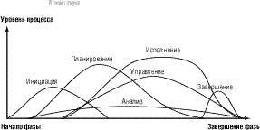

Рис. 1. Наложение групп процессов в фазе

Процессы управления проектами накладываются друг на друга и происходят с разной интенсивностью на всех стадиях проекта, как показано на рис. 1.
Кроме того, процессы управления проектами связаны своими результатами — результат выполнения одного становится исходной информацией для другого. Эти взаимосвязи проиллюстрированы на рис. 2.

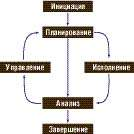

Рис. 2. Взаимосвязи групп процессов управления проектами в фазе

И наконец, имеются взаимосвязи групп процессов различных фаз проекта. Например, закрытие одной фазы может являться входом для инициации следующей фазы (пример: завершение фазы проектирования требует одобрения заказчиком проектной документации, которая необходима для начала реализации).

В реальном проекте фазы могут не только предшествовать друг другу, но и накладываться.

Повторение инициации на разных фазах проекта помогает контролировать актуальность выполнения проекта. Если необходимость его осуществления отпала, очередная инициация позволяет вовремя это установить и избежать излишних затрат.

### Взаимосвязи процессов

**Процессы инициации**

Инициация включает единственный подпроцесс — авторизацию, то есть решение начать следующую фазу проекта.

**Процессы планирования**

Планирование имеет большое значение для проекта, поскольку проект содержит то, что ранее не выполнялось. Естественно, что планирование включает сравнительно много процессов. Однако не следует считать, что управление проектами — это в основном планирование. Усилия, прилагаемые для планирования, следует соизмерять с целями проекта и полезностью полученной информации.

Напомним, что следует различать цели проекта и цели продукта проекта, под которым понимается продукция (или услуги), созданная или произведенная в результате исполнения проекта.

- Цели продукта — это свойства и функции, которыми должна обладать продукция проекта.
- Цели проекта — это работа, которую нужно выполнить для производства продукта с заданными свойствами.

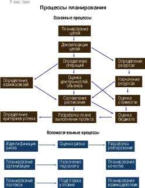

Рис. 3. Взаимосвязи процессов планирования

В ходе исполнения проекта эти процессы многократно повторяются. Изменениям могут подвергнуться цели проекта, его бюджет, ресурсы и т. д. Кроме того, планирование проекта — это не точная наука. Различные команды проекта могут разработать различные планы для одного и того же проекта. А пакеты управления проектами могут составить различные расписания выполнения работ при одних и тех же исходных данных.

Некоторые из процессов планирования имеют четкие логические и информационные взаимосвязи и выполняются в одном порядке практически во всех проектах. Так, например, сначала следует определить, из каких работ состоит проект, а уж затем рассчитывать сроки выполнения и стоимость проекта. Эти основные процессы выполняются по нескольку раз на протяжении каждой фазы проекта.

Кроме перечисленных основных процессов планирования имеется ряд вспомогательных процессов, необходимость в использовании которых сильно зависит от природы конкретного проекта:

- планирование качества — определение того, какие стандарты качества использовать в проекте, и того, как этих стандартов достичь;
- планирование организации — определение, документирование и назначение ролей, ответственности и взаимоотношений отчетности в организации;
- назначение персонала — назначение человеческих ресурсов на выполнение работ проекта;
- планирование взаимодействия — определение потоков информации и способов взаимодействия, необходимых для участников проекта;
- идентификация риска — определение и документирование событий риска, которые могут повлиять на проект;
оценка риска — оценка вероятностей наступления событий риска, их характеристик и влияния на проект;
- разработка реагирования — определение необходимых действий для предупреждения рисков и реакции на угрожающие события;
- планирование поставок — определение того, что, как и когда должно быть поставлено;
- подготовка условий — выработка требований к поставкам и определение потенциальных поставщиков.

Взаимосвязи между вспомогательными подпроцессами, как и само их наличие, в большой мере зависят от природы проекта.

**Процессы исполнения и контроля**

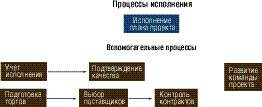

Рис. 4. Взаимосвязи процессов исполнения

Под исполнением подразумеваются процессы реализации составленного плана. Исполнение проекта должно регулярно измеряться и анализироваться для того, чтобы выявить отклонения от намеченного плана и оценить их влияние на проект. Регулярное измерение параметров проекта и идентификация возникающих отклонений далее также относится к процессам исполнения и именуется контролем исполнения. Контроль исполнения следует проводить по всем параметрам, входящим в план проекта.

Как и в планировании, процессы исполнения (рис. 4) можно подразделить на основные и вспомогательные.

К основным можно отнести сам процесс исполнения плана проекта.

Среди вспомогательных процессов отметим:

- учет исполнения — подготовка и распределение необходимой для участников проекта информации с требуемой периодичностью;
- подтверждение качества — регулярная оценка исполнения проекта с целью подтверждения соответствия принятым стандартам качества;
- подготовка предложений — сбор рекомендаций, отзывов, предложений, заявок и т. д.;
- выбор поставщиков — оценка предложений, выбор поставщиков и подрядчиков и заключение контрактов;
- контроль контрактов — контроль исполнения контрактов поставщиками и подрядчиками;
- развитие команды проекта — повышение квалификации участников команды проекта.

**Процессы анализа**

Процессы анализа включают как анализ плана, так и анализ исполнения проекта.

Анализ плана означает определение того, удовлетворяет ли составленный план исполнения проекта предъявляемым к проекту требованиям и ожиданиям участников проекта. Он выражается в оценке показателей плана командой и другими участниками проекта. На стадии планирования результатом анализа плана может быть принятие решения о необходимости изменения начальных условий и составления новой версии плана либо принятие разработанной версии в качестве базового плана проекта, который в дальнейшем служит основой для измерения исполнения. В дальнейшем изложении анализ плана не выделяется в качестве отдельной группы процессов, а включается в группу процессов планирования, делая эту группу процессов по своей природе итеративной. Таким образом, под процессами анализа в дальнейшем понимаются процессы анализа исполнения.

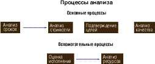

Рис. 5. Взаимосвязи процессов анализа

Процессы анализа исполнения предназначены для оценки состояния и прогноза успешности исполнения проекта согласно критериям и ограничениям, определенным на стадии планирования. В силу уникальности проектов эти критерии не являются универсальными, но для большинства проектов в число основных ограничений и критериев успеха входят цели, сроки, качество и стоимость работ проекта. При отрицательном прогнозе принимается решение о необходимости корректирующих воздействий, выбор которых осуществляется в процессах управления изменениями.

Процессы анализа также можно подразделить на основные и вспомогательные.

К основным относятся те процессы анализа, которые непосредственно связаны с целями проекта и показателями, характеризующими успешность исполнения проекта:

- анализ сроков — определение соответствия фактических и прогнозных сроков исполнения операций проекта директивным или запланированным;
- анализ стоимости — определение соответствия фактической и прогнозной стоимости операций и фаз проекта директивным или запланированным;
- анализ качества — мониторинг результатов с целью их проверки на соответствие принятым стандартам качества и определения путей устранения причин нежелательных результатов исполнения качества проекта;
- подтверждение целей — процесс формальной приемки результатов проекта его участниками (инвесторами, потребителями и т. д.).

Вспомогательные процессы анализа связаны с анализом факторов, влияющих на цели и критерии успеха проекта. Эти процессы включают:

- оценку исполнения — анализ результатов работы и распределение проектной информации с целью снабжения участников проекта данными о том, как используются ресурсы для достижения целей проекта;
- анализ ресурсов — определение соответствия фактической и прогнозной загрузки и производительности ресурсов запланированным, а также анализ соответствия фактического расхода материалов плановым значениям.

В число процессов анализа не включены анализ взаимодействия с целью оптимизации процедур обработки информации, анализ исполнения контрактов с целью своевременного внесения изменений и предотвращения споров и ряд других процессов, которые не носят регулярного характера (как анализ взаимодействия) либо составляют часть включенных процессов (как анализ контрактов).

В результате анализа либо принимается решение о продолжении исполнения проекта по намеченному ранее плану, либо определяется необходимость применения корректирующих воздействий.

**Процессы управления**

Управление исполнением проекта — это определение и применение необходимых управляющих воздействий с целью успешной реализации проекта. Если исполнение проекта происходит в соответствии с намеченным планом, то управление фактически сводится к исполнению — доведению до участников проекта плановых заданий и контролю их реализации. Эти процессы нами включены в процессы исполнения.

Рис. 6. Взаимосвязи процессов управления

Другое дело, если в процессе реализации возникли отклонения, анализ которых показал, что необходимо определение и применение корректирующих воздействий. В этом случае требуется найти оптимальные корректирующие воздействия, скорректировать план оставшихся работ и согласовать намеченные изменения со всеми участниками проекта. Итак, процессы управления предназначаются для определения, согласования и внесения необходимых изменений в план проекта. Такие процессы управления часто называются управлением изменениями и инициируются процессами анализа (рис. 6).

К основным процессам управления, встречающимся практически в каждом проекте, относятся:

- общее управление изменениями — определение, согласование, утверждение и принятие к исполнению корректирующих воздействий и координация изменений по всему проекту;
- управление ресурсами — внесение изменений в состав и назначения ресурсов на работы проекта;
- управление целями — корректировка целей проекта по результатам процессов анализа;
- управление качеством — разработка мероприятий по устранению причин неудовлетворительного исполнения.

Среди вспомогательных процессов управления отметим:

- управление рисками — реагирование на события и изменение рисков в процессе исполнения проекта;
- управление контрактами — координация работы (суб)подрядчиков, корректировка контрактов, разрешение конфликтов.

**Процессы завершения**

Рис. 7. Взаимосвязи процессов завершения

Завершение проекта сопровождается следующими процессами (рис. 7):
- закрытие контрактов — завершение и закрытие контрактов, включая разрешение всех возникших споров;
- административное завершение — подготовка, сбор и распределение информации, необходимой для формального завершения проекта.

Методы и технологии реализации перечисленных процессов, их интеграция составляют сущность управления проектами. Обратите внимание, что все перечисленные процессы приложимы к проектам любой природы — и к строительным, и к информационным, и к любым другим. Однако имеются и существенные отличия в управлении проектами различных типов. Следует также отметить, что успешное внедрение системы управления проектами связано с определенной организационной перестройкой и с внедрением специализированных программных средств.

## Средства автоматизации управления проектами

[1]: http://www.dialektika.com/PDF/5-8459-0538-9/part.pdf

[2]: https://www.intuit.ru/studies/courses/2194/272/info

[3]: https://www.intuit.ru/studies/courses/2194/272/lecture/27353

### Интеграционный подход

В контур управления проектом могут вовлекаться кроме системы календарно-ресурсного планирования (которая традиционно рассматривается как основа автоматизации управления проектами) еще и целый ряд других информационных систем, эксплуатирующихся на предприятии, которые могли бы использоваться при решении тех или иных задач управления проектом, - от статистических пакетов до систем финансового планирования и ERP-систем.

В организационной области интеграционный подход выражается в необходимости формирования управленческих структур, лежащих над штатным расписанием (руководящий комитет, группа управления, рабочая группа), и организационно-распорядительных документов, описывающих сквозные процессы, затрагивающие не только персонал проекта, но и постоянные структурные подразделения предприятия (ресурсные подразделения, финансовая служба, служба логистики, служба безопасности и т. д.).

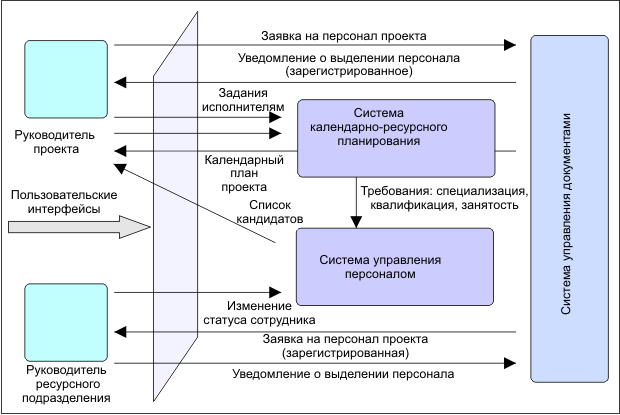

Рис. Процесс формирования команды проекта

В ИТ-области интеграционный подход выражается в необходимости создания контура взаимосвязанных продуктов, в котором СУП связывается с другими системами предприятия информационными и пользовательскими интерфейсами.

В обеих областях решения чаще всего не являются универсальными и разрабатываются под требования конкретных заказчиков.

### Основные направления автоматизации

Выделим два основных направления - автоматизация стандарта управления проектами и автоматизация функций управления проектами.

**Автоматизация стандарта управления** проектами может быть обеспечена средствами таких информационных технологий, как, например, система управления документами в документарной части стандарта или система управления деловыми процессами в процедурной части стандарта.

Стандарт управления проектами предприятия представляет собой совокупность документов, объясняющих или предписывающих, как, в какой последовательности, в какие сроки, с использованием каких шаблонов нужно выполнять те или иные действия в процессе управления проектами.

Одним из перспективных подходов является организация стандарта как базы знаний, которая обеспечивает все необходимые сервисы по обновлению и поиску документов, по организации взаимосвязей между документами, перекрестных ссылок и т. д. необходимости коллективной работы, в которую вовлекаются не только проектная группа, но и постоянные подразделения предприятия (ресурсные, функциональные, специализированные и т. д.).

В стандарте могут быть явно или неявно заложены требования к **автоматизации функций управления проектами**.

К основным областям деятельности по управлению проектами, подлежащим в той или иной степени автоматизации относятся:

- собственно управление проектами, которое в узком смысле обычно понимается как календарно -ресурсное планирование;
- формирование и ведение бюджета проекта;
- управление документами - как управленческими, так и являющимися результатами выполнения проекта;
- управление деловыми процессами в проектах, включая процессы согласования документов.

Отметим, что два последних пункта в данном случае относятся не к документам и процедурам стандарта, а к управленческим и содержательным документам конкретных проектов и организации коллективной работы с этими документами.

### Календарно-ресурсное и финансовое планирование

В части календарно-ресурсного планирования СУП должна обеспечить следующие возможности:

- формирование структуры декомпозиции работ (WBS-структуры) требуемой степени детализации;
- формирование календарного плана, содержащего продолжительность работ, их объем и стоимости, ограничения на даты начала и окончания, а также технологические зависимости между работами;
- формирование ограничений по проекту, определяющих перечень трудовых ресурсов, которые предполагается использовать в проекте с указанием доступного количества в определенное время;
- формирование детального плана работ, в котором работам назначены ресурсы - трудозатраты и материально-технические ресурсы;
- построение отчетов о состоянии проекта, в том числе с использованием различных аналитик.

В части финансового планирования СУП должна обеспечить следующие возможности:

- планирование и учет финансовых потоков, включая расчеты с заказчиком и субподрядчиками;
- формирование заданий исполнителям и учет реально затраченного времени;
- учет непроектного и нерабочего времени, отпусков и больничных листов;
- учет командировочных и административных расходов.

### Управление проектами в смежных областях

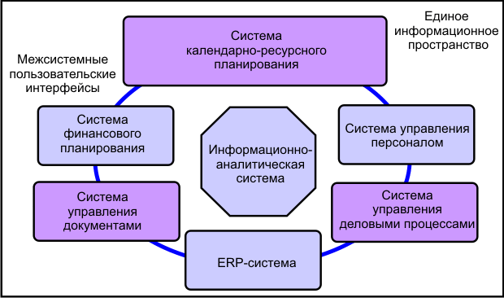

Рис. 7.2. Универсальная архитектура программных средств СУП

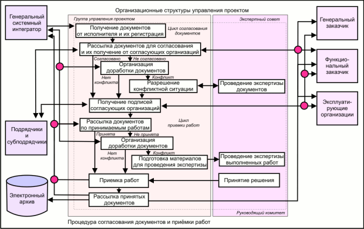

Рис. 7.3. Процедура согласования документов и приемки работ

### Управление документами и деловыми процессами

В проектах большое значение имеют не только традиционные функции управления документами, такие как поддержание версий документов и истории работы с ним, ведение архива, авторизация доступа, поддержание связей между документами (EDMS-функции).

Может быть, даже большее значение приобретают функции управления движением документов и контроля сроков их исполнения (workflow-функции).

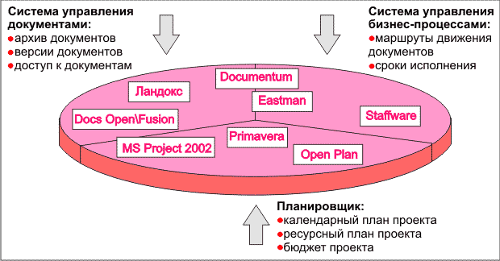

Рис. 7.4. Функциональные компоненты СУП

#### Управление документами

Управление документами реализуется с использованием базовой функциональности промышленных пакетов (Docs Open, Documentum).

#### Управление деловыми процессами

Функции управления движением документов и контроля сроков их исполнения реализуются с использованием базовой функциональности специализированных программных систем (Eastman) или промышленных пакетов управления документами (Documentum).

#### Расширение функциональности

Среди наиболее важных возможностей отметим следующие:

- наличие единой точки доступа ко всей информации, относящейся к проектам;
- создание новых документов с автоматическим связыванием их с конкретным фрагментом проекта (работой, узлом WBS) или с проектом в целом;
- переход к работе с документами непосредственно из среды календарно-ресурсного планирования, и наоборот;
- инициирование процесса прохождения (исполнения) документа, получение отметок об исполнении, согласовании, ознакомлении или отклонении документа;
- контроль состояния документа в процессе прохождения им определенного бизнес-процесса, связанного с управлением проектом (например, согласование и приемка работ).

#### Оpen Plan - профессиональная система управления проектами

- Расширенные возможности управления ресурсами

    Средства ресурсного планирования Оpen Plan позволяют управлять всеми видами ресурсов: людьми, оборудованием, материалами, финансами.

    Гибкость работы со всеми видами ресурсов достигается за счет:

    - возможности создания иерархической структуры ресурсов;
    - назначения им квалификации;
    - описания изменений доступности и стоимости во времени;
    - автоматического поиска ресурса, оптимального с точки зрения загрузки, для назначения на задачу по указанному пользователем требованию.

- Анализ рисков
    
    Встроенные в Оpen Plan аналитические инструменты, базирующиеся на методе Monte Carlo, позволяют определить возможные риски в оценке срока завершения отдельных работ, целых этапов и всего проекта.

- Мультипроектный анализ

    Стандартные средства Оpen Plan позволяют интегрировать независимые проекты, предоставляя возможность управления ресурсами и финансами с учетом приоритетности проектов, проводимых предприятием, и получению консолидированной отчетности.

    Возможно частичное или полное резервирование ресурсов под конкретный проект.

- Гибкость и многогранность

    В Оpen Plan предусмотрены механизмы вывода информации в виде диаграмм, таблиц, гистограмм, S-кривых и т.д.

    Однажды разработанные шаблоны представлений сохраняются и могут быть подключены к любому проекту.

- Открытая архитектура

    Выбор формата хранения данных по проекту зависит от пользователя.

    Допустимыми являются собственный формат Оpen Plan, а также форматы Oracle, MS SQL Server, Sybase, xBase.

- Оптимальная реализация распределенной системы управления в компании - две версии системы - Professional - Desktop

    И профессиональная, и настольная версия системы включают в себя полный комплект функций по управлению проектами.

    Совместное использование профессиональной и "облегченной" версий системы управления проектами позволяет не только учесть потребности всех групп пользователей, но и значительно снизить стоимость решения.

### Планирование и контроль проекта.

#### Средства создания модели проекта.

Оpen Plan поддерживает следующие структурные модели проекта:

- Сетевая модель проекта (иерархическая система сетевых моделей проекта) с заданной степенью детализации работ;
- Структурная декомпозиция работ;
- Дерево ресурсов;
- Иерархические календари;
- Иерархическая система кодирования работ для получения отчетов по модели проекта в нужных разрезах - по фазам жизненного цикла, по ответственным, .по статьям затрат, по географическому признаку и т.д.

##### Сетевая модель

Менеджер имеет возможность формировать неограниченное число уровней иерархии проекта, перемещать задачи внутри иерархического уровня, вставлять новые задачи на любой уровень.

Сетевая модель проекта отображается в форматах:

- Диаграмма Гантта. Существует возможность настраивать количество и свойства колонок, создавать вычисляемые поля, накладывать существующие и генерировать новые фильтры, настраивать параметры визуализации графической части - подробность временного масштаба, цвета отрезков для работ, удовлетворяющих различным критериям.

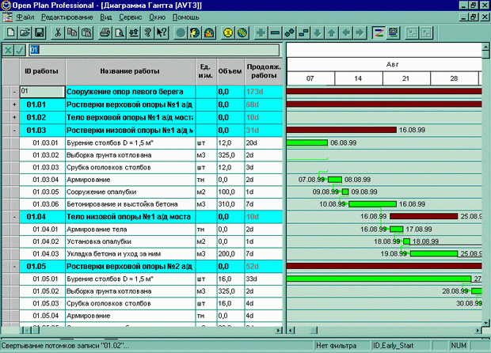

Рис. 7.5. Окно Диаграммы Гантта в Оpen Plan

- PERT-диаграмма (сетевая диаграмма).

Предусмотрены такие операции, как:

- изменение формы блока;
- визуальное выделение работ, отвечающих заданному критерию;
- маркирование начатых или полностью выполненных работ;
- выбор полей для блока работы на сетевой диаграмме.

Рис. 7.6. Окно Сетевой диаграммы в Оpen Plan

При планировании работ возможно задавать различные настраиваемые характеристики работ.

### Иерархическая структура календарей

В Оpen Plan иерархическая структура календарей позволяет построить систему шаблонов рабочего времени с учетом наследования календарем-потомком свойств родителя.

При помощи свойств наследования календарей можно построить, например, следующую систему рабочего времени: основной календарь - календарь всей компании, потомки основного календаря - календари департаментов, то есть в них учитываются изменения в рабочем времени, принятые на уровне всей компании.

### Иерархическая система кодов работ

Дополнительным средством структуризации в Оpen Plan является универсальная система кодов.

Благодаря назначению кодов различным элементам проекта на основании заданной иерархической структуры кодов достигается суммирование данных соответствующего уровня для получения отчетов, отражающих информацию в желаемом разрезе.

Разработанная иерархическая структура кодов сохраняется в специальном файле и может быть использована для других проектов.

В качестве примера можно рассмотреть описание структуры затрат на проект с помощью кодов.

Предположим, что в организации приняты два вида затрат: внутренние и внешние (оплата работ Системного интегратора).

Системный интегратор разбивает затраты по статьям: прямые поставки, собственные услуги и работы внешних консультантов.

Структуру затрат, таким образом, можно представить в виде следующей иерархической структуры.

В верхней части прямоугольника представлены коды, а в нижней - описание.

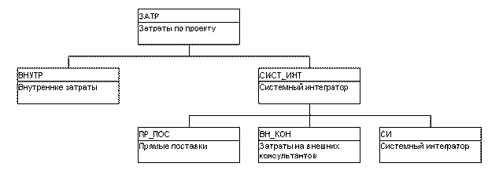

## Иерархическая структура кодов в Оpen Plan

Кроме того, в Оpen Plan предусмотрена возможность создания иерархической структуры ресурсов (исполнителей, оборудования, материалов, затрат), что позволяет выбирать степень детализации при просмотре загрузки ресурсов, проводить планирование и назначение ресурсов на суммарном уровне.

Коды затрат назначаются работам, по которым эти затраты проводятся.

Это позволяет просмотреть упорядоченный по видам затрат список работ и оценить итоги по каждой группе.

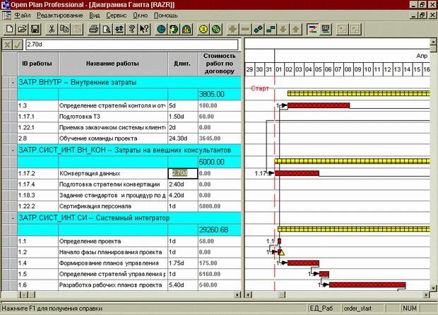

Рис. 7.7. Диаграмма Гантта с разбиением списка работ на группы по кодам в Оpen Plan

### Планирование и контроль сроков

Процедуры временного анализа, заложенные в Оpen Plan, позволяют определить:

- общую продолжительность проекта;
- возможную раннюю дату его окончания;
- даты начала и окончания задач проекта;
- временные резервы;
- критические задачи.

По умолчанию Оpen Plan требует указывать длительность работ.

В некоторых областях, например, в строительстве, проект изначально планируется не по длительностям работ, а по их объемам (по трудоемкости).

В Оpen Plan эта возможность реализуется через расчет длительности на основании назначенных ресурсов (задавая их мощность) или по алгоритму, задаваемому пользователем.

Отображение критического пути проекта возможно несколькими способами, включая выделение цветом на экране или получения отчетов, содержащих информацию только по задачам критического пути.

### Планирование и контроль ресурсов

#### Типы ресурсов

Все многообразие видов ресурсов целесообразно, с точки зрения модельного описания задач календарного планирования, разделить на следующие основные типы:

- возобновляемые ресурсы (их называют еще воспроизводимыми, не складируемыми, не накапливаемыми);
- расходуемые ресурсы;
- ресурсы с ограниченным сроком годности ( можно запасать в течение некоторого времени, по истечении которого неиспользованные остатки не переносятся на следующие интервалы и "пропадают").

Иерархическая структура ресурсов

В Оpen Plan предусмотрена возможность создания иерархической структуры ресурсов (исполнителей, оборудования, материалов, затрат), что позволяет выбирать степень детализации при просмотре загрузки ресурсов, проводить планирование и назначение ресурсов на суммарном уровне.

Объединение ресурсов в один пул предоставляет средство для описания иерархической структуры ресурсов, просмотра назначений ресурсов с желаемым уровнем детализации.

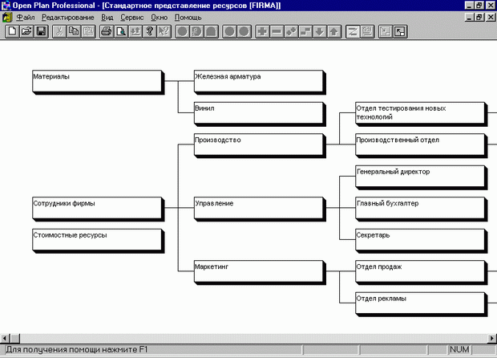

Рис. 7.8. Иерархическая структура ресурсов в Оpen Plan

Общие характеристики ресурса

Отнесение ресурсов к разнообразным классам (людские, оборудование, финансовые) дает возможность получать отчеты о загрузке и затратах только по интересующей группе.

При стоимостном анализе затраты подразделяются на финансовые затраты и затраты на ресурсы.

Количество имеющихся ресурсов на любой момент реализации проекта описывается параметром доступность.

Для возобновляемых ресурсов этот параметр определяется доступным количеством в определенные временные интервалы.

Для расходуемого ресурса - это общее количество и дата, с которого он поступает в распоряжение.

Для ресурсов с ограниченным сроком - общее количество и временной отрезок, за которое ресурс можно употребить.

В Оpen Plan имеется опция, задающая изменение стоимости ресурсов во времени - удорожание,т.е. если после какого-то срока происходит удорожание или удешевление ресурса, то изменения отражается в результатах стоимостного анализа.

Квалификации ресурсов

В системе определено понятие квалификаций.

Для работы можно определить потребность в количестве ресурсных единиц и квалификации ресурса. Это предоставит возможность менеджеру проекта не назначать на ее выполнение конкретный ресурс, а с помощью Оpen Plan выбрать наименее загруженный в период выполнения работы ресурс с необходимой квалификацией (например, может ли сотрудник провести учебные курсы по внедряемой в организации системе - квалификация УЧ_КУРСЫ).

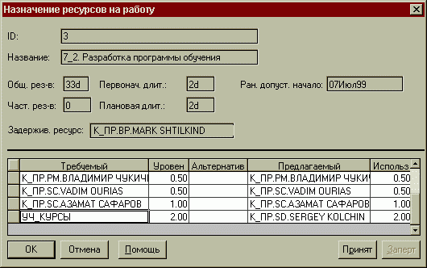

Менеджер принимает решение о том, устраивает ли его предложенный системой ресурс - нажатие кнопки Принят, при которой квалификация переходит в графу Альтернативный, а предлагаемый ресурс в Требуемый, то есть при новом запуске процедуры ресурсного планирования, если предлагаемый ресурс К_ПР.SD.SERGEY KOLCHIN окажется задействованным на других работах, будет учитываться, что можно предложить на работу другого исполнителя, обладающего данной квалификацией.

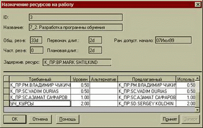

Нажатие кнопки Принят переводит к тому, что Предлагаемый ресурс становится Требуемый, а нужная квалификация переводится в поле Альтернативный.

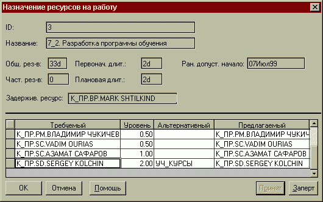

Менеджер может зафиксировать предложенный вариант назначения - "окончательно и бесповоротно" назначить исполнителя на работу (нажатие кнопки Заперт переводит предлагаемый ресурс в Требуемый, однако колонка Альтернативный остается пустой).

#### Резервирование ресурсов

Оpen Plan обладает средствами для резервирования ресурсов на проекты, при этом резервирование может проводиться для любого уровня иерархии ресурсов.

Например, можно зарезервировать целый отдел или конкретного человека под проект.

При резервировании конкретного специалиста поддерживаются два режима:

- Полное резервирование ресурса
- Частичное резервирование ресурса

При резервировании конкретного ресурса, в отличие от резервирования пула, можно проводить резервирование на определенный интервал времени или на определенную степень загрузки.

Например, специалист может быть зарезервирован на 50% рабочего времени для данного проекта на заданные 6 месяцев.

#### Назначение ресурсов на задачу

Оpen Plan предоставляет два способа описания расходования ресурса на работе:

- количество ресурсов, используемых за день работы
- общее количество ресурсов на все время работы, определив характер - кривой расходования (увеличение количества в начале, конце, середине, равномерная загрузка).

#### Анализ ресурсного обеспечения работ проекта

Менеджер проекта может задавать собственные правила для планирования ресурсов, в том числе определять приоритетность работ. При стандартной схеме планирования сначала должны выполняться работы, лежащие на критическом пути, поскольку промедление в их выполнении приведет к задержке всего проекта.

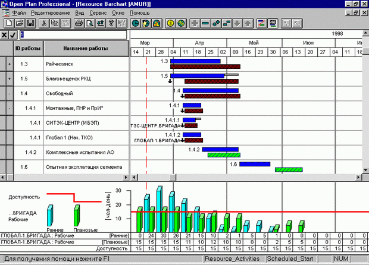

Рис. 7.9. Окно Диаграммы Гантта с ресурсной гистограммой

### Планирование и контроль затрат

Анализ стоимости работ на основании фактической выработки
Основу системы контроля стоимостей на основании фактической выработки образуют:

- Плановая Стоимость Запланированных Работ,
- Плановая Стоимость Выполненных Работ,
- Фактическая Стоимость Выполненных Работ

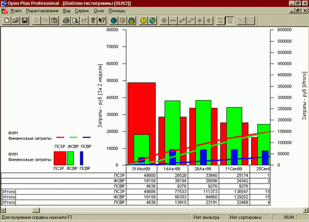

Рис. 7.10. Гистограмма затрат в Оpen Plan

### Анализ рисков

Анализ рисков в Оpen Plan реализуется следующими средствами:

- Процедуры ввода вероятностного распределения для избранных или всех работ проекта.
- Выполнение анализа рисков по методу Монте-Карло для определения вклада вероятностей в даты проекта.
- Предоставление отчетов, которые используются для анализа влияния неопределенностей на реализацию проекта.

Аналитические инструменты базируются на методе Монте-Карло.

Для задач, по которым менеджер затрудняется определить сроки выполнения, задаются пессимистические и оптимистические оценки длительности.

Гистограмма рисков дает детальную картину вероятностного распределения высчитанных дат для ключевых работ в проекте.

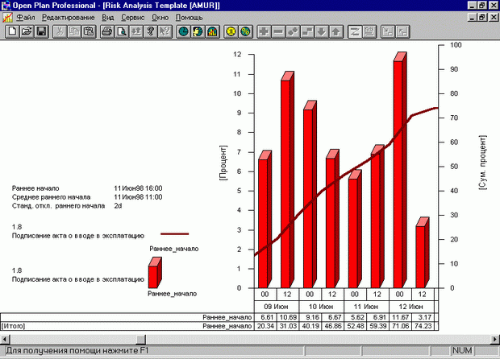

Рис. 7.11. Гистограмма рисков по дате раннего начала работы в Оpen Plan

Гистограмма показывает процент случаев, приведших к выпадению раннего начала на указанный интервал.

По левой оси Оpen Plan рисует шкалу с процентами итераций анализа рисков, при которых даты попали в определенный интервал.

На правой оси представлено суммарное распределение дат.

### Многопроектное планирование.

Объединение проектов служит двум целям:

- во-первых, можно проводить анализ загрузки ресурсов и расходования финансов на них в масштабах проектов всего предприятия,
- во-вторых, есть возможность обеспечить среду для интегрированного программного управления большими комплексными проектами, разбитыми на мелкие подпроекты.

У каждого подпроекта может быть свой файл ресурсов.

Можно задавать связи между работами различных внешних подпроектов, которые потом будут видны в отдельных файлах проекта.
