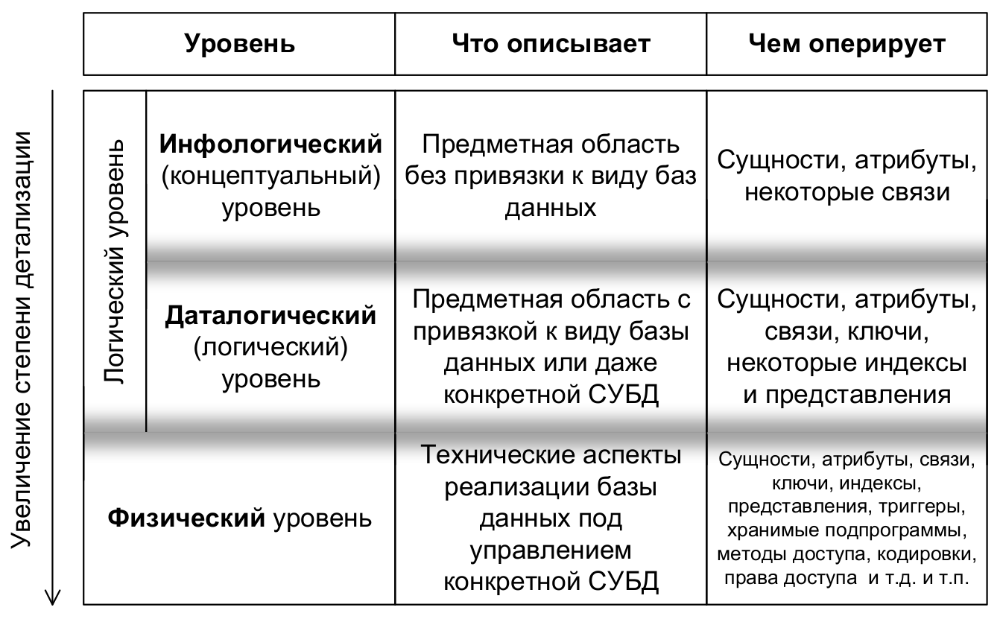
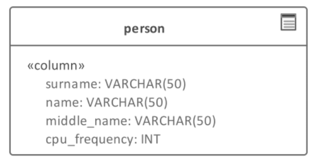
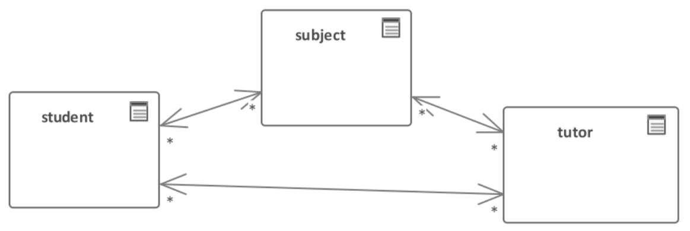
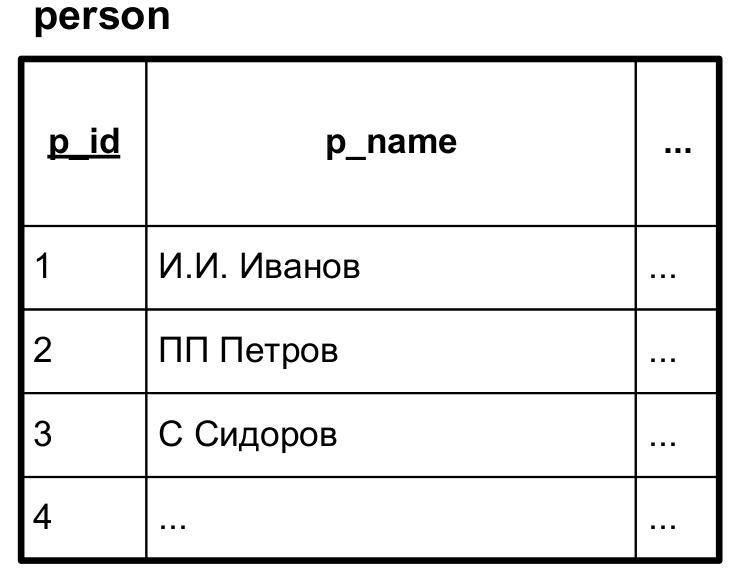
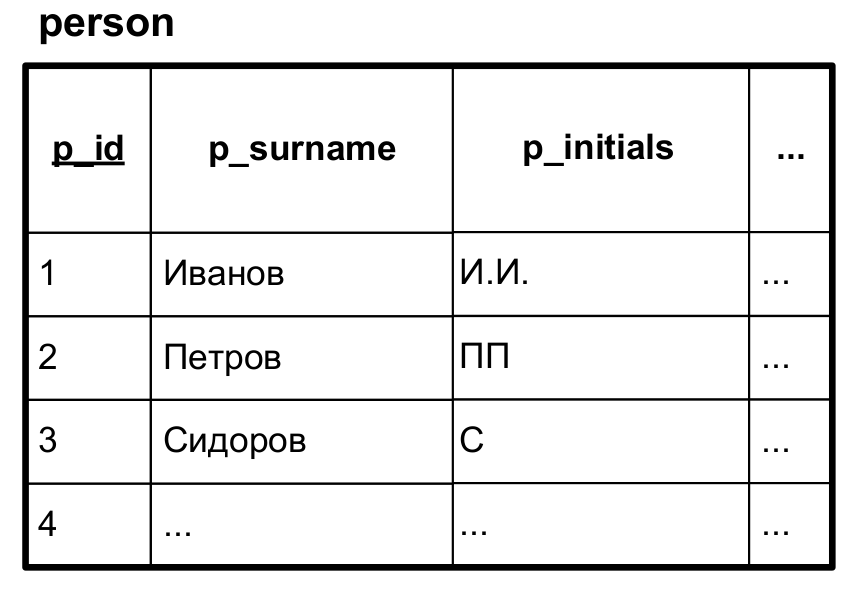

[содержание](/readme.md)

# Проектирование баз данных.

>Основано на книге "Реляционные базы данных в примерах", полный текст книги см. в каталоге `docs` этого репозитория

<!-- 
https://pro-prof.com/forums/topic/db_example 
https://habr.com/ru/post/193136/
https://metanit.com/sql/tutorial/
https://se.ifmo.ru/education/documentation/dbguide/
https://se.ifmo.ru/education/documentation/dbguide/
-->

## Данные и базы данных

**Данные (data)** — поддающееся различной интерпретации представление информации в формализованном виде, пригодном для передачи, связи, или обработки.

*Упрощённо: информация, организованная по определённым правилам.*

Ключевых моментов здесь два.

**Во-первых**, информация должна быть представлена в формализованном виде (иными словами, подчиняться неким правилам). Для наглядности приведём пример неформализованного и формализованного представления информации:


**Во-вторых**, различная интерпретация позволяет нам по-разному воспринимать одни и те же данные в разном контексте. Например, поле pass (пропуск) может быть интерпретировано так:

* номер пропуска сотрудника;
* поле с уникальным значением;
* число;
* естественный первичный ключ отношения;
* кластерный индекс {110} таблицы;
* и т.д.

Когда данных становится достаточно много, появляется необходимость в их организации в более сложные структуры.

**База данных (database)** — совокупность данных, организованных в соответствии с концептуальной структурой, описывающей характеристики этих данных и взаимоотношения между соответствующими сущностями и поддерживающей одну или более областей применения.

*Упрощённо: большой объём данных, взаимосвязь между которыми построена по специальным правилам.*

Итак, база данных — это большая совокупность данных, подчинённых дополнительным правилам. Такие правила зависят от вида базы данных, а за их соблюдение отвечает *система управления базами данных* (СУБД).

**Система управления базами данных, СУБД (database management system, DBMS)** — система (базирующаяся на программном и аппаратном обеспечении) для описания, создания, использования, контроля и управления базами данных.

*Упрощённо: программное средство, управляющее базами данных.*

>Стоит отметить важный для начинающих факт (т.к. очень часто можно услышать просьбу «показать СУБД»): подавляющее большинство СУБД не имеет никакого «человеческого интерфейса», представляет собой сервис (демон в *nix-системах) и взаимодействует с внешним миром по специальным протоколам (чаще всего, построенным поверх TCP/IP). Такие известные продукты как MySQL Workbench, Microsoft SQL Server
Management Studio, Oracle SQL Developer и им подобные — это не СУБД, это лишь клиентское программное обеспечение, позволяющее нам взаимодействовать с СУБД.

Итак, СУБД — это специальное программное обеспечение, предназначенное для управления базами данных. Поскольку в этой книге мы будем говорить исключительно о реляционных базах
данных и реляционных же СУБД, можно сразу отметить, что взаимодействие с такими СУБД происходит путём выполнения SQL-запросов.

## Моделирование баз данных

**Модель базы данных (database model)** — способ описания базы данных с помощью формализованного (в т.ч. графического) языка на некотором уровне абстракции.

*Упрощённо: описание базы данных, по которому она потом будет создана (по аналогии с проектом здания, по которому оно потом будет построено).*

Особый интерес в данном определении представляет упоминание уровня абстракции. Получается, что у одной и той же базы данных может быть несколько моделей, отличающихся уровнем детализации и целью (например, общее описание данных и их взаимосвязей, описание структур данных, описание способов хранения и обработки данных и т.д.)

Отсюда мы переходим к понятию уровней (этапов) моделирования и проектирования баз данных, т.е. к построению нескольких взаимосвязанных моделей базы данных, каждая из которых
призвана служить своей особой цели.

Прежде, чем мы рассмотрим каждый уровень  необходимо дать
ещё одно предельно важное пояснение, без которого вся эта информация может оказаться бесполезной.

Как правило, студенты, изучающие базы данных и проектирующие их в
рамках лабораторных, курсовых и дипломных работ, искренне не понимают, зачем нужны какие-то уровни, если можно просто «взять и спроектировать базу».

Можно. В том случае, если база примитивная (до нескольких десятков таблиц), предметная область ограничивается уровнем сложности университетской работы, исходные требования просты и не меняются. Т.е. если вы проектируете однотипные и/или простые базы данных, вся
эта «научная заумь» вам не понадобится. (Особенно, если вы сами и заказчик, и исполнитель, и ничто не мешает опустить руки и поменять требования, как только возникнет достаточно сложная задача.)

Но! Представьте, что предметная область вам совершенно неизвестна (например, вы проектируете не очередную базу данных библиотеки, а информационное хранилище для исследовательского центра кардиохирургии).

Добавьте к этому тот факт, что сам заказчик (в лице представителей этого центра) не сильно разбирается в информационных технологиях, и многое объясняет вам «на пальцах», причём в процессе работы многократно выясняется, что что-то было забыто, что-то вы не так поняли, что-то поменялось, чего-то не знал сам заказчик и т.д.

Причём в этой ситуации, как правило, не удастся отказаться от реализации того или иного требования просто потому, что оно слишком сложное и/или вы не очень понимаете, как его реализовать.

Также добавьте к этому тот факт, что база данных может состоять из сотен (и даже тысяч) таблиц, что к ней предъявляются достаточно жёсткие требования по надёжности, производительности и иным показателям качества.

Учтите, что проектировать такую базу вы будете не в одиночку, а в составе команды (и всем участникам надо будет гарантированно понимать друг друга, согласовывать свои действия, подменять друг друга).

В такой ситуации структурированный, управляемый, регламентированный подход к моделированию и проектированию критически необходим — без него создать работоспособную базу данных не получится. Никак.

Возвращаемся к уровням моделирования.



**Инфологический (концептуальный) уровень (conceptual level)** моделирования ставит своей целью создание т.н. концептуальной модели (conceptual model), отражающей основные сущности предметной области, их атрибуты и связи (возможно, пока не все)
между сущностями.

*Упрощённо: описание предметов и явлений реального мира, данные о которых потом будут помещены в базу данных.*

Если продлить рисунок «вверх», к ещё меньшему уровню детализации, от непосредствен о работы с базами данных мы перейдём к области бизнес-анализа (business analysis), выявления
общих требований заказчика и параметров предметной области.

**Даталогический уровень (часто его называют просто «логическим», logical level)** моделирования детализирует инфологическую модель, превращая её в логическую схему, на которой ранее выявленные сущности, атрибуты и связи оформляются согласно правилам моделирования для выбранного вида базы данных (возможно,
даже с учётом конкретной СУБД).

*Упрощённо: описание предметов и явлений реального мира по правилам выбранной СУБД.*

Во многих средствах проектирования баз данных, поддерживающих разделение лишь на «логическое» и «физическое» проектирование именно этот уровень называется «логическим».

**Физический уровень (physical level)** моделирования продолжает детализацию и позволяет создать т.н. физическую схему, на которой максимально учитываются технические особенности работы конкретной СУБД и её возможности по организации и управлению структурами разрабатываемой базы данных и данными в ней.

*Упрощённо: описание составных частей базы данных таким образом, чтобы на его основе можно было автоматически сгенерировать SQL-код для создания базы данных.*

Если продлить рисунок «вниз», к ещё большему уровню детализации, от непосредственно работы с базами данных мы перейдём к области системного администрирования (конфигурирования СУБД, операционной системы, сетевой инфраструктуры и т.д.)

Требования предъявляемые к любой базе данных (и, соответственно, её моделям):
* адекватность предметной области;
* удобство использования;
* производительность;
* защищённость данных.

**Адекватность предметной области** выражается в том, что база данных должна позволять выполнять все необходимые операции, которые объективно нужны в реальной жизни в контексте той работы, для которой предназначена база данных.

Лучше всего выполнить это требование позволяет моделирование на инфологическом уровне (т.к. этот уровень ближе всего находится к предметной области и требованиям заказчика), но для выявления некоторых ошибок неизбежно придётся анализировать и модели на других уровнях.

А суть этого требования наиболее наглядно отражают примеры его нарушения.

Сначала рассмотрим совершенно тривиальный пример. Допустим, для хранения информации о человеке было спроектировано отношение, представленное следующей схемой:



Сразу же бросается в глаза, что `cpu_frequency` (частота процессора) не является характеристикой человека (по крайней мере, на сегодняшний день). А потому совершенно непонятно, что писать в это поле.

Если немного подумать, также становится очевидным, что в этом отношении не хватает многих свойств, ведь характеристики человека не заканчиваются на фамилии, имени и отчестве.

Рассмотрим чуть более близкий к реальности пример ошибки проектирования (здесь даже обойдёмся без рисунка). Допустим, мы разрабатываем базу данных для автоматизации работы
деканата университета. Соответствующее приложение уже введено в эксплуатацию, прошло какое-то время, и тут нам звонят заказчики и спрашивают: «А как отметить, что студент ушёл в академический отпуск?»

И мы вдруг понимаем, что... никак. Что мы не подумали о такой ситуации, и ни приложение (с которым работают сотрудники деканата), ни наша база данных не имеют возможности сохранить соответствующие данные.

Эта ситуация является неприятной (придётся много переделывать), но она меркнет по сравнению со следующей — худшей из того, что может случиться.

Рассмотрим третий (по-настоящему страшный) пример, продолжив тему автоматизации работы деканата. Допустим, что информация о взаимосвязи предметов, преподавателей и студентов хранилась в базе данных, представленной (упрощённо) следующей схемой:



Все три отношения попарно соединены связями «многие ко многим», ведь действительно:
* каждый студент изучает много предметов, и каждый предмет изучает много студентов;
* каждый предмет может вести много преподавателей, и каждый преподаватель может вести много предметов;
* каждый студент обучается у многих преподавателей, и каждый преподаватель обучает многих студентов.

Допустим, разработанный продукт успешно введён в эксплуатацию, прошло много лет, и тут заказчик звонит и интересуется, как для очень важного отчёта показать список студентов, у которых профессор Иванов вёл высшую математику.

Никак. Эта информация не сохранялась в базе данных. Там есть лишь информация о том, что профессор Иванов (вместе с ещё тремя десятками коллег) вёл высшую математику (и ещё восемь предметов). Есть информация о том, какие студенты учились у профессора Иванова, и какие студенты изучали высшую математику. Но никак невозможно определить, что вот именно этот конкретный студент изучал именно высшую математику (а не другой предмет) именно у профессора Иванова (а не у кого-то из его коллег).

Этот пример потому и назван самым страшным, что тут ничего нельзя исправить. Даже если мы доработаем приложение и базу данных, требуемая заказчиком информация всё равно останется утерянной навсегда. А ведь заказчик был полностью уверен, что она есть и доступна.

В принципе, при грамотном подходе к сбору требований такие ошибки (как в примерах про деканат) выявляются и при нисходящем проектировании, но намного легче заметить их при восходящем проектировании, когда мы задумываемся о том, какие конкретно задачи будет решать пользователь, и к выполнению каких запросов к базе данных это приведёт.

Существует ещё одна форма нарушения адекватности предметной области — нарушения нормализации, которые приводят к возникновению аномалий операций с данными. Но этот вопрос настолько важен и обширен, что ему посвящён отдельный раздел.

**Удобство использования** (в контексте проектирования баз данных) не связано с удобством для конечного пользователя (который может даже не знать, что в мире существуют какие-то базы данных). Этот термин относится к использованию базы данных в следующих ситуациях:

* при взаимодействии с приложениями (в основном, здесь упор делается на простоту и лёгкость написания безошибочных запросов);
* в процессе её дальнейшего развития (и тогда говорят о таких показателях качества, как поддерживаемость и сопровождаемость).

Таким образом, речь идёт об «удобстве для программиста». Почему это важно? Чем лучше база данных отвечает данному требованию, тем проще и быстрее программисты могут организовать взаимодействие с ней, допуская минимум ошибок и с меньшими затратами решая вопросы
быстродействия, безопасности и т.д.

Прекрасной иллюстрацией разницы в удобстве использования базы данных в зависимости от её модели, может быть пример с определением номера дня недели и номера недели в месяце на основе указанной даты.
Пока дата хранится в виде единого значения, приходится использовать запрос на целый экран, причём для каждой СУБД в нём появляется своя «магия» в виде числовых констант, слабо документированных параметров функций и тому подобных крайне опасных с точки зрения возможности допустить ошибку моментов.

Но модель базы данных можно изменить. Можно хранить искомые значения в самой таблице (и вычислять их триггерами) или создать представление (и «замаскировать» соответствующий запрос в нём). Тогда для программиста, организующего взаимодействие приложения
с базой данных задача сведётся к тривиальному SELECT длиной в пару строк.

Рассмотрим ещё один очень простой и наглядный пример нарушения удобства использования. Предположим, что в некоторой базе данных фамилии и инициалы людей сохранены следующим образом:



Здесь фамилия и инициалы сохранены в одной колонке, причём инициалы идут перед фамилией (и для наглядности представлены в нескольких вариантах, что вполне может встретиться в реальной жизни). Как теперь упорядочить список людей по алфавиту по фамилии?

Теоретически можно написать функцию, учитывающую множество вариантов написания инициалов (например, «А.А.», «АА», «А. А. », «А .» и т.д. и т.п.), убирающую эту информацию и возвращающую только фамилию. И использовать эту функцию в запросах следующего вида:

```sql 
-- Упорядочивание списка людей по фамилии по алфавиту с удалением инициалов
SELECT *
FROM `person`
ORDER BY REMOVE_INITIALS(`p_name`) ASC
```

Но такая функция будет сложной, медленной, может не учитывать некоторые варианты написания инициалов, а также сделает невозможным использование индексов для ускорения выполнения запроса (или потребует создания отдельного индекса над результатами своих вы-
числений).

Но всего лишь стоит поместить фамилии и инициалы в раздельные колонки, и ситуация мгновенно упрощается:



Теперь нет необходимости как бы то ни было предварительно обрабатывать информацию, и значение фамилии можно использовать напрямую, что устраняет все недостатки решения с использованием функции. И запрос упрощается до следующего вида:

```sql 
-- Упорядочивание списка людей по фамилии по алфавиту с удалением инициалов
SELECT *
FROM `person`
ORDER BY `p_surname` ASC
```

Подобные ситуации могут встречаться чаще, чем кажется. И их продумывание позволяет ощутимо повысить удобство использования базы данных.

**Производительность** можно смело считать одним из самых больных вопросов в работе с базами данных, и решение соответствующих задач может быть описано несколькими отдельными книгами. Что стоит делать на любой стадии проектирования — так это как минимум помнить о
производительности и не допускать создания таких моделей, в которых на ней будет поставлен крест изначально.

Например, мы знаем, что для работы приложения понадобится очень часто выяснять количество записей в разных таблицах (как общее, так и количество неких особенных записей). В общем случае такие операции будут работать очень медленно, но с использованием кэширующих таблиц и материализованных представлений можно ценой небольшой потери производительности других операций в этом конкретном случае свести время выполнения запроса почти к нулю.

Как правило, проблемы с удобством использования приводят к увеличению количества проблем с производительностью, т.к. сложные запросы тяжелее оптимизировать.

**Защищённость данных** стоит воспринимать не только в контексте безопасности (ограничения доступа), но и в том смысле, что с данными не должно происходить никаких случайных непредвиденных изменений. Для достижения этой цели порой приходится продумывать огромное количество ограничений, реализуемых через специфические объекты базы данных и даже через отдельный интерфейс в виде набора хранимых процедур.

## Реляционная модель данных

**Реляционная модель (relational model)** — математическая теория, описывающая структуры данных, логику контроля целостности данных и правила управления данными.

*Упрощённо: модель для описания реляционных баз данных.*

На момент изобретения именно эта модель предоставила полный комплекс решений по описанию базы данных, контролю целостности данных и управлению данными — в отличие от множества других альтернативных подходов, позволяющих реализовать лишь часть задач. Сейчас кажется странным, что были какие-то другие «неполноценные решения», но напомним: это было в те времена, когда компьютер занимал несколько комнат и стоил, как половина здания, в кото-
ром находится.

## Создание базы данных и таблиц

Для качественного проектирования базы данных существуют различные методики, различные последовательности шагов или этапов, которые во многом похожи. И в целом мы можем выделить следующие этапы:

* Выделение *сущностей* и их *атрибутов*, которые будут храниться в базе данных, и формирование по ним таблиц. Атомизация сложных атрибутов на более простые.

* Определение уникальных идентификаторов (первичных ключей) объектов, которые хранятся в строках таблицы

* Определение отношений между таблицами с помощью внешних ключей

* Нормализация базы данных

На первом этапе происходит выделение *сущностей*. **Сущность** (entity) представляет тип объектов, которые должны храниться в базе данных. Каждая таблица в базе данных должна представлять одну сущность. Как правило, сущности соответствуют объектам из реального мира.

У каждой сущности определяют набор *атрибутов*. **Атрибут** представляет свойство, которое описывает некоторую характеристику объекта.

Каждый столбец должен хранить один атрибут сущности. А каждая строка представляет отдельный объект или экземпляр сущности.

### Восходящий и нисходящий подходы

При проектировании базы данных на этапе выделения сущностей и их атрибутов мы можем использовать два подхода: восходящий и нисходящий.

Восходящий подход предусматривает выделение необходимых атрибутов, которые надо сохранить в бд. Затем выделенные атрибуты группируются в сущности, для которых впоследствии создается таблицы. Такой подход больше подходит для проектирования небольших баз данных с небольшим количеством атрибутов.

Например, нам дана следующая информация:

```
Том посещает курс по математике, который преподает профессор Смит.
Сэм посещает курс по математике, которые преподает профессор Смит.
Том посещает курс по языку JavaScript, который преподает ассистент Адамс.
Боб посещает курс по алгоритмам, который преподает ассистент Адамс.
Сэм имеет следующие электронный адрес sam@gmail.com и телефон +1235768789.
```

Какие данные из этой информации мы можем сохранить: 
* имя студента, 
* название курса, 
* должность преподавателя, 
* имя преподавателя, 
* электронный адрес студента
* телефон стулента.

Затем мы можем выполнить группировку по сущностям, к которым относятся эти данные:

Студент

Преподаватель

Курс

Имя студента

Название курса

Дата рождения студента

Электронный адрес студента

Телефон студента

Имя преподавателя

Должность преподавателя

Название курса

Имя студента

Имя преподавателя

Название курса

Так, те данные, которые имеются позволяют выделить три сущности: студент, преподаватель и курс. При этом мы вполне можем добавлять какие-то недостающие данные. Также следует отметить, что какие-то данные могут иметь отношение к разным сущностям. Например, курс хранит информацию о студенте, которые его посещает. А студент хранит информацию о посещаемом курсе. Подобная избыточность данных решается на последующих шагах проектирования в процессе нормализации базы данных.

Но подобных атрибутов может оказаться очень много: сотни и даже тысячи. И в этом случае более оптимальным будет нисходящий подход. Данный подход подразумевает выявление сущностей. Затем происходит анализ сущностей, выявляются связи между ними, а потом и атрибуты сущностей.

То есть в данном случае мы могли бы сразу определить, что нам надо хранить данные по студентам, курсам и преподавателям. Затем в рамках каждой сущности выявить атрибуты

Например, у сущности "Студент" мы могли бы выделить такие атрибуты, как имя студента, его адрес, телефон, рост, вес, год его рождения. В тоже время нам надо учитывать не вообще все свойства, которые в принципе могут быть у сущности "Студент", а только те, которые имеют значение в рамках описываемой системы. Вряд ли в данном случае играют роль такие свойства как рост или вес студента, поэтому мы можем их вычеркнуть из списка атрибутов при проектировании таблицы.

Иногда подходы комбинируются. Для описания разных частей системы могут использоваться разные подходы. А затем их результаты объединяются.

Атомизация атрибутов
При определении атрибутов происходит разделение сложных комплексных элементов на более простые. Так, в случае с именем студента мы можем его разбить на собственно имя и фамилию. Это позволит впоследствии выполнять операции с эти подэлементами отдельно, например, сортировать студентов только по фамилии.

То же самое касается адреса - мы можем сохранить весь адрес целиком, а можем разбить его на части - дом, улицу, город и т.д.

В то же время возможность разделения одного элемента на подэлементы не всегда может быть востребованной. В ряде задач это может быть просто не нужно. Выделять необходимо только те элементы, которые действительно нужны.

В соответствии с этим аспектом мы можем выделить у сущности "Студент" следующие атрибуты: имя студента, фамилия студента, год рождения, город, улица, дом, телефон.

Домен
Каждый атрибут имеет домен (domain). Домен представляет набор допустимых значений для одного или нескольких атрибутов. По сути домен определяет смысл и источник значений, которые могут иметь атрибуты.

Домены могут отличаться для разных атрибутов, но также несколько атрибутов могут иметь один домен.

Например, выше были определены атрибуты сущности Студент. Определим используемые домены:

Имя. Домен представляет все возможные имена, которые могут использоваться. Каждое имя представляет строку длиной максимум 20 символов (маловероятно, что нам могут встретиться имена свыше 20 символов).

Фамилия. Домен представляет все возможные фамилии, которые могут использоваться. Каждая фамилия представляет строку длиной максимум 20 символов.

Год рождения. Домен представляет все года рождения. Каждый год является числовым значением от 1950 до 2017.

Город. Домен представляет все города текущей страны. Каждый город представляет строку длиной максимум 50 символов.

Улица. Домен представляет все улицы текущей страны. Каждая улица представляет строку длиной максимум 50 символов.

Дом. Домен представляет все возможные номера домов. Каждый номер дома является числом от 1 до, скажем, 10000.

Телефон. Домен представляет все возможные телефонные номера. Каждый номер является строкой длиной в 11 символов.

Определяя домен, мы сразу видим, какие данные и каких типов будут хранить атрибуты. Какое-то другое значение, которое не соответствует домену, атрибут иметь не может.

В примере выше каждый атрибут имеет свой домен. Но, домены могут совпадать. Например, если бы сущность содержала бы следующие два атрибута: город рождения и город проживания, то домен бы совпадал и был бы одним и тем же для обоих атрибутов.

Определитель NULL
При определении атрибутов и их домена необходимо проанализировать, а может ли у атрибута отсутствовать значение. Определитель NULL позволяет задать отсутствие значения. Например, в примере выше у студента обязательно должно быть какое-либо имя, поэтому недопустима ситуация, когда у атрибута, который представляет имя, отсутствует значение.

В то же время студент может не иметь телефонного номера или в рамках системы телефон не обязателен. Поэтому на этапе проектирования таблицы можно указать, что данный атрибут позволяет значение NULL.

Как правило, большинство современных реляционных СУБД поддерживают определитель NULL и позволяют задать его допустимость для столбца таблицы.