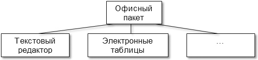
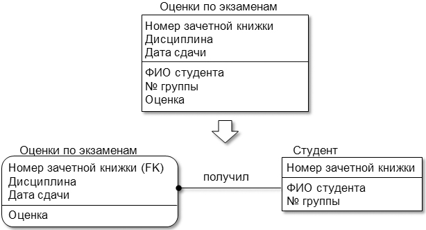
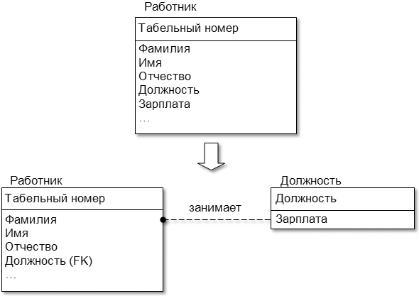

<table style="width: 100%;"><tr><td style="width: 40%;">
<a href="../articles/5_1_1_10_uml_uc_spec.md">Спецификация вариантов использования
</a></td><td style="width: 20%;">
<a href="../readme.md">Содержание
</a></td><td style="width: 40%;">
<a href="../articles/5_1_1_1_data_dictionary.md">Словарь данных
</a></td><tr></table>

>Основано на [этих](https://sites.google.com/site/anisimovkhv/learning/pris/lecture) лекциях.

# Основы проектирования баз данных.

Традиционно процедуру проектирования базы данных разбивают на три этапа, каждый из которых завершается созданием соответствующей информационной модели.

[**Этап 1-й. Концептуальное проектирование**](#Концептуальное-проектирование) – создание схемы БД, включающего определение важнейших сущностей (таблиц) и связей между ними, но не зависящего от модели БД (иерархической, сетевой, реляционной и т.д.) и физической реализации (целевой СУБД).

[**Этап 2-й. Логическое проектирование**](#Логическое-проектирование) – развитие концептуальной схемы БД с учетом принимаемой модели (иерархической, сетевой, реляционной и т.д.).

[**Этап 3-й. Физическое проектирование**](#Физическое-проектирование) – развитие логической схемы БД с учетом выбранной целевой СУБД.

Концептуальное и логическое проектирование вместе называют также **инфологическим** или **семантическим** проектированием.

В настоящее время для проектирования БД активно используются CASE-средства, в основном ориентированные на использование **ERD (Entity – Relationship Diagrams, диаграммы «сущность–связь»)**. С их помощью определяются важные для предметной области объекты (сущности), отношения друг с другом (связи) и их свойства (атрибуты). Следует отметить, что средства проектирования ERD в основном ориентированы на реляционные базы данных (РБД), и если существует необходимость проектирования другой системы, скажем объектно-ориентированной, то лучше избрать другие методы проектирования.

**ERD** были впервые предложены П. Ченом в 1976 г. Основные элементы **ERD** перечислены ниже.

**Сущность (таблица, в РБД – отношение)** – набор (класс) однотипных реальных либо воображаемых объектов, имеющих существенное значение для рассматриваемой предметной области, информация о которых подлежит хранению. Примеры сущностей: работник, деталь, ведомость, результаты сдачи экзамена и т.д.

**Экземпляр сущности (запись, строка, в РБД – кортеж)** – уникально идентифицируемый объект.

**Связь** – некоторая ассоциация между двумя сущностями, значимая для рассматриваемой предметной области. Примерами связей могут являться родственные отношения «отец–сын», производственные – «начальник-подчиненный» или произвольные – «иметь в собственности», «обладать свойством».

**Атрибут (столбец, поле)** – свойство сущности или связи.

При использовании CASE-средств вначале обычно строится логическая схема БД в виде диаграммы с указанием сущностей и связей между ними. Логической схемой называется универсальное описание структуры данных, независимое от конечной реализации базы данных и аппаратной платформы. На основании полученной логической схемы переходят к физической схеме данных. Физическая схема представляет собой диаграмму, содержащую всю необходимую информацию для генерации БД для конкретной СУБД или даже конкретной версии СУБД. Если в логической схеме не имеет значения, какие идентификаторы носят таблицы и атрибуты, тип данных атрибутов и т.д., то в физической схеме должно быть полное описание БД в соответствии с принятым в ней синтаксисом, с указанием типов атрибутов, триггеров, хранимых процедур и т.д. По одной и той же логической схеме можно создать несколько физических. Например, на основании логической схемы сформировать физические для промышленных СУБД (ORACLE, MySQL, DB2, MS SQL Server и др.) и их различный версий. На основании физической схемы можно сгенерировать либо саму БД или DDL-скрипт, который, в свою очередь, может быть использован для генерации БД.

>**Система управления базами данных, СУБД** — система (базирующаяся на программном и аппаратном обеспечении) для описания, создания, использования, контроля и управления базами данных.
>
>*Упрощённо: программное средство, управляющее базами данных.*
>
>Стоит отметить важный для начинающих факт (т.к. очень часто можно услышать просьбу «показать СУБД»): подавляющее большинство СУБД не имеет никакого «человеческого интерфейса», представляет собой сервис (демон в *nix-системах) и взаимодействует с внешним миром по специальным протоколам (чаще всего, построенным поверх TCP/IP). Такие известные продукты как MySQL Workbench, Microsoft SQL Server
Management Studio, Oracle SQL Developer и им подобные — это не СУБД, это лишь клиентское программное обеспечение, позволяющее нам взаимодействовать с СУБД.

Следует отметить, что современные СУБД обладают своими встроенными средствами визуального моделирования данных. Некоторые из них даже поддерживают классические нотации ERD. Недостатками такого моделирования является построение только физической схемы данных и невозможность быстрого перехода на другую СУБД, если такое решение принято. Достоинством этого подхода является более полное использование потенциала СУБД, ведь разработчики СУБД лучше других знают ее особенности и возможности.

## Концептуальное проектирование

Цель **концептуального проектирования** – создание концептуальной схемы данных на основе представлений о предметной области каждого отдельного типа пользователей. Концептуальная схема представляет собой описание основных сущностей (таблиц) и связей между ними без учета принятой модели БД и синтаксиса целевой СУБД. Часто на такой схеме отображаются только имена сущностей (таблиц) без указания их атрибутов. Представление пользователя включает в себя данные, необходимые конкретному пользователю для принятия решений или выполнения некоторого задания.

Ниже рассматривается последовательность шагов при концептуальном проектировании.

1. Выделение сущностей.

    Первый шаг в построении концептуальной схемы данных состоит в определении основных объектов (сущностей), которые могут интересовать пользователя и, следовательно, должны храниться в БД.

    Возможные трудности в определении объектов связаны с использованием постановщиками задачи:

    - примеров и аналогий при описании объектов (например, вместо обобщающего понятия «работник» они могут упоминать его функции или занимаемую должность: «руководитель», «ответственный», «контролер», «заместитель»);

    - синонимов (например, «допускаемая скорость» и «установленная скорость», «разработка» и «проект», «барьерное место» и «ограничение скорости»);

    - омонимов (например, «программа» может обозначать компьютерную программу, план предстоящей работы или программу телепередач).

    Далеко не всегда очевидно то, чем является определенный объект – сущностью, связью или атрибутом. Например, как следует классифицировать «семейный брак»? На практике это понятие можно вполне обоснованно отнести к любой из упомянутых категорий. Анализ является субъективным процессом, поэтому различные разработчики могут создавать разные, но вполне допустимые интерпретации одного и того же факта. Выбор варианта в значительной степени зависит от здравого смысла и опыта проектировщика.

    Каждая сущность должна обладать некоторыми свойствами:

    - должна иметь уникальное имя, и к одному и тому же имени должна всегда применяться одна и та же интерпретация;

    - обладать одним или несколькими атрибутами, которые либо принадлежат сущности, либо наследуются через связь;

    - обладать одним или несколькими атрибутами (первичным ключом), которые однозначно идентифицируют каждый экземпляр сущности, т. е. делают уникальной каждую строку таблицы;

    - может обладать любым количеством связей с другими сущностями.

    ~~В графической нотации IDEF1X для отображения сущности используются обозначения, изображенные на следующем рисунке.~~

2. Определение атрибутов.

    Самый простой способ определения атрибутов – после идентификации сущности, задать себе вопрос «Какую информацию требуется хранить о …?». Существенно помочь в определении атрибутов могут различные бумажные и электронные формы и документы, используемые в организации при решении задачи. Это могут быть формы, содержащие как исходную информацию (например, «Ведомость возвышений наружного рельса в кривых»), так и результаты обработки данных (например, «Форма № 1»).

    Выявленные атрибуты могут быть следующих типов:

    - простой (атомарный, неделимый) – состоит из одного компонента с независимым существованием (например, «должность работника», «зарплата», «норма непогашенного ускорения», «радиус кривой» и т.д.);

    - составной (псевдоатомарный) – состоит из нескольких компонентов (например, «ФИО», «адрес» и т. д.). Степень атомарности атрибутов, закладываемая в модель, определяется разработчиком. Если от системы не требуется выборки всех клиентов с фамилией Иванов или проживающих на улице Комсомольской, то составные атрибуты можно не разбивать на атомарные;

    - однозначный – содержит только одно значение для одного экземпляра сущности (например, у кривой в плане может быть только одно значение радиуса, угла поворота, возвышения наружного рельса и т.д.);

    - многозначный – содержит несколько значений (например, у одного отделения компании может быть несколько контактных телефонов);

    - производный (вычисляемый) – значение атрибута может быть определено по значениям других атрибутов (например, «возраст» может быть определен по «дате рождения» и текущей дате, установленной на компьютере);

    - ключевой – служит для уникальной идентификации экземпляра сущности (входит в состав первичного ключа), быстрого поиска экземпляров сущности или задания связи между экземплярами родительской и дочерней сущностей;

    - неключевой (описательный);

    - обязательный – при вводе нового экземпляра в сущность или редактировании обязательно указывается допустимое значение атрибута, т.е. после указанных действий оно не может быть неопределенным (**NOT NULL**). Атрибуты, входящие в первичный ключ сущности, являются обязательными.

    После определения атрибутов задаются их домены (области допустимых значений), например:

    - наименование участка – набор из букв русского алфавита длиной не более 60 символов;

    - поворот кривой – допустимые значения «Л» (влево) и «П» (вправо);

    - радиус кривой – положительное число не более 4 цифр.

    Задание доменов определяет набор допустимых значений для атрибута (нескольких атрибутов), а также тип, размер и формат атрибута (атрибутов).

3. Определение ключей.

    На основании выделенного множества атрибутов для сущности определяется набор ключей. **Ключ** – один или несколько атрибутов сущности, служащих для однозначной идентификации её экземпляров, их быстрого поиска или задания связи между экземплярами родительской и дочерней сущностей. Ключи, используемые для однозначной идентификации экземпляров, подразделяются на следующие типы:

    - **суперключ** (superkey) – атрибут или множество атрибутов, которое единственным образом идентифицирует экземпляр сущности. Суперключ может содержать «лишние» атрибуты, которые необязательны для уникальной идентификации экземпляра. При правильном проектировании структуры БД суперключом в каждой сущности (таблице) будет являться полный набор ее атрибутов;

    - **потенциальный ключ** (potential key) – суперключ, содержащий минимально необходимый набор атрибутов, единственным образом идентифицирующих экземпляр сущности. Сущность может иметь несколько потенциальных ключей. Если ключ состоит из нескольких атрибутов, то он называется составным ключом. Среди всего множества потенциальных ключей для однозначной идентификации экземпляров выбирают один, так называемый первичный ключ, используемый в дальнейшем для установления связей с другими сущностями;

    - **первичный ключ** (primary key) – потенциальный ключ, который выбран для уникальной идентификации экземпляров внутри сущности;

    - **альтернативные ключи** (alternative key) – потенциальные ключи, которые не выбраны в качестве первичного ключа.

    Рассмотрим пример. Пусть имеется таблица, содержащая сведения о студенте, со следующими столбцами:

    - фамилия;
    - имя;
    - отчество;
    - дата рождения;
    - место рождения;
    - номер группы;
    - ИНН;
    - номер пенсионного страхового свидетельства (НПСС);
    - номер паспорта;
    - дата выдачи паспорта;
    - организация, выдавшая паспорт.

    Для каждого экземпляра (записи) в качестве суперключа может быть выбран весь набор атрибутов. Потенциальными ключами (уникальными идентификаторами) могут быть:

    - ИНН;
    - номер пенсионного страхового свидетельства;
    - номер паспорта.

    В качестве уникального идентификатора можно было бы выбрать совокупность атрибутов «Фамилия»+«Имя»+«Отчество», если вероятность учебы в вузе двух полных тезок была бы равна нулю.

    Если в сущности нет ни одной комбинации атрибутов, подходящей на роль потенциального ключа, то в сущность добавляют отдельный атрибут – суррогатный ключ (искусственный ключ, surrogate key). Как правило, тип такого атрибута выбирают символьный или числовой. В некоторых СУБД имеются встроенные средства генерации и поддержания значений суррогатных ключей. Также стоит отметить, что некоторые разработчики вместо поиска потенциальных ключей и выбора из них первичного в каждую сущность добавляют искусственный атрибут, который в дальнейшем и используют в качестве первичного ключа.

    Если потенциальных ключей несколько, то для выбора первичного ключа рекомендуется придерживаться следующих правил:

    - количество атрибутов, входящих в ключ, должно быть минимальным (желательно, чтобы ключ был атомарным, т.е. состоял из одного атрибута);

    - размер ключа в байтах должен быть как можно короче;

    - тип домена ключа – числовой. При выборе символьных атрибутов в ключ часто возникают проблемы с вводом ошибочных значений (путают регистр букв; добавляют лишние пробелы; используют буквы, пишущиеся на разных языках одинаково). В числовых атрибутах вероятность ошибки при вводе значения меньше;

    - вероятность изменения значений ключа была наименьшей (например, «Номер пенсионного страхового свидетельства» более постоянный параметр, чем «ИНН» или «Номер паспорта»);

    - с ключом проще всего работать пользователям (например, «Номер пенсионного страхового свидетельства» – это набор из 11 цифр, а «Номер паспорта» зависит от его вида: гражданина СССР, гражданина РФ или зарубежный).

    Если некий атрибут (набор атрибутов) присутствует в нескольких сущностях, то его наличие обычно отражает наличие связи между экземплярами этих сущностей. В каждой связи одна сущность выступает как родительская, а другая – в роли дочерней. Это означает, что один экземпляр родительской сущности может быть связан с несколькими экземплярами дочерней. Для поддержки этих связей обе сущности должны содержать наборы атрибутов, по которым они связаны. В родительской сущности это первичный ключ. В дочерней сущности для моделирования связи должен присутствовать набор атрибутов, соответствующий первичному ключу родительской. Этот набор атрибутов в дочерней сущности принято называть внешним ключом (foreign key).

4. Определение связей.

    Наиболее характерными типами связей между сущностями являются:

    - связи типа «часть–целое», определяемые обычно глаголами «состоит из», «включает» и т.п.;

    - классифицирующие связи (например, «тип – подтип», «множество – элемент», «общее – частное» и т. п.);

    - производственные связи (например, «начальник–подчиненный»);

    - функциональные связи, определяемые обычно глаголами «производит», «влияет», «зависит от», «вычисляется по» и т. п.

    Среди них выделяются только те связи, которые необходимы для удовлетворения требований к разработке БД.

    Связь характеризуется следующим набором параметров:

    - именем – указывается в виде глагола и определяет семантику (смысловую подоплеку) связи;

    - кратностью (кардинальность, мощность): один-к-одному (1:1), один-ко-многим (1:N) и многие-ко-многим (N:M, N = M или N <> M). Кратность показывает, какое количество экземпляров одной сущности определяется экземпляром другой. Например, на одном участке (описывается строкой таблицы «Участки») может быть один, два и более путей (каждый путь описывается отдельной строкой в таблице «Пути»). В данном случае связь 1:N. Другой пример: один путь проходит через несколько раздельных пунктов и через один раздельный пункт может проходить несколько путей – cвязь N:M;

    - типом: идентифицирующая (атрибуты одной сущности, называемые внешним ключом, входят в состав дочерней и служат для идентификации ее экземпляров, т.е. входят в ее первичный ключ) и неидентифицирующая (внешний ключ имеется в дочерней сущности, но не входит в состав первичного ключа);

    - обязательностью: обязательная (при вводе нового экземпляра в дочернюю сущность заполнение атрибутов внешнего ключа обязательно и введенные значения должны совпадать со значениями атрибутов первичного ключа какого-либо экземпляра родительской сущности) и необязательная (заполнение атрибутов внешнего ключа в экземпляре дочерней сущности необязательно или введенные значения не совпадают со значениями атрибутов первичного ключа ни одного экземпляра родительской сущности);

    - степенью участия – количеством сущностей, участвующих в связи. В основном между сущностями существуют бинарные связи, т.е. ассоциации, связывающие две сущности (степень участия равна 2). Например, «Участок» состоит из «Путей». В то же время по степени участия возможны следующие типы связей:

        * унарная (рекурсивная) – сущность может быть связана сама с собой. Например, в таблице «Работники» могут быть записи и по подчиненным, и по их начальникам. Тогда возможна связь «начальник» – «подчиненный», определенная на одной таблице;

        * тернарная – связывает три сущности. Например, «Студент» на «Сессии» получил «Оценку по дисциплине»;

        * кватернарная и т.д.

    В методологии IDEF1X степень участия может быть только унарной или бинарной. Связи большей степени приводятся к бинарному виду.

    Внешний вид связи на диаграммах IDEF1X указывает на ее мощность, тип и обязательность.

## Логическое проектирование

Цель **логического проектирования** – развить концептуальную схему БД с учетом принимаемой модели БД (иерархической, сетевой, реляционной и т. д.).

Примем в качестве модели реляционную БД в третьей нормальной форме (набор нормализованных отношений с кратностью связей 1:N). Поэтому необходимо будет проверить концептуальную схему с помощью методов нормализации и контроля выполнения транзакций. Транзакция – одно действие или их последовательность, выполняемых как единое целое одним или несколькими пользователями (прикладными программами) с целью осуществления доступа к БД и изменению ее содержимого.

1. Удаление и проверка элементов, не отвечающих принятой модели данных.

    * Удаление связей N:M.

        Если в концептуальной схеме присутствуют связи N:M, то их следует устранить путем определения промежуточной сущности. Связь N:M заменяется двумя связями типа 1:M, устанавливаемыми со вновь созданной сущностью.

    * Удаление связей с атрибутами.

        Связи с атрибутами должны быть преобразованы в сущности.

    * Удаление сложных связей (со степенью участия более 2).

        Сложную связь заменяют необходимым количеством бинарных связей 1:N со вновь созданной сущностью, которая и показывает эту связь.

    * Удаление рекурсивных связей (со степенью участия 1).

        Рекурсивную связь заменяют, определив дополнительную сущность и необходимое количество связей.

    * Удаление многозначных атрибутов (атрибутов имеющих несколько значений).

        Многозначность устраняется путем введения новой сущности и связи 1:N. Например, несколько номеров организации выводятся в отдельную сущность "Телефоны". Данное преобразование, помимо соответствия реляционной модели данных, также позволяет хранить любое количество телефонов по одному филиалу.

    * Удаление избыточных связей.

        Связь является избыточной, если одна и та же информация может быть получена не только через нее, но и с помощью другой связи.

    * Перепроверка связей 1:1.

        В процессе определения сущностей могли быть созданы сущности, которые на самом деле являются одной. В этом случае их следует объединить. Например, сущности «Филиал» и «Руководитель филиала» лучше объединить.        

        В то же время не всегда можно выполнить такое объединение.

        

        Офисный пакет состоит из строго определенного набора компонентов, причем каждый из них характеризуется большим количеством атрибутов. Кроме этого, некоторые компоненты могут отсутствовать в офисном пакете (например, почтовый клиент) или они не входят в его состав (выступают в качестве самостоятельного продукта). В описанных случаях рекомендуется не объединять сущности.

2. Проверка модели с помощью правил нормализации.

    Основная идея нормализации заключается в том, чтобы каждый факт хранился в одном месте, т. е. чтобы не было дублирования данных. Многие из требований нормализации, как правило, уже учитываются при выполнении предыдущих шагов проектирования.

    Ниже приводятся краткие сведения из теории нормализации.

    Проектирование реляционной БД представляет собой пошаговый процесс создания набора отношений (таблиц, сущностей), в которых отсутствуют нежелательные функциональные зависимости.

    **Функциональная зависимость** определяется следующим образом. Пусть A и B – произвольные наборы атрибутов отношения. Тогда B функционально зависит от A (A → B), в том и только в том случае, если каждому значению A соответствует в точности одно значение B. Левая часть функциональной зависимости (A) называется **детерминантом**, а правая (B) – **зависимой частью**. В частности, в отношении А может быть первичным ключом, а B – набором неключевых атрибутов, так как одному значению первичного ключа в точности соответствует одно значение набора неключевых атрибутов.

    Если в БД отсутствуют нежелательные функциональные зависимости, то это обеспечивает минимальную избыточность данных, что в свою очередь ведет к уменьшению объема памяти, необходимой для хранения данных. Процесс устранения таких зависимостей получил название нормализация. Она выполняется в виде последовательности тестов для некоторого отношения (таблицы, сущности) с целью проверки его соответствия (или несоответствия) набору ограничений для заданной нормальной формы.

    Процесс нормализации впервые был предложен Э.Ф. Коддом в 1972 г. Сначала было предложено три вида нормальных форм (1NF, 2NF и 3NF). Затем Р. Бойсом и Э.Ф. Коддом (1974 г.) было сформулировано более строгое определение третьей нормальной формы, которое получило название нормальная форма Бойса–Кодда (BCNF). Вслед за BCNF появились определения четвертой (4NF) и пятой (5NF или PJNF) нормальных форм (Р. Фагин, 1977 и 1979 г.). На практике нормальные формы более высоких порядков используются крайне редко. При проектировании БД, как правило, ограничиваются третьей нормальной формой, что позволяет предотвратить возможное возникновение избыточности данных и аномалии обновлений.

    <!-- 
    https://habr.com/ru/post/129195/ 
    https://info-comp.ru/database-normalization
    -->

    **1НФ**. Отношение находится в первой нормальной форме (сокращённо 1НФ), если все его атрибуты атомарны, то есть если ни один из его атрибутов нельзя разделить на более простые атрибуты, которые соответствуют каким-то другим свойствам описываемой сущности.

    Степень неделимости (атомарности), т.е. решение о том, следует разбивать неатомарный атрибут на атомарные или оставить его псевдоатомарным, определяется проектировщиком БД исходя из конкретных условий. Если при обработке таблиц нет необходимости различать атомарные составляющие псевдоатомарного атрибута, то его можно не делить (например, атрибуты «Фамилия, имя, отчество», «Адрес» и т. д.).

    **2NF**. Отношение находится во 2NF, если оно находится в 1NF, и каждый неключевой атрибут характеризуется полной функциональной зависимостью от первичного ключа.

    Полная функциональная зависимость определяется следующим образом. В некотором отношении атрибут В полностью зависит от атрибута А, если атрибут В функционально зависит от полного значения атрибута А и не зависит от какого-либо подмножества полного значения атрибута А.

    Например, таблица «Оценки по экзаменам» характеризуется следующим набором атрибутов {Номер зачетной книжки, Дисциплина, Дата сдачи, ФИО студента, № группы, Оценка}. Очевидно, что первичным ключом является набор {Номер зачетной книжки, Дисциплина, Дата сдачи}. Полной функциональной зависимостью обладает только один неключевой атрибут «Оценка». Атрибуты «ФИО студента» и «№ группы» могут быть однозначно определены по части первичного ключа – «Номер зачетной книжки». Таким образом, требуется разбиение исходной таблицы на две.

    

    **3NF**. Отношение находится в 3NF, если оно находится во 2NF и никакой неключевой атрибут функционально не зависит от другого неключевого атрибута, т. е. нет транзитивных зависимостей.

    **Транзитивная зависимость**. Если для атрибутов А, В и С некоторого отношения существуют зависимости вида А → В и В → С, то атрибут С транзитивно зависит от атрибута А через атрибут В.

    Например, таблица «Работник» характеризуется набором атрибутов {Табельный номер, Фамилия, Имя, Отчество, Должность, Зарплата, …}, первичный ключ – {Табельный номер}. В этой таблице от первичного ключа («Табельный номер») зависит неключевой атрибут «Должность», а от «Должности» другой неключевой атрибут «Зарплата». Для приведения к 3NF необходимо добавить новую таблицу.

    

3. Определение требований поддержки целостности данных.

    Ограничения целостности данных представляют собой ограничения, которые вводятся с целью предотвращения помещения в базу противоречивых данных.

    К этим ограничениям относятся:

    - обязательные данные – атрибуты, которые всегда должны содержать одно из допустимых значений (NOT NULL). Например, поворот кривой (влево или вправо) должен быть обязательно задан. Обязательными также являются все атрибуты, входящие в первичный ключ сущности;

    - домены – наборы допустимых значений для атрибута. Например, радиус кривой должен быть положительным числом не более 4 цифр или поворот кривой может принимать одно из двух допустимых значений – «Л» (влево) или «П» (вправо);

    - бизнес-правила (бизнес-ограничения) – ограничения, принятые в рассматриваемой предметной области. Например, сумма длин переходных кривых не должна быть более длины всей кривой, километраж начала или конца кривой должен быть в пределах общего километража пути и т.д.;

    - ссылочная целостность – набор ограничений, определяющих действия при вставке, обновлении и удалении записей (экземпляров сущности). Например:

        * при наличии обязательной связи вставка записи в дочернюю сущность требует обязательного заполнения атрибутов внешнего ключа, и введенному значению должна соответствовать запись родительской сущности;

        * аналогичное требование выдвигается при обновлении внешнего ключа в дочерней сущности;

        * удаление записи из дочерней сущности или вставка записи в родительскую не вызывают нарушения ссылочной целостности;

        * удаление записи в родительской сущности может требовать удаления всех связанных записей в дочерней сущности.

    Автоматическая поддержка всех видов ограничений целостности возможна за счет использования операторов SQL.

    Ссылочная целостность может быть обеспечена за счет использования триггеров. **Триггер** – это хранимая в БД процедура, исполняемая СУБД автоматически при удалении (DELETE), вставке (INSERT) или обновлении (UPDATE) записи. Набор команд, входящих в триггер, зависит от принятой стратегии (типа триггера) поддержания целостности:

    - RESTRICT или NO ACTION - на выполнение действия накладываются ограничения (условия). Под NO ACTION обычно понимаются триггеры, срабатывающие на изменение данных в родительской таблице. При соблюдении условий изменения в БД принимаются, в противном случае отклоняются;

    - CASCADE - каскадное удаление или обновление данных;

    - SET NULL - установка неопределенного значения (NULL) в атрибутах внешнего ключа дочерней таблицы;

    - SET DEFAULT - установка значения по умолчанию в атрибутах внешнего ключа дочерней таблицы;

    - NO CHECK, NONE или IGNORE - поддержка ссылочной целостности встроенными средствами СУБД не предусмотрена, но может быть выполнена за счет клиентских программ, работающих с БД. Данная стратегия принята в СУБД по умолчанию.

## Физическое проектирование

Цель **физического проектирования** – преобразование логической схемы с учетом синтаксиса, семантики и возможностей выбранной целевой СУБД.

В связи с тем, что методология физического проектирования существенно зависит от выбранной целевой СУБД, ограничимся лишь общими рекомендациями.

1. Анализ необходимости введения контролируемой избыточности.

    При реализации проекта часто для достижения большей эффективности системы требуется снизить требования к уровню нормализации отношений, т.е. внести некоторую избыточность данных. Процесс внесения таких изменений в БД называется **денормализацией**.

    Рассмотрим некоторые виды денормализации, которые в определенных случаях могут существенно повысить производительность системы.

    * **Использование производных данных.**

        С точки зрения физического проектирования любой производный атрибут либо может сохраняться в БД, либо при каждом обращении к нему его значение будет вычисляться заново. Например, длина пути может каждый раз вычисляться по таблицам «Действительный километраж» и «Неправильные пикеты» либо храниться как атрибут в таблице «Пути».

        Проектировщик при использовании производных данных должен оценить:

        - дополнительную стоимость хранения производных данных и поддержки согласованности с текущими значениями тех данных, на основании которых они вычисляются, т.е. минусы хранения производных данных;

        - издержки на выполнение вычислений значений производных атрибутов при каждом обращении к ним – плюсы.

    * **Дублирование атрибутов.**

        * Объединение отношений, связанных 1:1.

            Даже в тех случаях, когда связь между двумя сущностями необязательная, стоит подумать об их объединении, с учетом того, что часть полей в записях не будет заполняться. Руководствоваться в таких случаях надо из тех же соображений, что и при использовании производных данных. В частности, ~~на рис. 7.4 и 7.5~~ показана иерархия наследования для сущности «Сотрудник». Если эту иерархию оставить без изменений, то в БД будет четыре сущности (Сотрудник, Постоянный сотрудник, Совместитель и Консультант), согласованность которых надо будет поддерживать. При выполнении запросов по сотрудникам надо будет оперировать четырьмя таблицами. Таким образом, лучше в БД вместо иерархии запроектировать одну таблицу, в которую добавить атрибуты «Ставка» и «Организация». В атрибуте «Ставка» для постоянного сотрудника всегда будет значение «1», а атрибут «Организация» будет заполняться только для консультантов. Несмотря на избыточность, такая замена с точки зрения обработки данных и эксплуатации более выгодна.

        * Дублирование атрибутов в связях типа 1:M.

            Например, при запросе к таблице «Раздельные пункты на пути» очень часто будет требоваться наименование самих раздельных пунктов. С целью уменьшения нагрузки на БД следует рассмотреть возможность включения атрибута в эту таблицу.

        * Использование служебных таблиц (справочных таблиц, классификаторов, типовых списков значений).

            Служебные таблицы, как правило, создаются для атрибутов символьного типа, значения которых могут выбираться из строго определенного и ограниченного списка. Например, значениями атрибута «Род балласта» могут быть только «Щебеночный», «Песчаный», «Гравийный» и «Асбестовый».

            Обычно служебные таблицы содержат два атрибута: идентификатор (код, шифр) и описание (наименование). Например, в БД можно предусмотреть служебные таблицы «Вид раздельного пункта», «Род балласта» и т.д. с атрибутами {ID, Наименование}. Эти таблицы связываются неидентифицирующей обязательной связью с исходной, при этом в ней вместо наименования параметра будет содержаться идентификатор этого наименования.

            Использование служебных таблиц дает следующие преимущества:

            - значительно снижается вероятность ошибки при указании значений для этих атрибутов. Если не использовать служебные таблицы, то разные пользователи могут вносить рассогласованные значения, в том числе и с ошибками. Например, «Щебеночный», «щебеночный», «Щебен.», «Шебеночный», «Щ» и т.д. Несмотря на то, что по смыслу это все один и тот же род балласта, программа будет их воспринимать как разные;

            - уменьшается размер исходной таблицы. Например, если непосредственно хранить наименование рода балласта в таблице «План пути», то в каждой записи на этот атрибут будет расходоваться не менее 10 байт (длина слова «Щебеночный» 10 букв), а если использовать идентификатор, то достаточно всего одного байта. Экономия в 10 раз;

            - если описание параметра может измениться, то значительно проще изменить одно значение в служебной таблице, чем корректировать множество записей в исходной. Например, если принято решение вместо полного наименования рода балласта отображать только начальную букву (Щ, П, Г и А), то изменениям подвергнется только служебная таблица, а исходные таблицы «План пути» и «ВСП на прямых участках» останутся без изменений.

        * Введение повторяющихся (многозначных) атрибутов.

            Для достижения большей производительности при выполнении часто вызываемых запросов может быть целесообразным подход сохранения многозначных атрибутов, чем вынесение их в отдельную таблицу. Например, если количество контактных телефонов у филиала компании невелико (до 10), эта величина постоянная и не увеличится со временем, то в таблице «Филиал» можно предусмотреть атрибуты «Номер телефона 1», …, «Номер телефона 10».

        * Создание сводных таблиц.

            Если нагрузка на БД в часы пик велика, а период актуальности отчетов, составляемых на основании данных, – сутки и более, то следует подумать о включении в БД сводных таблиц, обновляемых в часы минимальной нагрузки на БД.

2. Перенос логической схемы данных в среду целевой СУБД.

    Данная стадия включает в себя проектирование таблиц и связей между ними с учетом возможностей целевой СУБД. При этом проектировщик должен хорошо ориентироваться в функциональных возможностях СУБД, а именно поддерживает ли СУБД задание:

    - доменов;
    - первичных, альтернативных и внешних ключей;
    - неопределенных (NULL) и обязательных (NOT NULL) значений;
    - значений по умолчанию (DEFAULT);
    - правил контроля целостности;
    - хранимых процедур и триггеров.

    Кроме этого, целевая СУБД должна поддерживать требуемые типы данных или иметь возможность адекватного их хранения. Стадия переноса также включает в себя модификацию логической схемы с учетом семантики и синтаксиса, принятой в целевой СУБД, а именно, соблюдение правил наименования таблиц, атрибутов, типов данных, описания триггеров, хранимых процедур и т. д.

3. Реализация бизнес-правил и анализ транзакций.

    Реализацию бизнес-правил (сумма длин переходных кривых не должна быть более длины всей кривой) можно включить в SQL-операторы создания таблиц (CREATE TABLE опция CHECK для полей или таблицы в целом) или в триггеры (CREATE TRIGGER).

    После реализации бизнес-правил необходимо проверить выполнимость и эффективность (время отклика, скорость выборки, объем задействованных данных) выполнения всех транзакций.

4. Разработка механизмов защиты.

    Ввиду того, что работают с системой, как правило, несколько пользователей, необходимо продумать механизмы защиты данных от несанкционированного просмотра и модификации. В частности, с системой определения скоростей планируется работа разных пользователей: инженера службы пути; начальника службы пути, представителей других служб дороги и Департамента пути и сооружений ОАО «РЖД». Каждый из них должен быть наделен соответствующими полномочиями. Так, например, инженер службы пути «головой отвечает» за достоверность исходных данных и результаты расчетов. В связи с этим он должен быть наделен самыми широкими полномочиями. Другие пользователи должны иметь возможность только просмотра результатов расчета и формирования ведомостей.

    Ниже рассматриваются два наиболее популярных способа обеспечения защиты данных.

    * Разработка пользовательских представлений (видов).

        Представление пользователя включает в себя данные, необходимые конкретному пользователю для принятия решений или выполнения некоторого задания.

        **Представление в БД** – динамический результат одной или более операций, выполненных над таблицами БД с целью получения новой сводной таблицы. Представление является виртуальной таблицей, которая реально в БД не существует, но создается по запросу (SELECT) определенного пользователя в результате выполнения этого запроса.

        В БД представления создаются для упрощения запросов и для организации защиты. Например, с помощью представления можно ограничить доступ к отдельным атрибутам или записям некоторых типов пользователей.

    * Определение прав доступа (привилегий).

        В СУБД, поддерживающих SQL, возможно выполнение запросов от имени определенного пользователя, которое задается администратором БД. Каждый пользователь обладает строго определенным набором прав (привилегий) в отношении конкретной таблицы или представления. Наделение правами выполняется с помощью оператора GRANT, отмена – REVOKE. Операции, на которые можно назначить права: SELECT, INSERT, DELETE и UPDATE. Кроме того, возможно задание передачи прав от одного пользователя к другому.

5. Организация мониторинга и настройка функционирования системы.

    Мониторинг функционирования и достигнутого уровня производительности системы необходим с целью устранения ошибочных проектных решений или изменения требований к системе.

    Первоначальный физический проект БД не следует понимать как нечто статическое. Он, скорее, является промежуточным звеном, предназначенным для оценки достигнутого уровня производительности системы. Большинство коммерческих СУБД предоставляет в распоряжение администратора БД набор утилит, предназначенных для наблюдения за функционированием системы и ее настройки.

    На практике настройку БД никогда нельзя считать завершенной. На протяжении всего жизненного цикла системы необходимо постоянно вести наблюдение за уровнем ее производительности, что позволит своевременно реагировать на изменения, происходящие в окружающей среде. Внесение в БД изменений, предназначенных для повышения производительности одного из приложений, может отрицательно отразиться на работе другого приложения, возможно, более важного. Таким образом, внесение любых изменений в БД должно проводиться обдумано и осторожно с обязательным их тестированием.

---

**Дополнительная литература**

1. [Нормализация баз данных простыми словами](https://info-comp.ru/database-normalization)
2. [Нормализация базы данных и ее формы](https://office-menu.ru/uroki-sql/51-normalizatsiya-bazy-dannykh)

<table style="width: 100%;"><tr><td style="width: 40%;">
<a href="../articles/5_1_1_10_uml_uc_spec.md">Спецификация вариантов использования
</a></td><td style="width: 20%;">
<a href="../readme.md">Содержание
</a></td><td style="width: 40%;">
<a href="../articles/5_1_1_1_data_dictionary.md">Словарь данных
</a></td><tr></table>