Предыдущая лекция | &nbsp; | Следующая лекция
:----------------:|:----------:|:----------------:
[Спецификация вариантов использования](./5_1_1_10_uml_uc_spec.md) | [Содержание](../readme.md#проектирование-баз-данных) | [Словарь данных](./5_1_1_1_data_dictionary.md)

# Основы проектирования баз данных. ERD.

* [Введение](#введение)
* [Этапы проектирования БД](#этапы-проектирования-бд)
* [Основные элементы **ERD**.](#основные-элементы-erd)
* [Концептуальное проектирование](#концептуальное-проектирование)
* [Логическое проектирование](#логическое-проектирование)
* [Физическое проектирование](#физическое-проектирование)

## Введение в базы данных

>Взято [отсюда](https://habr.com/ru/articles/686816/)

### Что такое база данных и зачем она?

Компании часто собирают информацию о своих клиентах, сотрудниках, операциях, финансах и т. д. Потом эту информацию можно выгодно использовать. Например, можно ее проанализировать и понять, какими способами можно увеличить прибыль. Можно на ее основе построить хитрые ML-модели, которые помогут улучшить продукт. Или, в конце концов, эту информацию можно просто перепродать другим компаниям.

Чтоб собирать и анализировать информацию, надо уметь ее сохранять. Конечно, можно сохранять информацию в печатном виде в обычных папках или в Excel-файлах. И многие компании до сих пор так сохраняют информацию. Однако, такое подойдет только для маленьких компаний с небольшим количеством данных. Когда компания вырастает, то и данных становится много, такие варианты сохранения информации становятся непригодны. Тогда на помощь приходят базы данных.

Базы данных помогают справиться с большим количеством проблем, решить которые папкам и Excel-файлам не под силу:

* В базе данных можно хранить огромное количество данных – миллиарды и триллионы записей;
* Базы (точнее СУБД) помогают защищать данные - они позволяют давать доступ к данным только определенному кругу лиц. При этом можно ставить ограничения, кому к каким данным можно давать доступ и какого типа доступ, только чтение или редактирование тоже;
* Базы данных могут помогать следить за правильностью данных с помощью различного вида проверок;
* Также, базы данных могут позволять большому количеству людей одновременно взаимодействовать с данными.

Так что же такое база данных? Если говорить коротко, то это определенная структура, в которой хранится информация. Я понимаю, что из этого определения пока мало что понятно. Однако, более конкретное определение дать сложно, потому что существует много типов баз данных, и все они совершенно разные.

Я думаю, это определение станет понятнее, когда я далее опишу наиболее популярные типы баз данных на конкретных примерах.

### Типы баз данных

Существует много разных типов баз данных. Наиболее популярные типы:

* Реляционные базы данных
* Key-value базы данных
* Документно-ориентированные базы данных
* Графовые базы данных
* Колоночные базы данных

Далее я расскажу о каждом из этих типов. Однако, начну я реляционных баз данных и больше всего буду рассказывать о них, потому что именно этим типом баз данных чаще всего пользуются аналитики данных и data scientist-ы.

### Реляционные базы данных (MySQL, PostgreSQL, Oracle DB)

**Реляционная база данных** – это база данных, которая состоит из таблиц. У реляционной базы данных две очень важные характеристики:

* Данные распределены по смыслу по таблицам
* Между таблицами есть отношения

Рассмотрим пример реляционной базы. Допустим, у нас есть сервис доставки еды. Тогда, если мы построим реляционную базу данных для этого сервиса, то она, скорее всего, будет содержать следующие таблицы:

* Таблица с заказами
* Таблица с клиентами
* Таблица с курьерами
* Таблица с ресторанами

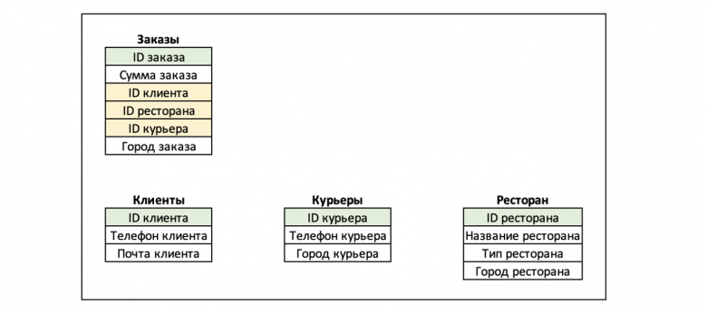

Второй важной характеристикой реляционных баз данных является то, что между таблицами существуют отношения. Отношения между таблицами определяются с помощью _primary key_ и _foreign key_.

**Primary key** (первичный ключ) – это столбец (или группа столбцов) таблицы, который содержит уникальные значения для каждой строки. На примере выше primary key каждой таблицы выделены зеленым цветом. То есть, например, в таблице с заказами каждая строка будет описывать отдельный заказ. Не будет двух строк, которые описывают один и тот же заказ, потому ID заказа будет разный для каждой строки.

**Foreign key** (внешний ключ) – это столбец в таблице, который содержит primary key другой таблицы. На рисунке foreign key отмечены желтым. То есть, таблица с заказами содержит ID клиента, который является primary key в таблице с клиентами, но в таблице с заказами он будет foreign key.

Primary key и foreign key помогают не только связывать между собой таблицы реляционной базы данных отношениями. Они еще помогают следить за целостностью и правильностью данных в базе. Например, если мы ошибемся в ID клиента, добавляя новый заказ в таблицу с заказами, то база выдаст ошибку, так как не найдет соответствующий ID клиента в таблице с клиентами.

Для взаимодействия с реляционными базами данных чаще всего используется SQL (Structured Query Language). Это специальный язык программирования, на котором пишутся запросы к реляционной базе. SQL-запросами можно создавать и удалять таблицы в реляционной базе, изменять данные в существующих таблицах и доставать из таблиц необходимую информацию.

Как уже говорилось выше, реляционные базы данных удобно использовать в аналитике, так как информация в них структурирована и распределена по смыслу, что, конечно, мечта любого аналитика. Однако, аналитики часто пишут сложные и не очень эффективные SQL-запросы, потому важно придумывать способы ускорения обработки запросов к реляционной базе.

Одним из наиболее популярных методов ускорения работы запросов к реляционным базам данных является индексирование таблиц. Индекс (index key) – это специальная структура данных, связанная с таблицей и конкретным столбцом (или столбцами) в ней. Она содержит копии данных из индексируемых столбцов, отсортированные в определённом порядке, и указатели на фактическое местоположение соответствующих строк в таблице.

Важно понимать, что индекс — это не волшебное решение всех проблем. Он занимает дополнительное дисковое пространство и требует ресурсов на своё обновление при добавлении, изменении или удалении данных в таблице. Поэтому к созданию индексов следует подходить обдуманно.

Приведу пример работы индекса. Например, мы хотим найти все заказы клиента `007` из ресторана `1`. Тогда, если у нас в таблице с заказами нет индекса, то мы будем перебирать все заказы пока не найдем нужные. Если же у нас есть индекс в таблице с заказами, то ситуация будет иной. Допустим, что индексом является столбец ID ресторана. Тогда наши данные в таблице с заказами будут сгруппированы по ID ресторана. И тогда при поиске заказов клиента `007` из ресторана `1`, мы не будем перебирать всю таблицу с заказами, а найдем группу заказов из ресторана `1` и будем искать необходимые данные внутри этой группы.

Из примера выше с индексом выше понятно, что в индекс выгодно добавлять такой столбец, в разрезе которого часто ищутся данные.

Также, одним из важных свойств реляционных баз данных является соответствие требованиям ACID. Я не буду углубляться в детали этих требований, только отмечу, что эти требования гарантируют целостность и корректность данных, несмотря на ошибки, системные сбои, перебои в питании, изменение данных несколькими пользователями одновременно и прочие необычные ситуации.

Выглядит так, что реляционная база данных идеальная база, и непонятно, почему бы постоянно ее не использовать. Однако, у реляционной базы данных есть и недостатки, и потому данный тип не всегда подходит для нужд бизнеса. Например, реляционная база данных не подходит для данных без четкой структуры, потому что мы не сможем разложить эти данные в отдельные таблицы по смыслу. А данных без четкой структуры гораздо больше, чем данных с четкой структурой.

### Какие еще есть типы баз данных?

Прочие типы баз данных, которые не реляционные, часто называются noSQL базы данных. Обсудим наиболее популярные типы нереляционных баз данных.

#### **Key-value** базы данных (пример - Redis)

Название говорит о том, какие данные удобно хранить в Key-value базе – в такой базе хранят данные, которые удобно представить в виде пары ключ-значение. Основное преимущество таких баз – это очень быстрый поиск значения по ключу. При этом значение может содержать какие угодно типы данных. 

Такие базы данных удобно применять в проектах, где необходимо выдавать быстрый результат по ключу, например, для онлайн торгов или сделок.

#### **Документно-ориентированные** (пример - Mongo DB)

В документно-ориентированной базе данных единицей хранения является документ (который может быть в формате json, или xml, или в каком-нибудь еще формате). Удобство таких баз в том, что в них быстро и легко записывать любые типы данных, при этом эти данные не обязаны обладать четкой структурой. Минус таких баз в том, что данные в них неудобно анализировать. 

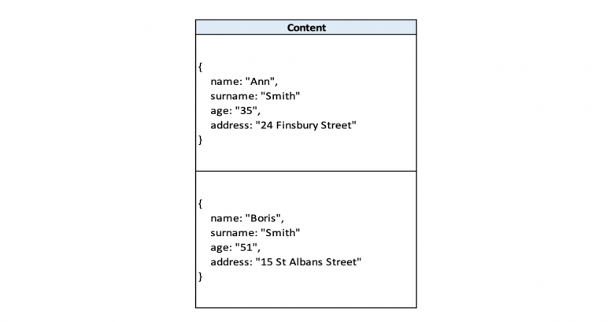

#### **Графовые** базы данных (пример - Orient DB)

Как следует из названия, в графовой базе данных данные хранятся в виде графов. Данный тип баз удобен, когда надо находить информацию не только о каком-то объекте, но и доставать информации о связах этого объекта с другими. 

Например, данный тип баз может использоваться для нахождения куки конкретного юзера и всех взаимосвязанных с этой кукой идентификаторов. Также, такой тип данных часто используется социальными сетями для сохранения информации не только о пользователях, но и о связях каждого пользователя с другими.

#### Колоночные (столбцовые) базы данных (примеры - Cassandra, Clickhouse)

В реляционных базах данных данные записаны в виде строк. Что же касается колоночных баз данных, то тут данные записываются в виде столбцов. Потому поиск данных в колоночной базе данных осуществляется не перебором всех строк, как это происходит в реляционной базе данных, а поиском необходимого значения в тех столбцах таблицы, которые нас интересуют. 

Преимущество колоночных баз данных в том, что они могут быстро находить определенные значения в столбцах, которые нас интересуют.

---

Перед разработкой ПО нужно определить, с какими данными предстоит работать и как они связаны между собой. Для этого системные аналитики строят модели данных и создают ER-диаграммы.

## Что такое ER‑диаграмма

Системный аналитик начинает работу над новым проектом с изучения его предметной области и терминов, которые в ней используют. Например, нужно создать систему для бронирования билетов на самолёт. Аэропорт, авиакомпания, дата, рейс, пассажир, пункты прибытия и назначения, багаж — термины проекта. Их ещё называют понятиями или сущностями.

В системе сущность представлена в виде экземпляров. Например, экземпляры сущности «Аэропорт» ― аэропорты «Домодедово», «Пулково», «Воронеж».

У сущностей есть атрибуты — характеристики, которые их описывают. Например, атрибутами сущности «Аэропорт» будут код, адрес, номер телефона. Атрибуты есть у каждого экземпляра сущности, но у них разные значения. У аэропортов «Домодедово» и «Воронеж» есть одинаковый атрибут «Адрес», но у каждого из них разное значение этого атрибута.

Собрав все сущности будущего проекта, системный аналитик выясняет, как они связаны между собой, и составляет ER-модель (сокр. от entity–relationship модель или модель «сущность-связь»). В модели есть три типа связей:

* **Один-к-одному** — один экземпляр сущности связан только с одним экземпляром другой сущности. Например, пассажир рейса и его место в самолете.
* **Один-ко-многим** — один экземпляр сущности связан со множеством экземпляров другой сущности. Например, у одного пассажира может быть несколько единиц багажа, при этом каждая единица багажа может быть связана только с одним пассажиром.
* **Многие-ко-многим** — множество экземпляров одной сущности связаны со множеством экземпляров другой сущности. Например, аэропорт обслуживает несколько авиакомпаний. При этом каждая авиакомпания может обслуживаться в нескольких аэропортах.

Системный аналитик создаёт ER-диаграмму модели данных. Это схема, которая показывает, с какими данными нужно будет работать для реализации проекта и как эти данные связаны между собой. Например, ER-диаграмма проиллюстрирует, что багаж связан с номером рейса, но не связан со временем окончания посадки пассажиров на него.

Чтобы создать ER-модель, не нужны специальные инструменты. Её можно построить вручную в любом графическом редакторе: для диаграмм «сущность-связь» используют простые символы вроде квадратов, стрелок и линий. 

## Типы ER‑моделей

ER-модели создают разные специалисты, а сами модели отличаются друг от друга детализацией: насколько подробно в них описывают данные. Есть три уровня ER-моделей:

1. **Концептуальный уровень**

    Первая верхнеуровневая модель для представления новой предметной области будущего проекта: что в ней есть и с чем нужно работать. Например, в ПО для транспортной компании будут сущности «Транспорт», «Груз», «Маршрут», «Накладная».

    ER-модель концептуального уровня нужна системному аналитику и заказчику, чтобы проверить, все ли термины учтены. Поэтому системный аналитик, как правило, создаёт её самостоятельно и не привлекает технических специалистов из команды разработки. 

1. **Логический уровень**

    На этом уровне детализируют данные из концептуальной модели: к сущностям добавляют характеристики — атрибуты. Например, на логическом уровне описывают характеристики сущности «Транспорт»: марка и модель автомобиля, количество лошадиных сил, пробег, грузоподъёмность.

    Модель логического уровня тоже составляет системный аналитик, но уже не в одиночку. К работе подключают технических специалистов ― разработчика или архитектора баз данных. Готовую логическую ER-модель нужно презентовать команде разработки. Разработчики проверяют, чтобы аналитик ничего не упустил, и согласовывают модель.

1. **Физический уровень**

    На этом уровне описывают, как будет организована работа с данными: выбирают тип базы, её содержание и где данные будут хранить. Например, выбирают реляционный тип базы данных и СУБД для работы с ней, перечисляют таблицы в базе и определяют, что она будет храниться на внутреннем сервере компании.

    Над ER-моделью физического уровня в большей степени работают архитектор баз данных и разработчики, а системный аналитик только помогает в процессе. 

## Применение ER-диаграмм

Модели «сущность-связь» традиционно используют для разработки программного обеспечения. При этом для метода нет конкретной области разработки: для создания любого ПО нужно работать с данными и транслировать их пользователям. Поэтому ER-модели строят и для интернет-магазина, и для корпоративного портала компании. 

Обычно ER-модель создают в двух случаях:

* когда перед началом проекта ещё не понятно, с какими данными предстоит работать;
* когда нужно создать новую базу данных или добавить таблицу в уже существующую.

Чем больше в системе сущностей и связей, тем важнее построить ER-модель до начала разработки ПО.

На практике над простыми системами можно работать без концептуальной ER-модели. Например, программа для выдачи талонов электронной очереди — простая система, в которой всего две сущности — номер окна и номер очереди.

## Символы и нотации ER‑диаграмм

ER-модель — это общее представление данных, ER-диаграмма — представление модели, а нотация — графический язык для представления модели.

Объясним на примере анатомии человека. Устройство человеческого организма — это модель. Её можно описать текстом, изобразить на картинке, перечислить все органы в таблице. Всё это разные представления одной и той же модели. Символы, с помощью которых описывают модель, — это нотации.

Для того чтобы построить ER-диаграмму, можно использовать разные нотации. Три самые известные из них:

1. **Нотация IDEF1X**. Её относят к фундаментальным, но на практике давно не используют, потому что есть более удобные варианты.

1. **Нотация Чена**. Классическая нотация, которая состоит из простых символов — прямоугольников, овалов и линий. Из-за этого нотацию часто используют для концептуальных моделей, которые презентуют заказчику. Человеку, который далёк от аналитики данных, проще разобраться в понятных диаграммах со знакомыми символами.

3. **Нотация Мартина**. Её ещё называют «воронья лапка» (от англ. Crow's Foot). Она компактнее нотации Чена, поэтому её используют для построения ER-моделей логического уровня, когда нужно описать в модели все атрибуты сущностей.

В нотациях Чена и Мартина есть одинаковые элементы: сущности, атрибуты и связи. Но эти элементы диаграмм обозначают разными символами.

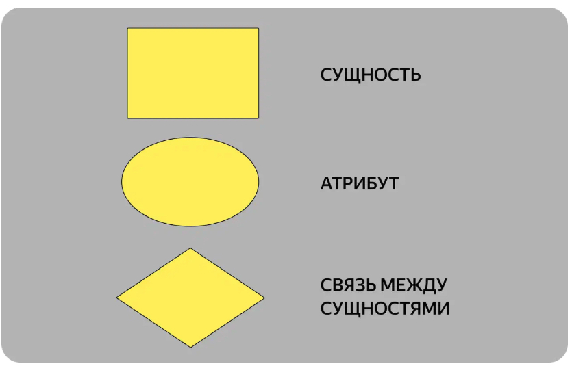

В нотации Чена название сущностей, атрибутов и связей вписывают внутрь прямоугольника, овала или ромба.

Элементы ER-диаграммы в нотации Чена соединяют линиями. Если линия соединяет две сущности, сверху обозначают тип связи:

* 1:1 — «один-к-одному»;
* 1:N — «один-ко-многим»;
* M:N — «многие-ко-многим».

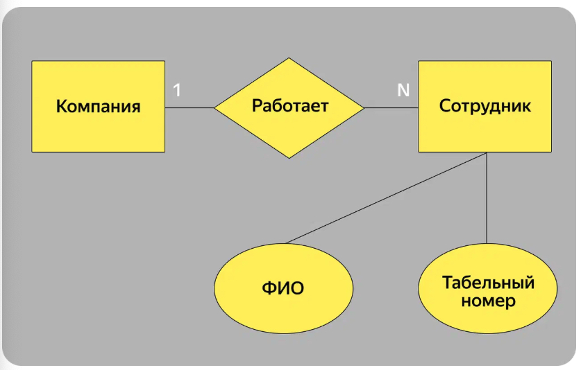

В одной компании работает много сотрудников. Тип связи между сущностями «компания» и «сотрудник» — «один-ко-многим»

В нотации Мартина сущность также вписывают в прямоугольник, а атрибуты и связи обозначают по-другому:

* атрибуты перечисляют прямо под сущностью,
* связи рисуют разными соединительными линиями.

В нотации Мартина используют несколько видов соединительных линий для иллюстрации типа связи между сущностями:

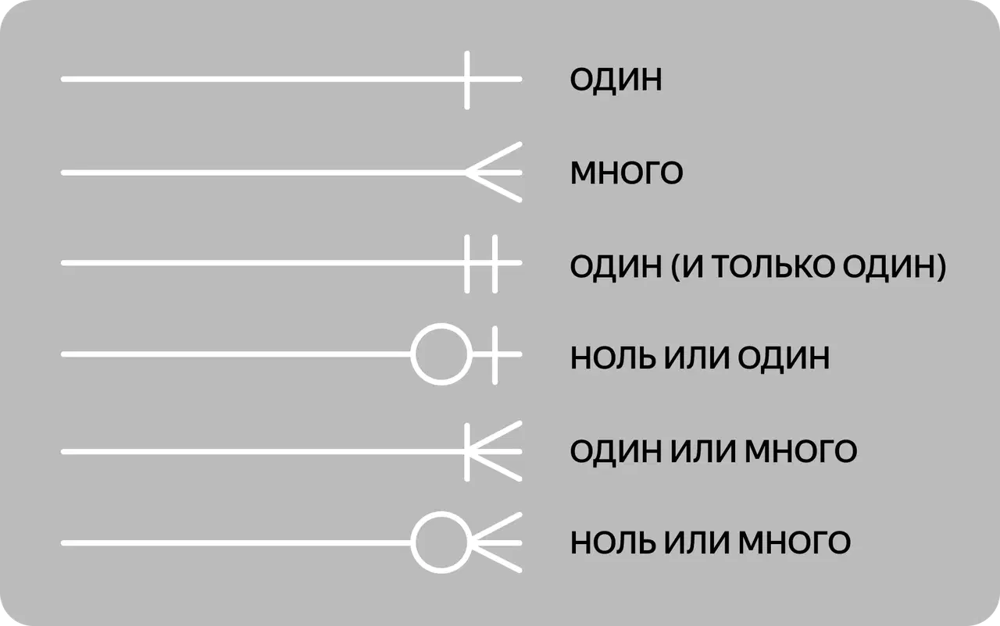

Для того чтобы изобразить три типа связи в нотации Мартина, можно использовать разные комбинации. Например, связь «многие-ко-многим» можно изобразить так:

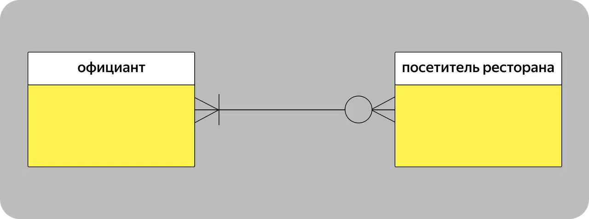

Официант может обслуживать от нуля до множества посетителей ресторана. При этом одного посетителя ресторана должен обслуживать хотя бы один официант, а могут и несколько

А связь «один-ко-многим» может выглядеть так:

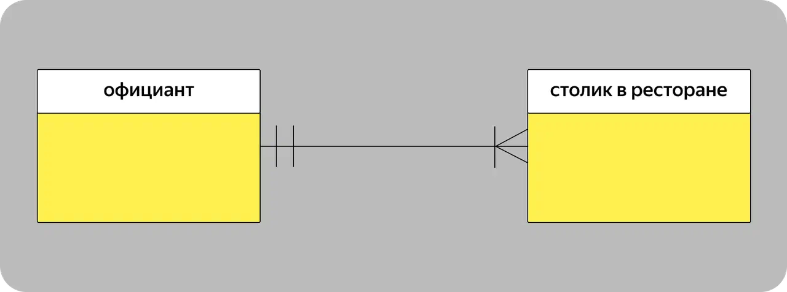

За каждым столиком в ресторане закреплён только один официант. При этом за каждым официантом может быть закреплено несколько столиков

## Примеры ER‑диаграмм

На примере сервиса по бронированию номеров в сети гостиниц рассмотрим, как выглядит одна и та же ER-модель в разных нотациях.

Сначала нужно выделить сущности ER-модели:

* гость,
* гостиница,
* номер. 

У каждой сущности есть основные атрибуты, например у сущности «гость» это ФИО и номер паспорта, у «гостиницы» — её номер в сети и адрес, у «номера» — его порядковый номер в гостинице и категория.

Затем нужно установить связи между сущностями. 

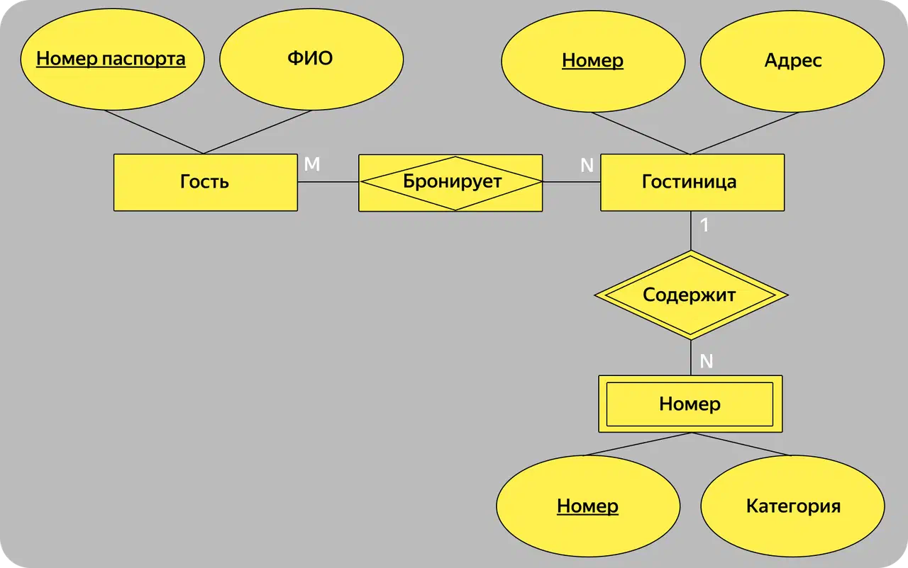

ER-модель концептуального уровня в нотации Чена содержит прямоугольники с сущностями, овалы с атрибутами, ромбы со связями. Сущность в подчинении у другой сущности называют дочерней и помещают в прямоугольник с двойной рамкой. Ромб со связью между ними тоже обводят двойной рамкой

Между сущностями «Гость» и «Гостиница» установлена связь «многие-ко-многим» — много гостей могут бронировать много гостиниц. В нотации Чена такая связь становится самостоятельной сущностью, которую называют ассоциативной и обозначают ромбом внутри прямоугольника. Ассоциативная сущность между «Гостем» и «Гостиницей» — «Бронирование». На следующих уровнях ER-модели у неё появятся атрибуты, например дата и номер бронирования.

Если строить ER-модель логического уровня в нотации Чена, она может сильно разрастись из-за большого количества атрибутов. Поэтому на следующем уровне можно построить модель в нотации Мартина.

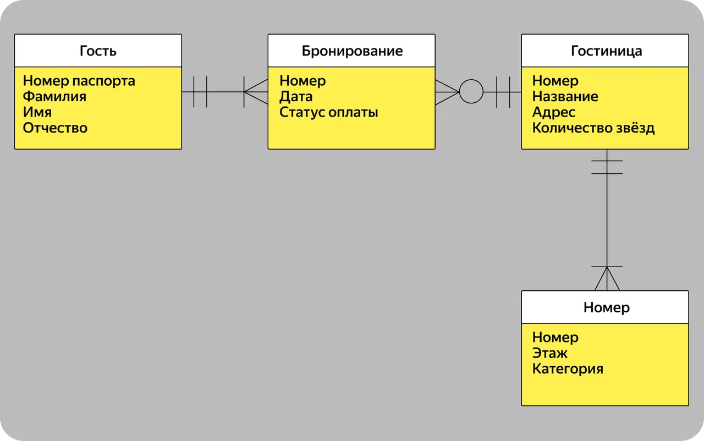

В ER-модели в нотации Мартина атрибуты сущностей перечисляют в полях под ними. За счёт этого модель занимает меньше места и её структура менее запутана

## Как создать простую ER‑диаграмму

Вот пошаговый алгоритм для создания простой ER-диаграммы:

1. Определить сущности

    Чтобы собрать все сущности будущего проекта, системные аналитики общаются с заказчиком и будущими пользователями ПО: сотрудниками или клиентами компании. Например, если нужно разработать ПО для ветеринарной клиники, системный аналитик проведёт интервью с руководителем клиники, сотрудниками, врачами и клиентами, которые будут записываться на приём.

    На этом этапе обычно создают концептуальную модель и согласовывают её с заказчиком.

1. Определить атрибуты

    Системный аналитик детализирует информацию, собранную во время интервью, и описывает характеристики сущностей. Если данных не хватает, нужно повторно опросить заинтересованных лиц.

1. Определить связи между сущностями

    На этом этапе выясняют, какие сущности связаны между собой. Например, пациенты и медицинская карта, филиал клиники и врачи, которые ведут приём.

1. Определить типы и характеристики связей 

    Например, пациенты и медицинская карта — это связь «один-к-одному», врач и день приёма — «один-ко-многим». 

    Затем ищут идентифицирующие связи между сущностями и определяют, какая из сущностей родительская. Допустим, у клиники есть филиалы — A, B и C. В каждом филиале есть кабинеты под номерами от 1 до 5. Это значит, что нельзя использовать номер кабинета без уточнения, в каком филиале он находится. Филиал — родительская сущность, а связь между филиалом и кабинетом — идентифицирующая.

1. Проверить ER-модель

    После завершения работы над ER-моделью системный аналитик проверяет, нет ли в ней лишних сущностей, дубликатов данных и косвенных связей между данными в одной таблице. Такую проверку называют **нормализацией** данных.

    Если модель данных не соответствует нормальным формам, её нужно скорректировать.

## Как привести данные в форму: что такое нормализация и зачем она нужна

**Нормализация данных** — инструмент, в котором новичку бывает сложно разобраться. Объясняем, как она работает, на примере из жизни — походе в магазин за ингредиентами для салата.

### Что такое нормализация данных

Данные в базе могут быть в любом виде: числа, проценты, текст. Нормализация — это способ организации данных. В нормализованной базе нет повторяющихся данных, с ней проще работать и можно менять её структуру для разных задач. В процессе нормализации данные преобразуют, чтобы они занимали меньше места, а поиск по элементам был быстрым и результативным. Для этого создают дополнительные таблицы и связывают друг с другом ключами — колонками, в которых нет повторяющихся элементов.

Рассмотрим на примере суть нормирования данных. Александр Сушков каждый день ходит в магазин продуктов рядом с домом. Покупает продукты, например, хлеб и творог, и оплачивает их картой. Данные о покупках, за которые рассчитывались картой, ежедневно сохраняются на сервере магазина в таблицу Excel.

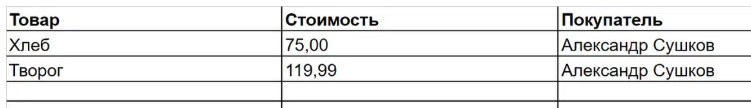

К концу дня данные можно проанализировать: посчитать выручку магазина, какие категории товаров продавались лучше и сколько денег принесли. Когда количество записей в таблице превысит миллион — работать с данными станет сложнее. Таблица будет медленно открываться, в ней будет труднее найти ошибки и собрать статистику по определённым товарам или категориям покупателей.

Кроме Александра Сушкова, в магазине ежедневно делают покупки и другие люди, которые тоже живут поблизости — Иван Иванов и Егор Кузнецов. Фамилии и имена покупателей повторяются в каждой записи их покупок. А это в среднем 10–20 символов. Чтобы не дублировать эти данные, можно создать отдельную таблицу.

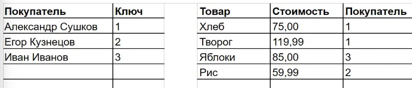

В отдельной таблице каждому покупателю можно присвоить номер — ключ. Тогда в основной таблице вместо имён будут ключи, которые свяжут обе таблицы. Это сократит количество символов в основной таблице, уберёт повторяющиеся сущности и упростит поиск

Имена и фамилии сотни постоянных покупателей — это в среднем 1 500 символов. Если в год каждый из них посещает магазин 300 раз, то получается 450 000 символов. Только замена имён и фамилий на цифры сократит количество символов в записях в 3–4 раза.

С товарами можно поступить так же: ввести категории, например, хлебобулочные изделия или молочная продукция, и создать для них отдельную таблицу. Так работает нормализация, цель которой — оптимизировать работу с базами данных.

Чтобы работать с нормальными формами БД: добавить, изменить или найти данные в базе из множества взаимосвязанных таблиц, к ней обращаются на языке программирования SQL. Это декларативный язык или язык структурированных запросов.

### Зачем нормализовать данные в БД

Разберём преимущества нормализации данных на примере. Работа с нормализованными данными отдалённо напоминает поход за продуктами с книгой рецептов. Чтобы купить продукты для салата оливье, нужно открыть первую таблицу — книгу рецептов, перейти в подтаблицу — раздел «Салаты», найти нужный рецепт и положить в корзину продукты из него. Примерно так работают связи между таблицами данных.

Без нормализации данных книга рецептов была бы одной большой таблицей с ингредиентами блюд. Чтобы купить продукты для оливье, пришлось бы сначала собрать в корзину все ингредиенты из книги. Потом найти те, что нужны для салата, а остальные выложить из корзины.

Что даёт нормализация данных и как она упрощает работу с базами:

1. Уменьшает объём базы данных и экономит место.

    За счёт отдельных таблиц для категорий и повторяющихся элементов можно уменьшить размер записей в базе данных, а значит, и её вес.

2. Упрощает поиск и делает работу с базой удобнее.

    Нормализованную базу данных, которая состоит из связанных таблиц, можно оптимизировать для задач без дополнительных действий. Например, для поиска по заданной категории не придётся искать и перебирать уникальные элементы в базе. Для этого можно обратиться к отдельной таблице с категориями и быстрее найти нужные данные.

3. Уменьшает вероятность ошибок и аномалий.

    Нормальные формы данных в таблицах взаимосвязаны. Например, если нужно изменить или удалить данные в одной таблице, то остальные связанные с ней данные автоматически обновятся. Не придётся перебирать все записи в поисках полей, которые нужно изменить или удалить, а значит, не будет ошибок, когда в базу внесут изменения.

### Как выполнить нормализацию

Процесс нормализации данных нужно прописать на этапе проектирования базы, то есть до начала сбора данных. Если этого не сделать, есть риск, что база данных будет спроектирована плохо и её придётся переделывать. Обычно аналитики нормализуют данные вручную или передают задачу специалистам, которые собирают и хранят данные, например, инженерам данных.

Для нормализации данных нет специального программного обеспечения. Данные в базе преобразуют по правилам. 

#### Правила нормализации баз данных

По правилам нормализации есть семь нормальных форм баз данных:

* первая,
* вторая,
* третья,
* нормальная форма Бойса-Кодда,
* четвёртая,
* пятая,
* шестая.

Приводить данные к нормальным формам можно только последовательно. То есть в базе данных второй нормальной формы данные по умолчанию уже должны быть нормализованы по правилам первой нормальной формы и так далее. В итоге база данных в шестой нормальной форме — идеально нормализованная. 

В некоторых случаях попытка нормализовать данные до «идеального» состояния может привести к созданию множества таблиц, ключей и связей. Это усложнит работу с базой и снизит производительность СУБД. Поэтому обычно данные нормализуют до третьей нормальной формы. Разберём на примере.

#### Первая нормальная форма

В базе данных не должно быть дубликатов и составных данных.

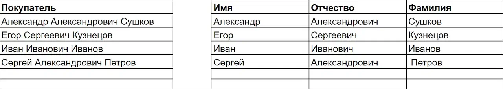

Слева данные о фамилии, имени и отчестве покупателей записаны в одно поле. Справа эти данные приведены к первой нормальной форме — каждый элемент записан в отдельное поле

Элементы составных данных лучше разнести по разным полям, иначе в процессе работы с данными могут появиться ошибки и аномалии.

Например, отдел маркетинга решил поздравить всех Александров с именинами и сделать рассылку с промокодом. Если таблица соответствует первой нормальной форме, можно найти нужные данные без дополнительных действий. Когда имя, отчество и фамилия записаны в одно поле, при поиске и сортировке в выборку попадут, например, Александровичи, Александровны и Александровы.

Другой пример — адреса. Их тоже лучше приводить к первой нормальной форме. То есть город, район, улицу, номер дом и номер квартиры записывать в отдельные поля. Если какие-то данные дублируются, как в случае с именами и фамилиями постоянных покупателей, их нужно перенести в другую таблицу.

#### Вторая нормальная форма

Если упростить: у каждой записи в базе данных должен быть первичный ключ. Первичный ключ — это элемент записи, который не повторяется в других записях.

Допустим, 10 декабря покупатель Егор Кузнецов купил цельнозерновой хлеб за 75 рублей в сетевом магазине продуктов города Москвы. Запись о его покупке появилась в базе данных. Нельзя исключать, что другой Егор Кузнецов в этот день купит такой же товар в другом магазине сети. Запись о покупке тоже появится в базе.

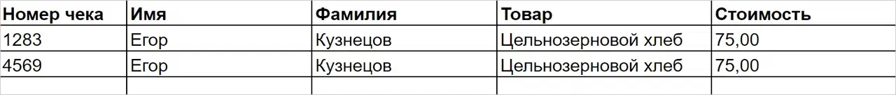

Чтобы записи не перепутались, можно добавить к ним идентификатор покупки, например номер чека. (Уникальный) идентификатор покупки — это первичный ключ

#### Третья нормальная форма

В записи (строке таблицы) не должно быть столбцов с неключевыми значениями, которые зависят от других неключевых значений.

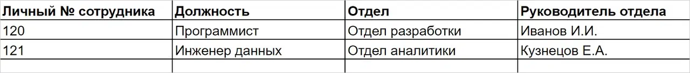

Личный номер сотрудника — это первичный ключ. Данные во втором и третьем столбце напрямую зависят от первичного ключа. Но между личным номером сотрудника и руководителем отдела только косвенная или транзитивная связь. Её в базе данных третьей нормальной формы быть не должно

Данные о руководителях отделов нужно вынести в другую таблицу. Тогда в основной таблице не будет транзитивных связей, и она будет соответствовать третьей нормальной форме.

---

## Этапы проектирования БД

[**Этап 1-й. Концептуальное проектирование**](#Концептуальное-проектирование) – создание схемы БД, включающего определение важнейших сущностей (таблиц) и связей между ними, но не зависящего от модели БД (иерархической, сетевой, реляционной и т.д.) и физической реализации (целевой СУБД).

[**Этап 2-й. Логическое проектирование**](#Логическое-проектирование) – развитие концептуальной схемы БД с учетом принимаемой модели (иерархической, сетевой, реляционной и т.д.).

[**Этап 3-й. Физическое проектирование**](#Физическое-проектирование) – развитие логической схемы БД с учетом выбранной целевой СУБД.

В настоящее время для проектирования БД активно используются **ERD (Entity – Relationship Diagrams, диаграммы «сущность–связь»)**. С их помощью определяются важные для предметной области объекты (сущности), отношения друг с другом (связи) и их свойства (атрибуты). Следует отметить, что средства проектирования **ERD** в основном ориентированы на реляционные базы данных (РБД), и если существует необходимость проектирования другой системы, скажем объектно-ориентированной, то лучше избрать другие методы проектирования.

## Основные элементы **ERD**.

**Сущность (таблица)** – набор однотипных реальных либо воображаемых объектов, имеющих существенное значение для рассматриваемой предметной области, информация о которых подлежит хранению. Примеры сущностей: _работник_, _деталь_, _ведомость_, _результаты сдачи экзамена_ и т.д.

**Экземпляр сущности (запись, строка)** – уникально идентифицируемый объект.

**Связь** – некоторая ассоциация между двумя сущностями, значимая для рассматриваемой предметной области. Примерами связей могут являться родственные отношения «отец–сын», производственные – «начальник-подчиненный» или произвольные – «иметь в собственности», «обладать свойством».

**Атрибут (столбец, поле)** – свойство сущности или связи.

Вначале обычно строится **логическая** схема БД в виде диаграммы с указанием **сущностей** и **связей** между ними. Логической схемой называется универсальное описание структуры данных, независимое от конечной реализации базы данных и аппаратной платформы. На основании полученной логической схемы переходят к физической схеме данных. Физическая схема представляет собой диаграмму, содержащую всю необходимую информацию для генерации БД для конкретной СУБД или даже конкретной версии СУБД. Если в логической схеме не имеет значения, какие идентификаторы носят таблицы и атрибуты, тип данных атрибутов и т.д., то в физической схеме должно быть полное описание БД в соответствии с принятым в ней синтаксисом, с указанием типов атрибутов, триггеров, хранимых процедур и т.д. По одной и той же логической схеме можно создать несколько физических. Например, на основании логической схемы сформировать физические для промышленных СУБД (ORACLE, MySQL, DB2, MS SQL Server и др.) и их различный версий. На основании физической схемы можно сгенерировать либо саму БД или DDL-скрипт, который, в свою очередь, может быть использован для генерации БД.

>**Система управления базами данных, СУБД** — система (базирующаяся на программном и аппаратном обеспечении) для описания, создания, использования, контроля и управления базами данных.
>
>*Упрощённо: программное средство, управляющее базами данных.*
>
>Стоит отметить важный для начинающих факт (т.к. очень часто можно услышать просьбу «показать СУБД»): подавляющее большинство СУБД не имеет никакого «человеческого интерфейса», представляет собой сервис (демон в *nix-системах) и взаимодействует с внешним миром по специальным протоколам (чаще всего, построенным поверх TCP/IP). Такие известные продукты как _MySQL Workbench_, _Microsoft SQL Server
Management Studio_, _Oracle SQL Developer_ и им подобные — это не СУБД, это лишь клиентское программное обеспечение, позволяющее нам взаимодействовать с СУБД.

Следует отметить, что современные СУБД обладают своими встроенными средствами визуального моделирования данных. Некоторые из них даже поддерживают классические нотации ERD. Недостатками такого моделирования является построение только физической схемы данных и невозможность быстрого перехода на другую СУБД, если такое решение принято. Достоинством этого подхода является более полное использование потенциала СУБД, ведь разработчики СУБД лучше других знают ее особенности и возможности.

## Концептуальное проектирование

Цель **концептуального проектирования** – создание концептуальной схемы данных на основе представлений о предметной области каждого отдельного типа пользователей. Концептуальная схема представляет собой описание основных **сущностей** (таблиц) и **связей** между ними без учета принятой модели БД и синтаксиса целевой СУБД. Часто на такой схеме отображаются только имена сущностей (таблиц) без указания их атрибутов. Представление пользователя включает в себя данные, необходимые конкретному пользователю для принятия решений или выполнения некоторого задания.

Ниже рассматривается последовательность шагов при концептуальном проектировании.

1. Выделение сущностей.

    Первый шаг в построении концептуальной схемы данных состоит в определении основных объектов (сущностей), которые могут интересовать пользователя и, следовательно, должны храниться в БД.

    Возможные трудности в определении объектов связаны с использованием постановщиками задачи:

    - примеров и аналогий при описании объектов (например, вместо обобщающего понятия «работник» они могут упоминать его функции или занимаемую должность: «руководитель», «ответственный», «контролер», «заместитель»);

    - синонимов (например, «допускаемая скорость» и «установленная скорость», «разработка» и «проект», «барьерное место» и «ограничение скорости»);

    - омонимов (например, «программа» может обозначать компьютерную программу, план предстоящей работы или программу телепередач).

    Далеко не всегда очевидно то, чем является определенный объект – сущностью, связью или атрибутом. Например, как следует классифицировать «семейный брак»? На практике это понятие можно вполне обоснованно отнести к любой из упомянутых категорий. Анализ является субъективным процессом, поэтому различные разработчики могут создавать разные, но вполне допустимые интерпретации одного и того же факта. Выбор варианта в значительной степени зависит от здравого смысла и опыта проектировщика.

    Каждая сущность должна обладать некоторыми свойствами:

    - должна иметь уникальное имя, и к одному и тому же имени должна всегда применяться одна и та же интерпретация;

    - обладать одним или несколькими атрибутами, которые либо принадлежат сущности, либо наследуются через связь;

    - обладать одним или несколькими атрибутами (первичным ключом), которые однозначно идентифицируют каждый экземпляр сущности, т. е. делают уникальной каждую строку таблицы;

    - может обладать любым количеством связей с другими сущностями.

2. Определение атрибутов.

    Самый простой способ определения атрибутов – после идентификации сущности, задать себе вопрос «Какую информацию требуется хранить о …?». Существенно помочь в определении атрибутов могут различные бумажные и электронные формы и документы, используемые в организации при решении задачи. Это могут быть формы, содержащие как исходную информацию (например, «Ведомость возвышений наружного рельса в кривых»), так и результаты обработки данных (например, «Форма № 1»).

    Выявленные атрибуты могут быть следующих типов:

    - простой (атомарный, неделимый) – состоит из одного компонента с независимым существованием (например, «должность работника», «зарплата», «норма непогашенного ускорения», «радиус кривой» и т.д.);

    - составной (псевдоатомарный) – состоит из нескольких компонентов (например, «ФИО», «адрес» и т. д.). Степень атомарности атрибутов, закладываемая в модель, определяется разработчиком. Если от системы не требуется выборки всех клиентов с фамилией Иванов или проживающих на улице Комсомольской, то составные атрибуты можно не разбивать на атомарные;

    - однозначный – содержит только одно значение для одного экземпляра сущности (например, у кривой в плане может быть только одно значение радиуса, угла поворота, возвышения наружного рельса и т.д.);

    - многозначный – содержит несколько значений (например, у одного отделения компании может быть несколько контактных телефонов);

    - производный (вычисляемый) – значение атрибута может быть определено по значениям других атрибутов (например, «возраст» может быть определен по «дате рождения» и текущей дате, установленной на компьютере);

    - ключевой – служит для уникальной идентификации экземпляра сущности (входит в состав первичного ключа), быстрого поиска экземпляров сущности или задания связи между экземплярами родительской и дочерней сущностей (нужно учитывать, что для каждого ключевого атрибута создается индекс (двоичное дерево));

    - неключевой (описательный);

    - обязательный – при вводе нового экземпляра в сущность или редактировании обязательно указывается допустимое значение атрибута, т.е. после указанных действий оно не может быть неопределенным (**NOT NULL**). Атрибуты, входящие в первичный ключ сущности, являются обязательными.

    После определения атрибутов задаются их **домены** (области допустимых значений), например:

    - наименование участка – набор из букв русского алфавита длиной не более 60 символов;

    - поворот кривой – допустимые значения «Л» (влево) и «П» (вправо);

    - радиус кривой – положительное число не более 4 цифр.

    Задание доменов определяет набор допустимых значений для атрибута (нескольких атрибутов), а также тип, размер и формат атрибута (атрибутов).

3. Определение ключей.

    На основании выделенного множества атрибутов для сущности определяется набор ключей. **Ключ** – один или несколько атрибутов сущности, служащих для однозначной идентификации её экземпляров, их быстрого поиска или задания связи между экземплярами родительской и дочерней сущностей. Ключи, используемые для однозначной идентификации экземпляров, подразделяются на следующие типы:

    - **суперключ** (superkey) – атрибут или множество атрибутов, которое единственным образом идентифицирует экземпляр сущности. Суперключ может содержать «лишние» атрибуты, которые необязательны для уникальной идентификации экземпляра. При правильном проектировании структуры БД суперключом в каждой сущности (таблице) будет являться полный набор ее атрибутов;

    - **потенциальный ключ** (potential key) – суперключ, содержащий минимально необходимый набор атрибутов, единственным образом идентифицирующих экземпляр сущности. Сущность может иметь несколько потенциальных ключей. Если ключ состоит из нескольких атрибутов, то он называется составным ключом. Среди всего множества потенциальных ключей для однозначной идентификации экземпляров выбирают один, так называемый первичный ключ, используемый в дальнейшем для установления связей с другими сущностями;

    - **первичный ключ** (primary key) – потенциальный ключ, который выбран для уникальной идентификации экземпляров внутри сущности;

    - **альтернативные ключи** (alternative key) – потенциальные ключи, которые не выбраны в качестве первичного ключа.

    Рассмотрим пример. Пусть имеется таблица, содержащая сведения о студенте, со следующими столбцами:

    - фамилия;
    - имя;
    - отчество;
    - дата рождения;
    - место рождения;
    - номер группы;
    - ИНН;
    - номер пенсионного страхового свидетельства (НПСС);
    - номер паспорта;
    - дата выдачи паспорта;
    - организация, выдавшая паспорт.

    Для каждого экземпляра (записи) в качестве суперключа может быть выбран весь набор атрибутов. Потенциальными ключами (уникальными идентификаторами) могут быть:

    - ИНН;
    - номер пенсионного страхового свидетельства;
    - номер паспорта.

    В качестве уникального идентификатора можно было бы выбрать совокупность атрибутов «Фамилия»+«Имя»+«Отчество», если вероятность учебы в вузе двух полных тезок была бы равна нулю.

    Если в сущности нет ни одной комбинации атрибутов, подходящей на роль потенциального ключа, то в сущность добавляют отдельный атрибут – суррогатный ключ (искусственный ключ, surrogate key). Как правило, тип такого атрибута выбирают символьный или числовой. В некоторых СУБД имеются встроенные средства генерации и поддержания значений суррогатных ключей. Также стоит отметить, что некоторые разработчики вместо поиска потенциальных ключей и выбора из них первичного в каждую сущность добавляют искусственный атрибут, который в дальнейшем и используют в качестве первичного ключа.

    Если потенциальных ключей несколько, то для выбора первичного ключа рекомендуется придерживаться следующих правил:

    - количество атрибутов, входящих в ключ, должно быть минимальным (желательно, чтобы ключ был атомарным, т.е. состоял из одного атрибута);

    - размер ключа в байтах должен быть как можно короче;

    - тип домена ключа – числовой. При выборе символьных атрибутов в ключ часто возникают проблемы с вводом ошибочных значений (путают регистр букв; добавляют лишние пробелы; используют буквы, пишущиеся на разных языках одинаково). В числовых атрибутах вероятность ошибки при вводе значения меньше;

    - вероятность изменения значений ключа была наименьшей (например, «Номер пенсионного страхового свидетельства» более постоянный параметр, чем «ИНН» или «Номер паспорта»);

    - с ключом проще всего работать пользователям (например, «Номер пенсионного страхового свидетельства» – это набор из 11 цифр, а «Номер паспорта» зависит от его вида: гражданина СССР, гражданина РФ или зарубежный).

    Если некий атрибут (набор атрибутов) присутствует в нескольких сущностях, то его наличие обычно отражает наличие связи между экземплярами этих сущностей. В каждой связи одна сущность выступает как родительская, а другая – в роли дочерней. Это означает, что один экземпляр родительской сущности может быть связан с несколькими экземплярами дочерней. Для поддержки этих связей обе сущности должны содержать наборы атрибутов, по которым они связаны. В родительской сущности это первичный ключ. В дочерней сущности для моделирования связи должен присутствовать набор атрибутов, соответствующий первичному ключу родительской. Этот набор атрибутов в дочерней сущности принято называть внешним ключом (foreign key).

4. Определение связей.

    Наиболее характерными типами связей между сущностями являются:

    - связи типа «часть–целое», определяемые обычно глаголами «состоит из», «включает» и т.п.;

    - классифицирующие связи (например, «тип – подтип», «множество – элемент», «общее – частное» и т. п.);

    - производственные связи (например, «начальник–подчиненный»);

    - функциональные связи, определяемые обычно глаголами «производит», «влияет», «зависит от», «вычисляется по» и т. п.

    Среди них выделяются только те связи, которые необходимы для удовлетворения требований к разработке БД.

    Связь характеризуется следующим набором параметров:

    - именем – указывается в виде глагола и определяет семантику (смысловую подоплеку) связи;

    - кратностью (кардинальность, мощность): _один-к-одному_ (`1:1`), один-ко-многим (`1:N`) и многие-ко-многим (N:M, N = M или N <> M). Кратность показывает, какое количество экземпляров одной сущности определяется экземпляром другой. Например, на одном участке (описывается строкой таблицы «Участки») может быть один, два и более путей (каждый путь описывается отдельной строкой в таблице «Пути»). В данном случае связь 1:N. Другой пример: один путь проходит через несколько раздельных пунктов и через один раздельный пункт может проходить несколько путей – cвязь N:M;

    - типом: идентифицирующая (атрибуты одной сущности, называемые внешним ключом, входят в состав дочерней и служат для идентификации ее экземпляров, т.е. входят в ее первичный ключ) и неидентифицирующая (внешний ключ имеется в дочерней сущности, но не входит в состав первичного ключа);

    - обязательностью: обязательная (при вводе нового экземпляра в дочернюю сущность заполнение атрибутов внешнего ключа обязательно и введенные значения должны совпадать со значениями атрибутов первичного ключа какого-либо экземпляра родительской сущности) и необязательная (заполнение атрибутов внешнего ключа в экземпляре дочерней сущности необязательно или введенные значения не совпадают со значениями атрибутов первичного ключа ни одного экземпляра родительской сущности);

    - степенью участия – количеством сущностей, участвующих в связи. В основном между сущностями существуют бинарные связи, т.е. ассоциации, связывающие две сущности (степень участия равна 2). Например, «Участок» состоит из «Путей». В то же время по степени участия возможны следующие типы связей:

        * унарная (рекурсивная) – сущность может быть связана сама с собой. Например, в таблице «Работники» могут быть записи и по подчиненным, и по их начальникам. Тогда возможна связь «начальник» – «подчиненный», определенная на одной таблице;

        * тернарная – связывает три сущности. Например, «Студент» на «Сессии» получил «Оценку по дисциплине»;

        * кватернарная и т.д.

## Логическое проектирование

Цель **логического проектирования** – развить концептуальную схему БД с учетом принимаемой модели БД (иерархической, сетевой, реляционной и т. д.).

Примем в качестве модели реляционную БД в третьей нормальной форме (набор нормализованных отношений с кратностью связей 1:N). Поэтому необходимо будет проверить концептуальную схему с помощью методов нормализации и контроля выполнения транзакций. Транзакция – одно действие или их последовательность, выполняемых как единое целое одним или несколькими пользователями (прикладными программами) с целью осуществления доступа к БД и изменению ее содержимого.

1. Удаление и проверка элементов, не отвечающих принятой модели данных.

    * Удаление связей N:M.

        Если в концептуальной схеме присутствуют связи N:M, то их следует устранить путем определения промежуточной сущности. Связь N:M заменяется двумя связями типа 1:M, устанавливаемыми со вновь созданной сущностью.

    * Удаление связей с атрибутами.

        Связи с атрибутами должны быть преобразованы в сущности.

    * Удаление сложных связей (со степенью участия более 2).

        Сложную связь заменяют необходимым количеством бинарных связей 1:N со вновь созданной сущностью, которая и показывает эту связь.

    * Удаление рекурсивных связей (со степенью участия 1).

        Рекурсивную связь заменяют, определив дополнительную сущность и необходимое количество связей.

    * Удаление многозначных атрибутов (атрибутов имеющих несколько значений).

        Многозначность устраняется путем введения новой сущности и связи 1:N. Например, несколько номеров организации выводятся в отдельную сущность "Телефоны". Данное преобразование, помимо соответствия реляционной модели данных, также позволяет хранить любое количество телефонов по одному филиалу.

    * Удаление избыточных связей.

        Связь является избыточной, если одна и та же информация может быть получена не только через нее, но и с помощью другой связи.

    * Перепроверка связей 1:1.

        В процессе определения сущностей могли быть созданы сущности, которые на самом деле являются одной. В этом случае их следует объединить. Например, сущности «Филиал» и «Руководитель филиала» лучше объединить.        

        В то же время не всегда можно выполнить такое объединение.

        

        Офисный пакет состоит из строго определенного набора компонентов, причем каждый из них характеризуется большим количеством атрибутов. Кроме этого, некоторые компоненты могут отсутствовать в офисном пакете (например, почтовый клиент) или они не входят в его состав (выступают в качестве самостоятельного продукта). В описанных случаях рекомендуется не объединять сущности.

2. Проверка модели с помощью правил нормализации.

    Основная идея нормализации заключается в том, чтобы каждый факт хранился в одном месте, т. е. чтобы не было дублирования данных. Многие из требований нормализации, как правило, уже учитываются при выполнении предыдущих шагов проектирования.

    Ниже приводятся краткие сведения из теории нормализации.

    Проектирование реляционной БД представляет собой пошаговый процесс создания набора отношений (таблиц, сущностей), в которых отсутствуют нежелательные функциональные зависимости.

    **Функциональная зависимость** определяется следующим образом. Пусть A и B – произвольные наборы атрибутов отношения. Тогда B функционально зависит от A (A → B), в том и только в том случае, если каждому значению A соответствует в точности одно значение B. Левая часть функциональной зависимости (A) называется **детерминантом**, а правая (B) – **зависимой частью**. В частности, в отношении А может быть первичным ключом, а B – набором неключевых атрибутов, так как одному значению первичного ключа в точности соответствует одно значение набора неключевых атрибутов.

    Если в БД отсутствуют нежелательные функциональные зависимости, то это обеспечивает минимальную избыточность данных, что в свою очередь ведет к уменьшению объема памяти, необходимой для хранения данных. Процесс устранения таких зависимостей получил название нормализация. Она выполняется в виде последовательности тестов для некоторого отношения (таблицы, сущности) с целью проверки его соответствия (или несоответствия) набору ограничений для заданной нормальной формы.

    Процесс нормализации впервые был предложен Э.Ф. Коддом в 1972 г. Сначала было предложено три вида нормальных форм (1NF, 2NF и 3NF). Затем Р. Бойсом и Э.Ф. Коддом (1974 г.) было сформулировано более строгое определение третьей нормальной формы, которое получило название нормальная форма Бойса–Кодда (BCNF). Вслед за BCNF появились определения четвертой (4NF) и пятой (5NF или PJNF) нормальных форм (Р. Фагин, 1977 и 1979 г.). На практике нормальные формы более высоких порядков используются крайне редко. При проектировании БД, как правило, ограничиваются третьей нормальной формой, что позволяет предотвратить возможное возникновение избыточности данных и аномалии обновлений.

    <!-- 
    https://habr.com/ru/post/129195/ 
    https://info-comp.ru/database-normalization
    -->

    **Первая нормальная форма (1НФ)**. 
    
    Первая нормальная форма требует, чтобы каждый атрибут (столбец) таблицы содержал только атомарные значения, а каждая запись (строка) была уникальной. Другими словами, в таблице не должно быть повторяющихся групп или многозначных полей. Обеспечивая атомарность значений, вы исключаете дублирующиеся данные и гарантируете, что каждый атрибут представляет единый факт об объекте.

    Степень неделимости (атомарности), т.е. решение о том, следует разбивать неатомарный атрибут на атомарные или оставить его псевдоатомарным, определяется проектировщиком БД исходя из конкретных условий. Если при обработке таблиц нет необходимости различать атомарные составляющие псевдоатомарного атрибута, то его можно не делить (например, атрибуты «Фамилия, имя, отчество», «Адрес» и т. д.).

    **Вторая нормальная форма (2НФ)**. 
    
    Считается, что таблица находится во второй нормальной форме, если она соответствует критериям **1НФ** и каждый атрибут непервичного ключа полностью функционально зависит от первичного ключа. На этом этапе частичные зависимости удаляются путем разложения таблиц на несколько связанных таблиц. Это гарантирует, что каждый непервичный атрибут зависит только от первичного ключа, а не от какого-либо другого неключевого атрибута.

    Например, таблица «Оценки по экзаменам» характеризуется следующим набором атрибутов {Номер зачетной книжки, Дисциплина, Дата сдачи, ФИО студента, № группы, Оценка}. Очевидно, что первичным ключом является набор {Номер зачетной книжки, Дисциплина, Дата сдачи}. Полной функциональной зависимостью обладает только один неключевой атрибут «Оценка». Атрибуты «ФИО студента» и «№ группы» могут быть однозначно определены по части первичного ключа – «Номер зачетной книжки». Таким образом, требуется разбиение исходной таблицы на две.

    

    **Третья нормальная форма (3НФ)**. 
    
    Чтобы таблица находилась в третьей нормальной форме, она должна сначала удовлетворять **2НФ**. Кроме того, **3НФ** требует отсутствия транзитивных зависимостей для атрибутов, не являющихся первичными ключами. Это означает, что неключевые атрибуты не должны зависеть от других неключевых атрибутов ни прямо, ни косвенно. Чтобы достичь **3НФ**, вам может потребоваться дополнительная декомпозиция таблиц, чтобы удалить эти зависимости.

    Например, таблица «Работник» характеризуется набором атрибутов {Табельный номер, Фамилия, Имя, Отчество, Должность, Зарплата, …}, первичный ключ – {Табельный номер}. В этой таблице от первичного ключа («Табельный номер») зависит неключевой атрибут «Должность», а от «Должности» другой неключевой атрибут «Зарплата». Для приведения к **3НФ** необходимо добавить новую таблицу.

    

3. Определение требований поддержки целостности данных.

    Ограничения целостности данных представляют собой ограничения, которые вводятся с целью предотвращения помещения в базу противоречивых данных.

    К этим ограничениям относятся:

    - **обязательные данные** – атрибуты, которые всегда должны содержать одно из допустимых значений (`NOT NULL`). Например, поворот кривой (влево или вправо) должен быть обязательно задан. Обязательными также являются все атрибуты, входящие в первичный ключ сущности;

    - **домены** – наборы допустимых значений для атрибута. Например, радиус кривой должен быть положительным числом не более 4 цифр или поворот кривой может принимать одно из двух допустимых значений – «Л» (влево) или «П» (вправо);

    - **бизнес-правила** (бизнес-ограничения) – ограничения, принятые в рассматриваемой предметной области. Например, сумма длин переходных кривых не должна быть более длины всей кривой, километраж начала или конца кривой должен быть в пределах общего километража пути и т.д.;

    - **ссылочная целостность** – набор ограничений, определяющих действия при вставке, обновлении и удалении записей (экземпляров сущности). Например:

        * при наличии обязательной связи вставка записи в дочернюю сущность требует обязательного заполнения атрибутов внешнего ключа, и введенному значению должна соответствовать запись родительской сущности;

        * аналогичное требование выдвигается при обновлении внешнего ключа в дочерней сущности;

        * удаление записи из дочерней сущности или вставка записи в родительскую не вызывают нарушения ссылочной целостности;

        * удаление записи в родительской сущности может требовать удаления всех связанных записей в дочерней сущности.

    Автоматическая поддержка всех видов ограничений целостности возможна за счет использования операторов SQL.

    Ссылочная целостность может быть обеспечена за счет использования триггеров. **Триггер** – это хранимая в БД процедура, исполняемая СУБД автоматически при удалении (DELETE), вставке (INSERT) или обновлении (UPDATE) записи. Набор команд, входящих в триггер, зависит от принятой стратегии (типа триггера) поддержания целостности:

    - RESTRICT или NO ACTION - на выполнение действия накладываются ограничения (условия). Под NO ACTION обычно понимаются триггеры, срабатывающие на изменение данных в родительской таблице. При соблюдении условий изменения в БД принимаются, в противном случае отклоняются;

    - CASCADE - каскадное удаление или обновление данных;

    - SET NULL - установка неопределенного значения (NULL) в атрибутах внешнего ключа дочерней таблицы;

    - SET DEFAULT - установка значения по умолчанию в атрибутах внешнего ключа дочерней таблицы;

    - NO CHECK, NONE или IGNORE - поддержка ссылочной целостности встроенными средствами СУБД не предусмотрена, но может быть выполнена за счет клиентских программ, работающих с БД. Данная стратегия принята в СУБД по умолчанию.

## Физическое проектирование

Цель **физического проектирования** – преобразование логической схемы с учетом синтаксиса, семантики и возможностей выбранной целевой СУБД.

В связи с тем, что методология физического проектирования существенно зависит от выбранной целевой СУБД, ограничимся лишь общими рекомендациями.

1. Анализ необходимости введения контролируемой избыточности.

    При реализации проекта часто для достижения большей эффективности системы требуется снизить требования к уровню нормализации отношений, т.е. внести некоторую избыточность данных. Процесс внесения таких изменений в БД называется **денормализацией**.

    Рассмотрим некоторые виды денормализации, которые в определенных случаях могут существенно повысить производительность системы.

    * **Использование производных данных.**

        С точки зрения физического проектирования любой производный атрибут либо может сохраняться в БД, либо при каждом обращении к нему его значение будет вычисляться заново. Например, длина пути может каждый раз вычисляться по таблицам «Действительный километраж» и «Неправильные пикеты» либо храниться как атрибут в таблице «Пути».

        Проектировщик при использовании производных данных должен оценить:

        - дополнительную стоимость хранения производных данных и поддержки согласованности с текущими значениями тех данных, на основании которых они вычисляются, т.е. минусы хранения производных данных;

        - издержки на выполнение вычислений значений производных атрибутов при каждом обращении к ним – плюсы.

    * **Дублирование атрибутов.**

        * Объединение отношений, связанных 1:1.

            Даже в тех случаях, когда связь между двумя сущностями необязательная, стоит подумать об их объединении, с учетом того, что часть полей в записях не будет заполняться. Руководствоваться в таких случаях надо из тех же соображений, что и при использовании производных данных. В частности, ~~на рис. 7.4 и 7.5~~ показана иерархия наследования для сущности «Сотрудник». Если эту иерархию оставить без изменений, то в БД будет четыре сущности (Сотрудник, Постоянный сотрудник, Совместитель и Консультант), согласованность которых надо будет поддерживать. При выполнении запросов по сотрудникам надо будет оперировать четырьмя таблицами. Таким образом, лучше в БД вместо иерархии запроектировать одну таблицу, в которую добавить атрибуты «Ставка» и «Организация». В атрибуте «Ставка» для постоянного сотрудника всегда будет значение «1», а атрибут «Организация» будет заполняться только для консультантов. Несмотря на избыточность, такая замена с точки зрения обработки данных и эксплуатации более выгодна.

        * Дублирование атрибутов в связях типа 1:M.

            Например, при запросе к таблице «Раздельные пункты на пути» очень часто будет требоваться наименование самих раздельных пунктов. С целью уменьшения нагрузки на БД следует рассмотреть возможность включения атрибута в эту таблицу.

        * Использование служебных таблиц (справочных таблиц, классификаторов, типовых списков значений).

            Служебные таблицы, как правило, создаются для атрибутов символьного типа, значения которых могут выбираться из строго определенного и ограниченного списка. Например, значениями атрибута «Род балласта» могут быть только «Щебеночный», «Песчаный», «Гравийный» и «Асбестовый».

            Обычно служебные таблицы содержат два атрибута: идентификатор (код, шифр) и описание (наименование). Например, в БД можно предусмотреть служебные таблицы «Вид раздельного пункта», «Род балласта» и т.д. с атрибутами {ID, Наименование}. Эти таблицы связываются неидентифицирующей обязательной связью с исходной, при этом в ней вместо наименования параметра будет содержаться идентификатор этого наименования.

            Использование служебных таблиц дает следующие преимущества:

            - значительно снижается вероятность ошибки при указании значений для этих атрибутов. Если не использовать служебные таблицы, то разные пользователи могут вносить рассогласованные значения, в том числе и с ошибками. Например, «Щебеночный», «щебеночный», «Щебен.», «Шебеночный», «Щ» и т.д. Несмотря на то, что по смыслу это все один и тот же род балласта, программа будет их воспринимать как разные;

            - уменьшается размер исходной таблицы. Например, если непосредственно хранить наименование рода балласта в таблице «План пути», то в каждой записи на этот атрибут будет расходоваться не менее 10 байт (длина слова «Щебеночный» 10 букв), а если использовать идентификатор, то достаточно всего одного байта. Экономия в 10 раз;

            - если описание параметра может измениться, то значительно проще изменить одно значение в служебной таблице, чем корректировать множество записей в исходной. Например, если принято решение вместо полного наименования рода балласта отображать только начальную букву (Щ, П, Г и А), то изменениям подвергнется только служебная таблица, а исходные таблицы «План пути» и «ВСП на прямых участках» останутся без изменений.

        * Введение повторяющихся (многозначных) атрибутов.

            Для достижения большей производительности при выполнении часто вызываемых запросов может быть целесообразным подход сохранения многозначных атрибутов, чем вынесение их в отдельную таблицу. Например, если количество контактных телефонов у филиала компании невелико (до 10), эта величина постоянная и не увеличится со временем, то в таблице «Филиал» можно предусмотреть атрибуты «Номер телефона 1», …, «Номер телефона 10».

        * Создание сводных таблиц.

            Если нагрузка на БД в часы пик велика, а период актуальности отчетов, составляемых на основании данных, – сутки и более, то следует подумать о включении в БД сводных таблиц, обновляемых в часы минимальной нагрузки на БД.

2. Перенос логической схемы данных в среду целевой СУБД.

    Данная стадия включает в себя проектирование таблиц и связей между ними с учетом возможностей целевой СУБД. При этом проектировщик должен хорошо ориентироваться в функциональных возможностях СУБД, а именно поддерживает ли СУБД задание:

    - доменов;
    - первичных, альтернативных и внешних ключей;
    - неопределенных (NULL) и обязательных (NOT NULL) значений;
    - значений по умолчанию (DEFAULT);
    - правил контроля целостности;
    - хранимых процедур и триггеров.

    Кроме этого, целевая СУБД должна поддерживать требуемые типы данных или иметь возможность адекватного их хранения. Стадия переноса также включает в себя модификацию логической схемы с учетом семантики и синтаксиса, принятой в целевой СУБД, а именно, соблюдение правил наименования таблиц, атрибутов, типов данных, описания триггеров, хранимых процедур и т. д.

3. Реализация бизнес-правил и анализ транзакций.

    Реализацию бизнес-правил (сумма длин переходных кривых не должна быть более длины всей кривой) можно включить в SQL-операторы создания таблиц (CREATE TABLE опция CHECK для полей или таблицы в целом) или в триггеры (CREATE TRIGGER).

    После реализации бизнес-правил необходимо проверить выполнимость и эффективность (время отклика, скорость выборки, объем задействованных данных) выполнения всех транзакций.

4. Разработка механизмов защиты.

    Ввиду того, что работают с системой, как правило, несколько пользователей, необходимо продумать механизмы защиты данных от несанкционированного просмотра и модификации. В частности, с системой определения скоростей планируется работа разных пользователей: инженера службы пути; начальника службы пути, представителей других служб дороги и Департамента пути и сооружений ОАО «РЖД». Каждый из них должен быть наделен соответствующими полномочиями. Так, например, инженер службы пути «головой отвечает» за достоверность исходных данных и результаты расчетов. В связи с этим он должен быть наделен самыми широкими полномочиями. Другие пользователи должны иметь возможность только просмотра результатов расчета и формирования ведомостей.

    Ниже рассматриваются два наиболее популярных способа обеспечения защиты данных.

    * Разработка пользовательских представлений (видов).

        Представление пользователя включает в себя данные, необходимые конкретному пользователю для принятия решений или выполнения некоторого задания.

        **Представление в БД** – динамический результат одной или более операций, выполненных над таблицами БД с целью получения новой сводной таблицы. Представление является виртуальной таблицей, которая реально в БД не существует, но создается по запросу (SELECT) определенного пользователя в результате выполнения этого запроса.

        В БД представления создаются для упрощения запросов и для организации защиты. Например, с помощью представления можно ограничить доступ к отдельным атрибутам или записям некоторых типов пользователей.

    * Определение прав доступа (привилегий).

        В СУБД, поддерживающих SQL, возможно выполнение запросов от имени определенного пользователя, которое задается администратором БД. Каждый пользователь обладает строго определенным набором прав (привилегий) в отношении конкретной таблицы или представления. Наделение правами выполняется с помощью оператора GRANT, отмена – REVOKE. Операции, на которые можно назначить права: SELECT, INSERT, DELETE и UPDATE. Кроме того, возможно задание передачи прав от одного пользователя к другому.

5. Организация мониторинга и настройка функционирования системы.

    Мониторинг функционирования и достигнутого уровня производительности системы необходим с целью устранения ошибочных проектных решений или изменения требований к системе.

    Первоначальный физический проект БД не следует понимать как нечто статическое. Он, скорее, является промежуточным звеном, предназначенным для оценки достигнутого уровня производительности системы. Большинство коммерческих СУБД предоставляет в распоряжение администратора БД набор утилит, предназначенных для наблюдения за функционированием системы и ее настройки.

    На практике настройку БД никогда нельзя считать завершенной. На протяжении всего жизненного цикла системы необходимо постоянно вести наблюдение за уровнем ее производительности, что позволит своевременно реагировать на изменения, происходящие в окружающей среде. Внесение в БД изменений, предназначенных для повышения производительности одного из приложений, может отрицательно отразиться на работе другого приложения, возможно, более важного. Таким образом, внесение любых изменений в БД должно проводиться обдумано и осторожно с обязательным их тестированием.

---

**Дополнительная литература**

1. [Нормализация баз данных простыми словами](https://info-comp.ru/database-normalization)
2. [Нормализация базы данных и ее формы](https://office-menu.ru/uroki-sql/51-normalizatsiya-bazy-dannykh)
1. [Сущности и связи: как и для чего системные аналитики создают ER‑диаграммы](https://practicum.yandex.ru/blog/chto-takoe-er-diagramma/)

**Контрольные вопросы**

1. Этапы проектирования базы данных
1. Что такое **ERD**
1. Основные элементы **ERD**
1. Что такое **домен** с точки зрения **ERD**
1. Ограничения целостности данных

Предыдущая лекция | &nbsp; | Следующая лекция
:----------------:|:----------:|:----------------:
[Спецификация вариантов использования](./5_1_1_10_uml_uc_spec.md) | [Содержание](../readme.md#проектирование-баз-данных) | [Словарь данных](./5_1_1_1_data_dictionary.md)
