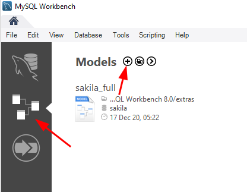
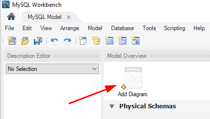
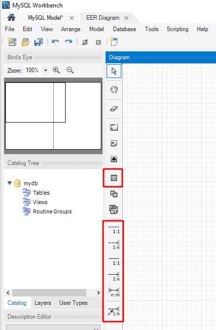
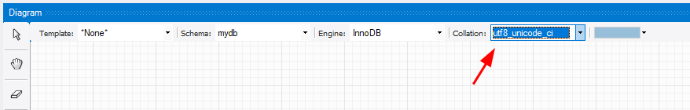
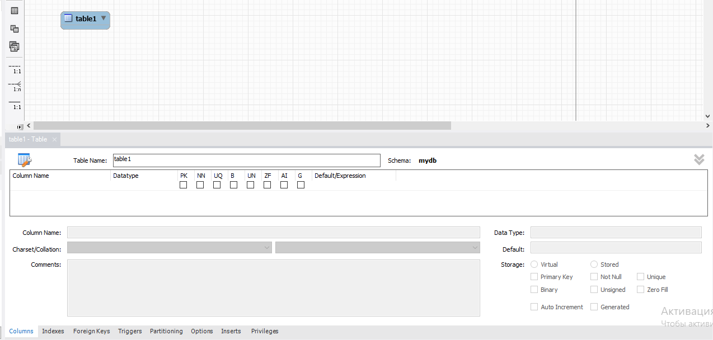
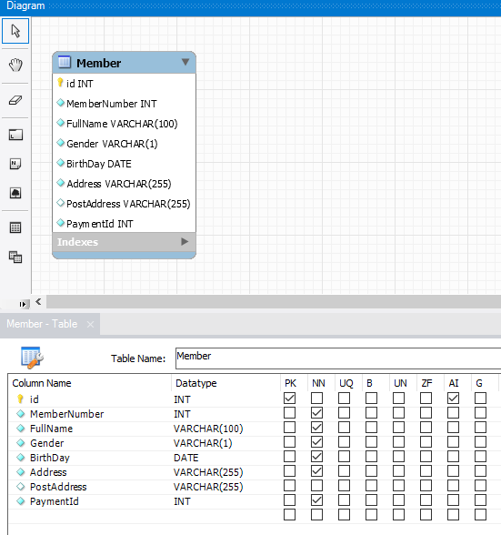
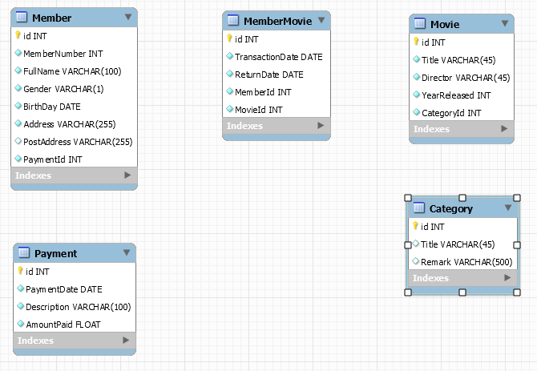
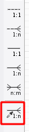
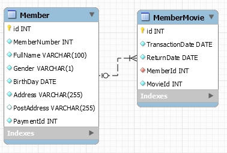
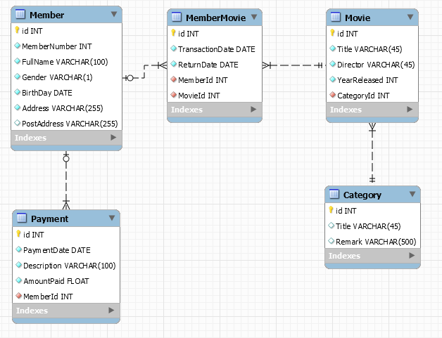

<table style="width: 100%;"><tr><td style="width: 40%;">
<a href="../articles/5_1_1_1_data_dictionary.md">Словарь данных
</a></td><td style="width: 20%;">
<a href="../readme.md">Содержание
</a></td><td style="width: 40%;">
<a href="../articles/sql_for_beginner.md">Основы SQL
</a></td><tr></table>

# Создание ER-диаграммы в среде MySQL Workbench

## Предметная область

Давайте теперь поработаем с системой базы данных *MyFlix Video Library*, чтобы помочь понять концепцию ER-диаграмм. Мы будем использовать эту базу данных для всей практической работы в оставшейся части этого урока

MyFlix — это юридическое лицо, которое сдает в аренду фильмы своим членам. MyFlix хранит свои записи вручную. Теперь руководство хочет перейти на СУБД

Вспомним шаги по разработке диаграммы EER для базы данных:

* Определить сущности и отношения, которые существуют между ними.
* Каждая сущность, атрибут и отношение должны иметь соответствующие имена, которые могут быть легко понятны и нетехническим людям.
* Отношения не должны быть связаны напрямую друг с другом. Отношения должны соединять сущности.
* Каждый атрибут в данном объекте должен иметь уникальное имя.

### Объекты, которые должны быть включены в нашу ER-диаграмму:

**Участники** — эта сущность будет хранить информацию об участниках.

**Фильмы** — эта сущность будет содержать информацию о фильмах

**Категории** — эта сущность будет содержать информацию, которая помещает фильмы в различные категории, такие как «Драма», «Действие», «Эпический» и т. Д.

**Прокат фильмов** — эта сущность будет хранить информацию о фильмах, сдаваемых в аренду ее членам.

**Платежи** — эта сущность будет хранить информацию о платежах, произведенных участниками.

### Определение отношений между сущностями

**Участники и фильмы**

* **Участник** может арендовать один или больше фильмов.
* **Фильм** может быть арендован более чем одним участником.

Из приведенного выше сценария мы можем видеть, что нужно использовать отношение «многие ко многим». Реляционные базы данных не поддерживают отношения «многие ко многим». Нам нужно ввести новую сущность - таблицу связей. Эту роль будет играет таблица MovieRentals. Она имеет отношение один-ко-многим с таблицей участников и отношение один-ко-многим с таблицей фильмов.

**Фильмы и категории лиц**

* **Фильм** может принадлежать только к одной категории, но в **категории** может быть несколько фильмов.

Из этого можно сделать вывод, что характер отношений между категориями и таблицей фильмов один-ко-многим.

**Участники и платежные организации**

* **Участник** может иметь только одну учетную запись, но может сделать несколько **платежей**.

Из этого можно сделать вывод, что характер взаимоотношений между участниками и платежными организациями один-ко-многим.

## Теперь давайте создадим модель EER, используя MySQL Workbench

>Модель улучшенного отношения сущностей (EER)
>
>Модель Enhanced Entity Relationship (EER) — это модель данных высокого уровня, которая предоставляет расширения для исходной модели Entity Relationship (ER). EER Models поддерживает более детальный дизайн. EER Modeling появилась как решение для моделирования очень сложных баз данных.

В рабочей среде *MySQL Workbench* перейдите в режим моделирования и нажмите кнопку «+»

Дважды щелкните кнопку *Добавить диаграмму*, чтобы открыть рабочее пространство для диаграмм ER.

Появляется окно *EER Diagram*

Давайте посмотрим на два типа объектов, с которыми мы будем работать.

* Объект таблицы позволяет нам создавать объекты и определять атрибуты, связанные с конкретным объектом.
* Кнопки отношений позволяет нам определять отношения между объектами.

**Участники** организации будет иметь следующие атрибуты

* Членский номер
* Полные имена
* Пол
* Дата рождения
* Физический адрес
* Почтовый адрес

### Создадим таблицу участников:

1. Кликните по кнопке "Таблица"

    В верхней части окна диаграммы появится запрос параметров для создаваемой таблицы:

    

    В поле *Collation* Выбираем **utf8mb4_0900_ai_ci** и кликаем по области диаграммы - появится сущность с названием *table1* (остальные параметры не меняем)

    >Что такое *Collation* и зачем их так много?
    >
    >Параметр *Collation* указывает серверу, как нужно сортировать и сравнивать строки. Вот, например, строки “Apple” и “apple”. Они разные или нет? Это зависит от указанного *Collation*. Если с регистром всё более менее понятно, то что делать с примером “елка” и “ёлка”? Считать их как одинаковые или как разные? Это все тоже в *Collation*.
    >
    >В *Collation* есть несколько частей:
    >
    >* **CI** — Case Insensitive — без учета регистра;
    >* **CS** — Case Sensitive — c учетом регистра;
    >* **AS** — Accent Sensitive — с учетом аксонов или диакритических знаков, проще говоря 'a' не считается равным 'ấ'.
    >* **AI** — Accent Insensitive — без учета аксонов или диакритических знаков, проще говоря 'е' считается равным 'ё'.
    >* **UTF8** — позволяет хранить данные в UTF8.
    >* **mb4** — минимальное количество байт для хранения символа utf (**utf8** без суффикса **mb4** использует 3 байта на символ, и в этот набор не входят, например, *emoji*)
    >* **bin** — простое побитовое сравнение 

2. Дважды кликните мышкой по этой сущности. Появится окно свойств, показанное ниже:

    

3. Задайте название сущности (поле **Table Name**) и добавьте атрибуты (**Column Name**)

    Должно получиться примерно такое:

    

Повторите эти действия для всех сущностей, в итоге должно получиться примерно так:

Обратите внимание:

* Таблица связей названа по именам связываемых сущностей
* В названиях сущностей и атрибутов используем CamelCase и единственное число
* сразу создаем атрибуты для связей (PaymentId, MemberId, MovieId? CategoryId). В принципе *MySQL Workbench* может автоматически созавать эти атрибуты при создании связей, но при этом он называет их не по нашему стандарту.

### Создадим связи

1. Кликаем по иконке создания связи "один-ко-многим"

    

2. Затем последовательно кликаем по внешнему ключу MemberMovie.MemberId и Member.id (нужные поля подсвечиваются под курсором)

    

Повторяем эти действия для всех связей, в итоге получится примерно следующее:    

<table style="width: 100%;"><tr><td style="width: 40%;">
<a href="../articles/5_1_1_1_data_dictionary.md">Словарь данных
</a></td><td style="width: 20%;">
<a href="../readme.md">Содержание
</a></td><td style="width: 40%;">
<a href="../articles/sql_for_beginner.md">Основы SQL
</a></td><tr></table>
