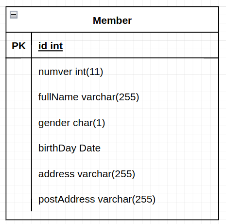
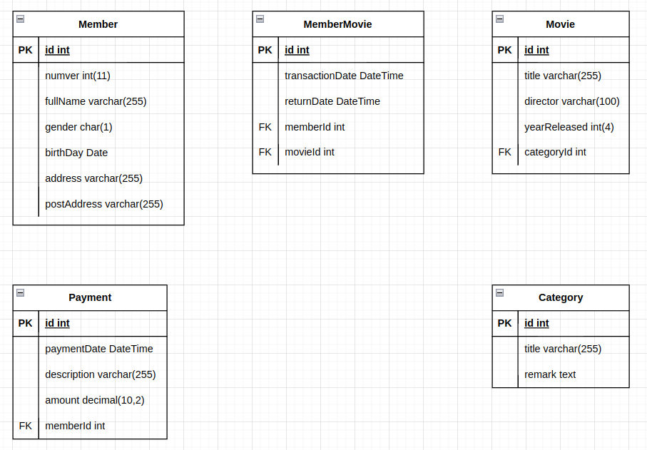
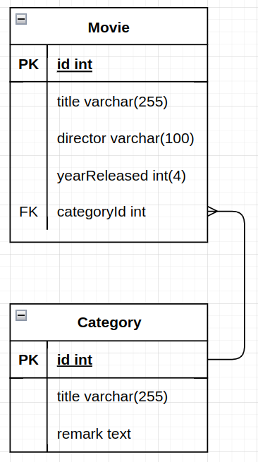
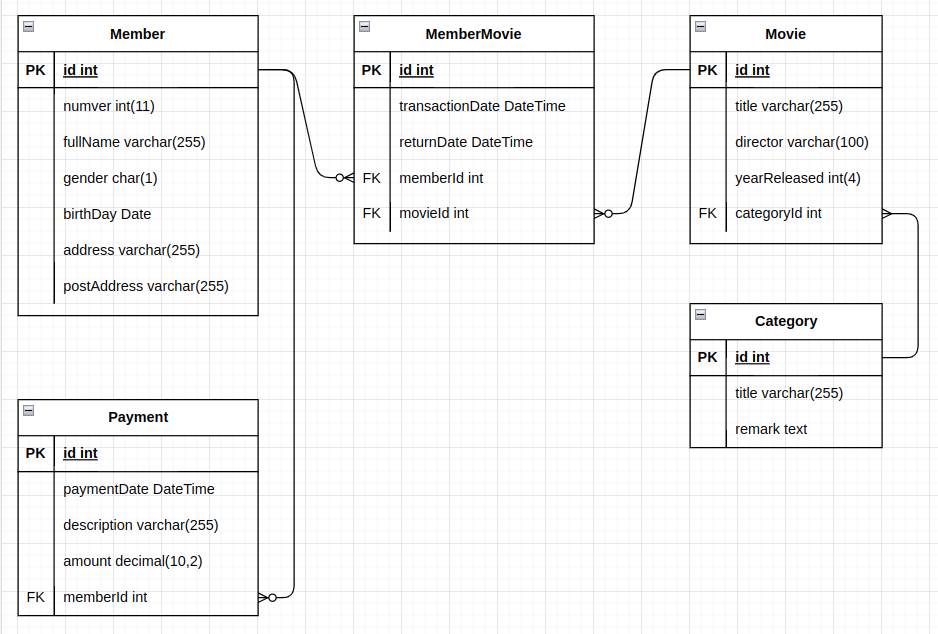

# Создание ER-диаграммы

Связи в ERD будем обозначать используя нотацию **Crow’s Foot** (воронья лапка)

Согласно данной нотации, связь изображается линией, которая связывает две сущности, участвующие в отношении. Степень конца связи указывается графически, множественность связи изображается в виде «вилки» (вороньей лапки) на конце связи. Модальность связи так же изображается графически — необязательность связи помечается кружком на конце связи. 

## Предметная область

Давайте теперь поработаем с системой базы данных *MyFlix Video Library*, чтобы помочь понять концепцию ER-диаграмм. Мы будем использовать эту базу данных для всей практической работы в оставшейся части этого урока

MyFlix — это юридическое лицо, которое сдает в аренду фильмы своим членам. MyFlix хранит свои записи вручную. Теперь руководство хочет перейти на СУБД

Вспомним шаги по разработке ER диаграммы для базы данных:

* Определить сущности и отношения, которые существуют между ними.
* Каждая сущность и атрибут должны иметь соответствующие имена, которые могут быть легко понятны и нетехническим людям.
* Отношения должны соединять сущности.
* Каждый атрибут в данном объекте должен иметь уникальное имя.

### Объекты, которые должны быть включены в нашу ER-диаграмму:

**Участники** — эта сущность будет хранить информацию об участниках.

**Фильмы** — эта сущность будет содержать информацию о фильмах

**Категории** — эта сущность будет содержать информацию, которая помещает фильмы в различные категории, такие как «Драма», «Действие», «Эпический» и т. Д.

**Прокат фильмов** — эта сущность будет хранить информацию о фильмах, сдаваемых в аренду ее членам.

**Платежи** — эта сущность будет хранить информацию о платежах, произведенных участниками.

### Определение отношений между сущностями

**Участники и фильмы**

* **Участник** может арендовать один или больше фильмов.
* **Фильм** может быть арендован более чем одним участником.

Из приведенного выше сценария мы можем видеть, что нужно использовать отношение «многие ко многим». Реляционные базы данных не поддерживают отношения «многие ко многим». Нам нужно ввести новую сущность - таблицу связей. Эту роль будет играет таблица MovieRentals. Она имеет отношение один-ко-многим с таблицей участников и отношение один-ко-многим с таблицей фильмов.

**Фильмы и категории лиц**

* **Фильм** может принадлежать только к одной категории, но в **категории** может быть несколько фильмов.

Из этого можно сделать вывод, что характер отношений между категориями и таблицей фильмов один-ко-многим.

**Участники и платежные организации**

* **Участник** может иметь только одну учетную запись, но может сделать несколько **платежей**.

Из этого можно сделать вывод, что характер взаимоотношений между участниками и платежными организациями один-ко-многим.

## Теперь давайте создадим ER диаграмму

Давайте посмотрим на два типа объектов, с которыми мы будем работать (на примере программы *draw.io*).

* Объект таблицы позволяет нам создавать объекты и определять атрибуты, связанные с конкретным объектом.
* Кнопки отношений позволяет нам определять отношения между объектами.

**Участники** организации будет иметь следующие атрибуты

* Членский номер
* Полные имена
* Пол
* Дата рождения
* Физический адрес
* Почтовый адрес

### Создадим таблицу участников:

1. Перетащите на форму объект "таблица"

    

1. Задайте название сущности и добавьте атрибуты

    >Добавление нового атрибута:
    >
    >

    Должно получиться примерно такое:

    

    У **gender** тип должен быть `char(1)` 

    >При наведении курсора мышки на объект, показывается информация о типе объекта
    >
    >

Повторите эти действия для всех сущностей, в итоге должно получиться примерно так:

Тут есть ошибка - все сущности нужно называть единообразно, а у нас название таблицы **Movies** во множественном числе

Обратите внимание:

* Таблица связей названа по именам связываемых сущностей
* В названиях сущностей и атрибутов используем CamelCase и единственное число
* сразу создаем атрибуты для связей: *paymentId*, *memberId*, *movieId*, *categoryId*. Для определения направления связи проговариваем про себя "у одного участника может быть несколько покупок" и, соответственно создаём аттрибут *paymentId* в сущности, которой **много**

### Создадим связи

1. Используем тип связи "один-ко-многим"

    

1. Соединяем нужные аттрибуты сущностей соответствующими сторонами связи (проговариваем для себя: "в одной категории может быть много фильмов")

    

Повторяем эти действия для всех связей, в итоге получится примерно следующее:    

>Пример выполнен без учёта модальности. Для отношений "участник - фильм" и "участник - платеж" нужно использовать вариант с необязательной связью