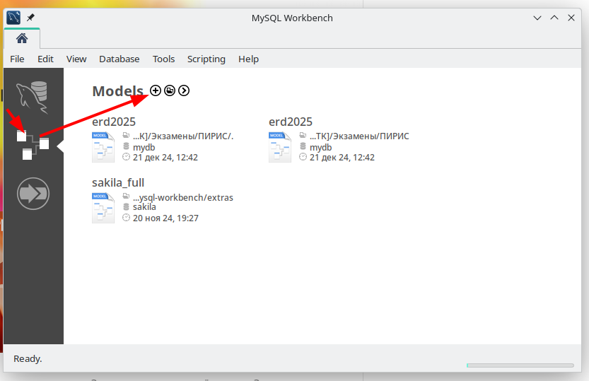
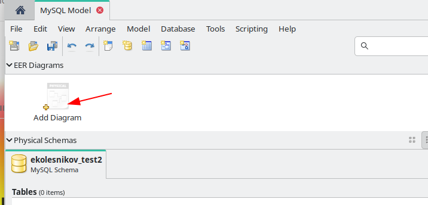
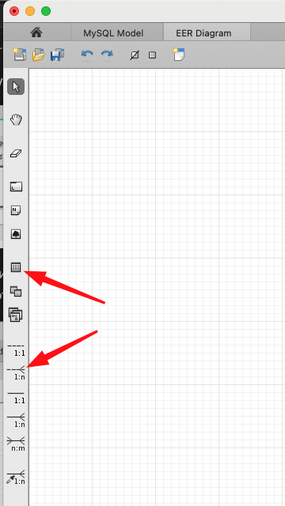
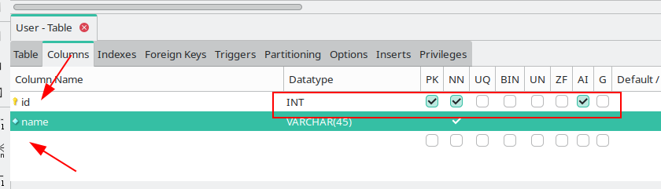

Предыдущая лекция | &nbsp; | Следующая лекция
:----------------:|:----------:|:----------------:
[Группировка, агрегатные функции, JOIN-ы](./sql_advanced.md) | [Содержание](../readme.md#проектирование-баз-данных) | [Создание базы данных. Импорт данных.](./sql_import.md)

# Создание ER-диаграммы

## Предметная область

>Статья похоже переводная, встречаются "кривые" выражения.

Давайте теперь поработаем с системой *MyFlix Video Library*, чтобы помочь понять концепцию ER-диаграмм. Мы будем использовать эту базу данных для всей практической работы в оставшейся части этого урока.

MyFlix — это юридическое лицо, которое сдает в аренду фильмы своим членам. MyFlix хранит свои записи вручную. Теперь руководство хочет перейти на СУБД

Вспомним шаги по разработке ER диаграммы для базы данных:

* Определить сущности и отношения, которые существуют между ними.
* Каждая сущность и атрибут должны иметь соответствующие имена, которые могут быть легко понятны и нетехническим людям.
* Отношения должны соединять сущности.
* Каждый атрибут в данном объекте должен иметь уникальное имя и тип данных, соответствующий предметной области.

### Объекты, которые должны быть включены в нашу ER-диаграмму:

**Участники** — эта сущность будет хранить информацию об участниках.

**Фильмы** — эта сущность будет содержать информацию о фильмах

**Категории** — эта сущность будет содержать информацию, которая помещает фильмы в различные категории, такие как «Драма», «Действие», «Эпический» и т. Д.

**Прокат фильмов** — эта сущность будет хранить информацию о фильмах, сдаваемых в аренду ее членам.

**Платежи** — эта сущность будет хранить информацию о платежах, произведенных участниками.

### Определение отношений между сущностями

**Участники и фильмы**

* **Участник** может арендовать один или больше фильмов.
* **Фильм** может быть арендован более чем одним участником.

Из приведенного выше сценария мы можем видеть, что нужно использовать отношение «многие ко многим». Реляционные базы данных не поддерживают отношения «многие ко многим». Нам нужно ввести новую сущность - таблицу связей. Она имеет отношение один-ко-многим с таблицей участников и отношение один-ко-многим с таблицей фильмов.

**Фильмы и категории лиц**

* **Фильм** может принадлежать только к одной категории, но в **категории** может быть несколько фильмов.

Из этого можно сделать вывод, что характер отношений между категориями и таблицей фильмов один-ко-многим.

**Участники и платежные организации**

* **Участник** может иметь только одну учетную запись, но может сделать несколько **платежей**.

Из этого можно сделать вывод, что характер взаимоотношений между участниками и платежными организациями один-ко-многим.

## Теперь давайте создадим ER диаграмму

>Диаграмму будем делать в программе MySQL Workbench.

1. Запустите **MySQL Workbench**, откройте вкладку **Модели** и создайте новую модель (иконка с плюсом)

    

1. Переименуйте модель. Название модели будет использоваться в DDL-скрипте как название базы данных, поэтому название должно соответствовать задаче: например, `ekolesnikov_test` для лабораторных работ и `user01` при выполнени демо-экзамена (если у вас еще нет аккаунта для подключения к БД, то можете этот шаг пропустить).

    

    двойной клик по названию модели откроет окно редактирования

    

    >Кнопку "Rename References" нужно жать, если у вас уже есть диаграмма или таблицы

1. Добавьте диаграмму

    

    Левую и правую панели можно скрыть, чтобы было больше места для диаграммы

    

1. Для добавления таблиц и связей используется панель или быстрые клавиши (можно посмотреть, наведя курсор на иконку)

    

### Создадим таблицу участников:

**Участники** организации будет иметь следующие атрибуты

* Членский номер
* Полные имена
* Пол
* Дата рождения
* Физический адрес
* Почтовый адрес

1. Кликните по иконке "Новая таблица" (или нажмите быструю клавишу `T`)

    

    В верхней панели появятся настройки таблицы, можно там ничего не менять и кликнуть мышкой в том месте диаграммы, куда вы хотите поместить новую таблицу

1. Двойным кликом по таблице можно открыть окно свойств, где задать название таблицы (**Member**), добавить поля и их свойства

    

    

    >Двойной клик по свободному месту в конце списка полей добавляет новое поле

1. Добавьте атрибуты

    Должно получиться примерно такое:

    

Обратите внимание:

* В названиях сущностей и атрибутов используем **CamelCase** и единственное число

Для создания связей нам нужно иметь сущности, создадим еще сущности **Movie** (Фильм) и **Genre** (Словарь жанров для фильмов)

### Создадим таблицу Фильмы (Movie):

Добавим поля цена и продолжительность (жанр пока не добавляем, он будет внешним ключём к справочнику жанров)

### Создадим таблицу Жанры (Genre):

Таблицу для сущности "Платежи" нарисуйте сами, по аналогии с жанрами.

### Создадим связи

1. Связь один-ко-многим между сущностями Фильмы и Жанры (проговариваем для себя: у фильма может быть один жанр, один и тот же жанр может быть у нескольких фильмов)

    >Вообще у фильма может быть и несколько жанров, но мы в своей предметной области решили сделать так

    Кликаем сначала по иконке связи один-ко-многим, затем по таблице у которой "много" и в конце по таблице где "один"

    

    Система автоматически добавит поле для внешнего ключа (`Genre_id`), вот только название не соответствует соглашению **CamelCase** - переименуем его в `genreId` (двумя кликами по сущности входим в режим редктирования и там правим название поля)

    >Если присмотреться к интерфейсу, то можно заметить, что для связей есть по две иконки: с пунктиром и сплошная. Глубоко в теорию я не полезу, уточню только что при использовании идентифицирующей связи в связь включаются все ключи (т.е. если в таблице есть внешние ключи, то они тоже попадут в связь), поэтому всегда используйте неидентифицирующую связь (которая пунктирная)

1. Связь многие-ко-многим между участниками и фильмами

    Кликаем по иконке связи многие-ко-многим, затем по связываемым таблицам (порядок в этом случае не важен)

    

    Система автоматически создаст дополнительную таблицу связи, которая в реляционных СУБД и реализует связь многие-ко-многим.

    Приведите названия таблиц и полей к соглашению **CamelCase**

    Чтобы постоянно не переименовывать таблицы и поля можно в настройках Workbench задать шаблоны

    Это исходный вариант (я подчеркнул поля, которые буду менять):

    

    А это измененный

    

    Теперь, если откатить изменения в диаграмме и заново создать связь, то получим такой результат:

    

    Обратите внимание на типы ключей в таблице связи (MySQL Workbench использует не буквенное обозначение, а символьное: первичный ключ помечается ключиком, а внешний - оранжевым ромбиком). Для таблицы связи оба поля входят в первичный ключ (составной ключ)

    Подробнее на созданные ключи можно посмотреть в соответствующих закладках:

    
    

## Задание

Реализуйте ER-диаграмму по предметной области из лекции в программе MySQL Workbench

В репозитории опубликовать и файл диаграммы и экспорт этой диагрыммы в PDF.

Предыдущая лекция | &nbsp; | Следующая лекция
:----------------:|:----------:|:----------------:
[Группировка, агрегатные функции, JOIN-ы](./sql_advanced.md) | [Содержание](../readme.md#проектирование-баз-данных) | [Создание базы данных. Импорт данных.](./sql_import.md)

