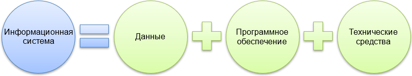
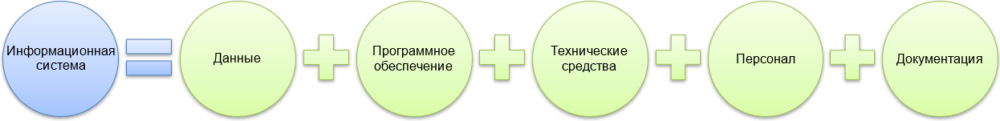

<table style="width: 100%;"><tr><td style="width: 40%;">
</a></td><td style="width: 20%;">
<a href="../readme.md">Содержание
</a></td><td style="width: 40%;">
<a href="../articles/5_1_1_4_analiz.md">Анализ предметной области. Основные понятия системного и структурного анализа.
</a></td><tr></table>

>Основано на [этих](https://sites.google.com/site/anisimovkhv/learning/pris/lecture) лекциях.

# Основные понятия

Согласно Федеральному закону «Об информации, информационных технологиях и о защите информации» **информация** – сведения (сообщения, данные) независимо от формы их представления. В литературе, посвященной компьютерной технике и программным средствам, часто употребляется термин «данные». Как правило, эти понятия взаимозаменяемы.

В то же время необходимо отметить одно принципиальное отличие между ними. **Данные** – это информация, представленная в виде, пригодном для обработки автоматическими средствами.

На протяжении последних десятилетий наблюдается неизменное ускорение темпов роста объема информации. Кратко и емко данная ситуация была сформулирована в виде тезиса: «Информация — это единственный неубывающий ресурс общества». Объем информации к 1800 г. удваивался каждые 50 лет, к 1950 г. – каждые 10 лет, к 1970 г. – каждые 5 лет, а к 1990 г. – ежегодно. Следствием такого положения дел стал количественный барьер в процессах обработки информации. Иногда информацию нет смысла собирать и хранить в связи с отсутствием возможности ее обработки и рационального использования. Увеличение информации и растущий спрос на нее обусловили появление отрасли, связанной с автоматизацией обработки информации – информатикой.

**Информатика** – область научно-технической деятельности, занимающаяся исследованием процессов получения, передачи, обработки, хранения и представления информации, а также решением проблем создания, внедрения и использования информационной техники и технологии во всех сферах общественной жизни.

Основным направлением и предметом информатики является изучение и разработка информационных технологий на основе использования вычислительной техники. **Информационные технологии** – процессы и методы поиска, сбора, хранения, обработки, предоставления, распространения информации, а также способы осуществления таких процессов и методов. В настоящее время понятие «информационная технология» неразрывно связывают с использованием электронных средств передачи и обработки информации. В этом случае правильнее использовать термин «новая информационная технология», так как информационные технологии существовали и до появления компьютеров.

Новые информационные технологии призваны обеспечить повсеместную информатизацию всех сфер человеческой деятельности. В старой редакции закона **информатизация** определялась как «организационный социально-экономический и научно-технический процесс создания оптимальных условий для удовлетворения информационных потребностей и реализации прав граждан, органов государственной власти, органов местного самоуправления, организаций, общественных объединений на основе формирования и использования информационных ресурсов».

Информатизация общества немыслима без использования информационных систем и информационно-телекоммуникационных сетей.

**Информационная система** (автоматизированная информационная система) – совокупность содержащейся в базах данных информации и обеспечивающих ее обработку информационных технологий и технических средств. Это определение упрощенно можно представить следующей формулой. (автоматизированная информационная система) – совокупность содержащейся в базах данных информации и обеспечивающих ее обработку информационных технологий и технических средств. Это определение упрощенно можно представить следующей формулой.

В литературе, в том числе и в нормативных документах, часто употребляется термин «автоматизированная система». Как и в случае с парой «информация» – «данные», понятия «автоматизированная система» и «информационная система» в подавляющем большинстве случаев взаимозаменяемы. Так в действующем ГОСТ 34.003-90 «Автоматизированные системы. Термины и определения» дано следующее определение: **Автоматизированная система** – система, состоящая из персонала и комплекса средств автоматизации его деятельности, реализующая информационную технологию выполнения установленных функций. Т.е. под «автоматизированной системой» понимается именно «информационная система». Справедливости ради следует отметить, что автоматизированные системы могут быть не связаны с обработкой информации (например, ветряная мельница). Если смотреть на второе определение, то в состав «автоматизированной информационной системы» входят персонал и средства. К средствам относятся, как отмеченные на рисунке программное и техническое обеспечение, так и другие виды обеспечения, описанные в документации (математическое, информационное, лингвистическое, метрологическое, организационное и методическое).

**Информационно-телекоммуникационная сеть** – технологическая система, предназначенная для передачи по линиям связи информации, доступ к которой осуществляется с использованием средств вычислительной техники.

<table style="width: 100%;"><tr><td style="width: 40%;">
</a></td><td style="width: 20%;">
<a href="../readme.md">Содержание
</a></td><td style="width: 40%;">
<a href="../articles/5_1_1_4_analiz.md">Анализ предметной области. Основные понятия системного и структурного анализа.
</a></td><tr></table>
