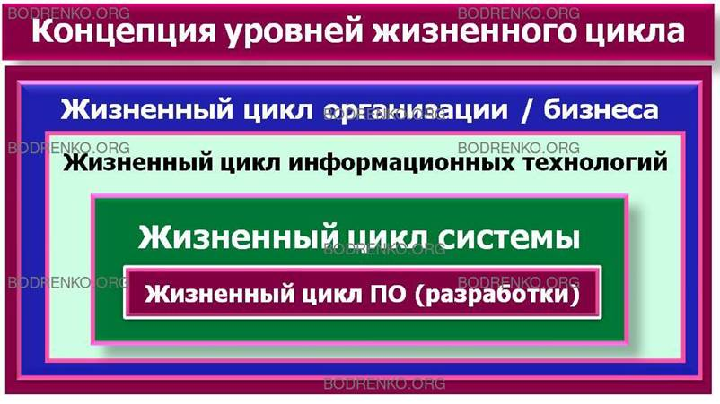
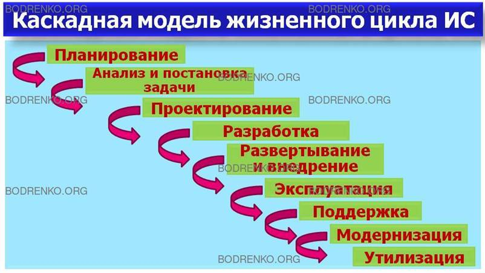
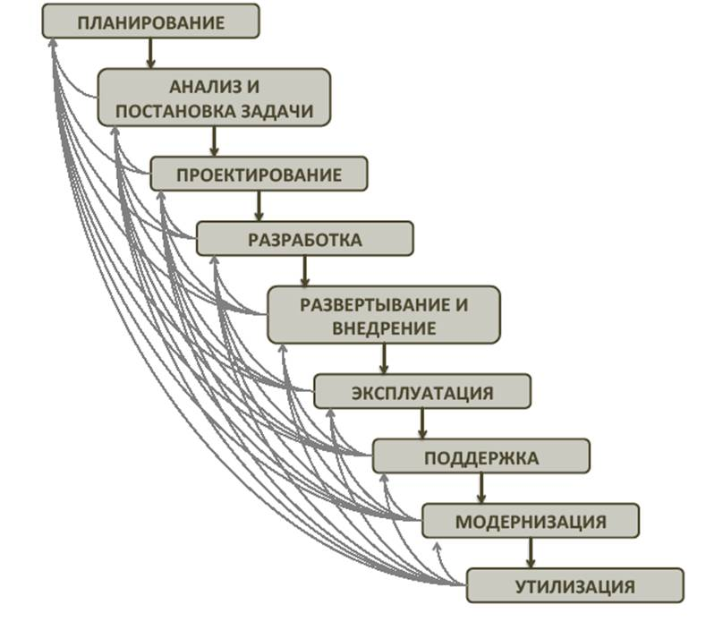
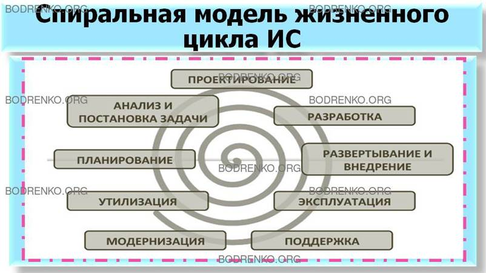
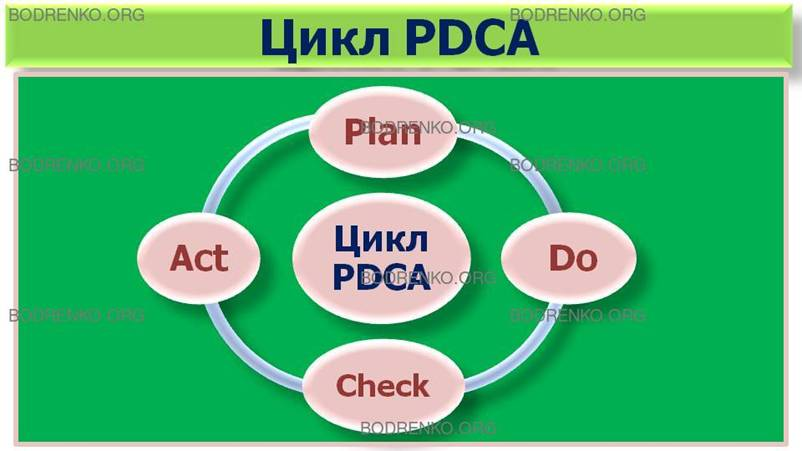
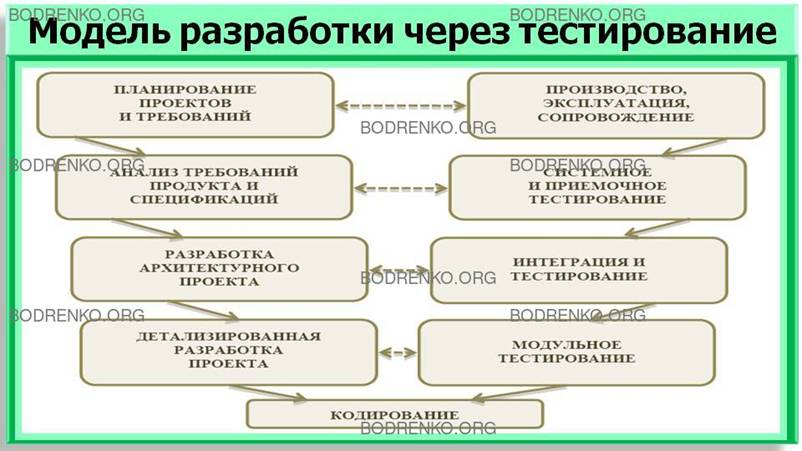

[_]: http://bodrenko.org/ujcis/ujcis-l1.htm "содрано отсюда"
[_]: https://studfile.net/preview/3972907/page:4/

[содержание](/readme.md)

# Жизненный цикл информационных систем

* [Модели жизненного цикла ИС.](#Модели_жизненного_цикла_ИС)

Понятие жизненного цикла является одним из базовых понятий методологии проектирования информационных систем. 

**Жизненный цикл информационной системы** – это непрерывный процесс, начинающийся с момента принятия решения о создании информационной системы и заканчивающийся в момент полного изъятия ее из эксплуатации

Стандарт ISO/IEC 12207 определяет структуру жизненного цикла, содержащую процессы, действия и задачи, которые должны быть выполнены во время создания информационной системы. Согласно данному стандарту структура жизненного цикла основывается на трех **группах процессов**:

1. основные процессы жизненного цикла (приобретение, поставка, разработка, эксплуатация, сопровождение);

2. вспомогательные процессы, обеспечивающие выполнение основных процессов (документирование, управление конфигурацией, обеспечение качества, верификация, аттестация, оценка, аудит, разрешение проблем);

3. организационные процессы (управление проектами, создание инфраструктуры проекта, определение, оценка и улучшение самого жизненного цикла, обучение).

Среди **основных процессов** жизненного цикла наибольшую важность разработка, эксплуатация и сопровождение. Каждый процесс характеризуется определенными задачами и методами их решения, исходными данными, полученными на предыдущем этапе, и результатами.

1. **Разработка**. Разработка информационной системы включает в себя все работы по разработке информационного программного обеспечения и его компонентов в соответствии с заданными требованиями. Разработка информационного программного обеспечения также включает:
    1. оформление проектной и эксплуатационной документации;
    2. подготовку материалов, необходимых для проведения тестирования тайных программных продуктов;
    3. разработку материалов, необходимых для организации обучения персонала.

    Разработка является одним из важнейших процессов жизненного цикла информационной системы и, как правило, включает в себя стратегическое планирование, анализ, проектирование и реализацию (программирование).

2. **Эксплуатация**. Эксплуатационные работы можно подразделить на подготовительные и основные. 

    К подготовительным относятся:

    1. конфигурирование базы данных и рабочих мест пользователей;
    2. обеспечение пользователей эксплуатационной документацией;
    3. обучение персонала.

    Основные эксплуатационные работы включают:

    1. непосредственно эксплуатацию;
    2. локализацию проблем и устранение причин их возникновения;
    3. модификацию программного обеспечения;
    4. подготовку предложений по совершенствованию системы;
    5. развитие и модернизацию системы.

3. **Сопровождение**. Службы технической поддержки играют весьма заметную роль в жизни любой корпоративной информационной системы. Наличие квалифицированного технического обслуживания на этапе эксплуатации информационной системы является необходимым условием для решения поставленных перед ней задач. Причем ошибки обслуживающего персонала могут приводить к явным или скрытым финансовым потерям сопоставимым со стоимостью самой информационной системы.

---

Показательно, что при рассмотрении основных вех истории информационных систем, в разные периоды фокус смещался с одного элемента ИС на другой. Так, первые десятилетия развивалось аппаратное, техническое обеспечение, затем со стремительным ростом масштабов разработки программных средств потребовалось срочно принимать необходимые организационные меры, чтобы обеспечить соответствие квалификации и компетенций специалистов минимальным требованиям к пользователям систем.

Соответственно, различные элементы информационных систем развивались по разным сценариям, а значит, они имеют и свою специфику жизненных циклов.

Наиболее часто ключевые стороны, задействованные в создании и эксплуатации информационной системы, ассоциируют ее с программным обеспечением, лежащем в основе этой ИС. Тогда в чем основное отличие жизненного цикла информационной системы от жизненного цикла программного обеспечения?

Ответ начинается с самого определения информационной системы, охватывающего большее количество аспектов, нежели просто ПО. Программное обеспечение может быть модернизировано, обновлено до новых версий несколько раз в рамках одного жизненного цикла информационной системы. Однако это будет все та же информационная система, возможно, с теми же инфраструктурными и организационными ресурсами. Могут приходить и уходить сотрудники, обновляться системы хранения данных, но это лишь части информационной системы, которая все равно будет выполнять свои основные функции до момента вывода из эксплуатации.

Интересная для рассмотрения концепция уровней жизненного цикла была предложена в 2005 году Скоттом Амблером, автором практик гибкого моделирования Agile Modeling и концепции Enterprise Unified Process.

* Жизненный цикл организации / бизнеса
* Жизненный цикл информационных технологий
* Жизненный цикл системы
* Жизненный цикл ПО (разработки)

Логика рассуждений в данном случае следующая: жизненный цикл бизнеса включает всю деятельность ИТ-департамента, в том числе по разработке, развертыванию, поддержке и сопровождению информационных систем, частью которых является программное обеспечение. Но для того, чтобы проверить эту концепцию, необходимо рассмотреть основные аспекты жизненного цикла ИС подробнее, фокусируясь на основных ее стадиях и их содержании.

Как уже было сказано, жизненный цикл информационных систем представляет собой непрерывный процесс из определенных этапов, начинающийся в момент принятия решения о необходимости создания ИС до отказа от ее использования.

Жизненный цикл информационной системы – непрерывный процесс, началом которого становится момент принятия решения о необходимости системы, а завершением – ее изъятие из эксплуатации. Этапы создания системы до момента ввода в эксплуатацию могут рассматриваться как самостоятельные проекты, каждый из которых имеет конкретный результат и ограничения.

А так как процесс создания и конфигурирования для различных информационных систем включает в себя один набор этапов, то можно говорить о моделях жизненного цикла.

Модель жизненного цикла ИС – комбинация последовательности этапов жизненного цикла и переходов между ними, необходимых для гарантированного достижения поставленной для реализации проекта цели.

Сами **фазы жизненного цикла** фиксированы и для различных отраслей человеческой деятельности, по сути, одинаковы:

- Замысел (планирование проекта).
- Анализ и постановка задачи.
- Проектирование.
- Разработка.
- Развертывание и внедрение.
- Эксплуатация.
- Поддержка.
- Модернизация.
- Утилизация.

Можно говорить о том, что средняя продолжительность подобного цикла составляет порядка 15 лет, однако следует учитывать, что в зависимости от огромного числа различных факторов, обусловленных спецификой предприятия, отрасли, самой информационной системы, сроки физического и морального старения техники и ПО будут значительно отличаться. А значит, еще при проектировании ИС необходимо четко представлять себе возможности ее дальнейшей модернизации, в том числе факторы, которые могут вызвать эту необходимость.

Важно понимать, что переход на новые программные решения – это не утилизация старой и проектирование новой системы. Измениться может практически все: форматы данных, работающий с системой персонал, поддерживающая инфраструктура. Остается только информация, и именно она является связующим звеном, позволяющим говорить о работе с одной и той же информационной системой. Если в системе последние десять лет хранились и обрабатывались данные по незавершенному производству, то могут приниматься решения о переходе на другую платформу, выбор решения другого вендора, для чего проведена конвертация данных, но она все равно останется информационной системой работы с производственными данными.

Порядка трети ИС прекращают свое существование еще на этапе проектирования, причиной чего часто становится несоответствие методов управления проектами (в том числе, анализа) сложности самого проекта, которая постоянно возрастает в условиях рыночной экономики, где число стейкхолдеров постоянно увеличивается, ограничения по срокам и стоимости возрастают, появляются новые конкурирующие компании и продукты. Не всегда уровень выбираемых компаниями технологий анализа / проектирования систем, как и методик управления проектом внедрения соответствует специфике бизнеса и возрастающим требованиям к автоматизации процессов.

Рассмотрим основные модели жизненного цикла, позволяющие при определении правил и условий перехода на следующую стадию нивелировать риски и оптимизировать процесс создания и передачи системы в эксплуатацию.

## Модели жизненного цикла ИС.

Под **моделью жизненного цикла** понимается структура, определяющая последовательность выполнения и взаимосвязи процессов, действий и задач, выполняемых на протяжении жизненного цикла. Модель жизненного цикла зависит от специфики информационной системы и специфики условий, в которых последняя создается и функционирует.

К настоящему времени наибольшее распространение получили следующие **основные модели жизненного цикла**:

* задачная модель;
* каскадная модель;
* спиральная модель;
* цикл Шухарта-Деминга;
* модель разработки через тестирование.

### Задачная модель

Разработка системы "снизу-вверх" от отдельных задач ко всей системе.

При такой модели единый поход к разработке неизбежно теряется, возникают проблемы при информационной стыковке отдельных компонентов. Как правило, по мере увеличения количества задач трудности нарастают, приходится постоянно изменять уже существующие программы и структуры данных. Скорость развития системы замедляется, что тормозит и развитие самой организации. Однако в отдельных случаях такая технология может оказаться целесообразной:

* Крайняя срочность (надо чтобы хоть как-то задачи решались; потом придется все сделать заново);
* Эксперимент и адаптация заказчика (не ясны алгоритмы, решения нащупываются методом проб и ошибок).

Общий вывод: достаточно большую эффективную информационной системы таким способом создать невозможно.

### Каскадная модель.

Каскадная модель жизненного цикла, также называемая моделью «водопада» (waterfall), была разработана еще в 80-х годах, и на протяжении многих лет она считалась стандартом для разработки ПО. Данная модель характеризуется тем, что этапы строго последовательны и переход между ними невозвратный. Это означает, что в рамках каскадной модели переход к следующему этапу (например, от проектирования и сбора требований к разработке и развертыванию) может произойти только по завершении предыдущего этапа. Модель «водопада» была применена одной из первых и одно из ее основных достоинств в возможности планирования сроков и стоимости каждого этапа – однако, на практике разработка системы почти никогда не проходит строго в соответствии с жесткой заранее продуманной схемой.

В частности, это касается сбора требований, так как реально при старте проекта требования бывают определены только частично и в дальнейшем уточняются, изменяются и дополняются. К тому же, если изначально требования были определены неточно, высока вероятность того, что система не будет удовлетворять потребностям заказчика.

Положительные стороны применения каскадного подхода заключаются в следующем:

* на каждом этапе формируется законченный набор проектной документации, отвечающий критериям полноты и согласованности;
* выполняемые в логичной последовательности этапы работ позволяют планировать сроки завершения всех работ и соответствующие затраты.

Каскадный подход хорошо зарекомендовал себя при построении информационных систем, для которых в самом начале разработки можно достаточно точно и полно сформулировать все требования, с тем, чтобы предоставить разработчикам свободу реализовать их как можно лучше с технической точки зрения. В эту категорию попадают сложные расчетные системы, системы реального времени и другие подобные задачи. Однако в процессе использования этого подхода обнаружился ряд его недостатков, вызванных прежде всего тем, что реальный процесс создания систем никогда полностью не укладывался в такую жесткую схему. В процессе создания постоянно возникала потребность в возврате к предыдущим этапам и уточнении или пересмотре ранее принятых решений. В результате каскадный подход преобразовался в **каскадную модель с промежуточным контролем**

### Каскадная модель с промежуточным контролем.

В качестве одной из вариаций каскадной модели для того, чтобы предусмотреть возможность возвращения к предыдущим этапам для внесения определенных изменений и пересмотра отдельных вопросов, была создана каскадная модель с промежуточным контролем.

Она предполагает увеличенное время, отведенное на разработку, за счет проведения промежуточных корректировок между фазами жизненного цикла. В свою очередь, это снижает риски получения некачественного продукта на выходе и повышает надежность системы в целом.

Важно отметить, что согласование результатов в двух описанных моделях происходит только по окончании внедрения – а значит, повышается вероятность получения программного продукта, который морально устареет либо не будет востребован рынком. Еще больше увеличивают риски возможные неточности в исходном техническом задании. В итоге можно говорить о проблеме определенной задержки в получении результата, которая не может быть решена в «каскадном» варианте разработки и внедрения системы.

Основным недостатком каскадного подхода является существенное запаздывание с получением результатов. Согласование результатов с пользователями производится только в точках, планируемых после завершения каждого этапа работ, требования к информационным системам "заморожены" в виде технического задания на все время ее создания. Таким образом, пользователи могут внести свои замечания только после того, как работа над системой будет полностью завершена. В случае неточного изложения требований или их изменения в течение длительного периода создания программного обеспечения, пользователи получают систему, не удовлетворяющую их потребностям. Модели (как функциональные, так и информационные) автоматизируемого объекта могут устареть одновременно с их утверждением. Сущность системного подхода к разработке ИС заключается в ее декомпозиции (разбиении) на автоматизируемые функции: система разбивается на функциональные подсистемы, которые в свою очередь делятся на подфункции, подразделяемые на задачи и так далее. Процесс разбиения продолжается вплоть до конкретных процедур. При этом автоматизируемая система сохраняет целостное представление, в котором все составляющие компоненты взаимоувязаны. Таким образом, данная модель основным достоинством имеет системность разработки, а основные недостатки - медленно и дорого.

### Спиральная модель.

Для нивелирования рисков, связанных с вышеописанной проблемой, была создана спиральная модель. В этой модели фазы жизненного цикла непоследовательны, то есть допустимо (но не обязательно!) начало работ над следующим этапом до завершения предыдущего. Таким образом, суть спиральной модели состоит в возможности прохождения всех этапов жизненного цикла системы в несколько итераций, каждый раз создавая новый прототип и проверяя актуальность требований, по которым он создавался,  внося технические доработки в интерфейс и функциональность. Подобная гибкость позволяет использовать модель на предприятиях любого масштаба.

Прототип крайне важен в ситуациях, когда требуется разъяснить и уточнить требования, выбрать концептуальное решение или даже в целом определить целесообразность реализации проекта. При этом сам прототип может либо моделировать исключительно пользовательский интерфейс, либо архитектурную сторону системы (логика обработки и хранения данных).

Это означает, что процесс создания системы и само управление проектом будет более гибким и управляемым, с совершенствованием системы на каждом «витке спирали», то есть при выпуске каждой версии. Уменьшаются риски (в том числе, финансовые) для заказчика и спонсора системы, которые могут отказаться от проекта еще на этапе показа первого прототипа в случае абсолютного его несоответствия ожиданиям и потребностям (либо в случае изменения рыночной ситуации).

Как правило, подобная модель применяется при разработке нетиповых систем, предоставляя возможность оперативно создать прототип программного продукта для проверки его работоспособности с пользователями и соответственно, быстрого получения комментариев и замечаний к системе.

Основная проблема спирального цикла - определение момента перехода на следующий этап. Для ее решения необходимо ввести временные ограничения на каждый из этапов жизненного цикла. Переход осуществляется в соответствии с планом, даже если не вся запланированная работа закончена. План составляется на основе статистических данных, полученных в предыдущих проектах, и личного опыта разработчиков.

Одним из возможных подходов к разработке программного обеспечения в рамках спиральной модели жизненного цикла является получившая в последнее время широкое распространение методология быстрой разработки приложений RAD (Rapid Application Development). Под этим термином обычно понимается процесс разработки программного обеспечения, содержащий 3 элемента:

* небольшую команду программистов (от 2 до 10 человек); 
* короткий, но тщательно проработанный производственный график (от 2 до 6 мес.); 
* повторяющийся цикл, при котором разработчики, по мере того, как приложение начинает обретать форму, запрашивают и реализуют в продукте требования, полученные через взаимодействие с заказчиком.

Жизненный цикл программного обеспечения по методологии RAD состоит из четырех фаз:

1. фаза определения требований и анализа;
2. фаза проектирования;
3. фаза реализации;
4. фаза внедрения.

### Цикл Шухарта-Деминга.

Определенным прообразом спиральной модели ЖЦ стал классический цикл управления Деминга (PDCA-цикл).

PDCA (Plan – Do – Check – Act) – Цикл качества, еще называемый циклом Деминга. Этот алгоритм управления предполагает четыре основных шага «Планирование – Действие – Проверка – Корректировка» и помимо стандартной области применения в менеджменте предприятия возможно использовать его в управлении внедрением и развитием информационной системы. Таким образом, этап планирования может начинаться как при первичном проектировании системы, так и при старте ее модернизации, когда, как мы говорили, снова необходимо пройти все этапы жизненного цикла системы.

Графически цикл Деминга может быть представлен следующим образом:

При планировании появляется возможность совершенствования процессов и операций, определения и выделения необходимых для них ресурсов. По окончании следующего этапа (выполнения запланированных работ) обязательно проводится мониторинг результатов и сбор данных для аналитики и определения соответствия плановым показателям для принятия дальнейших мер по корректировке проводимых активностей и принципов распределения ресурсов – что, как мы видели, и является основной идеей итерационной модели создания ИС.

Итерационную / спиральную модель невозможно применять для областей, в которых невозможно предварительное тестирование продукта, обладающего неполной функциональностью – в частности, военные разработки, авиастроение, атомная энергетика, ведь любая ошибка стоит жизни. Однако при разработке бизнес-ориентированной информационной системы собственными силами ИТ-подразделения компании данная модель применяется достаточно часто, хотя важно принимать во внимание возможное сопротивление со стороны пользователей, которые хотят видеть требующуюся именно им функциональность в первом же релизе, а не втором или третьем. Соответственно, на первый план выходит необходимость грамотного управления ожиданиями пользователей.

### Модель разработки через тестирование (V-модель).

Приближенная по своей сути к практикам PRINCE2, V-модель разработки через тестирование была разработана еще в конце 1980-х годов ведомствами Германии и США, и до сих пор является стандартом немецких правительственных и оборонных проектов. Основной ее принцип состоит в постепенном возрастании степени детализации проекта с течением времени и одновременном проведении «горизонтальных» итераций. Таким образом, результаты каждой из фаз левой стороны буквы V влияют на тестирование и компоновку проекта с правой стороны буквы V: приемо-сдаточные испытания основываются на проведенном анализе требований, интеграционное тестирование – на высокоуровневом описании архитектуры, модульное тестирование – на архитектуре, интерфейсах, алгоритмах и прочих элементах детализированных требованиях к системе.

Важна гибкость данной модели, так как, по сути, она адаптируема под любой тип организации. Промежуточные результаты проверяются на ранних стадиях, и минимизация рисков достигается благодаря простому соотнесению фаз / итераций. V-модель не рассматривает непосредственно стадию обслуживания и утилизации, учитывая лишь активности по подготовке к ним.

Рассмотрев основные особенности моделей жизненного цикла, перейдем к фазам проекта по созданию и внедрению интегрированной системы управления как совокупности этапов по созданию, настройке, доработке и внедрению отдельных функциональных модулей системы, выполнение которых необходимо и достаточно для создания системы управления, соответствующей заданным требованиям.

# КОНТРОЛЬНЫЕ ВОПРОСЫ

1. Дайте определение понятию «жизненный цикл информационной системы».
2. Назовите группы процессов жизненного цикла.
3. Назовите основные процессы жизненного цикла ИС.
4. Назовите фазы жизненного цикла ИС.
5. Что понимается под моделью жизненного цикла.
6. Назовите основные модели жизненного цикла.

[содержание](/readme.md)
