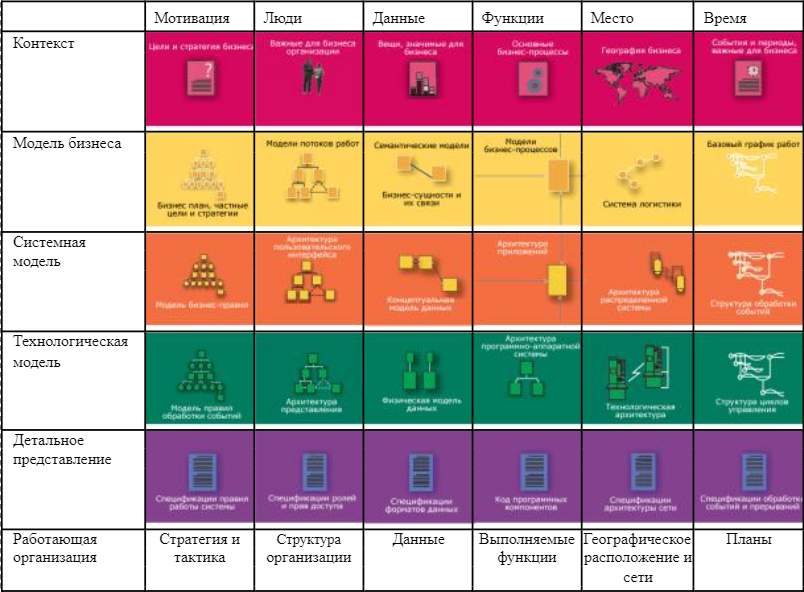
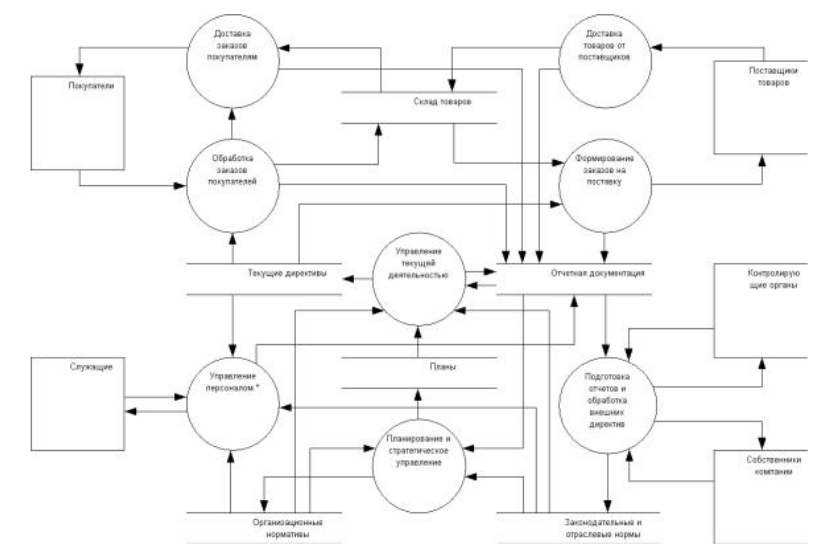
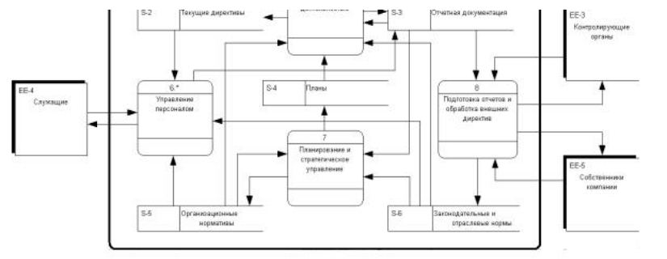
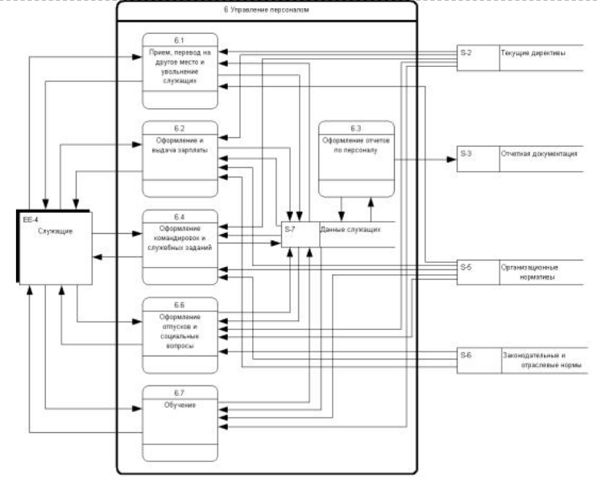
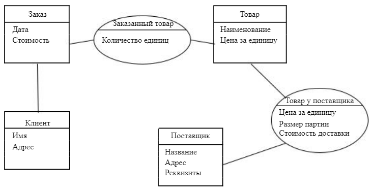

<table style="width: 100%;"><tr><td style="width: 40%;">
<a href="../articles/5_1_1_1_intro2.md">Основные понятия и определения ИС.
</a></td><td style="width: 20%;">
<a href="../readme.md">Содержание
</a></td><td style="width: 40%;">
<a href="../articles/5_1_1_10_uml_use_case.md">Диаграмма вариантов использования (прецедентов, use case)
</a></td><tr></table>

<!-- 
https://studfile.net/preview/6354126/page:11/ 
-->

# Анализ предметной области. Основные понятия системного и структурного анализа.

## Анализ предметной области

Для того, чтобы разработать программную систему, приносящую реальные выгоды определенным пользователям, необходимо сначала выяснить, какие же задачи она должна решать для этих людей и какими свойствами обладать.

Требования к ПО определяют, какие свойства и характеристики оно должно иметь для удовлетворения потребностей пользователей и других заинтересованных лиц. Однако сформулировать требования к сложной системе не так легко. В большинстве случаев будущие пользователи могут перечислить набор свойств, который они хотели бы видеть, но никто не даст гарантий, что это — исчерпывающий список. Кроме того, часто сама формулировка этих свойств будет непонятна большинству программистов: могут прозвучать фразы типа «должно использоваться и частотное, и временное уплотнение каналов», «передача клиента должна быть мягкой», «для обычных швов отмечайте бригаду, а для доверительных — конкретных сварщиков», и это еще не самые тяжелые для понимания примеры.

Чтобы ПО было действительно полезным, важно, чтобы оно удовлетворяло реальные потребности людей и организаций, которые часто отличаются от непосредственно выражаемых пользователями желаний. Для выявления этих потребностей, а также для выяснения смысла высказанных требований приходится проводить достаточно большую дополнительную работу, которая называется анализом предметной области или бизнес-моделированием, если речь идет о потребностях коммерческой организации. В результате этой деятельности разработчики должны научиться понимать язык, на котором говорят пользователи и заказчики, выявить цели их деятельности, определить набор задач, решаемых ими. В дополнение стоит выяснить, какие вообще задачи нужно уметь решать для достижения этих целей, выяснить свойства результатов, которые хотелось бы получить, а также определить набор сущностей, с которыми приходится иметь дело при решении этих задач. Кроме того, анализ предметной области позволяет выявить места возможных улучшений и оценить последствия принимаемых решений о реализации тех или иных функций.

После этого можно определять область ответственности будущей программной системы — какие именно из выявленных задач будут ею решаться, при решении каких задач она может оказать существенную помощь и чем именно. Определив эти задачи в рамках общей системы задач и деятельностей пользователей, можно уже более точно сформулировать требования к ПО.

Анализом предметной области занимаются системные аналитики или бизнес-аналитики, которые передают полученные ими знания другим членам проектной команды, сформулировав их на более понятном разработчикам языке. Для передачи этих знаний обычно служит некоторый набор моделей, в виде графических схем и текстовых документов.

Анализ деятельности крупной организации, такой, как банк с сетью региональных отделений, нефтеперерабатывающий завод или компания, производящая автомобили, дает огромные объемы информации. Из этой информации надо уметь отбирать существенную, а также надо уметь находить в ней пробелы — области деятельности, информации по которым недостаточно для четкого представления о решаемых задачах. Значит, всю получаемую информацию надо каким-то образом систематизировать. Для систематизации сбора информации о больших организациях и дальнейшей разработки систем, поддерживающих их деятельность, применяется схема Захмана (автор — John Zachman) или **архитектурная схема предприятия** (enterprise architecture framework).

 

Таблица 1. Схема Захмана. Приведены примеры моделей для отдельных клеток.

В основе схемы Захмана лежит следующая идея: деятельность даже очень большой организации можно описать, используя ответы на простые вопросы — зачем, кто, что, как, где и когда, — и разные уровни рассмотрения. Обозначенные 6 вопросов определяют 6 аспектов рассмотрения.

- Цели организации и базовые правила, по которым она работает.
- Персонал, подразделения и другие элементы организационной структуры, связи между ними.
- Сущности и данные, с которыми имеет дело организация.
- Выполняемые организацией и различными ее подразделениями функции и операции над данными.
- Географическое распределение элементов организации и связи между географически разделенными ее частями.
- Временные характеристики и ограничения на деятельность организации, значимые для ее деятельности события.

Также выделены несколько уровней рассмотрения, из которых при бизнес-моделировании особенно важны три верхних.

- Самый крупный — *уровень организации в целом*, рассматриваемой в ее развитии совместно с окружением, уровень общего планирования ее деятельности. Этот уровень содержит долговременные цели и задачи организации как цельной системы, основные связи организации с внешним миром и основные виды ее деятельности.

- *Уровень бизнеса*, на котором организация рассматривается во всех аспектах как отдельная сущность, имеющая определенную структуру, которая соответствует ее основным задачам.

- *Системный уровень*, на котором определяются концептуальные модели всех аспектов организации, без привязки к конкретным их воплощениям и реализациям, например, логическая модель данных в виде набора сущностей и связей между ними, логическая архитектура системы автоматизации в виде набора узлов, с привязанными к ним функциями и пр.

Наиболее удобной формой представления информации при анализе предметной области являются графические диаграммы различного рода. Они позволяют достаточно быстро зафиксировать полученные знания, быстро восстанавливать их в памяти и успешно объясняться с заказчиками и другими заинтересованными лицами. Набросать рисунок из прямоугольников и связывающих их стрелок обычно можно гораздо быстрее, чем записать соответствующий объем информации, и на рисунке за один взгляд видно гораздо больше, чем в тексте. Изредка встречаются люди, лучше ориентирующиеся в текстах и более адекватно их понимающие, но чаще рисунки все же более удобны для иллюстрации мыслей и объяснения сложных вещей.

Рисунок 1. Схема деятельности компании в нотации Йордана-ДеМарко.

Часто для описания поведения сложных систем и деятельности крупных организаций используются **диаграммы потоков данных** (data flow diagrams). Эти диаграммы содержат 4 вида графических элементов: процессы, представляющие собой любые трансформации данных в рамках описываемой системы, хранилища данных, внешние по отношению к системе сущности и потоки данных между элементами трех предыдущих видов.

Используются несколько систем обозначений для перечисленных элементов, наиболее известны нотация Йордана-ДеМарко (Yourdon-DeMarco) и нотация Гэйна-Сарсона (GaneSarson), обе предложенные в 1979 году. Рис. 1 показывает диаграмму потоков данных, которая описывает деятельность компании, управляющей небольшим магазином. Эта диаграмма изображена в нотации Йордана-ДеМарко: процессы изображаются кружками, внешние сущности — прямоугольниками, а хранилища данных — двумя горизонтальными параллельными линиями. На Рис. 2 изображена та же диаграмма в нотации Гейна-Сарсона: на ней процессы — прямоугольники со скругленными углами, внешние сущности — прямоугольники с тенью, а хранилища данных — вытянутые горизонтально прямоугольники без правого ребра.

Рисунок 2. Схема деятельности компании в нотации Гэйна-Сарсона.

Процессы на диаграммах потоков данных могут уточняться: если некоторый процесс устроен достаточно сложно, для него можно нарисовать отдельную диаграмму, описывающую потоки данных внутри этого процесса. На ней показываются те элементы, с которыми этот процесс связан потоками данных, и составляющие его более мелкие процессы и хранилища. Таким образом, возникает иерархическая структура процессов. Обычно на самом верхнем уровне находится один процесс, представляющий собой систему в целом, и набор внешних сущностей, с которыми она взаимодействует.
На Рис. 3 показана возможная детализация процесса «Управление персоналом».

Рисунок 3. Детализация процесса "Управление персоналом".

Диаграммы потоков данных появились как один из первых инструментов представления деятельности сложных систем при использовании структурного анализа. Для представления структуры данных в этом подходе используются диаграммы сущностей и связей (entityrelationship diagrams, ER diagrams), изображающие набор сущностей предметной области и связей между ними. И сущности, и связи на таких диаграммах могут иметь атрибуты. Пример такой диаграммы представлен на Рис. 4.

Рисунок 4. Модель сущностей и связей.

Хотя методы структурного анализа могут значительно помочь при анализе систем и организаций, дальнейшая разработка системы, поддерживающей их деятельность, с использованием объектно-ориентированного подхода часто требует дополнительной работы по переводу полученной информации в объектно-ориентированные модели.

Методы объектно-ориентированного анализа предназначены для обеспечения более удобной передачи информации между моделями анализируемых систем и моделями разрабатываемого ПО. В качестве графических моделей в этих методах вместо диаграмм потоков данных используются [рассматривавшиеся при обсуждении RUP](https://studfile.net/preview/6354126/page:9/) **диаграммы вариантов использования**, а вместо диаграмм сущностей и связей — **диаграммы классов**.

Однако диаграммы вариантов использования несут несколько меньше информации по сравнению с соответствующими диаграммами потоков данных: на них процессы и хранилища в соответствии с принципом объединения данных и методов работы с ними объединяются в варианты использования, и остаются только связи между вариантами использования и действующими лицами (аналогом внешних сущностей). Для представления остальной информации каждый вариант использования может дополняться набором разнообразных диаграмм UML — диаграммами деятельностей, диаграммами сценариев, и пр. Обо всех этих видах диаграмм будет рассказано в лекции, посвященной архитектуре программного обеспечения.

# Основные понятия системного анализа

* [Задачи структурного системного анализа](#Задачи-структурного-системного-анализа)
* [Истоки структурного моделирования](#Истоки-структурного-моделирования)
* [Идеи и принципы ССА](#Идеи-и-принципы-ССА)
* [Другие принципы ССА](#Другие-принципы-ССА)
* [Инструментарий ССА](#Инструментарий-ССА)
* [Принципы построения ИС](#Принципы-построения-ИС)

Прежде чем внедрять ИС, необходимо изучить и описать существующее положение, а затем предложить (спроектировать) новую структуру управления и организации бизнес-процессов, возможно, с использованием современной ИС.

Главным подходом к исследованию сложных объектов считается системный анализ. Практической реализацией системного анализа стал структурный системный анализ (ССА). Говоря в дальнейшем о ССА, будем иметь в виду задачи не только анализа, но и описания и проектирования систем.

## Задачи структурного системного анализа

В менеджменте перед ССА ставятся следующие задачи:
- описать существующее положение вещей (объект управления), т.е. построить так называемую модель "как есть" ("AS-IS");
- предложить новые решения по структуре управления или технологии выполнения бизнес-процессов, т.е. построить модель "как должно быть" ("ТО-ВЕ"). При этом предприятие рассматривается в качестве сложной бизнес-системы, функционирующей на основе определенного множества бизнес-процессов. Задачей реорганизации является перевод предприятия в некоторое целевое состояние, характеризующееся, как правило, качественно более высоким уровнем организации работы за счет:
    - повышения эффективности бизнес-процессов;
    - создания организационной структуры, направленной на поддержку выполнения бизнес-процессов;
    - создания информационной системы поддержки выполнения бизнес-процессов.

При создании ИС специалисты сталкиваются с задачами: построить модель "как есть" объекта автоматизации и спроектировать информационную систему модель "как должно быть".
Таким образом, модель "как есть", построенная и менеджером, и специалистом по ИС, будет одинаковой, а модели "как должно быть" будут различными по причине использования разных профессиональных инструментов решения проблем: у менеджеров - за счет структурной реорганизации или реорганизации бизнес-процессов, у специалистов по ИС за счет автоматизации. Но поскольку нельзя автоматизировать существующий беспорядок, то автоматизации должна предшествовать работа по реорганизации, а, с другой стороны, реорганизация даст наибольший эффект, если она будет проведена с использованием современных ИС.

В процессе ССА рассматриваются функциональные, информационные и динамические модели, а также модели функционально-стоимостного анализа (АВС-модели).

## Истоки структурного моделирования

В основе ССА лежит графическое представление исследуемого или проектируемого объекта.
Основы современных методов структурно-функционального анализа и моделирования сложных систем были разработаны в трудах профессора Массачусетского технологического института Дугласа Росса, который впервые использовал понятие "структурный анализ" в конце 60-х годов. О дальнейшем развитии идеи описания сложных объектов с помощью относительно небольшого набора типовых элементов свидетельствовало появление методологии структурно-функционального моделирования и анализа сложных систем (SADT), которая постоянно совершенствовалась и широко использовалась для эффективного решения целого ряда проблем (управление финансами и материально-техническим снабжением крупных фирм; разработка программного обеспечения АСУ телефонными сетями; долгосрочное и стратегическое планирование деятельности фирм; проектирование вычислительных систем и сетей и др.).

## Идеи и принципы ССА

Главная задача ССА описание работы сложной системы с должной точностью и полнотой, которое должно быть доступно как специалисту аналитику, проектировщику и программисту, так и заказчику (конечному пользователю системы). В этом заключается наибольшая трудность. В частности, системный аналитик сталкивается со следующими взаимосвязанными проблемами:
- Аналитику сложно получить исчерпывающую информацию для оценки требований к системе с точки зрения заказчика.
- Заказчик, в свою очередь, не имеет достаточной информации о проблеме (реорганизации предприятия и бизнес-процессов или построении ИС) и поэтому не может судить о том, что является выполнимым, а что нет.

Аналитик сталкивается с чрезмерным количеством подробных сведений как о предметной области, так и о новой системе.

Спецификация системы из-за объема и технических терминов часто непонятна для заказчика.
Если спецификация понятна заказчику, то она будет являться недостаточной для проектировщиков и программистов, создающих систему.

Методы ССА основаны на следующих принципах, помогающих преодолеть сложности, возникающие при описании систем:
- расчленение систем на части "черные ящики";
- иерархическая организация этих "черных ящиков";
- использование графических средств.

Удобство использования кибернетического принципа "черного ящика" заключается в том, что нет необходимости знать, как работает система, представляемая "черным ящиком" следует знать лишь его входы и выходы, а также его назначение, т.е. функцию, которую он выполняет (что делает система). Таким образом, первым шагом упрощения сложной системы является ее разбиение на "черные ящики". Такое разбиение должно удовлетворять следующим критериям:
- каждый "черный ящик" реализует единственную функцию системы;
- функция каждого "черного ящика" является легко понимаемой независимо от сложности ее реализации;
связь между "черными ящиками" вводится только при наличии связи между соответствующими функциями системы;
- связи должны быть простыми, насколько это возможно, для обеспечения их независимости друг от друга.

Второй важной идеей, лежащей в основе структурных методов, является идея иерархии.

Иерархия - расположение частей или элементов целого в порядке от высшего к низшему.
При исследовании системы с помощью методов системного анализа используется так называемая стратификация, при которой описание объекта проводится послойно, начиная с первого слоя (страты) самого общего вида, с детализацией на каждом следующем слое. При этом каждый объект текущего слоя, с одной стороны, является элементом (условно находится в подчинении) некого объекта предыдущего (верхнего) слоя, а с другой представляется в виде набора подчиненных элементов в следующем (нижнем) слое. В результате образуется некая иерархическая структура.

Третья идея ССА широкое использование графических нотаций, что облегчает понимание сложных систем.
В результате можно дать следующее определение ССА: структурным системным анализом называется метод исследования, проектирования и описания сложных систем в виде иерархии "черных ящиков" с помощью графических средств.

## Другие принципы ССА

Методология ССА строится на общих (базовых) принципах. Но существуют также и другие принципы, без учета которых не возможно проведение ССА:
- формализации (необходимость строго методического подхода к решению проблемы);
- абстрагирования (выделение существенных с некоторых позиций аспектов системы и отвлечение от несущественных с целью представления проблемы в упрощенном общем виде);
- "упрятывания" (скрытие несущественной на конкретном этапе информации каждая часть "знает" только необходимую ей информацию);
- концептуальной общности (следование единой философии на всех этапах ЖЦ: структурный анализ структурное проектирование структурное тестирование);
- непротиворечивости (обоснованность и согласованность элементов);
логической независимости (концентрация внимания на логическом проектировании для обеспечения независимости от физического проектирования).

Соблюдение указанных принципов необходимо при организации работ на начальных этапах ЖЦ независимо от используемых методологий. При этом уже на ранних стадиях разработки удается понять, что будет представлять собой создаваемая система, обнаружить промахи и недоработки. Следует своевременно исправлять ошибки с целью облегчения работы на последующих этапах ЖЦ и понижения стоимости разработки.

Классы моделей ССА:
- функциональные модели, с помощью которых производится описание бизнес-процесса в виде иерархии функций, связанных между собой входящими и выходящими потоками (материальными, финансовыми, информационными), управляющими воздействиями, исполнителями;
- информационные модели, позволяющие описать информационное пространство выполнения бизнес-процессов в форме согласованной системы, содержащей информационные объекты (сущности), их свойства (атрибуты), отношения с другими объектами (связи);
- ABC-модели, описывающие механизм формирования стоимости и других характеристик изделий и услуг на основе стоимости функций и ресурсов, задействованных в бизнес-процессах;
динамические модели бизнес-процессов, описывающие зависящие от времени характеристики выполнения процесса и распределение ресурсов для входящих потоков различной структуры при различных значениях управляющих параметров.

## Инструментарий ССА

В качестве компьютерного инструмента ССА используются CASE-средства.

**CASE-cpедcmвa** - комплекс средств автоматизации для анализа, проектирования, разработки и сопровождения сложных систем.

В **основе CASE лежат такие понятия**, как *методология*, *метод*, *нотация* и *средство*.

**Методология** определяет совокупность методов, правила их использования, а также последовательность шагов выполнения работы.

**Метод** - процедура или техника описания компонентов объекта исследования, программного обеспечения или ИС.

**Нотации** предназначены для описания структуры системы, элементов данных, этапов обработки и включают графы, диаграммы, таблицы, блок-схемы, формальные. и естественные языки.

**Средства** - инструментарий для поддержки и усиления методов.

## Принципы построения ИС.

Проектирование имеет целью обеспечить эффективное функционирование АИС и взаимодействие АИТ со специалистами, использующими в сфере деятельности конкретного экономического объекта ЭВМ и развитые средства коммуникации для выполнения своих профессиональных задач и принятия управленческих решений.

В процессе проектирования совершенствуются как организация основной деятельности экономического объекта (производственной, хозяйственной), так и организация управленческих процедур.
Массовое проектирование АИС потребовало разработки единых теоретических положений, методических подходов к их созданию и функционированию. ИС создаются в соответствии с техническим заданием., являющимся исходным документом для проектирования ИС.
Основополагающие **принципы создания АИС**: *системности*, *развития*, *совместимости*, *стандартизации и унификации*, *эффективности*.

Принцип системности является важнейшим при создании, функционировании и развитии АИС. Он позволяет подойти к исследуемому объекту как единому целому; выявить на этой основе многообразные типы связей между структурными элементами, обеспечивающими целостность системы; установить направления производственно-хозяйственной деятельности системы и реализуемые ею конкретные функции. Системный подход предполагает проведение двухаспектного анализа, получившего название макро и микроподходов.

При макроанализе система или ее элемент рассматриваются как часть системы более высокого порядка. Особое внимание уделяется информационным связям: устанавливается их число, выделяются и анализируются те связи, которые обусловлены целью изучения системы, а затем выбираются наиболее предпочтительные, реализующие заданную целевую функцию. При микроанализе изучается структура объекта, анализируются ее составляющие элементы с точки зрения их функциональных характеристик, проявляющихся через связи с другими элементами и внешней средой. В процессе проектирования АИС системный подход позволяет использовать математическое описание функционирования, исследование различных свойств отдельных элементов и системы в целом, моделировать изучаемые процессы для анализа работы вновь создаваемых систем.

Практическое значение системного подхода и моделирования состоит в том, что они позволяют в доступной для анализа форме не только отразить все существенное, интересующее создателя системы, но и использовать ЭВМ для исследования поведения системы в конкретных, заданных экспериментатором условиях. Поэтому в основе создания АИС в настоящее время лежит метод моделирования на базе системного подхода, позволяющий находить оптимальный вариант структуры системы и тем самым обеспечивать наибольшую эффективность ее функционирования.

Принцип развития заключается в том, что АИС создается с учетом возможности постоянного пополнения и обновления функций системы и видов ее обеспечении. Предусматривается, что автоматизированная система должна наращивать свои вычислительные мощности, оснащаться новыми техническими и программными средствами, быть способной постоянно расширять и обновлять круг задач и информационный фонд, создаваемый в виде системы баз данных.

Принцип совместимости заключается в обеспечении способности взаимодействия АИС различных видов, уровней в процессе их совместного функционирования. Реализация принципа совместимости позволяет обеспечить нормальное функционирование экономических объектов, повысить эффективность управления народным хозяйством и его звеньями.

Принцип единого информационного пространства:
- пространственная распределенность пользователей;
- функционирование ИС в режиме реального времени;
- расширенные глобальные телекоммуникационные возможности;
- внутрисистемная информационная связанность;
- множественность интерфейсов; виртуальность и однородность их технической реализации;

Принцип стандартизации и унификации заключается в необходимости применения типовых, унифицированных и стандартизированных элементов функционирования АИС. Внедрение в практику создания и развития АИС этого принципа позволяет сократить временные, трудовые и стоимостные затраты на создание АИС при максимально возможном использовании накопленного опыта в формировании проектных решении и внедрении автоматизации проектировочных работ.

Принцип надежности, защищенности и безопасности:
- резервирование, в том числе техническое и информационное дублирование (включая создание резервного информационного центра);
- множественность уровней защиты;
- авторизация и контроль доступа в систему для проведения отдельных операций и функций;
- ведение журналов операций и документооборота;

Принцип эффективности заключается в достижении рационального соотношения между затратами на создание АИС и целевым эффектом, получаемым при ее функционировании.

Кроме основополагающих принципов для эффективного осуществления управления выделяют также ряд частных принципов, детализирующих общие. Соблюдение каждого из частных принципов позволяет получить определенный экономический эффект. Один из них - принцип декомпозиции - используется при изучении особенностей, свойств элементов и системы в целом. Он основан на разделении системы на части, выделении отдельных комплексов работ, создает условия для более эффективного ее анализа и проектирования.

Для реализации перечисленных требований и обеспечения структурной и функциональной полноты интегрированной АИС необходима реализация проекта с соблюдением ряда **принципов проектирования**:

Принцип *первого руководителя* предполагает закрепление ответственности при создании системы за заказчиком - руководителем предприятия, организации, отрасли, т.е. будущим пользователем, который отвечает за ввод в действие и функционирование АИС.

Принцип первого руководителя предусматривает:
- наличие у руководителя проекта реальных полномочий при рассмотрении и утверждении концепции и стратегии развития;
- контроль за сроками, технологичностью и полнотой проекта;
- возможность делегирования и перераспределения полномочий;
- подготовку и переподготовку персонала, участвующего в проекте;
- координацию усилий подразделений на всех стадиях жизненного цикла проекта системы;

Принцип *новых задач* - поиск постоянного расширения возможностей системы, совершенствование процесса управления, получение дополнительных результатных показателей с целью оптимизировать управленческие решения. Это может сопровождаться постановкой и реализацией при использовании ЭВМ и других технических средств новых задач управления.

Принцип *автоматизации информационных потоков и документооборота* предусматривает комплексное использование технических средств на всех стадиях прохождения информации от момента ее регистрации до получения результатных показателей и формирования управленческих решений.

Принцип *автоматизации проектирования* имеет целью повысить эффективность самого процесса проектирования и создания АИС на всех уровнях народного хозяйства, обеспечивая при этом сокращение временных, трудовых и стоимостных затрат за счет внедрения индустриальных методов. Современный уровень разработки и внедрения систем позволяет широко использовать типизацию проектных решений, унификацию методов и средств при подготовке проектных материалов, стандартизацию подходов при проектировании отдельных элементов систем и подсистем, методы автоматизации ведения проектных работ с использованием персональных ЭВМ и организованных на их базе автоматизированных рабочих мест проектировщика.

---

Рассмотренные базовые принципы дополняются не менее важными организационно-технологическими, без которых невозможна разработка новых информационных технологий. Наиболее применяемые **организационно-технологические принципы создания АИТ**:
- Принцип *абстрагирования* заключается в выделении существенных (с конкретной позиции рассмотрения) аспектов системы и отвлечении от несущественных с целью представления проблемы в более простом общем виде, удобном для анализа и проектирования.
- Принцип *формализации* заключается в необходимости строгого методического подхода к решению проблемы, использованию формализованных методов описания и моделирования изучаемых и проектируемых процессов, включая бизнес-процессы, функционирования системы.
- Принцип *концептуальной общности* заключается в неукоснительном следовании единой методологии на всех этапах проектирования автоматизированной системы и всех ее составляющих.
- Принцип *непротиворечивости и полноты* заключается в наличии всех необходимых элементов во вновь создаваемой системе и согласованном их взаимодействии.
- Принцип *независимости данных* предполагает, что модели данных должны быть проанализированы и спроектированы независимо от процессов их обработки, а также от их физической структуры и распределения в технической среде.
- Принцип *структурирования данных* предусматривает необходимость структурирования и иерархической организации элементов информационной базы системы.
- Принцип *доступа конечного пользователя* заключается в том, что пользователь должен иметь средства доступа к базе данных, которые он может использовать непосредственно (без программирования).

Соблюдение приведенных принципов необходимо при выполнении работ на всех стадиях создания и функционирования АИС, т.е. в течение всего их жизненного цикла.

# Пример описания предметной области "Фитнесс-центр"

**Программа для фитнес-центра по распределению фитнес – расписания и контроля его соблюдения**

Предполагается, что в системе фитнес центра будет 3 роли пользователей: клиенты, тренеры, администраторы. Авторизация в системе производится по телефону и паролю.
Клиенты могут зарегистрироваться в системе, указав ФИО, телефон, пароль, дату рождения, фото профиля, пол. 

Администраторы – пользователи с уже заполненным профилем. Они могут добавлять новых тренеров и записывать их на различные курсы обучения с целью поддержки и улучшения их профессиональной квалификации. Постоянным клиентам администраторы могут предоставлять скидки на тренировки.

Любой клиент после авторизации может выбрать себе тренера (если у него нет такового).  В этом случае клиент видит список тренеров с именем, фото, полом, стажем работы и списком достижений. Клиент может отправить заявку любому из тренеров, написав при этом цель, которую он хочет достигнуть при тренировках.

Тренер после авторизации видит новые заявки от клиентов и их количество (если таковые имеются).  Тренер может принять заявку или отклонить. В случае отказа, тренер должен указать причину. В случае подтверждения заявки тренер должен выставить план индивидуальных занятий для клиента. Выбрав из списка клиентов без плана тренировок, тренер видит цель клиента, его возраст и планирует даты тренировочного цикла. Для индивидуальных занятий тренер может выбрать упражнения, указывая при этом его вид (приседания, отжимания и т.д.), частоту выполнения (сколько раз в неделю), число подходов и число повторений в каждом подходе.

Клиент, отправивший заявку, но не получивший ответа, видит список своих заявок с результатами (в том числе с указанием причины при отказе) и количеством дней ожидания ответа. Получив план тренировок, клиент видит экран с 2 вкладками: план тренировок (дата-список упражнений через запятую) и сегодняшний перечень индивидуальных занятий. Для последней выводится список: вид упражнения, количество повторов и Checkbox, позволяющий отметить выполнения, упражнения. Несмотря на это, упражнение не будет засчитано системой до тех пор, пока клиент не укажет показатель своего пульса во время выполнения упражнения. Сверху выводится сегодняшний прогресс (по количеству выполненных упражнений) в процентах с графическим отображением. 

Тренер также может посмотреть список своих текущих клиентов с указанием у каждого: проценты выполнения всего цикла тренировок (зависит от длительности цикла) и процента выполненных упражнений (т.к. некоторые упражнения могут быть пропущены). По каждому клиенту выводится средний показатель пульса во время выполнения упражнений.

# Контрольные вопросы

1. Что такое "CASE-cpедcmвa"
Перечислите понятия, лежащие в основе CASE
2. Назовите основополагающие принципы создания АИС
3. Назовите базовые принципы проектирования
4. Назовите организационно-технологические принципы создания АИТ

<table style="width: 100%;"><tr><td style="width: 40%;">
<a href="../articles/5_1_1_1_intro2.md">Основные понятия и определения ИС.
</a></td><td style="width: 20%;">
<a href="../readme.md">Содержание
</a></td><td style="width: 40%;">
<a href="../articles/5_1_1_10_uml_use_case.md">Диаграмма вариантов использования (прецедентов, use case)
</a></td><tr></table>
