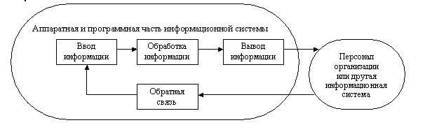
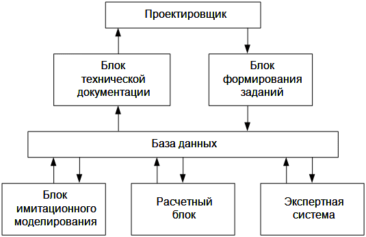
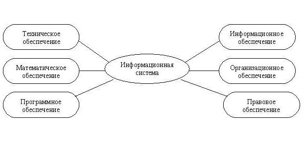

[содержание](/readme.md)

- [Основные модели построения информационной системы](#Основные-модели-построения-информационной-системы)
- [Структура информационной системы](#Структура-информационной-системы)

# Основные модели построения информационной системы

На современном уровне научно - технического развития разработаны специальные информационные технологии, позволяющие оптимизировать процессы товародвижения. Многие из них нашли применение в хозяйственной практике.

Одним из направлений логистической оптимизации деятельности предприятия является использование Интернет-технологий как для совершенствования организации внутренних информационных потоков, так и для вывода на новый уровень информационных взаимодействий с поставщиками, потребителями, посредниками, то есть для оптимизации входных и выходных информационных потоков.

Специалисты компании IBM преобразование основных бизнес-процессов при помощи Интернет-технологий обозначают понятием «электронный бизнес» («онлайн бизнес»). Отечественные специалисты в области Интернет-технологий определяют электронный бизнес как «..любую деловую активность, использующую возможности глобальных информационных сетей для преобразования внутренних и внешних связей с целью получения прибыли». С этих позиций офлайновый (традиционный) бизнес понимается как деловая активность с целью извлечения прибыли без применения Интернет-технологий.

Среда **Интернета** (Интернет-пространство) обладает рядом характеристик, которые могут рассматриваться как факторы, которые оказывают влияние на деятельность предприятия, внедряющего Интернет-технологии в практику логистического управления. К числу таких факторов можно отнести:

- количественные (численность, географическое положение и др.) и качественные (социальные, психологические и др.) характеристики аудитории Интернета;

- уровень развития инфраструктуры Интернет-среды (насыщенность информационными ресурсами, номенклатура предоставляемых услуг, численность и качественный состав коммерческих участников Интернет-рынка);

- условия и применяемые методы осуществления трансакций (в том числе качество применяемых платежных систем);

- уровень развития правовой базы функционирования бизнеса в Интернете.

Специалистами выделяется ряд моделей интеграции Интернет-технологий в информационную логистическую систему предприятия. Укрупненная группировка позволяет рассматривать модель типа «интранет» и модели типа «экстранет».

Модель типа **«интранет»** предполагает создание внутренней информационной системы. Доступ к информационным ресурсам такой системы предоставлен только сотрудникам данного предприятия и защищен от внешнего мира специальными средствами. Интранет-системы повышают оперативность обмена информацией между всеми сотрудниками, облегчают установление обратных связей, позволяют персоналу вести совместную работу независимо от местонахождения.

Подобные системы снижают некоторые логистические издержки предприятия, связанные с организацией внутренних информационных потоков, оптимизируют процессы управления (в том числе процессы планирования). Таким образом, применение модели «интранет» позволяет повысить эффективность функционирования логистической информационной системы и предприятия в целом.

Все модели типа *«экстранет»* предполагают возможность доступа в информационную систему предприятия субъектов внешней среды. Наиболее простой в этой группе является модель визитной карточки. Доступ к такой системе возможен не только для сотрудников предприятия, но и извне, со стороны тех, кому даны соответствующие права. Прозрачная для партнеров, но закрытая для посторонних, информационная система работает как визитная карточка или справочник предприятия: содержит информацию об ассортименте, ценах на товар, о скидках и льготах, базу данных клиента (состояние его счетов, информацию о размещенных заказах и др.).

У предприятия появляется возможность не только информировать потребителей о своей деятельности, но и осуществлять обратную связь с потребителем с помощью электронной почты, процедуры опознавания, процедуры подписки на web-сервере. Создание такой информационной системы позволяет сократить время на поиск партнеров; осуществлять деятельность вне привязки к локальному рынку или географической территории, увеличить эффективность управления логистической системой предприятия в целом.

Модель **электронного заказа** предполагает привлечение клиентов к работе непосредственно в информационной системе предприятия. Пользователем такой электронной системы может быть как корпоративный клиент (промежуточный потребитель, потребитель товаров производственного назначения), так и конечный потребитель. Соответственно, в рамках данной модели выделяют два более узких вида: модель «бизнес-бизнес» и модель «бизнес-потребитель». Такое разделение характерно для всех моделей экстранета, но в модели визитной карточки указанная дифференциация потребителей не оказывает существенного влияния на принципы работы информационной системы.

Реализация модели электронного заказа вида «бизнес-бизнес» может осуществляться путем создания любой из двух видов торговых площадок: информационной системы взаимодействия с корпоративными клиентами на уровне предприятия или независимой торговой электронной системы (электронная биржа или аукцион).

При использовании первой категории торговых площадок потребитель через информационную систему размещает заказ, фактически управляя складом готовой продукции предприятия-производителя: при недостаточности наличного запаса готовых изделий на складе товар автоматически запускается в производство. Информационная система данного вида выполняет следующие функции: поиск в прайс-листе необходимой позиции, составление бухгалтерской отчетности, анализ спроса и предложения, выбор и оптимизация путей доставки, выбор наилучшего варианта и реализация оплаты и страховки.

Вторая категория торговых площадок (электронные биржи и аукционы) помимо непосредственного исполнения функции размещения заказа оснащена инструментарием для организации торгов. Система данного вида позволяет автоматизировать процесс поиска необходимого партнера и согласования условий сделки; предусматривает возможность устраивать тендеры и аукционы, содержит удобный механизм сравнения цен.

Основной доход организатора подобной электронной площадки формируется за счет платы за вход в систему и сборов от совершаемых сделок, а также стоимости предоставляемых сопутствующих услуг (размещение рекламы, дополнительной информации о поставщиках, финансовое обслуживание).

Предприятие-потребитель имеет возможность быстро выбрать интересующий его товар по минимальной цене. При этом у потребителя снижаются логистические издержки, связанные с созданием материальных запасов (закупкой), а также издержки, связанные с управлением логистической системой. Предприятие-поставщик может снижать издержки, связанные с хранением запасов готовой продукции, и затраты по управлению логистической системой. Помимо этого, в результате применения Интернет-технологий и у поставщика, и у потребителя возникает финансовый эффект, обусловленный высвобождением средств, отвлекаемых из оборота при создании запасов; а у поставщика - еще и маркетинговый эффект от резкого роста контактной аудитории, потенциального роста объема продаж и, как следствие, - снижения себестоимости единицы товара.

Модель электронного заказа вида «бизнес-потребитель» (торговля в розницу) предполагает создание собственных Интернет-магазинов или потребительских аукционов. Такого рода электронные площадки могут создаваться предприятиями-производителями, но чаще - предприятиями, специализирующимися на оказании торгово-посреднических услуг.

Подобная Интернет-компания делает ставку на большой оборот и за счет этого имеет возможность получения достаточно больших скидок при закупке товара. В результате низких затрат на закупки, отсутствия затрат на аренду помещений, оборудования и заработную плату торгово-оперативного персонала у Интернет-компаний появляется дополнительное конкурентное преимущество - цены на товары в Интернете могут быть ниже, чем в традиционных магазинах. Еще одним преимуществом можно назвать то, что виртуальное пространство Интернет-магазина позволяет позиционировать огромное количество товаров, что затруднено для реального магазина.

Необходимо отметить, что в настоящее время наибольший эффект дает реализация такой модели предприятиями, имеющими «реальные» магазины. Успешные «реальные» магазины имеют устойчивые отношения с поставщиками узнаваемую торговую марку, знают потребности рынка, располагают организованной транспортной и складской сетью. Расходы, связанные с выходом на Интернет-рынок, при этом менее ощутимы, чем в случае с Интернет-проектами, развивающимися без поддержки офлайнового бизнеса.

Для эффективной реализации модели электронного заказа в области потребительского сектора (то есть при создании собственных Интернет-магазинов) требуется более высокий уровень развития среды Интернета по сравнению с реализацией этой же модели в области межкорпоративного сектора. Перспективным направлением развития данного вида информационных систем может стать создание региональных компаний, интегрирующих функции Интернет-магазина, провайдера высокоскоростного доступа и курьерской службы, а также создание всероссийской системы экспресс-доставки.

Предприятие, использующее модель полной автоматизации, работает с корпоративными клиентами, предоставляя им доступ к базам данных, содержащим информацию о товарных запасах и текущем состоянии выполнения контрактов, а также осуществляет розничные продажи в собственных электронных магазинах. Такая информационная система автоматизирует процесс заказов и собственных закупок.

После получения заказа от потребителя автоматически размещаются необходимые заказы собственным поставщикам. Используемая схема взаимодействий позволяет всем участникам модели значительно сократить свои логистические издержки. Экономия затрат возникает за счет полной автоматизации документооборота и учета (снижаются издержки по управлению логистической системой), сокращения длительности оборота и величины товарных запасов, снижения издержек хранения и некоторых других категорий логистических затрат. Конечно, и в этой модели работает «эффект масштаба»: при увеличении объемов продаж снижается себестоимость единицы товара.

Однако предприятие, использующее такую информационную систему, должно брать на себя все расходы по поддержанию инфраструктуры электронного пространства, в котором оно существует, по управлению торговой маркой, по организации межкорпоративных продаж, по продвижению товаров через Интернет-магазин. В настоящее время это требует значительных инвестиций, поэтому подобную модель пытаются реализовать крупные корпоративные структуры, успешные в традиционном бизнесе.

Модель аутсорсинга предполагает передачу части функций предприятия другим предприятиям, специализирующимся в этой области, при использовании Интернета. Предприятие может отдать на аутсорсинг: производство отдельных узлов изделия, маркетинг (например, исследование рынка, проведение рекламной кампании и т.д.), финансы и др.

Применение аутсорсинга ведет к уменьшению размера предприятия и к сокращению постоянных расходов, что также является дополнительным источником конкурентных преимуществ и повышает эффективность деятельности предприятия.

# Структура информационной системы

Элементы, обеспечивающие работу ИС любого назначения, перечисляются в определении. Одни из них – средства, методы и персонал – обеспечивают работу ИС, а другие – хранение, обработка и выдача информации – указывают функциональные признаки, т.е. определяют, из каких информационных процессов складывается функционирование ИС. Поэтому структуру ИС рассматривают в двух разных планах: функциональная структура и структура ИС как совокупность обеспечивающих подсистем.

В соответствии с определением функциональными элементами ИС являются следующие группы (блоки) процессов:
- ввод информации из внешних или внутренних источников;
- обработка входной информации и представление ее в удобном виде;
- вывод информации для представления потребителям или передачи в другую ИС;
- обратная связь – это информация, переработанная людьми данной организации для коррекции входной информации.

Функциональную структуру информационной системы представляют в виде блок-схемы (рис.1), на которой каждый элемент системы представляется в виде блока (на рис. – прямоугольник), а связи и их направления указывают стрелками.

Рис.1. Обобщенная функциональная блок-схема ИС.

Отдельные части (блоки системы) называют подсистемами.

В каждом конкретном случае набор и взаимосвязи функциональных подсистем зависят предметной области и специфики деятельности предприятия, деятельность которого обеспечивается информационной системой.

Структура ИС может быть представлена и как комплекс обеспечивающих подсистем (рис.2).

Рис.2. Блок-схема САПР

Однако для АИС, различающихся характером и видами обработки информации, функциональная схема отличается набором подсистем обработки. Например, АИПС (библиотечные, музейные, справочные правовые и т.п.) производят ввод, систематизацию, хранение, поиск и выдачу информации по запросу пользователя без сложных преобразований данных. Информационно-решающие системы: АСОД, АСУ, СППР – осуществляют переработку информации БД по определенному алгоритму, однако и они отличаются по составу подсистем обработки информации. Специализированная на автоматизации проектирования САПР имеет в структуре специальные подсистемы: технической документации, формирования заданий, имитационного моделирования, расчетный, а в некоторых может быть и экспертная система (см. блок-схему на рис. 2).

Рассмотрим другой тип структуры ИС: как комплекса обеспечивающих подсистем (рис.3).

Рис.3. Структура ИС по типу обеспечивающих подсистем.

Структуру информационной системы можно рассматривать как совокупность подсистем независимо от сферы применения. Подсистема – это часть системы, выделенная по какому-либо признаку. В этом случае говорят о структурном признаке классификации, а подсистемы называют обеспечивающими.

Таким образом, структура любой информационной системы может быть представлена совокупностью обеспечивающих подсистем.

Среди обеспечивающих подсистем обычно выделяют информационное, техническое, математическое, программное, организационное и правовое обеспечение.

Информационное обеспечение – совокупность информационных массивов данных, единой системы классификации и кодирования информации, унифицированных систем документации, схем информационных потоков, циркулирующих в организации, а также методология построения баз данных. Назначение подсистемы информационного обеспечения состоит в своевременном формировании и выдаче достоверной информации для принятия управленческих решений.

Унифицированные системы документации создаются на государственном, республиканском, отраслевом и региональном уровнях. Главная цель – это обеспечение сопоставимости показателей различных сфер общественного производства. Разработаны стандарты, где устанавливаются требования:
- к унифицированным системам документации;
- к унифицированным формам документов различных уровней управления;
- к составу и структуре реквизитов и показателей;
- к порядку внедрения, ведения и регистрации унифицированных форм документов.

Несмотря на существование унифицированной системы документации, при обследовании большинства организаций выявляется целый комплекс типичных недостатков:
- чрезвычайно большой объем документов для ручной обработки;
- одни и те же показатели часто дублируются в разных документах;
- работа с большим количеством документов отвлекает специалистов от решения непосредственных задач;
- имеются показатели, которые создаются, но не используются, и др.

Устранение указанных недостатков является одной из задач, стоящих при создании информационного обеспечения.

Схемы информационных потоков отражают маршруты движения информации, ее объемы, места возникновения первичной информации и использования результатной информации. За счет анализа структуры подобных схем можно выработать меры по совершенствованию всей системы управления.

Построение и детальный анализ схем информационных потоков, позволяющих выявить маршруты и объемы информации, дублирование показателей и процессов их обработки, обеспечивает:
- исключение дублирующей и неиспользуемой информации;
-классификацию и рациональное представление информации.

Методология построения баз данных базируется на теоретических основах их проектирования.

Основные концепции методологии:
- ясное понимание целей, задач, функций всей системы управления организацией;
- выявление движения информации от момента возникновения и до ее использования на различных уровнях управления, представленной для анализа в виде схем информационных потоков;
- совершенствование системы документооборота;
- наличие и использование системы классификации и кодирования;
- владение методологией создания концептуальных информационно–логических моделей, отражающих взаимосвязь информации;
- создание массивов информации на машинных носителях, что требует наличия современного технического обеспечения.

Эта концепция практически реализуется в два этапа.

1–й этап – обследование всех функциональных подразделений фирмы с целью:
- понять специфику и структуру ее деятельности;
- построить схему информационных потоков;
- проанализировать существующую систему документооборота;
- определить информационные объекты и соответствующий состав реквизитов (параметров, характеристик), описывающих их свойства и назначение.

2–й этап – построение концептуальной информационно–логической модели данных на основе результатов обследования 1–го этапа. В этой модели должны быть установлены и оптимизированы все связи между объектами и их реквизитами. Информационно-логическая модель является фундаментом, на котором будет создана база данных.

Техническое обеспечение – комплекс технических средств, предназначенных для работы информационной системы, а также соответствующая документация на эти средства и технологические процессы

Комплекс технических средств составляют:
- компьютеры любых моделей;
- устройства сбора, накопления, обработки, передачи и вывода информации;
- устройства передачи данных и линий связи;
- оргтехника и устройства автоматического съема информации;
- эксплуатационные материалы и др.

Документацией оформляются предварительный выбор технических средств, организация их эксплуатации, технологический процесс обработки данных, технологическое оснащение. Документацию можно условно разделить на три группы:
- общесистемную, включающую государственные и отраслевые стандарты по техническому обеспечению;
- специализированную, содержащую комплекс методик по всем этапам разработки технического обеспечения;
- нормативно–справочную, используемую при выполнении расчетов по техническому обеспечению.

К настоящему времени сложились две основные формы организации технического обеспечения (формы использования технических средств): централизованная и частично или полностью децентрализованная.

Централизованное техническое обеспечение базируется на использовании в информационной системе больших ЭВМ и вычислительных центров. Такая форма организации облегчает управление и внедрение стандартизации, но понижает ответственность и инициативу персонала.

Децентрализация технических средств предполагает реализацию функциональных подсистем на персональных компьютерах непосредственно на рабочих местах. В этом случае от персонала требуется больше персональной ответственности, руководству труднее внедрять стандартизацию.

В настоящее время более распространен частично децентрализованный подход – организация технического обеспечения на базе распределенных сетей, состоящих из персональных компьютеров и большой ЭВМ для хранения баз данных, общих для любых функциональных подсистем.

Математическое и программное обеспечение – совокупность математических методов, моделей, алгоритмов и программ для реализации целей и задач информационной системы, а также нормального функционирования комплекса технических средств.

К средствам математического обеспечения относятся:
- средства моделирования процессов управления;
- типовые задачи управления;
- методы математического программирования, математической статистики, теории массового обслуживания и др.

В состав программного обеспечения входят общесистемные и специальные программные продукты, а также техническая документация.

К общесистемному программному обеспечению относятся комплексы программ, ориентированных на пользователей и предназначенных для решения типовых задач обработки информации. Они служат для расширения функциональных возможностей компьютеров, контроля и управления процессом обработки данных.

Специальное программное обеспечение представляет собой совокупность программ, разработанных при создании конкретной информационной системы. В его состав входят пакеты прикладных программ (ППП), реализующие разработанные модели разной степени адекватности, отражающие функционирование реального объекта.

Техническая документация на разработку программных средств должна содержать описание задач, задание на алгоритмизацию, экономико–математическую модель задачи, контрольные примеры.

Организационное обеспечение – это совокупность методов и средств, регламентирующих взаимодействие работников с техническими средствами и между собой в процессе разработки и эксплуатации ИС.

Организационное обеспечение реализует следующие функции:
- анализ существующей системы управления организацией, где будет использоваться ИС, и выявление задач, подлежащих автоматизации;
- подготовку задач к решению на компьютере, включая техническое задание на проектирование ИС и технико–экономическое обоснование ее эффективности;
- разработку управленческих решений по составу и структуре организации, методологии решения задач, направленных на повышение эффективности системы управления.

Организационное обеспечение создается по результатам предпроектного обследования на 1–м этапе построения БД.

Правовое обеспечение – совокупность правовых норм, определяющих создание, юридический статус и функционирование информационных систем, регламентирующих порядок получения, преобразования и использования информации.

Главной целью правового обеспечения является укрепление законности. В состав правового обеспечения входят законы, указы, постановления государственных органов власти, приказы, инструкции и другие нормативные документы министерств, ведомств, организаций, местных органов власти. В правовом обеспечении можно выделить общую часть, регулирующую функционирование любой информационной системы, и локальную часть, регулирующую функционирование конкретной системы.

Правовое обеспечение этапов разработки информационной системы включает нормативные акты, связанные с договорными отношениями разработчика и заказчика и правовым регулированием отклонений от договора.

Правовое обеспечение этапов функционирования информационной системы включает:
- статус информационной системы;
- права, обязанности и ответственность персонала;
- порядок создания и использования информации и др.

Этот набор подсистем носит общий характер практически для всех типов АИС. Однако структура и сложность обеспечивающих подсистем зависит от типа АИС, области применения и других факторов. Так, подсистема математического обеспечения имеет место в АИС оригинальной разработки ПО – в АИС с типовым ПО, она отсутствует. Подсистема правового обеспечения может отсутствовать в АИС внутрифирменного назначения – в этом случае можно ограничиться подсистемой организационного обеспечения, в которой в том числе решаются вопросы правового обеспечения; АИС самостоятельного назначения, например, системы информационного обслуживания, могут иметь подсистему правового обеспечения. АИС, имеющие БД фактографического характера, имеют только подсистему информационного обеспечения, в которой может возникать необходимость решения отдельных лингвистических вопросов. Документальные АИПС имеют развитую подсистему лингвистического обеспечения, так как в этих системах решаются сложные задачи обеспечения смысловой релевантности запросов пользователей содержанию выданных документов. А это, как правило, не только программные модули морфологического анализа, но и совокупность словарей и правил их ведения.

Цели создания и внедрения ИС.

Чего можно ожидать от внедрения информационных систем?

Внедрение информационных систем может способствовать:

1. освобождению работников от рутинной работы и её ускорению за счет автоматизации;

2. замене бумажных носителей данных на магнитные диски или ленты, что приводит к снижению объемов документов на бумаге, а следовательно возможности более рациональной организации переработки информации на компьютере;

3. совершенствованию структуры потоков информации и системы документооборота в фирме за счёт эффекта системности: однократный ввод данных – многократное и многоцелевое их использование»;

4. получению более рациональных вариантов решения управленческих задач (за счет внедрения математических методов и интеллектуальных систем и т.д.):
    - отысканию новых рыночных ниш;
    - оптимизация затрат на производство продуктов и/или услуг;
    - оптимизация взаимоотношений с покупателями и поставщиками.

Этапы развития информационных систем

История развития ИС разбивается на этапы (таблица 2), соответствующие примерно принятой нумерации целей – изменяется подход к использованию ИС.

Таблица 2. Этапы развития ИС.

Период времени | Концепция использования информации | Вид информационных систем |Цель использования
---------------|---------------------------|-------------------|---------------
1950 – 1960 гг. | Бумажный поток расчетных документов | Информационные системы обработки расчетных документов на электромеханических бухгалтерских машинах | Повышение скорости обработки документов. Упрощение процедуры обработки счетов и расчета зарплаты
1960 – 1970 гг.| Основная помощь в подготовке отчетов | Управленческие информационные системы для производственной информации | Ускорение процесса подготовки отчетности
1970 – 1980 гг. | Управленческий контроль реализации (продаж) | Системы поддержки принятия решений. Системы для высшего звена управления. | Выборка наиболее рационального решения
1980 – 2000 гг. | Информация – стратегический ресурс, обеспечивающий конкурентное преимущество | Стратегические информационные системы. Автоматизированные офисы |Выживание и процветание фирмы

Первые информационные системы появились в середине прошлого века. В 50–е годы они были предназначены для обработки счетов и расчета зарплаты, а реализовывались на электромеханических бухгалтерских счетных машинах. Это приводило к некоторому сокращению затрат и времени на подготовку бумажных документов.

60–е гг. знаменуются изменением отношения к информационным системам. Информация, полученная из них, стала применяться для периодической отчетности по многим параметрам. Дня этого организациям требовалось компьютерное оборудование широкого назначения, способное обслуживать множество функций, а не только обрабатывать счета и считать зарплату, как было ранее.

В 70–х – начале 80–х гг. информационные системы начинают широко использоваться в качестве средства управленческого контроля, поддерживающего и ускоряющего процесс принятия решений.

К концу 80–х гг. концепция использования информационных систем вновь изменяется. Они становятся стратегическим источником информации и используются на всех уровнях организации любого профиля. Информационные системы этого периода, предоставляя вовремя нужную информацию, помогают организации достичь успеха в своей деятельности, создавать новые товары и услуги, находить новые рынки сбыта, обеспечивать себе достойных партнеров, организовывать выпуск продукции по низкой цене и многое другое.

Современное понимание информационной системы предполагает использование в качестве основного технического средства переработки информации персонального компьютера. В крупных организациях наряду с персональным компьютером в состав технической базы информационной системы может входить мэйнфрейм или суперЭВМ. Кроме того, техническое воплощение информационной системы само по себе ничего не будет значить, если не учтена роль человека, для которого предназначена производимая информация и без которого невозможно ее получение и представление.

## Свойства ис.

Взаимосвязь с потребителем и персоналом. ИС – человеко-машинная система обработки информации.

Удовлетворение информационных профессиональных или жизненно важных потребностей. Выводной продукцией системы является информация, на основе которой принимаются решения.

Сложность. Информационная система – сложная система, являющаяся подсистемой другой системы, обеспечивающая некоторую основную деятельность, либо являющаяся самостоятельной системой с собственным целевым назначением. ИС может быть подвергнута анализу, построена и управляема на основе общих принципов системного подхода.

Динамичность. Динамичность ИС проявляется в её развитии, т.е. изменении состояния. Типичная последовательность этапов (стадий) жизни ИС называется «жизненным циклом» ИС (ЖЦ), с момента возникновения необходимости в данной ИС и заканчивая моментом её полного выхода из употребления.

## Требования, предъявляемые к информационным системам

Информационная система должна соответствовать следующим требованиям:

- Гибкость — способность к адаптации и дальнейшему развитию ИС с новым условиям и новым потребностям предприятия. Это возможно, если на этапе разработки информационной системы использовать средства и методы документирования. Такой подход позже позволит разобраться в структуре системы и внести в нее соответствующие изменения.

- Надежность — функционирование без искажения информации и потери данных. Требование надежности обеспечивается: созданием резервных копий хранимой информации, поддержка качества каналов связи и физических носителей информации, использование современных программных и аппаратных средств.

- Эффективность — возможность решать возложенные на нее задачи с учетом выделенных ресурсов в минимальные сроки. Эффективность информационной системы обеспечивается: грамотным проектированием системы, оптимизацией данных и методов их обработки, применением оригинальных идей. Кроме того, так как работать с системой будут специалисты в предметной области, а не в области информационных технологий, то необходимо обеспечить интуитивно понятный интерфейс.

- Безопасность — свойство системы по защите от несанкционированного доступа. Требование безопасности обеспечивается современными средствами разработки информационных систем, современной аппаратурой, методами защиты информации, применением паролей и постоянным мониторингом состояния безопасности.

В последние несколько десятков лет компьютеры стали неотъемлемой частью управленческой системы предприятий. Причем чем крупнее предприятие, тем больше их использование в различных процессах.

Ранее практически единственной областью применения информационных систем на базе компьютеров автоматизация бухгалтерского учета. Сейчас наблюдается внедрение ИС во множество других областей. Рассмотрим наиболее важные задачи:

- бухгалтерский учет — классическая и наиболее часто реализуемая область применения информационных систем,

- управление финансовыми потоками – например, система расчетов с поставщиками и потребителями,

- управление складом, ассортиментом и закупками – позволяет автоматизировать процесс анализа движения товара и тем самым получения прибыли,

- управление производственным процессом – позволяет планировать производство, вести учет затрат, проводить техническую подготовку производства, оперативно управлять процессом выпуска продукции в соответствии с производственной программой и технологией,

- управление маркетингом – сбор и анализ данных о состоянии рынка в своем сегменте, а также определение оптимальной стратегии на рынке (определение цен на продукцию и проведение рекламных кампаний),

- документооборот – отражает деятельность предприятия и дает возможность лицам принимающим решения эффективно воздействовать на нее,

-оперативное управление предприятием – строится на основе базы данных, в которой хранится вся информация о предприятии,

-предоставление информации о предприятии – чаще всего для этой цели используются корпоративные web-сайты, которые решают ряд задач. Основные:
    - создание имиджа предприятия,
    - предоставление справочной информации,
    - ведение электронного бизнеса.

# Контрольные вопросы

- Что такое информационная система?
- Что из себя представляет функциональная структура ИС?
- Как развивались информационные системы?
- Какие цели и задачи стоят при создании информационной системы?
- Состав информационного, обеспечения.
- Состав технического обеспечения.
- Достоинства и недостатки централизованной /децентрализованной обработки информации.
- Состав программного обеспечения.
- Состав математического обеспечения.
- Состав организационного обеспечения.
- Состав правового обеспечения.
- От чего зависит состав функциональных/обеспечивающих подсистем ИС?

[Структура информационной системы]: https://studfiles.net/preview/5239413/page:2/

[Требования, предъявляемые к информационным системам]: https://studopedia.su/10_28224_oblasti-primeneniya-i-primeri-realizatsii-informatsionnih-sistem.html
