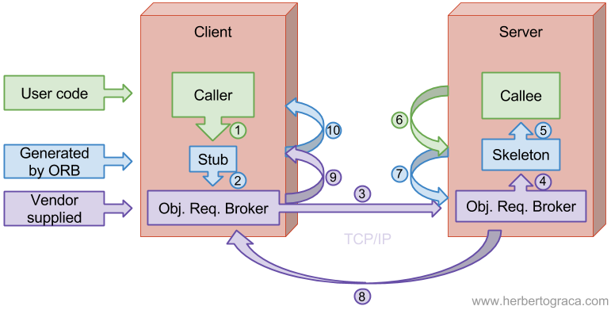
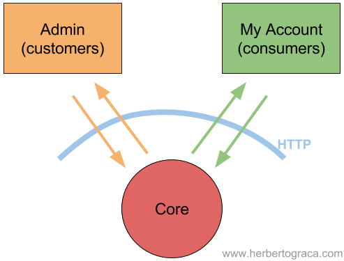
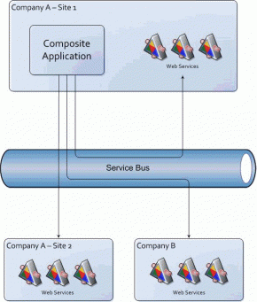
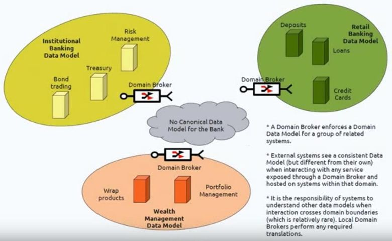
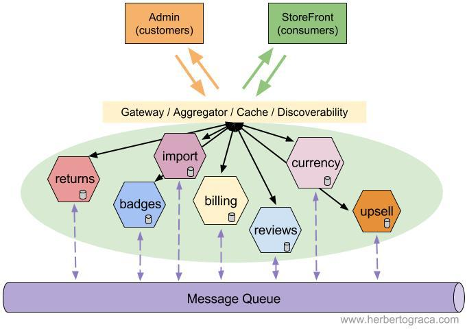
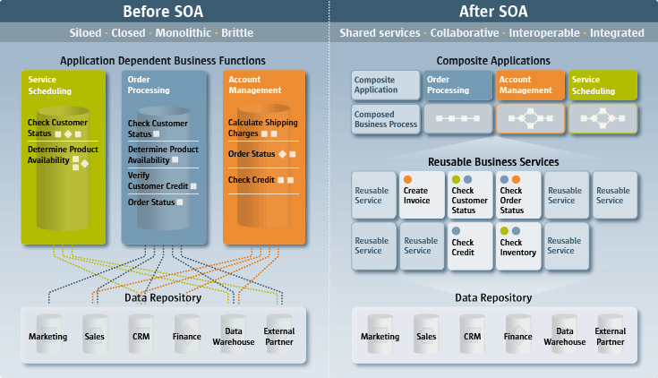

Сервисно-ориентированные архитектуры. Анализ интересов клиента. Выбор вариантов решений

# Сервис-ориентированная архитектура (SOA)

Сервис-ориентированная архитектура (service-oriented architecture, SOA) придумана в конце 1980-х. Она берёт своё начало в идеях, изложенных в CORBA, DCOM, DCE и других документах. О SOA написано много, есть несколько её реализаций. Но, по сути, SOA можно свести к нескольким идеям, причём архитектура не диктует способы их реализации:
- Сочетаемость приложений, ориентированных на пользователей.
- Многократное использование бизнес-сервисов.
- Независимость от набора технологий.
- Автономность (независимые эволюция, масштабируемость и развёртываемость).

SOA — это набор архитектурных принципов, не зависящих от технологий и продуктов, совсем как полиморфизм или инкапсуляция.

В этой лекции рассмотрены следующие паттерны, относящиеся к SOA:
- Общая архитектура брокера объектных запросов (CORBA).
- Веб-сервисы.
- Очередь сообщений.
- Сервисная шина предприятия (ESB).
- Микросервисы.

## Общая архитектура брокера объектных запросов (CORBA)

В 1980-х началось активное использование корпоративных сетей и клиент-серверной архитектуры. Возникла потребность в стандартном способе взаимодействия приложений, которые созданы с использованием разных технологий, исполняются на разных компьютерах и под разными ОС. Для этого была разработана CORBA. Это один из стандартов распределённых вычислений, зародившийся в 1980-х и расцветший к 1991 году.

Стандарт CORBA был реализован несколькими вендорами. Он обеспечивает:

- Не зависящие от платформы вызовы удалённых процедур (Remote Procedure Call).
- Транзакции (в том числе удалённые!).
- Безопасность.
- События.
- Независимость от выбора языка программирования.
- Независимость от выбора ОС.
- Независимость от выбора оборудования.
- Независимость от особенностей передачи данных/связи.
- Набор данных через язык описания интерфейсов (Interface Definition Language, IDL).

Сегодня CORBA всё ещё используется для разнородных вычислений. Например, он до сих пор является частью Java EE, хотя начиная с Java 9 будет поставляться в виде отдельного модуля.

Хочу отметить, что не считаю CORBA паттерном SOA (хотя отношу и CORBA, и SOA-паттерны к сфере распределённых вычислений). Я рассказываю о нём здесь, поскольку считаю недостатки CORBA одной из причин возникновения SOA.

**Принцип работы**

Сначала нам нужно получить брокер объектных запросов (Object Request Broker, ORB), который соответствует спецификации CORBA. Он предоставляется вендором и использует языковые преобразователи (language mappers) для генерирования «заглушек» (stub) и «скелетов» (skeleton) на языках клиентского кода. С помощью этого ORB и определений интерфейсов, использующих IDL (аналог WSDL), можно на основе реальных классов генерировать в клиенте удалённо вызываемые классы-заглушки (stub classes). А на сервере можно генерировать классы-скелеты (skeleton classes), обрабатывающие входящие запросы и вызывающие реальные целевые объекты.

Вызывающая программа (caller) вызывает локальную процедуру, реализованную заглушкой.
- Заглушка проверяет вызов, создаёт сообщение-запрос и передаёт его в ORB.
- Клиентский ORB шлёт сообщение по сети на сервер и блокирует текущий поток выполнения.
- Серверный ORB получает сообщение-запрос и создаёт экземпляр скелета.
- Скелет исполняет процедуру в вызываемом объекте.
- Вызываемый объект проводит вычисления и возвращает результат.
- Скелет пакует выходные аргументы в сообщение-ответ и передаёт его в ORB.
- ORB шлёт сообщение по сети клиенту.
- Клиентский ORB получает сообщение, распаковывает и передаёт информацию заглушке.
- Заглушка передаёт выходные аргументы вызывающему методу, разблокирует поток выполнения, и вызывающая программа продолжает свою работу.

**Достоинства**

- Независимость от выбранных технологий (не считая реализации ORB).
- Независимость от особенностей передачи данных/связи.

**Недостатки**

- Независимость от местоположения: клиентский код не имеет понятия, является ли вызов локальным или удалённым. Звучит неплохо, но длительность задержки и виды сбоев могут сильно варьироваться. Если мы не знаем, какой у нас вызов, то приложение не может выбрать подходящую стратегию обработки вызовов методов, а значит, и генерировать удалённые вызовы внутри цикла. В результате вся система работает медленнее.
- Сложная, раздутая и неоднозначная спецификация: её собрали из нескольких версий спецификаций разных вендоров, поэтому (на тот момент) она была раздутой, неоднозначной и трудной в реализации.
- Заблокированные каналы связи (communication pipes): используются специфические протоколы поверх TCP/IP, а также специфические порты (или даже случайные порты). Но правила корпоративной безопасности и файрволы зачастую допускают HTTP-соединения только через 80-й порт, блокируя обмены данными CORBA.

## Веб-сервисы

Хотя сегодня можно найти применение для CORBA, но мы знаем, что нужно было уменьшить количество удалённых обращений, чтобы повысить производительность системы. Также требовался надёжный канал связи и более простая спецификация обмена сообщениями.

И для решения этих задач в конце 1990-х начали появляться веб-сервисы.

Нужен был надёжный канал связи, поэтому:
- HTTP стал по умолчанию работать через порт 80.
- Для обмена сообщениями начали использовать платформо-независимый язык (вроде XML или JSON).

Нужно было уменьшить количество удалённых обращений, поэтому:
- Удалённые соединения стали явными, так что теперь мы всегда знаем, когда выполняется удалённый вызов.
- Вместо многочисленных удалённых вызовов объектов мы обращаемся к удалённым сервисам, но гораздо реже.

Нужно было упростить спецификацию обмена сообщениями, поэтому:
- Первый черновик SOAP появился в 1998-м, стал рекомендацией W3C в 2003-м, после чего превратился в стандарт. SOAP вобрал в себя некоторые идеи CORBA, вроде слоя для обработки обмена сообщениями и «документа», определяющего интерфейс с помощью языка описания веб-сервисов (Web Services Description Language, WSDL).
- Рой Филдинг в 2000-м описал REST в своей диссертации «Architectural Styles and the Design of Network-based Software Architectures». Его спецификация оказалась гораздо проще SOAP, поэтому вскоре REST обогнал SOAP по популярности.
- Facebook разработал GraphQL в 2012-м, а публичный релиз выпустил в 2015-м. Это язык запросов для API, позволяющий клиенту строго определять, какие данные сервер должен ему отправить, не больше и не меньше.

>[Веб-]сервисы можно публиковать, находить и использовать стандартным образом вне зависимости от технологий.
— Microsoft 2004, Understanding Service-Oriented Architecture

Благодаря микросервисам мы перешли в парадигме SOA от удалённого вызова методов объекта (CORBA) к передаче сообщений между сервисами.

Но нужно понимать, что в рамках SOA веб-сервисы — не просто API общего назначения, всего лишь предоставляющие CRUD-доступ к базе данных через HTTP. В каких-то случаях эта реализация может быть полезной, но ради целостности ваших данных необходимо, чтобы пользователи понимали лежащую в основе реализации модель и соблюдали бизнес-правила. SOA подразумевает, что веб-сервисы являются ограниченными контекстами бизнес-субдоменов (business sub-domain) и отделяет реализацию от решаемых веб-сервисами задач.

> С точки зрения технологий SOA не просто сервисная архитектура, а набор политик, методик и фреймворков, благодаря которым мы предоставляем и получаем нужные сервисы.
— Microsoft 2004, Understanding Service-Oriented Architecture

**Достоинства**

- Независимость набора технологий, развёртывания и масштабируемости сервисов.
- Стандартный, простой и надёжный канал связи (передача текста по HTTP через порт 80).
- Оптимизированный обмен сообщениями.
- Стабильная спецификация обмена сообщениями.
- Изолированность контекстов доменов (Domain contexts).

**Недостатки**

- Разные веб-сервисы тяжело интегрировать из-за различий в языках передачи сообщений. Например, два веб-сервиса, использующих разные JSON-представления одной и той же концепции.
- Синхронный обмен сообщениями может перегрузить системы.

## Очередь сообщений

У нас есть несколько приложений, которые асинхронно общаются друг с другом с помощью платформо-независимых сообщений. Очередь сообщений улучшает масштабируемость и усиливает изолированность приложений. Им не нужно знать, где находятся другие приложения, сколько их и даже что они собой представляют. Однако все эти приложения должны использовать один язык обмена сообщениями, т. е. заранее определённый текстовый формат представления данных.

Очередь сообщений использует в качестве компонента инфраструктуры программный брокер сообщений (RabbitMQ, Beanstalkd, Kafka и т. д.). Для реализации связи между приложениями можно по-разному настроить очередь:

Запрос/Ответ
- Клиент шлёт в очередь сообщение, включая ссылку на «разговор» («conversation» reference). Сообщение приходит на специальный узел, который отвечает отправителю другим сообщением, где содержится ссылка на тот же разговор, так что получатель знает, на какой разговор ссылается сообщение, и может продолжать действовать. Это очень полезно для бизнес-процессов средней и большой продолжительности (цепочек событий, sagas).

Публикация/Подписка
- **По спискам.** Очередь поддерживает списки опубликованных тем подписок (topics) и их подписчиков. Когда очередь получает сообщение для какой-то темы, то помещает его в соответствующий список. Сообщение сопоставляется с темой по типу сообщения или по заранее определённому набору критериев, включая и содержимое сообщения.
- **На основе вещания.** Когда очередь получает сообщение, она транслирует его всем узлам, прослушивающим очередь. Узлы должны сами фильтровать данные и обрабатывать только интересующие сообщения.

Все эти паттерны можно отнести к либо к pull- (polling), либо к push-подходу:
- В pull-сценарии клиент опрашивает очередь с определённой частотой. Клиент управляет своей нагрузкой, но при этом может возникнуть задержка: сообщение уже лежит в очереди, а клиент его ещё не обрабатывает, потому что не пришло время следующего опроса очереди.
- В push-сценарии очередь сразу же отдаёт клиентам сообщения по мере поступления. Задержки нет, но клиенты не управляют своей нагрузкой.

**Достоинства**

- Независимость набора технологий, развёртывания и масштабируемости сервисов.
- Стандартный, простой и надёжный канал связи (передача текста по HTTP через порт 80).
- Оптимизированный обмен сообщениями.
- Стабильная спецификация обмена сообщениями.
- Изолированность контекстов домена (Domain contexts).
- Простота подключения и отключения сервисов.
- Асинхронность обмена сообщениями помогает управлять нагрузкой на систему.

**Недостатки**

- Разные веб-сервисы тяжело интегрировать из-за различий в языках передачи сообщений. Например, два веб-сервиса, использующих разные JSON-представления одной и той же концепции.

## Сервисная шина предприятия (ESB)

Сервисная шина предприятия использовала веб-сервисы уже в 1990-х, когда они только развивались (быть может, некоторые реализации сначала использовали CORBA?).

ESB возникла во времена, когда в компаниях были отдельные приложения. Например, одно для работы с финансами, другое для учёта персонала, третье для управления складом, и т. д., и их нужно было как-то связывать друг с другом, как-то интегрировать. Но все эти приложения создавались без учёта интеграции, не было стандартного языка для взаимодействия приложений (как и сегодня). Поэтому разработчики приложений предусматривали конечные точки для отправки и приёма данных в определённом формате. Компании-клиенты потом интегрировали приложения, налаживая между ними каналы связи и преобразуя сообщения с одного языка приложения в другой.

Очередь сообщений может упростить взаимодействие приложений, но она не способна решить проблему разных форматов языков. Впрочем, была сделана попытка превратить очередь сообщений из простого канала связи в посредника, доставляющего сообщения и преобразующего их в нужные форматы/языки. ESB стал следующей ступенью в естественной эволюции простой очереди сообщений.

В этой архитектуре используется модульное приложение (composite application), обычно ориентированное на пользователей, которое общается с веб-сервисами для выполнения каких-то операций. В свою очередь, эти веб-сервисы тоже могут общаться с другими веб-сервисами, впоследствии возвращая приложению какие-то данные. Но ни приложение, ни бэкенд-сервисы ничего друг о друге не знают, включая расположение и протоколы связи. Они знают лишь, с каким сервисом хотят связаться и где находится сервисная шина.

Клиент (сервис или модульное приложение) отправляет запрос на сервисную шину, которая преобразует сообщение в формат, поддерживаемый в точке назначения, и перенаправляет туда запрос. Всё взаимодействие идёт через сервисную шину, так что если она падает, то с ней падают и все остальные системы. То есть ESB — ключевой посредник, очень сложный компонент системы.

Это очень упрощённое описание архитектуры ESB. Более того, хотя ESB является главным компонентом архитектуры, в системе могут использоваться и другие компоненты вроде доменных брокеров (Domain Broker), сервисов данных (Data Service), сервисов процессной оркестровки (Process Orchestration Service) и обработчиков правил (Rules Engine). Тот же паттерн может использовать интегрированная архитектура (federated design): система разделена на бизнес-домены со своими ESB, и все ESB соединены друг с другом. У такой схемы выше производительность и нет единой точки отказа: если какая-то ESB упадёт, то пострадает лишь её бизнес-домен.

Главные обязанности ESB:
- Отслеживать и маршрутизировать обмен сообщениями между сервисами.
- Преобразовывать сообщения между общающимися сервисными компонентами.
- Управлять развёртыванием и версионированием сервисов.
- Управлять использованием избыточных сервисов.
- Предоставлять стандартные сервисы обработки событий, преобразования и сопоставления данных, сервисы очередей сообщений и событий, сервисы обеспечения безопасности или обработки исключений, сервисы преобразования протоколов и обеспечения необходимого качества связи.

> Создавая структуры связи между разными процессами, мы видели много продуктов и подходов, в которых применяются очень развитые механизмы связи. Хороший пример — сервисные шины предприятий, часто включающие в себя сложные средства маршрутизации сообщений, хореографии, преобразования и применения бизнес-правил.
— Martin Fowler 2014, Microservices

У этого архитектурного паттерна есть положительные стороны. Однако я считаю его особенно полезным в случаях, когда мы не «владеем» веб-сервисами и нам нужен посредник для трансляции сообщений между сервисами, для оркестрирования бизнес-процессами, использующими несколько веб-сервисов, и прочих задач.

Также рекомендую не забывать, что реализации ESB уже достаточно развиты и в большинстве случаев позволяют использовать для своего конфигурирования пользовательский интерфейс с поддержкой drag & drop.

**Достоинства**

- Независимость набора технологий, развёртывания и масштабируемости сервисов.
- Стандартный, простой и надёжный канал связи (передача текста по HTTP через порт 80).
- Оптимизированный обмен сообщениями.
- Стабильная спецификация обмена сообщениями.
- Изолированность контекстов домена (Domain contexts).
- Простота подключения и отключения сервисов.
- Асинхронность обмена сообщениями помогает управлять нагрузкой на систему.
- Единая точка для управления версионированием и преобразованием.

**Недостатки**

- Ниже скорость связи, особенно между уже совместимыми сервисами.
- Централизованная логика:
    - Единая точка отказа, способная обрушить системы связи всей компании.
    - Большая сложность конфигурирования и поддержки.
    - Со временем можно прийти к хранению в ESB бизнес-правил.
    - Шина так сложна, что для её управления вам потребуется целая команда.
    - Высокая зависимость сервисов от ESB.

## Микросервисы

В основе микросервисной архитектуры лежат концепции SOA. Назначение у неё то же, что и у ESB: создать единое общее корпоративное приложение из нескольких специализированных приложений бизнес-доменов.

Главное различие микросервисов и шины в том, что ESB была создана в контексте интеграции отдельных приложений, чтобы получилось единое корпоративное распределённое приложение. А микросервисная архитектура создавалась в контексте быстро и постоянно меняющихся бизнесов, которые (в основном) с нуля создают собственные облачные приложения.

То есть в случае с ESB у нас уже были приложения, которые нам не «принадлежат», и поэтому мы не могли их изменить. А в случае с микросервисами мы полностью контролируем приложения (при этом в системе могут использоваться и сторонние веб-сервисы).

Характер построения/проектирования микросервисов не требует глубокой интеграции. Микросервисы должны соответствовать бизнес-концепции, ограниченному контексту. Они должны сохранять своё состояние, быть независимыми от других микросервисов, и потому они меньше нуждаются в интеграции. То есть низкая взаимозависимость и высокая связность привели к замечательному побочному эффекту — уменьшению потребности в интеграции.

> [Микросервисы — это] маленькие автономные сервисы, работающие вместе и спроектированные вокруг бизнес-домена.
— Sam Newman 2015, Principles Of Microservices

Главным недостатком архитектуры ESB было очень сложное централизованное приложение, от которого зависели все остальные приложения. А в микросервисной архитектуре это приложение почти целиком убрано.

Ещё остались элементы, пронизывающие всю экосистему микросервисов. Но у них гораздо меньше задач по сравнению с ESB. К примеру, для асинхронной связи между микросервисами до сих пор применяется очередь сообщений, но это лишь канал для передачи сообщений, не более того. Или можно вспомнить шлюз экосистемы микросервисов, через который проходит весь внешний обмен данными.

Сэм Ньюман, автор Building Microservices, выделяет восемь принципов микросервисной архитектуры. Это:

- **Проектирование сервисов вокруг бизнес-доменов**
Это может дать нам стабильные интерфейсы, высокосвязные и мало зависящие друг от друга модули кода, а также чётко определённые разграниченные контексты.
- **Культура автоматизации**
Это даст нам гораздо больше свободы, мы сможем развернуть больше модулей.
- **Скрытие подробностей реализации**
Это позволяет сервисам развиваться независимо друг от друга.
- **Полная децентрализация**
Децентрализуйте принятие решений и архитектурные концепции, предоставьте командам автономность, чтобы компания сама превратилась в сложную адаптивную систему, способную быстро приспосабливаться к переменам.
- **Независимое развёртывание**
Можно развёртывать новую версию сервиса, не меняя ничего другого.
- **Сначала потребитель**
Сервис должен быть простым в использовании, в том числе другими сервисами.
- **Изолирование сбоев**
Если один сервис падает, другие продолжают работать, это делает всю систему устойчивой к сбоям.
- **Удобство мониторинга**
В системе много компонентов, поэтому трудно уследить за всем, что в ней происходит. Нам нужны сложные инструменты мониторинга, позволяющие заглянуть в каждый уголок системы и отследить любую цепочку событий.

> Сообщество предпочитает другой подход: умные конечные точки и глупые каналы. Микросервисы, из которых собираются приложения, должны как можно меньше зависеть друг от друга и при этом быть очень тесно связанными — они содержат собственную доменную логику и работают скорее как фильтры с точки зрения классического Unix: получают запросы, применяют логику и генерируют ответы. Они оркестрируются с помощью простых REST-подобных протоколов, а не сложных протоколов вроде WS-Choreography или BPEL либо какого-то централизованного инструмента.
— Martin Fowler 2014, Microservices

**Достоинства**

- Независимость набора технологий, развёртывания и масштабируемости сервисов.
- Стандартный, простой и надёжный канал связи (передача текста по HTTP через порт 80).
- Оптимизированный обмен сообщениями.
- Стабильная спецификация обмена сообщениями.
- Изолированность контекстов домена (Domain contexts).
- Простота подключения и отключения сервисов.
- Асинхронность обмена сообщениями помогает управлять нагрузкой на систему.
- Синхронность обмена сообщениями помогает управлять производительностью системы.
- Полностью независимые и автономные сервисы.
- Бизнес-логика хранится только в сервисах.
- Позволяют компании превратиться в сложную адаптивную систему, состоящую из нескольких маленьких автономных частей/команд, способную быстро адаптироваться к переменам.

**Недостатки**

- Высокая сложность эксплуатации:
    - Нужно много вложить в сильную DevOps-культуру.
    - Использование многочисленных технологий и библиотек может выйти из-под контроля.
    - Нужно аккуратно управлять изменениями входных/выходных API, потому что эти интерфейсы будут использовать многие приложения.
    - Использование «согласованности в конечном счёте» (eventual consistency) может привести к серьёзным последствиям, которые нужно учитывать при разработке приложения, от бэкенда до UX.
    - Тестирование усложняется, потому что изменения в интерфейсе могут непредсказуемо влиять на другие сервисы.

## Заключение

В последние десятилетия SOA сильно эволюционировала. Благодаря неэффективности прежних решений и развитию технологий сегодня мы пришли к микросервисной архитектуре.

Эволюция шла по классическому пути: сложные проблемы разбивались на более мелкие, простые в решении.

Проблему сложности кода можно решать так же, как мы разбиваем монолитное приложение на отдельные доменные компоненты (разграниченные контексты). Но с разрастанием команд и кодовой базы увеличивается потребность в независимом развитии, масштабировании и развёртывании. SOA помогает добиться такой независимости, упрочняя границы контекстов.

Повторюсь, что всё дело в слабой взаимозависимости и высокой связности, причём размер компонентов должен быть больше прежнего. Необходимо прагматично оценить свои потребности: используйте SOA, лишь когда это необходимо, поскольку она сильно увеличивает сложность. И если на самом деле вы можете обойтись без SOA, то лучше выберите микросервисы подходящего размера и количества, не больше и не меньше.

[Сервис-ориентированная архитектура (SOA)]: https://habr.com/ru/company/mailru/blog/342526/
