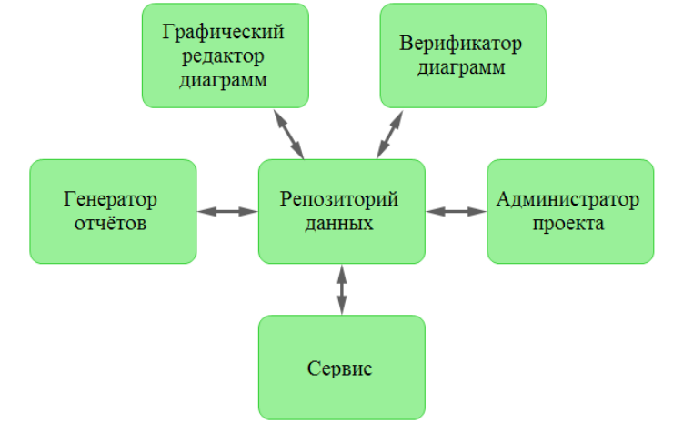

[содержание](/readme.md)

# Автоматизированное проектирование информационных систем на основе CASE- технологии

## Назначение CASE-средств

Учитывая постоянный рост требований, сильно увеличивается сложность современных информационных систем. Можно выделить следующие особенности крупных существующих информационных систем:

* сложность описания;
* наличие совокупности тесно взаимодействующих компонентов;
* отсутствие прямых аналогов, ограничивающее возможность использования каких-либо типовых проектных решений и прикладных систем;
* необходимость интеграции существующих и вновь разрабатываемых приложений;
* функционирование в неоднородной среде на нескольких аппаратных платформах;
* разобщенность и разнородность отдельных групп разработчиков по уровню квалификации и сложившимся традициям использования тех или иных инструментальных средств;
* существенная временная протяженность проекта разработки.

Создание всей требуемой проектной документации вручную является крайне сложной задачей, а редактирование созданного пакета документов влечёт за собой ещё большие трудности. В связи с этим, можновыявить следующие проблемы, возникающие при ручном процессе проектирования:

* неадекватная спецификация требований;
* неспособность обнаруживать ошибки в проектных решениях;
* низкое качество документации, снижающее эксплуатационные качества;
* затяжной цикл и неудовлетворительные результаты тестирования.

Существенное подспорье в решении подобных проблем вносят CASE-средства (Computer Aided Software
Engineering). Под CASE-средством понимается специальное программное обеспечение, поддерживающее
процессы создания и сопровождения информационных систем: анализ и формулировка требований, проектирование прикладного программного обеспечения и баз данных, генерация кода, тестирование, документирование, обеспечение качества, конфигурационное управление и управление проектом, а также другие процессы.

Полная среда разработки информационной системы представляет из себя совокупность используемых
CASE-средств, системного программного обеспечения и технических средств.

Следует заметить, что CASE-средства далеко не всегда сразу же дают ожидаемый эффект, кроме того,
реальный бюджет, требуемый на внедрение, в большинстве случаев существенно превышает их рыноч-
ную стоимость.

Чтобы увеличить шансы на успешное внедрение CASE-средства, необходимо руководствоваться
тремя аспектами:

* технология (ограниченность существующих возможностей);
* культура (готовность к внедрению новых процессов);
* управление (четкое руководство важными этапами и процессами внедрения).

Недостаток внимания к какому-либо аспекту может негативным образов сказаться на успешности
процесса внедрения, даже, несмотря на скрупулёзное следование существующим рекомендациям.

## Состав и классификация CASE-средств

CASE-средства обладают мощными графическими средствами описания и документирования информационных систем, обеспечивают управляемость процесса разработки, за счёт интеграции некоторых компонент, а также позволяют централизованно хранить данные при помощи репозиториев.

Конкретная CASE-технология включает в себя методологию проектирования информационных систем
и инструментальные средства анализа и моделирования.

Архитектуру CASE-средства можно представить в виде совокупности шести компонентов:

1. Репозиторий данных.
2. Графический редактор диаграмм.
3. Верификатор диаграмм.
4. Генератор отчётов.
5. Администратор проекта.
6. Сервис.

Репозиторий представляет собой базу данных, предназначенную для обмена информацией между компонентами CASE-средства, а также для хранения
сведений обо всех объектах проектируемой системы.

Графический редактор диаграмм предназначен для отображения проектируемой информационной системы в заданной графической нотации. Позволяет
выполнять следующие действия:

* создавать элементы диаграмм и взаимосвязи между ними;
* задавать описания элементов диаграмм;
* задавать описания связей между элементами диаграмм;
* редактировать элементы диаграмм, их взаимосвязи и описания.

Верификатор диаграмм выявляет несоответствия разрабатываемой диаграммы
методологии проектирование. Среди его функций можно выделить:

* мониторинг правильности построения диаграмм;
* диагностику и выдачу сообщений об ошибках;
* выделение на диаграмме ошибочных элементов.

Генератор отчётов позволяет получать информацию о состоянии проекта в виде, формируемых по различным признакам, отчётов.

Администратор проекта представляет собой набор инструментальных средств, необходимых для выполнения административных функций. К таким функциям относятся:

* инициализация проекта;
* задания начальных параметров проекта;
* назначения и изменения прав доступа к элементам проекта;
* мониторинга выполнения работ.

Компонент сервиса представляет собой набор системных утилит для обслуживания репозитория данных. Используется для архивации данных, восстановления данных и создания нового репозитория.

В зависимости от области применения различные CASE-средства могут содержать следующие компоненты:

* репозиторий;
* графические средства анализа и проектирования;
* средства разработки приложений;
* средства конфигурационного управления;
* средства документирования;
* средства тестирования;
* средства управления проектом;
* средства реинжиниринга.

Типовая классификация CASE-средств по большей части соотносится с их компонентным составом.

Можно разделить CASE-средства на следующие типы:

* средства моделирования предметной области (построения и анализа моделей предметной области);
* средства анализа и проектирования (создание спецификации компонентов, интерфейсов системы, архитектуры системы, алгоритмов и структур данных);
* средства проектирования баз данных (построение моделей данных);
* средства разработки приложений;
* средства реинжиниринга (анализ программных кодов и схем баз данных и формирование на их основе различных моделей и проектных спецификаций);
* средства планирования и управления;
* средства конфигурационного управления;
* средства тестирования;
* средства документирования.

В исторической ретроспективе можно выделить CASE-системы двух поколений:

1. Первое поколение. Обеспечивает:
    * поддержку графических моделей;
    * проектирование спецификаций;
    * проектирование экранных редакторов;
    * проектирование словарей данных.

2. Второе поколение. Обеспечивает:
    * поддержку графических представлений требований к системе;
    * поддержку представлений спецификаций проектирования;
    * поддержку контроля и анализа системной информации,
    * информационную поддержку управления проектированием,
    * построение прототипов и моделей системы;
    * автоматическую кодогенерацию;
    * поддержку тестирования, верификации и анализа сгенерированных программ;
    * генерацию документов по проекту;
    * контроль на соответствие стандартам по всем этапам ЖЦ;

Большая часть подобных технологий основывается на методологиях структурного и объектно-ориентированного анализа. Представление полученных данных производится при помощи текстов и диаграмм.

### Технология внедрения CASE-средств

Процесс внедрения CASE-средств состоит из следующих этапов:

1. Определение потребностей в CASE-средствах.
2. Оценка и выбор CASE-средств.
3. Выполнение пилотного проекта.
4. Практическое внедрение CASE-средств.

На первом этапе необходимо выявить области деятельности компании, в которых обоснованно применение CASE-средств. По завершению данного этапа формируется документ описывающий стратегию внедрения.

Для успешного завершения этапа определения потребностей необходимо:
* проанализировать возможности организации в отношении её технической базы,
персонала и используемого программного обеспечения;
* определить организационные потребности на основании проблем и целей;
* проанализировать рынок CASE-средств на предмет соответствия желаемым требованиям;
* определить критерии успешного внедрения CASE-средства и их оптимальные значения;
* разработать стратегию внедрения.

Стратегия внедрения включает следующие составляющие:
* организационные потребности;
* базовые метрики, необходимые для последующего сравнения результатов;
* критерии успешного внедрения;
* подразделения организации, в которых должно выполняться внедрение CASE-средств;
* влияние, оказываемое на другие подразделения организации;
* стратегии и планы оценки и выбора, пилотного проектирования и перехода
к полномасштабному внедрению;
* основные факторы риска;
* ориентировочный уровень расходов и источники финансирования процесса внедрения CASE-средств;
* ключевой персонал и другие ресурсы.

Вторым этапом является процесс оценки функциональности и качества CASE-средств, для последующего выбора подходящих. Оценка выполняется в соответствии с конкретными критериями, ее результаты включают как объективные, так и субъективные данные по каждому средству.

Процесс оценки включает следующие действия:
* формулировка задачи оценки, включая информацию о цели и масштабах оценки;
* определение критериев оценки, вытекающее из определения задачи;
* определение средств-кандидатов путем просмотра списка кандидатов и анализа информации о конкретных средствах;
* оценка средств-кандидатов в контексте выбранных критериев;
* подготовка отчета по результатам оценки.

Процесс выбора тесно взаимосвязан с процессом оценки и включает следующие действия:
* формулировка задач выбора, включая цели, предположения и ограничения;
* определение и ранжирование критериев
* определение средств-кандидатов и сбор необходимых данных;
* выполнение необходимого количества итераций с тем, чтобы выбрать (или отвергнуть) средства, имеющие сходные показатели;
* подготовка отчета по результатам выбора.

Каждый критерий, используемый в процессах оценки и выбора, должен быть выбран и адаптирован экспертом с учетом особенностей конкретного процесса. Выбор и уточнение набора используемых критериев является критическим шагом данного процесса.

Можно выделить следующие группы критериев:
1. **Функциональность**: обеспечение требуемых функций, наличие дополнительных нерегламентированных функций, возможность расширения набора функций.
2. **Надежность**: обеспечение целостности данных и их резервирование, защита от несанкционированного доступа, обнаружение ошибок, анализ отказов.
3. **Простота использования**: удобство пользовательского интерфейса, локализация, простота освоения, качество документации, доступность и качество учебных материалов, требования к уровню знаний; унифицированность пользовательского интерфейса, онлайновые подсказки, понятность и полезность диагностических сообщений, допустимое время реакции на действия пользователя, простота установки и обновления версий.
4. **Эффективность**: требования к техническим средствам, эффективность выполнения CASE-средством своих функций в зависимости от интенсивности
работы пользователя, производительность.
5. **Сопровождаемость**: уровень поддержки со стороны поставщика, простота освоения отличий новых версий от существующих, совместимость
обновлений, сопровождаемость конечного продукта.
6. **Переносимость**: совместимость с различными версиями операционных систем, переносимость данных между различными версиями CASE-средства, соответствие стандартам переносимости.
7. **Общие критерии**: затраты на CASE-средство, оценочный эффект от внедрения CASE-средства, общие показатели возможностей дистрибьютора, лицензионная политика, экспортные ограничения; общая информация о продукте, поддержка поставщика и качество предоставляемых услуг.

Перед полномасштабным внедрением выбранного CASE-средства в организации выполняется пилотный проект, целью которого является экспериментальная проверка правильности решений, принятых на предыдущих этапах, и подготовка к внедрению.

Пилотный проект представляет собой реальное использование CASE-средства в предназначенной для этого среде и обычно подразумевает более широкий масштаб использования CASE-средства по отношению к тому, который был достигнут во время оценки. Пилотный проект должен обладать многими
из характеристик реальных проектов, для которых предназначено данное средство. Целями пилотного проекта являются:
* подтверждение достоверности результатов оценки и выбора;
* определение годности CASE-средства для использования в организации и область его применения;
* сбор информации, необходимой для разработки плана практического внедрения;
* приобретение собственного опыта использования CASE-средств.

Важной функцией пилотного проекта является принятие решения относительно приобретения или отказа от использования CASE-средства.

Первоначальное использование новой CASE-технологии в пилотном проекте должно тщательно планироваться и контролироваться.

Пилотный проект включает в себя следующие шаги:
* планирование пилотного проекта;
* выполнение пилотного проекта;
* оценка пилотного проекта.

Планирование пилотного проекта должно вписываться в обычный процесс планирования проектов в организации. План должен содержать
следующую информацию:
* цели, задачи и критерии оценки;
* персонал;
* процедуры и соглашения;
* обучение;
* график и ресурсы.

Ожидаемые результаты пилотного проекта должны быть четко определены. Степень соответствия этим результатам представляет собой основу для
последующей оценки проекта.

Специалисты, выбранные для участия в пилотном проекте, должны иметь соответствующий авторитет и влияние и быть сторонниками новой технологии.

Группа должна включать как технических специалистов, так и менеджеров, заинтересованных в новой технологии и разбирающихся в ее использовании.

Необходимо четко определить процедуры и соглашения, регулирующие использование CASE-средств.

Должны быть определены виды и объем обучения, необходимого для выполнения пилотного проекта. При планировании обучения нужно иметь в виду три вида потребностей: технические, управленческие и мотивационные.

Должен быть разработан график, включающий ресурсы и сроки (этапы) проведения работ. Ресурсы включают персонал, технические средства,
программное обеспечение и финансирование.

После завершения пилотного проекта его результаты необходимо оценить и сопоставить их с изначальными потребностями организации, критериями
успешного внедрения CASE-средств, базовыми метриками и критериями успеха пилотного проекта.

В процессе оценки организация должна определить свою позицию по следующим трем вопросам:
1. Целесообразно ли внедрять CASE-средство?
2. Какие конкретные особенности пилотного проекта привели к его успеху (или неудаче)?
3. Какие проекты или подразделения в организации могли бы получить выгоду от
использования средств?

Возможны четыре категории результатов и соответствующих действий:
* пилотный проект потерпел неудачу, и его анализ показал неадекватность ожиданий организации (изменение ожиданий и пересмотр результатов);
* пилотный проект потерпел неудачу, и его анализ показал, что выбранные средства не удовлетворяют потребности организации (пересмотреть подход к выбору CASE-средств);
* пилотный проект потерпел неудачу, и его анализ показал наличие таких проблем, как неудачный выбор пилотного проекта, неадекватное обучение и недостаток ресурсов (пересмотр процесса внедрения с возможностью начать новый пилотный проект);
* пилотный проект завершился успешно, и признано целесообразным внедрять CASE-средства в некоторых подразделениях или, возможно, во всей
организации в целом (определение подходящего масштаба внедрения).

Возможным решением должно быть одно из следующих:
* внедрить средство. В этом случае рекомендуемый масштаб внедрения должен быть определен в терминах структурных подразделений и предметной области;
* выполнить дополнительный пилотный проект (если остались конкретные неразрешенные вопросы относительно внедрения);
* отказаться от средства (причины отказа от конкретного средства должны быть определены в терминах потребностей организации или критериев,
которые остались неудовлетворенными);
* отказаться от использования CASE-средств вообще (организация либо не готова к внедрению CASE-средств, либо автоматизация данного аспекта процесса
создания и сопровождения программного обеспечения не дает никакого эффекта для организации).

Результатом пилотного проекта является документ, в котором обсуждаются его результаты и детализируются решения по внедрению.

Процесс перехода к практическому использованию CASE-средств начинается с разработки и последующей реализации плана перехода.

План перехода должен включать следующее:
* информацию относительно целей, критериев оценки, графика и возможных рисков, связанных с реализацией плана;
* информацию относительно приобретения, установки и настройки CASE-средств;
* информацию относительно интеграции каждого средства с существующими, включая как интеграцию CASE-средств друг с другом, так и их интеграцию
в процессы разработки и эксплуатации программного обеспечения, существующие в организации;
* ожидаемые потребности в обучении и ресурсы, используемые в течение и после завершения процесса перехода;
* определение стандартных процедур использования средств.

Реализация плана перехода требует постоянного мониторинга использования CASE-средств, обеспечения текущей поддержки, сопровождения и
обновления средств по мере необходимости.

Для доказательства эффективности CASE-средств и их возможностей улучшать продуктивность необходимы такие базовые метрические данные, как:
* использованное время,
* время, выделенное персонально для конкретных специалистов,
* размер, сложность и качество ПО,
* удобство сопровождения.

Метрическая оценка должна начинаться с реальной оценки текущего состояния среды еще до начала внедрения CASE-средств и поддерживать
процедуры постоянного накопления данных.

Результатом данного этапа является внедрение CASE-средств в повседневную практику организации, при этом больше не требуется какого-либо специального планирования. Кроме того, поддержка CASE-средств включается в план текущей поддержки ПО в данной организации.

### Примеры существующих CASE-средств

В качестве примеров, можно выделить следующие популярные CASE-средства:
1. CA ERwin Process Modeler
2. CA ERwin Data Modeler
3. Visual Paradigm for UML
4. ARIS Express

#### CA ERwin Process Modeler (ранее BPwin)

Является инструментом позволяющим моделировать, анализировать, документировать и оптимизировать бизнес-процессы. Данный продукт поддерживает такие нотации как: IDEF-0, IDEF0, IDEF3, DFD, FEO,
Swimlane.

#### CA ERwin Data Modeling 

представляет собой среду моделирования данных. CA ERrwin Data Modeler позволяет проектировать структуру баз данных в нотациях IDEF1x, IE
и Dimensional, генерировать SQL-код разработанной базы данных, осуществлять прямое и обратное проектирование, составлять различные отчёты.

#### Visual Paradigm for UML 

относится к профессиональным инструмента работы со стандартом UML. При
помощи встроенного функционала данный пакет способен поддерживать весь рабочий цикл программы: анализ, ориентированный на объекты, дизайн, ориентированный на объекты, конструкция, тестирование и разработка.

Visual Paradigm for UML позволяет:
* создавать UML диаграммы;
* создавать SysML диаграммы;
* создавать SoaML диаграммы;
* проектировать корпоративные архитектуры, используя фреймворки;
* проектировать структуру баз данных и генерировать SQL-код;
* осуществлять прямое и обратное проектирование на множество языков программирования;
* создание диаграмм бизнес-процессов BPMN;
* создавать модели BPEL;
* создавать базовые диаграммы.

#### ARIS Express

принадлежит к семейству средств моделирования ARIS (ARchitecture of Integrated Information Systems) компании IDS Scheer, которая
является частью компании Software AG. Ведущие аналитические компании Gartner Group и Forrester Research относят компанию IDS Scheer к лидерам
мирового рынка средств моделирования и анализа бизнес-процессов.

ARIS Express поддерживает следующие типы моделей:
* Организационная диаграмма (Organizational chart)
* Бизнес-процесс (Business process)
* ИТ-инфраструктура (IT infrastructure)
* Карта процессов (Process landscape)
* Модель данных (Data model)
* Карта систем (System landscape)
* Доска (Whiteboard)
* BPMN диаграмма версии 2.0 (BPMN diagram)
* Общие диаграммы (General diagram)

**ARIS Express** является бесплатным инструментом, позволяющим моделировать бизнес-процессы, и принадлежащим к группе программных средств компании IDS Scheer, которая на сегодняшний день является частью фирмы Software AG. ARIS Express представляет собой не только программное средство, но и концепцию моделирования бизнес-процессов, которая разработана Августом-Вильгельмом Шером. ARIS Express поддерживает не только стандартные нотации, которые являются общепринятыми, но и некоторые другие предметные области, такие как организационная структура, информационные системы. Модели, которые содержит данный инструмент, разделены на пять групп: организационные, информационные, функциональные, процессные модели и модель товаров и услуг. Каждый тип моделей включает в себя конкретный набор типов объектов, которые наиболее распространены. При необходимости можно видоизменять внешний вид модели (цвет, тип шрифта и т.д.) в зависимости от корпоративных требований. Схемы полученных моделей можно сохранять в форматах EMF и PDF, а дополнительную информацию об объектах модели - в форматах RTF и PDF. Также созданные модели можно защищать паролем для защиты. Интерфейс инструмента интуитивно понятен и прост, содержит общие черты с интерфейсом программных продуктов данной фирмы. 
> Последняя версия: 2017 год, условно живая, только под Windows, английский язык: https://www.ariscommunity.com/aris-express

#### Bizagi

представляет собой BPM-систему, которая была разработана одноименной компанией. Эта система позволяет моделировать, исполнять, автоматизировать и осуществлять анализ бизнес-процессов. Программный продукт Bizagi содержит три модуля: Modeler - среда моделирования бизнес-процессов (нотация BPMN); Studio – среда, используемая для разработки бизнес-процессов; Engine- среда, доступная для пользователей в любом браузере, позволяющая исполнять процессы. Таким образом, для проектирования (моделирования) процессов используется программный продукт «Bizagi Modeler», представляющий дизайнер для моделирования последовательности действий и событий. При помощи данного модуля можно только смоделировать бизнес-процесс, который будет отображать моделируемый процесс и фактически представлять собой графическое отображение, а не сам автоматизированный алгоритм действий. Данный продукт является бесплатным, имеет понятный интуитивно, русскоязычный интерфейс. Позволяет совершать одновременную работу над моделью бизнес-процесса нескольких специалистов одновременно, имеет расширенные возможности форматирования, возможна публикация схем в SharePoint. Возможна конвертация созданных моделей в PDF, Microsoft Office. Данный инструмент поддерживает три способа создания схемы бизнес-процессов: New Process – создание собственного нового бизнес-процесса; Import Process- импорт бизнес-процессов; Process Xchange — выбор готового шаблона из базы компании Bizagi, который далее можно доработать под свое предприятие.
> Живая, бесплатная, только под Windows, только английский: https://www.bizagi.com/en/products/bpm-suite/modeler

#### ELMA BPM

это программное средство, представляющее систему управления бизнес-процессами, которая позволяет выстроить эффективное взаимодействие персонала предприятия и осуществлять контроль за их деятельностью для повышения качества результатов работы всего предприятия. Программа позволяет моделировать информационные системы, которые могут меняться с изменением бизнес-процессов предприятия при помощи использования концепции BPM (Business Process Management). Помимо этого, ELMA позволяет автоматизировать стандартные процессы делопроизводства и систему электронного документооборота предприятия. Ключевые особенностями программного средства ELMA являются возможности: работы с документами и задачами; планирования важных событий в календаре; построения и просмотра отчетов; настройки типов справочников и документов; визуализации схемы бизнес-процессов и организационной структуры; взаимодействия с программными продуктами «1С».
> живая, есть бесплатная версия, русская: https://www.elma-bpm.ru/community/

#### BPwin

является одним из самых популярных и мощных средств в области CASE-технологий, которые предназначены для проведения анализа, моделирования, документирования и рассмотрения бизнес-процессов на предприятиях. Был разработан фирмой Logic Works. Это средство содержит методологию моделирования IDEF0 (Integration Definition for Function Modeling) – один из самых распространенных стандартов. Диаграммы IDEF0, которые поддерживаются данным продуктом, представляют систему как некоторую совокупность функций и задач, работающих во взаимодействии. Также поддерживается возможность моделирования в таких нотациях, как: IDEF3 и DFD. Модель Bpwin представляет собой сложную иерархическую организацию диаграмм, каждая из которых декомпозируют другие, стоящие на более высоких уровнях. BPwin обладает достаточно простым и понятным интерфейсом, который дает возможность пользователю проектировать сложные модели при минимальных усилиях.

С помощью модели, созданной в BРwin, можно построить модель данных. Для этого существует такое программное средство как **ERwin**. Erwin является лидером среди CASE-средств, предназначенных для проектирования баз данных. Обычно разработка модели в Erwin представляется в два этапа. Первый этап - разработка логической модели (logical). Эта модель представляет абстрактный взгляд, данные в ней представляются так же, как и в реальном мире. Второй этап – это создание физической (physical) модели на основе логической. Физическая модель - отображение системного каталога базы данных. ERwin позволяет работать с тремя нотациями: IDEF1X, IE (Information Engineering) и Dimensional, первые две - для моделирования баз данных, последняя - для моделирования хранилищ данных. В Erwin довольно обширны функции редактирования и визуализации. Так, с помощью простого перетаскивания атрибута из одной сущности в другую будут создаваться отношения между ними. Такое простое редактирование помогает изменять данные гораздо быстрее и эффективнее. Структуру данных, которая была спроектирована в ERwin и определена на физическом уровне, можно автоматически сгенерировать в одну из множества СУБД. Следовательно, Erwin – это не просто инструмент для создания баз данных, но и удобное средство, позволяющее продолжить работу в других серверных СУБД, в таких, как: Microsoft SQL Server, Oracle, DB2, INFORMIX, Red Brick, Teradata, PROGRESS, Microsoft Access, FoxPro, Clipper и многие другие. Для каждой из таких СУБД в ERwin используется присоединение по протоколу и поддерживается набор инструментальных средств для управления данными, на основе свойств, присущих этой СУБД.
> BPwin и ERwin не разрабатываются с 2011 года

**Business Studio** является одним из наиболее популярных программных продуктов, позволяющих моделировать бизнес-архитектуру. Создан российским разработчиком «ГК «Современные технологии управления». Основной задачей, которая решается при помощи Business Studio, является создание целостной модели бизнеса предприятия. Данный инструмент поддерживает нотацию IDEF0, BPMN, EPC, но прежде всего, основывается на методологии SADT. Достоинство данного продукта – интегрированность, т.е. поддерживаются такие популярные методики, как: BSC/KPI, моделирование бизнес-процессов, функционально - стоимостной анализ, имитационное моделирование, поддержка СМК. Главными особенностями продукта является: проектирование и оптимизирование бизнес-процессов; возможность проектирования организационной структуры предприятия, а также штатного расписания; автоматическое формирование и распространение регламентирующей документации среди сотрудников; контроль достижения целей, являющихся стратегическими; поддержка внедрения системы менеджмента качества; формирование технических заданий и поддержка внедрения информационных систем.
> Есть демо-версия без ограничения по сроку, только под Windows, Для работы программы требуется Microsoft Visio, начиная с версии 2010 https://www.businessstudio.ru/demo/business_studio/

**Visual Paradigm** - поддерживает большое количество нотаций, блок-схем и моделей. Начиная от стандартных нотаций IDEF, eEPC и BPMN и заканчивая схемами баз данных, диаграмм взаимодействия и матриц.

Непосредственно моделирование выполнено очень удобно. В программе полностью отсутствуют недостатки, свойственные другим, например: наплывы элементов диаграммы друг на друга, пересечение стрелок, сбои при перетаскивании объектов, пулов и т.д. Интерфейс удобен, понятен и может настраиваться пользователем.

Все модели могут быть связаны друг с другом, так что провести моделирование всей системы бизнеса не проблема. Кроме того, возможно провести имитационное моделирование и проверку диаграмм.

VP позволяет детально управлять атрибутами элементов, что, в свою очередь, позволяет автоматически генерировать отличные описания. Т.к. программа изначально ориентирована на разработчиков информационных систем, каждому элементу можно задать условия поведения в системе, бизнес-правила и т.д. Кстати, шаблоны документов также настраиваются.

И наконец, программа позволяет выгружать полученные модели в виде программного кода. Причем в разных языках! Безусловно, данная функция имеет высокую ценность при разработке информационных систем и автоматизации бизнес процессов.

*Функционал и особенности*
- Моделирование бизнес процессов в разных нотациях
- Построение других моделей
- Проверка моделей
- Автоматическая генерация документов
- Управление атрибутами элементов моделей
- Создание и назначение правил поведения моделей
- Возможность добавлять свои элементы в модели
- Взаимосвязь моделей
- Выгрузка моделей в виде программного кода
- Выгрузка модели в графическом виде
- Версия для Mac OS X и Linux. 

Есть бесплатная Community Edition версия. К сожалению средства для бизнес моделирования только в платной версии.

> https://www.visual-paradigm.com/editions/community/

---

В настоящее время при проектировании информационных систем широко применяюся как отечественные CASE-средства, так и продукты
иностранных разработчиков. Почти каждый год появляются или новые версии известных программ, или новые CASE-средства, учитывающие проблемы
предшественников.
