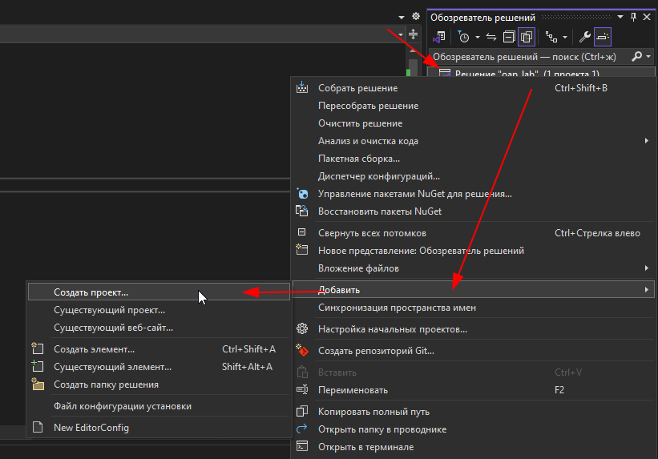
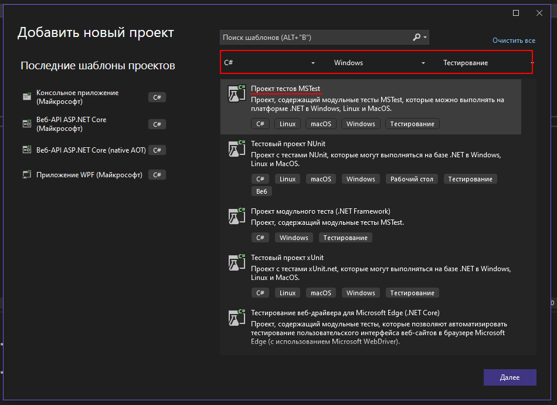
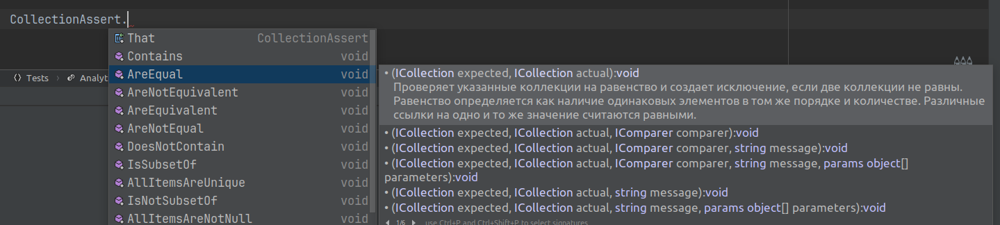

Предыдущая лекция | &nbsp; | Следующая лекция
:----------------:|:----------:|:----------------:
[Создание библиотеки классов](./5_3_1_9_classlib.md) | [Содержание](../readme.md#мдк-0503-тестирование-информационных-систем) | [Fake data. Тестирование методов получающих внешние данные из удалённых источников](./fake_unit_test.md)

# Создание UNIT-тестов

## Немного теории

### Именование проектов

в **С#** тест реализуется как отдельный проект в том же "решении".

К наименованию проекта добавляется суффикс "**.Tests**". То есть, если основной проект у нас называется, например, "*Demo*", то тестирующий проект должен называться "*Demo.Tests*"

### Именование классов

Внутри тестового проекта тестирующие классы тоже должны заканчиваться словом "**Tests**" (*тестирующий* класс, это класс, который тестирует соответсвующий класс в основном приложении. В тестирующем приложении могут быть и другие вспомогательные классы, правила именования для них обычные), например, для класса "*UserManager*" создается тестирующий класс "*UserManagerTests*".

### Именование методов

Принцип именования методов тестирующего класса:

`[Тестируемый метод]_[Сценарий]_[Ожидаемое поведение]`

Примеры:

* Sum_10plus20_30returned
* GetPasswordStrength_AllChars_5Points

### Концепция ААА

Любой тест проходит три стадии:

1. **Arrange** - подготовка тестовых данных

    ```cs
    // исходные данные
    int x = 10;
    int y = 20;
    // ожидаемый результат
    int expected = 30;
    ```

1. **Act** - выполнение основного действия тестируемым классом

    ```cs
    int actual = Calc.Sum(x, y)
    ```

1. **Assert** - проверка результата
    ```cs
    Assert.AreEqual(expected, actual);
    ```

Для проверки результатов используется класс **Assert**, который реализует множество методов для проверки.

### Атрибуты

Перед методами тестирующего класса могут быть указаны атрибуты:

* **[TestClass]** - тестирующий класс
* **[TestMethod]** - тестирующий метод

* **[TestInitialize]** - метод для инициализации, вызывается перед каждым тестирующим методом
* **[TestCleanup]** - метод для освобождения ресурсов, вызывается после каждого тестирующего метода

* **[ClassInitialize]** - вызывается один раз для тестирующего класса, перед запуском тестирующего метода
* **[ClassCleanup]** - вызывается одина раз для тестирующего класса, после завершения тестирующих методов

* **[AssemblyInitialize]** - вызывается перед тем, как начнут работать тестирующие методы в сборке
* **[AssemblyCleanup]** - вызывается после завершения тестирующих методов в сборке

### Assertion - сравнение разных типов данных

* **Assert**
    * сравнение двух входящих значений
    * множество методов для сравнения

* **CollectionAssert**    
    * сравнение двух коллекций
    * проверка элементов в коллекции

* **StringAssert** 
    * сравнение строк

### Основные методы класса Assert

**Assert.AreEqual()**  
Проверка двух аргументов на равенство

**Assert.AreSame()**  
Проверяет, ссылаются ли переменные на одну и ту же область памяти

**Assert.InstanceOfType()**  
Метод для проверки типа объекта

**Assert.IsTrue**, **Asser.IsFalse**  
Проверка логических конструкций

## Практика

В решение, где у вас создана библиотека классов, добавьте проект "Проект тестов MSTest":





* Правила формирования имени тестового проекта были выше, у меня получилось **CompanyCoreLib.Tests**. 
* Расположение не трогаем, по-умолчанию тестовый проект сохранится в том же решении (рядом с основным проектом). 
* Тип тестов: **MSTest**

Получится такая "рыба":

```cs
namespace CompanyCoreLib.Tests;

[TestClass]
public class UnitTest1
{
    [TestMethod]
    public void TestMethod1()
    {
    }
}
```

### Связь с основным проектом

Добавьте связь с основным проектом (как делали в прошлой лекции в консольном приложении).

### Написание тестов

Для начала нужно выбрать в тестируемом проекте (CompanyCoreLib) класс, который мы хотим протестировать - у нас там один класс, созданный именно для тестирования: **Analytics**.

Тестирующий класс переименуйте в **AnalyticsTests** (по соглашению к имени тестируемого класса добавляется суффикс *Tests*)

Тестовый метод тоже переименуем в соответствии с соглашением. Но для начала мы должны определиться что будем тестировать. Повторим тот код, который реализовывали в консольном приложении, т.е. на входе у нас список уникальных дат, а на выходе отсортированный список: **PopularMonths_UniqueDates_OnlySort**.

и реализуем этот метод:

```cs
[TestMethod]
public void PopularMonths_UniqueDates_OnlySort()
{
    // Arrange - подготовка исходных данных
    var srcDates = new List<DateTime>()
    {
        new DateTime(2023,12,18,12,30,0),
        new DateTime(2023,11,21,20,10,0),
    };
    
    /**
    * Act - действие
    * тут мы должны создать экземпляр класса, чтобы протестировать его
    */
    var myAnalytics = new Analytics();
    
    // выполняем метод и получаем результат
    var outDates = myAnalytics.PopularMonths(srcDates);
    
    /**
    * подгатавливаем данные для 
    * ожидаемого результата
    * просто оригинальный список, 
    * но с сортировкой по возрастанию
    */
    var expectedDates = new List<DateTime>()
    {
        new DateTime(2023,11,1,0,0,0),
        new DateTime(2023,12,1,0,0,0)
    };
    
    // Assert - сравниваем ожидаемый результат и данные полученные от тестируемого метода
    CollectionAssert.AreEqual(expectedDates, outDates);

}
```

При сравнении скалярных данных (числа, строки...) используется класс **Assert**. Но так как у нас не скалярный тип данных (**List**), то нужно использовать соответствующий класс - нам подходит **CollectionAssert**



При ошибке сравнения данных методы **Assert** вызывают исключения, по которым система и определяет пройден тест или нет.

## Запуск тестов

1. Пересоберите решение, чтобы убедиться что нет ошибок

1. Откройте "обозреватель тестов": Тест -> Обозреватель тестов и выполните тест

    

## Оптимизация

Считается хорошим тоном в тестовых методах делать только то, что непосредственно относится к тестированию. В нашем случае создание экземпляра класса *myAnalytics* выбивается из общей картины и, к тому же, мы будем вынуждены это делать в каждом тестовом методе.

Чтобы избежать повторений и очистить код добавим служебные методы инициализации и финализации:

```cs
// сам экземпляр класса "Analytics" мы объявляем 
// как свойство тестирующего класса
private static Analytics myAnalytics = null;

/* используем атрибут [ClassInitialize], 
который скажет тестировщику, 
что этот метод нужно выполнить ДО запуска тестов 
(поэтому и этот метод и свойство myAnalytics 
должны быть объявлены статическими)*/
[ClassInitialize]
static public void Init(TestContext tc)
{
    myAnalytics = new Analytics();
}

// и аналогично для завершения
[ClassCleanup]
static public void Done()
{
    myAnalytics = null;
}
```

А в методе *PopularMonths_UniqueDates_OnlySort* создание экземпляра *myAnalytics* убрать.

## Добавление тестовых ситуаций (case)

При тестировании мы должны проверить не только правильное выполнение тестируемого метода, но и поведение при ошибках.

* проверяем что результат НЕ РАВЕН заведомо не правильному результату

    ```cs
    [TestMethod]
    public void PopularMonths_UniqueDates_NotEmpty()
    {
        // Arrange - подготовка исходных данных
        var srcDates = new List<DateTime>()
        {
            new DateTime(2023,12,1,0,0,0),
            new DateTime(2023,11,1,0,0,0),
        };
        
        // Act - действие
        var outDates = myAnalytics.PopularMonths(srcDates);
        
        /**
         * Arrange - подгатавливаем данные для ожидаемого результата
         * пустой список для проверки не ожиданного результата
         */
        var expectedDates = new List<DateTime>();
        
        CollectionAssert.AreNotEqual(expectedDates, outDates);
    }
    ```

* используя атрибут *ExpectedException*, проверяем наличие исключения при делении на 0

    > Наш метод исключений не вызывает, поэтому тут "сферический конь в вакууме" от другого метода

    ```cs
    [TestMethod]
    [ExpectedException(typeof(DivideByZeroException), "Деление на 0")]
    public void Div_2div0_exceptionexpected()
    {
        //arrange
        float a = 2;
        float b = 0;
        float expected = 2;

        //act
        float actual = MyCalc.Div(a, b);

        //assert
        Assert.AreNotEqual(actual, expected);
    }
    ```

    То же самое можно сделать без использования атрибута, а просто завернув код в блок `try..catch`, и в секции try после вычисления вставить `Assert.Fail();` (т.е. если при делении на 0 вдруг попадем на этот код, то тест не пройден)

## Ближе к телу

В тестовом задании, которое вы делаете на лабораторных, есть сохранение услуг. Перед сохранением нужно проверить верно ли заполнены поля услуги. 

Сделаем тестирование сохранения услуги в БД.

1. Вынесем код, сохраняющий данные об услуге, в отдельный метод класса **Core**. 

    >По идее тут нужно вообще добавлять интерфейсы и при тестировании работать не с реальной базой, а с заглушкой. Возможно позже я это распишу, а пока делаем как написано ниже.

    ```cs
    // добавляем исключения на каждый вариант проверки
    public class ServiceEmptyCost : Exception {
        public ServiceEmptyCost(string Mesage): base(Mesage) { }
    }

    public class ServiceInvalidDiscount : Exception
    {
        public ServiceInvalidDiscount(string Mesage) : base(Mesage) { }
    }

    public class Core
    {
        public static spenkinEntities DB = new spenkinEntities();

        // добавляем статический метод, который осуществляет все проверки
        // если есть ошибки, то он выкинет исключение
        public static void SaveService(Service SavedService) {
            if (SavedService.Cost <= 0)
                throw new ServiceEmptyCost("Не заполнена цена");

            if (SavedService.Discount < 0 || SavedService.Discount > 1)
                throw new ServiceInvalidDiscount("Скидка должна быть в диапазоне 0..1");

            if (SavedService.ID == 0)
                DB.Service.Add(SavedService);

            DB.SaveChanges();
        }
    }
    ```

1. Реализуем тестирование

    ```cs
    namespace UnitTestProject1
    {
        [TestClass]
        public class UnitTest1
        {
            [TestMethod]
            [ExpectedException(typeof(ServiceEmptyCost), "Не заполнена цена")]
            public void TestMethod1()
            {
                var NewService = new Service();
                Core.SaveService(NewService);
                // досюда мы доходить не должны
                Assert.Fail();
            }
        }
    }
    ```

    Тут используется атрибут **ExpectedException**. Он означает, что НОРМАЛЬНЫМ завершением этого теста будет исключение указанного типа.

---

## Задание

Реализовать тестовые сценарии, разработанные в прошлом задании

---

Предыдущая лекция | &nbsp; | Следующая лекция
:----------------:|:----------:|:----------------:
[Создание библиотеки классов](./5_3_1_9_classlib.md) | [Содержание](../readme.md#мдк-0503-тестирование-информационных-систем) | [Fake data. Тестирование методов получающих внешние данные из удалённых источников](./fake_unit_test.md)
