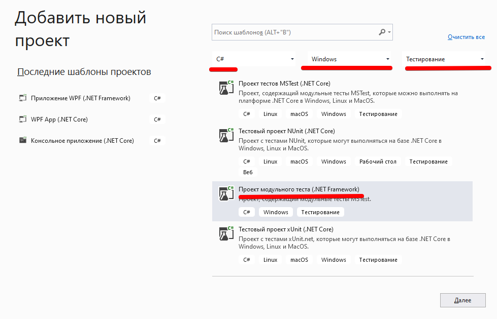
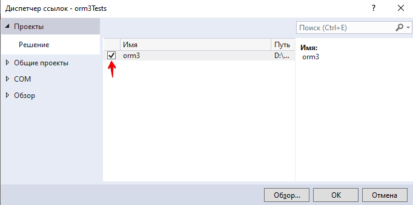
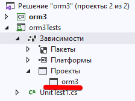
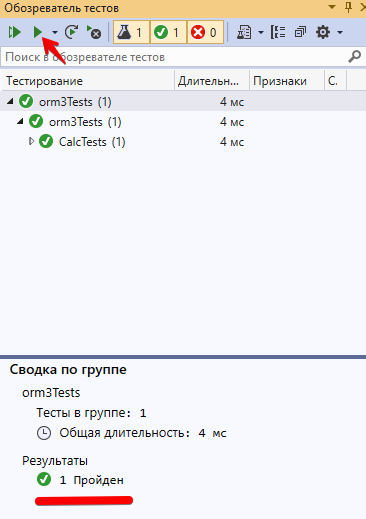

<table style="width: 100%;"><tr><td style="width: 40%;">
<a href="../articles/null.md">
</a></td><td style="width: 20%;">
<a href="../readme.md">Содержание
</a></td><td style="width: 40%;">
<a href="../articles/fake_unit_test.md">Fake data. Тестирование методов получающих внешние данные из удалённых источников.
</a></td><tr></table>

# Создание UNIT-тестов

## Немного теории

### Именование проектов

в С# тест реализуется как отдельный проект в том же "решении".

К наименованию проекта добавляется суффикс **.Tests**. Т.е. если основной проект у нас называется, например, *Demo*, то тестовый проект должен называться *Demo.Tests*

### Именование классов

Внутри тестового проекта тестирующие классы тоже должны заканчиваться словом **Tests** (*тестирующий* класс, это класс, который тестирует соответсвующий класс в основном приложении. В тестирующем приложении могут быть и другие вспомогательные классы, правила именования для них обычные), например, для класса *UserManager* создается тестирующий класс *UserManagerTests*.

### Именование методов

Принцип именования методов тестирующего класса:

`[Тестирующийся метод]_[Сценарий]_[Ожидаемое поведение]`

Примеры:

* Sum_10plus20_30returned
* GetPasswordStrength_AllChars_5Points

### Концепция ААА

Любой тест проходит три стадии:

1. **Arrange** - подготовка тестовых данных
    ```cs
    int x = 10;
    int y = 20;
    int expected = 30;
    ```

2. **Act** - выполнение основного действия тестируемым классом
    ```cs
    int actual = Calc.Add(x, y)
    ```

3. **Assert** - проверка результата
    ```cs
    Assert.AreEqual(exprected, actusl);
    ```

Для проверки результатов используется класс **Assert**, который реализует множество методов для проверки.

### Атрибуты

Перед методами тестирующего класса могут быть указаны атрибуты:

* **[TestClass]** - тестирующий класс
* **[TestMethod]** - тестирующий метод

* **[TestInitialize]** - метод для инициализации, вызывается перед каждым тестирующим методом
* **[TestCleanup]** - метод для освобождения ресурсов, вызывается после каждого тестирующего метода

* **[ClassInitialize]** - вызывается один раз для тестирующего класса, перед запуском тестирующего метода
* **[ClassCleanup]** - вызывается одина раз для тестирующего класса, после завершения тестирующих методов

* **[AssemblyInitialize]** - вызывается перед тем, как начнут работать тестирующие методы в сборке
* **[AssemblyCleanup]** - вызывается после завершения тестирующих методов в сборке

### Assertion - сравнение разных типов данных

* **Assert**
    * сравнение двух входящих значений
    * множество методов для сравнения

* **CollectionAssert**    
    * сравнение двух коллекций
    * проверка элементов в коллекции

* **StringAssert** 
    * сравнение строк

### Основные методы класса Assert

**Assert.AreEqual()**  
Проверка двух аргументов на равенство

**Assert.AreSame()**  
Проверяет, ссылаются ли переменные на одну и ту же область памяти

**Assert.InstanceOfType()**  
Метод для проверки типа объекта

**Assert.IsTrue**, **Asser.IsFalse**  
Проверка логических конструкций

## Практика

В контекстном меню **РЕШЕНИЯ** выбираете *Добавить -> Создать проект*

При создании проекта можете воспользоваться фильтрами "языки", "платформа" и "типы проектов". В итоге надо выбрать "Проект модульного теста (.NET Framework)"



Правила формирования имени тестового проекта были выше, у меня получилось **orm3.Tests**. Расположение не трогаем, по-умолчанию тестовый проект сохранится в том же решении (рядом с основным проектом)

### Связь с основным проектом

Дальше нужно добавить связь с основным проектом:

В тестовом проекте находим пункт "зависимости" (теперь он называется "ссылки") и в контекстном меню "добавить ссылку на проект"


Выбрать основной проект (их может быть несколько), у меня он называется **orm3**.



Проверить, добавлен ли проект в зависимости, можно раскрыв "зависимости"




### Написание тестов

Для начала нужно выбрать в тестируемом проекте класс, который мы хотим протестировать. Т.к. у нас там нет каких-то простых классов, то нарисуем класс "Калькулятор" с методом "Деление" (желательно отдельным файлом, т.к. это может оцениваться отдельными баллами, но можно и в любом .cs файле проекта):

```cs
public class Calc
{
    public float Div(float a, float b)
    {
        return a / b;
    }
}
```

Тестовый метод переобзываем в соответствии с соглашением: **Div_2div2_1expected**, т.е. мы делим "2" на "2" и ожидаем получить "1".

и реализуем этот метод:

```cs
[TestMethod]
public void Div_2div2_1expected()
{
    //arrange
    int a = 2;
    int b = 2;
    float expected = 1;

    //act
    // тут мы должны создать экземпляр класса, чтобы протестировать его
    Calc MyCalc = new Calc();
    float actual = MyCalc.Div(a, b);

    //assert
    Assert.AreEqual(actual, expected);
}
```

При ошибке сравнения методы **Assert** вызывают исключения, по которым система и определяет пройден тест или нет.

## Запуск тестов

1. Пересоберите тестовый проект, чтобы убедиться что нет ошибок: *Сборка -> Собрать решение*

2. Откройте "обозреватель тестов": *Тест -> Обозреватель тестов* и выполните тест

    

## Оптимизация

Считается хорошим тоном в тестовых методах делать только то, что непосредственно относится к тестированию. В нашем случае создание экземпляра класса *MyCalc* выбивается из общей картины и, к тому же, мы будем вынуждены это делать в каждом тестовом методе.

Чтобы избежать повторений и очистить код добавим служебные методы инициализации и финализации:

```cs
// сам экземпляр класса "Calc" мы объявляем как свойство тестового класса
static Calc MyCalc = null;

/* используем атрибут [ClassInitialize], 
который скажет тестировщику, 
что этот метод нужно выполнить ДО запуска тестов 
(поэтому и этот метод и свойство Mycalc 
должны быть объявлены статические)*/
[ClassInitialize]
static public void Init(TestContext tc)
{
    MyCalc = new Calc();
}

// и аналогично для завершения
[ClassCleanup]
static public void Done()
{
    MyCalc = null;
}
```

А в методе *Div_2div2_1expected* создание экземпляра *MyCalc* убрать.

## Добавление тестовых ситуаций (case)

При тестировании мы должны проверить не только правильное выполнение тестируемого метода, но и поведение при ошибках.

* проверяем что результат НЕ РАВЕН заведомо не правильному результату

    ```cs
    [TestMethod]
    public void Div_2div2_2notexpected()
    {
        //arrange
        int a = 2;
        int b = 2;
        float expected = 2;

        //act
        float actual = MyCalc.Div(a, b);

        //assert
        Assert.AreNotEqual(actual, expected);
    }
    ```

* используя атрибут *ExpectedException*, проверяем наличие исключения при делении на 0
    ```cs
    [TestMethod]
    [ExpectedException(typeof(DivideByZeroException), "Деление на 0")]
    public void Div_2div0_exceptionexpected()
    {
        //arrange
        float a = 2;
        float b = 0;
        float expected = 2;

        //act
        float actual = MyCalc.Div(a, b);

        //assert
        Assert.AreNotEqual(actual, expected);
    }
    ```

    То же самое можно сделать без использования атрибута, а просто завернув код в блок try..catch, и в секции try после вычисления вставить `Assert.Fail();` (т.е. если при делении на 0 вдруг попадем на этот код, то тест не пройден)

## Ближе к телу

В тестовом задании, которое вы делаете на лабораторных, есть сохранение услуг. Перед сохранением нужно проверить верно ли заполнены поля услуги. 

Сделаем тестирование сохранения услуги в БД.

1. Вынесем код, сохраняющий данные об услуге, в отдельный метод класса **Core**. 

    >По идее тут нужно вообще добавлять интерфейсы и при тестировании работать не с реальной базой, а с заглушкой. Возможно позже я это распишу, а пока делаем как написано ниже.

    ```cs
    // добавляем исключения на каждый вариант проверки
    public class ServiceEmptyCost : Exception {
        public ServiceEmptyCost(string Mesage): base(Mesage) { }
    }

    public class ServiceInvalidDiscount : Exception
    {
        public ServiceInvalidDiscount(string Mesage) : base(Mesage) { }
    }

    public class Core
    {
        public static spenkinEntities DB = new spenkinEntities();

        // добавляем статический метод, который осуществляет все проверки
        // если есть ошибки, то он выкинет исключение
        public static void SaveService(Service SavedService) {
            if (SavedService.Cost <= 0)
                throw new ServiceEmptyCost("Не заполнена цена");

            if (SavedService.Discount < 0 || SavedService.Discount > 1)
                throw new ServiceInvalidDiscount("Скидка должна быть в диапазоне 0..1");

            if (SavedService.ID == 0)
                DB.Service.Add(SavedService);

            DB.SaveChanges();
        }
    }
    ```

    >Вообще вместо исключений можно использовать код ответа, т.е. если сохранение произошло успешно, то возвращать "0", иначе код ошибки (а можно и сразу текст ошибки).

2. Реализуем тестирование

    ```cs
    namespace UnitTestProject1
    {
        [TestClass]
        public class UnitTest1
        {
            [TestMethod]
            [ExpectedException(typeof(ServiceEmptyCost), "Не заполнена цена")]
            public void TestMethod1()
            {
                var NewService = new Service();
                Core.SaveService(NewService);
                // досюда мы доходить не должны
                Assert.Fail();
            }
        }
    }
    ```

    Тут используется атрибут **ExpectedException**. Он означает, что НОРМАЛЬНЫМ завершением этого теста будет исключение указанного типа.

<table style="width: 100%;"><tr><td style="width: 40%;">
<a href="../articles/null.md">
</a></td><td style="width: 20%;">
<a href="../readme.md">Содержание
</a></td><td style="width: 40%;">
<a href="../articles/fake_unit_test.md">Fake data. Тестирование методов получающих внешние данные из удалённых источников.
</a></td><tr></table>