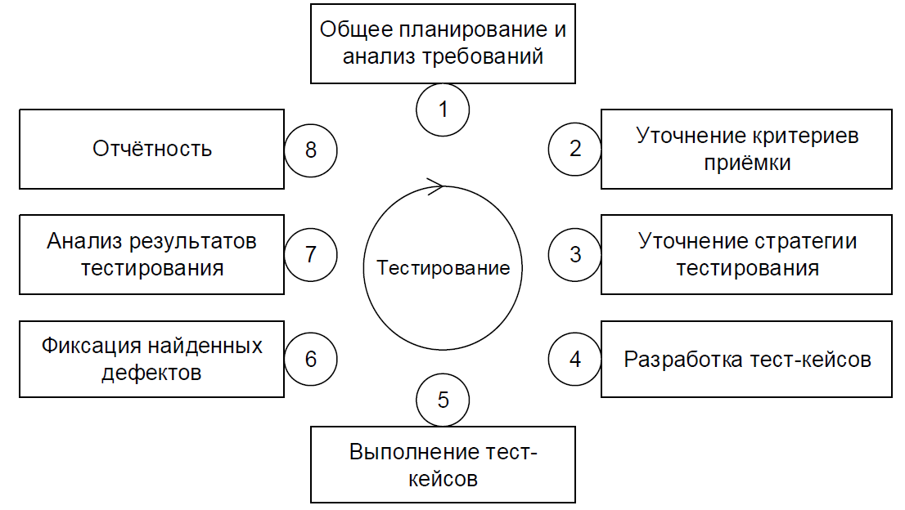
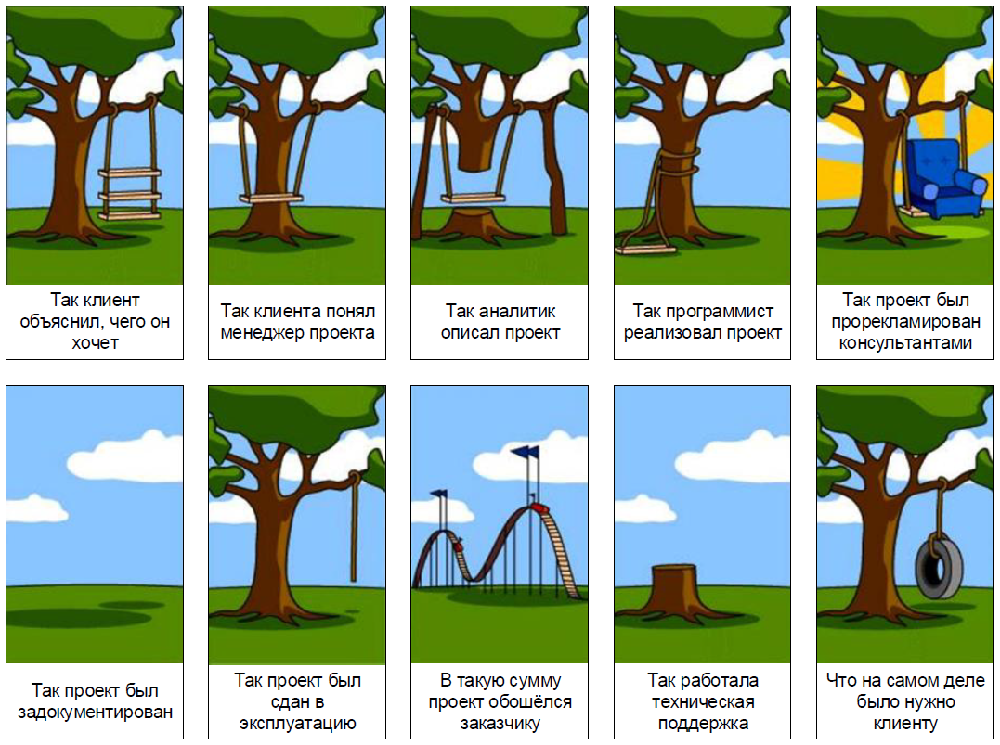
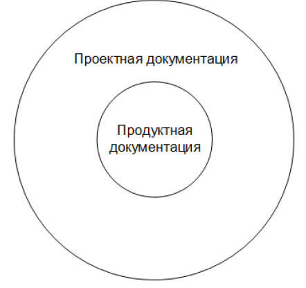
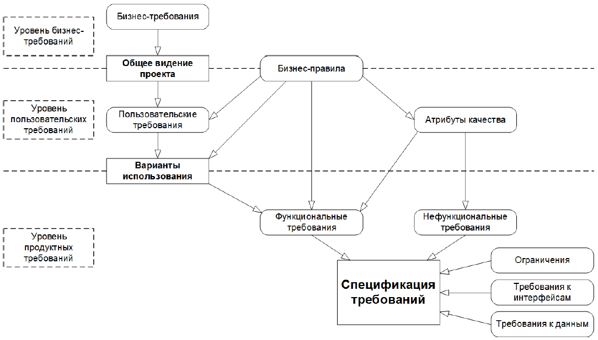
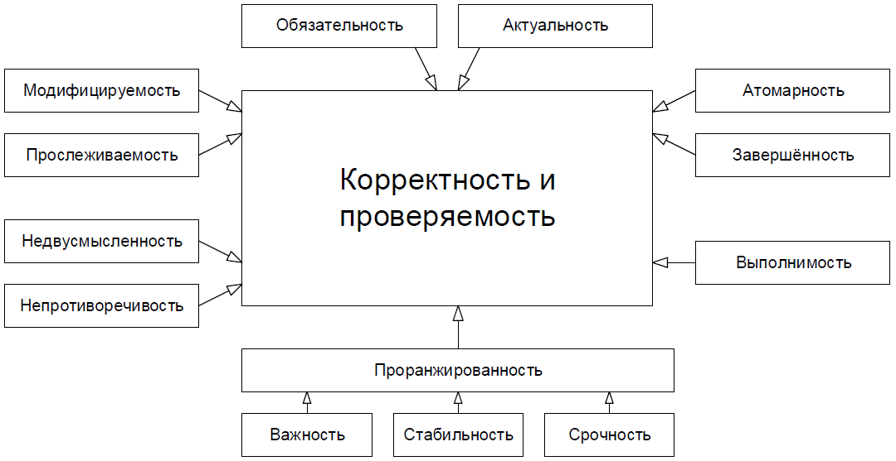
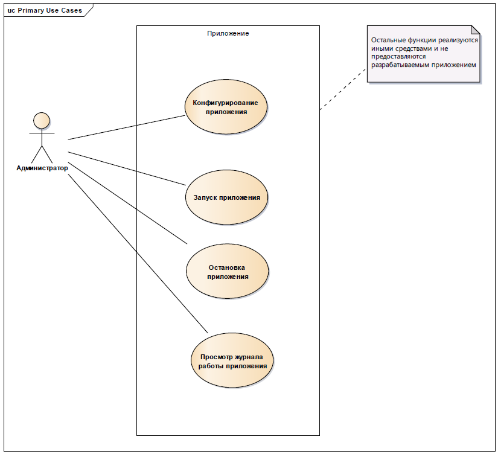
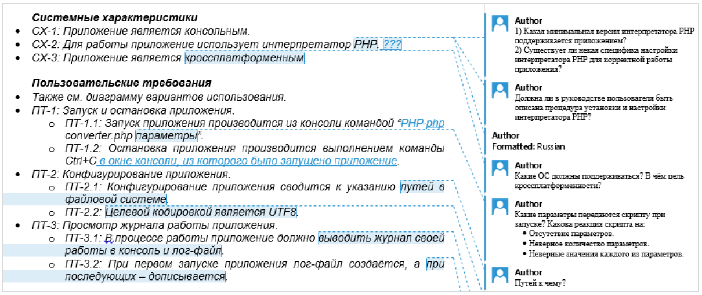

&nbsp;|&nbsp;|&nbsp;
:-:|:-:|:-:
[Тестирование и тестировщики](../articles/5_3_1_1_intro.md) | [содержание](../readme.md) | [Виды и методы тестирования](articles/5_3_1_3_vidy.md)

# Жизненный цикл тестирования

Следуя общей логике итеративности, превалирующей во всех современных моделях разработки ПО, жизненный цикл тестирования также выражается замкнутой последовательностью действий.

Важно понимать, что длина такой итерации (и, соответственно, степень подробности каждой стадии) может варьироваться в широчайшем диапазоне — от единиц часов до десятков месяцев. Как правило, если речь идёт о длительном промежутке времени, он разбивается на множество относительно коротких итераций, но сам при этом «тяготеет» к той или иной стадии в каждый момент времени (например, в начале проекта больше планирования, в конце — больше отчётности).

Также ещё раз подчеркнём, что приведённая схема — не догма, и вы легко можете найти альтернативы, но общая суть и ключевые принципы остаются неизменными. Их и рассмотрим.

**Стадия 1** (общее планирование и анализ требований) объективно необходима как минимум для того, чтобы иметь ответ на такие вопросы, как: что нам предстоит тестировать; как много будет работы; какие есть сложности; всё ли необходимое у нас есть и т.п. Как правило, получить ответы на эти вопросы невозможно без анализа требований, т.к. именно требования являются первичным источником ответов.

**Стадия 2** (уточнение критериев приёмки) позволяет сформулировать или уточнить метрики и признаки возможности или необходимости начала тестирования (entry criteria), приостановки (suspension criteria) и возобновления (resumption criteria) тестирования, завершения или прекращения тестирования (exit criteria).

**Стадия 3** (уточнение стратегии тестирования) представляет собой ещё одно обращение к планированию, но уже на локальном уровне: рассматриваются и уточняются те части стратегии тестирования (test strategy), которые актуальны для текущей итерации.

**Стадия 4** (разработка тест-кейсов) посвящена разработке, пересмотру, уточнению, доработке, переработке и прочим действиям с тест-кейсами, наборами тест-кейсов, тестовыми сценариями и иными артефактами, которые будут использоваться при непосредственном выполнении тестирования.

**Стадия 5** (выполнение тест-кейсов) и стадия 6 (фиксация найденных дефектов) тесно связаны между собой и фактически выполняются параллельно: дефекты фиксируются сразу по факту их обнаружения в процессе выполнения тест-кейсов. Однако зачастую после выполнения всех тест-кейсов и написания всех отчётов о найденных дефектах проводится явно выделенная стадия уточнения, на которой все отчёты о дефектах рассматриваются повторно с целью формирования единого понимания проблемы и уточнения таких характеристик дефекта, как важность и срочность.

**Стадия 7** (анализ результатов тестирования) и **стадия 8** (отчётность) также тесно связаны между собой и выполняются практически параллельно. Формулируемые на стадии анализа результатов выводы напрямую зависят от плана тестирования, критериев приёмки и уточнённой стратегии, полученных на стадиях 1, 2 и 3. 
Полученные выводы оформляются на стадии 8 и служат основой для стадий 1, 2 и 3 следующей итерации тестирования. Таким образом, цикл замыкается.

В жизненном цикле тестирования пять из восьми стадий так или иначе связаны с управлением проектами, рассмотрение которого не входит в наши планы, а потому обо всём, что касается планирования и отчётности, мы кратко поговорим в главе «Оценка трудозатрат, планирование и отчётность». А сейчас мы переходим к ключевым навыкам и основным видам деятельности тестировщиков и начнём с работы с документацией.

## Тестирование документации и требований

### Что такое «требование»

Как мы только что рассмотрели в главе, посвящённой жизненному циклу тестирования, всё так или иначе начинается с документации и требований.

>**Требование** (requirement) — описание того, какие функции и с соблюдением каких условий должно выполнять приложение в процессе решения полезной для пользователя задачи.

### Важность требований

Требования являются отправной точкой для определения того, что проектная команда будет проектировать, реализовывать и тестировать. Элементарная логика говорит нам, что если в требованиях что-то «не то», то и реализовано будет «не то», т.е. колоссальная работа множества людей будет выполнена впустую. Эту мысль иллюстрирует рисунок.

Брайан Хэнкс, описывая важность требований, подчёркивает, что они:

* Позволяют понять, что и с соблюдением каких условий система должна делать.
* Предоставляют возможность оценить масштаб изменений и управлять изменениями.
* Являются основой для формирования плана проекта (в том числе плана тестирования).
* Помогают предотвращать или разрешать конфликтные ситуации.
* Упрощают расстановку приоритетов в наборе задач.
* Позволяют объективно оценить степень прогресса в разработке проекта.

Вне зависимости от того, какая модель разработки ПО используется на проекте, чем позже будет обнаружена проблема, тем сложнее и дороже будет её решение. А в самом начале («водопада», «спуска по букве v», «итерации», «витка спирали») идёт планирование и работа с требованиями.

Если проблема в требованиях будет выяснена на этой стадии, её решение может свестись к исправлению пары слов в тексте, в то время как недоработка, вызванная пропущенной проблемой в требованиях и обнаруженная на стадии эксплуатации, может даже полностью уничтожить проект.

Если графики вас не убеждают, попробуем проиллюстрировать ту же мысль на простом примере. Допустим, вы с друзьями составляете список покупок перед поездкой в гипермаркет. Вы поедете покупать, а друзья ждут вас дома. Сколько «стоит» дописать, вычеркнуть или изменить пару пунктов, пока вы только-только составляете список? Нисколько. Если мысль о несовершенстве списка настигла вас по пути в гипермаркет, уже придётся звонить (дёшево, но не бесплатно). Если вы поняли, что в списке «что-то не то» в очереди на кассу, придётся возвращаться в торговый зал и тратить время. Если проблема выяснилась по пути домой или даже дома, придётся вернуться в гипермаркет. И, наконец, клинический случай: в списке изначально было что-то уж совсем неправильное (например, «100 кг конфет — и всё»), поездка совершена, все деньги потрачены, конфеты привезены и только тут выясняется, что «ну мы же пошутили».

Ещё одним аргументом в пользу тестирования требований является то, что, по разным оценкам, в них зарождается от ½ до ¾ всех проблем с программным обеспечением. В итоге есть риск, что получится так, как показано на рисунке.

Поскольку мы постоянно говорим «документация и требования», а не просто «требования», то стоит рассмотреть перечень документации, которая должна подвергаться тестированию в процессе разработки ПО (хотя далее мы будем концентрироваться именно на требованиях).

В общем случае документацию можно разделить на два больших вида в зависимости от времени и места её использования

* **Продуктная документация** (product documentation, development documentation) используется проектной командой во время разработки и поддержки продукта. Она включает:
    * План проекта (project management plan) и в том числе тестовый план (test plan).
    * Требования к программному продукту (product requirements document, PRD) и функциональные спецификации (functional specifications document, FSD; software requirements specification, SRS).
    * Архитектуру и дизайн (architecture and design).
    * Тест-кейсы и наборы тест-кейсов (test cases, test suites).
    * Технические спецификации (technical specifications), такие как схемы баз данных, описания алгоритмов, интерфейсов и т.д.
* **Проектная документация** (project documentation) включает в себя как продуктную документацию, так и некоторые дополнительные виды документации и используется не только на стадии разработки, но и на более ранних и поздних стадиях (например, на стадии внедрения и эксплуатации). Она включает:
    * Пользовательскую и сопроводительную документацию (user and accompanying documentation), такую как встроенная помощь, руководство по установке и использованию, лицензионные соглашения и т.д.
    * Маркетинговую документацию (market requirements document, MRD), которую представители разработчика или заказчика используют как на начальных этапах (для уточнения сути и концепции проекта), так и на финальных этапах развития проекта (для продвижения продукта на рынке).

В некоторых классификациях часть документов из продуктной документации может быть перечислена в проектной документации — это совершенно нормально, т.к. понятие проектной документации по определению является более широким. Поскольку с этой классификацией связано очень много вопросов и непонимания, отразим суть ещё раз — графически — и напомним, что мы договорились классифицировать документацию по признаку того, где (для чего) она является наиболее востребованной.

Степень важности и глубина тестирования того или иного вида документации и даже отдельного документа определяется большим количеством факторов, но неизменным остаётся общий принцип: всё, что мы создаём в процессе разработки проекта (даже рисунки маркером на доске, даже письма, даже переписку в скайпе), можно считать документацией и так или иначе подвергать тестированию (например, вычитывание письма перед отправкой — это тоже своего рода тестирование документации).

## Источники и пути выявления требований

Требования начинают свою жизнь на стороне заказчика. Их сбор (gathering) и выявление (elicitation) осуществляются с помощью следующих основных техник

**Интервью**. Самый универсальный путь выявления требований, заключающийся в общении проектного специалиста (как правило, специалиста по бизнес-анализу) и представителя заказчика (или эксперта, пользователя и т.д.). Интервью может проходить в классическом понимании этого слова (беседа в виде «вопрос-ответ»), в виде переписки и т.п. Главным здесь является то, что ключевыми фигурами выступают двое — интервьюируемый и интервьюер (хотя это и не исключает наличия «аудитории слушателей», например, в виде лиц, поставленных в копию переписки).

**Работа с фокусными группами**. Может выступать как вариант «расширенного интервью», где источником информации является не одно лицо, а группа лиц (как правило, представляющих собой целевую аудиторию, и/или обладающих важной для проекта информацией, и/или уполномоченных принимать важные для проекта решения).

**Анкетирование**. Этот вариант выявления требований вызывает много споров, т.к. при неверной реализации может привести к нулевому результату при объёмных затратах. В то же время при правильной организации анкетирование позволяет автоматически собрать и обработать огромное количество ответов от огромного количества респондентов. Ключевым фактором успеха является правильное составление анкеты, правильный выбор аудитории и правильное преподнесение анкеты.

**Семинары и мозговой штурм**. Семинары позволяют группе людей очень быстро обменяться информацией (и наглядно продемонстрировать те или иные идеи), а также хорошо сочетаются с интервью, анкетированием, прототипированием и моделированием — в том числе для обсуждения результатов и формирования выводов и решений. Мозговой штурм может проводиться и как часть семинара, и как отдельный вид деятельности. Он позволяет за минимальное время сгенерировать большое количество идей, которые в дальнейшем можно не спеша рассмотреть с точки зрения их использования для развития проекта.

**Наблюдение**. Может выражаться как в буквальном наблюдении за некими процессами, так и во включении проектного специалиста в эти процессы в качестве участника. С одной стороны, наблюдение позволяет увидеть то, о чём (по совершенно различным соображениям) могут умолчать интервьюируемые, анкетируемые и представители фокусных групп, но с другой — отнимает очень много времени и чаще всего позволяет увидеть лишь часть процессов.

**Прототипирование**. Состоит в демонстрации и обсуждении промежуточных версий продукта (например, дизайн страниц сайта может быть сначала представлен в виде картинок, и лишь затем свёрстан). Это один из лучших путей поиска единого понимания и уточнения требований, однако он может привести к серьёзным дополнительным затратам при отсутствии специальных инструментов (позволяющих быстро создавать прототипы) и слишком раннем применении (когда требования ещё не стабильны, и высока вероятность создания прототипа, имеющего мало общего с тем, что хотел заказчик).

**Анализ документов**. Хорошо работает тогда, когда эксперты в предметной области (временно) недоступны, а также в предметных областях, имеющих общепринятую устоявшуюся регламентирующую документацию. Также к этой технике относится и просто изучение документов, регламентирующих бизнес-процессы в предметной области заказчика или в конкретной организации, что позволяет приобрести необходимые для лучшего понимания сути проекта знания.

**Моделирование процессов и взаимодействий**. Может применяться как к «бизнес-процессам и взаимодействиям» (например: «договор на закупку формируется отделом закупок, визируется бухгалтерией и юридическим отделом…»), так и к «техническим процессам и взаимодействиям» (например: «платёжное поручение генерируется модулем “Бухгалтерия”, шифруется модулем “Безопасность” и передаётся на сохранение в модуль “Хранилище”»). Данная техника требует высокой квалификации специалиста по бизнес-анализу, т.к. сопряжена с обработкой большого объёма сложной (и часто плохо структурированной) информации.

**Самостоятельное описание**. Является не столько техникой выявления требований, сколько техникой их фиксации и формализации. Очень сложно (и даже нельзя!) пытаться самому «придумать требования за заказчика», но в спокойной обстановке можно самостоятельно обработать собранную информацию и аккуратно оформить её для дальнейшего обсуждения и уточнения.

## Уровни и типы требований

Форма представления, степень детализации и перечень полезных свойств требований зависят от уровней и типов требований67, которые схематично представлены на рисунке

**Бизнес-требования** (business requirements) выражают цель, ради которой разрабатывается продукт (зачем вообще он нужен, какая от него ожидается польза, как заказчик с его помощью будет получать прибыль). Результатом выявления требований на этом уровне является общее видение (vision and scope70) — документ, который, как правило, представлен простым текстом и таблицами. Здесь нет детализации поведения системы и иных технических характеристик, но вполне могут быть определены приоритеты решаемых бизнес-задач, риски и т.п.

Несколько простых, изолированных от контекста и друг от друга примеров бизнес-требований:
* Нужен инструмент, в реальном времени отображающий наиболее выгодный курс покупки и продажи валюты.
* Необходимо в два-три раза повысить количество заявок, обрабатываемых одним оператором за смену.
* Нужно автоматизировать процесс выписки товарно-транспортных накладных на основе договоров.

**Пользовательские требования** (user requirements) описывают задачи, которые пользователь может выполнять с помощью разрабатываемой системы (реакцию системы на действия пользователя, сценарии работы пользователя). Поскольку здесь уже появляется описание поведения системы, требования этого уровня могут быть использованы для оценки объёма работ, стоимости проекта, времени разработки и т.д. Пользовательские требования оформляются в виде вариантов использования (use cases72), пользовательских историй (user stories), пользовательских сценариев (user scenarios). (Также см. создание пользовательских сценариев в процессе выполнения тестирования.)

Несколько простых, изолированных от контекста и друг от друга примеров пользовательских требований:
* При первом входе пользователя в систему должно отображаться лицензионное соглашение.
* Администратор должен иметь возможность просматривать список всех пользователей, работающих в данный момент в системе.
* При первом сохранении новой статьи система должна выдавать запрос на сохранение в виде черновика или публикацию.

**Бизнес-правила** (business rules) описывают особенности принятых в предметной области (и/или непосредственно у заказчика) процессов, ограничений и иных правил. Эти правила могут относиться к бизнес-процессам, правилам работы сотрудников, нюансам работы ПО и т.д.

Несколько простых, изолированных от контекста и друг от друга примеров бизнес-правил:
* Никакой документ, просмотренный посетителями сайта хотя бы один раз, не может быть отредактирован или удалён.
* Публикация статьи возможна только после утверждения главным редактором.
* Подключение к системе извне офиса запрещено в нерабочее время.

**Атрибуты качества** (quality attributes) расширяют собой нефункциональные требования и на уровне пользовательских требований могут быть представлены в виде описания ключевых для проекта показателей качества (свойств продукта, не связанных с функциональностью, но являющихся важными для достижения целей создания продукта — производительность, масштабируемость, восстанавливаемость). Атрибутов качества очень много77, но для любого проекта реально важными является лишь некоторое их подмножество.

Несколько простых, изолированных от контекста и друг от друга примеров атрибутов качества:
* Максимальное время готовности системы к выполнению новой команды после отмены предыдущей не может превышать одну секунду.
* Внесённые в текст статьи изменения не должны быть утеряны при нарушении соединения между клиентом и сервером.
* Приложение должно поддерживать добавление произвольного количества неиероглифических языков интерфейса.

**Функциональные требования** (functional requirements) описывают поведение системы, т.е. её действия (вычисления, преобразования, проверки, обработку и т.д.). В контексте проектирования функциональные требования в основном влияют на дизайн системы.

Стоит помнить, что к поведению системы относится не только то, что система должна делать, но и то, что она не должна делать (например: «приложение не должно выгружать из оперативной памяти фоновые документы в течение 30 минут с момента выполнения с ними последней операции»).

Несколько простых, изолированных от контекста и друг от друга примеров функциональных требований:
* В процессе инсталляции приложение должно проверять остаток свободного места на целевом носителе.
* Система должна автоматически выполнять резервное копирование данных ежедневно в указанный момент времени.
* Электронный адрес пользователя, вводимый при регистрации, должен быть проверен на соответствие требованиям RFC822.

**Нефункциональные требования** (non-functional requirements) описывают свойства системы (удобство использования, безопасность, надёжность, расширяемость и т.д.), которыми она должна обладать при реализации своего поведения. Здесь приводится более техническое и детальное описание атрибутов качества. В контексте проектирования нефункциональные требования в основном влияют на архитектуру системы.

Несколько простых, изолированных от контекста и друг от друга примеров нефункциональных требований:
* При одновременной непрерывной работе с системой 1000 пользователей, минимальное время между возникновением сбоев должно быть более или равно 100 часов.
* Ни при каких условиях общий объём используемой приложением памяти не может превышать 2 ГБ.
* Размер шрифта для любой надписи на экране должен поддерживать настройку в диапазоне от 5 до 15 пунктов.

Следующие требования в общем случае могут быть отнесены к нефункциональным, однако их часто выделяют в отдельные подгруппы (здесь для простоты рассмотрены лишь три таких подгруппы, но их может быть и гораздо больше; как правило, они проистекают из атрибутов качества, но высокая степень детализации позволяет отнести их к уровню требований к продукту).

**Ограничения** (limitations, constraints) представляют собой факторы, ограничивающие выбор способов и средств (в том числе инструментов) реализации продукта.

Несколько простых, изолированных от контекста и друг от друга примеров ограничений:
* Все элементы интерфейса должны отображаться без прокрутки при разрешениях экрана от 800x600 до 1920x1080.
* Не допускается использование Flash при реализации клиентской части приложения.
* Приложение должно сохранять способность реализовывать функции с уровнем важности «критический» при отсутствии у клиента поддержки JavaScript.

**Требования к интерфейсам** (external interfaces requirements) описывают особенности взаимодействия разрабатываемой системы с другими системами и операционной средой.

Несколько простых, изолированных от контекста и друг от друга примеров требований к интерфейсам:
* Обмен данными между клиентской и серверной частями приложения при осуществлении фоновых AJAX-запросов должен быть реализован в формате JSON.
* Протоколирование событий должно вестись в журнале событий операционной системы.
* Соединение с почтовым сервером должно выполняться согласно RFC3207 («SMTP over TLS»).

**Требования к данным** (data requirements) описывают структуры данных (и сами данные), являющиеся неотъемлемой частью разрабатываемой системы. Часто сюда относят описание базы данных и особенностей её использования.

Несколько простых, изолированных от контекста и друг от друга примеров требований к данным:
* Все данные системы, за исключением пользовательских документов, должны храниться в БД под управлением СУБД MySQL, пользовательские документы должны храниться в БД под управлением СУБД MongoDB.
* Информация о кассовых транзакциях за текущий месяц должна храниться в операционной таблице, а по завершении месяца переноситься в архивную.
* Для ускорения операций поиска по тексту статей и обзоров должны быть предусмотрены полнотекстовые индексы на соответствующих полях таблиц.

**Спецификация требований** (software requirements specification, SRS) объединяет в себе описание всех требований уровня продукта и может представлять собой весьма объёмный документ (сотни и тысячи страниц).

Поскольку требований может быть очень много, а их приходится не только единожды написать и согласовать между собой, но и постоянно обновлять, работу проектной команды по управлению требованиями значительно облегчают соответствующие инструментальные средства (requirements management tools).

## Свойства качественных требований

В процессе тестирования требований проверяется их соответствие определённому набору свойств

**Завершённость** (completeness). Требование является полным и законченным с точки зрения представления в нём всей необходимой информации, ничто не пропущено по соображениям «это и так всем понятно».

Типичные проблемы с завершённостью:
* Отсутствуют нефункциональные составляющие требования или ссылки на соответствующие нефункциональные требования (например: «пароли должны храниться в зашифрованном виде» — каков алгоритм шифрования?).
* Указана лишь часть некоторого перечисления (например: «экспорт осуществляется в форматы PDF, PNG и т.д.» — что мы должны понимать под «и т.д.»?).
* Приведённые ссылки неоднозначны (например: «см. выше» вместо «см. раздел 123.45.b»).

Способы обнаружения проблем | Способы устранения проблем
---|---
Применимы почти все техники тестирования требований{48}, но лучше всего помогает задавание вопросов и использование графического представления разрабатываемой системы. Также очень помогает глубокое знание предметной области, позволяющее замечать пропущенные фрагменты информации. | Как только было выяснено, что чего-то не хватает, нужно получить недостающую информацию и дописать её в требования. Возможно, потребуется небольшая переработка требований.

**Атомарность, единичность** (atomicity). Требование является атомарным, если его нельзя разбить на отдельные требования без потери завершённости и оно описывает одну и только одну ситуацию.

Типичные проблемы с атомарностью:
* В одном требовании, фактически, содержится несколько независимых (например: «кнопка “Restart” не должна отображаться при остановленном сервисе, окно “Log” должно вмещать не менее 20-ти записей о последних действиях пользователя» — здесь зачем-то в одном предложении описаны совершенно разные элементы интерфейса в совершенно разных контекстах).
* Требование допускает разночтение в силу грамматических особенностей языка (например: «если пользователь подтверждает заказ и редактирует заказ или откладывает заказ, должен выдаваться запрос на оплату» — здесь описаны три разных случая, и это требование стоит разбить на три отдельных во избежание путаницы). Такое нарушение атомарности часто влечёт за собой возникновение противоречивости.
* В одном требовании объединено описание нескольких независимых ситуаций (например: «когда пользователь входит в систему, ему должно отображаться приветствие; когда пользователь вошёл в систему, должно отображаться имя пользователя; когда пользователь выходит из системы, должно отображаться прощание» — все эти три ситуации заслуживают того, чтобы быть описанными отдельными и куда более детальными требованиями).

Способы обнаружения проблем | Способы устранения проблем
---|---
Обдумывание, обсуждение с коллегами и здравый смысл: если мы считаем, что некий раздел требований перегружен и требует декомпозиции, скорее всего, так и есть. | Переработка и структурирование требований: разбиение их на разделы, подразделы, пункты, подпункты и т.д.

**Непротиворечивость, последовательность** (consistency). Требование не должно содержать внутренних противоречий и противоречий другим требованиям и документам.

Типичные проблемы с непротиворечивостью:
* Противоречия внутри одного требования (например: «после успешного входа в систему пользователя, не имеющего права входить в систему…» — тогда как он успешно вошёл в систему, если не имел такого права?)
* Противоречия между двумя и более требованиями, между таблицей и текстом, рисунком и текстом, требованием и прототипом и т.д. (например: «712.a Кнопка “Close” всегда должна быть красной» и «36452.x Кнопка “Close” всегда должна быть синей» — так всё же красной или синей?)
* Использование неверной терминологии или использование разных терминов для обозначения одного и того же объекта или явления (например: «в случае, если разрешение окна составляет менее 800x600…» — разрешение есть у экрана, у окна есть размер).

Способы обнаружения проблем | Способы устранения проблем
---|---
Лучше всего обнаружить противоречивость помогает хорошая память , но даже при её наличии незаменимым инструментом является графическое представление разрабатываемой системы, позволяющее представить всю ключевую информацию в виде единой согласованной схемы (на которой противоречия очень заметны). | После обнаружения противоречия нужно прояснить ситуацию с заказчиком и внести необходимые правки в требования.

**Недвусмысленность** (unambiguousness89, clearness). Требование должно быть описано без использования жаргона, неочевидных аббревиатур и расплывчатых формулировок, должно допускать только однозначное объективное понимание и быть атомарным в плане невозможности различной трактовки сочетания отдельных фраз.

Типичные проблемы с недвусмысленностью:
* Использование терминов или фраз, допускающих субъективное толкование (например: «приложение должно поддерживать передачу больших объёмов данных» — насколько «больших»?) Вот лишь небольшой перечень слов и выражений, которые можно считать верными признаками двусмысленности: адекватно (adequate), быть способным (be able to), легко (easy), обеспечивать (provide for), как минимум (as a minimum), быть способным (be capable of), эффективно (effectively), своевременно (timely), применимо (as applicable), если возможно (if possible), будет определено позже (to be determined, TBD), по мере необходимости (as appropriate), если это целесообразно (if practical), но не ограничиваясь (but not limited to), быть способно (capability of), иметь возможность (capability to), нормально (normal), минимизировать (minimize), максимизировать (maximize), оптимизировать (optimize), быстро (rapid), удобно (user-friendly), просто (simple), часто (often), обычно (usual), большой (large), гибкий (flexible), устойчивый (robust), по последнему слову техники (state-of-the-art), улучшенный (improved), результативно (efficient). Вот утрированный пример требования, звучащего очень красиво, но совершенно нереализуемого и непонятного: «В случае необходимости оптимизации передачи больших файлов система должна эффективно использовать минимум оперативной памяти, если это возможно».
* Использование неочевидных или двусмысленных аббревиатур без расшифровки (например: «доступ к ФС осуществляется посредством системы прозрачного шифрования» и «ФС предоставляет возможность фиксировать сообщения в их текущем состоянии с хранением истории всех изменений» — ФС здесь обозначает файловую систему? Точно? А не какой-нибудь «Фиксатор Сообщений»?)
* Формулировка требований из соображений, что нечто должно быть всем очевидно (например: «Система конвертирует входной файл из формата PDF в выходной файл формата PNG» — и при этом автор считает совершенно очевидным, что имена файлов система получает из командной строки, а многостраничный PDF конвертируется в несколько PNG-файлов, к именам которых добавляется «page-1», «page-2» и т.д.). Эта проблема перекликается с нарушением корректности.

Способы обнаружения проблем | Способы устранения проблем
---|---
Увидеть в требованиях двусмысленность хорошо помогают перечисленные выше слова-индикаторы. Столь же эффективным является продумывание проверок: очень тяжело придумать объективную проверку для требования, допускающего разночтение. | Самый страшный враг двусмысленности – числа и формулы: если что-то можно выразить в формульном или числовом виде (вместо словесного описания), обязательно стоит это сделать. Если это невозможно, стоит хотя бы использовать максимально точные технические термины, отсылки к стандартам и т.п.

**Выполнимость** (feasibility). Требование должно быть технологически выполнимым и реализуемым в рамках бюджета и сроков разработки проекта.

Типичные проблемы с выполнимостью:
* Так называемое «озолочение» (gold plating) — требования, которые крайне долго и/или дорого реализуются и при этом практически бесполезны для конечных пользователей (например: «настройка параметров для подключения к базе данных должна поддерживать распознавание символов из жестов, полученных с устройств трёхмерного ввода»).
* Технически нереализуемые на современном уровне развития технологий требования (например: «анализ договоров должен выполняться с применением искусственного интеллекта, который будет выносить однозначное корректное заключение о степени выгоды от заключения договора»).
* В принципе нереализуемые требования (например: «система поиска должна заранее предусматривать все возможные варианты поисковых запросов и кэшировать их результаты»).

Способы обнаружения проблем | Способы устранения проблем
---|---
Увы, здесь есть только один путь: максимально нарабатывать опыт и исходить из него. Невозможно понять, что некоторое требование «стоит» слишком много или вовсе невыполнимо, если нет понимания процесса разработки ПО, понимания предметной области и иных сопутствующих знаний. | При обнаружении невыполнимости требования не остаётся ничего другого, как подробно обсудить ситуацию с заказчиком и или изменить требование (возможно – отказаться от него), или пересмотреть условия выполнения проекта (сделав выполнение данного требования возможным).

**Обязательность, нужность** (obligatoriness) и актуальность (up-to-date). Если требование не является обязательным к реализации, оно должно быть просто исключено из набора требований. Если требование нужное, но «не очень важное», для указания этого факта используется указание приоритета (см. «проранжированность по…»). Также исключены (или переработаны) должны быть требования, утратившие актуальность.

Типичные проблемы с обязательностью и актуальностью:
* Требование было добавлено «на всякий случай», хотя реальной потребности в нём не было и нет.
* Требованию выставлены неверные значения приоритета по критериям важности и/или срочности.
* Требование устарело, но не было переработано или удалено.

Способы обнаружения проблем | Способы устранения проблем
---|---
Постоянный (периодический) пересмотр требований (желательно – с участием заказчика) позволяет заметить фрагменты, потерявшие актуальность или ставшие низкоприоритетными. | Переработка требований (с устранением фрагментов, потерявших актуальность) и переработкой фрагментов, у которых изменился приоритет (часто изменение приоритета ведёт и к изменению формулировки требования).

**Прослеживаемость** (traceability). Прослеживаемость бывает вертикальной (vertical traceability94) и горизонтальной (horizontal traceability95). Вертикальная позволяет соотносить между собой требования на различных уровнях требований, горизонтальная позволяет соотносить требование с тест-планом, тест-кейсами, архитектурными решениями и т.д.

Для обеспечения прослеживаемости часто используются специальные инструменты по управлению требованиями (requirements management tool) и/или матрицы прослеживаемости (traceability matrix).

Типичные проблемы с прослеживаемостью:
* Требования не пронумерованы, не структурированы, не имеют оглавления, не имеют работающих перекрёстных ссылок.
* При разработке требований не были использованы инструменты и техники управления требованиями.
* Набор требований неполный, носит обрывочный характер с явными «пробелами».

Способы обнаружения проблем | Способы устранения проблем
---|---
Нарушения прослеживаемости становятся заметны в процессе работы с требованиями, как только у нас возникают **остающиеся без ответа** вопросы вида «откуда взялось это требование?», «где описаны сопутствующие (связанные) требования?», «на что это влияет?». | Переработка требований. Возможно, придётся даже менять структуру набора требований, но всё точно начнётся с расстановки множества перекрёстных ссылок, позволяющих осуществлять быструю и прозрачную навигацию по набору требований.

**Модифицируемость** (modifiability). Это свойство характеризует простоту внесения изменений в отдельные требования и в набор требований. Можно говорить о наличии модифицируемости в том случае, если при доработке требований искомую информацию легко найти, а её изменение не приводит к нарушению иных описанных в этом перечне свойств.

Типичные проблемы с модифицируемостью:
* Требования неатомарны (см. «атомарность») и непрослеживаемы (см. «прослеживаемость»), а потому их изменение с высокой вероятностью порождает противоречивость (см. «непротиворечивость»).
* Требования изначально противоречивы (см. «непротиворечивость»). В такой ситуации внесение изменений (не связанных с устранением противоречивости) только усугубляет ситуацию, увеличивая противоречивость и снижая прослеживаемость.
* Требования представлены в неудобной для обработки форме (например, не использованы инструменты управления требованиями, и в итоге команде приходится работать с десятками огромных текстовых документов).

Способы обнаружения проблем | Способы устранения проблем
---|---
Если при внесении изменений в набор требований, мы сталкиваемся с проблемами, характерными для ситуации потери прослеживаемости, значит – мы обнаружили проблему с модифицируемостью. Также модифицируемость ухудшается при наличии практически любой из рассмотренных в данном разделе проблем с требованиями. | Переработка требований с первостепенной целью повысить их прослеживаемость. Параллельно можно устранять иные обнаруженные проблемы.

**Проранжированность по важности, стабильности, срочности** (ranked for importance, stability, priority). Важность характеризует зависимость успеха проекта от успеха реализации требования. Стабильность характеризует вероятность того, что в обозримом будущем в требование не будет внесено никаких изменений. Срочность определяет распределение во времени усилий проектной команды по реализации того или иного требования.

Типичные проблемы с проранжированностью состоят в её отсутствии или неверной реализации и приводят к следующим последствиям.
* Проблемы с проранжированностью по важности повышают риск неверного распределения усилий проектной команды, направления усилий на второстепенные задачи и конечного провала проекта из-за неспособности продукта выполнять ключевые задачи с соблюдением ключевых условий.
* Проблемы с проранжированностью по стабильности повышают риск выполнения бессмысленной работы по совершенствованию, реализации и тестированию требований, которые в самое ближайшее время могут претерпеть кардинальные изменения (вплоть до полной утраты актуальности).
* Проблемы с проранжированностью по срочности повышают риск нарушения желаемой заказчиком последовательности реализации функциональности и ввода этой функциональности в эксплуатацию.

Способы обнаружения проблем | Способы устранения проблем
---|---
Как и в случае с актуальностью и обязательностью требований, здесь лучшим способом обнаружения недоработок является постоянный (периодический) пересмотр требований (желательно – с участием заказчика), в процессе которого можно обнаружить неверные значения показателей срочности, важности и стабильности обсуждаемых требований. | Прямо в процессе обсуждения требований с заказчиком (во время пересмотра требований) стоит вносить правки в значения показателей срочности, важности и стабильности обсуждаемых требований.

**Корректность** (correctness) и **проверяемость** (verifiability). Фактически эти свойства вытекают из соблюдения всех вышеперечисленных (или можно сказать, что они не выполняются, если нарушено хотя бы одно из вышеперечисленных). В дополнение можно отметить, что проверяемость подразумевает возможность создания объективного тест-кейса (тест-кейсов), однозначно показывающего, что требование реализовано верно и поведение приложения в точности соответствует требованию.

К типичным проблемам с корректностью также можно отнести:
* опечатки (особенно опасны опечатки в аббревиатурах, превращающие одну осмысленную аббревиатуру в другую также осмысленную, но не имеющую отношения к некоему контексту; такие опечатки крайне сложно заметить);
* наличие неаргументированных требований к дизайну и архитектуре;
* плохое оформление текста и сопутствующей графической информации, грамматические, пунктуационные и иные ошибки в тексте;
* неверный уровень детализации (например, слишком глубокая детализация требования на уровне бизнес-требований или недостаточная детализация на уровне требований к продукту);
* требования к пользователю, а не к приложению (например: «пользователь должен быть в состоянии отправить сообщение» — увы, мы не можем влиять на состояние пользователя).

Способы обнаружения проблем | Способы устранения проблем
---|---
Поскольку здесь мы имеем дело с «интегральной» проблемой, обнаруживается она с использованием ранее описанных способов. Отдельных уникальных методик здесь нет. | Внесение в требования необходимых изменений – от элементарной правки обнаруженной опечатки, до глобальной переработки всего набора требований.

## Техники тестирования требований

Тестирование документации и требований относится к разряду нефункционального тестирования (non-functional testing). Основные техники такого тестирования в контексте требований таковы.

**Взаимный просмотр** (peer review104). Взаимный просмотр («рецензирование») является одной из наиболее активно используемых техник тестирования требований и может быть представлен в одной из трёх следующих форм (по мере нарастания его сложности и цены):
* **Беглый просмотр** (walkthrough105) может выражаться как в показе автором своей работы коллегам с целью создания общего понимания и получения обратной связи, так и в простом обмене результатами работы между двумя и более авторами с тем, чтобы коллега высказал свои вопросы и замечания. Это самый быстрый, дешёвый и часто используемый вид просмотра.
Для запоминания: аналог беглого просмотра — это ситуация, когда вы в школе с одноклассниками проверяли перед сдачей сочинения друг друга, чтобы найти описки и ошибки.
* **Технический просмотр** (technical review106) выполняется группой специалистов. В идеальной ситуации каждый специалист должен представлять свою область знаний. Тестируемый продукт не может считаться достаточно качественным, пока хотя бы у одного просматривающего остаются замечания.
Для запоминания: аналог технического просмотра — это ситуация, когда некий договор визирует юридический отдел, бухгалтерия и т.д.
* **Формальная инспекция** (inspection107) представляет собой структурированный, систематизированный и документируемый подход к анализу документации. Для его выполнения привлекается большое количество специалистов, само выполнение занимает достаточно много времени, и потому этот вариант просмотра используется достаточно редко (как правило, при получении на сопровождение и доработку проекта, созданием которого ранее занималась другая компания).  
Для запоминания: аналог формальной инспекции — это ситуация генеральной уборки квартиры (включая содержимое всех шкафов, холодильника, кладовки и т.д.).

**Вопросы**. Следующей очевидной техникой тестирования и повышения качества требований является (повторное) использование техник выявления требований, а также (как отдельный вид деятельности) — задавание вопросов. Если хоть что-то в требованиях вызывает у вас непонимание или подозрение — задавайте вопросы. Можно спросить представителей заказчика, можно обратиться к справочной информации. По многим вопросам можно обратиться к более опытным коллегам при условии, что у них имеется соответствующая информация, ранее полученная от заказчика. Главное, чтобы ваш вопрос был сформулирован таким образом, чтобы полученный ответ позволил улучшить требования.

Поскольку здесь начинающие тестировщики допускают уйму ошибок, рассмотрим подробнее. В следующей таблице приведено несколько плохо сформулированных требований, а также примеров плохих и хороших вопросов. Плохие вопросы провоцируют на бездумные ответы, не содержащие полезной информации.

Плохое требование | Плохие вопросы | Хорошие вопросы
---|---|---
«Приложение должно быстро запускаться». | «Насколько быстро?» (На это вы рискуете получить ответы в стиле «очень быстро», «максимально быстро», «нууу… просто быстро»). «А если не получится быстро?» (Этим вы рискуете просто удивить или даже разозлить заказчика.) «Всегда?» («Да, всегда». Хм, а вы ожидали другого ответа?) | «Каково максимально допустимое время запуска приложения, на каком оборудовании и при какой загруженности этого оборудования операционной системой и другими приложениями? На достижение каких целей влияет скорость запуска приложения? Допускается ли фоновая загрузка отдельных компонентов приложения? Что является критерием того, что приложение закончило запуск?»
«Опционально должен поддерживаться экспорт документов в формат PDF» |«Любых документов?» (Ответы «да, любых» или «нет, только открытых» вам всё равно не помогут.) «В PDF какой версии должен производиться экспорт?» (Сам по себе вопрос хорош, но он не даёт понять, что имелось в виду под «опционально».) «Зачем?» («Нужно!» Именно так хочется ответить, если вопрос не раскрыт полностью.) | «Насколько возможность экспорта в PDF важна? Как часто, кем и с какой целью она будет использоваться? Является ли PDF единственным допустимым форматом для этих целей или есть альтернативы? Допускается ли использование внешних утилит (например, виртуальных PDF-принтеров) для экспорта документов в PDF?»
«Если дата события не указана, она выбирается автоматически» | «А если указана?» (То она указана. Логично, не так ли?) «А если дату невозможно выбрать автоматически?» (Сам вопрос интересен, но без пояснения причин невозможности звучит как издёвка.) «А если у события нет даты?» (Тут автор вопроса, скорее всего, хотел уточнить, обязательно ли это поле для заполнения. Но из самого требования видно, что обязательно: если оно не заполнено человеком, его должен заполнить компьютер.) | «Возможно, имелось в виду, что дата **генерируется** автоматически, а не **выбирается**? Если да, то по какому алгоритму она генерируется? Если нет, то из какого набора выбирается дата и как генерируется этот набор? P.S. Возможно, стоит использовать текущую дату?»

**Тест-кейсы** и **чек-листы**. Мы помним, что хорошее требование является проверяемым, а значит, должны существовать объективные способы определения того, верно ли реализовано требование. Продумывание чек-листов или даже полноценных тест-кейсов в процессе анализа требований позволяет нам определить, насколько требование проверяемо. Если вы можете быстро придумать несколько пунктов чек-листа, это ещё не признак того, что с требованием всё хорошо (например, оно может противоречить каким-то другим требованиям). Но если никаких идей по тестированию требования в голову не приходит — это тревожный знак.

Рекомендуется для начала убедиться, что вы понимаете требование (в том числе прочесть соседние требования, задать вопросы коллегам и т.д.). Также можно пока отложить работу с данным конкретным требованием и вернуться к нему позднее — возможно, анализ других требований позволит вам лучше понять и это конкретное. Но если ничто не помогает — скорее всего, с требованием что-то не так.
Справедливости ради надо отметить, что на начальном этапе проработки требований такие случаи встречаются очень часто — требования сформированы очень поверхностно, расплывчато и явно нуждаются в доработке, т.е. здесь нет необходимости проводить сложный анализ, чтобы констатировать непроверяемость требования.
На стадии же, когда требования уже хорошо сформулированы и протестированы, вы можете продолжать использовать эту технику, совмещая разработку тест-кейсов и дополнительное тестирование требований.

**Исследование поведения системы**. Эта техника логически вытекает из предыдущей (продумывания тест-кейсов и чек-листов), но отличается тем, что здесь тестированию подвергается, как правило, не одно требование, а целый набор. Тестировщик мысленно моделирует процесс работы пользователя с системой, созданной по тестируемым требованиям, и ищет неоднозначные или вовсе неописанные варианты поведения системы. Этот подход сложен, требует достаточной квалификации тестировщика, но способен выявить нетривиальные недоработки, которые почти невозможно заметить, тестируя требования по отдельности.

**Рисунки** (графическое представление). Чтобы увидеть общую картину требований целиком, очень удобно использовать рисунки, схемы, диаграммы, интеллект-карты и т.д. Графическое представление удобно одновременно своей наглядностью и краткостью (например, UML-схема базы данных, занимающая один экран, может быть описана несколькими десятками страниц текста). На рисунке очень легко заметить, что какие-то элементы «не стыкуются», что где-то чего-то не хватает и т.д. Если вы для графического представления требований будете использовать общепринятую нотацию (например, уже упомянутый UML), вы получите дополнительные преимущества: вашу схему смогут без труда понимать и дорабатывать коллеги, а в итоге может получиться хорошее дополнение к текстовой форме представления требований.

**Прототипирование**. Можно сказать, что прототипирование часто является следствием создания графического представления и анализа поведения системы. С использованием специальных инструментов можно очень быстро сделать наброски пользовательских интерфейсов, оценить применимость тех или иных решений и даже создать не просто «прототип ради прототипа», а заготовку для дальнейшей разработки, если окажется, что реализованное в прототипе (возможно, с небольшими доработками) устраивает заказчика.

## Пример анализа и тестирования требований

Поскольку наша задача состоит в том, чтобы сформировать понимание логики анализа и тестирования требований, мы будем рассматривать предельно краткий и простой их набор.

Допустим, что у некоего клиента есть проблема: поступающие в огромном количестве его сотрудникам текстовые файлы приходят в разных кодировках, и сотрудники тратят много времени на перекодирование («ручной подбор кодировки»). Соответственно, он хотел бы иметь инструмент, позволяющий автоматически при-водить кодировки всех текстовых файлов к некоей одной. Итак, на свет появляется проект с кодовым названием «Конвертер файлов».

**Уровень бизнес-требований**. Бизнес-требования (см. главу «Уровни и типы требований») изначально могут выглядеть так: «Необходим инструмент для автоматического приведения кодировок текстовых документов к одной».

Здесь мы можем задать множество вопросов. Для удобства приведём как сами вопросы, так и предполагаемые *ответы клиента*.

* В каких форматах представлены текстовые документы (обычный текст, HTML, MD, что-то иное)? (*Понятия не имею, я в этом не разбираюсь.*)
* В каких кодировках приходят исходные документы? (*В разных.*)
* В какую кодировку нужно преобразовать документы? (*В самую удобную и универсальную.*)
* На каких языках написан текст в документах? (*Русский и английский.*)
* Откуда и как поступают текстовые документы (по почте, с сайтов, по сети, как-то иначе)? (*Это неважно. Поступают отовсюду, но мы их складываем в одну папку на диске, нам так удобно.*)
* Каков максимальный объём документа? (*Пара десятков страниц.*)
* Как часто появляются новые документы (например, сколько максимум документов может поступить за час)? (*200–300 в час.*)
* С помощью чего сотрудники просматривают документы? (*Notepad++.*)

Даже таких вопросов и ответов достаточно, чтобы переформулировать бизнес-требования следующим образом (обратите внимание, что многие вопросы были заданы на будущее и не привели к появлению в бизнес-требованиях лишней технической детализации).

**Суть проекта**: разработка инструмента, устраняющего проблему множе-ственности кодировок в текстовых документах, расположенных в локальном диско-вом хранилище.

**Цели проекта**:
* Исключение необходимости ручного подбора кодировок текстовых документов.
* Сокращение времени работы с текстовым документом на величину, необходимую для ручного подбора кодировки.

**Метрики достижения целей**:
* Полная автоматизация определения и преобразования кодировки текстового документа к заданной.
* Сокращение времени обработки текстового документа в среднем на 1–2 минуты на документ за счёт устранения необходимости ручного подбора кодировки.

**Риски**:
* Высокая техническая сложность безошибочного определения исходной кодировки текстового документа.

Почему мы решили, что среднее время на подбор кодировки составляет 1–2 минуты? Мы провели наблюдение. Также мы помним ответы заказчика на вопросы об исходных форматах документов, исходных и конечной кодировках (заказчик честно сказал, что не знает ответа), а потому мы попросили его предоставить нам доступ к хранилищу документов и выяснили:
* Исходные форматы: plain text, HTML, MD.
* Исходные кодировки: CP1251, UTF8, CP866, KOI8R.
* Целевая кодировка: UTF8.

На данном этапе мы вполне можем решить, что стоит заняться детализацией требований на более низких уровнях, т.к. появившиеся там вопросы позволят нам вернуться к бизнес-требованиям и улучшить их, если в этом возникнет необходимость.

**Уровень пользовательских требований**. Пришло время заняться уровнем пользовательских требований (см. главу «Уровни и типы требований»{36}). Проект у нас несколько специфичный — результатами работы программного средства будет пользоваться большое количество людей, но само программное средство при этом они использовать не будут (оно будет просто выполнять свою работу «само по себе» — запущенное на сервере с хранилищем документов). Потому под пользователем здесь мы будем понимать человека, настраивающего работу приложения на сервере.

Для начала мы создадим небольшую диаграмму вариантов использования, представленную на рисунке 2.2.g (да, иногда её создают после текстового описания требований, но иногда и до — нам сейчас удобнее сделать это сначала). В реальных проектах подобные схемы могут быть на несколько порядков более сложными и требующими подробной детализации каждого варианта использования. У нас же проект миниатюрный, потому схема получилась элементарной, и мы сразу переходим к описанию требований.

Внимание! Это — ПЛОХИЕ требования. И мы далее будем их улучшать.

**Системные характеристики**
* СХ-1: Приложение является консольным.
* СХ-2: Для работы приложение использует интерпретатор PHP.
* СХ-3: Приложение является кроссплатформенным.

**Пользовательские требования**
* Также см. диаграмму вариантов использования.
* ПТ-1: Запуск и остановка приложения.
    * ПТ-1.1: Запуск приложения производится из консоли командой «PHP converter.php параметры».
    * ПТ-1.2: Остановка приложения производится выполнением команды Ctrl+C.
* ПТ-2: Конфигурирование приложения.
    * ПТ-2.1: Конфигурирование приложения сводится к указанию путей в файловой системе.
    * ПТ-2.2: Целевой кодировкой является UTF8.
* ПТ-3: Просмотр журнала работы приложения.
    * ПТ-3.1: В процессе работы приложение должно выводить журнал своей работы в консоль и лог-файл.
    * ПТ-3.2: При первом запуске приложения лог-файл создаётся, а при последующих — дописывается.

       

**Бизнес-правила**
* БП-1: Источник и приёмник файлов
    * БП-1.1: Каталоги, являющиеся источником исходных и приёмником ко-нечных файлов не должны совпадать.
    * БП-1.2: Каталог, являющийся приёмником конечных файлов, не может быть подкаталогом источника.

**Атрибуты качества**
* АК-1: Производительность
    * АК-1.1: Приложение должно обеспечивать скорость обработки данных 5 МБ/сек.
* АК-2: Устойчивость к входным данным
    * АК-2.1: Приложение должно обрабатывать входные файлы размером до 50 МБ включительно.
    * АК-2.2: Если входной файл не является текстовым, приложение должно произвести обработку.    

Как будет сказано в главе «Типичные ошибки при анализе и тестировании требований»{60}, не стоит изменять исходный формат файла и форматирование документа, потому мы используем встроенные средства Word для отслеживания изменений и добавления комментариев. Примерный вид результата показан на рисунке

К сожалению, мы не можем в данном тексте применить эти средства (результат будет отображаться некорректно, т.к. вы сейчас, скорее всего, читаете этот текст не в виде DOCX-документа), а потому применим второй классический способ — будем вписывать свои вопросы и комментарии прямо внутрь текста требований.

Проблемные места требований отмечены ***жирным курсивом***, наши вопросы отмечены *курсивом*, предполагаемые ответы заказчика (даже, если точнее, технического специалиста заказчика) — **жирным**. В процессе анализа текст требований примет вот такой вид.

**Системные характеристики**
* СХ-1: Приложение является консольным.
* СХ-2: Для работы приложение использует ***интерпретатор PHP***.
    * *Какая минимальная версия интерпретатора PHP поддерживается приложением?* (**5.5.x**)
    * *Существует ли некая специфика настройки интерпретатора PHP для корректной работы приложения?* (**Наверное, должен работать mbstring**)
    * *Настаиваете ли вы на реализации приложения именно на PHP? Если да, то почему.* (**Да, только PHP. У нас есть сотрудник, который его знает.**)
    * *Должна ли в руководстве пользователя быть описана процедура установки и настройки интерпретатора PHP?* (**Нет.**)
* СХ-3: Приложение является ***кроссплатформенным***.
    * *Какие ОС должны поддерживаться?* (**Любая, где работает PHP.**)
    * *В чём вообще цель кроссплатформенности?* (**Мы ещё не знаем, на чём будет работать сервер.**)

**Пользовательские требования**
>Также см. диаграмму вариантов использования.
* ПТ-1: Запуск и остановка приложения.
    * ПТ-1.1: Запуск приложения производится из консоли командой ***PHP*** (*возможно, здесь опечатка: должно быть php (в нижнем регистре)*) (**Да, OK.**) converter.php ***параметры***».
        * *Какие параметры передаются скрипту при запуске?* (**Каталог с исходными файлами, каталог с конечными файлами.**)
        * *Какова реакция скрипта на*:
            * *отсутствие параметров*; (**Пишет хелп.**)
            * *неверное количество параметров;* (**Пишет хелп и пояс-няет, что не так.**)
            * *неверные значения каждого из параметров.* (**Пишет хелп и поясняет, что не так.**)
    * ПТ-1.2: Остановка приложения производится выполнением команды Ctrl+C (*предлагаем дополнить это выражение фразой «в окне консоли, из которого было запущено приложение»*) (**Да, OK.**)
* ПТ-2: Конфигурирование приложения.
    * ПТ-2.1: Конфигурирование приложения сводится к указанию ***путей в файловой системе***.
        * *Путей к чему?* (**Каталог с исходными файлами, каталог с конечными файлами.**)
    * ПТ-2.2: ***Целевой кодировкой является UTF8.***
        * *Предполагается ли указание иной целевой кодировки, или UTF8 используется в качестве целевой всегда?* (**Только UTF8, других не надо.**)
* ПТ-3: Просмотр журнала работы приложения.
    * ПТ-3.1: В процессе работы приложение должно ***выводить журнал своей работы в консоль и лог-файл***.
        * *Каков формат журнала?* (**Дата-время, что и с чем делали, что получилось. Гляньте в логе апача, там нормально написано.**)
        * *Различаются ли форматы журнала для консоли и лог-файла?* (**Нет.**)
        * *Как определяется имя лог-файла?* (**Третий параметр при запуске. Если не указан — пусть будет converter.log рядом с php-скриптом.**)
    * ПТ-3.2: При ***первом запуске*** приложения лог-файл создаётся, а ***при последующих — дописывается***.
        * *Как приложение различает свой первый и последующие запуски?* (**Никак.**)
        * *Какова реакция приложения на отсутствие лог-файла в случае, если это не первый запуск?* (**Создаёт. Тут идея в том, чтобы оно не затирало старый лог — и всё.**)

**Бизнес-правила**
* БП-1: Источник и приёмник файлов
    * БП-1.1: Каталоги, являющиеся источником исходны***м*** (*опечатка, исходных*) (**Да.**) и приёмником конечных файлов, ***не должны совпадать***.
        * *Какова реакция приложения в случае совпадения этих каталогов?* (**Пишет хелп и поясняет, что не так.**)
    * БП-1.2: Каталог, являющийся приёмником конечных файлов, не может быть подкаталогом ***источника*** (*предлагаем заменить слово «источника» на фразу «каталога, являющегося источником исходных файлов»*). (**Хорошо, пусть будет так.**)

**Атрибуты качества**
* АК-1: Производительность
    * АК-1.1: Приложение должно обеспечивать скорость обработки данных ***5 МБ/сек***.
        * *При каких технических характеристиках системы?* (**i7, 4GB RAM**)
* АК-2: Устойчивость к входным данным
    * АК-2.1: Приложение должно обрабатывать входные файлы ***размером до 50 МБ включительно***.
        * *Какова реакция приложения на файлы, размер которых превышает 50 МБ?* (**Не трогает.**)
    * АК-2.2: Если входной файл не является текстовым, приложение должно произвести ***обработку***.
        * *Обработку чего должно произвести приложение?* (**Этого файла. Не важно, что станет с файлом, лишь бы скрипт не умер.**)

Здесь есть несколько важных моментов, на которые стоит обратить внимание:
* Ответы заказчика могут быть менее структурированными и последовательными, чем наши вопросы. Это нормально. Он может позволить себе такое, мы — нет.
* Ответы заказчика могут содержать противоречия (в нашем примере сначала заказчик писал, что параметрами, передаваемыми из командной строки, являются только два имени каталога, а потом сказал, что там же указывается имя лог-файла). Это тоже нормально, т.к. заказчик мог что-то забыть или перепутать. Наша задача — свести эти противоречивые данные воедино (если это возможно) и задать уточняющие вопросы (если это необходимо).
* В случае если с нами общается технический специалист, в его ответах вполне могут проскакивать технические жаргонизмы (как «хелп» в нашем примере). Не надо переспрашивать его о том, что это такое, если жаргонизм имеет однозначное общепринятое значение, но при доработке текста наша задача — написать то же самое строгим техническим языком. Если жаргонизм всё же непонятен — тогда лучше спросить (так, «хелп» — это всего лишь краткая помощь, выводимая консольными приложениями как подсказка о том, как их использовать).        

**Уровень продуктных требований** (см. главу «Уровни и типы требований»). Применим т.н. «самостоятельное описание» (см. главу «Источники и пути выявления требований») и улучшим требования. Поскольку мы уже получили много специфической технической информации, можно параллельно писать полноценную спецификацию требований. Во многих случаях, когда для оформления требований используется простой текст, для удобства формируется единый документ, который интегрирует в себе как пользовательские требования, так и детальные спецификации. Теперь требования принимают следующий вид.

**Системные характеристики**
* СХ-1: Приложение является консольным.
* СХ-2: Приложение разрабатывается на языке программирования PHP (при-чина выбора языка PHP отражена в пункте **О-1** раздела **«Ограничения»**, особенности и важные настройки интерпретатора PHP отражены в пункте **ДС-1** раздела **«Детальные спецификации»**).
* СХ-3: Приложение является кроссплатформенным с учётом пункта **О-4** раздела **«Ограничения»**.

**Пользовательские требования**
>Также см. диаграмму вариантов использования.
* ПТ-1: Запуск и остановка приложения.
    * ПТ-1.1: Запуск приложения производится из консоли командой `php converter.php SOURCE_DIR DESTINATION_DIR [LOG_FILE_NAME]` (описание параметров приведено в разделе **ДС-2.1**, реакция на ошибки при указании параметров приведена в разделах **ДС-2.2, ДС-2.3, ДС-2.4**).
    * ПТ-1.2: Остановка приложения производится выполнением команды `Ctrl+C` в окне консоли, из которого было запущено приложение.
* ПТ-2: Конфигурирование приложения.
    * ПТ-2.1: Конфигурирование приложения сводится к указанию параметров командной строки (см. **ДС-2**).
    * ПТ-2.2: Целевой кодировкой преобразования текстов является кодировка UTF8 (также см. **О-5**).
* ПТ-3: Просмотр журнала работы приложения.
    * ПТ-3.1: В процессе работы приложение должно выводить журнал своей работы в консоль и лог-файл (см. **ДС-4**), имя которого опреде-ляется правилами, указанными в **ДС-2.1**.
    * ПТ-3.2: Формат журнала работы и лог файла указан в **ДС-4.1**, а реак-ция приложения на наличие или отсутствие лог-файла указана в **ДС-4.2** и **ДС-4.3** соответственно.

**Бизнес-правила**
* БП-1: Источник и приёмник файлов
    * БП-1.1: Каталоги, являющиеся источником исходных и приёмником конечных файлов, не должны совпадать (см. также **ДС-2.1** и **ДС-3.2**).
    * БП-1.2: Каталог, являющийся приёмником конечных файлов, не может находиться внутри каталога, являющегося источником исходных файлов или его подкаталогов (см. также **ДС-2.1** и **ДС-3.2**).    

**Атрибуты качества**
* АК-1: Производительность
    * АК-1.1: Приложение должно обеспечивать скорость обработки данных не менее 5 МБ/сек на аппаратном обеспечении, эквивалентном следующему: процессор i7, 4 ГБ оперативной памяти, средняя скорость чте-ния/записи на диск 30 МБ/сек. Также см. **О-6**.
* АК-2: Устойчивость к входным данным
    * АК-2.1: Требования относительно форматов обрабатываемых файлов изложены в **ДС-5.1**.
    * АК-2.2: Требования относительно размеров обрабатываемых файлов изложены в **ДС-5.2**.
    * АК-2.3: Поведение приложения в ситуации обработки файлов с нарушениями формата определено в **ДС-5.3**.

**Ограничения**
* О-1: Приложение разрабатывается на языке программирования PHP, ис-пользование которого обусловлено возможностью заказчика осуществлять поддержку приложения силами собственного IT-отдела.
* О-2: Ограничения относительно версии и настроек интерпретатора PHP отражены в пункте **ДС-1** раздела **«Детальные спецификации»**.
* О-3: Процедуры установки и настройки интерпретатора PHP выходят за рамки данного проекта и **не описываются** в документации.
* О-4: Кроссплатформенные возможности приложения сводятся к способности работать под ОС семейства Windows и Linux, поддерживающих работу интерпретатора PHP версии, указанной в **ДС-1.1**.
* О-5: Целевая кодировка UTF8 является жёстко заданной, и её изменение в процессе эксплуатации приложения не предусмотрено.
* О-6: Допускается невыполнение **АК-1.1** в случае, если невозможность обеспечить заявленную производительность обусловлена объективными внешними причинами (например, техническими проблемами на сервере заказчика).    

Созданные на основе таких пользовательских требований детальные спецификации имеют следующий вид.

**Детальные спецификации**
* ДС-1: Интерпретатор PHP
    * ДС-1.1: Минимальная версия — 5.5.
    * ДС-1.2: Для работы приложения должно быть установлено и включено расширение mbstring.
* ДС-2: Параметры командной строки
    * ДС-2.1: При запуске приложения оно получает из командной строки три параметра:
        * SOURCE_DIR — обязательный параметр, определяет путь к каталогу с файлами, которые необходимо обработать;
        * DESTINATION_DIR — обязательный параметр, определяет путь к каталогу, в который необходимо поместить обработанные файлы (этот каталог не может находиться внутри каталога SOURCE_DIR или в его подкаталогах (см. **БП-1.1** и **БП-1.2**));
        * LOG_FILE_NAME — необязательный параметр, определяет полное имя лог-файла (по умолчанию лог-файл с именем «converter.log» размещается по тому же пути, по которому находится файл скрипта `converter.php`);
    * ДС-2.2: При указании недостаточного количества параметров командной строки приложение должно завершить работу, выдав сообщение об использовании (**ДС-3.1**).
    * ДС-2.3: При указании излишнего количества параметров командной строки приложение должно игнорировать все параметры командной строки, кроме указанных в пункте **ДС-2.1**.
    * ДС-2.4: При указании неверного значения любого из параметров командной строки приложение должно завершить работу, выдав сообщение об использовании (**ДС-3.1**), а также сообщив имя неверно указанного параметра, его значение и суть ошибки (см. **ДС-3.2**).
* ДС-3: Сообщения
    * ДС-3.1: Сообщение об использовании: `USAGE converter.php SOURCE_DIR DESTINATION_DIR LOG_FILE_NAME`.
    * ДС-3.2: Сообщения об ошибках:
        * Directory not exists or inaccessible.
        * Destination dir may not reside within source dir tree.
        * Wrong file name or inaccessible path.        
* ДС-4: Журнал работы
    * ДС-4.1: Формат журнала работы одинаков для отображения в консоли и записи в лог-файл: YYYY-MM-DD HH:II:SS имя_операции параметры_операции результат_операции.
    * ДС-4.2: В случае если лог-файл отсутствует, должен быть создан новый пустой лог-файл.
    * ДС-4.3: В случае если лог-файл уже существует, должно происходить добавление новых записей в его конец.
* ДС-5: Форматы и размеры файлов
    * ДС-5.1: Приложение должно обрабатывать текстовые файлы на русском и английском языках в следующих исходных кодировках: WIN1251, CP866, KOI8R.  
    Обрабатываемые файлы могут быть представлены в следующих форматах, определяемых расширениями файлов:
        * Plain Text (TXT);
        * Hyper Text Markup Language Document (HTML);
        * Mark Down Document (MD).        
    * ДС-5.2: Приложение должно обрабатывать файлы размером до 50 МБ (включительно), игнорируя любой файл, размер которого превышает 50 МБ.
    * ДС-5.3: Если файл с расширением из **ДС-5.1** содержит внутри себя данные, не соответствующие формату файла, допускается повреждение таких данных.        

Итак, мы получили набор требований, с которым уже вполне можно работать. Он не идеален (и никогда вы не встретите идеальных требований), но он вполне пригоден для того, чтобы разработчики смогли реализовать приложение, а тестировщики — протестировать его.    

## Типичные ошибки при анализе и тестировании требований

Для лучшего понимания и запоминания материала рассмотрим типичные ошибки, совершаемые в процессе анализа и тестирования требований.

**Изменение формата файла и документа**. По какой-то непонятной причине очень многие начинающие тестировщики стремятся полностью уничтожить исходный документ, заменив текст таблицами (или наоборот), перенеся данные из Word в Excel и т.д. Это можно сделать только в одном случае: если вы предварительно договорились о подобных изменениях с автором документа. В противном случае вы полностью уничтожаете чью-то работу, делая дальнейшее развитие документа крайне затруднительным.

Самое худшее, что можно сделать с документом, — это сохранить его в итоге в некоем формате, предназначенном скорее для чтения, чем для редактирования (PDF, набор картинок и тому подобное).

Если требования изначально создаются в некоей системе управления требованиями, этот вопрос неактуален, но высокоуровневые требования большинство заказчиков привыкли видеть в обычном DOCX-документе, а Word предоставляет такие прекрасные возможности работы с документом, как отслеживание изменений и комментарии.

И ещё два маленьких, но неприятных момента относительно таблиц:
* Выравнивание ВСЕГО текста в таблице по центру. Да, выравнивание по центру хорошо смотрится в заголовках и ячейках с парой-тройкой слов, но если так выровнен весь текст, читать его становится сложно.
* Отключение границ ячеек. Такая таблица намного хуже читается.

**Отметка того факта, что с требованием всё в порядке.** Если у вас не возникло вопросов и/или замечаний к требованию — не надо об этом писать. Любые пометки в документе подсознательно воспринимаются как признак проблемы, и такое «одобрение требований» только раздражает и затрудняет работу с документом — сложнее становится заметить пометки, относящиеся к проблемам.

**Описание одной и той же проблемы в нескольких местах.** Помните, что ваши пометки, комментарии, замечания и вопросы тоже должны обладать свойствами хороших требований (настолько, насколько эти свойства к ним применимы). Если вы много раз в разных местах пишете одно и то же об одном и том же, вы нарушаете как минимум свойство модифицируемости. Постарайтесь в таком случае вынести ваш текст в конец документа, укажите в нём же (в начале) перечень пунктов требований, к которым он относится, а в самих требованиях в комментариях просто ссылайтесь на этот текст.

**Написание вопросов и комментариев без указания места требования, к которым они относятся.** Если ваше инструментальное средство позволяет указать часть требования, к которому вы пишете вопрос или комментарий, сделайте это (например, Word позволяет выделить для комментирования любую часть текста — хоть один символ). Если это невозможно, цитируйте соответствующую часть текста. В противном случае вы порождаете неоднозначность или вовсе делаете вашу пометку бессмысленной, т.к. становится невозможно понять, о чём вообще идёт речь.

**Задавание плохо сформулированных вопросов.** Эта ошибка была подробно рассмотрена выше (см. раздел «Техники тестирования требований». Однако добавим, что есть ещё три вида плохих вопросов:
* Первый вид возникает из-за того, что автор вопроса не знает общепринятой терминологии или типичного поведения стандартных элементов интерфейса (например, «что такое чек-бокс?», «как в списке можно выбрать несколько пунктов?», «как подсказка может всплывать?»).
* Второй вид плохих вопросов похож на первый из-за формулировок: вместо того, чтобы написать «что вы имеете в виду под {чем-то}?», автор вопроса пишет «что такое {что-то}?» То есть вместо вполне логичного уточнения получается ситуация, очень похожая на рассмотренную в предыдущем пункте.
* Третий вид сложно привязать к причине возникновения, но его суть в том, что к некорректному и/или невыполнимому требованию задаётся вопрос наподобие «что будет, если мы это сделаем?». Ничего не будет, т.к. мы это точно не сделаем. И вопрос должен быть совершенно иным (каким именно — зависит от конкретной ситуации, но точно не таким).

И ещё раз напомним о точности формулировок: иногда одно-два слова могут на корню уничтожить отличную идею, превратив хороший вопрос в плохой. Сравните: «Что такое формат даты по умолчанию?» и «Каков формат даты по умолчанию?». Первый вариант просто показывает некомпетентность автора вопроса, тогда как второй — позволяет получить полезную информацию.

К этой же проблеме относится непонимание контекста. Часто можно увидеть вопросы в стиле «о каком приложении идёт речь?», «что такое система?» и им подобные. Чаще всего автор таких вопросов просто вырвал требование из контекста, по которому было совершенно ясно, о чём идёт речь.

**Написание очень длинных комментариев и/или вопросов.** История знает случаи, когда одна страница исходных требований превращалась в 20–30 страниц текста анализа и вопросов. Это плохой подход. Все те же мысли можно выразить значительно более кратко, чем сэкономить как своё время, так и время автора исходного документа. Тем более стоит учитывать, что на начальных стадиях работы с требованиями они весьма нестабильны, и может получиться так, что ваши 5–10 страниц комментариев относятся к требованию, которое просто удалят или изменят до неузнаваемости.

**Критика текста или даже его автора.** Помните, что ваша задача — сделать требования лучше, а не показать их недостатки (или недостатки автора). Потому комментарии вида «плохое требование», «неужели вы не понимаете, как глупо это звучит», «надо переформулировать» неуместны и недопустимы.

**Категоричные заявления без обоснования.** Как продолжение ошибки «критика текста или даже его автора» можно отметить и просто категоричные заявления наподобие «это невозможно», «мы не будем этого делать», «это не нужно». Даже если вы понимаете, что требование бессмысленно или невыполнимо, эту мысль стоит сформулировать в корректной форме и дополнить вопросами, позволяющими автору документа самому принять окончательное решение. Например, «это не нужно» можно переформулировать так: «Мы сомневаемся в том, что данная функция будет востребована пользователями. Какова важность этого требования? Уверены ли вы в его необходимости?»

**Указание проблемы с требованиями без пояснения её сути.** Помните, что автор исходного документа может не быть специалистом по тестированию или бизнес-анализу. Потому просто пометка в стиле «неполнота», «двусмысленность» и т.д. могут ничего ему не сказать. Поясняйте свою мысль.

Сюда же можно отнести небольшую, но досадную недоработку, относящуюся к противоречивости: если вы обнаружили некие противоречия, сделайте соответствующие пометки во всех противоречащих друг другу местах, а не только в одном из них. Например, вы обнаружили, что требование 20 противоречит требованию 30. Тогда в требовании 20 отметьте, что оно противоречит требованию 30, и наоборот. И поясните суть противоречия.

**Плохое оформление вопросов и комментариев.** Старайтесь сделать ваши вопросы и комментарии максимально простыми для восприятия. Помните не только о краткости формулировок, но и об оформлении текста (см., например, как на рисунке 2.2.j вопросы структурированы в виде списка — такая структура воспри-нимается намного лучше, чем сплошной текст). Перечитайте свой текст, исправьте опечатки, грамматические и пунктуационные ошибки и т.д.

**Описание проблемы не в том месте, к которому она относится.** Классическим примером может быть неточность в сноске, приложении или рисунке, которая почему-то описана не там, где она находится, а в тексте, ссылающемся на соответствующий элемент. Исключением может считаться противоречивость, при которой описать проблему нужно в обоих местах.

**Ошибочное восприятие требования как «требования к пользователю».** Ранее (см. «Корректность» в «Свойства качественных требований») мы говорили, что требования в стиле «пользователь должен быть в состоянии отправить сообщение» являются некорректными. И это так. Но бывают ситуации, когда проблема намного менее опасна и состоит только в формулировке. Например, фразы в стиле «пользователь может нажать на любую из кнопок», «пользователю должно быть видно главное меню» на самом деле означают «все отображаемые кнопки должны быть доступны для нажатия» и «главное меню должно отображаться». Да, эту недоработку тоже стоит исправить, но не следует отмечать её как критическую проблему.

**Скрытое редактирование требований.** Эту ошибку можно смело отнести к разряду крайне опасных. Её суть состоит в том, что тестировщик произвольно вносит правки в требования, никак не отмечая этот факт. Соответственно, автор документа, скорее всего, не заметит такой правки, а потом будет очень удивлён, когда в продукте что-то будет реализовано совсем не так, как когда-то было описано в требованиях. Потому простая рекомендация: если вы что-то правите, обязательно отмечайте это (средствами вашего инструмента или просто явно в тексте). И ещё лучше отмечать правку как предложение по изменению, а не как свершившийся факт, т.к. автор исходного документа может иметь совершенно иной взгляд на ситуацию.

**Анализ, не соответствующий уровню требований.** При тестировании требований следует постоянно помнить, к какому уровню они относятся, т.к. в противном случае появляются следующие типичные ошибки:
* Добавление в бизнес-требования мелких технических подробностей.
* Дублирование на уровне пользовательских требований части бизнес-требований (если вы хотите увеличить прослеживаемость набора требований, имеет смысл просто использовать ссылки).
* Недостаточная детализация требований уровня продукта (общие фразы, допустимые, например, на уровне бизнес-требований, здесь уже должны быть предельно детализированы, структурированы и дополнены подробной технической информацией).

&nbsp;|&nbsp;|&nbsp;
:-:|:-:|:-:
[Тестирование и тестировщики](../articles/5_3_1_1_intro.md) | [содержание](../readme.md) | [Виды и методы тестирования](articles/5_3_1_3_vidy.md)
