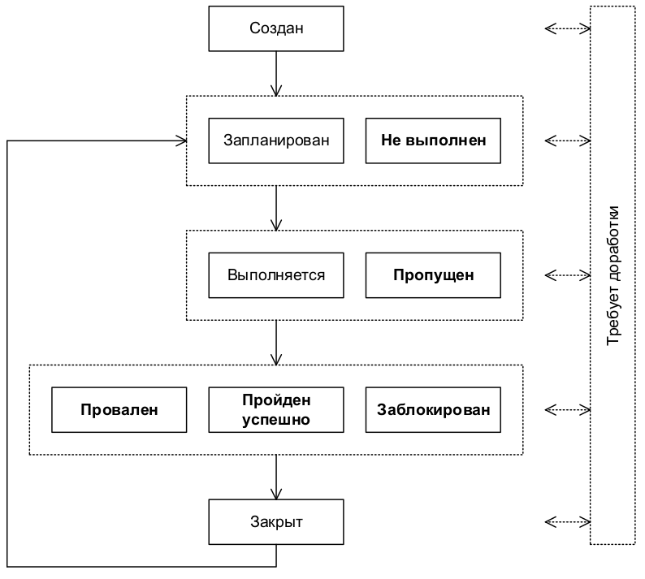
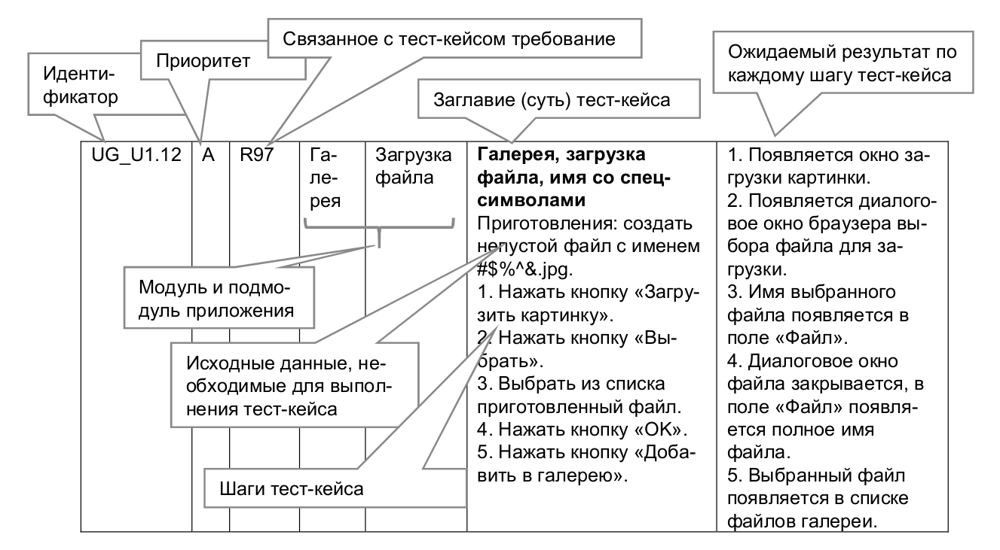

# Тестовые сценарии (Test case), тестовые варианты. Оформление результатов тестирования.

## ТЕРМИНОЛОГИЯ И ОБЩИЕ СВЕДЕНИЯ

Для начала определимся с терминологией, поскольку здесь есть много путаницы, вызванной разными переводами англоязычных терминов на русский язык и разными традициями в тех или иных странах, фирмах и отдельных командах.

Во главе всего лежит термин «тест». Официальное определение звучит так.

**Тест** — набор из одного или нескольких тест-кейсов.

Поскольку среди всех прочих терминов этот легче и быстрее всего произносить, в зависимости от контекста под ним могут понимать и отдельный пункт чек-листа, и отдельный шаг в тест-кейсе, и сам тест-кейс, и набор тест-кейсов и... продолжать можно долго. Главное здесь одно: если вы слышите или видите слово «тест», воспринимайте его в контексте.

Теперь рассмотрим самый главный для нас термин — «тест-кейс».

**Тест-кейс** — набор входных данных, условий выполнения и ожидаемых
результатов, разработанный с целью проверки того или иного свойства или поведения программного средства.

Под тест-кейсом также может пониматься соответствующий документ, представляющий формальную запись тест-кейса.

Мы ещё вернёмся к этой мысли, но уже сейчас критически важно понять и запомнить: если у тест-кейса не указаны входные данные, условия выполнения и ожидаемые результаты, и/или не ясна цель тест-кейса — это плохой тест-кейс (иногда он не имеет смысла, иногда его и
вовсе невозможно выполнить).

>Иногда термин «test case» на русский язык переводят как «тестовый случай». Это вполне адекватный перевод, но из-за того, что «тест-кейс» короче произносить, наибольшее распространение получил именно этот вариант.

**Высокоуровневый тест-кейс** — тест-кейс без конкретных входных дан-
ных и ожидаемых результатов.

Как правило, ограничивается общими идеями и операциями, схож по своей сути с подробно описанным пунктом чек-листа. Достаточно часто встречается в интеграционном тестировании и системном тестировании, а также на уровне дымового тестирования. Может служить отправной точкой для проведения исследовательского тестирования или для создания низкоуровневых тест-кейсов.

**Низкоуровневый тест-кейс** — тест-кейс с конкретными входными дан-
ными и ожидаемыми результатами.

Представляет собой «полностью готовый к выполнению» тест-кейс и вообще является наиболее классическим видом тест-кейсов. Начинающих тестировщиков чаще всего учат писать именно такие тесты, т.к. прописать все данные подробно — намного проще, чем понять, какой
информацией можно пренебречь, при этом не снизив ценность тест-кейса.

**Спецификация тест-кейса** — документ, описывающий набор
тест-кейсов (включая их цели, входные данные, условия и шаги выполнения, ожидаемые результаты) для тестируемого элемента.

**Спецификация теста** — документ, состоящий из спецификации тест-дизайна, спецификации тест-кейса и/или спецификации тест-процедуры.

**Тест-сценарий** — документ, описывающий последовательность действий по выполнению теста (также известен как «тест-скрипт»).

## ЦЕЛЬ НАПИСАНИЯ ТЕСТ-КЕЙСОВ

Тестирование можно проводить и без тест-кейсов (не нужно, но можно; да, эффективность такого подхода варьируется в очень широком диапазоне в зависимости от множества факторов).

Наличие же тест-кейсов позволяет:
* Структурировать и систематизировать подход к тестированию (без чего крупный проект почти гарантированно обречён на провал).
* Вычислять метрики тестового покрытия (test coverage 296 metrics) и принимать меры по его увеличению (тест-кейсы здесь являются главным источником информации, без которого существование подобных метрик теряет смысл).
* Отслеживать соответствие текущей ситуации плану (сколько примерно понадобится тест-кейсов, сколько уже есть, сколько выполнено из запланированного на данном этапе количества и т.д.).
* Уточнить взаимопонимание между заказчиком, разработчиками и тестировщиками (тест-кейсы зачастую намного более наглядно показывают поведение приложения, чем это отражено в требованиях).
* Хранить информацию для длительного использования и обмена опытом между сотрудниками и командами (или как минимум — не пытаться удержать в голове сотни страниц текста).
* Проводить регрессионное тестирование и повторное тестирование (которые без тест-кейсов было бы вообще невозможно выполнить).
* Повышать качество требований (мы это уже рассматривали: написание чек-листов и тест-кейсов — хорошая техника тестирования требований).
* Быстро вводить в курс дела нового сотрудника, недавно подключившегося к проекту.

## ЖИЗНЕННЫЙ ЦИКЛ ТЕСТ-КЕЙСА

В отличие от отчёта о дефекте, у которого есть полноценный развитый жизненный цикл, для тест-кейса речь скорее идёт о наборе состояний, в которых он может находиться (жирным шрифтом отмечены наиболее важные состояния).

    

* Создан — типичное начальное состояние практически любого артефакта. Тест-кейс автоматически переходит в это состояние после создания.
* Запланирован — в этом состоянии тест-кейс находится, когда он
или явно включён в план ближайшей итерации тестирования, или как минимум готов для выполнения.
* Не выполнен — в некоторых системах управления тест-кейсами это состояние заменяет собой предыдущее («запланирован»). Нахождение тест-кейса в данном состоянии означает, что он готов к выполнению, но ещё не был выполнен.
* Выполняется — если тест-кейс требует длительного времени на выполнение, он может быть переведён в это состояние для подчёркивания того факта, что работа идёт, и скоро можно ожидать её результатов. Если выполнение тест-кейса занимает мало времени, это состояние, как правило, пропускается, а тест-кейс сразу переводится в одно из трёх следующих состояний — «провален», «пройден успешно» или «заблокирован».
* Пропущен — бывают ситуации, когда выполнение тест-кейса отменяется по соображениям нехватки времени или изменения логики тестирования.
* Провален — данное состояние означает, что в процессе выполнения тест-кейса был обнаружен дефект, заключающийся в том, что ожидаемый результат по как минимум одному шагу тест-кейса не совпадает с фактическим результатом. Если в процессе выполнения тест-кейса был «случайно» обнаружен дефект, никак не связанный с шагами тест-кейса и их ожидаемыми результатами, тест-кейс считается пройденным успешно (при этом, естественно, по обнаруженному дефекту создаётся отчёт о дефекте).
* Пройден успешно — данное состояние означает, что в процессе выполнения тест-кейса не было обнаружено дефектов, связанных с расхождением ожидаемых и фактических результатов его шагов.
* Заблокирован — данное состояние означает, что по какой-то причине выполнение тест-кейса невозможно (как правило, такой причиной является наличие дефекта, не позволяющего реализовать некий пользовательский сценарий).
* Закрыт — очень редкий случай, т.к. тест-кейс, как правило, оставляют в состояниях «провален / пройден успешно / заблокирован / пропущен». В данное состояние в некоторых системах управления тест-кейс переводят, чтобы подчеркнуть тот факт, что на данной итерации тестирования все действия с ним завершены.
* Требует доработки — как видно из схемы, в это состояние (и из него) тест-кейс может быть преведён в любой момент времени, если в нём будет обнаружена ошибка, если изменятся требования, по которым он был написан, или наступит иная ситуация, не позволяющая считать тест-кейс пригодным для выполнения и перевода в иные состояния.

Ещё раз подчеркнём, что в отличие от жизненного цикла дефекта, который достаточно стандартизирован и формализован, для тест-кейса описанное выше носит общий рекомендательный характер, рассматривается скорее как разрозненный набор состояний (а не строгий жизненный цикл) и может сильно отличаться в разных компаниях (в связи с имеющимися традициями и/или возможностями систем управления тест-кейсами).

## Атрибуты (поля) тест-кейса.

Как уже было сказано выше, термин «тест-кейс» может относиться к формальной записи тест-кейса в виде технического документа. Эта запись имеет общепринятую структуру, компоненты которой называются атрибутами (полями) тест-кейса.

В зависимости от инструмента управления тест-кейсами внешний вид их записи может немного отличаться, могут быть добавлены или убраны отдельные поля, но концепция остаётся неизменной.

Общий вид всей структуры тест-кейса представлен ниже:

Теперь рассмотрим каждый атрибут подробно.

**Идентификатор** представляет собой уникальное значение, позволяющее однозначно отличить один тест-кейс от другого и используемое во всевозможных ссылках. В общем случае идентификатор тест-кейса может представлять собой просто уникальный номер, но (если
позволяет инструментальное средство управления тест-кейсами) может быть и куда сложнее: включать префиксы, суффиксы и иные осмысленные компоненты, позволяющие быстро определить цель тест-кейса и часть приложения (или требований), к которой он относится (например:
UR216_S12_DB_Neg).

**Приоритет** показывает важность тест-кейса. Он может быть выражен буквами (A, B, C, D, E), цифрами (1, 2, 3, 4, 5), словами («крайне высокий», «высокий», «средний», «низкий», «крайне низкий») или иным удобным способом. Количество градаций также не фиксировано, но чаще всего лежит в диапазоне от трёх до пяти.

Приоритет тест-кейса может коррелировать с:
* важностью требования, пользовательского сценария или функции, с которыми связан тест-кейс;
* потенциальной важностью дефекта, на поиск которого направлен тест-кейс;
* степенью риска, связанного с проверяемым тест-кейсом требованием, сценарием или функцией.

Основная задача этого атрибута — упрощение распределения внимания и усилий команды (более высокоприоритетные тест-кейсы получают их больше), а также упрощение планирования и принятия решения о том, чем можно пожертвовать в некоей форс-мажорной ситуации, не позволяющей выполнить все запланированные тест-кейсы.

**Связанное с тест-кейсом требование** показывает то основное требование, проверке выполнения которого посвящён тест-кейс (основное — потому, что один тест-кейс может затрагивать несколько требований). Наличие этого поля улучшает такое свойство тест-кейса,
как прослеживаемость.

Частые вопросы, связанные с заполнением этого поля, таковы:
* Можно ли его оставить пустым? Да. Тест-кейс вполне мог разрабатываться вне прямой привязки к требованиям, и (пока?) значение этого поля определить сложно. Хоть такой вариант и не считается хорошим, он достаточно распространён.
* Можно ли в этом поле указывать несколько требований? Да, но чаще всего стараются выбрать одно самое главное или «более высокоуровневое» (например, вместо того, чтобы перечислять R56.1, R56.2, R56.3 и т.д., можно просто написать R56). Чаще всего в инструментах управления тестами это поле представляет собой выпадающий список, где можно выбрать только одно значение, и этот вопрос становится неактуальным. К тому же многие тест-кейсы всё же направлены на проверку строго одного требования, и для них этот вопрос также неактуален.

**Модуль и подмодуль приложения** указывают на части приложения,
к которым относится тест-кейс, и позволяют лучше понять его цель.
Идея деления приложения на модули и подмодули проистекает из того, что в сложных системах практически невозможно охватить взглядом весь проект целиком, и вопрос «как протестировать это приложение» становится недопустимо сложным. Тогда приложение логически разде-
ляется на компоненты (модули), а те, в свою очередь, на более мелкие компоненты (подмодули).
И вот уже для таких небольших частей приложения придумать чек-листы и создать хорошие тест-кейсы становится намного проще.

Как правило, иерархия модулей и подмодулей создаётся как единый набор для всей проектной команды, чтобы исключить путаницу из-за того, что разные люди будут использовать разные подходы к такому разделению или даже просто разные названия одних и тех же частей приложения.

Теперь — самое сложное: как выбираются модули и подмодули. В реальности проще всего отталкиваться от архитектуры и дизайна приложения. Например, в уже знакомом нам приложении можно выделить такую иерархию модулей и подмодулей:
* Механизм запуска:
    * механизм анализа параметров;
    * механизм сборки приложения;
    * механизм обработки ошибочных ситуаций.

* Механизм взаимодействия с файловой системой:
    * механизм обхода дерева SOURCE_DIR;
    * механизм обработки ошибочных ситуаций.
* Механизм преобразования файлов:
    * механизм определения кодировок;
    * механизм преобразования кодировок;
    * механизм обработки ошибочных ситуаций.
* Механизм ведения журнала:
    * механизм записи журнала;
    * механизм отображения журнала в консоли;
    * механизм обработки ошибочных ситуаций.    

Согласитесь, что такие длинные названия с постоянно повторяющимся словом «механизм» читать и запоминать сложно. Перепишем:
* Стартер:
    * анализатор параметров;
    * сборщик приложения;
    * обработчик ошибок.
* Сканер:
    * обходчик;
    * обработчик ошибок.
* Преобразователь:
    * детектор;
    * конвертер;
    * обработчик ошибок.
* Регистратор:
    * дисковый регистратор;
    * консольный регистратор;
    * обработчик ошибок.    

Но что делать, если мы не знаем «внутренностей» приложения (или не очень разбираемся в программировании)? Модули и подмодули можно выделять на основе графического интерфейса пользователя (крупные области и элементы внутри них), на основе решаемых приложением
задач и подзадач и т.д. Главное, чтобы эта логика была одинаковым образом применена ко всему приложению.    

>Внимание! Частая ошибка! Модуль и подмодуль приложения — это НЕ действия, это именно структурные части, «куски» приложения. В заблуждение вас могут ввести такие названия, как, например, «печать, настройка принтера» (но здесь имеются в виду именно части приложения, отвечающие за печать и за настройку принтера (и названы
они отглагольными существительными), а не процесс печати или настройки принтера).
>
>Сравните (на примере человека): «дыхательная система, лёгкие» — это модуль и подмодуль, а «дыхание», «сопение», «чихание» — нет; «голова, мозг» — это модуль и подмодуль, а «кивание», «думание» — нет.

Наличие полей «Модуль» и «Подмодуль» улучшает такое свойство тест-кейса, как прослеживаемость.

**Заглавие тест-кейса** призвано упростить и ускорить понимание основной идеи (цели) тест-кейса без обращения к его остальным атрибутам. Именно это поле является наиболее информативным при просмотре списка тест-кейсов.

Сравните.

Плохо | Хорошо
---|---
Тест 1 | Запуск, одна копия, верные параметры
Тест 2 | Запуск одной копии с неверными путями
Тест 78 (улучшенный) | Запуск, много копий, без конфликтов
Остановка | Остановка по Ctrl+C
Закрытие | Остановка закрытием консоли

Заглавие тест-кейса может быть полноценным предложением, фразой, набором словосочетаний — главное, чтобы выполнялись следующие условия:
* Информативность.
* Хотя бы относительная уникальность (чтобы не путать разные тест-кейсы).

>Внимание! Частая ошибка! Если инструмент управления тест-кейсами не требует писать заглавие, его **всё равно надо писать**. Тест-кейсы без заглавий превращаются в мешанину информации, использование которой сопряжено с колоссальными и совершенно бессмысленными затратами.

И ещё одна небольшая мысль, которая может помочь лучше формулировать заглавия. В дословном переводе с английского «test case» обозначает «тестовый случай (ситуация)». Так вот, заглавие как раз и описывает этот случай (ситуацию), т.е. что происходит в тест-кейсе, какую
ситуацию он проверяет.

**Исходные данные, необходимые для выполнения тест-кейса**, позволяют описать всё то, что должно быть подготовлено до начала выполнения тест-кейса, например:
* Состояние базы данных.
* Состояние файловой системы и её объектов.
* Состояние серверов и сетевой инфраструктуры.

То, что описывается в этом поле, готовится БЕЗ использования тестируемого приложения, и таким образом, если здесь возникают проблемы, нельзя писать отчёт о дефекте в приложении.
Эта мысль очень и очень важна, потому поясним её простым жизненным примером. Представьте, что вы дегустируете конфеты. В поле «исходные данные» можно прописать «купить конфеты таких-то сортов в таком-то количестве». Если таких конфет нет в продаже, если закрыт магазин,
если не хватило денег и т. д. — всё это НЕ проблемы вкуса конфет, и нельзя писать отчёт о дефекте конфет вида «конфеты невкусные потому, что закрыт магазин».

>Некоторые авторы не следуют этой логике и допускают в приготовлениях работу с тестируемым приложением. И здесь нет «правильного варианта» — просто в одной традиции решено одним образом, в другой — другим. Во многом это — ещё и терминологическая проблема: «preparation», «initial data» и «setup» вполне логично выполнять без участия тестируемого приложения, в то время как «precondition» по смыслу ближе к описанию состояния тестируемого приложения. В реальной рабочей обстановке вам достаточно будет прочитать несколько тест-кейсов, уже созданных вашими коллегами,
чтобы понять, какой точки зрения на данный вопрос они придерживаются.

**Шаги тест-кейса** описывают последовательность действий, которые необходимо реализовать в процессе выполнения тест-кейса. Общие рекомендации по написанию шагов таковы:
* начинайте с понятного и очевидного места, не пишите лишних начальных шагов (запуск приложения, очевидные операции с интерфейсом и т. п.);
* даже если в тест-кейсе всего один шаг, нумеруйте его (иначе возрастает вероятность в будущем случайно «приклеить» описание этого шага к новому тексту);
* если вы пишете на русском языке, используйте безличную форму (например, «открыть», «ввести», «добавить» вместо «откройте», «введите», «добавьте»), в английском языке не надо использовать частицу «to» (т.е. «запустить приложение» будет «start application», не «to start application»);
* соотносите степень детализации шагов и их параметров с целью тест-кейса, его сложностью, уровнем и т. д. — в зависимости от этих и многих других факторов степень детализации может варьироваться от общих идей до предельно чётко прописанных значений и указаний;
* ссылайтесь на предыдущие шаги и их диапазоны для сокращения объёма текста (например, «повторить шаги 3–5 со значением...»);
* пишите шаги последовательно, без условных конструкций вида «если... то...».

>Внимание! Частая ошибка! Категорически запрещено ссылаться на шаги из других тест-кейсов и другие тест-кейсы целиком: если те, другие тест-кейсы будут изменены или удалены, ваш тест-кейс начнёт ссылаться на неверные данные или в пустоту, а если в процессе выполнения те, другие тест-кейсы или шаги приведут к возникновению
ошибки, вы не сможете закончить выполнение вашего тест-кейса.

**Ожидаемые результаты** по каждому шагу тест-кейса описывают реакцию
приложения на действия, описанные в поле «шаги тест-кейса». Номер шага соответствует номеру результата.

По написанию ожидаемых результатов можно порекомендовать следующее:
* описывайте поведение системы так, чтобы исключить субъективное толкование (например, «приложение работает верно» — плохо, «появляется окно с надписью...» — хорошо);
* пишите ожидаемый результат по всем шагам без исключения, если у вас есть хоть малейшие сомнения в том, что результат некоего шага будет совершенно тривиальным и очевидным (если вы всё же пропускаете ожидаемый результат для какого-то тривиального действия,
лучше оставить в списке ожидаемых результатов пустую строку — это облегчает восприятие);
* пишите кратко, но не в ущерб информативности;
* избегайте условных конструкций вида «если... то...».

>Внимание! Частая ошибка! В ожидаемых результатах ВСЕГДА описывается КОРРЕКТНАЯ работа приложения. Нет и не может быть ожидаемого результата в виде «приложение вызывает ошибку в операционной системе и аварийно завершается с потерей всех пользовательских данных».
>
>При этом корректная работа приложения вполне может предполагать отображение сообщений о неверных действиях пользователя или неких критических ситуациях. Так, сообщение «Невозможно сохранить файл по указанному пути: на целевом носителе недостаточно свободного места» — это не ошибка приложения, это его совершенно нормальная и правильная работа. Ошибкой приложения (в этой же ситуации) было бы
отсутствие такого сообщения, и/или повреждение, или потеря записываемых данных.

Для более глубокого понимания принципов оформления тест-кейсов рекомендуется прямо сейчас ознакомиться с главой «Типичные ошибки при разработке чек-листов, тест-кейсов и наборов тест-кейсов».

[//TODO вставить ссылку на эту главу]: _

## Свойства качественных тест-кейсов

Даже правильно оформленный тест-кейс может оказаться некачественным, если в нём нарушено одно из следующих свойств.

**Правильный технический язык, точность и единообразие формулировок**. Это свойство в равной мере относится и к требованиям, и к тест-кейсам, и к отчётам о дефектах — к любой до-
кументации. Основные идеи уже были описаны (см. главу «Атрибуты (поля) тест-кейсов»), а из самого общего и важного напомним и добавим:
* пишите лаконично, но понятно;
* используйте безличную форму глаголов (например, «открыть» вместо «откройте»);
* обязательно указывайте точные имена и технически верные названия элементов приложения;
* не объясняйте базовые принципы работы с компьютером (предполагается, что ваши коллеги знают, что такое, например, «пункт меню» и как с ним работать);
* везде называйте одни и те же вещи одинаково (например, нельзя в одном тест-кейсе некий режим работы приложения назвать «графическое представление», а в другом тот же режим — «визуальное отображение», т.к. многие люди могут подумать, что речь идёт о разных вещах);
* следуйте принятому на проекте стандарту оформления и написания тест-кейсов (иногда такие стандарты могут быть весьма жёсткими: вплоть до регламентации того, названия каких элементов должны быть приведены в двойных кавычках, а каких — в одинарных).

**Баланс между специфичностью и общностью**. Тест-кейс считается тем более специфичным, чем более детально в нём расписаны конкретные действия, конкретные значения и т. д., т. е. чем в нём больше конкретики. Соответственно, тест-кейс считается тем более общим, чем в нём меньше конкретики.

Рассмотрим поля «шаги» и «ожидаемые результаты» двух тест-кейсов (подумайте, какой тест-кейс вы бы посчитали хорошим, а какой — плохим и почему):

Тест-кейс 1:
Шаги | Ожидаемые результаты
---|---
**Конвертация из всех поддерживаемых кодировок** Приготовления: - Создать папки C:/A, C:/B, C:/C, C:/D. - Разместить в папке C:/D файлы 1.html, 2.txt, 3.md из прилагаемого архива. 1. Запустить приложение, выполнив команду `php converter.php c:/a c:/b c:/c/converter.log`. 2. Скопировать файлы 1.html, 2.txt, 3.md из папки C:/D в папку C:/A.  3. Остановить приложение нажатием Crtl+C.| 1. Отображается консольный журнал приложения с сообщением «текущее_время started, source dir c:/a, destination dir c:/b, log file c:/c/converter.log», в папке C:/C появляется файл converter.log, в котором появляется запись «текущее_время started, source dir c:/a, destination dir c:/b, log file c:/c/converter.log». 2. Файлы 1.html, 2.txt, 3.md появляются в папке C:/A, затем пропадают оттуда и появляются в папке C:/B. В консольном журнале и файле C:/C/converter.log появляются сообщения (записи) «текущее_время processing 1.html (KOI8-R)», «текущее_время processing 2.txt (CP-1251)», «текущее_время processing 3.md (CP-866)». 3. В файле C:/C/converter.log появляется запись «текущее_время closed». Приложение завершает работу.

Тест-кейс 2:
Шаги | Ожидаемые результаты
---|---
**Конвертация из всех поддерживаемых кодировок** 1. Выполнить конвертацию трёх файлов до пустимого размера в трёх разных кодировках всех трёх допустимых форматов. | 1. Файлы перемещаются в папку-приёмник, кодировка всех файлов меняется на UTF-8.

Если вернуться к вопросу «какой тест-кейс вы бы посчитали хорошим, а какой — плохим и почему», то ответ таков: оба тест-кейса плохие потому, что первый является слишком специфичным, а второй — слишком общим. Можно сказать, что здесь до абсурда доведены идеи низкоуровневых и высокоуровневых тест-кейсов.

Почему плоха излишняя специфичность (тест-кейс 1):
* при повторных выполнениях тест-кейса всегда будут выполняться строго одни и те же действия со строго одними и теми же данными, что снижает вероятность обнаружения ошибки;
* возрастает время написания, доработки и даже просто прочтения тест-кейса;
* в случае выполнения тривиальных действий опытные специалисты тратят дополнительные мыслительные ресурсы в попытках понять, что же они упустили из виду, т. к. они привыкли, что так описываются только самые сложные и неочевидные ситуации.

Почему плоха излишняя общность (тест-кейс 2):
* тест-кейс сложен для выполнения начинающими тестировщиками или даже опытными специалистами, лишь недавно подключившимися к проекту;
* недобросовестные сотрудники склонны халатно относиться к таким тест-кейсам;
* тестировщик, выполняющий тест-кейс, может понять его иначе, чем было задумано автором (и в итоге будет выполнен фактически совсем другой тест-кейс).

Выход из этой ситуации состоит в том, чтобы придерживаться золотой середины (хотя, конечно же, какие-то тесты будут чуть более специфичными, какие-то — чуть более общими).

Вот пример такого срединного подхода:

Тест-кейс 3:

Шаги | Ожидаемые результаты
---|---
**Конвертация из всех поддерживаемых кодировок** Приготовления: - Создать в корне любого диска четыре отдельные папки для входных файлов, выходных файлов, файла журнала и временного хранения тестовых файлов. - Распаковать содержимое прилагаемого архива в папку для временного хранения тестовых файлов. 1. Запустить приложение, указав в параметрах соответствующие пути из приготовления к тесту (имя файла журнала — произвольное). 2. Скопировать файлы из папки для временного хранения в папку для входных файлов. 3. Остановить приложение.| 1. Приложение запускается и выводит сообщение о своём запуске в консоль и файл журнала. 2. Файлы из папки для входных файлов перемещаются в папку для выходных файлов, в консоли и файле журнала отображаются сообщения о конвертации каждого из файлов с указанием его исходной кодировки. 3. Приложение выводит сообщение о завершении работы в файл журнала и завершает работу.

В этом тест-кейсе есть всё необходимое для понимания и выполнения, но при этом он стал короче и проще для выполнения, а отсутствие строго указанных значений приводит к тому, что
при многократном выполнении тест-кейса (особенно — разными тестировщиками) конкретные параметры будут менять свои значения, что увеличивает вероятность обнаружения ошибки.

Ещё раз главная мысль: сами по себе специфичность или общность тест-кейса не являются чем-то плохим, но резкий перекос в ту или иную сторону снижает качество тест-кейса.

**Баланс между простотой и сложностью.** Здесь не существует академических определений, но принято считать, что простой тест-кейс оперирует одним объектом (или в нём явно виден
главный объект), а также содержит небольшое количество тривиальных действий; сложный тест-кейс оперирует несколькими равноправными объектами и содержит много нетривиальных
действий.

Преимущества простых тест-кейсов:
* их можно быстро прочесть, легко понять и выполнить;
* они понятны начинающим тестировщикам и новым людям на проекте;
* они делают наличие ошибки очевидным (как правило, в них предполагается выполнение повседневных тривиальных действий, проблемы с которыми видны невооружённым взглядом и не вызывают дискуссий);
* они упрощают начальную диагностику ошибки, т.к. сужают круг поиска.

Преимущества сложных тест-кейсов:
* при взаимодействии многих объектов повышается вероятность возникновения ошибки;
* пользователи, как правило, используют сложные сценарии, а потому сложные тесты более полноценно эмулируют работу пользователей;
* программисты редко проверяют такие сложные случаи (и они совершенно не обязаны это делать).

Рассмотрим примеры.

[//TODO дописать - тема нужная]: _

# Шаблон тестового сценария по стандартам WorldSkills (демо-экзамен) с комментариями

>Для выполнения процедуры тестирования удаления товаров Вам нужно описать пять сценариев.
>
>Удаление может быть выполнимо, а может быть отклонено согласно требованиям предметной области.
>
>Необходимо, чтобы варианты тестирования демонстрировали различные исходы работы алгоритма. Для описания тестовых сценариев в ресурсах предоставлен шаблон `testing-template.docx` (есть в этом репозитории в каталоге `docs`).

### Расшифровка тестовых информационных полей:

Поле | Описание
---|---
Название проекта | Название тестируемого проекта
Рабочая версия | Версия проекта/программного обеспечения (первый тест считается 1.0).
Имя тестирующего | Имя того, кто проводил тесты
Дата(ы) теста | Дата(ы) проведения тестов – это один или несколько дней. Если тесты проводились в более протяженный период времени, нужно отметить отдельную дату для каждого теста. 
Тестовый пример # | Уникальный ID для каждого тестового примера.  Следуйте некоторым конвенциям, чтобы указать типы тестов. Например,‘TC_UI_1′ означает‘user interface test case #1′ ( ТС_ПИ_1: тестовый случай пользовательского интерфейса#1)
Приоритет тестирования *(Низкий/Средний/Высокий)* | Насколько важен каждый тест. Приоритет тестирования для бизнес-правил и функциональных тестовых случаев может быть средним или высоким, в то время как незначительные случаи пользовательского интерфейса могут иметь низкий приоритет. 
Заголовок/название теста | Название тестового случая. Например, Подтвердите страницу авторизации с действительным именем пользователя и паролем.  
Краткое изложение теста | Описание того, что должен достичь тест. 
Этапы теста | Перечислите все этапы теста подробно. Запишите этапы теста в том порядке, в котором они должны быть реализованы. Предоставьте как можно больше подробностей и разъяснений. Пронумерованный список – хорошая идея. 
Тестовые данные | Перечислите/опишите все тестовые данные, используемые для данного тестового случая. Так, фактические используемые входные данные можно отслеживать по результатам тестирования.  Например, Имя пользователя и пароль для подтверждения входа. 
Ожидаемый результат | Каким должен быть вывод системы после выполнения теста? Подробно опишите ожидаемый результат, включая все сообщения/ошибки, которые должны отображаться на экране. 
Фактический результат | Каким должен быть фактический результат после выполнения теста? Опишите любое релевантное поведение системы после выполнения теста. 
Предварительное условие | Любые предварительные условия, которые должны быть выполнены до выполнения теста. Перечислите все предварительные условия для выполнения этого тестового случая. 
Постусловие | Каким должно быть состояние системы после выполнения теста? 
Статус  *(Зачет/Незачет)* | Если фактический результат не соответствует ожидаемому результату, отметьте тест как неудачный. В ином случае обновление пройдено. 
Примечания/комментарии | Используйте эту область для любых дополнительных заметок/комментариев/вопросов. Эта область предназначена для поддержки вышеуказанных полей (например, если есть некоторые особые условия, которые не могут быть описаны в любом из вышеуказанных полей, или если есть вопросы, связанные с ожидаемыми или фактическими результатами). 

## Аннотация теста

&nbsp;|&nbsp;| Мои комментарии
---|---|---
Название проекта | DoeduSam |
Рабочая версия | 1.0 | Эту версию не плохо бы вписать в свойства проекта
Имя тестирующего | DEMO_xx | 
Дата(ы) теста | 21.12.2020 | текущая

### Тестовый пример #1:

&nbsp;|&nbsp;| Мои комментарии
---|---|---
Тестовый пример # | TC_DP_1 | расшифровывается: TestCase_DeleteProduct_x
Приоритет тестирования | средний | бизнес-правило
Заголовок/название теста | Удаление товара без продаж и дополнительных товаров |
Краткое изложение теста | Товар должен без ошибок удалиться из таблицы товаров |
Этапы теста | 1. Очистить таблицы продаж, дополнительных товаров, дополнительных картинок и товаров. 2. Добавить тестовый товар в таблицу **Products** 3. Вызвать метод удаления товара 4. Проверить наличие удаленной записи в таблице |
Тестовые данные | Название: *Моторное масло Motor Oil KE900-90042-R* Изображение: *Товары автосервиса\8FE07916.jpg* Производитель: *Nissan* Активен: *да* Цена: *2060* | Тут нужно вставить содержимое любой записи из *products_a_import*
Ожидаемый результат | Запись должна быть удалена из таблицы без ошибок и исключений |
Фактический результат | Запись удалена | 
Статус | зачет | 
Предварительное условие | В базу должны быть загружен тестовый продукт |
Постусловие | Таблица товаров должна быть пустой |
Примечания/комментарии | Т.к. мы добавили только товар без продаж и дополнительных товаров, то ошибок в принципе быть не может ни по вине кода ни по ограничениям базы | 

## Что еще можно проверить

* **№2** - удаление товара с дополнительными товарами. Если ограничения настроены правильно (каскадное удаление), то тоже долно удаляться нормально.

* **№3** - удаление товара с дополнительными картинками. Аналогично №2.

* **№4** - удаление товара с продажами. Вариант без предварительной проверки - база должна вернуть ошибку, приложение это исключение должно перехватить и выдать сообщение, что удалять нельзя.

* **№5** - удаление товара с продажами. Вариант с предварительной проверкой - в коде нужно проверить есть ли у товара продажи и при наличии продаж вывести сообщение, что удалять товар нельзя.
