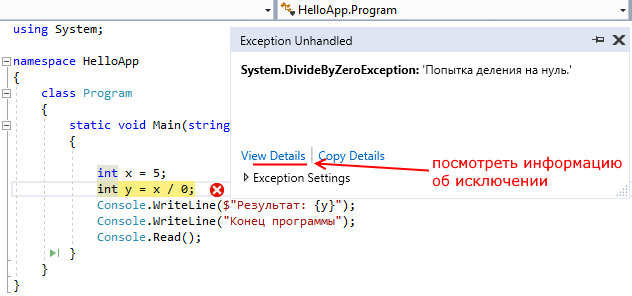
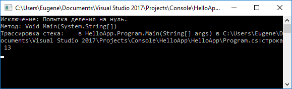
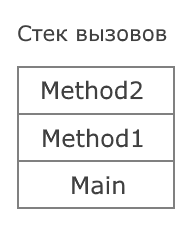

# Обработка исключительных ситуаций. Методы и способы идентификации сбоев и ошибок.

## Конструкция try..catch..finally

[Метанит]: https://metanit.com/sharp/tutorial/2.14.php

Иногда при выполнении программы возникают ошибки, которые трудно предусмотреть или предвидеть, а иногда и вовсе невозможно. Например, при передачи файла по сети может неожиданно оборваться сетевое подключение. такие ситуации называются **исключениями**. Язык C# предоставляет разработчикам возможности для обработки таких ситуаций. Для этого в C# предназначена конструкция **try...catch...finally**.

```cs
try
{
     
}
catch
{
     
}
finally
{
     
}
```

При использовании блока **try...catch..finally** вначале **пытаются** выполниться инструкции в блоке **try**. Если в этом блоке не возникло исключений, то после его выполнения начинает выполняться блок finally. И затем конструкция try..catch..finally завершает свою работу.

Если же в блоке try вдруг возникает исключение, то обычный порядок выполнения останавливается, и среда CLR (Common Language Runtime) начинает искать блок **catch**, который может обработать данное исключение. Если нужный блок catch найден, то он выполняется, и после его завершения выполняется блок finally.

Если нужный блок catch не найден, то при возникновении исключения программа аварийно завершает свое выполнение.

Рассмотрим следующий пример:

```cs
class Program
{
    static void Main(string[] args)
    {
        int x = 5;
        int y = x / 0;
        Console.WriteLine($"Результат: {y}");
        Console.WriteLine("Конец программы");
        Console.Read();
    }
}
```

В данном случае происходит деление числа на 0, что приведет к генерации исключения. И при запуске приложения в режиме отладки мы увидим в *Visual Studio* окошко, которое информирует об исключении:



В этом окошке мы видим, что возникло исключение, которое представляет тип *System.DivideByZeroException*, то есть попытка деления на ноль. С помощью пункта *View Details* можно посмотреть более детальную информацию об исключении.

И в этом случае единственное, что нам остается, это завершить выполнение программы.

Чтобы избежать подобного аварийного завершения программы, следует использовать для обработки исключений конструкцию try...catch...finally. Так, перепишем пример следующим образом:

```cs
class Program
{
    static void Main(string[] args)
    {
        try
        {
            int x = 5;
            int y = x / 0;
            Console.WriteLine($"Результат: {y}");
        }
        catch
        {
            Console.WriteLine("Возникло исключение!");
        }
        finally
        {
            Console.WriteLine("Блок finally");
        }
        Console.WriteLine("Конец программы");
        Console.Read();
    }
}
```

В данном случае у нас опять же возникнет исключение в блоке try, так как мы пытаемся разделить на ноль. И дойдя до строки

```cs
int y = x / 0;
```

выполнение программы остановится. CLR найдет блок catch и передаст управление этому блоку.

После блока catch будет выполняться блок finally.

```
Возникло исключение!
Блок finally
Конец программы
```

Таким образом, программа по-прежнему не будет выполнять деление на ноль и соответственно не будет выводить результат этого деления, но теперь она не будет аварийно завершаться, а исключение будет обрабатываться в блоке catch.

Следует отметить, что в этой конструкции обязателен блок try. При наличии блока catch мы можем опустить блок finally:

```cs
try
{
    int x = 5;
    int y = x / 0;
    Console.WriteLine($"Результат: {y}");
}
catch
{
    Console.WriteLine("Возникло исключение!");
}
```

И, наоборот, при наличии блока finally мы можем опустить блок catch и не обрабатывать исключение:

```cs
try
{
    int x = 5;
    int y = x / 0;
    Console.WriteLine($"Результат: {y}");
}
finally
{
    Console.WriteLine("Блок finally");
}
```

Однако, хотя с точки зрения синтаксиса C# такая конструкция вполне корректна, тем не менее, поскольку CLR не сможет найти нужный блок catch, то исключение не будет обработано, и программа аварийно завершится.

### Обработка исключений и условные конструкции

Ряд исключительных ситуаций может быть предвиден разработчиком. Например, пусть программа предусматривает ввод числа и вывод его квадрата:

```cs
static void Main(string[] args)
{
    Console.WriteLine("Введите число");
    int x = Int32.Parse(Console.ReadLine());
 
    x *= x;
    Console.WriteLine("Квадрат числа: " + x);
    Console.Read();
}
```

Если пользователь введет не число, а строку, какие-то другие символы, то программа выпадет в ошибку. С одной стороны, здесь как раз та ситуация, когда можно применить блок try..catch, чтобы обработать возможную ошибку. Однако гораздо оптимальнее было бы проверить допустимость преобразования:

```cs
static void Main(string[] args)
{
    Console.WriteLine("Введите число");
    int x;
    string input = Console.ReadLine();
    if (Int32.TryParse(input, out x))
    {
        x *= x;
        Console.WriteLine("Квадрат числа: " + x);
    }
    else
    {
        Console.WriteLine("Некорректный ввод");
    }
    Console.Read();
}
```

Метод Int32.TryParse() возвращает true, если преобразование можно осуществить, и false - если нельзя. При допустимости преобразования переменная x будет содержать введенное число. Так, не используя try...catch можно обработать возможную исключительную ситуацию.

С точки зрения производительности использование блоков try..catch более накладно, чем применение условных конструкций. Поэтому по возможности вместо try..catch лучше использовать условные конструкции на проверку исключительных ситуаций.

## Блок catch и фильтры исключений

### Определение блока catch

За обработку исключения отвечает блок catch, который может иметь следующие формы:

* Обрабатывает любое исключение, которое возникло в блоке try. Выше уже был продемонстрирован пример подобного блока.
    ```cs
    catch
    {
        // выполняемые инструкции
    }
    ```

* Обрабатывает только те исключения, которые соответствуют типу, указаному в скобках после оператора catch.

    ```cs
    catch (тип_исключения)
    {
        // выполняемые инструкции
    }
    ```

    Например, обработаем только исключения типа DivideByZeroException:

    ```cs
    try
    {
        int x = 5;
        int y = x / 0;
        Console.WriteLine($"Результат: {y}");
    }
    catch(DivideByZeroException)
    {
        Console.WriteLine("Возникло исключение DivideByZeroException");
    }
    ```

    Однако если в блоке try возникнут исключения каких-то других типов, отличных от DivideByZeroException, то они не будут обработаны.

* Обрабатывает только те исключения, которые соответствуют типу, указаному в скобках после оператора catch. А вся информация об исключении помещается в переменную данного типа. 

    ```cs
    catch (тип_исключения имя_переменной)
    {
        // выполняемые инструкции
    }
    ```

    Например:

    ```cs
    try
    {
        int x = 5;
        int y = x / 0;
        Console.WriteLine($"Результат: {y}");
    }
    catch(DivideByZeroException ex)
    {
        Console.WriteLine($"Возникло исключение {ex.Message}");
    }
    ```

    Фактически этот случай аналогичен предыдущему за тем исключением, что здесь используется переменная. В данном случае в переменную ex, которая представляет тип DivideByZeroException, помещается информация о возникшем исключени. И с помощью свойства Message мы можем получить сообщение об ошибке.

    Если нам не нужна информация об исключении, то переменную можно не использовать как в предыдущем случае.

### Фильтры исключений

Фильтры исключений позволяют обрабатывать исключения в зависимости от определенных условий. Для их применения после выражения catch идет выражение when, после которого в скобках указывается условие:

```cs
catch when(условие)
{
     
}
```

В этом случае обработка исключения в блоке catch производится только в том случае, если условие в выражении when истинно. Например:

```cs
int x = 1;
int y = 0;
 
try
{
    int result = x / y;
}
catch(DivideByZeroException) when (y==0 && x == 0)
{
    Console.WriteLine("y не должен быть равен 0");
}
catch(DivideByZeroException ex)
{
    Console.WriteLine(ex.Message);
}
```

В данном случае будет выброшено исключение, так как y=0. Здесь два блока catch, и оба они обрабатывают исключения типа DivideByZeroException, то есть по сути все исключения, генерируемые при делении на ноль. Но поскольку для первого блока указано условие y == 0 && x == 0, то оно не будет обрабатывать исключение - условие, указанное после оператора when возвращает false. Поэтому CLR будет дальше искать соответствующие блоки catch далее и для обработки исключения выберет второй блок catch. В итоге если мы уберем второй блок catch, то исключение вобще не будет обрабатываться.

## Типы исключений. Класс Exception

Базовым для всех типов исключений является тип **Exception**. Этот тип определяет ряд свойств, с помощью которых можно получить информацию об исключении.

* InnerException: хранит информацию об исключении, которое послужило причиной текущего исключения

* Message: хранит сообщение об исключении, текст ошибки

* Source: хранит имя объекта или сборки, которое вызвало исключение

* StackTrace: возвращает строковое представление стека вызывов, которые привели к возникновению исключения

* TargetSite: возвращает метод, в котором и было вызвано исключение

Например, обработаем исключения типа Exception:

```cs
static void Main(string[] args)
{
    try
    {
        int x = 5;
        int y = x / 0;
        Console.WriteLine($"Результат: {y}");
    }
    catch (Exception ex)
    {
        Console.WriteLine($"Исключение: {ex.Message}");
        Console.WriteLine($"Метод: {ex.TargetSite}");
        Console.WriteLine($"Трассировка стека: {ex.StackTrace}");
    }
 
    Console.Read();
}
```



Однако так как тип Exception является базовым типом для всех исключений, то выражение catch (Exception ex) будет обрабатывать все исключения, которые могут возникнуть.

Но также есть более специализированные типы исключений, которые предназначены для обработки каких-то определенных видов исключений. Их довольно много, я приведу лишь некоторые:

* **DivideByZeroException**: представляет исключение, которое генерируется при делении на ноль

* **ArgumentOutOfRangeException**: генерируется, если значение аргумента находится вне диапазона допустимых значений

* **ArgumentException**: генерируется, если в метод для параметра передается некорректное значение

* **IndexOutOfRangeException**: генерируется, если индекс элемента массива или коллекции находится вне диапазона допустимых значений

* **InvalidCastException**: генерируется при попытке произвести недопустимые преобразования типов

* **NullReferenceException**: генерируется при попытке обращения к объекту, который равен null (то есть по сути неопределен)

И при необходимости мы можем разграничить обработку различных типов исключений, включив дополнительные блоки catch:

```cs
static void Main(string[] args)
{
    try
    {
        int[] numbers = new int[4];
        numbers[7] = 9;     // IndexOutOfRangeException
 
        int x = 5;
        int y = x / 0;  // DivideByZeroException
        Console.WriteLine($"Результат: {y}");
    }
    catch (DivideByZeroException)
    {
        Console.WriteLine("Возникло исключение DivideByZeroException");
    }
    catch (IndexOutOfRangeException ex)
    {
        Console.WriteLine(ex.Message);
    }
             
    Console.Read();
}
```

В данном случае блоки catch обрабатывают исключения типов IndexOutOfRangeException, DivideByZeroException и Exception. Когда в блоке try возникнет исключение, то CLR будет искать нужный блок catch для обработки исключения. Так, в данном случае на строке

```cs
numbers[7] = 9;
```

происходит обращение к 7-му элементу массива. Однако поскольку в массиве только 4 элемента, то мы получим исключение типа IndexOutOfRangeException. CLR найдет блок catch, который обрабатывает данное исключение, и передаст ему управление.

Следует отметить, что в данном случае в блоке try есть ситуация для генерации второго исключения - деление на ноль. Однако поскольку после генерации IndexOutOfRangeException управление переходит в соответствующий блок catch, то деление на ноль `int y = x / 0` в принципе не будет выполняться, поэтому исключение типа DivideByZeroException никогда не будет сгенерировано.

Однако рассмотрим другую ситуацию:

```cs
static void Main(string[] args)
{
    try
    {
        object obj = "you";
        int num = (int)obj;     // InvalidCastException
        Console.WriteLine($"Результат: {num}");
    }
    catch (DivideByZeroException)
    {
        Console.WriteLine("Возникло исключение DivideByZeroException");
    }
    catch (IndexOutOfRangeException)
    {
        Console.WriteLine("Возникло исключение IndexOutOfRangeException");
    }
             
    Console.Read();
}
```

В данном случае в блоке try генерируется исключение типа InvalidCastException, однако соответствующего блока catch для обработки данного исключения нет. Поэтому программа аварийно завершит свое выполнение.

Мы также можем определить для InvalidCastException свой блок catch, однако суть в том, что теоретически в коде могут быть сгенерированы сами различные типы исключений. А определять для всех типов исключений блоки catch, если обработка исключений однотипна, не имеет смысла. И в этом случае мы можем определить блок catch для базового типа Exception:

```cs
static void Main(string[] args)
{
    try
    {
        object obj = "you";
        int num = (int)obj;     // InvalidCastException
        Console.WriteLine($"Результат: {num}");
    }
    catch (DivideByZeroException)
    {
        Console.WriteLine("Возникло исключение DivideByZeroException");
    }
    catch (IndexOutOfRangeException)
    {
        Console.WriteLine("Возникло исключение IndexOutOfRangeException");
    }
    catch (Exception ex)
    {
        Console.WriteLine($"Исключение: {ex.Message}");
    }  
    Console.Read();
}
```

И в данном случае блок `catch (Exception ex){}` будет обрабатывать все исключения кроме DivideByZeroException и IndexOutOfRangeException. При этом блоки catch для более общих, более базовых исключений следует помещать в конце - после блоков catch для более конкретный, специализированных типов. Так как CLR выбирает для обработки исключения первый блок catch, который соответствует типу сгенерированного исключения. Поэтому в данном случае сначала обрабатывается исключение DivideByZeroException и IndexOutOfRangeException, и только потом Exception (так как DivideByZeroException и IndexOutOfRangeException наследуется от класса Exception).

## Создание классов исключений

Если нас не устраивают встроенные типы исключений, то мы можем создать свои типы. Базовым классом для всех исключений является класс Exception, соответственно для создания своих типов мы можем унаследовать данный класс.

Допустим, у нас в программе будет ограничение по возрасту:

```cs
class Program
{
    static void Main(string[] args)
    {
        try
        {
            Person p = new Person { Name = "Tom", Age = 17 };
        }
        catch (Exception ex)
        {
            Console.WriteLine($"Ошибка: {ex.Message}");
        }
        Console.Read();
    }
}
class Person
{
    private int age;
    public string Name { get; set; }
    public int Age
    {
        get { return age; }
        set
        {
            if (value < 18)
            {
                throw new Exception("Лицам до 18 регистрация запрещена");
            }
            else
            {
                age = value;
            }
        }
    }
}
```

В классе Person при установке возраста происходит проверка, и если возраст меньше 18, то выбрасывается исключение. Класс Exception принимает в конструкторе в качестве параметра строку, которое затем передается в его свойство Message.

Но иногда удобнее использовать свои классы исключений. Например, в какой-то ситуации мы хотим обработать определенным образом только те исключения, которые относятся к классу Person. Для этих целей мы можем сделать специальный класс PersonException:

```cs
class PersonException : Exception
{
    public PersonException(string message)
        : base(message)
    { }
}
```

По сути класс кроме пустого конструктора ничего не имеет, и то в конструкторе мы просто обращаемся к конструктору базового класса Exception, передавая в него строку message. Но теперь мы можем изменить класс Person, чтобы он выбрасывал исключение именно этого типа и соответственно в основной программе обрабатывать это исключение:

```cs
class Program
{
    static void Main(string[] args)
    {
        try
        {
            Person p = new Person { Name = "Tom", Age = 17 };
        }
        catch (PersonException ex)
        {
            Console.WriteLine("Ошибка: " + ex.Message);
        }
        Console.Read();
    }
}
class Person
{
    private int age;
    public int Age
    {
        get { return age; }
        set
        {
            if (value < 18)
                throw new PersonException("Лицам до 18 регистрация запрещена");
            else
                age = value;
        }
    }
}
```

Однако необязательно наследовать свой класс исключений именно от типа Exception, можно взять какой-нибудь другой производный тип. Например, в данном случае мы можем взять тип ArgumentException, который представляет исключение, генерируемое в результате передачи аргументу метода некорректного значения:

```cs
class PersonException : ArgumentException
{
    public PersonException(string message)
        : base(message)
    { }
}
```

Каждый тип исключений может определять какие-то свои свойства. Например, в данном случае мы можем определить в классе свойство для хранения устанавливаемого значения:

```cs
class PersonException : ArgumentException
{
    public int Value { get;}
    public PersonException(string message, int val)
        : base(message)
    {
        Value = val;
    }
}
```

В конструкторе класса мы устанавливаем это свойство и при обработке исключения мы его можем получить:

```cs
class Person
{
    public string Name { get; set; }
    private int age;
    public int Age
    {
        get { return age; }
        set
        {
            if (value < 18)
                throw new PersonException("Лицам до 18 регистрация запрещена", value);
            else
                age = value;
        }
    }
}
class Program
{
    static void Main(string[] args)
    {
        try
        {
            Person p = new Person { Name = "Tom", Age = 13 };
        }
        catch (PersonException ex)
        {
            Console.WriteLine($"Ошибка: {ex.Message}");
            Console.WriteLine($"Некорректное значение: {ex.Value}");
        }
        Console.Read();
    }
}
```

## Поиск блока catch при обработке исключений

Если код, который вызывает исключение, не размещен в блоке try или помещен в конструкцию try..catch, которая не содержит соответствующего блока catch для обработки возникшего исключения, то система производит поиск соответствующего обработчика исключения в стеке вызовов.

Например, рассмотрим следующую программу:

```cs
using System;
 
namespace HelloApp
{
    class Program
    {
        static void Main(string[] args)
        {
            try
            {
                TestClass.Method1();
            }
            catch (DivideByZeroException ex)
            {
                Console.WriteLine($"Catch в Main : {ex.Message}");
            }
            finally
            {
                Console.WriteLine("Блок finally в Main");
            }
            Console.WriteLine("Конец метода Main");
            Console.Read();
        }
    }
    class TestClass
    {
        public static void Method1()
        {
            try
            {
                Method2();
            }
            catch (IndexOutOfRangeException ex)
            {
                Console.WriteLine($"Catch в Method1 : {ex.Message}");
            }
            finally
            {
                Console.WriteLine("Блок finally в Method1");
            }
            Console.WriteLine("Конец метода Method1");
        }
        static void Method2()
        {
            try
            {
                int x = 8;
                int y = x / 0;
            }
            finally
            {
                Console.WriteLine("Блок finally в Method2");
            }
            Console.WriteLine("Конец метода Method2");
        }
    }
}
```

В данном случае стек вызовов выглядит следующим образом: метод Main вызывает метод Method1, который, в свою очередь, вызывает метод Method2. И в методе Method2 генерируется исключение DivideByZeroException. Визуально стек вызовов можно представить следующим образом:



Внизу стека метод Main, с которого началось выполнение, и на самом верху метод Method2.

Что будет происходить в данном случае при генерации исключения?

1. Метод Main вызывает метод Method1, а тот вызывает метод Method2, в котором генерируется исключение DivideByZeroException.

2. Система видит, что код, который вызывал исключение, помещен в конструкцию try..catch

    ```cs
    try
    {
        int x = 8;
        int y = x / 0;
    }
    finally
    {
        Console.WriteLine("Блок finally в Method2");
    }
    ```
    Система ищет в этой конструкции блок catch, который обрабатывает исключение DivideByZeroException. Однако такого блока catch нет.

3. Система опускается в стеке вызовов в метод Method1, который вызывал Method2. Здесь вызов Method2 помещен в конструкцию try..catch

    ```cs
    try
    {
        Method2();
    }
    catch (IndexOutOfRangeException ex)
    {
        Console.WriteLine($"Catch в Method1 : {ex.Message}");
    }
    finally
    {
        Console.WriteLine("Блок finally в Method1");
    }
    ```

    Система также ищет в этой конструкции блок catch, который обрабатывает исключение DivideByZeroException. Однако здесь также подобный блок catch отсутствует.

4. Система далее опускается в стеке вызовов в метод Main, который вызывал Method1. Здесь вызов Method1 помещен в конструкцию try..catch

    ```cs
    try
    {
        TestClass.Method1();
    }
    catch (DivideByZeroException ex)
    {
        Console.WriteLine($"Catch в Main : {ex.Message}");
    }
    finally
    {
        Console.WriteLine("Блок finally в Main");
    }
    ```
    Система снова ищет в этой конструкции блок catch, который обрабатывает исключение DivideByZeroException. И в данном случае ткой блок найден.

5. Система наконец нашла нужный блок catch в методе Main, для обработки исключения, которое возникло в методе Method2 - то есть к начальному методу, где непосредственно возникло исключение. Но пока данный блок catch НЕ выполняется. Система поднимается обратно по стеку вызовов в самый верх в метод Method2 и выполняет в нем блок finally:

    ```cs
    finally
    {
        Console.WriteLine("Блок finally в Method2");
    }
    ```

6. Далее система возвращается по стеку вызовов вниз в метод Method1 и выполняет в нем блок finally:

    ```cs
    finally
    {
        Console.WriteLine("Блок finally в Method1");
    }
    ```

7. Затем система переходит по стеку вызовов вниз в метод Main и выполняет в нем найденный блок catch и последующий блок finally:

    ```cs
    catch (DivideByZeroException ex)
    {
        Console.WriteLine($"Catch в Main : {ex.Message}");
    }
    finally
    {
        Console.WriteLine("Блок finally в Main");
    }
    ```
8. Далее выполняется код, который идет в методе Main после конструкции try..catch:

    ```cs
    Console.WriteLine("Конец метода Main");
    ```

    Стоит отметить, что код, который идет после конструкции try...catch в методах Method1 и Method2, не выполняется, потому что обработчик исключения найден именно в методе Main.

Консольный вывод программы:

```
Блок finally в Method2
Блок finally в Method1
Catch в Main: Попытка деления на нуль.
Блок finally в Main
Конец метода Main
```

## Генерация исключения и оператор throw

Обычно система сама генерирует исключения при определенных ситуациях, например, при делении числа на ноль. Но язык C# также позволяет генерировать исключения вручную с помощью оператора throw. То есть с помощью этого оператора мы сами можем создать исключение и вызвать его в процессе выполнения.

Например, в нашей программе происходит ввод строки, и мы хотим, чтобы, если длина строки будет больше 6 символов, возникало исключение:

```cs
static void Main(string[] args)
{
    try
    {
        Console.Write("Введите строку: ");
        string message = Console.ReadLine();
        if (message.Length > 6)
        {
            throw new Exception("Длина строки больше 6 символов");
        }
    }
    catch (Exception e)
    {
        Console.WriteLine($"Ошибка: {e.Message}");
    }
    Console.Read();
}
```

После оператора throw указывается объект исключения, через конструктор которого мы можем передать сообщение об ошибке. Естественно вместо типа Exception мы можем использовать объект любого другого типа исключений.

Затем в блоке catch сгенерированное нами исключение будет обработано.

Подобным образом мы можем генерировать исключения в любом месте программы. Но существует также и другая форма использования оператора throw, когда после данного оператора не указывается объект исключения. В подобном виде оператор throw может использоваться только в блоке catch:

```cs
try
{
    try
    {
        Console.Write("Введите строку: ");
        string message = Console.ReadLine();
        if (message.Length > 6)
        {
            throw new Exception("Длина строки больше 6 символов");
        }
    }
    catch
    {
        Console.WriteLine("Возникло исключение");
        throw;
    }
}
catch (Exception ex)
{
    Console.WriteLine(ex.Message);
}
```

В данном случае при вводе строки с длиной больше 6 символов возникнет исключение, которое будет обработано внутренним блоком catch. Однако поскольку в этом блоке используется оператор throw, то исключение будет передано дальше внешнему блоку catch.


# Методы поиска ошибок в программах

Международный стандарт ANSI/IEEE-729-83 разделяет все ошибки в разработке программ на следующие типы.

**Ошибка** (error) - состояние программы, при котором выдаются неправильные результаты, причиной которых являются изъяны (flaw) в операторах программы или в технологическом процессе ее разработки, что приводит к неправильной интерпретации исходной информации, следовательно, и к неверному решению.

**Дефект** (fault) в программе - следствие ошибок разработчика на любом из этапов разработки, которая может содержаться в исходных или проектных спецификациях, текстах кодов программ, эксплуатационной документация и т.п. В процессе выполнения программы может быть обнаружен дефект или сбой.

**Отказ** (failure) - это отклонение программы от функционирования или невозможность программы выполнять функции, определенные требованиями и ограничениями, что рассматривается как событие, способствующее переходу программы в неработоспособное состояние из-за ошибок, скрытых в ней дефектов или сбоев в среде функционирования [7.6, 7.11]. Отказ может быть результатом следующих причин:

* ошибочная спецификация или пропущенное требование, означающее, что спецификация точно не отражает того, что предполагал пользователь;
* спецификация может содержать требование, которое невозможно выполнить на данной аппаратуре и программном обеспечении;
* проект программы может содержать ошибки (например, база данных спроектирована без средств защиты от несанкционированного доступа пользователя, а требуется защита);
* программа может быть неправильной, т.е. она выполняет несвойственный алгоритм или он реализован не полностью.

Таким образом, отказы, как правило, являются результатами одной или более ошибок в программе, а также наличия разного рода дефектов.

**Ошибки на этапах процесса тестирования**. Приведенные типы ошибок распределяются по этапам ЖЦ и им соответствуют такие источники их возникновения:

* непреднамеренное отклонение разработчиков от рабочих стандартов или планов реализации;
* спецификации функциональных и интерфейсных требований выполнены без соблюдения стандартов разработки, что приводит к нарушению функционирования программ;
* организации процесса разработки - несовершенная или недостаточное управление руководителем проекта ресурсами (человеческими, техническими, программными и т.д.) и вопросами тестирования и интеграции элементов проекта.

Рассмотрим процесс тестирования, исходя из рекомендаций стандарта ISO/IEC 12207, и приведем типы ошибок, которые обнаруживаются на каждом процессе ЖЦ.

*Процесс разработки требований*. При определении исходной концепции системы и исходных требований к системе возникают ошибки аналитиков при спецификации верхнего уровня системы и построении концептуальной модели предметной области.

Характерными ошибками этого процесса являются:

* неадекватность спецификации требований конечным пользователям;
* некорректность спецификации взаимодействия ПО со средой функционирования или с пользователями;
* несоответствие требований заказчика к отдельным и общим свойствам ПО;
* некорректность описания функциональных характеристик;
* необеспеченность инструментальными средствами всех аспектов реализации требований заказчика и др.

*Процесс проектирования*. Ошибки при проектировании компонентов могут возникать при описании алгоритмов, логики управления, структур данных, интерфейсов, логики моделирования потоков данных, форматов ввода-вывода и др. В основе этих ошибок лежат дефекты спецификаций аналитиков и недоработки проектировщиков. К ним относятся ошибки, связанные:

* с определением интерфейса пользователя со средой;
* с описанием функций (неадекватность целей и задач компонентов, которые обнаруживаются при проверке комплекса компонентов);
* с определением процесса обработки информации и взаимодействия между процессами (результат некорректного определения взаимосвязей компонентов и процессов);
* с некорректным заданием данных и их структур при описании отдельных компонентов и ПС в целом;
* с некорректным описанием алгоритмов модулей;
* с определением условий возникновения возможных ошибок в программе;
* с нарушением принятых для проекта стандартов и технологий.

*Этап кодирования*. На данном этапе возникают ошибки, которые являются результатом дефектов проектирования, ошибок программистов и менеджеров в процессе разработки и отладки системы. Причиной ошибок являются:

* бесконтрольность значений входных параметров, индексов массивов, параметров циклов, выходных результатов, деления на 0 и др.;
* неправильная обработка нерегулярных ситуаций при анализе кодов возврата от вызываемых подпрограмм, функций и др.;
* нарушение стандартов кодирования (плохие комментарии, нерациональное выделение модулей и компонент и др.);
* использование одного имени для обозначения разных объектов или разных имен одного объекта, плохая мнемоника имен;
* несогласованное внесение изменений в программу разными разработчиками и др.

*Процесс тестирования*. На этом процессе ошибки допускаются программистами и тестировщиками при выполнении технологии сборки и тестирования, выбора тестовых наборов и сценариев тестирования и др. Отказы в программном обеспечении, вызванные такого рода ошибками, должны выявляться, устраняться и не отражаться на статистике ошибок компонент и программного обеспечения в целом.

*Процесс сопровождения*. На процессе сопровождения обнаруживаются ошибки, причиной которых являются недоработки и дефекты эксплуатационной документации, недостаточные показатели модифицируемости и удобочитаемости, а также некомпетентность лиц, ответственных за сопровождение и/или усовершенствование ПО. В зависимости от сущности вносимых изменений на этом этапе могут возникать практически любые ошибки, аналогичные ранее перечисленным ошибкам на предыдущих этапах.

Все ошибки, которые возникают в программах, принято подразделять на следующие классы:

* логические и функциональные ошибки;
* ошибки вычислений и времени выполнения;
* ошибки вводавывода и манипулирования данными;
* ошибки интерфейсов;
* ошибки объема данных и др.

*Логические ошибки* являются причиной нарушения логики алгоритма, внутренней несогласованности переменных и операторов, а также правил программирования. Функциональные ошибки - следствие неправильно определенных функций, нарушения порядка их применения или отсутствия полноты их реализации и т.д.

*Ошибки вычислений* возникают по причине неточности исходных данных и реализованных формул, погрешностей методов, неправильного применения операций вычислений или операндов. Ошибки времени выполнения связаны с необеспечением требуемой скорости обработки запросов или времени восстановления программы.

*Ошибки ввода-вывода* и манипулирования данными являются следствием некачественной подготовки данных для выполнения программы, сбоев при занесении их в базы данных или при выборке из нее.

*Ошибки интерфейса* относятся к ошибкам взаимосвязи отдельных элементов друг с другом, что проявляется при передаче данных между ними, а также при взаимодействии со средой функционирования.

*Ошибки объема* относятся к данным и являются следствием того, что реализованные методы доступа и размеры баз данных не удовлетворяют реальным объемам информации системы или интенсивности их обработки.

Приведенные основные классы ошибок свойственны разным типам компонентов ПО и проявляются они в программах по разному. Так, при работе с БД возникают ошибки представления и манипулирования данными, логические ошибки в задании прикладных процедур обработки данных и др. В программах вычислительного характера преобладают ошибки вычислений, а в программах управления и обработки - логические и функциональные ошибки. В ПО, которое состоит из множества разноплановых программ, реализующих разные функции, могут содержаться ошибки разных типов. Ошибки интерфейсов и нарушение объема характерны для любого типа систем.

Анализ типов ошибок в программах является необходимым условием создания планов тестирования и методов тестирования для обеспечения правильности ПО.

На современном этапе развития средств поддержки разработки ПО (CASE-технологии, объектно-ориентированные методы и средства проектирования моделей и программ) проводится такое проектирование, при котором ПО защищается от наиболее типичных ошибок и тем самым предотвращается появление программных дефектов.

**Связь ошибки с отказом**. Наличие ошибки в программе, как правило, приводит к отказу ПО при его функционировании. Для анализа причинно-следственных связей "ошибкаотказ" выполняются следующие действия:

* идентификация изъянов в технологиях проектирования и программирования;
* взаимосвязь изъянов процесса проектирования и допускаемых человеком ошибок;
* классификация отказов, изъянов и возможных ошибок, а также дефектов на каждом этапе разработки;
* сопоставление ошибок человека, допускаемых на определенном процессе разработки, и дефектов в объекте, как следствий ошибок спецификации проекта, моделей программ;
* проверка и защита от ошибок на всех этапах ЖЦ, а также обнаружение дефектов на каждом этапе разработки;
* сопоставление дефектов и отказов в ПО для разработки системы взаимосвязей и методики локализации, сбора и анализа информации об отказах и дефектах;
* разработка подходов к процессам документирования и испытания ПО.

Конечная цель причинно-следственных связей "ошибка-отказ" заключается в определении методов и средств тестирования и обнаружения ошибок определенных классов, а также критериев завершения тестирования на множестве наборов данных; в определении путей совершенствования организации процесса разработки, тестирования и сопровождения ПО.

Приведем следующую классификацию типов отказов:

* аппаратный, при котором общесистемное ПО не работоспособно;
* информационный, вызванный ошибками во входных данных и передаче данных по каналам связи, а также при сбое устройств ввода (следствие аппаратных отказов);
* эргономический, вызванный ошибками оператора при его взаимодействии с машиной (этот отказ - вторичный отказ, может привести к информационному или функциональному отказам);
* программный, при наличии ошибок в компонентах и др.

Некоторые ошибки могут быть следствием недоработок при определении требований, проекта, генерации выходного кода или документации. С другой стороны, они порождаются в процессе разработки программы или при разработке интерфейсов отдельных элементов программы (нарушение порядка параметров, меньше или больше параметров и т.п.).

**Источники ошибок**. Ошибки могут быть порождены в процессе разработки проекта, компонентов, кода и документации. Как правило, они обнаруживаются при выполнении или сопровождении программного обеспечения в самых неожиданных и разных ее точках.

Некоторые ошибки в программе могут быть следствием недоработок при определении требований, проекта, генерации кода или документации. С другой стороны, ошибки порождаются в процессе разработки программы или интерфейсов ее элементов (например, при нарушении порядка задания параметров связи - меньше или больше, чем требуется и т.п.).

Причиной появления ошибок - непонимание требований заказчика; неточная спецификация требований в документах проекта и др. Это приводит к тому, что реализуются некоторые функции системы, которые будут работать не так, как предлагает заказчик. В связи с этим проводится совместное обсуждение заказчиком и разработчиком некоторых деталей требований для их уточнения.

Команда разработчиков системы может также изменить синтаксис и семантику описания системы. Однако некоторые ошибки могут быть не обнаружены (например, неправильно заданы индексы или значения переменных этих операторов).