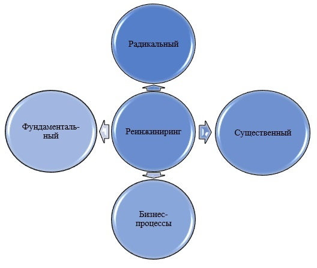
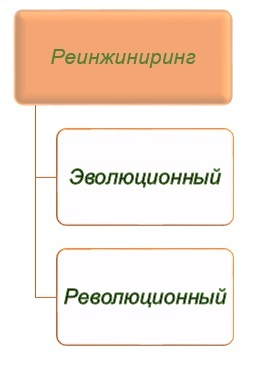
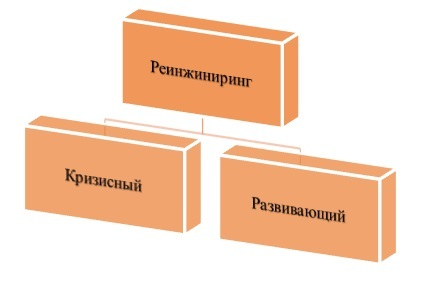
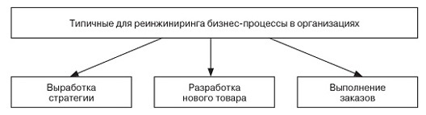

# Реинжиниринг бизнес-процессов в информационных системах.

[Реинжиниринг бизнес-процессов: технология, понятие, методы и принципы]: https://ivczn.ru/startapy/reinzhiniring-biznes-protsessov-tehnologiya-ponyatie-metody-i-printsipy.html

Понятие «реинжиниринг» впервые было введено учеными Хаммером и Чампи, которые в своих рассуждениях пришли к выводу, что ориентация на отдельно взятые задачи в бизнесе – это организационный архаизм.

Самые современные компании во главу угла ставят не что иное, как бизнес-процессы. Такую гипотезу можно назвать революционной, ведь она отвергает многие понятия традиционного бизнеса.

Например, Хаммер утверждает, что компания больше не нуждается в стабильной организационной структуре – она должна выстраиваться под бизнес-процессы, а не наоборот.

>Реинжиниринг неразрывно связан с бизнес-процессами, так как считается полным перепроектированием последних с целью повышения качества продукции и результативности производства, оптимизации затрат. Другими словами, реинжиниринг – это встряска, необходимая организации, которая медленно, но верно катится под откос.

В то же время у реинжиниринга есть и другое определение – переосмысление бизнеса. При этом переосмысливать должен не только руководитель организации, но и его подчиненные вплоть до низших звеньев.

Те же Хаммер и Чампи утверждали, что на основе исключительно механистических преобразований добиться возрождения компании из пепла не получится.

Чтобы результаты такого мощного инструмента, как реинжиниринг, впечатлили, нужно изменить образ мышления персонала таким образом, чтобы они поняли, почему их роль в выполнении того или иного бизнес-процесса исключительно важна. По мнению ученых, эффективный реинжиниринг есть гармоничное сочетание двух элементов:

В то время как объектом ОЛУ является процесс в компании, а само управление считается сугубо административным, СПУ направлено на человеческие ресурсы. Основная цель СПУ – мотивация персонала, причем мотивация не к выполнению задач (как принято считать), а к переосмыслению собственной роли в компании.

## Ключевые характеристики реинжиниринга

Если разложить реинжиниринг на составляющие, останутся 4 основных характеристики, позволяющие отличить этот процесс от прочих способов совершенствования бизнеса:

Рассмотрим каждую из характеристик подробнее:

* **Фундаментальный**. Реинжиниринг заключается в том, чтобы абстрагироваться от настоящего состояния бизнеса и «заглянуть в будущее». Рисуется идеальная картина, после чего определяется, насколько возможно для компании достичь такого состояния и какие методы необходимо использовать для этого.
* **Радикальный**. Бизнес строится заново. Основная ошибка руководителей, обращающихся к реинжинирингу, кроется в том, что они рассчитывают сохранить удачные, по их мнению, наработки и связи. Этот подход неверный, так как реинжиниринг предполагает полную перезагрузку системы. Меняется все вплоть до стратегии развития и миссии компании.
* **Существенный**. Реинжиниринг также имеет цель – не бывает процесса ради процесса. Если по итогам реинжиниринга не произошло существенного изменения в результатах работы, руководителями на каком-то этапе была допущена ошибка.
* **Бизнес-процессы**. Реинжиниринг ориентируется на бизнес-процессы, поэтому после «перезагрузки» должна быть организована система, «проповедующая» процессный подход.

Известны примеры успешного реинжиниринга. Компания IBM благодаря этому процессу добилась стократного (!) увеличения производительности труда и десятикратного снижения длительности выполнения процессов (в среднем).

Компания Ford сумела снизить количество работников отдела по работе с поставщиками в 4 раза, не потеряв при этом в качестве выполнения работы. Такие примеры прекрасно демонстрируют, насколько масштабных успехов позволяет добиться реинжиниринг.

>Важно понимать, что такие успехи не случайны, а предполагаются реинжинирингом по умолчанию.

К слову, в случае с крупными организациями (как тот же Ford) «перезагрузка» всей компании необязательна – достаточно усовершенствовать работу «проблемного» отдела, который включает в себя столько же работников, сколько и небольшая компания.

## Классификации реинжиниринга

Реинжиниринг классифицируется по степени воздействия на организацию и по ситуативному признаку. По первой классификации он делится на:

Согласно этой классификации, допускается эволюционный («мягкий») реинжиниринг, хотя это и противоречит тем характеристикам, которые были рассмотрены нами выше. Эволюционный реинжиниринг предполагает частичное изменение процессов либо полное изменение, но без перехода на новый вид бизнеса. Революционный реинжиниринг предполагает полное перепрофилирование.

По ситуативному признаку реинжиниринг делится на:

* К кризисному реинжинирингу прибегают тогда, когда компания оказывается на грани банкротства, например, из-за потери конкурентоспособности или снижения качества товара.
* К развивающему реинжинирингу обращаются, если при текущей благополучной позиции есть желание получить или увеличить отрыв от конкурентов.

К кризисному реинжинирингу прибегают тогда, когда компания оказывается на грани банкротства, например, из-за потери конкурентоспособности или снижения качества товара.
К развивающему реинжинирингу обращаются, если при текущей благополучной позиции есть желание получить или увеличить отрыв от конкурентов.

## Как производится реинжиниринг: основные этапы

Точный процесс проведения процедуры реинжиниринга всегда определяется тем, кто эту процедуру производит. Однако в примитивном теоретическом виде эту процедуру можно представить как совокупность следующих этапов:

Рассмотрим каждый этап подробнее:

* Стратегическое планирование. Если цель фирмы остается прежней (получение прибыли – любой студент-экономист знает об этом), то задачи, которые необходимо выполнять для ее достижения, определяются заново. Такими задачами могут быть снижение риска банкротства, увеличение прибыли, повышение эффективности работы компании. При разработке стратегического плана определяется ключевая компетенция предприятия – некое конкурентное преимущество или ноу-хау, с помощью которого миссия организации будет осуществимой.
* Описание существующей бизнес-структуры. На этом этапе строится функциональная модель «как есть», то есть рассматривается существующая структура с нескольких точек зрения: например, компания как сеть процессов и подпроцессов, как сеть информационных источников, как организационная структура. Важность этого этапа невозможно преувеличить: рассмотрение текущего состояния фирмы – это отправная точка самого процесса реинжиниринга.
* Анализ моделей. Используется функционально-стоимостной анализ (ФСА) – он признан наиболее объективным. ФСА измеряет эффективность настоящих процессов и выявляет возможности для ее повышения. Анализу в первую очередь подвергаются такие процессы:

    

    ФСА производит замеры по двум признакам: время, затрачиваемое на выполнение процесса, и стоимость операции (в сопоставлении с отдачей).

* Собственно реинжиниринг. Если количество «неблагополучных» мест превышает допустимый уровень, руководство принимает решение о реинжиниринге. Средств и методик, с помощью которых осуществляется реинжиниринг, бывает несколько:
    * Построение диаграмм эффективности и моделей балансовых ведомостей.
    * Графические методы: SA / SD (структурный анализ / структурный дизайн) – наиболее известный метод из этой категории.
    * Средства имитации, позволяющие протестировать будущую систему в реальных условиях.
    * Моделирование с помощью баз данных (например, через Oracle Developer).
    * Использование экспертных систем (например, Gensym).

Стоит отметить, что реинжиниринг – достаточно ответственная процедура, и пробовать новые для руководства методы здесь нецелесообразно, более того, опасно. Лучше положиться на те средства, которые отлично знакомы и чья эффективность уже практически проверена.

## Психологические «тормоза» реинжиниринга

Не секрет, что реинжиниринг, как и любое организационное изменение в компании, встречает сопротивление со стороны сотрудников (а иногда и руководителей).

Часто бывает, что именно психологический барьер является главной проблемой при осуществлении процедуры.

По этой причине руководителям важно не попасться в ловушку психологических комплексов, для чего нужно знать, где же эти «капканы» расставлены.

Основные «стоп-сигналы» описаны в книге тех же Хаммера и Чампи:

* Достроить легче, чем построить заново. В этом есть смысл, но только тогда, когда организация требует «косметического ремонта». Если же по всем признакам компания приближается к банкротству, нет причин пытаться сберечь то, что уже налажено. Реинжиниринг предполагает легкое расставание с прошлым.
* Лучше синица в руках. Руководитель не рассчитывает на стремительный рост эффективности работы компании и готов довольствоваться малым ввиду отсутствия амбиций. Изменить образ мышления такого руководителя (главное, чтобы надежно) – настоящая проблема. Куда проще найти нового, амбициозного менеджера.
* Поспешное прекращение процедуры. Руководитель сворачивает реинжиниринг как только видит первые успехи, считая, что дальнейшие преобразования уже ни к чему. Результат часто плачевен: если реинжиниринг не доведен до конца, компания возвращается к былым процессам и уже через пару лет нуждается в повторении процедуры.
* Игнорирование ценностей кадров. Превращенный в формальную механистическую процедуру реинжиниринг обречен на неудачу в 100% случаев – это правило выделено в книге Хаммера и Чампи жирным. Грамотный менеджер должен обращать внимание на то, что творится в головах сотрудников, а не на их столах. Поэтому сотрудникам важно привить новые ценности, и использовать в качестве инструмента следует не красивые речи и обещания, а собственный пример.
* Сосредоточенность на схемах, а не на их реализации. Быть экспертом в теории – лишь полдела для реинжиниринга. От руководителя требуются смелость (а, возможно, и дерзость), чтобы осуществлять изменения, кажущиеся ему необходимыми, без сомнения.

В качестве вывода можно отметить, что для того, чтобы реинжиниринг был проведен правильно и имел отдачу в виде повышения эффективности, не нужны какие-либо специальные или узконаправленные навыки – достаточно просто быть грамотным управленцем и понимать суть процедуры.

Источник: https://utmagazine.ru/posts/8617-reinzhiniring-biznesa

