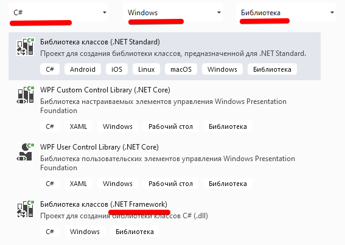
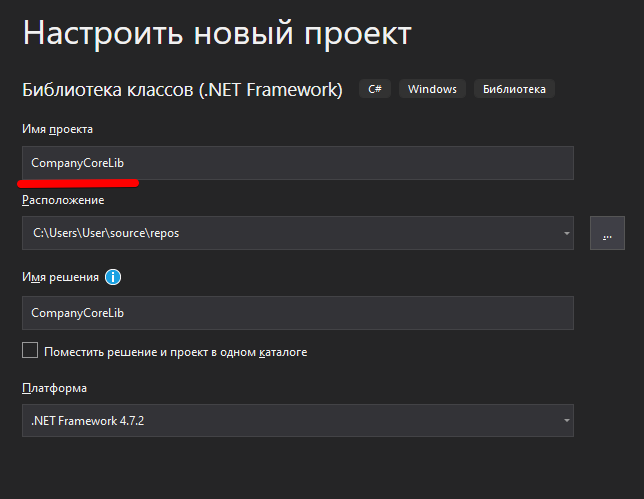

# Разработка библиотеки классов

## Техническое задание

>Задание взято из демо-экзамена

### Общие требования

В связи со стремительным развитием нашей системы было решено вынести некоторый важный функционал за рамки основного проекта и сделать библиотеку классов, которую мы сможем подключать
к любому нашему проекту в случае расширения. Данная библиотека будет подключаться к основному проекту и должна быть представлена в виде *.dll/.jar* файла или папки с файлом *.py*.

Чтобы система правильно интегрировалась вам необходимо обязательно следовать правилам именования библиотек, классов и методов в них. В случае ошибок в рамках именования ваша работа не
может быть проверена и ваш результат не будет зачтен. Классы и методы должны содержать модификатор **public** (если это реализуемо в рамках платформы), чтобы внешние приложения могли
получить к ним доступ.

В качестве названия для библиотеки необходимо использовать: **CompanyCoreLib**. Вам необходимо загрузить исходный код проекта с библиотекой в отдельный репозиторий с названием, совпадающим с названием приложения.

### Класс аналитики

Вам необходимо создать класс с названием **Analytics**, который будет позволять проводить аналитику различных процессов в рамках компании.

Реализуйте метод, который принимает в себя список объектов даты и времени по совершенным покупкам/заказам в рамках нашей компании, а возвращает список дат (без времени), отсортированный в порядке уменьшения частоты заказов. Это необходимо, чтобы наша компания могла прогнозировать наиболее высокий спрос на следующий год для обеспечения более качественного оказания услуг.

Возвращаемые данные должны содержать только даты для первого числа каждого месяца и 00:00 минут. 
Например, вам поступили следующие данные: 2019-12-12 14:43, 2019-12-01 15:05, 2019-11-04 09:01, а, значит, самый популярный месяц - декабрь. Вам необходимо вернуть следующие данные: 2019-12-01 00:00, 2019-11-01 00:00. В случае совпадения характеристик популярности сперва нужно вывести более
ранние месяцы.

Прогноз строится на основе предыдущего года. ~~Так что данные Вам будут выдаваться строго за предыдущий год.~~ *Данные будут произвольные, поэтому даты не удовлеторяющие этому условию нужно игнорировать.*

### Спецификация метода

Метод должен принимать список объектов даты и времени, а возвращать список дат (без времени).

&nbsp; | C#
---|---
Библиотека классов | CompanyCoreLib.dll
Название класса | Analytics
Название метода | PopularMonths()
Входящие обязательные параметры | List\<DateTime\> dates
Возвращаемые параметры | List\<DateTime\>

## Реализация

### Создание библиотеки классов

Создаем **новый** проект, установив нужные фильтры (*C#*, *Windows*, *Библиотека*) и выбрав проект для соответствующей платформы. Мы всё делаем для **.NET Framework**.



Не забываем указывать название проекта. Как вы тут напишете, так dll и будет называться.



В итоге студия создаст нам "рыбу" с одним файлом:

```cs
using System;
using System.Collections.Generic;
using System.Linq;
using System.Text;
using System.Threading.Tasks;

namespace CompanyCoreLib
{
    public class Class1
    {
    }
}
```

### Создание класса аналитики

По ТЗ наш класс должен называться **Analytics** - в *обозревателе решений* переименуйте файл `Class1.cs` в `Analytics.cs`. Система спросит, переименовать ли все названия в проекте - соглашаемся. В итоге наш класс должен выглядеть так:

```cs
namespace CompanyCoreLib
{
    public class Analytics
    {
    }
}
```

Обратите внимание на модификатор **public** у класса - не во всех версиях *Visual Studio* он ставится автоматически. Добавьте, если его нет.

### Создание метода

В [спецификации](#Спецификация-метода) задано и название метода, его параметры и возвращаемый результат - запишем (не забывая про модификатор доступа **public**):

```cs
public List<DateTime> PopularMonths(List<DateTime> dates) {
    return dates;
} 
```

**Напомню синтаксис объявления метода:**

`<Модификатор доступа> <Тип результата, возвращаемого методом> НазваниеМетода(<Тип параметра 1> <НазваниеПараметра>[, <Тип параметра 2> <НазваниеПараметра2>])`

>В ТЗ явно указано, что название параметра **dates**, и хотя это отход от стандарта, оставляем как есть.

**List<DateTime>** - означает **список** объектов типа **DateTime**

Для того, чтобы реализовать логику метода нам необходимо:

* перебрать список входных данных (произволные даты)
* отфильтровать даты по условию (только прошлый год)
* сохранить дату в промежуточный список с датой первого числа месяца и количеством повторений этой даты
* отсортировать промежуточный список по двум условиям: популярность месяца по убываению и, если популярность одинаковая, по месяцу по возрастанию

Для перебора элементов списка используется цикл **foreach**:

```cs
// обращаем внимание на название переменных - IterDate (ПеребираемаяДата) пишем CamelCase-ом 
foreach (DateTime IterDate in dates) {
    ...
}
```

Для вычисления прошлого года используем статический геттер класса **DateTime** *DateTime.Now*, который возвращает текущую дату и время. Нам остается получить у этого объекта год и вычесть единицу (естественно вычислять эту переменную нужно до цикла):

```cs
int PreviousYear = DateTime.Now.Year-1;
foreach (DateTime IterDate in dates) {
    if (IterDate.Year == PreviousYear){
        ...
    }
}
```

**Следующий текст устарел! Использовать его можно, но не нужно. Лучше реализовать временный список с использованием кортежей. Это покажет ваше владение средствами языка и уменьшит количество кода/файлов.**

~~Теперь нам нужно объявить список объектов, в котором будет хранится дата и количество повторений этой даты. Для этого создадим класс **DateTimeWithCounter** (вообще, по современным гайдлайнам нужно каждый класс писать в отдельном файле и на демо-экзамене помните про это)~~

```cs
class DateTimeWithCounter
{
    public DateTime DateTimeProp;
    public int Counter = 0;

    // конструктор
    public DateTimeWithCounter(DateTime date) {
        DateTimeProp = date;
        Counter = 1;
    }
}


public class Analytics
{
    public List<DateTime> PopularMonths(List<DateTime> dates) {
        // объавляем временный список объектов "ДатаСоСчетчиком"
        var DateTimeWithCounterList = new List<DateTimeWithCounter>();
    
        int PreviousYear = DateTime.Now.Year-1;
        foreach (DateTime IterDate in dates) {
            if (IterDate.Year == PreviousYear){
                // вычисляем начало месяца для текущей даты
                var DateMonthStart = new DateTime(date.Year, date.Month, 1, 0, 0, 0);

                // ищем эту дату во временном списке
                var index = DateTimeWithCounterList.FindIndex(item => item.DateTimeProp == DateMonthStart);

                if (index == -1)
                {
                    // такой даты нет - добавляю
                    DateTimeWithCounterList.
                        Add(new DateTimeWithCounter(DateMonthStart));
                }
                else {
                    // дата есть - увеличиваем счетчик
                    DateTimeWithCounterList[index].Counter++;
                }
            }
        }
        ...
    }
}
```

**Новый код с использованием кортежей**

Теперь нам нужно объявить список объектов, в котором будет хранится дата и количество повторений этой даты. Для этого используем список [кортежей](https://metanit.com/sharp/tutorial/2.19.php)


```cs
public List<DateTime> PopularMonths(List<DateTime> dates) {
    var DateTimeWithCounterList = new List<Tuple<DateTime, int>>();

    int PreviousYear = DateTime.Now.Year - 1;
    foreach (DateTime IterDate in dates)
    {
        if (IterDate.Year == PreviousYear)
        {
            // вычисляем начало месяца для текущей даты
            var DateMonthStart = new DateTime(IterDate.Year, IterDate.Month, 1, 0, 0, 0);

            // ищем эту дату во временном списке
            var index = DateTimeWithCounterList.FindIndex(item => item.Item1 == DateMonthStart);

            // кортежи можно создавать по-разному
            if (index == -1)
            {
                // такой даты нет - добавляю (используя конструктор)
                DateTimeWithCounterList.
                    Add( new Tuple<DateTime,int>(DateMonthStart, 1) );
            }
            else
            {
                // дата есть - увеличиваем счетчик
                // свойства кортежа неизменяемые, поэтому перезаписываем текущий элемент новым кортежем, который создаем статическим методом
                DateTimeWithCounterList[index] = Tuple.Create(DateTimeWithCounterList[index].Item1, DateTimeWithCounterList[index].Item2 + 1);
            }
        }
    }

    return DateTimeWithCounterList
        .OrderByDescending(item => item.Item2)
        .ThenBy(item => item.Item1)
        .Select(item => item.Item1)
        .ToList();
}
```

Для вычисления начала месяца мы использовали один из конструкторов класса **DateTime(year, month, day, hour, minutes, seconds)**, где год и месяц берем оригиналльные, а день равен "1"

Метод **FindIndex** ищет **позицию** (индекс) элемента в списке. Если элемент в списке есть, то возвращает целое от "0" и выше, а если нет, то "-1".

А дальше мы либо добавляем новую дату во временный список, либо увеличиваем счетчик у найденной даты.

Осталось только вернуть отсортированный результат. Для этого в **C#** есть очень мощный инструмент - [**LINQ**](https://metanit.com/sharp/tutorial/15.1.php).

```cs
...
return DateTimeWithCounterList
    .OrderByDescending(item => item.Counter)
    .ThenBy(item => item.DateTimeProp)
    .Select(item => item.DateTimeProp)
    .ToList();
```

**OrderByDescending** - сортирует исходный список по убыванию. В параметрах пишется лямбда функция, где *item* текущий элемент списка, а после "=>" свойство элемента, по которому производится сортировка. У еас по ТЗ первое условие сортировки по убыванию популярности, поэтому используем свойство Counter. Для прямой сортировки (по возрастанию) есть метод *OrderBy*.

**ThenBy** (ЗатемПо) - при совпадающих свойствах *популярность* сортировка будет производиться по полю *дата*. У метода *ThenBy* есть пара *ThenByDescending*. Методов *ThenBy* после *OrderBy* может быть несколько.

**Select** - выбирает из объекта нужные свойства. Нам из этого объекта нужна только дата. (Если нужно выбрать несколько объектов, то они перечисляются через запятую: `Select(item => item.Prop1, item.Prop2, item.Prop1 + item.Prop2)`)

**ToList** преобразует полученный после сортировки объект (IEnumerable) в список, который и возвращается методом. 


# Контрольное задание

* Реализовать ТЗ, написанное в начале этой лекции. 
* Результат оформить в виде репозитория (как написано в ТЗ). Обязательно с файлом `readme.md`