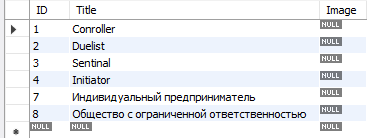
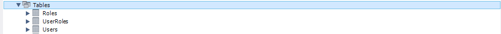
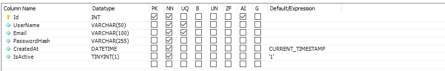
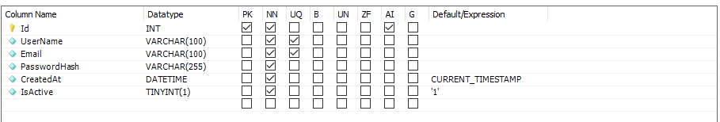
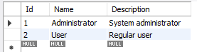
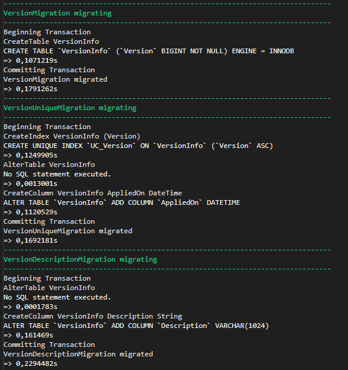
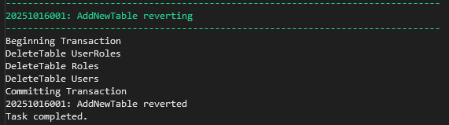

# Fluent Migrator

<!-- добавить интересное отсюда https://habr.com/ru/articles/129242/ -->

## Что такое Fluent Migrator?

__Fluent Migrator__ - это фреймворк с открытым исходным кодом для .NET, предназначенный для управления миграциями базы данных. В отличие от подхода "код первичен" (Code-First) в Entity Framework, где миграции генерируются автоматически, Fluent Migrator предоставляет разработчику полный контроль над процессом, позволяя описывать изменения схемы базы данных на языке C# с помощью удобного Fluent API.

Основная философия Fluent Migrator заключается в принципе "миграции как код". Это означает, что каждая версия схемы вашей базы данных представлена в виде класса C#, который можно версионировать с помощью системы контроля версий (такой как Git) вместе с кодом приложения. Это обеспечивает последовательность, повторяемость и надежность процесса развертывания базы данных в разных средах (разработка, тестирование, продакшн).

Одним из ключевых преимуществ Fluent Migrator является его способность абстрагироваться от конкретной системы управления базами данных. Вы пишете миграции один раз, а фреймворк генерирует соответствующий SQL код для различных
СУБД - SQL Server, PostgreSQL, MySQL, SQLite и других.

__Ключевые особенности:__

- Fluent API для описания изменений
- Поддержка multiple БД (SQL Server, PostgreSQL, MySQL, SQLite, Oracle)
- Встроенная поддержка откатов (rollbacks)
- Интеграция с различными инструментами сборки
- Возможность программирования сложной логики миграций

## Привязка пакетов 

Миграции можно накатывать как из приложения, так и внешними командами. В зависимости от этого нужно устанавливать разные пакеты:

Пакет __FluentMigrator__ - нужен для создания классов миграций, то есть ставим обязательно

```
dotnet add package FluentMigrator
```

Остальные пакеты добавляем только если предполагается установка миграций из приложения

```
# Runner для применения миграций
dotnet add package FluentMigrator.Runner

# Поддержка SQL Server
dotnet add package FluentMigrator.Runner.SqlServer

# Поддержка PostgreSQL
dotnet add package FluentMigrator.Runner.Postgres

# Поддержка MySQL
dotnet add package FluentMigrator.Runner.MySql
```

## Основные концепции и архитектура

### Структура миграции

Каждая миграция в Fluent Migrator представляет собой класс, помеченный атрибутом `Migration` с указанием уникального номера версии. Номер версии обычно представляет собой `timestamp` в формате `YYYYMMDDNN`, что гарантирует хронологический порядок применения миграций.

Миграция содержит два основных метода: _Up()_ и _Down()_. Метод _Up()_ описывает изменения, которые должны быть применены к базе данных, в то время как метод _Down()_ определяет, как эти изменения можно откатить. Этот подход обеспечивает возможность отката к предыдущему состоянию схемы, что критически важно для безопасного развертывания.

```cs
[Migration(20251016001)]
public class CreateUserTable : Migration
{
    public override void Up()
    {
        // Код для применения миграции
    }
    
    public override void Down()
    {
        // Код для отката миграции
    }
}
```

### Fluent Interface

Fluent Migrator использует шаблон __Fluent Interface__, который позволяет создавать читаемый и выразительный код. Вместо того чтобы писать сложные SQL-запросы, вы используете цепочки методов, которые интуитивно понятны даже разработчикам, не являющимся экспертами в SQL.

(Например, создание таблицы выглядит как последовательность вызовов методов: _Create.Table()_, затем _WithColumn()_, и далее спецификация каждого столбца с его типом и ограничениями. Такой подход не только улучшает читаемость, но и обеспечивает проверку типов на этапе компиляции.)

## Типы миграций в Fluent Migrator

### Структурные миграции

Структурные миграции отвечают за изменения схемы базы данных. Это включает:

- Создание и удаление таблиц
- Добавление, изменение и удаление столбцов
- Создание индексов, внешних ключей, ограничений
- Изменение типов данных

Эти миграции являются наиболее распространенными и формируют основу эволюции схемы базы данных.

### Миграции данных

Миграции данных управляют содержимым таблиц. Они используются для:

- Начального заполнения таблиц справочными данными
- Преобразования существующих данных
- Исправления данных
- Массовых обновлений

Важной особенностью миграций данных является то, что они могут содержать сложную бизнес-логику, реализованную на C#, что предоставляет гораздо больше возможностей по сравнению с чистыми SQL-скриптами.

### Продвинутые миграции

Для сложных сценариев Fluent Migrator предоставляет возможность выполнения произвольного SQL кода, создания хранимых процедур, функций и триггеров. Это позволяет охватить все аспекты управления базами данных, даже те, которые не поддерживаются напрямую __Fluent Interface__.

```cs
Execute.Sql("INSERT INTO MyTable (Column1, Column2) VALUES ('Value1', 'Value2');");
Execute.Sql("UPDATE AnotherTable SET Status = 'Active' WHERE Id = 1;");
```

## Преимущества использования Fluent Migrator

### Типобезопастность и проверка на этапе компиляции

Поскольку миграции пишутся на C#, компилятор может обнаружить многие ошибки на этапе компиляции, что невозможно при использовании SQL-скриптов. Это значительно снижает вероятность ошибок в продуктивной среде.

### Версионирование

Миграции хранятся как файлы кода, что позволяет легко отслеживать историю изменений схемы базы данных, видеть, кто и когда внес изменение, и возвращаться к предыдущим версиям.

### Повторяемость и CI/CD

Процесс применения миграций может быть легко встроен в конвейеры непрерывной интеграции и развертывания (CI/CD). Это гарантирует, что все среды имеют идентичную схему базы данных.

### Поддержка множества СУБД

__Fluent Migrator__ поддерживает широкий спектр баз данных, включая SQL Server, PostgreSQL, MySQL, SQLite, Oracle и другие. Абстракция Fluent API позволяет писать миграции, не зависящие от конкретной СУБД, хотя при необходимости можно использовать и специфические функции.
 
## Сравненние Fluent Migrator с DbUp

Оба инструмента решают одну задачу — управление миграциями базы данных, но подходят к этому с разной философией. Вот детальное сравнение.

Критерий | Fluent Migrator | DbUp
---------|-----------------|------
Подход | "Код первичен" | "База первична"
SQL-генерация | Автоматическая | Ручное написание
Кросс-платформенность | Один код для разных СУБД | Требуются разные SQL для разных СУБД
Откат изменений | Встроенная поддержка | Ручное написание скриптов отката
Гибкость | Ограничена API | Полная (любой SQL)
Типичное использование | Проекты с частым изменением структуры БД | Сложные миграции
Интеграция с БД | через абстракции | Прямая работа с SQL

Выбирайте Fluent Migrator если:

- Работаете в команде с разными СУБД (разработка/продакшен)
- Хотите типобезопасность и автодополнение кода
- Нужны встроенные механизмы отката
- Часто меняете структуру БД

Выбирайте DbUp если:

- Уже есть набор SQL-скриптов
- Нужен полный контроль над SQL
- Работаете со сложными миграциями (данные, индексы)
- Предпочитаете SQL над абстракциями

## Ключевые отличия от Entity Framework Migrations

### Подход 

Fluent Migrator следует принципу "миграции как код" (модель базы данных определяется исключительно последовательностью миграций), в то время как EF Core использует подход "код первичен" (модель базы данных выводится из классов-сущностей).

### Контроль
 
В Fluent Migrator вы пишете каждую миграцию вручную, имея полный контроль. В EF Core миграции генерируются автоматически на основе изменений в ваших моделях, хотя их также можно настраивать вручную.

### Производительность

Для очень больших проектов с сложной схемой ручное управление миграциями в Fluent Migrator может быть более производительным и предсказуемым, чем автоматическое сравнение моделей в EF Core.

## Процесс разработки с использованием Fluent Migrator

### Создание миграций

Разработчик определяет, какие изменения должны быть внесены в схему базы данных, и реализует соответствующие операции в методе _Up()_. Одновременно необходимо продумать, как эти изменения можно будет откатить, и реализовать метод _Down()_.

Вывести в консоли должно типо такого:


В MySQL: 



Важно соблюдать принцип атомарности миграций - каждая миграция должна представлять собой логически завершенное изменение. Это упрощает откат и делает процесс более предсказуемым.

### Применение миграций

__Fluent Migrator__ поддерживает несколько способов применения миграций:

- Через консольное приложение
- Интеграцию с процессами сборки
- Программное применение из кода приложения
- Через специализированные инструменты развертывания

В процессе применения __Fluent Migrator__ отслеживает, какие миграции уже были применены, и выполняет только те, которые еще не были выполнены на целевой базе данных.

### Управление версиями

Одной из ключевых возможностей __Fluent Migrator__ является ведение таблицы версий, которая хранит информацию о примененных миграциях. Это позволяет системе точно знать текущее состояние схемы базы данных и определять, какие миграции необходимо применить для перехода к желаемой версии.

# Работа с DDL запросами в FluentMigrator

## Что такое DDL?

__DDL (Data Definition Language)__ - это подмножество SQL, отвечающее за определение и изменение структуры базы данных:

- `CREATE` - создание обьектов (таблиц, индексов, etc.)
- `ALTER` - изменение существующих объектов 
- `DROP` - Удаление объекто
- `TRUNCATE` - очистка таблиц
- `RENAME` - переименовние оюъектов

## Преимущества FluentMigrator для DDL операции

- __Поддержка различных СУБД__ — библиотека позволяет использовать один фреймворк миграций в разных проектах и средах. 

- __Отслеживание изменений__ — изменения в базе данных назначаются номером версии, что позволяет безопасно откатывать изменения при необходимости. 

- __Автоматизация процесса__ — инструмент можно интегрировать в инструменты CI (Continuous integration) для автоматизации миграций. 

## Недостатки 

- __Зависимость от СУБД__ - функциональность библиотеки сильно зависит от поставщиков баз данных, которые могут иметь свои особенности и ограничения.

- __Влияние на производительность__ - в зависимости от сложности миграций инструмент может оказывать заметное влияние на производительность приложения.

### Базовая конфигурация для применения миграции (в коде приложения)

```cs
public static void Main(string[] args)
{
    var serviceProvider = CreateServices();
    using (var scope = serviceProvider.CreateScope())
    {
        UpdateDatabase(scope.ServiceProvider);
    }
}

private static IServiceProvider CreateServices()
{
    return new ServiceCollection()
        .AddFluentMigratorCore()
        .ConfigureRunner(rb => rb
            .AddMySql5() // выбор базы данных из строки подключения
            .WithGlobalConnectionString(
                "Server=kolei.ru; Database=dkoryakova_test; Uid=dkoryakova; Pwd=061007;") // подключение к бд
            // Указание сборки, в которой находятся миграции
            .ScanIn(typeof(Program).Assembly)
            .For
            .Migrations())
        .AddLogging(lg => lg.AddFluentMigratorConsole()) // настройка логирования
        .BuildServiceProvider(false);
}

public static void UpdateDatabase(
    IServiceProvider serviceProvider)
{
    var runner = serviceProvider.GetRequiredService<IMigrationRunner>(); // построение поставщика услуг

    runner.MigrateUp(); //запуск миграции
}
```

### Создание таблицы

```cs
public override void Up()
{
    // Пользователи
    Create.Table("Users")
        .WithColumn("Id")
            .AsInt32()
            .PrimaryKey()
            .Identity() //Identity() гарантирует, что все значения будут уникальными
        .WithColumn("UserName")
            .AsString(50)
            .NotNullable()
            .Unique() //Unique() гарантирует, что значения в определенном столбце всегда будут неповторяющимися
        .WithColumn("Email")
            .AsString(100)
            .NotNullable()
            .Unique() //NotNullable() гарантирует что обязательные поля всегда будут заполнены
        .WithColumn("PasswordHash")
            .AsString(255)
            .NotNullable() 
        .WithColumn("CreatedAt")
            .AsDateTime()
            .NotNullable()
            .WithDefaultValue(SystemMethods.CurrentDateTime)
        .WithColumn("IsActive")
            .AsBoolean()
            .NotNullable()
            .WithDefaultValue(true);

    // Роли
    Create.Table("Roles")
        .WithColumn("Id")
            .AsInt32()
            .PrimaryKey()
            .Identity()
        .WithColumn("Name")
            .AsString(50)
            .NotNullable()
            .Unique()
        .WithColumn("Description")
            .AsString(255)
            .Nullable();

    // Связь пользователей и ролей
    Create.Table("UserRoles")
        .WithColumn("UserId")
            .AsInt32()
            .NotNullable()
        .WithColumn("RoleId")
            .AsInt32()
            .NotNullable();

    // Внешние ключи
    Create.PrimaryKey("PK_UserRoles_Users")
        .OnTable("UserRoles")
        .Columns("UserId", "RoleId");

    Create.ForeignKey("FK_UserRoles_Users")
        .FromTable("UserRoles")
        .ForeignColumn("UserId")
        .ToTable("Users")
        .PrimaryColumn("Id")
        .OnDelete(Rule.Cascade);

    Create.ForeignKey("FK_UserRoles_Roles")
        .FromTable("UserRoles")
        .ForeignColumn("RoleId")
        .ToTable("Roles")
        .PrimaryColumn("Id")
        .OnDelete(Rule.Cascade);
}
```



### Удаление таблицы

```cs
public override void Down()
{
    // Удаляем в обрадном порядке создания
    Delete.Table("UserRoles");
    Delete.Table("Roles");
    Delete.Table("Users");
}
```

### Изменение типа данных столбцов

```cs
public override void Up()
{
    // Изменение типа данных

    Alter.Table("Users")
        .AlterColumn("UserName")
        .AsString(100)
        .NotNullable();
}
```





### Вставка данных

```cs
public override void Up()
{
    // Добавление данных
    Insert.IntoTable("Roles")
        .Row(new { 
            Name = "Administrator", 
            Description = "System administrator" })
        .Row(new { 
            Name = "User", 
            Description = "Regular user" });
}
```



### Удаление данных

```cs
public override void Down()
{
    Delete
        .ForeignKey("FK_UserRoles_Roles")
        .OnTable("UserRoles");
    Delete
        .ForeignKey("FK_UserRoles_Users")
        .OnTable("UserRoles");
    Delete
        .PrimaryKey("PK_UserRoles_Users")
        .FromTable("UserRoles");
}
```

## Запуск через консоль

Глобально устранавливаем консольную утилиту для применения/отката миграций

```
dotnet tool install -g FluentMigrator.DotNet.Cli
```

### Сборка приложения

Не забываем собрать приложение, чтобы в скомпилированном файле были последние классы миграций

```
dotnet build
```

### Применение миграции

```
dotnet-fm migrate \
    -p Mysql \
    -c "Server=kolei.ru; Database=dkoryakova_new; Uid=dkoryakova; Pwd=061007;" \
    -a "путь к api.dll" \
    --verbose
```

- `dotnet-fm` - консольная утилита
- `-p` - выбераем тип базы данных
- `-c` - задаем строку подключения к серверу
- `-а` - путь к приложению, в котором описаны миграции
- `--verbose` - для получения подробных логов при миграции



### Откат миграции

```
dotnet-fm rollback \
    -p MySql \
    -c "Server=kolei.ru; Database=dkoryakova_new; Uid=dkoryakova; Pwd=061007;" \
    -a "путь к api.dll"
```


