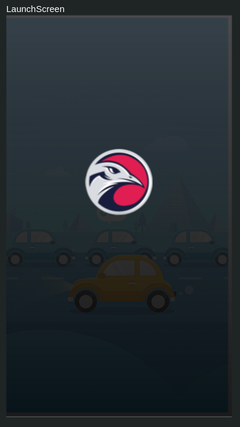
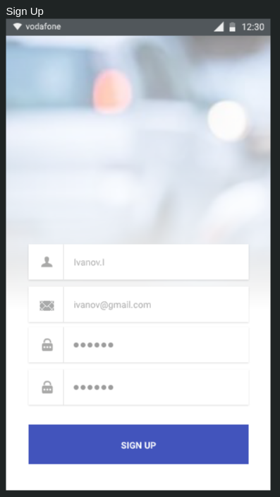
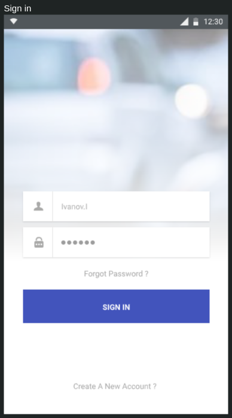
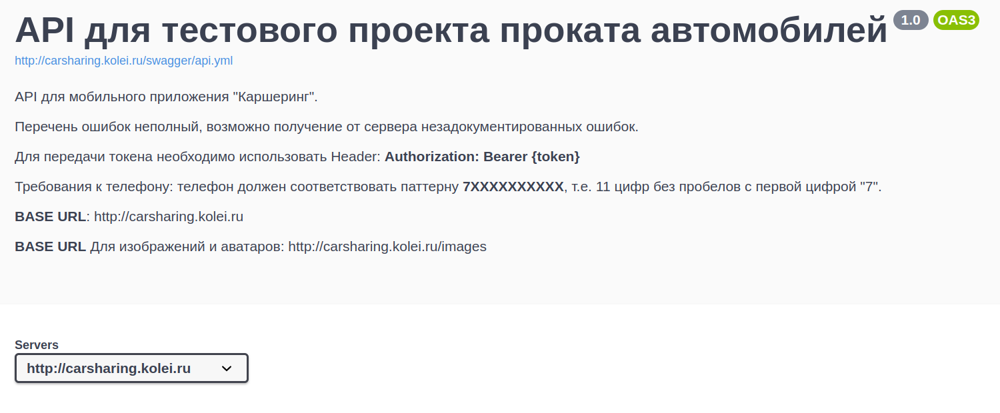
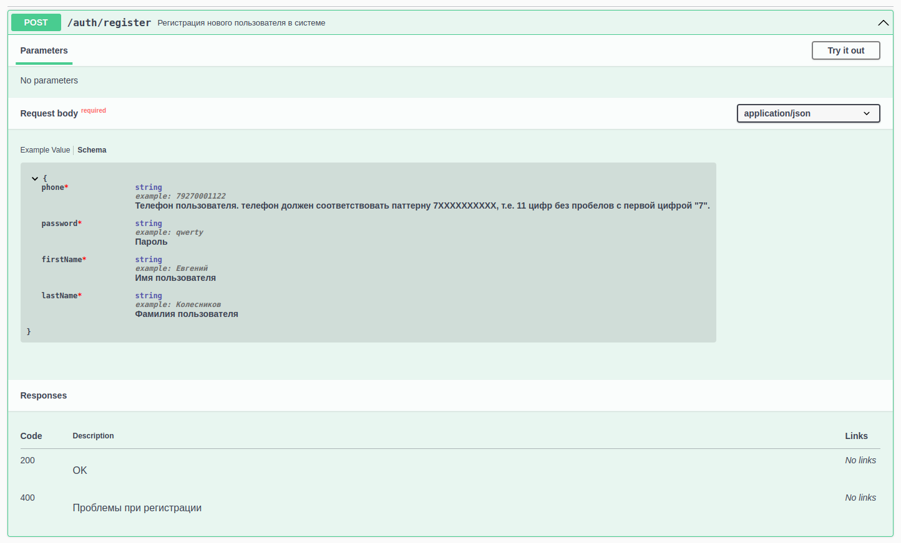
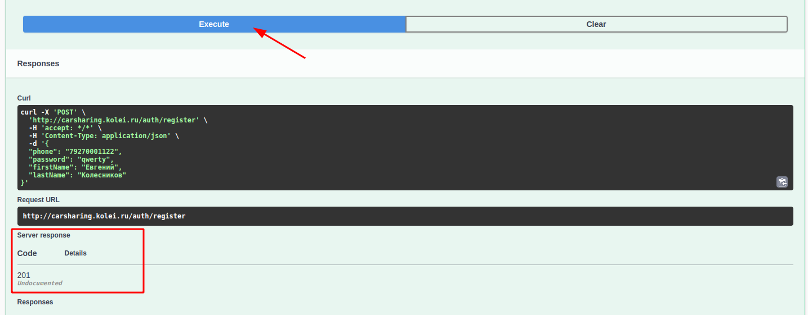

Предыдущая лекция | &nbsp; | Следующая лекция
:----------------:|:----------:|:----------------:
[Анимация](./animation.md) | [Содержание](../readme.md#практика-разработка-мобильных-приложений) | [Проект "каршеринг" Часть 2. Профиль пользователя.](./android_profile.md)

# Проект "каршеринг" Часть 1. Регистрация/Авторизация.

**Содержание**

* [Техническое задание](#техническое-задание-задание-на-демо-экзамене)

* [Первичная настройка приложения](#первичная-настройка-приложения)

* [Регистрация и авторизация. Регулярные выражения. POST-запросы. Сохранение данных при работе приложения](#регистрация-и-авторизация-регулярные-выражения-post-запросы-сохранение-данных-при-работе-приложения)

## Техническое задание

>Сразу уточню: задание скомпилировано из нескольких демо-экзаменов, могут быть нестыковки.

**Модуль 1** 

Разработка мобильного приложения для бронирования автомобилей (каршеринг)

Необходимо разработать мобильное приложение для смартфона, удовлетворяющее следующим требованиям:

Приложение должно поддерживать следующие версии ОС:

* Android 9.0 и новее
* iOS 13.0 и новее

В работе необходимо использовать систему контроля версий **Git**.

Необходимо загрузить результаты выполнения модуля в отдельный репозиторий с именем `Module_X`, где `Х` – это номер модуля.

Необходимо корректно обрабатывать запросы к серверу. В случае получения ошибки от сервера или отсутствия соединения с сетью Интернет необходимо отобразить соответствующий текст ошибки с помощью диалогового окна.

Необходимо строго следовать предложенному дизайну. Макеты приложения доступны по ссылке:

>Пока нет фигмы

<!-- TODO добавить ссылку на фигму -->

Описание протокола API в формате OpenAPI (Swagger) доступно по ссылке:
https://swagger.kolei.ru/?url=https://carsharing.kolei.ru/swagger/api.yml

Проект приложения должен быть структурирован по экранам, то есть исходные файлы конкретного экрана должны быть в соответствующей папке. Общие для нескольких экранов классы необходимо поместить в папку `common`.

Необходимо реализовать следующий функционал:

1. Создайте проект. Настройте иконку приложения согласно макету. Следует учесть разницу в отображении иконок на различных версиях операционной системы.

1. Реализуйте экран *Launch Screen* согласно макету. 

    

    Текст должен быть отдельным элементом (на скрине нет, но добавьте что-нибудь сами). 
    
    Логотип приложения должен быть расположен по центру экрана. При первом запуске приложения после `Launch Screen` должен отображаться `SignUp Screen` (регистрация). При последующих - `SignIn Screen` (авторизация).

    >Я создание загрузочного экрана расписывать не буду, вы уже должны справиться с этим самостоятельно.

1. Реализуйте экран `SignUp Screen` согласно макету:

        

    >**Обратите внимание!** В оригинальном задании был вход по e-mail, но в моем АПИ нужно по телефону

    * При нажатии на кнопку "Зарегистрироваться" необходимо проверять поля для ввода на пустоту, а также телефон на корректность (требования к телефону описаны в документации к API). При некорректном заполнении необходимо отобразить ошибку с помощью диалогового окна. Так же необходимо проверять равенство пароля и его повтора.

    * При корректном заполнении формы необходимо отправлять запрос регистрации на сервер. При получении ошибки от сервера ее необходимо отобразить с помощью диалогового окна. При успешной регистрации нужно автоматически осуществить авторизацию и перейти на `Main Screen`.

    * При нажатии на кнопку "У меня уже есть аккаунт" необходимо осуществлять переход на `SignIn Screen`. На скрине этой кнопки нет - добавьте.

    * при нажатии на ссылку "Оферта" необходимо открыть web-страничку с текстом оферты. Этой кнопки тоже нет, тоже добавьте сами.

    >Создание этого и следующего экранов я тоже расписывать не буду, тут всё элементарно. Остановлюсь только на создании POST-запросов и регулярных выражениях.

1. Реализуйте экран `SignIn Screen` согласно макету:

        

    * При нажатии на кнопку "Войти" необходимо проверять поля для ввода на пустоту, а также телефон на корректность (требования к телефону описаны в документации к API). При некорректном заполнении необходимо отобразить ошибку с помощью диалогового окна. При корректном заполнении формы необходимо отправить на сервер соответствующий запрос.

    * При нажатии на кнопку "Регистрация" необходимо осуществлять переход на `SignUp Screen`.

    * При успешной авторизации необходимо осуществлять переход на экран `Main Screen` или `Profile Screen`, в зависимости от состояния пользователя (загружены ли права и другие необходимые документы). При получении ошибки от сервера необходимо отобразить её с помощью диалогового окна.

1. Реализуйте экран `Profile Screen` согласно макету:

    * На экране необходимо отобразить аватарку пользователя. Рамка вокруг аватарки должна быть разного цвета в зависимости от состояния профиля:
        - *желтый*: не загружены фотографии водительских прав или паспорта
        - *красный*: есть штрафы от ГИБДД или претензии от владельца каршеринга
        - *зелёный*: всё OK (активный профиль)

    * При нажатии на аватарку открыть приложение "Камера" и полученную миниатюру отправить на сервер и заменить ею существующую аватрку.

    * При нажатии на кнопки "Загрузить фото водительских прав" или "Загрузить файл паспорта" открыть приложение "Галерея" и выбранный файл отправить на сервер.

1. Реализуйте экран `Main Screen` согласно макету:

    * На экране необходимо отобразить карту с текущей позицией и маркерами автомобилей (список доступных автомобилей получить с сервера).

    * при клике на маркер автомобиля показывать (во всплывающем окне) краткую информацию об автомобиле: марка автомобиля, фото, кнопки "забронировать" и "маршрут". Кнопка "забронировать" должна быть только у активного пользователя

    * при клике на кнопку "Забронировать" открыть окно `Booking Screen`

    * ~~При клике на кнопку "маршрут" закрыть всплывающее окно и проложить маршрут от текущей позиции пользователя до выбранного автомобиля~~

    * При нажатии на иконку профиля необходимо переходить на `Profile Screen`.

1. Реализуйте экран `Booking Screen` согласно макету:

## API

Описание протокола API в формате OpenAPI (Swagger) доступно по ссылке:
https://swagger.kolei.ru/?url=https://carsharing.kolei.ru/swagger/api.yml

### Примечания

Для запросов требующих авторизации необходимо добавлять заголовок `Authorization: Bearer <ваш токен>`

В качестве токена используется поле `userId`, получаемое в ответ на запрос `/login`

>Маловероятно, но вдруг попадётся задача сделать "базовую авторизацию" (Basic Auth)
>При таком методе авторизации в запрос нужно добавить заголовок `Authorization: Basic <логин:пароль в кодировке base64>`
>
>```kt
>Base64.encodeToString(
>   "$login:$password".toByteArray(), 
>   Base64.NO_WRAP)
>```
>
>Базовая авторизация позволяет использовать GET-запрос, т.к. в теле запроса ничего не предается

## Первичная настройка приложения

1. Создаем новый проект и сразу пытаемся его запустить.

    Если при сборке проекта выходит подобная ошибка, то нужно "понизить" версию зависимости, на которую ругается сборщик. Вообще эта ошибка означает, что какой-то пакет (в нашем случае **androidx.appcompat:appcompat:1.4.0**) требует более новой SDK, чем установлена. Но в **AVD** пока нет версий новее 30.

    ```
    The minCompileSdk (31) specified in a
    dependency's AAR metadata (META-INF/com/android/build/gradle/aar-metadata.properties)
    is greater than this module's compileSdkVersion (android-30).
    Dependency: androidx.appcompat:appcompat:1.4.0.
    ```

    Открываем `build.graddle (Module...)`, находим нужный пакет в зависимостях (секция **dependencies**) и уменьшаем минорную версию пакета. Например, если была версия **1.4.0**, то правим на **1.3.0**.

2. Устанавливаем иконку и название проекта.

    * Установка иконки:

        В контекстном меню папки ресурсов (**res**) выбираем `New -> Image asset`

        

        В появившемся окне в поле путь (**Path**) выбираем картинку (в нашем случае произвольную, а на демо-экзамене она должна быть в предоставленных ресурсах). Можно заодно задать имя ресурса в поле **Name**.

        

        Открываем манифест (`manifest/AndroidManifest.xml`) и в теге **application** правим атрибут `android:icon`:

        ```
        android:icon="@mipmap/ico"
        ```

    * установка названия приложения

        В принципе достаточно поменять в манифесте атрибут

        ```
        android:label="Название вашего приложения"
        ```

        Но на всякий случай можно завернуть его в ресурсы (вдруг на экзамене будет под это отдельный критерий):  

        В файле строковых ресурсов (`res/values/strings.xml`) добавить (исправить если уже есть) значение

        ```xml
        <string name="app_name">Восьмёрка</string>
        ``` 

        И в манифесте вставить указатель на строковый ресурс

        ```
        android:label="@string/app_name"
        ```

<!-- TODO перенести в тему про ImageView -->

Раньше как-то не пришло в голову, но часто графические ресурсы хранят сразу в приложении (в ресурсах). По крайней мере в одном из заданий про банк иконки валют и стран прилагались к заданию. 

Это значит, что при получении, например, информации о валюте мы должны иконку получать не из интернета, а из ресурсов.

Простая загрузка ресурса с ИЗВЕСТНЫМ `id` не сложная:

```kt
findViewById<ImageView>(R.id.ico)
    .setImageResource(
        R.drawable.ic_launcher_background
    )
```

Но при получении данных из интернета мы имеем НАЗВАНИЕ ресурса (файла), а не его `id` в приложении. Для поиска `id` по имени есть отдельный метод:

```kt
val icoId = resources
    .getIdentifier(
        "ic_launcher_background",   // название ресурса
        "drawable",                 // раздел, в котором находится ресурс
        this.packageName            // пакет
    )
// дальше как обычно    
findViewById<ImageView>(R.id.ico).setImageResource(icoId)
```

## Добавление альбомной ориентации (include/merge)

<!-- TODO перенести в соответствующую лекцию -->

В окне разметки (acticity_main.xml) перейдите в режим "design" и кликните кнопку "Orientation..." выбираем "Create Landscape Variation"   


Система автоматически создаст Layout с альбомной ориентацией. 


>Учитывайте, что конструктор общий для всех ориентаций - при обращении к несуществующему объекту произойдет исключение.

Чтобы для разных ориентаций не рисовать одинаковую разметку (допустим список валют выводится в обеих ориентациях) можно вынести повторяющиеся куски разметки в отдельные файлы разметки (layout), а в нужные места вставить ссылку на них с помощью тега **include**

```xml
<include
    android:layout_width="wrap_content"
    android:layout_height="wrap_content"
    layout="@layout/my_cool_layout" />
```

В паре с **include** используется тег **merge**. Если выделяемый кусок разметки содержит несколько отдельных элементов, то по стандартам XML мы должны завернуть их в один родительский. Как раз тег **merge** и можно использовать в таком случае. Он игнорируется при разборе разметки и ни как на неё не влияет.

```xml
<merge 
    xmlns:android="http://schemas.android.com/apk/res/android">
 
    <Button
        android:layout_width="fill_parent" 
        android:layout_height="wrap_content"
        android:text="@string/add"/>
 
    <Button
        android:layout_width="fill_parent" 
        android:layout_height="wrap_content"
        android:text="@string/delete"/>
 
</merge>
```

Такие выделенные куски разметки можно использовать и в том случае, если один и тот же участок разметки используется в нескольких окнах.

## Регистрация и авторизация. Регулярные выражения. POST-запросы. Сохранение данных при работе приложения

### Переход по ссылке на веб-сайт

Можно по клику запускать интент и система откроет браузер, но можно и проще:

```xml
<TextView
    android:autoLink="web"
    android:linksClickable="true"
    android:text="Оферта: carsharing.kolei.ru/public/oferta.html"
/>
```

Элемент **TextView** поддерживает автоматический переход по ссылкам, достаточно указать какие типы ссылок искать в тексте (у нас указано искать веб-адреса `android:autoLink="web"`, но можно в этот атрибут добавить ключевое слово `phone` и можно будет позвонить).

### Регулярные выражения

При создании формы регистрации/авторизации обычно нужно сделать проверку введенных данных. Например, электронной почты:

```kt
val re = Regex("""^\S+\@\S+\.\w+$""")
if(re.containsMatchIn("nothere@inthe.net")){

}
```

1. Конструктор **Regex** создает объект "регулярное выражение". В параметрах конструктора передаётся текст регулярного выражения, где:

    * `^` - начало строки
    * `\S+` - один или более (`+`) любых НЕ пробельных символов (`\S`)
    * `\@` - просто символ `@` (можно и не экранировать)
    * `\.` - точку экранируем обязательно, иначе она воспринимается как "любой символ"
    *  `w+` - домен первого уровня не может содержать цифры, поэтому только буквы (`\w`)
    * `$` - конеу строки

1. Метод *containsMatchIn* проверяет, соответствует ли переданная строка шаблону (естественно, вместо `nothere@inthe.net` вы вставляете значание поля, в котором вводите электронную почту). 

### API. Swagger.

<!-- TODO сюда вставить описание АПИ и ссылку на swagger -->

**Swagger** - это фреймворк для спецификации *RESTful API*. Его прелесть заключается в том, что он дает возможность не только интерактивно просматривать спецификацию, но и отправлять запросы.

Открываем [ссылку](https://swagger.kolei.ru?url=https://carsharing.kolei.ru/swagger/api.yml) на описание АПИ и смотрим что там есть:



В начале идёт общая информация. Нам тут пока интереснен только так называемый *базовый URL*. Здесь он находится в блоке **Servers** (`https://carsharing.kolei.ru`), но может быть написан и просто текстом (как базовый урл для картинок).

Дальше идут описания методов АПИ. Рассмотрим подробно метод "Регистрация":



1. В заголовке указано какой метод и "путь" используются для запроса. К пути надо добавить "базовый урл" и получим полный адрес запроса: `https://carsharing.kolei.ru/auth/register`

1. В параметрах (*Parameters*) указываются параметры GET-запросов, передаваемые в строке запроса. У нас тут пусто.

1. Тело запроса (*Request body*). Тут указано что тело запроса обязательно должно присутсвовать (**required**) и формат `application/json`

    В теле запроса должна быть JSON-строка. Пример её можно посмотреть на вкладке **Example value**, но нам интереснее вкладка **schema** - на ней описаны типы данных (string), описание поля (что это такое вообще) и, возможно, обязательность использования поля. Например, для поля **phone** расписан шаблон, которому оно должно соответсвовать.

1. Коды ответов (*Responses*)

    Тут надо быть внимательным, коды могут отличаться.

Ну и самое приятное в **Swagger** - можно прямо в нём проверить результат работы. Кликаем кнопку "Try it out", вводим в открывшемся окне тело запроса и нажимаем выполнить (*Execute*). Таким образом нам не нужны ни **Postman** ни **VSCode** с плагинами



### POST-запросы.

В шпаргалке лежит доработанный класс [**HTTP**](../shpora/Http.kt), который поддерживает передачу заголовков запроса.

```kt
object Http {
    private val client = OkHttpClient()

    fun buildRequest(
        url: String, 
        data: String? = null, 
        method: String = "GET", 
        headers: Map<String, String>? = null): Request 
    {
        val json = "application/json; charset=utf-8"
            .toMediaTypeOrNull()

        val request = Request.Builder().url(url)

        if (data != null)
            request.post(data.toRequestBody(json))
        else
            request.get()

        if(headers!=null){
            for((key, value) in headers){
                request.addHeader(key, value)
            }
        }

        return request.build()
    }

    fun call(
        url: Any, 
        callback: (response: Response?, error: Exception?)->Unit) 
    {
        var request: Request = when (url) {
            is String -> Request.Builder()
                .url(url)
                .build()
            is Request -> url as Request
            else -> {
                callback.invoke(null, Exception("Не верный тип параметра \"url\""))
                return
            }
        }

        client.newCall(request).enqueue(object : Callback {
            override fun onFailure(call: Call, e: IOException) {
                callback.invoke(null, Exception(e.message!!))
            }

            override fun onResponse(call: Call, response: Response) {
                response.use {
                    callback.invoke(response, null)
                }
            }
        })
    }
}
```

Разберём что тут понаписано:

```kt
object Http {...}
```

>Ключевое слово **object** одновременно объявляет класс и создаёт его экземпляр (шаблон проектироания *singleton (одиночка)*).

```kt
fun call(
    url: Any, 
    callback: (response: Response?, error: Exception?)->Unit) 
{
    var request: Request = when (url) {
        is String -> Request.Builder()
            .url(url)
            .build()
        is Request -> url as Request
        else -> {
            callback.invoke(
                null, 
                Exception("Не верный тип параметра \"url\""))
            return
        }
    }
    ...
```

**call** - основной метод этого класса, он, собственно, и запускает запрос. Я сделал его универсальным: на входе ему можно передать либо просто строку URL, либо подготовленный объект **Request** (он нам понадобится, чтобы посылать запросы с методом POST, данными и заголовками)

```kt
fun buildRequest(
    url: String, 
    data: String? = null,
    headers: Map<String, String>? = null): Request 
{
    val json = "application/json; charset=utf-8".toMediaTypeOrNull()
    val request = Request.Builder().url(url)
    if (data != null)
        request.post(data.toRequestBody(json))
    else
        request.get()

    if(headers!=null){
        for((key, value) in headers){
            request.addHeader(key, value)
        }
    }
    return request.build()
}
```

**buildRequest** - вспомогательный метод, который облегчает построение объекта Request.

>Этот метод заточен на посылку POST запросов с типом данных JSON (заголовок `Content-Type: application/json` добавляется автоматически). Если понадобится послать другой метод (PUT, PATCH, DELETE) или данные другого типа, то можно сформировать объект **Request** самим и передать его в метод **call**

Дальше по ходу лекции мы разберёмся с различными примерами использования этого метода (но они есть и в комментариях в начале файла)

Пример отправки запроса регистрации из приложения Kotlin:

```kt
// создаём пустой JSON объект
val json = JSONObject()

// добавляем в него нужные поля
json.put("phone", phone)
json.put("password", password)
json.put("firstName", firstName)
json.put("lastName", lastName)

Http.call(
    Http.buildRequest(
        "https://carsharing.kolei.ru/auth/register",
        json.toString()
    )
) { response, error -> ... }
```

Так как нам нужно послать POST-запрос с данными для регистрации, то в методе *Http.call* первым параметром передаем "построитель запросов", в котором указываем URL и данные для регистрации.

С запросом авторизации аналогично, только параметров ещё меньше.

Ответ на запрос авторизации у меня возвращает информацию о пользователе, чтобы можно было принять решение на какой экран переходить после авторизации.


<!-- Итак, мы получили от формы авторизации логин и пароль.

По клику на кнопке "Авторизоваться" пытаемся получить токен авторизации

```kt
// первым делом сохраняем имя пользователя, 
// чтобы при необходимости можно было разлогиниться
username = login

// затем формируем JSON объект с нужными полями
val json = JSONObject()
json.put("username", login)
json.put("password", password)

// и вызываем POST-запрос /login
Http.call(
    Http.buildRequest(
        "https://s4a.kolei.ru/login",
        json.toString()
    )
) { response, error ->
    try {
        // если в запросе получено исключение, то "выбрасываем" его
        if (error != null) throw error

        // если ответ получен, но код не 200, то тоже "выбрасываем" исключение
        if (!response!!.isSuccessful) throw Exception(response.message)


        // анализируем ответ
        val jsonResp = JSONObject(response.body!!.string())

        // если нет объекта notice
        if(!jsonResp.has("notice"))
            throw Exception("Не верный формат ответа, ожидался объект notice")

        // есть какая-то ошибка
        if(jsonResp.getJSONObject("notice").has("answer"))
            throw Exception(jsonResp.getJSONObject("notice").getString("answer"))

        // есть токен!!!
        if(jsonResp.getJSONObject("notice").has("token")) {
            // сохраняем токен в свойстве класса
            token = jsonResp.getJSONObject("notice").getString("token")

            runOnUiThread {
                // тут можно переходить на следующее окно
                Toast.makeText(this, "Success get token: $token", Toast.LENGTH_LONG)
                    .show()
            }
        }
        else
            throw Exception("Не верный формат ответа, ожидался объект token")
    } catch (e: Exception) {
        // любую ошибку показываем на экране
        runOnUiThread {
            AlertDialog.Builder(this)
                .setTitle("Ошибка")
                .setMessage(e.message)
                .setPositiveButton("OK", null)
                .create()
                .show()
        }
    }
}
```

Если мы уже авторизованы и получили в ответ соответсвующую ошибку, то нужно предусмотреть на форме кнопку "Выход" (Logout) и реализовать обработчик (для краткости я убрал проверку результата в начале и обработку исключения в конце - добавьте сами):

```kt
// тут для примера я формирую JSON-строку 
// без использования класса JSONObject
Http.call(Http.buildRequest(
    "https://s4a.kolei.ru/logout", 
    """{"username":"${userName}"}"""))
{response, error ->
    try {
        ...

        // при выходе не забываем стереть существующий токен
        token = ""

        // каких-то осмысленных действий дальше не предполагается
        // разве что снова вызвать форму авторизации
        runOnUiThread {
            Toast.makeText(this, "Logout success!", Toast.LENGTH_LONG).show()
        }

        ...
```

Ну и последний на сегодня запрос - запрос списка продукции (его нужно вызывать уже из другого **activity**, передав ему токен):

```kt
Http.call(
    Http.buildRequest(
        "https://s4a.kolei.ru/Product",
        headers = mapOf("token" to token)
    )
) { response, error ->
    ...
```

Как видите, в параметры метода **buildRequest** я добавил заголовки, чтобы можно было добавить токен. Дальнейшая реализация уже с вас. 

-->

### Хранение данных в памяти устройства (долговременное)

Разберёмся как узнать: в первый раз мы запустили приложение или нет.

Подробно [тут](https://startandroid.ru/ru/uroki/vse-uroki-spiskom/73-urok-33-hranenie-dannyh-preferences.html)

Мы в качестве внешнего хранилища будем использовать **Preferences**. Это знакомый уже нам способ хранения данных в виде пары: **имя**, **значение**. Данные записываются в память телефона и доступны нам после перезапуска приложения.

Для получения экземпляра хранилища мы должны вызвать метод *getSharedPreferences*:

```kt
val myPreferences = getSharedPreferences(
    "settings", 
    MODE_PRIVATE)
```

где:
* "settings" - произвольное название вашего хранилища (их у вас может быть несколько)
* Константа MODE_PRIVATE используется для настройки доступа и означает, что после сохранения, данные будут видны только этому приложению

После получения экземпляра хранилища мы можем читать и писать в него значения.

Чтение простое:

```kt
val isFirstEnter = myPreferences
    .getBoolean(
        "isFirstEnter", 
        true)
```

Используя get-методы (*getString*, *getBoolean* и т.д.) мы можем получить сохранённые данные или значения по-умолчанию, если такого параметра нет в хранилище

Таким образом при первом входе в приложение мы получим `isFirstEnter = true`. 

Теперь нам необходимо записать в этот параметр значение `false`, чтобы при следующем входе знать, что это уже не первый вход в приложение.

Процесс записи несколько сложнее:

```kt
val editor = myPreferences.edit()
try {
    editor.putBoolean(
        "isFirstEnter", 
        false )
} finally {
    editor.commit()
}
```

Мы должны получить объект **Editor**, в котором реализованы методы сохранения данных (*putString*, *putBoolean* ...), вызвать нужный метод и после записи данных вызвать подтверждение записи в хранилище (метод *commit*)

### Сохранение данных при работе приложения

Специфика жизненного цикла **activity** такова, что при каждом чихе (смена ориентации, языка и т.п.) окно пересоздаётся То есть все наши данные теряются.

Гугл рекомендует нам пользоваться событиями *onSaveInstanceState* и *onRestoreInstanceState* которые вызываются, соответственно, при удалении **activity** и при восстановлении.

В параметрах этих функций передаётся объект, в который (и из которого) мы можем сохранить нужные нам данные и потом восстановить.

Но хранить в таком объекте можно только скалярные данные (т.е. базовые типы типа "целое", "строка" и т.п.). Чтобы сохранить более-менее сложный объект, например, массив продукции, нужно использовать сериализацию/десериализацию.

Есть ещё более модная концепция **LiveData** - но там даже у меня происходит вывих мозга. Но это самая правильная концепция и если вы не дай бог станете таки андроид-разработчиками, то разобраться в ней надо.

При желании вы можете с ним разобраться найдя статьи в интернете, например: 

* [ViewModel и LiveData. Сохранение и передача состояния активити при повороте устройства](https://www.fandroid.info/urok-7-androiddev-na-kotlin-sohranenie-i-peredacha-sostoyaniya-aktiviti-pri-povorote-ustrojstva-onsaveinstancestate-ili-viewmodel-livedata-kotlin-android-extensions/)

* [Использование ViewModel для хранения данных пользовательского интерфейса](https://swiftbook.ru/post/tutorials/android-lifecycle/)


Но ещё есть простой рабоче-крестьянский вариант с глобальными переменными. Само понятие глобальные переменные противоречит одному из основных постулатов ООП - **инкапсуляция**, поэтому его не рекомендуется использовать в сколько-нибудь серъезных проектах.

Мы будем использовать **хранение данных в классе приложения**.

Этот метод редко упоминается в литературе, но достаточно прост в реализации.

Рассматривая жизненный цикл андроид приложения все почему-то описывают только жизненный цикл отдельной активности (иногда ещё фрагмента), но не упоминают про само приложение. А оно между тем продолжает существовать и при смене активностей и при засыпании телефона. 

Есть возможность определить свой класс приложения и хранить в нём нужные данные, которые будут доступны в любой активности:

1. Создайте класс **MyApp**, который наследуется от класа **Application** и внутри опишите **публичные** переменные, которые можно будет использовать во всех **activity** нашего приложения

    ```kt
    class MyApp: Application() {
        var token = ""
        var username = ""
    }
    ```

1. В манифесте в тег **application** добавьте атрибут `android:name=".MyApp"`, где `.MyApp` это имя созданного нами ранее класса

1. В классах, где нам нужны глобальные переменные создаем переменную, которая будет хранить указатель на **MyApp**

    ```kt
    private lateinit var app: MyApp
    ```

    В конструкторе класса проинициализируйте её

    ```kt
    app = applicationContext as MyApp
    ```

    И дальше в коде можете её использовать

    ```kt
    if(app?.token.isEmpty()){
        // 
    }
    else {
        // 
    }
    ```

### Класс **User**

При успешной авторизации мы получим в ответе данные пользователя - запишем их в экземпляр класса **User**:

Класс **User** (поля берём из ответа сервера):

```kt
data class User(
    var userId: Int,
    var firstName: String,
    var lastName: String,
    var phone: String,
    var valid: Boolean,
    var avatar: String? = null,
    var prava: String? = null,
    var passport: String? = null
)
```

Поля, которые в ответе сервера не обязательны (ссылки на фотографии), мы делаем *нуллабельными* и задаём значения по-умолчанию. 

Пример получения профиля:

```kt
...

val jsonObj = JSONObject(response.body!!.string())

app.user = User(
    jsonObj.getInt("userId"),
    jsonObj.getString("firstName"),
    jsonObj.getString("lastname"),
    jsonObj.getString("phone"),
    jsonObj.getBoolean("valid"),
    if(jsonObj.has("avatar")) jsonObj.getString("avatar") else null
)

if(jsonObj.has("prava"))
    app.user!!.prava = jsonObj.getString("avatar")
```

Обратите внимание, *нуллабельные* параметры *avatar* и *prava* я заполнил по-разному (оба варианта правильные):

* аватар мы заполнили используя возможность использовать оператор `if` как функцию
* права мы заполнили не при создании экземпляра класса, а отдельно

<!-- 
## Фильтрация данных

В нормальных АПИ должна быть предусмотрена фильтрация набора данных на сервере, то есть вам придут только те данные, которые нужны. Но на моём сервере АПИ простенькое (зато универсальное), оно просто отдаёт ту таблицу в базе, которую вы запросите (нам это не страшно, так как таблицы у нас коротенькие). 

Из-за этого возникает необходимость отфильтровать отображаемые данные.

Делается это элементарно - создаётся ещё один список соотвествующего типа. Причём основной список имеет смысл вынести в класс приложения (MyApp) и заполнять только при первом обращении к нему (size==0).

У нас задача немного осложняется тем, что связь между продуктами и материалами **многие-ко-многим** и для выковыривания материалов продукта надо считать ещё таблицу связей **ProductMaterial**.

Имеет смысл и таблицу связей сразу считать в класс приложения (глобальный), а при переходе в продукт составлять локальный список идентификаторов материалов и затем искать по таблице материалов те, которые входят в этот список (`<List>.contains`)

## Spinner (выпадающий список)

Для реализации выпадающего списка (например, отфильтруем продукцию по типу) нужно в разметку добавить элемент **Spinner**

```xml
<Spinner
    android:id="@+id/productTypeSpinner"
    ...
```

Создать класс **ProductType** (не **data**, а обычный) и переопределить в нём метод *toString*, чтобы в выпадающем списке показывало то что нам нужно

```kt
class ProductType (val id: Int, val title: String){
    override fun toString(): String {
        return title
    }
}
```

В классе основного окна (в том, где вы будете использовать выпадающий список) создайте список для хранения типов продукции, получите указатель на элемент и назначте ему адаптер:

```kt
val productTypeList = ArrayList<ProductType>()
...
productTypeSpinner.adapter = ArrayAdapter(
    this, 
    R.layout.producttype_spinner, 
    productTypeList)
```

Вторым параметром передаётся **layout** файл, в котором должен быть элемент **TextView** с `id="@android:id/text1"`

```xml
<?xml version="1.0" encoding="utf-8"?>
<TextView 
    xmlns:android="http://schemas.android.com/apk/res/android"
    android:id="@android:id/text1"
    style="?android:attr/spinnerItemStyle"
    android:layout_width="match_parent"
    android:layout_height="80dp"
    android:ellipsize="marquee"
    android:gravity="center_vertical"
    android:singleLine="false"
    android:textSize="20dp" />
```

Затем получить список типов продукции (http-запрос) и заполнить ими массив (с этим вы уже должны справиться сами) не забыв уведомить адаптер, что данные изменились

```kt
(productTypeSpinner.adapter as ArrayAdapter<*>).notifyDataSetChanged()
```

И при выборе элемента списка сделать фильтрацию списка продукции (тоже сделайте сами)

```kt
productTypeSpinner.onItemSelectedListener = object : AdapterView.OnItemSelectedListener{
    override fun onItemSelected(
        parent: AdapterView<*>?,
        view: View?,
        position: Int,
        id: Long
    ) {
        // тут реализовать фильтрацию
    }

    override fun onNothingSelected(parent: AdapterView<*>?) {}
}
``` 

-->

---

## Задание

* Создать приложение с иконкой и названием.

* Реализовать заставку (`launch screen`) с таймером на пару секунд, только потом показывать окно регистрации/авторизации

* Реализовать окна регистрации и авторизации с запоминанием первого входа в приложение и POST-запросами в АПИ.

Предыдущая лекция | &nbsp; | Следующая лекция
:----------------:|:----------:|:----------------:
[Анимация](./animation.md) | [Содержание](../readme.md#практика-разработка-мобильных-приложений) | [Проект "каршеринг" Часть 2. Профиль пользователя.](./android_profile.md)