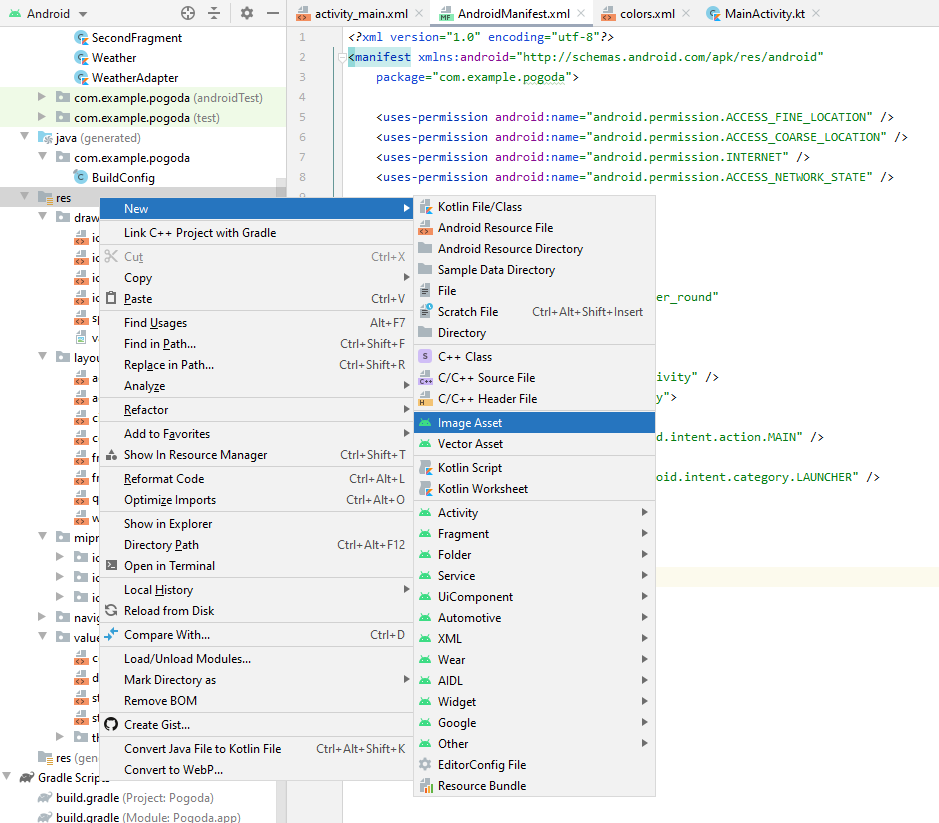
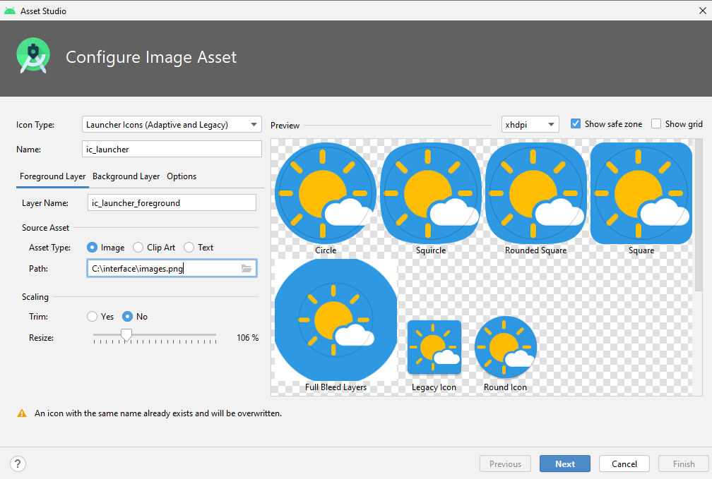
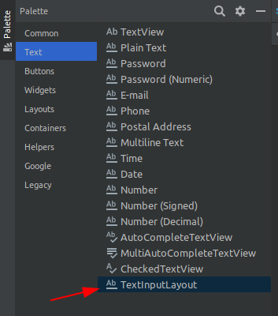
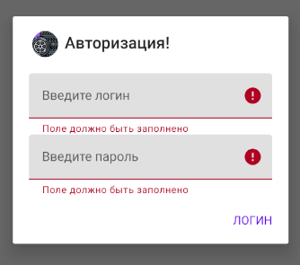

<table style="width: 100%;"><tr><td style="width: 40%;">
<a href="../articles/weather2.md">Проект погода (продолжение): SplashScreen (заставка). Выбор города. Выбор и отображение массива значений (почасовая, ежедневная). Разбор XML.
</a></td><td style="width: 20%;">
<a href="../readme.md">Содержание
</a></td><td style="width: 40%;">
<a href="../articles/wear_os.md">Wear OS
</a></td><tr></table>

# Проект "база". Авторизация на сервере (Basic auth, token). POST-запросы. API.

**Содержание**

* [API](#API)
* [Первичная настройка приложения](#Первичная-настройка-приложения)
* [Добавление альбомной ориентации](#Добавление-альбомной-ориентации)
* [~~Модальный диалог авторизации~~](#Модальный-диалог-авторизации)
* [Регулярные выражения](#Регулярные-выражения)
* [HTTP-запросы, методы, форматы, заголовки.](#HTTP-запросы-методы-форматы-заголовки)
* [Сохранение данных при работе приложения](#сохранение-данных-при-работе-приложения)
* [Фильтрация данных](#фильтрация-данных)
* [Spinner (выпадающий список)](#spinner-выпадающий-список)

## API

Приведу пример описания API, которое было на моём демо-экзамене:

>API  доступно по адресу http://car.areas.su/
>Для работы с API метод принимает в теле application/json
>Например:
>Метод входа. Ссылка http://cars.areas.su/login
>
>Request Body(application/json)
>```json
>{
>	"username":"serk",
>	"password":"123"
>}
>```
>
>Response
>
>```json
>{
>   "notice": 
>   {
>       "token":111520
>   }
>}
>```
>
>1 **/login** – метод для получения ключа для входа
>   - Используется метод POST
>   - Формат запроса JSON
>   - Принимает два ключа username и password
>   - ответ в формате JSON
>
>2 **/logout** – метод обнуления действия token
>   - Используется метод POST
>   - Формат запроса JSON
>   - Принимает ключ  username
>
>3 **/signup** – метод регистрации нового пользователя
>   - Используется метод POST
>   - Формат запроса JSON
>	- Принимает ключ  username, email, password
>
>4 **/cars** – метод для получения свободных автомобилей
>   - Используется метод GET
>   - Формат ответа JSON
>
>5 **/history** – метод для получения истории вождения
>   - Используется метод POST
>   - Формат запроса JSON
>   - **Принимает ключ  token**
>   - Формат ответа JSON

Несколько косноязычно и не расписаны "подводные камни". Логика авторизации такая, что если токен уже получен, то новый не выдается - нужно сначала разлогиниться.

Методы есть как публичные (**/cars**), так и требующие авторизации (**/history** - это видно по тому, что в параметрах требуется токен).

Я на примере этого разработал АПИ для ваших баз:

1. Создаем файл `api.http`:

    >Примеры запросов реализованы в формате плагина **REST Client** для Visual Studio Code

    Прописываем в нем URL сервера:

    ```
    @url=http://s4a.kolei.ru
    ```

2. Проверить работоспособность можно послав запрос **/about**:

    ```
    GET {{url}}/about
    ```

3. Для авторизации нужно послать **POST** запрос **/login** в формате `application/json` с параметрами *username* и *password* (соответственно логин и пароль к ВАШЕЙ базе MySQL)

    ```
    ### логин
    # @name login
    POST {{url}}/login
    Content-Type: application/json

    {
        "username": "esmirnov",
        "password": "111103"
    }

    ###
    @token={{login.response.body.$.notice.token}}
    ```

    Тут встречаются средства автоматизации **REST Client**-а:

    * `# @name login` этой командой мы присваиваем имя текущему запросу
    * `@token={{login.response.body.$.notice.token}}` а здесь, используя ответ команды достаём токен. Таким образом для последующих команд не надо выписывать на бумажке токен и править запросы.

    При успешном ответе придет токен авторизации:

    ```json
    {
        "notice": {
            "token": 2200743
        }
    }
    ```

    При ошибке текст ошибки в поле *answer*:

    ```json
    {
        "notice": {
            "answer": "Пользователь уже авторизован, используйте токен или перелогиньтесь"
        }
    }
    ```

    То есть при получении ответа вы должны разобрать полученный JSON, если есть токен, то можно продолжать работать. Если ошибка, то показать **Alert** с ошибкой и остаться на экране авторизации.

    >Маловероятно, но вдруг попадётся задача сделать "базовую авторизацию" (Basic Auth)
    >При таком методе авторизации в запрос нужно добавить заголовок `Authorization: Basic <логин:пароль в кодировке base64>`
    >
    >```kt
    >Base64.encodeToString(
    >   "$login:$password".toByteArray(), 
    >   Base64.NO_WRAP)
    >```
    >
    >Базовая авторизация позволяет использовать GET-запрос, т.к. в теле запроса ничего не предается

4. Для выхода нужно послать **POST** запрос **/logout** c параметом *username*:
 
    ```
    POST {{url}}/logout
    Content-Type: application/json

    {   
        "username": "esmirnov"
    }
    ```

5. Для запроса данных из базы нужно послать **GET** запрос с названием таблицы. В заголовке запроса передать токен полученный при авторизации.

    ```
    GET {{url}}/Product
    Content-Type: application/json
    Token: {{token}}
    ```

    В ответ должны получить содержимое таблицы:

    ```json
    {
        "notice": {
            "data": [
                {
                    "ID": 1,
                    "Title": "Колесо R18 Кованый",
                    "ProductTypeID": 128,
                    "ArticleNumber": "241659",
                    "Description": null,
                    "Image": "\\products\\tire_15.jpg",
                    "ProductionPersonCount": 4,
                    "ProductionWorkshopNumber": 10,
                    "MinCostForAgent": 11509
                },
                ...
            ]
        }
    }
    ```

6. Для получения изображений нужно выделить его название из поля *Image* и сформировать **GET** запрос:

    ```
    GET {{url}}/img/tire_0.jpg
    ```

    Обратите внимание, для загрузки картинок я использую не всю строку, которая у вас в базе (`\products\tire_0.jpg`), а только название файла.

    Чтобы вытащить название из строки можно использовать метод *split* - он делит исходную строку на список подстрок по указанному разделителю:

    ```kt
    val fileName = imageNameFromDB.split("\\").lastOrNull()
    if(fileName != null){
        ...
    }
    ```

    Если условие поиска в строке сложнее, то можно применить регулярные выражения:

    ```kt
    // то что мы хотим найти заключаем в круглые скобки (группы)
    val re = Regex("""\\products\\(.*)""")
    val res = re.find("""\products\tire_0.jpg""")
    // если регулярное выражение ничего не найдет, то вернёт null
    if(res != null){
        // искомый текст в ПЕРВОЙ группе 
        // (в 0 группе находится вся строка совпавшая с регулярным выражением)
        Log.d("KEILOG", res.groupValues[1])
    }
    ```

## Первичная настройка приложения

1. Создаем новый проект и сразу пытаемся его запустить.

    Если при сборке проекта выходит подобная ошибка, то нужно "понизить" версию зависимости, на которую ругается сборщик. Вообще эта ошибка означает, что какой-то пакет (в нашем случае **androidx.appcompat:appcompat:1.4.0**) требует более новой SDK, чем установлена. Но в **AVD** пока нет версий новее 30.

    ```
    The minCompileSdk (31) specified in a
    dependency's AAR metadata (META-INF/com/android/build/gradle/aar-metadata.properties)
    is greater than this module's compileSdkVersion (android-30).
    Dependency: androidx.appcompat:appcompat:1.4.0.
    ```

    Открываем `build.graddle (Module...)`, находим нужный пакет в зависимостях (секция **dependencies**) и уменьшаем минорную версию пакета. Например, если была версия **1.4.0**, то правим на **1.3.0**.

2. Устанавливаем иконку и название проекта.

    * Установка иконки:

        В контекстном меню папки ресурсов (**res**) выбираем `New -> Image asset`

        

        В появившемся окне в поле путь (**Path**) выбираем картинку (в нашем случае произвольную, а на демо-экзамене она должна быть в предоставленных ресурсах). Можно заодно задать имя ресурса в поле **Name**.

        

        Открываем манифест (`manifest/AndroidManifest.xml`) и в теге **application** правим атрибут `android:icon`:

        ```
        android:icon="@mipmap/ico"
        ```

    * установка названия приложения

        В принципе достаточно поменять в манифесте атрибут

        ```
        android:label="Название вашего приложения"
        ```

        Но на всякий случай можно завернуть его в ресурсы (вдруг на экзамене будет под это отдельный критерий):  

        В файле строковых ресурсов (`res/values/strings.xml`) добавить (исправить если уже есть) значение

        ```xml
        <string name="app_name">Восьмёрка</string>
        ``` 

        И в манифесте вставить указатель на строковый ресурс

        ```
        android:label="@string/app_name"
        ```

<!-- TODO перенести в тему про ImageView -->

Раньше как-то не пришло в голову, но часто графические ресурсы таскают сразу в приложении. По крайней мере в одном из заданий про банк иконки валют и стран прилагались к заданию. 

Это значит, что при получении, например, информации о валюте мы должны иконку тащить не из интернета, а из ресурсов.

Простая загрузка ресурса с ИЗВЕСТНЫМ id не сложная:

```kt
findViewById<ImageView>(R.id.ico)
    .setImageResource(
        R.drawable.ic_launcher_background
    )
```

Но при получении данных из интернета мы имеем НАЗВАНИЕ ресурса (файла), а не его id в приложении. Для поиска id по имени есть отдельный метод:

```kt
val icoId = resources
    .getIdentifier(
        "ic_launcher_background",   // название ресурса
        "drawable",                 // раздел, в котором находится ресурс
        this.packageName            // пакет
    )
// дальше как обычно    
findViewById<ImageView>(R.id.ico).setImageResource(icoId)
```

## Добавление альбомной ориентации

В окне разметки (acticity_main.xml) перейдите в режим "design" и кликните кнопку "Orientation..." выбираем "Create Landscape Variation"   


Система автоматически создаст Layout с альбомной ориентацией. 


>Учитывайте, что конструктор общий для всех ориентаций - при обращении к несуществующему объекту произойдет исключение.

Чтобы для разных ориентаций не рисовать одинаковую разметку (допустим список валют выводится в обеих ориентациях) можно вынести повторяющиеся куски разметки в отдельные файлы разметки (layout), а в нужные места вставить ссылку на них с помощью тега **include**

```xml
<include
    android:layout_width="wrap_content"
    android:layout_height="wrap_content"
    layout="@layout/my_cool_layout" />
```

В паре с **include** используется тег **merge**. Если выделяемый кусок разметки содержит несколько отдельных элементов, то по стандартам XML мы должны завернуть их в один родительский. Как раз тег **merge** и можно использовать в таком случае. Он игнорируется при разборе разметки и ни как на неё не влияет.

```xml
<merge 
    xmlns:android="http://schemas.android.com/apk/res/android">
 
    <Button
        android:layout_width="fill_parent" 
        android:layout_height="wrap_content"
        android:text="@string/add"/>
 
    <Button
        android:layout_width="fill_parent" 
        android:layout_height="wrap_content"
        android:text="@string/delete"/>
 
</merge>
```

Такие выделенные куски разметки можно использовать и в том случае, если один и тот же участок разметки используется в нескольких окнах.

<details>

<summary>Модальный диалог авторизации</summary>

## ~~Модальный диалог авторизации~~

Работа со внешними ресурсами подразумевает авторизацию (ввод логина/пароля). Для отображения формы авторизации можно использовать отдельное окно (это вы можете сделать и сами) или модальный диалог на текущем окне. Второй вариант рассмотрим подробнее.

>http://developer.alexanderklimov.ru/android/dialogfragment_alertdialog.php

Самый распространённый вариант диалогового окна - это **AlertDialog**.

В создаваемых диалоговых окнах можно задавать следующие элементы:

* заголовок
* текстовое сообщение
* кнопки: от одной до трёх
* список
* флажки
* переключатели

**AlertDialog с одной кнопкой**

Начнём с простого примера - покажем на экране диалоговое окно с одной кнопкой.

>Собственно такой диалог у нас уже используется для вывода сообщений об ошибках, другое дело, что я вам не рассказывал как он работает.

Создаём новый класс **LoginDialog**

```kt
// класс наследуется от DialogFragment
class LoginDialog : DialogFragment() {
    // и должен реализовать метод onCreateDialog
    override fun onCreateDialog(savedInstanceState: Bundle?): Dialog {
        return activity?.let {
            val builder = AlertDialog.Builder(it)

            // для диалога мы задаём название, сообщение и кнопку
            builder.setTitle("Важное сообщение!")
                .setMessage("Покормите кота!")
                // иконку я пока убрал, но как подцепить - понятно
                //.setIcon(R.drawable.hungrycat)
                // при добавлении кнопки сразу задается обработчик, 
                // которы просто закрывает диалог
                .setPositiveButton("ОК, иду на кухню") {
                        dialog, id ->  dialog.cancel()
                }
            builder.create()
        } ?: throw IllegalStateException("Activity cannot be null")
    }
}   
```

Для показа этого диалога нужно вызвать конструктор с методом *show*

```kt
LoginDialog().show(supportFragmentManager, "loginDialog")
```

**AlertDialog со списком**

Расписывать его я не буду, просто замечу, что выбор города можно было сделать таким диалогом

В билдере вместо задания текста и кнопки задается список с обработчиком клика:

```kt
.setItems(catNames) { dialog, which ->
    Toast.makeText(
            activity, 
            "Выбранный кот: ${catNames[which]}",
            Toast.LENGTH_SHORT)
        .show()
}
```

Параметр *which* содержит номер позиции, которую выбрали в списке

>Можно прицепить и кнопку "Отмена"

**AlertDialog с собственной разметкой**

Если стандартный вид **AlertDialog** нас не устраивает, то можем придумать свою разметку и подключить её через метод *setView()*

Сделаем диалоговое окно для авторизации (приведу сразу готовый код с комментариями):

*Сначала рисуем разметку.*

СОЗДАЕМ НОВЫЙ ФАЙЛ РАЗМЕТКИ (в контекстном меню layout)

>В разметке я рисую свою кнопку "Логин". Теоретически можно использовать стандартную "позитивную" кнопку диалога, но при клике на такую кнопку диалог автоматически закрывается и я никак не смог переопределить её поведение (а нам сразу закрываться нельзя - мы сначала должны проверить все ли поля заполнены)

Создаем, как обычно, дополнительный layout. Корневой элемент мой любиный **LinearLayout**.

Чтобы форма не "прилипала" к границам диалога задаю у **LinearLayout** отступы: `android:padding="20dp"`

В качестве текстовых полей ввода я использую элемент **TextInputLayout** - он позволяет показать рядом с полем текст ошибки.

    

Для поля "**Логин**" задаём *тип ввода* `android:inputType="textPersonName"` и *подсказку* `android:hint="Введите логин"`.

Для поля "**Пароль**" задаём *тип ввода* `android:inputType="textPassword"` и *подсказку*

Вместо кнопки я использую обычный **TextView**, стилизовав его под стандартную кнопку диалога

```
android:layout_marginTop="20dp"
android:gravity="right"
android:textColor="@color/design_default_color_primary"
```

```xml
<?xml version="1.0" encoding="utf-8"?>
<LinearLayout xmlns:android="http://schemas.android.com/apk/res/android"
    xmlns:app="http://schemas.android.com/apk/res-auto"
    android:orientation="vertical"
    android:layout_width="match_parent"
    android:layout_height="match_parent"
    android:padding="20dp">

    <com.google.android.material.textfield.TextInputLayout
        android:id="@+id/login_error"
        android:layout_width="match_parent"
        android:layout_height="match_parent"
        app:errorEnabled="true"
        >

        <com.google.android.material.textfield.TextInputEditText
            android:id="@+id/login"
            android:layout_width="match_parent"
            android:layout_height="wrap_content"
            android:inputType="textPersonName"
            android:hint="Введите логин"
            />
    </com.google.android.material.textfield.TextInputLayout>

    <com.google.android.material.textfield.TextInputLayout
        android:id="@+id/password_error"
        android:layout_width="match_parent"
        android:layout_height="match_parent"
        app:errorEnabled="true"
        >

        <com.google.android.material.textfield.TextInputEditText
            android:id="@+id/password"
            android:layout_width="match_parent"
            android:layout_height="wrap_content"
            android:inputType="textPassword"
            android:hint="Введите пароль"
            />
    </com.google.android.material.textfield.TextInputLayout>

    <TextView
        android:id="@+id/login_button"
        android:layout_width="match_parent"
        android:layout_height="wrap_content"
        android:layout_marginTop="20dp"
        android:gravity="right"
        android:textColor="@color/design_default_color_primary"
        android:text="ЛОГИН"
        />

</LinearLayout>
```

*Дальше переделываем класс диалога*

**Во-первых**, в параметры конструктора я добавил лямбда-функцию обратного вызова, чтобы получать логин и пароль в том классе, где он нужны.

**Во-вторых**, достаём из ресурсов наш *login_layout* и из него ссылки на все используемые элементы.

Диалог создаём как обычно (но без кнопок)

И, **в-третьих**, задаём обработчик кнопке "Логин". В этом обработчике мы просто проверяем заполнены ли поля, если нет, то показываем ошибки. Если же всё нормально, то закрываем модальное окно и вызываем функцию обратного вызова с заполненными логином и паролем.

Обратите внимание, метод *onCreateDialog* должен вернуть указатель на созданные диалог - это последняя строчка лямбда выражения.

```kt
class LoginDialog(private val callback: (login: String, password: String)->Unit) : DialogFragment() {

    override fun onCreateDialog(savedInstanceState: Bundle?): Dialog {
        return activity?.let {
            val builder = AlertDialog.Builder(it)

            val loginLayout = layoutInflater.inflate(R.layout.activity_login, null)

            val loginText = loginLayout.findViewById<com.google.android.material.textfield.TextInputEditText>(R.id.login)
            val loginError = loginLayout.findViewById<com.google.android.material.textfield.TextInputLayout>(R.id.login_error)
            val passwordText = loginLayout.findViewById<com.google.android.material.textfield.TextInputEditText>(R.id.password)
            val passwordError = loginLayout.findViewById<com.google.android.material.textfield.TextInputLayout>(R.id.password_error)
            val loginButton = loginLayout.findViewById<TextView>(R.id.login_button)

            val myDialog = builder.setView(loginLayout)
                .setTitle("Авторизация!")
                .setIcon(R.mipmap.ico)
                .create()

            loginButton.setOnClickListener {
                var hasErrors = false
                if(loginText.text.isNullOrEmpty()){
                    hasErrors = true
                    loginError.error = "Поле должно быть заполнено"
                }
                else
                    loginError.error = ""

                if(passwordText.text.isNullOrEmpty()){
                    hasErrors = true
                    passwordError.error = "Поле должно быть заполнено"
                } else
                    passwordError.error = ""

                if(!hasErrors) {
                    myDialog.dismiss()
                    callback.invoke(
                        loginText.text.toString(),
                        passwordText.text.toString()
                    )
                }
            }

            myDialog
        } ?: throw IllegalStateException("Activity cannot be null")
    }
}
```

В итоге должна получиться такая форма



Ну и не забываем в основном окне добавить в параметры конструктора лямбда-выражение, в котором мы получим логин и пароль.

```kt
LoginDialog { login, password ->
    Log.d("KEILOG", "${login}/${password}")
}.show(supportFragmentManager, null)
```

</details>

## Регулярные выражения

Возможно будет задание сделать форму регистрации. В этом случае обычно нужно сделать проверку введенных данных. Например, электронной почты

```kt
val re = Regex("""^\S+\@\S+\.\w+$""")
if(re.containsMatchIn("kolei@ya.ru")){

}
```

## HTTP-запросы, методы, форматы, заголовки.

В шпаргалке лежит доработанный класс [**HTTP**](../shpora/HttpHelper.kt).

```kt
object Http {
    private val client = OkHttpClient()

    fun buildRequest(url: String, data: String? = null, method: String = "GET", headers: Map<String, String>? = null): Request {
        val json = "application/json; charset=utf-8".toMediaTypeOrNull()
        val request = Request.Builder().url(url)
        if (data != null)
            request.post(data.toRequestBody(json))
        else
            request.get()

        if(headers!=null){
            for((key, value) in headers){
                request.addHeader(key, value)
            }
        }

//            .addHeader("Authorization", "Bearer ${_token}")
        return request.build()
    }

    fun call(url: Any, callback: (response: Response?, error: Exception?)->Unit) {
        var request: Request = when (url) {
            is String -> Request.Builder()
                .url(url)
                .build()
            is Request -> url as Request
            else -> {
                callback.invoke(null, Exception("Не верный тип параметра \"url\""))
                return
            }
        }
        client.newCall(request).enqueue(object : Callback {
            override fun onFailure(call: Call, e: IOException) {
                callback.invoke(null, Exception(e.message!!))
            }

            override fun onResponse(call: Call, response: Response) {
                response.use {
                    callback.invoke(response, null)
                }
            }
        })
    }
}
```

Разберём что тут понаписано:

```kt
object Http {...}
```

>Ключевое слово **object** одновременно объявляет класс и создаёт его экземпляр (*singleton*).

```kt
fun call(
    url: Any, 
    callback: (response: Response?, error: Exception?)->Unit) 
{
    var request: Request = when (url) {
        is String -> Request.Builder()
            .url(url)
            .build()
        is Request -> url as Request
        else -> {
            callback.invoke(
                null, 
                Exception("Не верный тип параметра \"url\""))
            return
        }
    }
    ...
```

**call** - основной метод этого класса, он, собственно, и запускает запрос. Я сделал его универсальным: на входе ему можно передать либо просто строку URL, либо подготовленный объект **Request** (он нам понадобится, чтобы посылать запросы с методом POST, данными и заголовками)

```kt
fun buildRequest(url: String, data: String? = null, headers: Map<String, String>? = null): Request {
    val json = "application/json; charset=utf-8".toMediaTypeOrNull()
    val request = Request.Builder().url(url)
    if (data != null)
        request.post(data.toRequestBody(json))
    else
        request.get()

    if(headers!=null){
        for((key, value) in headers){
            request.addHeader(key, value)
        }
    }
    return request.build()
}
```

**buildRequest** - вспомогательный метод, который облегчает построение объекта Request.

>Этот метод заточен на посылку GET или POST запросов с типом данных JSON (заголовок `Content-Type: application/json` добавляется автоматически). Если понадобится послать другой метод (PUT, PATCH, DELETE) или данные другого типа, то можно сформировать объект **Request** самим и передать его в метод **call**

Дальше по ходу лекции мы разберёмся с различными примерами использования этого метода (но они есть и в комментариях в начале файла)

Итак, мы получили от формы авторизации логин и пароль.

По клику на кнопке "Авторизоваться" пытаемся получить токен авторизации

```kt
// первым делом сохраняем имя пользователя, 
// чтобы при необходимости можно было разлогиниться
username = login

// затем формируем JSON объект с нужными полями
val json = JSONObject()
json.put("username", login)
json.put("password", password)

// и вызываем POST-запрос /login
Http.call(
    Http.buildRequest(
        "http://s4a.kolei.ru/login",
        json.toString()
    )
) { response, error ->
    try {
        // если в запросе получено исключение, то "выбрасываем" его
        if (error != null) throw error

        // если ответ получен, но код не 200, то тоже "выбрасываем" исключение
        if (!response!!.isSuccessful) throw Exception(response.message)


        // анализируем ответ
        val jsonResp = JSONObject(response.body!!.string())

        // если нет объекта notice
        if(!jsonResp.has("notice"))
            throw Exception("Не верный формат ответа, ожидался объект notice")

        // есть какая-то ошибка
        if(jsonResp.getJSONObject("notice").has("answer"))
            throw Exception(jsonResp.getJSONObject("notice").getString("answer"))

        // есть токен!!!
        if(jsonResp.getJSONObject("notice").has("token")) {
            // сохраняем токен в свойстве класса
            token = jsonResp.getJSONObject("notice").getString("token")

            runOnUiThread {
                // тут можно переходить на следующее окно
                Toast.makeText(this, "Success get token: $token", Toast.LENGTH_LONG)
                    .show()
            }
        }
        else
            throw Exception("Не верный формат ответа, ожидался объект token")
    } catch (e: Exception) {
        // любую ошибку показываем на экране
        runOnUiThread {
            AlertDialog.Builder(this)
                .setTitle("Ошибка")
                .setMessage(e.message)
                .setPositiveButton("OK", null)
                .create()
                .show()
        }
    }
}
```

Если мы уже авторизованы и получили в ответ соответсвующую ошибку, то нужно предусмотреть на форме кнопку "Выход" (Logout) и реализовать обработчик (для краткости я убрал проверку результата в начале и обработку исключения в конце - добавьте сами):

```kt
// тут для примера я формирую JSON-строку 
// без использования класса JSONObject
Http.call(Http.buildRequest(
    "http://s4a.kolei.ru/logout", 
    """{"username":"${userName}"}"""))
{response, error ->
    try {
        ...

        // при выходе не забываем стереть существующий токен
        token = ""

        // каких-то осмысленных действий дальше не предполагается
        // разве что снова вызвать форму авторизации
        runOnUiThread {
            Toast.makeText(this, "Logout success!", Toast.LENGTH_LONG).show()
        }

        ...
```

Ну и последний на сегодня запрос - запрос списка продукции (его нужно вызывать уже из другого **activity**, передав ему токен):

```kt
Http.call(
    Http.buildRequest(
        "http://s4a.kolei.ru/Product",
        headers = mapOf("token" to token)
    )
) { response, error ->
    ...
```

Как видите, в параметры метода **buildRequest** я добавил заголовки, чтобы можно было добавить токен. Дальнейшая реализация уже с вас.


## Сохранение данных при работе приложения

Специфика жизненного цикла **activity** такова, что при каждом чихе (смена ориентации, языка и т.п.) окно пересоздаётся То есть все наши данные теряются.

Гугл рекомендует нам пользоваться событиями *onSaveInstanceState* и *onRestoreInstanceState* которые вызываются, соответственно, при удалении **activity** и при восстановлении.

В параметрах этих функций передаётся объект, в который (и из которого) мы можем сохранить нужные нам данные и потом восстановить.

Но хранить в таком объекте можно только скалярные данные (т.е. базовые типы типа "целое", "строка" и т.п.). Чтобы сохранить более-менее сложный объект, например, массив продукции, нужно использовать сериализацию/десериализацию.

Есть ещё более модная концепция **LiveData** - но там даже у меня происходит вывих мозга (это самая правильная концепция и если вы не дай бог станете таки андроид-разработчиками, то разобраться в ней надо).

Но ещё есть простой рабоче-крестьянский вариант с глобальными переменными. Само понятие глобальные переменные противоречит одному из основных постулатов ООП - **инкапсуляция**, поэтому его не рекомендуется использовать в сколько-нибудь серъезных проектах.

1. Создайте класс **MyApp**, который наследуется от класа **Application** и внутри опишите **публичные** переменные, которые можно будет использовать во всех **activity** нашего приложения

    ```kt
    class MyApp: Application() {
        var token = ""
        var username = ""
    }
    ```

2. В манифесте в тег **application** добавьте атрибут `android:name=".MyApp"`, где `.MyApp` это имя созданного нами ранее класса

3. В классах, где нам нужны глобальные переменные создаем переменную, которая будет хранить указатель на **MyApp**

    ```kt
    private lateinit var app: MyApp
    ```

    В конструкторе класса проинициализируйте её

    ```kt
    app = applicationContext as MyApp
    ```

    И дальше в коде можете её использовать

    ```kt
    if(app.token.isEmpty()){
        // 
    }
    else {
        // 
    }
    ```

## Фильтрация данных

В нормальных АПИ должна быть предусмотрена фильтрация набора данных на сервере, то есть вам придут только те данные, которые нужны. Но на моём сервере АПИ простенькое (зато универсальное), оно просто отдаёт ту таблицу в базе, которую вы запросите (нам это не страшно, так как таблицы у нас коротенькие). 

Из-за этого возникает необходимость отфильтровать отображаемые данные.

Делается это элементарно - создаётся ещё один список соотвествующего типа. Причём основной список имеет смысл вынести в класс приложения (MyApp) и заполнять только при первом обращении к нему (size==0).

У нас задача немного осложняется тем, что связь между продуктами и материалами **многие-ко-многим** и для выковыривания материалов продукта надо считать ещё таблицу связей **ProductMaterial**.

Имеет смысл и таблицу связей сразу считать в класс приложения (глобальный), а при переходе в продукт составлять локальный список идентификаторов материалов и затем искать по таблице материалов те, которые входят в этот список (`<List>.contains`)

## Spinner (выпадающий список)

Для реализации выпадающего списка (например, отфильтруем продукцию по типу) нужно в разметку добавить элемент **Spinner**

```xml
<Spinner
    android:id="@+id/productTypeSpinner"
    ...
```

Создать класс **ProductType** (не **data**, а обычный) и переопределить в нём метод *toString*, чтобы в выпадающем списке показывало то что нам нужно

```kt
class ProductType (val id: Int, val title: String){
    override fun toString(): String {
        return title
    }
}
```

В классе основного окна (в том, где вы будете использовать выпадающий список) создайте список для хранения типов продукции, получите указатель на элемент и назначте ему адаптер:

```kt
val productTypeList = ArrayList<ProductType>()
...
productTypeSpinner.adapter = ArrayAdapter(
    this, 
    R.layout.producttype_spinner, 
    productTypeList)
```

Вторым параметром передаётся **layout** файл, в котором должен быть элемент **TextView** с `id="@android:id/text1"`

```xml
<?xml version="1.0" encoding="utf-8"?>
<TextView 
    xmlns:android="http://schemas.android.com/apk/res/android"
    android:id="@android:id/text1"
    style="?android:attr/spinnerItemStyle"
    android:layout_width="match_parent"
    android:layout_height="80dp"
    android:ellipsize="marquee"
    android:gravity="center_vertical"
    android:singleLine="false"
    android:textSize="20dp" />
```

Затем получить список типов продукции (http-запрос) и заполнить ими массив (с этим вы уже должны справиться сами) не забыв уведомить адаптер, что данные изменились

```kt
(productTypeSpinner.adapter as ArrayAdapter<*>).notifyDataSetChanged()
```

И при выборе элемента списка сделать фильтрацию списка продукции (тоже сделайте сами)

<!-- TODO вроде нигде не расписано как делать фильтрацию - написать -->

```kt
productTypeSpinner.onItemSelectedListener = object : AdapterView.OnItemSelectedListener{
    override fun onItemSelected(
        parent: AdapterView<*>?,
        view: View?,
        position: Int,
        id: Long
    ) {
        // тут реализовать фильтрацию
    }

    override fun onNothingSelected(parent: AdapterView<*>?) {}
}
```

# Задание

* на первый экран добавить заставку (splash-screen) с таймером на пару секунд, только потом показывать диалог для ввода логина/пароля
* после авторизации и получения токена перейти на другое окно (activity), на котором получить и вывести в вертикальный RecyclerView список продукции (с картинками)
* на окне со списком продукции сделать кнопку "выход" (logout), после чего вернуться на экран авторизации. У нас после первой авторизации осталось имя, сделайте передачу имени в диалог авторизации, чтобы он был уже заполнен.

<table style="width: 100%;"><tr><td style="width: 40%;">
<a href="../articles/weather2.md">Проект погода (продолжение): SplashScreen (заставка). Выбор города. Выбор и отображение массива значений (почасовая, ежедневная). Разбор XML.
</a></td><td style="width: 20%;">
<a href="../readme.md">Содержание
</a></td><td style="width: 40%;">
<a href="../articles/wear_os.md">Wear OS
</a></td><tr></table>