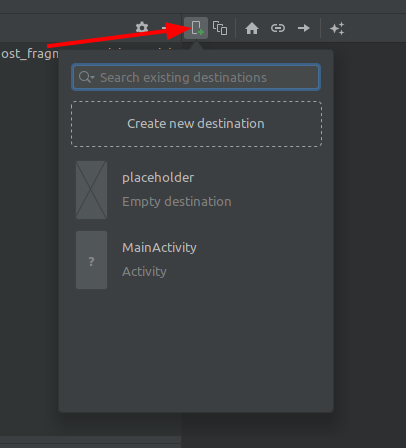
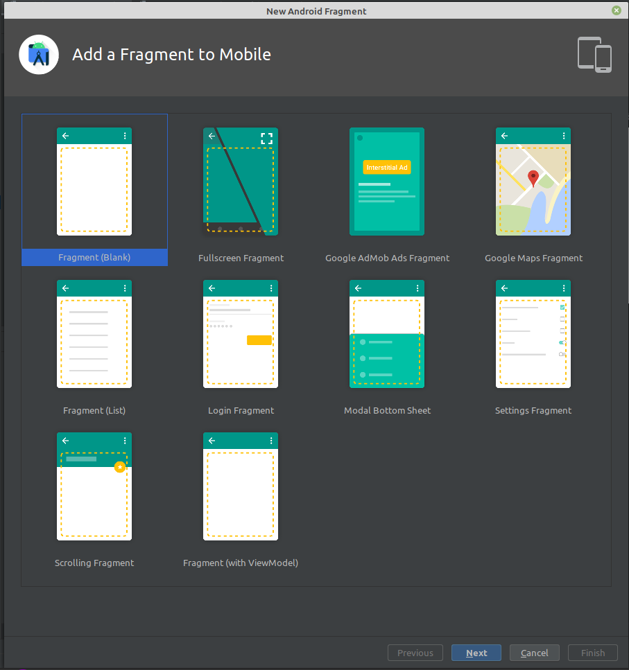
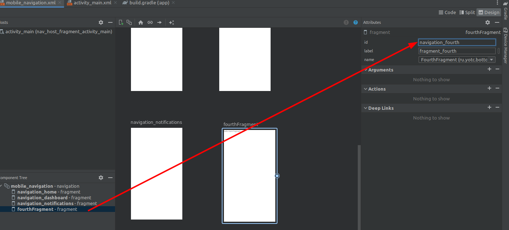
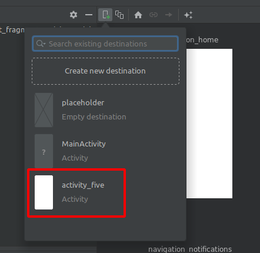

Предыдущая лекция | &nbsp; | Следующая лекция
:----------------:|:----------:|:----------------:
[Фрагменты](./fragments.md) | [Содержание](../readme.md#практика-разработка-мобильных-приложений) | [Анимация](./animation.md)

# Навигация в приложении. Начало работы с Navigation Architecture Component. Знакомство с BottomNavigationView.

>Содрано [отсюда](https://www.fandroid.info/17-android-bottom-navigation/)

На этой лекции познакомимся с нижней панелью навигации BottomNavigationView, которая позволяет переходить между экранами – пунктами назначения навигации, а также наглядно информирует пользователя о том, на каком экране он находится. Разберемся, как добавить Bottom Navigation в андроид приложение и как добавить в BottomNavigationView новые фрагменты.

## Содержание

* [Navigation Architecture Component](#navigation-architecture-component)
* [Создаем проект](#создаем-проект)
* [Неоходимые библиотеки](#неоходимые-библиотеки)
* [Граф навигации](#граф-навигации)
* [Добавление экранов](#добавление-экранов)
* [Хост навигации](#хост-навигации)
* [BottomNavigationView](#bottomnavigationview)
* [Добавление пунктов меню](#добавление-пунктов-меню)
* [Добавление идентификаторов в контроллер навигации](#добавление-идентификаторов-в-контроллер-навигации)
* [Рефакторинг](#рефакторинг)
* [Использование активности в качестве destination](#использование-активности-в-качестве-destination)

## Navigation Architecture Component

**Navigation Architecture Component** это библиотека, которая позволяет пользователям перемещаться между различными частями контента в вашем приложении. Компонент навигации входит в набор компонентов Android Jetpack и помогает реализовать навигацию, от простых нажатий кнопок до более сложных шаблонов, таких как панели приложений (appbars) и панель навигации (navigation drawer). Компонент навигации также обеспечивает согласованное и предсказуемое взаимодействие с пользователем.

**Navigation Architecture Component** упрощает осуществление навигации, а также помогает визуализировать *navigation flow* вашего приложения. Библиотека предоставляет ряд преимуществ, в том числе:

* Автоматическая обработка транзакций фрагментов
* Корректная обработка кнопок «Вверх» и «Назад» по умолчанию
* Поведение по умолчанию для анимации и переходов
* Deep linking как first class operation
* Реализация шаблонов навигации пользовательского интерфейса (таких как navigation drawer и bottom navigation) с небольшой дополнительной работой
* Безопасность типов при передаче информации во время навигации
* Инструменты Android Studio для визуализации и редактирования navigation flow приложения
 
## Создаем проект

Cоздать простое приложение с панелью навигации можно, не написав ни одной строчки кода. Достаточно воспользоваться готовым макетом **Bottom Navigation Activity** на этапе создания проекта в **Android Studio**. При этом создается проект приложения с нижней панелью навигации **BottomNavigationView** на главном экране, в которой отображается три пункта. При нажатии каждого из них меняются экраны приложения. Это все хорошо, скажете вы, но если нужно добавить или убрать экраны и пункты для них? Или добавить нижнюю навигацию в существующее приложение?

Ок, давайте изучим структуру проекта, созданного по шаблону, и по ходу попробуем добавить сюда пару новых экранов и пунктов для них.

## Необходимые библиотеки

Если открыть файл сборки `build.gradle`, в секции **dependencies** можно увидеть подключенные библиотеки из пакета `androidx.navigation` (с ktx  для проектов на kotlin)  которые нам уже знакомы по предыдущим урокам на тему навигации в приложении. Если вы добавляете нижнюю навигацию в существующее приложение, то начинать нужно с добавления этих библиотек в ваш проект.

```
implementation 'androidx.navigation:navigation-fragment-ktx:2.5.2'
implementation 'androidx.navigation:navigation-ui-ktx:2.5.2'
```

## Граф навигации

Архитектурный компонент **Navigation** позволяет упростить реализацию навигации между экранами в вашем приложении. По умолчанию, **Navigation** поддерживает фрагменты (**Fragments**) и активности (**Activities**) в качестве экранов назначения. Набор экранов назначения называется **навигационным графом (navigation graph) приложения**.

Помимо экранов назначения на *навигационном графе* есть соединения между ними, называемые *действиями (actions)*. Следующий рисунок демонстрирует визуальное представление *навигационного графа* для простого приложения из шести экранов назначения, соединённых пятью действиями.


### Обзор компонента навигации

Компонент навигации состоит из трех ключевых частей:

* **Navigation graph**: ресурс XML, который содержит всю связанную с навигацией информацию в одном централизованном месте. Он включает в себя все отдельные области содержимого в вашем приложении, называемые *destinations (пункты назначения)*, а также возможные пути, которые пользователь может пройти через ваше приложение.
* **NavHost**: Пустой контейнер, который отображает пункты назначения из вашего графика навигации. Компонент **Navigation** содержит реализацию **NavHost** по умолчанию — **NavHostFragment**, которая отображает фрагменты — места назначения.
* **NavController**: Объект, который управляет навигацией приложения в **NavHost**. **NavController** управляет перемещениями контента мест назначения в **NavHost**, в процессе перемещения пользователей по приложению.
 
Мы используем объект **NavController**, сообщая ему путь в ресурсе **Navigation Graph**. Затем объекту **NavController** будет показан соответствующий пункт назначения в **NavHostFragment**.

Давайте посмотрим, как это выглядит на практике, начиная с нового ресурса **Navigation Graph**.

### Destinations

Компонент навигации представляет концепцию **Destinations** —  пункта назначения. Пункт назначения — это любое место, в которе вы можете перемещаться в приложении, обычно это *фрагмент* или *активность*. Они поддерживаются «из коробки».

### Navigation Graph

**Navigation Graph** представляет собой новый тип ресурса, который определяет все возможные пути, доступные пользователю в приложении. Он показывает визуально все пункты назначения, которые могут быть достигнуты из данного пункта назначения. **Редактор навигации** Android Studio отображает **Navigation Graph** наглядно.

### Редактор навигации

1. Откройте файл `res/navigation/mobile_navigation.xml` 

1. Перейдите в режим «Дизайн»:

    

    **Navigation Graph** показывает доступные пункты назначения. Стрелки между пунктами назначения называются *actions (действия)*. О них мы поговорим позже.

1. В панели атрибутов (справа) можно посмотреть и отредактировать атрибуты пунктов назначения и действий.

### Анатомия навигационного XML-файла

Все изменения, которые вы делаете в графическом редакторе навигации, изменяют базовый XML-файл, подобно тому, как редактор макетов изменяет XML-макет.

Перейдите на вкладку «Code»:

Вы увидите такой XML-код:

```xml
<navigation 
    xmlns:android="http://schemas.android.com/apk/res/android"
    xmlns:app="http://schemas.android.com/apk/res-auto"
    xmlns:tools="http://schemas.android.com/tools"
    
    app:startDestination="@+id/navigation_home"
>

    <!-- здесь находятся теги с фрагментами и активностями -->

</navigation>
```

**Примечание:**

* `<navigation>` является корневым узлом каждого навигационного графа.
* `<navigation>` содержит один или несколько пунктов назначения, представленных элементами `<activity>` и/или `<fragment>`.
* `app:startDestination` является атрибутом, который указывает место назначения, которое запускается по умолчанию, когда пользователь впервые открывает приложение.

Давайте посмотрим на один из *destination*:

```xml
<fragment
    android:id="@+id/navigation_home"
    android:name="ru.yotc.ui.home.HomeFragment"
    android:label="@string/title_home"
    tools:layout="@layout/fragment_home"
>
    <argument
        .../>

    <action
        android:id="@+id/next_action"
        app:destination="@+id/flow_step_two_dest">
    </action>
</fragment>
``` 

**Примечание:**

* **android:id** определяет идентификатор для фрагмента, который вы можете использовать для ссылки на место назначения в другом месте этого XML и вашего кода.
* **android:name** объявляет полное имя класса фрагмента для создания экземпляра при переходе к этому месту назначения.
* **tools:layout** указывает, какой макет должен отображаться в графическом редакторе.

Некоторые теги `<fragment>` также могут содержать `<action>`, `<argument>` и `<deepLink>`, их мы рассмотрим позже.

Пример приложения уже содержит несколько пунктов назначения на графе. Давайте мы добавим новое назначение.

### Добавление нового назначения в граф навигации

1. Создайте новый фрагмент с именем **SettingsFragment** (в контекстном меню `res -> layout` выбрать *new fragment*)

1. Откройте файл `res/navigation/mobile_navigation.xml`

1. Нажмите значок «Новый пункт назначения» и выберите «fragment_settings»

    

Результатом является новое назначение, которое отображает предварительный просмотр макета фрагмента в окне конструктора.

Обратите внимание, что вы также можете редактировать XML-файл напрямую, чтобы добавить места назначения: `mobile_navigation.xml`

```xml
<fragment
    android:id="@+id/settingsFragment"
    android:name="ru.yotc.baza.SettingsFragment"
    android:label="fragment_settings"
    tools:layout="@layout/fragment_settings" />
```

## Добавление экранов

Нажмите кнопку `New destination` вверху и выберите `Create new destination`. На экране добавления фрагментов выберите шаблон `Fragment (Blank)` (в оригинальной статье предлагают выбрать `Fragment with ViewModel`, но мы **ViewModel** не разбирали).  





Добавьте один за другим два фрагмента – четвертый и пятый экран. Я их так и назову: **FourthFragment**  и **FifthFragment**.

В граф навигации добавилось два фрагмента. Переименуйте их идентификаторы в соответствии с именами других пунктов назначения: `navigation_fourth` и `navigation_fifth`.



Либо в режиме "кода":

```
<fragment
    android:id="@+id/navigation_fourth"
    android:name="info.fandroid.bottomnavapplication17.ui.fourth.FourthFragment"
    android:label="@string/title_fourth"
    tools:layout="@layout/fourth_fragment" />
<fragment
    android:id="@+id/navigation_fifth"
    android:name="info.fandroid.bottomnavapplication17.ui.fifth.FifthFragment"
    android:label="@string/title_fifth"
    tools:layout="@layout/fifth_fragment" />
```

Можно было оставить идентификаторы как было, но более правильно с точки зрения *Code Convention*, чтобы названия однотипных элементов были логически похожими. Да и находить их будет легче потом.

Также измените значение параметра `android:label` — оно используется для заголовка экрана. Впишите сюда текст, который вы хотите видеть в заголовке соответствующего экрана, желательно сохранить его затем в строковых ресурсах. Для сохранения нажмите желтую лампочку и выберите пункт «Extract string resourse», а затем придумайте название строки, которая сохранится в файле res/values/strings.xml.

На этом добавление экранов закончено. Но, если запустить приложение сейчас, они не будут отображаться, и нижняя панель навигации никак не изменится. Что ж, идем дальше.

## Хост навигации

Если мы откроем папку `layout`, то увидим макеты всех фрагментов – пунктов назначения, и макет главной активности.

Макет `activity_main.xml` содержит компонент *fragment* – это хост навигации, в котором отображаются фрагменты – пункты назначения. Он связан с графом навигации через параметр `app:navGraph`.

```xml
<?xml version="1.0" encoding="utf-8"?>
<androidx.constraintlayout.widget.ConstraintLayout 
    xmlns:android="http://schemas.android.com/apk/res/android"
    xmlns:app="http://schemas.android.com/apk/res-auto"
    android:id="@+id/container"
    android:layout_width="match_parent"
    android:layout_height="match_parent"
    android:paddingTop="?attr/actionBarSize">

    <com.google.android.material.bottomnavigation.BottomNavigationView
        android:id="@+id/nav_view"
        android:layout_width="0dp"
        android:layout_height="wrap_content"
        android:layout_marginStart="0dp"
        android:layout_marginEnd="0dp"
        android:background="?android:attr/windowBackground"
        app:layout_constraintBottom_toBottomOf="parent"
        app:layout_constraintLeft_toLeftOf="parent"
        app:layout_constraintRight_toRightOf="parent"
        app:menu="@menu/bottom_nav_menu" />

    <fragment
        android:id="@+id/nav_host_fragment_activity_main"
        android:name="androidx.navigation.fragment.NavHostFragment"
        android:layout_width="match_parent"
        android:layout_height="match_parent"
        app:defaultNavHost="true"
        app:layout_constraintBottom_toTopOf="@id/nav_view"
        app:layout_constraintLeft_toLeftOf="parent"
        app:layout_constraintRight_toRightOf="parent"
        app:layout_constraintTop_toTopOf="parent"
        app:navGraph="@navigation/mobile_navigation" />

</androidx.constraintlayout.widget.ConstraintLayout>
```

## BottomNavigationView

Также здесь присутствует и компонент **BottomNavigationView**. Это и есть нижняя панель навигации. Компонент **BottomNavigationView** является частью библиотеки компонентов материального дизайна. 

>Эта библиотека должна быть импортирована в файле сборки модуля (она уже есть в проекте по умолчанию):
>
>```txt
>dependencies {    
>    implementation 'com.google.android.material:material:<version>'    
>}
>```

Рассмотрим компонент **BottomNavigationView** боле подробно.

Параметр `android:background` содержит ссылку на атрибут `windowBackground` и делает фон панели такой же, как фон экрана.

>На сайте `material.io` можно найти много полезных рекомендаций как по дизайну, так и по реализации компонентов визуального интерфейса. На странице *Bottom Navigation*, например, указано, что рекомендованное число элементов панели нижней навигации должно быть от трех до пяти. Подписи должны быть максимально короткими и состоять, по возможности, из одного слова.
>
>На вкладе implementation дается пример реализации нижней панели без графа навигации, а также примеры кастомизации и оформления фона и цвета пунктов нижней панели, добавления пунктам бейджей и т.д.

## Добавление пунктов меню

Но вернемся к нашему проекту и компоненту **BottomNavigationView** в макете `activity_main.xml`.

Нас интересует последний параметр:

```xml
app:menu="@menu/bottom_nav_menu"
```

Он ссылается на файл `bottom_nav_menu.xml` в папке `res/menu`. Этот файл содержит описание пунктов меню нижней панели навигации. Следовательно, добавлять новые пункты следует здесь.

```xml
<?xml version="1.0" encoding="utf-8"?>
<menu 
    xmlns:android="http://schemas.android.com/apk/res/android">

    <item
        android:id="@+id/navigation_home"
        android:icon="@drawable/ic_home_black_24dp"
        android:title="@string/title_home" />

    <item
        android:id="@+id/navigation_dashboard"
        android:icon="@drawable/ic_dashboard_black_24dp"
        android:title="@string/title_dashboard" />

    <item
        android:id="@+id/navigation_notifications"
        android:icon="@drawable/ic_notifications_black_24dp"
        android:title="@string/title_notifications" />

    <item
        android:id="@+id/navigation_fourth"
        android:icon="@drawable/ic_notifications_black_24dp"
        android:title="Четвёртый" />

</menu>
```

Добавим пару элементов `<item>` для четвертого и пятого фрагментов. Их идентификаторы должны совпадать с идентификаторами пунктов назначения в графе навигации. Также укажите соответствующие строковые ресурсы в качестве названия пунктов в `android:title`.

## Добавление идентификаторов в контроллер навигации

Осталось добавить идентификаторы пунктов навигации в конфигурацию контроллера навигации в классе **MainActivity**.

```kt
override fun onCreate(savedInstanceState: Bundle?) {

    ...

    val appBarConfiguration = AppBarConfiguration(
        setOf(
            R.id.navigation_home, 
            R.id.navigation_dashboard, 
            R.id.navigation_notifications,
            R.id.navigation_fourth
        )
    )

    ...
}
```
    
Переменная класса **АppBarConfiguration** содержит набор идентификаторов пунктов навигации и передается вместе с контроллером – хостом навигации – в функцию setupActionBarWithNavController. Это нужно для того, чтобы система считала каждый из пунктов назначения пунктом верхнего уровня. В противном случае каждый фрагмент будет отображать стрелку возврата назад в тулбаре слева, как это отображается на дочерних активити и фрагментах.

Попробуйте убрать какой-либо из идентификаторов пунктов назначения из набора, переданного в переменную *appBarConfiguration*, запустите приложение и посмотрите на экран пропущенного пункта назначения, и вы поймете, о чем речь.

Теперь, когда добавление закончено, запустите приложение. Все добавленные пункты меню должны отображаться в нижней панели навигации, и при нажатии вести на соответствующие экраны.

## Рефакторинг

Теперь можно навести порядок в проекте. Дело в том, что изначально в проекте фрагменты каждого экрана со своими **ViewModel** расположены в отдельных папках по имени каждого пункта меню нижней панели навигации, и все это лежит в папке `ui`. Новые же добавленные фрагменты попали просто в главный пакет. Нужно создать в папке `ui` новые пакеты по имени добавленных экранов. Затем нужно перенести туда добавленные фрагменты вместе с их привязанными `ViewModel`. Делается это простым перетаскиванием в дереве проекта, с открытием окна рефакторинга, в котором нужно подтвердить операцию.

Теперь вы знаете, как добавить **Bottom Navigation** в приложение.

## Использование активности в качестве destination

В качестве пункта назначения навигации можно использовать и обычную активность. 

Создайте как обычно активность.

Затем в `графе навигации` добавьте активность:



 <activity
        android:id="@+id/navigation_five"
        android:name="ru.yotc.bottom_navigation.FiveActivity"
        android:label="activity_five"
        tools:layout="@layout/activity_five" />

---

**Дополнительная литература:**

[Реализация навигации в Android приложениях с помощью Navigation Architecture Component](https://habr.com/ru/post/416025/)

Предыдущая лекция | &nbsp; | Следующая лекция
:----------------:|:----------:|:----------------:
[Фрагменты](./fragments.md) | [Содержание](../readme.md#практика-разработка-мобильных-приложений) | [Анимация](./animation.md)
