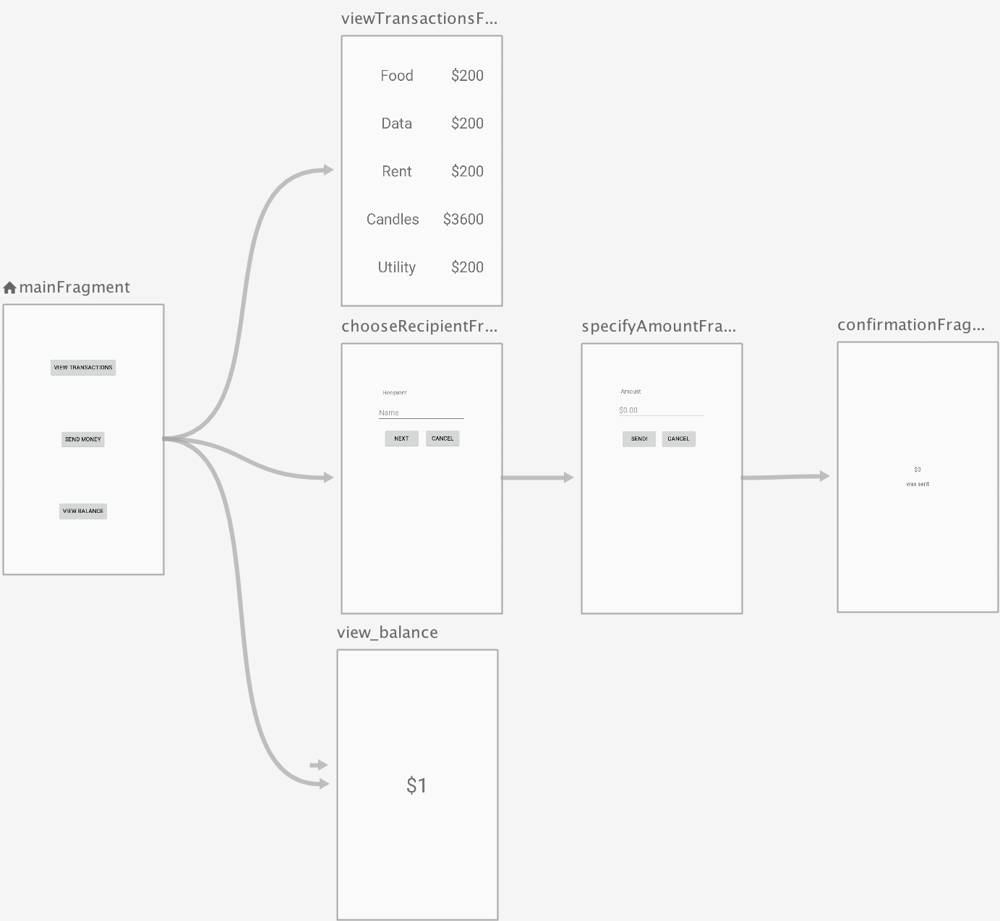
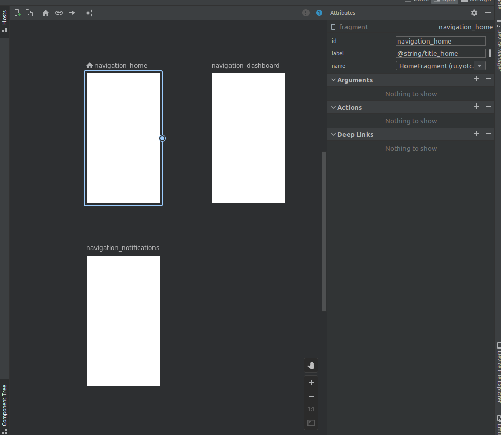
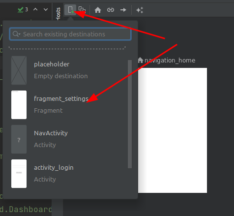

# Навигация в приложении. Начало работы с Navigation Architecture Component. Знакомство с BottomNavigationView.

>Содрано [отсюда](https://www.fandroid.info/17-android-bottom-navigation/)

На этой лекции познакомимся с нижней панелью навигации BottomNavigationView, которая позволяет переходить между экранами – пунктами назначения навигации, а также наглядно информирует пользователя о том, на каком экране он находится. Разберемся, как добавить Bottom Navigation в андроид приложение и как добавить в BottomNavigationView новые фрагменты.

## Содержание

* [Navigation Architecture Component](#navigation-architecture-component)
* [Создаем проект](#создаем-проект)
* [Неоходимые библиотеки](#неоходимые-библиотеки)
* [Граф навигации](#граф-навигации)
* Добавление экранов
* Хост навигации
* BottomNavigationView
* Добавление пунктов меню
* Добаление идентификаторов в контроллер навигации
* Рефакторинг

## Navigation Architecture Component

**Navigation Architecture Component** это библиотека, которая позволяет пользователям перемещаться между различными частями контента в вашем приложении. Компонент навигации входит в набор компонентов Android Jetpack и помогает реализовать навигацию, от простых нажатий кнопок до более сложных шаблонов, таких как панели приложений (appbars) и панель навигации (navigation drawer). Компонент навигации также обеспечивает согласованное и предсказуемое взаимодействие с пользователем.

Navigation Architecture Component упрощает осуществление навигации, а также помогает визуализировать **navigation flow** вашего приложения. Библиотека предоставляет ряд преимуществ, в том числе:

* Автоматическая обработка транзакций фрагментов
* Корректная обработка кнопок «Вверх» и «Назад» по умолчанию
* Поведение по умолчанию для анимации и переходов
* Deep linking как first class operation
* Реализация шаблонов навигации пользовательского интерфейса (таких как navigation drawer и bottom navigation) с небольшой дополнительной работой
* Безопасность типов при передаче информации во время навигации
* Инструменты Android Studio для визуализации и редактирования navigation flow приложения
 
## Создаем проект

Cоздать простое приложение с панелью навигации можно, не написав ни одной строчки кода. Достаточно воспользоваться готовым макетом Bottom Navigation Activity на этапе создания проекта в Android Studio. При этом создается проект приложения с нижней панелью навигации BottomNavigationView на главном экране, в которой отображается три пункта. При нажатии каждого из них меняются экраны приложения. Это все хорошо, скажете вы, но если нужно добавить или убрать экраны и пункты для них? Или добавить нижнюю навигацию в существующее приложение?

Ок, давайте изучим структуру проекта, созданного по шаблону, и по ходу попробуем добавить сюда пару новых экранов и пунктов для них~~, а также рассмотрим шаги для добавления нижней панели навигации в уже существующее приложение~~.

## Неоходимые библиотеки

Если открыть файл сборки build.gradle, в секции dependencies можно увидеть подключенные библиотеки из пакета androidx.navigation (с ktx  для проектов на kotlin)  которые нам уже знакомы по предыдущим урокам на тему навигации в приложении. Если вы добавляете нижнюю навигацию в существующее приложение, то начинать нужно с добавления этих библиотек в ваш проект.

```
implementation 'androidx.navigation:navigation-fragment-ktx:2.4.1'
implementation 'androidx.navigation:navigation-ui-ktx:2.4.1'
```

## Граф навигации

Архитектурный компонент **Navigation** позволяет упростить реализацию навигации между экранами в вашем приложении. По умолчанию, **Navigation** поддерживает фрагменты (Fragments) и активности (Activities) в качестве экранов назначения, но вы также можете добавить поддержку новых типов экранов назначения. Набор экранов назначения называется **навигационным графом (navigation graph) приложения**.

Помимо экранов назначения на навигационном графе есть соединения между ними, называемые действиями (actions). Следующий рисунок демонстрирует визуальное представление навигационного графа для простого приложения из шести экранов назначения, соединённых пятью действиями.



### Обзор компонента навигации
Компонент навигации состоит из трех ключевых частей:

* **Navigation graph**: ресурс XML, который содержит всю связанную с навигацией информацию в одном централизованном месте. Он включает в себя все отдельные области содержимого в вашем приложении, называемые destinations (пункты назначения), а также возможные пути, которые пользователь может пройти через ваше приложение.
* **NavHost**: Пустой контейнер, который отображает пункты назначения из вашего графика навигации. Компонент Navigation содержит реализацию NavHost по умолчанию — NavHostFragment, которая отображает фрагменты — места назначения.
* **NavController**: Объект, который управляет навигацией приложения в NavHost. NavController управляет перемещениями контента мест назначения в NavHost, в процессе перемещения пользователей по приложению.
 
Мы используем объект **NavController**, сообщая ему путь в ресурсе **Navigation Graph**. Затем объекту NavController будет показан соответствующий пункт назначения в NavHostFragment.

Давайте посмотрим, как это выглядит на практике, начиная с нового ресурса **Navigation Graph**.

### Destinations

Компонент навигации представляет концепцию **Destinations** —  пункта назначения. Пункт назначения — это любое место, в котором вы можете перемещаться в приложении, обычно это фрагмент или активити. Они поддерживаются «из коробки», но вы также можете создавать свои собственные типы назначения, если это необходимо.

### Navigation Graph

Navigation Graph представляет собой новый тип ресурса, который определяет все возможные пути, доступные пользователю в приложении. Он показывает визуально все пункты назначения, которые могут быть достигнуты из данного пункта назначения. Редактор навигации Android Studio отображает Navigation Graph наглядно.

### Редактор навигации

1. Откройте файл `res/navigation/mobile_navigation.xml` 
1. Перейдите в режим «Дизайн»:

    

    Navigation Graph показывает доступные пункты назначения. Стрелки между пунктами назначения называются actions (действия). О них мы поговорим позже.

1. В панели атрибутов (справа) можно посмотреть и отредактировать атрибуты пунктов назначения и действий.

### Анатомия навигационного XML-файла

Все изменения, которые вы делаете в графическом редакторе навигации, изменяют базовый XML-файл, подобно тому, как редактор макетов изменяет XML-макет.

Перейдите на вкладку «Code»:

Вы увидите такой XML-код:

```xml
<navigation xmlns:android="http://schemas.android.com/apk/res/android"
            xmlns:app="http://schemas.android.com/apk/res-auto"
            xmlns:tools="http://schemas.android.com/tools"
    
    app:startDestination="@+id/navigation_home">

    <!-- здесь находятся теги с фрагментами и активностями -->

</navigation>
```

**Примечание:**

* `<navigation>` является корневым узлом каждого навигационного графа.
* `<navigation>` содержит один или несколько пунктов назначения, представленных элементами `<activity>` и/или `<fragment>`.
* `app:startDestination`` является атрибутом, который указывает место назначения, которое запускается по умолчанию, когда пользователь впервые открывает приложение.

Давайте посмотрим на место назначения фрагмента:

```xml
<fragment
        android:id="@+id/navigation_home"
        android:name="ru.yotc.ui.home.HomeFragment"
        android:label="@string/title_home"
        tools:layout="@layout/fragment_home">
    <argument
        .../>

    <action
        android:id="@+id/next_action"
        app:destination="@+id/flow_step_two_dest">
    </action>
</fragment>
``` 

**Примечание:**

* **android:id** определяет идентификатор для фрагмента, который вы можете использовать для ссылки на место назначения в другом месте этого XML и вашего кода.
* **android:name** объявляет полное имя класса фрагмента для создания экземпляра при переходе к этому месту назначения.
* **tools:layout** указывает, какой макет должен отображаться в графическом редакторе.

Некоторые теги `<fragment>` также могут содержать `<action>`, `<argument>` и `<deepLink>`, их мы рассмотрим позже.

Пример приложения уже содержит несколько пунктов назначения на графе. Давайте мы добавим новое назначение.

### Добавление нового назначения в граф навигации

1. Создайте новый фрагмент с именем **SettingsFragment** (в контекстном меню **res -> layout** выбрать **new fragment**)
1. Откройте файл `res/navigation/mobile_navigation.xml`
1. Нажмите значок «Новый пункт назначения» и выберите «fragment_settings»

    

Результатом является новое назначение, которое отображает предварительный просмотр макета фрагмента в окне конструктора.

Обратите внимание, что вы также можете редактировать XML-файл напрямую, чтобы добавить места назначения: `mobile_navigation.xml`

```xml
<fragment
    android:id="@+id/settingsFragment"
    android:name="ru.yotc.baza.SettingsFragment"
    android:label="fragment_settings"
    tools:layout="@layout/fragment_settings" />
```

https://habr.com/ru/post/416025/