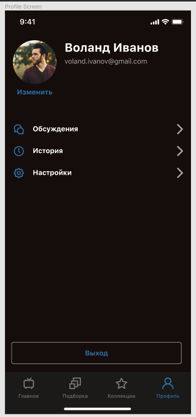

Предыдущая лекция | &nbsp; | Следующая лекция
:----------------:|:----------:|:----------------:
[Проект "каршеринг" Часть 1. Регистрация/Авторизация.](./android_auth.md) | [Содержание](../readme.md#практика-разработка-мобильных-приложений) | [Проект "каршеринг" Часть 3. Работа с Яндекс картами](./map_yandex.md)

# Проект "каршеринг" Часть 2. Профиль пользователя.

## Экран профиля. Получение данных из "галереи" и "камеры" и отправка их на сервер.

Примерный вид экрана профиля (взято из другого проекта). Вместо кнопок "Обсуждения", "История" и "Настройки" у вас должны быть "загрузить права" и "сфотографировать паспорт" с показом соответствующих картинок, если они уже загружены (есть в классе **User**)  



### Скруглённые углы у постера

Аватарка пользователя в профиле должна быть круглой. Фон "фигурой", как можно бы было надеятся тут не работает.

Можно использовать контейнер **CardView**: элемент **ImageView** заворачивается в контейнер **androidx.cardview.widget.CardView**, которому и задаётся радиус (половина размера). Кроме радиуса можно задать тень:

```xml
<androidx.cardview.widget.CardView
    android:layout_width="100dp"
    android:layout_height="100dp"
    app:cardCornerRadius="50dp"
>
    <ImageView
        android:layout_width="match_parent"
        android:layout_height="match_parent"
        android:adjustViewBounds="true"
        android:scaleType="centerCrop"
    />
</androidx.cardview.widget.CardView>
```

Изображению не забываем настроить режим: масштабирование с обрезкой.

### Использование диалогового окна для выбора вариантов (получения фото из Галереи или Камеры)

С диалоговыми окнами мы уже знакомы (мы их используем для вывода текста ошибок). У класса **AlertDialog** есть метод, позволяющий сделать выбор из массива:

```kt
// сначала объявляем массив строк для выбора
val choiceItems = arrayOf("Галерея","Камера")

// создаём и показываваем диалог
AlertDialog.Builder(this)
    .setTitle("Выберите источник")
    .setNegativeButton("Отмена", null)
    .setSingleChoiceItems(choiceItems, -1){
        dialog, index ->
        Toast.makeText(this, "$index", Toast.LENGTH_LONG).show()
        dialog.dismiss()
    }
    .create()
    .show()
```

При создании диалога добавился вызов метода *setSingleChoiceItems*, который как раз и задаёт массив элементов для выбора. **Первым** параметром этого метода задаётся массив **строк**, **вторым** - активный по-умолчанию элемент (можно указать `-1`, если не нужно выбирать что-то по-умолчанию) и **третьим** параметром задаётся лямбда функция, которая вызывается при выборе элемента списка. 

В лямбда функцию передаётся два параметра: 
* *dialog* - указатель на экземпляр диалога
* *index* - позиция выбранного элемента в массиве

Я в примере выше просто вывожу на экран номер выбранного элемента и закрываю диалог (*dialog.dismiss()*).

### Запуск "Камеры" и получение фотографии (миниатюры)

Полноценный вариант читать [тут](http://developer.alexanderklimov.ru/android/photocamera.php)

Здесь приведён только простой вариант, который получает от камеры миниатюру (thumbinail). Для получения полноценной фотографии нужно иметь права на запись, сформировать имя файла и передать "камере"...

```kt
private val REQUEST_IMAGE_CAPTURE = 1

...

val takePictureIntent = Intent(MediaStore.ACTION_IMAGE_CAPTURE)
try {
    startActivityForResult(
        takePictureIntent, 
        REQUEST_IMAGE_CAPTURE)
} catch (e: ActivityNotFoundException) {
    // показать ошибку
}
```

Получение результата от активности мы уже разбирали, когда делали выбор города в проекте "погода". Обработчик результата всего один для класса активности. Поэтому при запуске активности мы и передаём уникальный код запроса, чтобы при разборке ответа знать от кого он пришёл:

```kt
override fun onActivityResult(requestCode: Int, resultCode: Int, intent: Intent?) 
{
    super.onActivityResult(requestCode, resultCode, intent)
    when(requestCode){
        REQUEST_IMAGE_CAPTURE -> {
            if (resultCode == Activity.RESULT_OK && 
                intent != null) 
            {
                val thumbnailBitmap = intent?.extras?
                    .get("data") as Bitmap

                avatar.setImageBitmap(thumbnailBitmap)

                // отправка полученного файла на сервер
                sendFile(
                    bitmap2InputStream(thumbnailBitmap),
                    "avatar.jpg"    // название фиксировано, описано в swagger-e
                )
            }
        }
    }
}

// преобразует битмап в поток (stream)
private fun bitmap2InputStream(bm: Bitmap): InputStream? {
    val baos = ByteArrayOutputStream()
    bm.compress(Bitmap.CompressFormat.JPEG, 75, baos)
    return ByteArrayInputStream(baos.toByteArray())
}
```

Данные на сервер отправляются потоком, поэтому все исходные варианты я привожу к этому типу. Реализация метода *sendFile* будет ниже.

### Получение файла изображения из галереи

Для получения каких-то данных из "галереи" используется тип намерения **Intent.ACTION_PICK**.

Для конкретизации типа данных указывается свойство *type* и уникальный код запроса (REQUEST_JPG_FROM_GALERY):

```kt
// константа для анализа результата объявляется на уровне класса
private val REQUEST_JPG_FROM_GALERY = 2
```

В обработчике клика на кнопку запустить выбор изображения из галереи:

```kt
val photoPickerIntent = Intent(Intent.ACTION_PICK)
// фильтр
photoPickerIntent.type = "image/jpg"

//запускаем запрос, указав что ждём результат 
startActivityForResult(photoPickerIntent, REQUEST_JPG_FROM_GALERY)
```

Дописываем блок в метод *onActivityResult*:

```kt
REQUEST_JPG_FROM_GALERY -> {
    // убеждаемся что выполнено успешно (пользователь мог ничего и не выбрать в галерее)
    if (resultCode == Activity.RESULT_OK  
        && intent != null) 
    {
        // галерея возвращает URI картинки в свойстве data параметра intent
        fileImageView.setImageURI( intent.data!! )

        val fileStream = contentResolver
            .openInputStream(intent.data!!)

        sendFile(
            fileStream,
            "prava.jpg")
    }
}
```

### Отправка **multipart** запроса

>Класс **StreamHelper** лежит в файле [`../shpora/StreamHelper.kt`](../shpora/StreamHelper.kt) этого репозитория.

```kt
private fun sendFile(
    fileStream: InputStream?,   // поток, который надо отправить
    fileName: String            // имя файла
) 
{
    if (fileStream != null) 
    {
        // поток преобразуем в RequestBody
        val fileBody: RequestBody = StreamHelper
            .create(
                "image/jpg".toMediaType(),
                fileStream
            )

        // из токена и файла формируем MultipartBody запрос    
        val requestBody = MultipartBody.Builder()
            .setType(MultipartBody.FORM)
            .addFormDataPart("token", app.user?.userId.toString())
            .addFormDataPart(
                "file", // название части запроса
                fileName,
                fileBody    // тело файла
            )
            .build()

        val request = Request.Builder()
            .url("https://carsharing.kolei.ru/user/photo")
            .post(requestBody)
            .build()

        Http.call(request) { response, error ->
            try {
                if (error != null) throw error
                if (!response!!.isSuccessful)
                    throw Exception(response.message)
            } catch (e: Exception) {
                // вывести алерт
            }
        }
    }
}
```

Предыдущая лекция | &nbsp; | Следующая лекция
:----------------:|:----------:|:----------------:
[Проект "каршеринг" Часть 1. Регистрация/Авторизация.](./android_auth.md) | [Содержание](../readme.md#практика-разработка-мобильных-приложений) | [Проект "каршеринг" Часть 3. Работа с Яндекс картами](./map_yandex.md)
