Предыдущая лекция | &nbsp; | Следующая лекция
:----------------:|:----------:|:----------------:
[Wear OS](./wear_os.md) | [Содержание](../readme.md#практика-разработка-мобильных-приложений) | [Разбор заданий прошлых лет](./f6_demo_1.md)


# Android TV

* [Коротко о библиотеке Leanback](#коротко-о-библиотеке-leanback)
* [Создание проекта в Android Studio (и разбор структуры проекта)](#создание-проекта-в-android-studio)
    - [Манифест](#манифест)
    - [MainActivity](#mainactivity)
    - [MainFragment](#mainfragment)
* [Модификация под свои нужды](#модификация-под-свои-нужды)
    - [Загрузочный экран](#загрузочный-экран)
    - [Получение списка фильмов с сервера](#получение-списка-фильмов-с-сервера)
    - [Группировка по категориям](#группировка-по-категориям)
    - [Настройка вёрстки карточки фильма](#настройка-вёрстки-карточки-фильма)
    - [Реализация самописанной (custom) разметки карточки](#реализация-самописанной-custom-разметки-карточки)
    - [Разбор оставшихся методов главного фрагмента](#разбор-оставшихся-методов-главного-фрагмента)

>Содрано [отсюда](https://habr.com/ru/post/316260/), [отсюда](https://skillbox.ru/media/code/razrabotka_pod_android_tv/) и [отсюда](https://skillbox.ru/media/code/razrabotka_pod_android_tv_part2/)

[Первая](https://habr.com/ru/post/316260/) статья довольно древняя (2016 год), попробуем реализовать в 2022

Данная лекция познакомит вас с разработкой простого приложения для Android TV.

Так как интерфейс приложений для телефонов и Android TV имеет существенные различия, то мы должны создать интерфейс приложения, подходящий для взаимодействия на TV. Например, нам следует создавать приложения с которыми можно взаимодействовать, используя только клавиши `—` `↑` `↓` `→` `←`. В реализации такого интерфейса нам может помочь библиотека **LeanbackSupport**, позволяющая вполне легко создавать UI, который будет удобен при работе с приложениями на Android TV.

## Коротко о библиотеке Leanback

Библиотека Leanback представляет собой набор шаблонов экранов с различными функциональными особенностями. Есть экраны для отображения списков, карточек контента, диалогов и т. д. Эти экраны обрабатывают все пользовательские переходы между элементами и анимации, а также имеют довольно обширный функционал для построения простых приложений “из коробки”. Идеология данной библиотеки заключается в том, что все приложения на ее основе должны быть похожи в плане пользования. Не нужно думать, узнает ли пользователь о том что можно прокрутить вниз? Узнает, потому что он уже пользовался сотнями однотипных приложений.

## Создание проекта в Android Studio

Запустив Android Studio, необходимо создать новый проект. При создании выбрать платформу TV и указать минимальную версию SDK. Android Studio предложит нам создать "Blank Activity", его и создадим (в оригинальной статье предлагают создать пустой проект без активности "No Activity" и руками добавлять классы, файлы разметки и фрагменты, но это долго, проще выкинуть лишнее из рабочего проекта) 

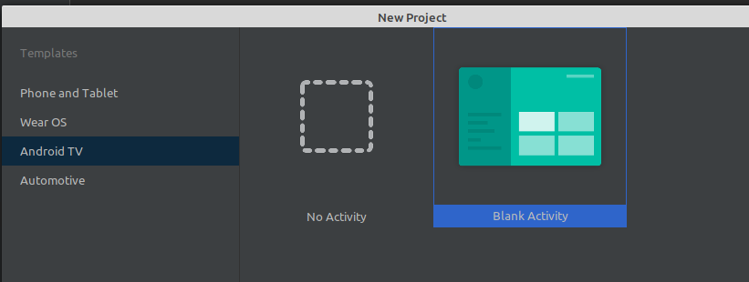

Можем запустить и увидеть что проект работает и что-то показывает:

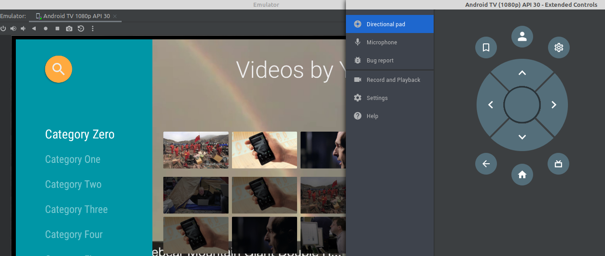

Рассмотрим структуру созданного проекта:

### Манифест

>Менять мы пока ничего не будем, просто ознакомимся с особенностями проекта для TV

* По-умолчанию уже добавлено разрешение на работу с интернетом

    ```xml
    <uses-permission android:name="android.permission.INTERNET" />
    ```

* Заданы требования к целевому устройству

    Может отсутствовать (не требуется) тачскрин:

    ```xml
    <uses-feature
        android:name="android.hardware.touchscreen"
        android:required="false" />
    ```

    Приложение должно запускаться только на Android TV. Если вы разрабатываете приложение не только для TV, то вам следует установить значение *false*:

    ```xml
    <uses-feature
        android:name="android.software.leanback"
        android:required="true" />
    ```

* При объявлении Activity мы указываем в *intent-filter* в теге *category*, что Activity должна запускаться на Android TV.

    ```xml
    <intent-filter>
        <action android:name="android.intent.action.MAIN" />

        <category android:name="android.intent.category.LEANBACK_LAUNCHER" />
    </intent-filter>
    ```    

### MainActivity

Первым запускается как обычно **MainActivity**

```kt
class MainActivity : FragmentActivity() 
{
    override fun onCreate(savedInstanceState: Bundle?) 
    {
        super.onCreate(savedInstanceState)
        setContentView(R.layout.activity_main)
        if (savedInstanceState == null) {
            getSupportFragmentManager().beginTransaction()
                .replace(R.id.main_browse_fragment, MainFragment())
                .commitNow()
        }
    }
}
```

`activity_main.xml`:

```xml
<?xml version="1.0" encoding="utf-8"?>
<FrameLayout 
    xmlns:android="http://schemas.android.com/apk/res/android"
    xmlns:tools="http://schemas.android.com/tools"
    android:id="@+id/main_browse_fragment"
    android:layout_width="match_parent"
    android:layout_height="match_parent"
    tools:context=".MainActivity"
    tools:deviceIds="tv"
    tools:ignore="MergeRootFrame" />
```    

По коду мы видим, что вёрстка приложени состоит из единственного фрагмента, содержимое для которого генерится в классе **MainFragment**.

### MainFragment

Класс **MainFragment** наследуется от класса `BrowseSupportFragment()`, а про его структуру хорошо расписано во [второй](https://skillbox.ru/media/code/razrabotka_pod_android_tv/) статье. 

**BrowseFragment** — это фрагмент, предназначенный для создания экрана со списками элементов и заголовками. Его структура выглядит следующим образом:

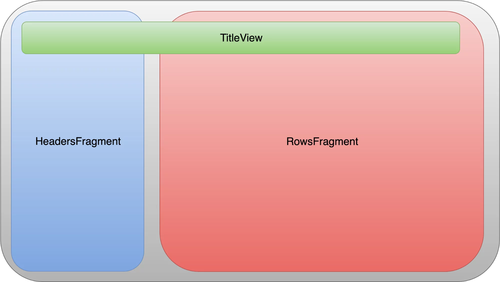

Рассмотрим каждый из элементов:

* **TitleView** - это контейнер с элементами. Он нужен для брендирования приложения (текст и логотип в правом верхнем углу), а также для добавления кнопки поиска. Чтобы кнопка поиска была видимой, ей необходимо установить слушателя. Это можно сделать, вызвав метод *setOnSearchClickedListener* у фрагмента.

* **HeadersFragment & RowsFragment** - **HeadersFragment** — список заголовков в левой части экрана и **RowsFragment** — контейнер для контента в правой части экрана. Эти фрагменты работают в связке, и **BrowseFragment** делегирует им отрисовку элементов своего адаптера.

Таким образом, в методе *onActivityCreated* класса **MainFragment** настраиваются вышеперечисленные контейнеры. Можем убедиться в этом закомментировав функции, которые что-то делают и посмотрев на результат:

```kt
override fun onActivityCreated(savedInstanceState: Bundle?) {
    Log.i(TAG, "onCreate")
    super.onActivityCreated(savedInstanceState)

    // prepareBackgroundManager()
    // setupUIElements()
    // loadRows()
    // setupEventListeners()
}
```

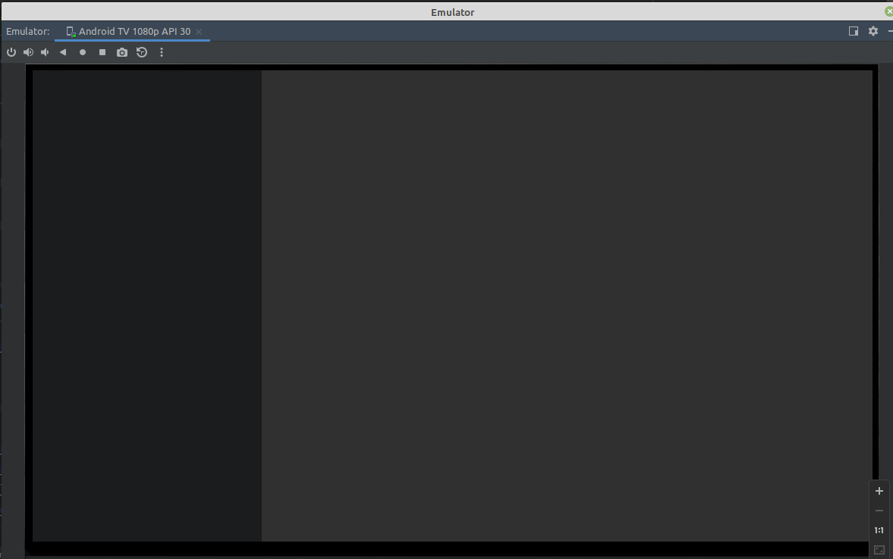

#### Метод *prepareBackgroundManager*

Инициализирует *lateinit* свойства класса и пока ничего не показывает

#### Метод *setupUIElements*

Устанавливает заголовок в правом верхнем углу и цвет для левой панели

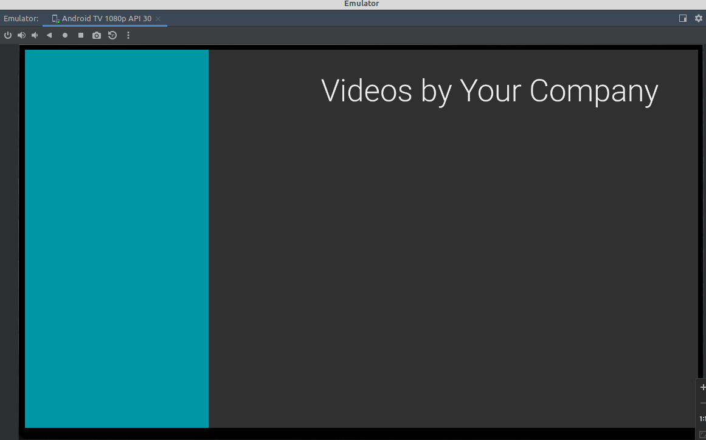

#### Метод *loadRows* 

Формирует всё содержимое, разберёмся с ним подробнее:

1. `val list = MovieList.list` - Получаем список фильмов

    Свойство *list* класса **MovieList** возвращает массив объектов **Movie**, реализацию можно не разбирать, мы в реальном проекте всё-равно этот список будем получать динамически из АПИ.

1. `val rowsAdapter = ArrayObjectAdapter(ListRowPresenter())` - Создаётся **стандартный** адаптер **ArrayObjectAdapter** использующий **стандартный** класс-представление **ListRowPresenter** для вывода "строки". "Строка" (*ListRow* - строка списка), отображаемая этим представлением, выводит во фрагменте заголовков (*HeadersFragment* - левая часть экрана) заголовок, а во фрагменте строк (*RowsFragment* - правая часть) содержимое.

1. `val cardPresenter = CardPresenter()` - создание самописанного (реализующего абстрактный класс) экземпляра представления карточки фильма

1. Цикл перебора категорий (`for (i in 0 until NUM_ROWS)`)

    >Тут количество категорий "прибито гвоздями", в реальном проекте мы будем перебирать список имеющихся категорий

    ```kt
    if (i != 0) {
        Collections.shuffle(list)
    }
    ```

    Эта конструкция меняет содержимое коллекции в случайном порядке для всех строк, кроме первой. Если этого не сделать, то выведутся одинаковые строки (строки формируются из одного и того же списка фильмов):

    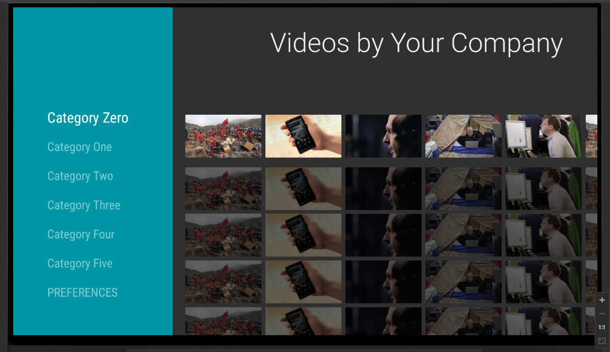

    Далее создаётся адаптер для содержимого, которое будет отображаться в *RowsFragment* (правая часть экрана) и заполняется фильмами из списка:

    ```kt
    val listRowAdapter = ArrayObjectAdapter(cardPresenter)
    for (j in 0 until NUM_COLS) {
        listRowAdapter.add(list[j % 5])
    }
    ```

    В конце цикла создаётся заголовок для категории. Заголовок вместе со списком фильмов добавляется в адаптер "строк" *rowsAdapter*:

    ```kt
    val header = HeaderItem(
        i.toLong(), 
        MovieList.MOVIE_CATEGORY[i])

    rowsAdapter.add(
        ListRow(
            header, 
            listRowAdapter))
    ```

    В итоге структура выглядит примерно так:

    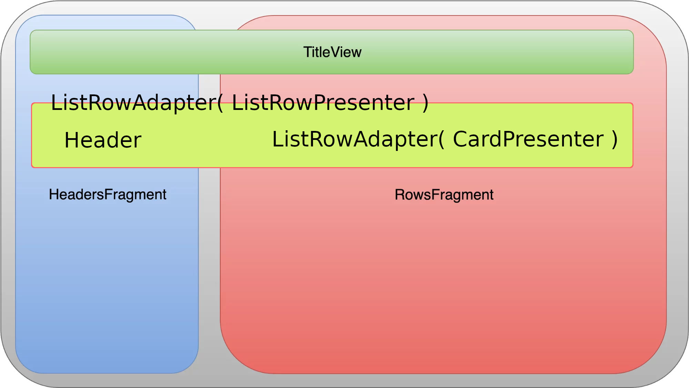

    **ListRowPresenter** это стандартный класс библиотеки **Leanback**, отвечающий за размещение заголовка и содержимого по разным фрагментам (Headers и Rows). **CardPresenter** класс, отвечающий за отображение отдельного элемента (в правом фрагменте).

1. Добавление строки с настройками

    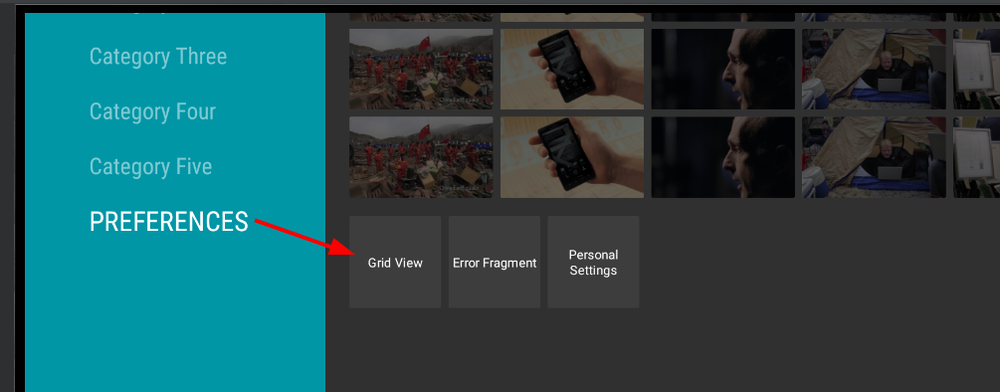

    Строка находится в общем адаптере (вертикальный список), но реализация элементов списка у неё другая:

    ```kt
    // формируем заголовок
    val gridHeader = HeaderItem(
        NUM_ROWS.toLong(), 
        "PREFERENCES")

    // здесь создаётся представление для элемента настроек
    val mGridPresenter = GridItemPresenter()

    // на его основе делается адаптер для строки элементов
    val gridRowAdapter = ArrayObjectAdapter(mGridPresenter)

    // и в эту строку добавляются пункты меню настроек
    gridRowAdapter.add(
        resources.getString(R.string.grid_view))
    gridRowAdapter.add(
        getString(R.string.error_fragment))
    gridRowAdapter.add(
        resources.getString(R.string.personal_settings))
    ```

    В итоге в основной адаптер добавляется строка с настройками

    ```kt
    rowsAdapter.add(
        ListRow(gridHeader, gridRowAdapter))
    ```

    И готовый адаптер назначается адаптеру нашего класса (его нет в нашей реализации, он объявлен в родительском классе)

    ```kt
    adapter = rowsAdapter
    ```

#### Метод *setupEventListeners*

Настраивает события, которые будет обрабатывать приложение:

```kt
setOnSearchClickedListener {
    Toast.makeText(
            activity!!, 
            "Implement your own in-app search",
            Toast.LENGTH_LONG)
        .show()
}
```

Назначение этого события **включает** иконку поиска. Реализации поиска пока никакой нет.

```kt
onItemViewClickedListener = ItemViewClickedListener()
```

*onItemViewClickedListener* - обработчик события клика по карточке фильма

```kt
onItemViewSelectedListener = ItemViewSelectedListener()
```

*onItemViewSelectedListener* - обработчик клика по элементу вертикального списка (категории)

## Модификация под свои нужды

### Загрузочный экран

Не знаю, будет ли это на демо-экзамене, но для демонстрации работы с обычными *activity* добавим загрузочный экран:

1. Добавьте пустую активность (в контекстном меню пакета `New -> Activity -> Empty Activity`)

1. В манифесте перенесите тег `<intent-filter>` из активности *.MainActivity* в *.LaunchActivity* (я ещё скопировал атрибут `android:screenOrientation="landscape"`)

1. В `drawable` ресурсы добавьте картинку для заставки и в файл разметки добавьте **ImageView** с этой картинкой

1. В классе **LaunchActivity**: 

    * поменяйте родителя, вместо **AppCompatActivity** оставьте просто **Activity** (**AppCompatActivity** не реализован в Android TV)

    * Реализуйте таймер и переход на главное окно:

        ```kt
        class LaunchActivity : Activity() {
            lateinit var that: Activity
            override fun onCreate(savedInstanceState: Bundle?) {
                super.onCreate(savedInstanceState)
                setContentView(R.layout.activity_launch)
                that = this
                Timer().schedule(3000L){
                    that.runOnUiThread {
                        startActivity(Intent(that, MainActivity::class.java))
                    }
                }
            }
        }
        ```

        Тут мне лень было писать метод для обработки события таймера, поэтому контекст (*this*) я сохранил в отдельную переменную (внутри лямбда-функции таймера контекст другой)

Всё замечательно работает!!!

### Получение списка фильмов с сервера

Что-бы не терять время просто так, поместим этот код в загрузочную активность (заодно проверим как тут работает класс **Application**)

В классе приложения (**MyApp**) описываем переменную
`val movieList = ArrayList<Movie>()`, в которую будем записывать информацию о фильмах (Класс **Movie** я пока оставил как есть).


```kt
override fun onCreate(savedInstanceState: Bundle?) 
{
    super.onCreate(savedInstanceState)
    setContentView(R.layout.activity_launch)
    app = applicationContext as MyApp
    that = this
    Timer().schedule(3000L){
        that.runOnUiThread {
            startActivity(Intent(that, MainActivity::class.java))
        }
    }
    // запрос списка фильмов вынесен в отдельный метод
    getMovieList()
}

private fun getMovieList() {
    Http.call("http://cinema.kolei.ru/movies?filter=new"){ 
        response, error ->
        try {
            if (error != null) throw error
            if (!response!!.isSuccessful) 
                throw Exception(response.message)

            var json = JSONArray(response.body!!.string())

            // работу с классом приложения на всякий случай тоже заворачиваю в UI поток
            runOnUiThread {
                app.movieList.clear()
                for (i in 0 until json.length()){
                    val item = json.getJSONObject(i)
                    app.movieList.add(Movie(
                        id = item.getLong("movieId"),
                        title = item.getString("name"),
                        description = item.getString("description"),
                        cardImageUrl = "http://cinema.kolei.ru/up/images/${item.getString("poster")}"
                    ))
                }
            }
        } catch (e: Exception) {
            // любую ошибку показываем на экране
            runOnUiThread {
                AlertDialog.Builder(this)
                    .setTitle("Ошибка")
                    .setMessage(e.message)
                    .setPositiveButton("OK", null)
                    .create()
                    .show()
            }
        }
    }
}
```

В классе **MainFragment** указатель на *app* получаем через ссылку на текущую активность (я упоминал в прошлой лекции, что фрагмент не может существовать сам по себе, а работает в контексте какой-то активности)

```kt
override fun onActivityCreated(savedInstanceState: Bundle?) 
{
    super.onActivityCreated(savedInstanceState)
    app = activity?.application as MyApp
```

И в методе *loadRows* задаём в качестве списка фильмов тот, который получили с сервера

```kt
private fun loadRows() {
    val list = app.movieList  //MovieList.list
```

Запускаем проект и видим, что данные получены и отображаются верно (нужно только поправить вёрстку) и знакомые нам механизмы работы с классом приложения и сетевые запросы работают как надо:

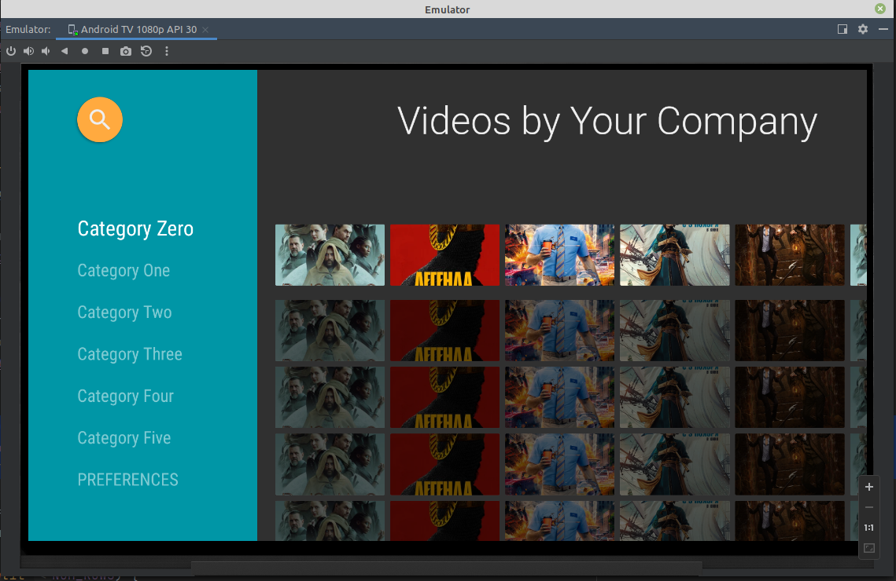

### Группировка по категориям

В АПИ в информацию о фильме я добавил категорию. 

Добавим поле для категории в класс **Movie**

```kt
var category: String? = null
```

Не забываем заполнить его при получении данных:

```kt
app.movieList.add(Movie(
    id = item.getLong("movieId"),
    title = item.getString("name"),
    description = item.getString("description"),
    cardImageUrl = "http://cinema.kolei.ru/up/images/${item.getString("poster")}",
    category = item.getString("category")
))
```

В методе *loadRows*, перед формированием данных для отображения, получаем список уникальных названий категорий:

```kt
val categoriesList = list.map{m->m.category}.distinct()
```

С методом *distinct* вы уже знакомы, а метод *map* преобразует содержимое массива. В нашем случае мы выбираем только название категорий (в итоге получается массив строк).

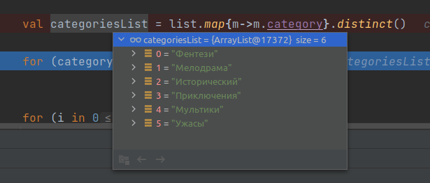

Теперь перебираем список категорий, создавая для каждой свой *listRowAdapter*. Далее во вложенном цикле заполняем этот адаптер подходящими по категории фильмами. После заполнения одной категории заголовок (категория) и содержимое этой категории (*listRowAdapter*) записываются в общий 

```kt
for (i in categoriesList.indices){
    val listRowAdapter = ArrayObjectAdapter(cardPresenter)

    // формируем элементы строки, фильтруя фильмы по категории
    for (j in list.indices) {
        if (list[j].category != null && list[j].category == categoriesList[i]) {
            listRowAdapter.add(list[j])
        }
    }

    // сформированную строку с заголовком пишем в rowsAdapter
    val header = HeaderItem(categoriesList[i])
    rowsAdapter.add(ListRow(header, listRowAdapter))
}
```

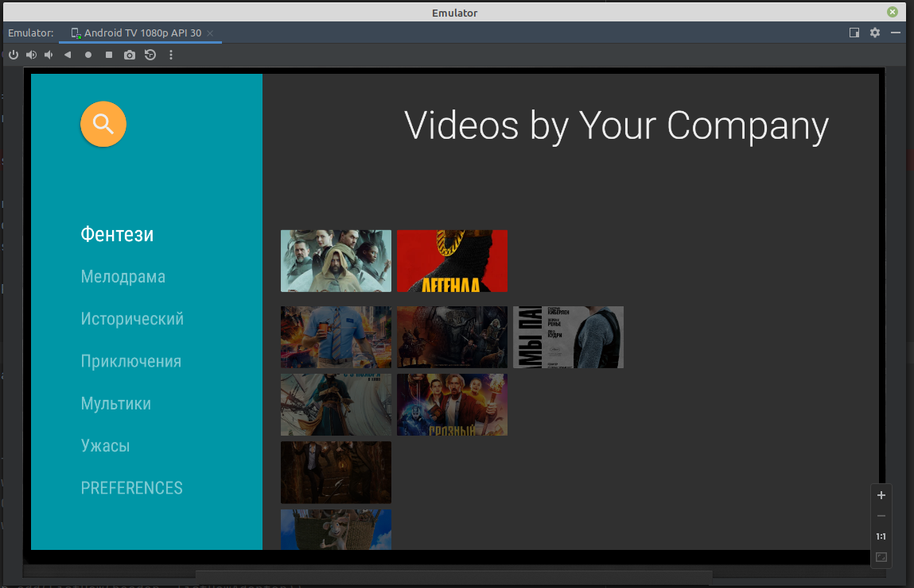

### Настройка вёрстки карточки фильма

Представление для карточки фильма реализовано в файле `CardPresenter.kt`.

Класс **CardPresenter** наследуется от абстрактного класса **Presenter** и должен реализовать три метода: *onCreateViewHolder*, *onBindViewHolder*, *onUnbindViewHolder*. Всё это похоже на знакомый нам адаптер для **RecyclerView**.

1. Метод *onCreateViewHolder*

    Создаёт визуальное представление элемента. Можно реализовать своё представление и мы это позже рассмотрим, а можно использовать встроенный в библиотеку класс **ImageCardView**. В **CardPresenter** реализован второй вариант, разберём его подробнее:

    ```kt
    override fun onCreateViewHolder(parent: ViewGroup): Presenter.ViewHolder 
    {
        // цвет фона по-умолчанию, если по ТЗ его менять не нужно, то и не трогаем
        // в принципе в этом представлении мы его и не увидим - у нас на всю карточку рисуется изображение
        sDefaultBackgroundColor = ContextCompat
            .getColor(
                parent.context, 
                R.color.default_background)

        // аналогично для выбранной (активной) карточки
        sSelectedBackgroundColor =  ContextCompat
            .getColor(
                parent.context, 
                R.color.selected_background)

        // изображение, которое будет показано, если не найдёт нужную картинку        
        mDefaultCardImage = ContextCompat
            .getDrawable(
                parent.context, 
                // в ресурсах должна быть соответсвующая картинка 
                R.drawable.movie)   


        // создаётся экземпляр класса ImageCardView с переопределением
        // метода setSelected
        val cardView = object : ImageCardView(parent.context) {
            override fun setSelected(selected: Boolean)
            {
                updateCardBackgroundColor(this, selected)
                super.setSelected(selected)
            }
        }

        // но можно и проще, если нам не надо менять цвет фона
        // val cardView = ImageCardView(parent.context)


        cardView.isFocusable = true
        cardView.isFocusableInTouchMode = true
        updateCardBackgroundColor(cardView, false)

        // возвращаем настроенный экземпляр cardView
        return Presenter.ViewHolder(cardView)
    }
    ``` 

2. Метод *onBindViewHolder*

    Этот метод привязывает данные текущего элемента списка к его визуальному представлению. Первый параметр это результат метода *onCreateViewHolder*, второй - очередной элемент списка. Метод универсальный, поэтому тип элемента **Any**, мы при реализации приводим к тому типу данных, который использовали при формировании списка (передавали в методе *add*)

    Как уже выше писалось, мы для визуального представления используем стандартный класс [ImageCardView](https://developer.android.com/reference/androidx/leanback/widget/ImageCardView), в котором можем задать свойства: 

    * *titleText* - название
    * *contentText* - содержание
    * *badgeImage* - иконка (в этом примере не используется, но позже мы сюда что-нибудь добавим)
    * *mainImage* или *mainImageView* - изображение

    ```kt
    override fun onBindViewHolder(
        viewHolder: Presenter.ViewHolder, 
        item: Any) 
    {
        // создаём переменные, приведённые к нужным типам
        val movie = item as Movie
        val cardView = viewHolder.view as ImageCardView

        // если задан URL картинки, то заполняем данные карточки
        if (movie.cardImageUrl != null) {
            // задаём название и содержание
            cardView.titleText = movie.title
            cardView.contentText = movie.description

            // задаём размеры изображения
            cardView.setMainImageDimensions(
                CARD_WIDTH, 
                CARD_HEIGHT)

            // загружаем картинку cardImageUrl в элемент разметки mainImageView
            // если при загрузке картинки возникнет ошибка, то выведется изображение по-умолчанию
            Glide.with(viewHolder.view.context)
                .load(movie.cardImageUrl)
                .centerCrop()
                .error(mDefaultCardImage)
                .into(cardView.mainImageView)
        }
    }
    ```

3. Метод *onUnbindViewHolder*

    Вызывается при "отвязке" элемента. Используется для обнуления ссылок на изображения, чтобы сборщик мусора мог освободить память.

    ```kt
    override fun onUnbindViewHolder(
        viewHolder: Presenter.ViewHolder) 
    {
        val cardView = viewHolder.view as ImageCardView
        cardView.badgeImage = null
        cardView.mainImage = null
    }
    ```

**Доработка**

В примере не продемонстрирована установка иконки у карточки. Иконка задаётся *drawable* ресурсом, т.е. может быть либо изображением, либо фигурой.  

У нас в АПИ у класса **Movie** есть возрастные ограничения, добавим их отображение иконкой:

1. Добавьте изображения для иконок для всех доступных возрастов: `[0,6,12,16,18]` (так как название ресурса одновременно является названием переменной, а переменная должна начинаться с буквы или подчёркивания, то добавьте к имени файла префикс `age`: `age0.png`, `age6.png`, ...)

1. Добавьте свойство `age: String? = null` в класс **Movie** и заполняйте его при получении списка фильмов.

1. В метод *onBindViewHolder* добавьте установку свойства *badgeImage*:

    ```kt
    cardView.badgeImage  = cardView.context.getDrawable(  
        cardView.context.resources.getIdentifier(
            "age${movie.age}", 
            "drawable", 
            cardView.context.getPackageName()))
    ```

    Так как заранее не известно, какое название ресурса понадобится мы ищем ресурс не по `id`, а по имени. Метод *getIdentifier* принимает три параметра:

    * название ресурса
    * тип ресурса
    * название пакета

    Ну и как видно по коду выполняться всё это должно в нужном контексте (по-умолчанию это `this` - указатель на класс активности, но этот код работает в контексте класса **CardPresenter**, поэтому контекст приходится вытаскивать из **View**)

    В итоге в карточках должна появиться иконка:

    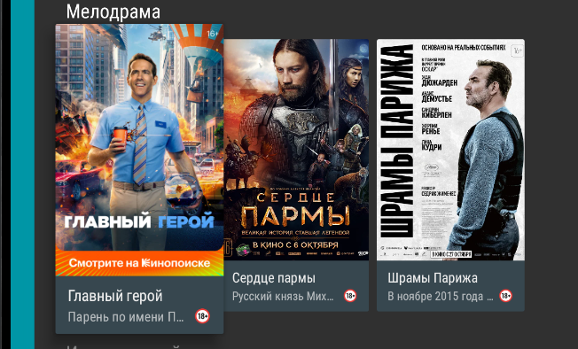

    По-умолчанию иконка выводится в справа, но можно с помощью стилей поместить её слева:

    * в файл `values/themes.xml` добавьте стиль, переопределяющий стандартный стиль `Widget.Leanback.ImageCardViewStyle`, в котором переопределяем значение для элемента `lbImageCardViewType` (допускаемые значения: Title, Content, IconOnRight, IconOnLeft, ImageOnly):

        ```xml
        <style 
            name="ImageCardViewStyle" 
            parent="Widget.Leanback.ImageCardViewStyle"
        >
            <item 
                name="lbImageCardViewType"
            >
                IconOnLeft|Title|Content
            </item>
        </style>
        ```

    * затем добавляем тему `ImageCardTheme`, переопределяющую стандартную тему `Theme.Leanback`, в которой задаём свойство `imageCardViewStyle`:

        ```xml
        <style 
            name="ImageCardTheme" 
            parent="Theme.Leanback"
        >
            <item 
                name="imageCardViewStyle"
            >
                @style/ImageCardViewStyle
            </item>
        </style>
        ```

    * в методе `CardPresent.onCreateViewHolder` меняем параметры конструктора **ImageCardView**:

        ```kt
        // val cardView = ImageCardView(parent.context)
        val cardView = ImageCardView(  
            ContextThemeWrapper(
                parent.context, 
                R.style.ImageCardTheme))
        ```

    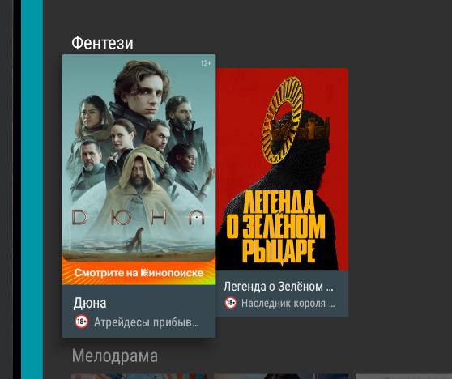

>В Котлин-е есть оператор **with**, который позволяет выполнять блок кода в заданном контексте, причем его можно использовать как реализацию функции:
>```kt
>override fun onBindViewHolder(
>    viewHolder: Presenter.ViewHolder, item: Any
>) = with(viewHolder.view as ImageCardView) 
>{
>    val movie = item as Movie
>
>    if (movie.cardImageUrl != null) {
>        titleText = movie.title
>        contentText = movie.description
>
>        badgeImage  = context.getDrawable(
>            context.resources.getIdentifier(
>                "age18",
>                "drawable", 
>                context.getPackageName()))
>
>        setMainImageDimensions(
>            CARD_WIDTH, 
>            CARD_HEIGHT)
>
>        Glide.with(context)
>            .load(movie.cardImageUrl)
>            .centerCrop()
>            .error(mDefaultCardImage)
>            .into(mainImageView)
>    }
>}
>```

На этом варианты настроек (**ImageCardView**) исчерпаны, если нам нужно поменять элементы местами или добавить кнопку, то придётся рисовать свой презентер.

### Реализация самописанной (custom) разметки карточки 

Собственно такая разметка используется при выводе пунктов меню настройки (**GridItemPresenter**):

```kt
private inner class GridItemPresenter : Presenter() {
    override fun onCreateViewHolder(
        parent: ViewGroup
    ): Presenter.ViewHolder 
    {
        // в качестве визуального элемента используется 
        // обычный TextView
        val view = TextView(parent.context)

        view.layoutParams = ViewGroup.LayoutParams(
            GRID_ITEM_WIDTH, 
            GRID_ITEM_HEIGHT)

        view.isFocusable = true
        view.isFocusableInTouchMode = true
        view.setBackgroundColor(
            ContextCompat.getColor(
                activity!!, 
                R.color.default_background))

        view.setTextColor(Color.WHITE)
        view.gravity = Gravity.CENTER
        
        return Presenter.ViewHolder(view)
    }

    override fun onBindViewHolder(
        viewHolder: Presenter.ViewHolder, 
        item: Any) 
    {
        // элементы списка обычные строки
        (viewHolder.view as TextView).text = item as String
    }

    override fun onUnbindViewHolder(
        viewHolder: Presenter.ViewHolder) {}
}
```

Это представление простое, но даёт нам понимание, что в качестве представления может быть любой визуальный элемент. 

Сделаем свою карточку: **CardView** со скруглёнными углами, картинка, текст и переключатель (**Switch**) с функцией обратного вызова:

1. Нарисуем разметку в `layout/card_item.xml` (мой пример не копипастить - у каждого должна быть своя реализация)

    ```xml
    <?xml version="1.0" encoding="utf-8"?>
    <androidx.cardview.widget.CardView
        xmlns:android="http://schemas.android.com/apk/res/android"
        xmlns:app="http://schemas.android.com/apk/res-auto"
        android:layout_width="150dp"
        android:layout_height="300dp"
        app:cardCornerRadius="20dp"
        >
        <LinearLayout
            android:layout_width="match_parent"
            android:layout_height="match_parent"
            android:orientation="vertical">
            <ImageView
                android:id="@+id/logoImageView"
                android:layout_width="match_parent"
                android:adjustViewBounds="true"
                android:scaleType="centerCrop"
                android:focusable="false"
                android:layout_height="200dp"/>
            <TextView
                android:id="@+id/captionTextView"
                android:layout_margin="10dp"
                android:text="caption"
                android:focusable="false"
                android:layout_width="match_parent"
                android:layout_height="wrap_content"/>
            <Switch
                android:id="@+id/stateSwitch"
                android:layout_margin="10dp"
                android:layout_width="wrap_content"
                android:layout_height="wrap_content"
                android:focusedByDefault="true"
                android:text="Состояние" />
        </LinearLayout>
    </androidx.cardview.widget.CardView>
    ```
2. Создадим класс **CustomPresenter**:

    ```kt
    class CustomPresenter : Presenter() {
        // в классе описываем доступные визуальные элементы
        lateinit var logo: ImageView
        lateinit var caption: TextView
        lateinit var state: Switch
        private var mDefaultCardImage: Drawable? = null

        // переменная для задания callback-функции
        private var switchListener: ((Movie, Boolean) -> Unit)? = null

        // метод, устанавливающий callback-функцию
        fun setOnSwitchListener(
            switchListener: (Movie, Boolean) -> Unit) 
        {
            this.switchListener = switchListener
        }

        @SuppressLint("MissingInflatedId")
        override fun onCreateViewHolder(
            parent: ViewGroup): ViewHolder 
        {
            // получаем указатель на layout
            val view = LayoutInflater
                .from(parent?.context)
                .inflate(
                    R.layout.card_item, 
                    parent, 
                    false)

            // получаем указатели на визуальные элементы
            logo = view.findViewById(R.id.logoImageView)
            caption = view.findViewById(R.id.captionTextView)
            state = view.findViewById(R.id.stateSwitch)
            mDefaultCardImage = ContextCompat
                .getDrawable(parent.context, R.drawable.movie)

            return Presenter.ViewHolder(view)
        }

        override fun onBindViewHolder(
            viewHolder: ViewHolder?, 
            item: Any?) 
        {
            val movie = item as Movie

            caption.text = movie.title

            // при изменении состояния переключателя 
            // пробросим событие наружу
            state.setOnCheckedChangeListener { 
                _, b ->
                switchListener?.invoke(item, b)
            }

            // рисуем логотип
            Glide.with(viewHolder!!.view.context)
                .load(movie.cardImageUrl)
                .centerCrop()
                .error(mDefaultCardImage)
                .into(logo)
        }

        override fun onUnbindViewHolder(
            viewHolder: ViewHolder?) {}
    }
    ```

3. И в методе *loadRows* поменяем класс для представления:

    ```kt
    val cardPresenter = CustomPresenter()  // CardPresenter()
    cardPresenter.setOnSwitchListener { movie, b ->
        Log.w("switch", "${movie.title} to ${b}")
    }
    ```

Получится что-то такое:

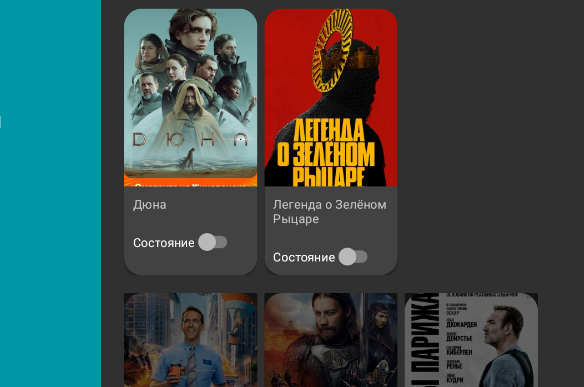

После реализации своего презентера сломался клик по карточке (с переходом на окно детальной информации). Как починить по-правильному я пока не сообразил, сделаем пока "криво":

В методе *onItemClicked* класса **ItemViewClickedListener** поменяем получение ссылки на картинку:

```kt
// костыль, нарушающий инкапсуляцию
val logo = itemViewHolder.view
    .findViewById<ImageView>(
        R.id.logoImageView)

val bundle = ActivityOptionsCompat
    .makeSceneTransitionAnimation(
        activity!!,
        logo,
        DetailsActivity.SHARED_ELEMENT_NAME
    )
```

### Фон главного окна

Фон автоматически устанавливается при выборе карточки фильма. Но у экземпляра фильма при этом должно быть установлено свойство *backgroundImageUrl*, которое мы пока не заполняли. 

В АПИ в списке изображений (images) я добавил по картинке для каждого фильма. 

Ваша задача при получении списка фильмов вытащить элемент этого массива и присвоить его свойству *backgroundImageUrl*.

### Разбор оставшихся методов главного фрагмента

1. *setupUIElements* - настройка брендирования

    * Установка названия бренда (строка в правом верхнем углу):

        ```kt
        title = getString(R.string.browse_title)
        ```

        Вместо текста можно вывести логотип:

        ```kt
        badgeDrawable = ContextCompat.getDrawable(
            context, 
            R.drawable.app_icon_your_company)
        ```

        Причём установить можно только один из этих элементов, и наибольший приоритет всегда у логотипа.

    * Настройка режима отображения левой панели (список категорий).

        В базовой реализации **HeadersFragment** сразу виден пользователю. Это поведение можно изменить с помощью метода *setHeadersState* (в Котлине просто сеттер *headersState*). К нему нужно обратиться во время настройки и передать одно из состояний:

        * HEADERS_ENABLED — фрагмент виден пользователю.
        * HEADERS_HIDDEN — фрагмент свёрнут.
        * HEADERS_DISABLED — фрагмент полностью скрыт с экрана.

        ```kt
        headersState = BrowseSupportFragment.HEADERS_ENABLED
        isHeadersTransitionOnBackEnabled = true
        ```

    * Цвет левой панели

        ```kt
        brandColor = ContextCompat.getColor(
            activity!!, 
            R.color.fastlane_background)
        ```

    * Настройка иконки "поиска" (напомню, сама иконка появляется, если для неё задан обработчик)

        ```kt
        searchAffordanceColor = ContextCompat.getColor(
            activity!!, 
            R.color.search_opaque)
        ```

1. *setupEventListeners*

    * Включение иконки поиска

        Как уже выше писалось, иконка автоматически включается, если для неё задан обработчик. В примере ничего не делается, просто выводится сообщение на экран

        ```kt
        setOnSearchClickedListener {
            Toast.makeText(
                activity!!, 
                "Implement your own in-app search", 
                Toast.LENGTH_LONG)
            .show()
        }
        ```

    * Назначение событий при клике и активации карточки фильма

        ```kt
        onItemViewClickedListener = ItemViewClickedListener()
        onItemViewSelectedListener = ItemViewSelectedListener()
        ```    

1. *ItemViewClickedListener*

    Обработчик клика по карточке фильма. При клике происходит переход на окно детальной информации о фильме (с анимацией)

1. *ItemViewSelectedListener*

    Обработчик события выбора карточки фильма (при перемещении по списку фильмов)

    В стандартной реализации устанавливается фон окна (с анимацией), но в итоге интерес представляет только эта строка:

    ```kt
    mBackgroundManager.drawable = drawable
    ```

### Реализация поиска

В примере не написано, как реализовывать поиск. Попробуем разобраться сами:

1. Нам нужно поле ввода, которое будет отображаться при клике на иконку поиска. 

    В разметке главного окна `activity_main.xml` в тег **FrameLayout** добавьте **EditText**:

    ```xml
    <EditText
        android:id="@+id/searchEditText"
        android:layout_width="500dp"
        android:layout_height="wrap_content"
        android:elevation="100dp"
        android:padding="20dp"
        android:hint="Поиск по названию или описанию фильма"
        android:textColor="#000000"
        android:textColorHint="#000000"
        android:background="@drawable/rect_rounded_filled"
        android:layout_gravity="center"/>
    ```

    * атрибут *elevation* аналог *z-index*
    * фон задан залитым прямоугольником со скруглёнными углами

    Остальное на своё усмотрение (либо по ТЗ)

    Должно получиться что-то подобное:

    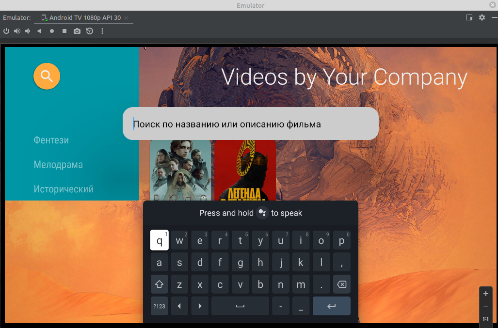

    После настройки строки поиска скройте её: ` android:visibility="invisible"`. Показывать этот элемент мы будем при клике по значку поиска.

1. В **MainFragment** 

    * на уровне класса создайте переменную для этого элемента
    * в методе *onActivityCreated* ДО вызова других элементов получите указатель на этот элемент `activity!!.findViewById(...)` (фрагмент работает в контексте активности)
    * реализуйте обработчик клика для поиска

        ```kt
        setOnSearchClickedListener {
            searchEditText.visibility = View.VISIBLE
            searchEditText.requestFocus()
        }
        ```

<!-- https://medium.com/@Marcus_fNk/building-an-android-tv-app-part-2-824766c1ddbe -->


<!-- https://tv.withgoogle.com/# -->

<!-- https://habr.com/ru/company/ivi/blog/351084/ -->

<!-- https://corochann.com/introduction-android-tv-application-hands-on-tutorial-1-32/

https://corochann.com/construction-of-browsefragment-android-tv-application-hands-on-tutorial-2-71/

https://www.kodeco.com/20747024-android-tv-getting-started -->


Предыдущая лекция | &nbsp; | Следующая лекция
:----------------:|:----------:|:----------------:
[Wear OS](./wear_os.md) | [Содержание](../readme.md#практика-разработка-мобильных-приложений) | [Разбор заданий прошлых лет](./f6_demo_1.md)
