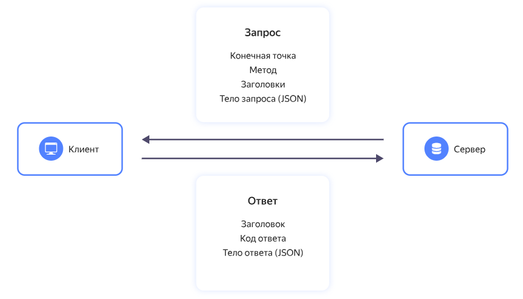
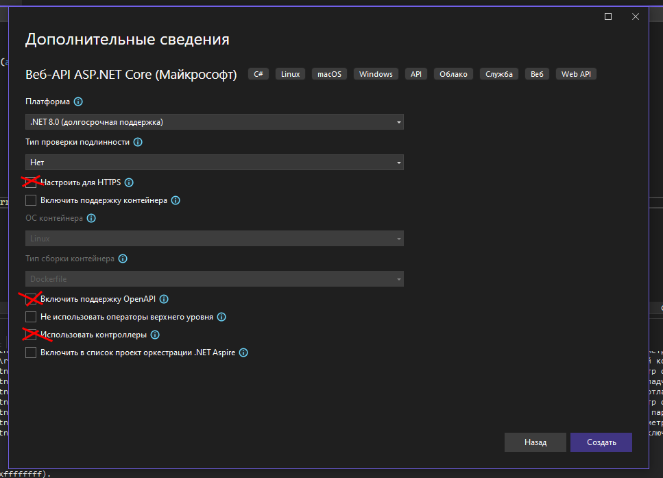
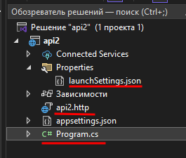
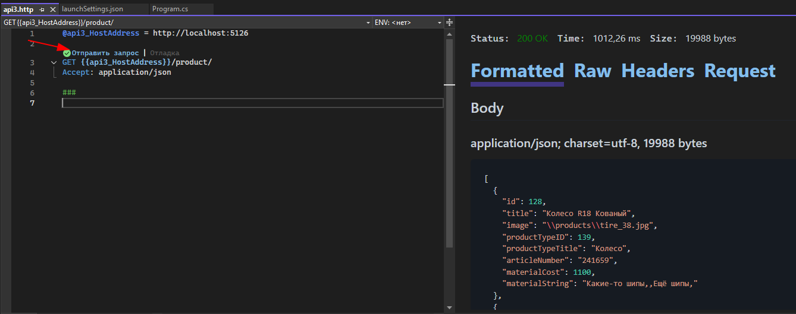

Предыдущая лекция |  | Следующая лекция
:----------------:|:----------:|:----------------:
[Вывод списка материалов продукта. CRUD материалов продукта](./cs_product_material.md) | [Содержание](../readme.md#разработка-своего-api) | [Авторизация и аутентификация. Методы авторизации. Basic-авторизация.](./api_auth.md)

# API. REST API. Создание сервера ASP.NET Core.

* [API. REST API.](#api-rest-api)
* [Swagger](#open-api-swagger)
* [Создание сервера ASP.NET Core.](#создание-сервера-aspnet-core)

## API. REST API.

Взято [отсюда](https://cloud.yandex.ru/docs/glossary/rest-api)

**API (Application Programming Interface)** — "язык", на котором приложения общаются между собой. С помощью API одно приложение может использовать возможности другого приложения. Например, интернет-магазин может вызывать банковские сервисы для оплаты покупок.

Описание правил такого языка называется *спецификацией*, а порции данных, которыми обмениваются приложения — *сообщениями*. Сообщения обычно идут парами *запрос-ответ*. Например, интернет-магазин отправляет запрос банковскому приложению, передавая ему реквизиты свои и покупателя, а также сумму для оплаты. А банковское приложение возвращает ответ, в котором сообщается, прошла ли оплата успешно. Ответ может быть более развернутым — например, чтобы покупатель видел движение своего заказа, интернет-магазин периодически отправляет запросы в службу доставки, в ответах получает данные о текущем статусе и местоположении заказа и передает эти сведения покупателю.

Свои API есть у большинства современных приложений и сервисов. Благодаря API вы можете из мобильного приложения вызвать такси или заказать доставку еды, а ваша корпоративная CRM-система может сохранить данные о новом клиенте в СУБД и отправить ему email с подтверждением заказа.

### Чем хорош REST API

В отличие от естественных разговорных языков, которые зарождались и развивались стихийно, стандарты взаимодействия приложений с самого начала строго регулируются, и это существенно облегчает жизнь разработчикам.

Одним из таких общепринятых стандартов является **REST**, что расшифровывается как **Representational State Transfer** — передача репрезентативного состояния.

**REST API** — это не один конкретный протокол взаимодействия, а архитектурный стиль. Он описывает, как разработчику следует спроектировать интерфейс для взаимодействия своего приложения с другими. Если продолжить аналогию с естественным языком, то **REST API** описывает грамматику. Принципы и ограничения **REST API**  были определены в 2000 году Роем Филдингом, одним из создателей протокола **HTTP**. Говорят, что *если интерфейс взаимодействия приложения соответствует принципам REST API, он является RESTful*.

Для доступа клиентских приложений к данным, хранящимся на сервере, в **REST API** используются такие методы как **POST**, **GET**, **PUT** и **DELETE**. При этом обмен сообщениями осуществляется обычно по протоколу **HTTP(S)**.

Главная особенность **REST API** — обмен сообщениями без сохранения состояния. Каждое сообщение самодостаточное и содержит всю информацию, необходимую для его обработки. Сервер не хранит результаты предыдущих сессий с клиентскими приложениями. Это обеспечивает гибкость и масштабируемость серверной части, позволяет поддерживать асинхронные взаимодействия и реализовывать алгоритмы обработки любой сложности. Кроме того, такой формат взаимодействия является универсальным — он не зависит от технологий, используемых на клиенте и на сервере, и не привязывает разработчиков к определенному провайдеру.

Из-за того, что приходится каждый раз заново передавать все данные для обработки запроса, объем сообщений увеличивается. Чтобы сохранить при этом высокую скорость обмена, данные передаются в максимально сжатом формате. Чаще всего **REST API** использует формат **JSON**, более лаконичный чем **XML**.

### Как это работает



Клиент отправляет запрос на сервер. Сервер аутентифицирует клиента и проверяет его права, затем обрабатывает запрос и возвращает ответ клиенту.

### Методы

Как правило, для взаимодействия между клиентом и сервером достаточно четырех методов:

* **GET** — получение информации об объекте (ресурсе);
* **POST** — создание, а иногда и изменение объекта (ресурса);
* **PUT** — изменение объекта (ресурса). Обычно используется для регулярного обновления данных;
* **DELETE** — удаление информации об объекте (ресурсе).

Реже используются методы **LIST**, **UPDATE**, **PATCH** и др.

>Так как в большинстве случаев **REST API** предназначен для получения данных из базы, то эти методы являются аналогами **CRUD** для данных.

Допустим, ваш интернет-магазин работает со сторонней службой доставки и обращается к ее серверу с помощью методов **REST API**.

* Чтобы передать в службу доставки информацию о новом заказе, отправляется запрос с методом **POST**.
* Когда диспетчер службы доставки передает заказ курьеру, статус заказа меняется — для этого используется метод **POST** или **PUT**.
* Если служба доставки позволяет отслеживать маршрут движения курьера с заказом на карте, то координаты заказа обновляются методом **PUT**.
* Если покупатель хочет проверить текущий статус заказа в личном кабинете, интернет-магазин отправляет на сервер службы доставки запрос **GET**.
* Если покупатель передумал сразу после отправки заказа, он может отменить его, отправив запрос **DELETE** — в этом случае в базе данных не сохранится никакой информации о несостоявшейся покупке. Но если интернет-магазин хочет хранить историю заказов, даже отмененных, он будет использовать метод **POST**.

### Структура запроса

Запрос **REST API** от клиента к серверу всегда состоит из следующих элементов:

* **Конечная точка (endpoint)** — адрес, по которому отправляется запрос.

    Один и тот же объект (ресурс) может иметь несколько конечных точек.

    Например, чтобы отправить запрос на сервер службы доставки `Best Delivery`, может использоваться конечная точка `best-delivery.com/orders`. Чтобы посмотреть список заказов, можно использовать конечную точку `best-delivery.com/orders/list`, а чтобы разместить новый заказ — `best-delivery.com/orders/create`.

* **Параметры** — делятся на параметры пути и параметры запроса.

    Например, в запросе `best-delivery.com/orders/{userId}/list` `{userId}` — это параметр пути. Вместо `{userId}` нужно подставить идентификатор конкретного пользователя, тогда запрос вернет список заказов этого пользователя.

    В запросе `best-delivery.com/orders/list?orderId=123456` `orderId` — это параметр запроса. Такой запрос вернет информацию о конкретном заказе.

    В одном запросе может быть несколько параметров пути и несколько параметров запроса. Параметры запроса соединяются между собой символом `&`. Например, запрос `best-delivery.com/orders/shop/{shopId}/users/{userId}/list?top=10&sortDate=DESC` вернет список заказов в магазине `{shopId}` для пользователя `{userId}`, причем список будет содержать только 10 последних заказов, т.к. он отсортирован по убыванию даты заказа.

* **Заголовки (headers)** — в заголовках определяется формат передаваемых данных, спецификация и версия протокола обмена и другая информация, необходимая для корректной обработки запроса.

    Если для выполнения запроса требуется *аутентификация*, в заголовке передаются сведения о пользователе — логин, токен и т.п. Заголовки не отображаются в пути запроса.

* **Тело запроса (body)** — данные для обработки, как правило в формате **JSON** (у метода **GET** нет *body*).

    Например, запрос для службы доставки может содержать номер заказа, адрес, телефон для связи и интервал доставки, примерно так:

    ```json
    {
        "orderId":123456, 
        "address":"119021, Москва, ул. Льва Толстого, 16",
        "phone":"+74957397000",
        "time_interval":"9:00-11:00"
    }
    ```

### Структура ответа

После выполнения **REST API** запроса сервер вернет клиентскому приложению ответ. Он включает **код ответа**, **заголовки** и **тело ответа**.

* Как и в запросе, **заголовки** в ответе также определяют формат передаваемых данных, спецификацию и версию протокола обмена, и другие сведения, которые помогут клиентскому приложению правильно прочитать и понять ответ.
* **Тело ответа** — это информация, которую запрашивал клиент. Ответ тоже чаще всего передается в формате **JSON**. Но тело ответа может быть и пустым.
* **Код ответа** — это признак успешности выполнения запроса. Для унификации используются стандартные коды ответа (HTTP). Они представляют собой трехзначные числа. Ответы, начинающиеся с цифры 1, обозначаются 1xx, и т.п.

Ответы вида `1хх` — информационные.

Ответы вида `2хх` говорят об успешном выполнении запроса. Например:

* `200` – ОК. Если клиентом были запрошены какие-либо данные, то они находятся в заголовке или теле сообщения.
* `201` – OK. Создан новый ресурс.

Ответы вида `3xx` обозначают перенаправление или необходимость уточнения. Например:

* `300` — на отправленный запрос есть несколько вариантов ответа. Чтобы получить нужный вариант, клиент должен уточнить запрос.
* `301` — запрашиваемый адрес перемещен.
* `307` — запрашиваемый адрес временно перемещен.

Ответы вида `4хх` говорят о том, что при выполнении запроса возникла ошибка, и это ошибка на стороне клиента. Например:

* `400` – Bad Request. Запрос некорректный.
* `401` – Unauthorized. Запрос требует аутентификации пользователя.
* `403` – Forbidden. Доступ к сервису запрещен.
* `404` – Not found. Ресурс не найден.

Ответы вида `5хх` говорят об ошибке на стороне сервера. Например:

* `503` — сервис недоступен.
* `504` — таймаут (превышено допустимое время обработки запроса).

### Описание API

Как уже говорилось выше, **REST API** — это архитектурный подход, а не конкретный протокол. Каждое приложение или сервис может иметь свой **API**, разработанный в соответствии со стандартами и лучшими отраслевыми практиками. Такая свобода обеспечивает большую гибкость и широту возможностей. Но чтобы сторонние разработчики могли воспользоваться разнообразными возможностями вашего сервиса, **API** должен быть хорошо задокументирован.

Отраслевым стандартом описания **REST API** является спецификация документирования **OpenAPI** (ранее она называлась **Swagger**). В настоящее время используется версия **OpenAPI Specification 3.0**, а также немного устаревшая, но еще актуальная версия 2.0.

### Альтернативы и применение REST API

**REST API** — самый популярный сегодня стандарт взаимодействия приложений, хотя не первый и не единственный.

Первым широко распространенным стандартом стал **SOAP** (Simple Object Access Protocol). Но **SOAP**-сообщения довольно громоздки (как минимум потому, что используют формат **XML**, а не более лаконичный **JSON**), что стало особенно неудобно с распространением мобильного интернета. **SOAP** изначально предназначался для описания вызова удаленных процедур — **RPC** (Remote Procedure Call), когда клиентское приложение выполняет функцию или процедуру на сервере, а сервер отправляет результат обратно клиенту.

## Open API (Swagger)

**OpenApi (Swagger)** - это фреймворк для спецификации **RESTful API**. Его прелесть заключается в том, что он дает возможность не только интерактивно просматривать спецификацию, но и отправлять запросы.

**ASP.NET** поддерживает генерацию спецификации и конечной точки для использования этой спецификации.

>[Подробнее про OpenApi (Swagger)](https://learn.microsoft.com/ru-ru/aspnet/core/tutorials/web-api-help-pages-using-swagger?view=aspnetcore-7.0)

## Создание сервера ASP.NET Core.

### Маршрутизация в ASP.NET

>Взято из [официальной документации Microsoft](https://learn.microsoft.com/ru-ru/aspnet/core/fundamentals/routing?view=aspnetcore-7.0#endpoints), поэтому язык несколько тяжеловесный.

Маршрутизация обеспечивает сопоставление входящих **HTTP**-запросов и их распределение по исполняемым конечным точкам приложения. [Конечные точки](#конечные-точки) — это блоки исполняемого кода обработки запросов приложения. Конечные точки определяются в приложении и настраиваются при его запуске. Процесс сопоставления конечных точек может извлекать значения из URL-адреса запроса и предоставлять эти значения для обработки запроса.

>Напомню состав URL-адреса
>
>```
>http://доменное.имя:порт/какой/то/путь?ключ=значение&ещё=чтонибудь
>```
>где:
* `http://` - протокол запроса, обычно используются **HTTP** и/или **HTTPS**
* `доменное.имя:порт` - адрес сервера, порт по-умолчанию `80` для HTTP или `443` для HTTPS
* `/какой/то/путь` - путь (PATH) запроса
* `?ключ=значение&ещё=чтонибудь` - параметры запроса (querystring) в виде списка `ключ=значение`, разделитель `&`. Могут отсутствовать, начинаются со знака `?`.

#### Основы маршрутизации

В следующем коде приведен базовый пример маршрутизации. Заодно в комментариях расписана структура.

```cs
var builder = WebApplication.CreateBuilder(args);

/* 
сюда дописываются дополнительные сервисы, всё что дальше начинается с "builder.Services"
*/

var app = builder.Build();

/* 
тут запускаются так называемые "middleware": swagger, авторизация и т.п. процедуры, которые должны быть выполнены ДО обработки конечных точек

они начинаются с "app.Use"
*/

app.MapGet("/", () => "Hello World!");

app.Run();
```

В этом примере используется одна конечная точка с помощью **MapGet** метода:

* При отправке HTTP-запроса **GET** в корневой URL-адрес `/`:
    * Выполняется делегат запроса.
    * В ответ HTTP записывается "Hello World!".
* Если метод запроса не является **GET** или если корневой URL-адрес не `/`, сопоставление маршрута не выполняется и возвращается сообщение об ошибке HTTP `404`.

Маршрутизация использует пару ПО промежуточного слоя: **UseRouting** и **UseEndpoints**.

* **UseRouting** добавляет соответствие маршрута в конвейер ПО промежуточного слоя. Это ПО промежуточного слоя обращается к набору конечных точек, определенных в приложении, и выбирает наиболее подходящее на основе запроса.
* **UseEndpoints** добавляет выполнение конечной точки в конвейер ПО промежуточного слоя. Он запускает делегат, связанный с выбранной конечной точкой.

Приложениям обычно не требуется вызывать **UseRouting** или **UseEndpoints**. **WebApplicationBuilder** настраивает конвейер ПО промежуточного слоя, который создает программу-оболочку для ПО промежуточного слоя, добавленное в `Program.cs` с использованием **UseRouting** и **UseEndpoints**. Но приложения могут изменять порядок, в котором выполняются **UseRouting** и **UseEndpoints**, вызывая эти методы явным образом. Например, следующий код явным образом вызывает **UseRouting**:

```cs
app.Use(async (context, next) =>
{
    // ...
    await next(context);
});

app.UseRouting();

app.MapGet("/", () => "Hello World!");
```

В предыдущем коде:

* Вызов `app.Use` регистрирует пользовательское ПО промежуточного слоя, которое выполняется в начале конвейера.
* При вызове метода **UseRouting** ПО промежуточного слоя сопоставления маршрутов настраивается для запуска после пользовательского ПО промежуточного слоя.
* Конечная точка, зарегистрированная с использованием **MapGet**, выполняется в конце конвейера.

Если бы предыдущий пример не включал вызов **UseRouting**, то пользовательское ПО промежуточного слоя выполнилось бы после ПО промежуточного слоя сопоставления маршрутов.

#### Конечные точки

Для определения конечной точки используется метод **MapGet** (а также **MapPost**, **MapPut**, **MapDelete** и т.п, т.е. после префикса **Map** указывается метод HTTP). Конечная точка — это то, что можно:

* выбрать путем сопоставления URL-адреса и метода HTTP;
* выполнить путем запуска делегата.

Конечные точки, которые могут быть сопоставлены и выполнены приложением, настраиваются в **UseEndpoints**. Например, **MapGet**, **MapPost** и [аналогичные методы](https://learn.microsoft.com/ru-ru/dotnet/api/microsoft.aspnetcore.builder.endpointroutebuilderextensions?view=aspnetcore-7.0) подключают делегаты запросов к системе маршрутизации. Для подключения функций платформы **ASP.NET Core** к системе маршрутизации можно использовать дополнительные методы.

* MapRazorPages для Razor Pages
* MapControllers для контроллеров
* MapHub<THub> для SignalR
* MapGrpcService<TService> для gRPC

Ниже представлен пример маршрутизации с более сложным шаблоном маршрута.

```cs
app.MapGet(
    "/hello/{name:alpha}", 
    (string name) => $"Hello {name}!");
```

Строка `/hello/{name:alpha}` является **шаблоном маршрута**. Шаблон маршрута используется для настройки способа сопоставления конечной точки. В этом случае шаблон соответствует следующим условиям.

Любой URL-путь, начинающийся с `/hello/`, после которого следует набор буквенных символов. `:alpha` применяет ограничение маршрута, которое соответствует только буквенным символам. Ограничения маршрута описаны далее в этой статье.

Второй сегмент URL-пути, `{name:alpha}`:

* привязан к параметру `name`;
* Записывается и хранится в [HttpRequest.RouteValues](https://learn.microsoft.com/ru-ru/dotnet/api/microsoft.aspnetcore.http.httprequest.routevalues?view=aspnetcore-7.0).

Если человеческим языком, то в **пути** запроса может быть один или несколько параметров, которые автоматически добавляются в параметры делегата (лямбда-функции)

#### Ограничения маршрута

Ограничения маршрута применяются, когда найдено соответствие входящему URL-адресу и путь URL-адреса был разобран на значения маршрута. Как правило, ограничения маршрута служат для проверки значения маршрута, связанного посредством шаблона маршрута, и принятия решения касательно того, является ли значение приемлемым (истина или ложь). Некоторые ограничения маршрута используют данные, не относящиеся к значению маршрута, для определения возможности маршрутизации запроса. Например, HttpMethodRouteConstraint может принимать или отклонять запрос в зависимости от HTTP-команды. Ограничения используются в маршрутизации запросов и создании ссылок.

>Предупреждение
>
>Не используйте ограничения для проверки входных данных. Если для проверки входных данных используются ограничения, недопустимые входные данные приводят к ошибке `404` ("Не найдено"). Недопустимые входные данные должны привести к ошибке `400` ("Неверный запрос") с соответствующим сообщением об ошибке. Ограничения маршрутов следует использовать для разрешения неоднозначности похожих маршрутов, а не для проверки входных данных определенного маршрута.

В приведенной ниже таблице показаны примеры ограничения маршрутов и их ожидаемое поведение.

ограничение | Пример | Примеры совпадений | Примечания
------------|--------|--------------------|-----------
int | `{id:int}` | 123456789, -123456789 | Соответствует любому целому числу
bool | `{active:bool}` | true, FALSE | Соответствует true или false. Без учета регистра
datetime | `{dob:datetime}` | 2016-12-31, 2016-12-31 7:32pm | Соответствует допустимому значению DateTime для инвариантного языка и региональных параметров. См. предупреждение выше.
decimal | `{price:decimal}` | 49.99, -1,000.01 | Соответствует допустимому значению decimal для инвариантного языка и региональных параметров. См. предупреждение выше.
double | `{weight:double}` | 1.234, -1,001.01e8 | Соответствует допустимому значению double для инвариантного языка и региональных параметров. См. предупреждение выше.
float | `{weight:float}` | 1.234, -1,001.01e8 | Соответствует допустимому значению float для инвариантного языка и региональных параметров. См. предупреждение выше.
guid | `{id:guid}` | CD2C1638-1638-72D5-1638-DEADBEEF1638 | Соответствует допустимому значению Guid
long | `{ticks:long}` | 123456789, -123456789 | Соответствует допустимому значению long
minlength(value) | `{username:minlength(4)}` | Rick | Строка должна содержать не менее 4 символов
maxlength(value) | `{filename:maxlength(8)}` | MyFile | Строка должна содержать не более 8 символов
length(length) | `{filename:length(12)}` | somefile.txt | Длина строки должна составлять ровно 12 символов
length(min,max) | `{filename:length(8,16)}` | somefile.txt | Строка должна содержать от 8 до 16 символов
min(value) | `{age:min(18)}` | 19 | Целочисленное значение не меньше 18
max(value) | `{age:max(120)}` | 91 | Целочисленное значение не больше 120
range(min,max) | `{age:range(18,120)}` | 91 | Целочисленное значение от 18 до 120
alpha | `{name:alpha}` | Rick | Строка должна состоять из одной буквы или нескольких (a-z) без учета регистра.
regex(expression) | `{ssn:regex(^\\d{{3}}-\\d{{2}}-\\d{{4}}$)}` | 123-45-6789 | Строка должна соответствовать регулярному выражению. См. советы по определению регулярного выражения.
required | `{name:required}` | Rick | Определяет обязательное наличие значения, не относящегося к параметру, во время формирования URL-адреса

К одному параметру может применяться несколько ограничений, разделённых двоеточием. Например, следующее ограничение ограничивает параметр целочисленным значением 1 или больше:

```
users/{id:int:min(1)}
```

#### Параметры пути и поиска (querystring)

**ASP.NET** достаточно умный, чтобы вытащить из запроса все параметры, независимо от того где в URL они расположены. Параметры из **пути**, **строки запроса** и **тела запроса** в итоге попадают в коллекцию параметров делегата:

Например, есть такой запрос:

```
GET http://localhost:8080/test/1/2?pageNum=10
```

Для него написана **конечная точка**:

```cs
app.MapGet(
    "/test/{param1:int}/{param2:int}",
    (int param1, int param2, int? pageNum, int? pageLen) =>
    {
        return $"param1 = {param1}, param2 = {param2}, pageNum = {pageNum}, pageLen = {pageLen}"; 
    });
```

* Имена параметров (*param1* и *param2*) для значений получаемых из пути мы задаем при описании **конечной точки**: `/test/{param1:int}/{param2:int}`
* Значения параметров *pageNum* и *pageLen* мы получаем из **строки запроса** (обратите внимание, параметр *pageLen* в URL отсутствует, но мы предусмотрели его наличие)

При запросе сервер ответит:

```
HTTP/1.1 200 OK
Connection: close
Content-Type: text/plain; charset=utf-8
Date: Mon, 16 Oct 2023 14:24:36 GMT
Server: Kestrel
Transfer-Encoding: chunked

param1 = 1, param2 = 2, pageNum = 10, pageLen = 
```

Причём порядок параметров в делегате значения не имеет, т.к. они берутся из коллекции по имени.

### Создание API-сервера для CRUD продукции

Для создания API сервера на ASP.NET есть два шаблона: на основе контроллеров и минималистичный. Подробнее можно почитать в [официальной документации microsoft](https://learn.microsoft.com/ru-ru/aspnet/core/fundamentals/apis?view=aspnetcore-7.0).

Мы для своего АПИ будем использовать минималистичный вариант (он проще).

1. Создайте новое приложение `Web-API ASP.NET Core` 
    
    >Количество и настройка шаблонов могут отличаться в разных версиях Visual Studio. Далее рассматривается Visual Studio 2022

    Минималистичное АПИ можно создать любым шаблоном, но второй шаблон (AOT) не совместим с **Dapper**, поэтому используем первый шаблон, отключив не нужные нам опции:

    

1. Структура проекта

    

    В созданном проекте нам интересны файлы `Program.cs`, `*.http` и `launchSettings.json`
        
    * `Program.cs` - основной код приложения, в нём создаются *конечные точки*

        В файле уже есть `рыба` - проект с эмуляцией сервиса "погода"

        ```cs
        var builder = WebApplication.CreateBuilder(args);

        // Add services to the container.

        var app = builder.Build();

        // Configure the HTTP request pipeline.

        var summaries = new[]
        {
            "Freezing", "Bracing", "Chilly", "Cool", "Mild", "Warm", "Balmy", "Hot", "Sweltering", "Scorching"
        };

        app.MapGet("/weatherforecast", () =>
        {
            var forecast = Enumerable.Range(1, 5).Select(index =>
                new WeatherForecast
                (
                    DateOnly.FromDateTime(DateTime.Now.AddDays(index)),
                    Random.Shared.Next(-20, 55),
                    summaries[Random.Shared.Next(summaries.Length)]
                ))
                .ToArray();
            return forecast;
        });

        app.Run();

        internal record WeatherForecast(DateOnly Date, int TemperatureC, string? Summary)
        {
            public int TemperatureF => 32 + (int)(TemperatureC / 0.5556);
        }
        ```

        Если запустить проект, то сервер откроет порт для прослушивания входящих соединений (для HTTP)
        
        ```
        info: Microsoft.Hosting.Lifetime[14]
            Now listening on: http://localhost:5256
        info: Microsoft.Hosting.Lifetime[0]
            Application started. Press Ctrl+C to shut down.
        ``` 

        И откроет страницу в браузере

    * `launchSettings.json`

        При создании веб-приложения, автоматически создается файл `Properties/launchSettings.json` с указанием портов, на которых отвечает это приложение. 

        ```json
        {
            "$schema": "http://json.schemastore.org/launchsettings.json",
            "iisSettings": {
                "windowsAuthentication": false,
                "anonymousAuthentication": true,
                "iisExpress": {
                "applicationUrl": "http://localhost:49863",
                "sslPort": 0
                }
            },
            "profiles": {
                "http": {
                "commandName": "Project",
                "dotnetRunMessages": true,
                // тут можно отключить запуск браузера
                "launchBrowser": true,
                "launchUrl": "weatherforecast",
                // тут можно изменить порт
                "applicationUrl": "http://localhost:5153",
                "environmentVariables": {
                    "ASPNETCORE_ENVIRONMENT": "Development"
                }
                },
                "IIS Express": {
                "commandName": "IISExpress",
                "launchBrowser": true,
                "launchUrl": "weatherforecast",
                "environmentVariables": {
                    "ASPNETCORE_ENVIRONMENT": "Development"
                }
                }
            }
        }
        ```

        Но можно переопределить порт в методе **Run**:

        ```cs
        app.Run("http://localhost:8080");
        ```

    * `<Название проекта>.http`

        ```
        @api4_HostAddress = http://localhost:5153

        GET {{api4_HostAddress}}/weatherforecast/
        Accept: application/json

        ###
        ``` 

        Текстовый файл с описанием конечных точек. Плагины в **VS** и **VSCode** распознают расширение `.http` и позволяют выполнять запросы в один клик

1. Подключение БД

    Используйте тот же подход, что и для обычного приложения: [Создание подключения к БД MySQL.](./cs_mysql_connection3.md)

1. Добавление *конечной точки* для получения списка продукции (**C****_Read_****UD**):

    Удалите код, реализующий сервер погоды. Пустой проект должен быть таким:

    ```cs
    var builder = WebApplication.CreateBuilder(args);
    var app = builder.Build();

    // сюда будем добавлять свои конечные точки

    app.Run();
    ```

    >Не забудьте добавить в проект зависимости **MySQLConnector** и **Dapper** и создать поставщик данных:
    >
    >```cs
    >var dbDataProvider = new DBDataProvider();
    >```

    Добавьте **MapGet** с _конечной точкой_ `/product`: 

    ```cs
    app.MapGet("/product", () =>
    {
        return dbDataProvider.getProduct();
    });
    ```

    Можно запустить проект и либо открыть ссылку `http://localhost:<порт>/product` в браузере, либо отредактировать `.http` файл и выполнить запрос в нём:

    

    В принципе этого может быть уже достаточно на демо-экзамене, если в ТЗ явно не указано какие именно поля должен возвращать запрос.

    Добавим обработку **querystring**, чтобы запрос поддерживал номер и размер страницы:

    ```cs
    app.MapGet("/product", (int? pageNum) =>
    {
        return dbDataProvider.getProduct(pageNum ?? 1);
    });
    ```

1. Добавление новой продукции (**_Create_****RUD**)

    Добавьте **MapPost** с конечной точной `/product`: 

    ```cs
    app.MapPost("/product", (Product newProduct) =>
    {
        dbDataProvider.saveProduct(newProduct);
    });
    ```

    Здесь у нас в параметрах делегата объект _newProduct_, который автоматически получен из тела запроса (ни в пути, ни в строке поиска параметров нет).

    Попробуйте добавить и выполнить этот запрос в `.http` (id типа продукции возьмите из своей базы):

    ```http
    ### Добавление продукта
    POST {{api3_HostAddress}}/product
    Content-Type: application/json

    {
        "ID": 0,
        "Title": "Новое колесо",
        "ProductTypeID": 1,
        "ArticleNumber": "123"
    }

    ### конец тела запроса
    ```

    - тело запроса в формате **JSON**, причём названия полей должны соответствовать **модели** **Product** (но не надо заполнять вычисляемые поля, достаточно только тех полей, которые нужны для **таблицы** **Product**)
    - должны быть указаны все обязательные поля, остальные желательно, но не обязательно.

    Если всё нормально, то код ответа будет `200`, а содержимого мы никакого не возвращаем (если нужно, то тут можно вернуть вновь созданный объект, чтобы сразу знать его `id`). 

1. Изменение существующей продукции (**СR****_Update_****D**)

    * используем метод `PUT`

    Реализация **конечной точки**:

    ```cs
    app.MapPut("/product", 
        (Product editProduct) =>
    {
        dbDataProvider.saveProduct(editProduct);
    })
    ```

    В `.http` протестируйте сами, тут уже ничего нового нет.

1. Удаление существующей продукции (**СRU****_Delete_**)

    Тут, в принципе, должно быть уже понятно (метод `DELETE` с указанием `id` продукции в пути):

    Реализация **конечной точки**:

    ```cs
    app.MapDelete(
        "/product/{id:int}", 
        (int id) =>
    {
        dbDataProvider.removeProduct(id);
    })
    ```

---

**Задание:**

В следующих лекциях мы напишем для нашего **WPF** проекта **HttpDataProvider**, который будет получать данные через **АПИ**, вам нужно реализовать все конечные точки, которые нужны для реализации интерфейса **IDataProvider**.

Предыдущая лекция |  | Следующая лекция
:----------------:|:----------:|:----------------:
[Вывод списка материалов продукта. CRUD материалов продукта](./cs_product_material.md) | [Содержание](../readme.md#разработка-своего-api) | [Авторизация и аутентификация. Методы авторизации. Basic-авторизация.](./api_auth.md)
