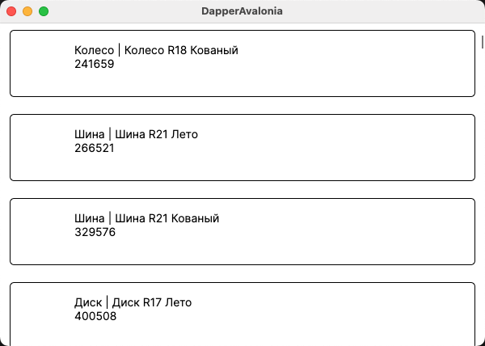

# Avalonia

**C#** (.NET Core) кроссплатформенный, но **WPF** реализован на DirectX и поддерживается только в Windows.

Есть кросплатформенный форк **Avalonia** - он на уровне формата практически совместим с **WPF**, но реализован на OpenGL и может использоваться в других операционных системах. 

Рассмотрим создание тестового оконного приложения с получением данных из базы на маке

>**Visual Studio** больше не поддерживает **MacOs**, для разработки рекомендуется использовать **Visual Studio Code** 

## Создание проекта

1. Перед созданием первого проекта нужно установить шаблоны для авалонии:

    ```
    dotnet new install Avalonia.Templates
    ```

1. Создание проекта

    ```
    dotnet new avalonia.app -o <название проекта>
    ```

    Команда создаст в текущем каталоге каталог `<название проекта>` и в нем необходимую структуру проекта

## Установка зависимостей

Я реализую начало проекта [список продукции](./cs_mysql_connection3.md)

```
dotnet add package MySqlConnector
dotnet add package Dapper
```

## Создание классов и интерфейсов

>Можно, конечно, написать все руками, но можно создавать файлы проекта используя cli-команды. Команды выполнять в том каталоге, где хотите создать файл

```
dotnet new interface -n IDataProvider
dotnet new class -n DBDataProvider
```

## Примечания к реализации

>Весь код перенесен из приложения **WPF**

В целом, как уже отмечалось, **Avalonia** совместима с **WPF**, но есть и некоторые отличия

1. В компонентах (списочных) нужно явно указать какой тип данных будет выводиться в списке. Для этого используется аттрибут `x:DataType`, причем, чтобы авалония нашла где этот тип данных находится, нужно создать пространство имен (namespace)


    ```xml
    <Window 
        ...
        xmlns:model="using:DapperAvalonia"
        ^^^^^^^^^^^^^^^^^^^^^^^^^^^^^^^^^^
        Name="root"
        ^^^^^^^^^^^
    >
    <ListBox 
        Grid.Row="1"
        Background="White"
        x:DataType="model:Product"
        ^^^^^^^^^^^^^^^^^^^^^^^^^^
        ItemsSource="{Binding #root.productList}">
                              ^^^^^        
    ```

    * `xmlns:model="using:DapperAvalonia"` - в окне добавляем неймспейс, присвоив ему алиас **model** (по этому алиасу мы можем обращаться к нужному неймспейсу в верстке)
    * `Name="root"` - предыдущая команда меняет контекст и в окне становятся недоступны свойства класса окна - добавляем окну имя и, там где нужно, указываем абсолютный контекст 
    * `x:DataType="model:Product"` - тут мы указываем в каком неймспейсе находится тип **Product**
    * `#root.productList` - а тут мы явно указываем контекст для свойства класса окна


1. Конструктор окна похоже работает асинхронно, по крайней мере, если использовать синхронный вариант получения данных, то они не выводятся на экран (данные считываются после того как окно уже инициализировано)

    Вариантов исправления два:

    * **синхронный**

        Сначала получаем данные и только потом инициализируем окно (естественно при этом нельзя обращаться к объектам окна - их еще не существует)

        ```cs
        public MainWindow()
        {
            Globals.dataProvider = new DBDataProvider();
            productList = Globals.dataProvider.getProduct();

            // инициализацию переносим после получения данных
            InitializeComponent();
        }
        ```

    * **асинхронный**

        Вынести получение данных в асинхронный метод и вызвать после него событие **PropertyChanged** (в оригинальной лекции этот вариант реализован)


Пример приложения собранного и запущенного на Mac (arm64)

