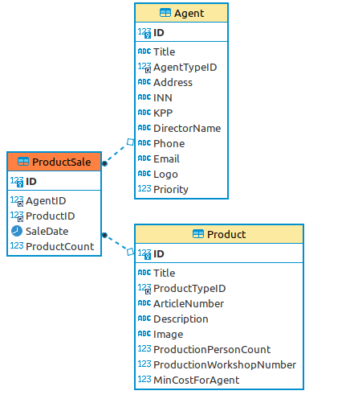
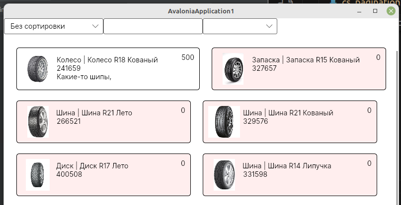

<table style="width: 100%;"><tr><td style="width: 40%;">
<a href="../articles/cs_pagination.md">Пагинация, сортировка, фильтрация, поиск
</a></td><td style="width: 20%;">
<a href="../readme.md">Содержание
</a></td><td style="width: 40%;">
<a href="../articles/cs_edit_product.md">Создание, изменение продукции
</a></td><tr></table>

# Подсветка элементов по условию. Дополнительные выборки.

>В списке продукции необходимо подсвечивать светло-красным цветом те продукты, которые не продавались агентами в последний месяц.

Критерий | Баллы
---------|:---:
Реализовано выделение (любым образом) продуктов, которые не продавались агентами в последний месяц | 1.5
Выделение реализовано в виде светло-красной подсветки элемента продукции | 0.5
**Итого** | **2**

В самом списке продукции данных о продажах нет. Судя по названиям таблиц данные эти должны быть в таблице **ProductSale**. Судя по связям этой таблицы, мы должны заполнить ещё таблицы **Agent** и **AgentType**.



На демо-экзамене до этого вы вряд-ли дойдёте (хотя критерий достаточно жирный), но в рамках курсовой/дипломной работы реализовать дополнительный функционал надо.

## Добавление данных вручную

1. Добавляем типы агентов

    Исходных данных для этой и последующих таблиц нет, поэтому вы можете писать туда что угодно (но близко к предметной области). Для типов агентов подойдут "индивидуальный предприниматель" и "Общество с ограниченной ответственностью" (для не обязательных таблиц много данных придумывать не надо, достаточно одной-двух записей)

    И так как исходных данных нет, ~~а редактировать напрямую из **MySQL Workbench** нельзя, то пишем SQL-запрос вставки данных в основном его синтаксисе (с VALUE)~~ то добавляем данные прямо в таблицы.

2. Добавляем агента

    Тут заполняем только обязательные поля. *AgentTypeID* смотрим в таблице **AgentType**.

3. Создание продаж продукции

    Добавляем несколько записей. Поля *AgentID* и *ProductID* смотрим в соответствующих таблицах. Дата продажи заполняется в формате `YYYY-MM-DD`

## Дополнительная выборка

Сначала пишем и отлаживаем запрос получения количества дней с последней продажи (дата продажи сама по себе нам не нужна, достаточно знать сколько дней прошло с момента продажи)

```sql
SELECT 
    ProductID, 
    DATEDIFF(NOW(), max(SaleDate)) AS LastSaleDate
FROM 
    ProductSale
GROUP BY 
    ProductID
```

* Функция **DATEDIFF** вычисляет количество дней между датами. 
* Функция **NOW** возвращает текущую дату.

Теперь этот запрос можно вставить в нашу основную выборку ещё одним **LEFT JOIN**-ом

```sql
SELECT 
    p.*,
    pt.Title AS ProductTypeTitle,
    pp.MaterialList, pp.Total,
    Sales.DaysFromLastSale
--  ^^^^^^^^^^^^^^^^^^^^^^
FROM
    Product p
LEFT JOIN
    ProductType pt ON p.ProductTypeID = pt.ID
LEFT JOIN
    (
    SELECT
        pm.ProductID,
        GROUP_CONCAT(m.Title SEPARATOR ', ') as MaterialList, 
        SUM(pm.Count * m.Cost / m.CountInPack) as Total
    FROM
        Material m,
        ProductMaterial pm
    WHERE m.ID = pm.MaterialID
    GROUP BY ProductID
    ) pp ON pp.ProductID = p.ID
LEFT JOIN 
    (
        select 
            ProductID, 
            DATEDIFF(NOW(), max(SaleDate)) as DaysFromLastSale
        from 
            ProductSale
        group by ProductID
    ) Sales on Sales.ProductID = p.ID ;
```

Атрибут *DaysFromLastSale* в модель пропишите сами.

В методе получения данных с сервера надо вставить проверку на тип **NULL**

```cs
NewProduct.DaysFromLastSale = 
    (Reader["DaysFromLastSale"] as int?) ?? 999;
```

Или просто завернуть чтение этого поля в `try...except` и, при возникновении исключения, подставлять данные по-умолчанию

```cs
try
{
    NewProduct.DaysFromLastSale = Convert.ToInt32(
        Reader["DaysFromLastSale"].ToString());
}
catch (Exception)
{
    // нам не интересно всё, что больше 30
    NewProduct.DaysFromLastSale = 999;
}
```

## Раскраска по условию

Тут элементарно. У элемента рамка (Border) задаем цвет фона:

```cs
<Border 
    BorderThickness="1" 
    BorderBrush="Black" 
    Background="{Binding BackgroundColor}"
                ^^^^^^^^^^^^^^^^^^^^^^^^^
    CornerRadius="5">
```

И добавляем в модель геттер *BackgroundColor*

```cs
public string BackgroundColor {
    get {
        if(DaysFromLastSale>30) return "#fee";
        return "#fff";
    }
}
```

>Про цвета: их можно отдавать в формате **#RGB**. Причём, чем ближе к **F**, тем светлее (**#FFF** - белый)



# Массовая смена цены продукции

>Необходимо добавить возможность изменения минимальной стоимости продукции для агента сразу для нескольких выбранных продуктов. Для этой цели реализуйте возможность выделения сразу нескольких элементов в списке продукции, после чего должна появиться кнопка “Изменить стоимость на ...”. При нажатии на кнопку необходимо отобразить модальное окно с возможностью ввода числового значения, на которое и будет увеличена стоимость выбранных продуктов. По умолчанию в поле должно быть введено среднее значение цены на продукцию для агента. После нажатия кнопки “Изменить” стоимость выделенных продуктов должна быть изменена в базе данных, а также обновлена в интерфейсе.

Критерий | Баллы
---------|:---:
Реализована возможность выделения сразу нескольких элементов в списке | 0.2
После выделения элементов в списке появляется кнопка "Изменить стоимость на ..." | 0.3
При нажатии на кнопку отображается модальное окно для изменения цены | 0.1
В модальном окне есть возможность ввода числового значения | 0.1
По умолчанию введено значение средней цены выбранных продуктов | 0.2
Реализована проверка на ввод только числового значения | 0.2
После нажатия кнопки "Изменить" стоимость всех выбранных продуктов изменяется в БД | 0.5
После нажатия кнопки "Изменить" стоимость всех выбранных продуктов обновляется в списке | 0.2
**Итого** | **1.8**

## Выделение нескольких элементов

Возможность выделения нескольких элементов в **ListView** есть, специально её реаизовывать не надо. Надо лишь поймать это событие и сосчитать количество выделенных элементов.

В **ListView** нужно добавить название (мы потом будем по нему искать количество выделенных элементов) и обработчик события *SelectionChanged*

```cs
x:Name="ProductListView"
SelectionChanged="ListView_SelectionChanged"
```

Реализуем обработчик *ListView_SelectionChanged*:

```cs
public int ProductsSelectedCount = 0;
private void ListView_SelectionChanged(object sender, SelectionChangedEventArgs e)
{
    ProductsSelectedCount = ProductListView.SelectedItems.Count;
}
```

## Отображение кнопки "Изменить стоимость на ..."

Сначала просто добавляем эту кнопку в разметку

```xml
<Button
    x:Name="CostChangeButton"
    Visibility=""
    Content="Изменить стоимость на..."
    />
```

И запоминаем какие значения может прнимать атрибут *Visibility*


* **Collapsed** - элемент не отображается и НЕ ЗАНИМАЕТ МЕСТО в контейнере
* **Hidden** - элемент не отображается, но под него остается выделенное место
* **Visible** - элемент отображается

Теперь, чтобы видимость кнопки зависела от количества выделенных элементов, мы привязываем атрибут *Visibility* к свойству *CostChangeButtonVisible*

```xml
<Button
    x:Name="CostChangeButton"
    Visibility="{Binding CostChangeButtonVisible}"
    Content="Изменить стоимость на..."
    />
```

И реализуем это свойство в коде ОКНА

```cs
public string CostChangeButtonVisible {
    get {
        if (ProductsSelectedCount > 1) return "Visible";
        return "Collapsed";
    }
}
```

Осталось в обработчик события *ListView_SelectionChanged* вставить вызов метода PropertyChanged для свойства *CostChangeButtonVisible*

Чтобы не плодить кучу одинаковых методов, я добавил в параметры метода **Invalidate** имя свойства, которое изменилось

```cs
private void Invalidate(string ComponentName = "ProductList") {
    if (PropertyChanged != null)
        PropertyChanged(this, new PropertyChangedEventArgs(ComponentName));
}

private void ListView_SelectionChanged(object sender, SelectionChangedEventArgs e)
{
    ProductsSelectedCount = ProductListView.SelectedItems.Count;
    Invalidate("CostChangeButtonVisible");
}
```

## Вывод модального окна

1. Добавляем кнопке обработчик события клика

    ```xml
    <Button
        x:Name="CostChangeButton"
        Visibility="{Binding CostChangeButtonVisible}"
        Click="CostChangeButton_Click"
        ^^^^^^^^^^^^^^^^^^^^^^^^^^^^^^
        Content="Изменить стоимость на..."
    />
    ```

2. Создаем и показываем модальное окно

    Во-первых, вспоминаем, что мы должны соблюдать файловую структуру проекта, т.е. все однотипные объекты распихивать по соответствующим папкам. 
    
    Создадим папку `Windows` и в неё добавим окно (WPF)

    

    Название окна должно быть осмысленным и с суффиксом *Window*. У меня получилось *EnterMinCostForAgentWindow*

    >Можно в каталог `Windows` перетащить и главное окно **MainWindow**. Только в этом случае надо в разметке приложения (App.xaml) добавить название каталога:
    >
    >```xml
    ><Application x:Class="mysql.App"
    >   xmlns="http://schemas.microsoft.com/winfx/2006/xaml/presentation"
    >   xmlns:x="http://schemas.microsoft.com/winfx/2006/xaml"
    >   xmlns:local="clr-namespace:mysql"
    >   StartupUri="Windows/MainWindow.xaml">
    >               ^^^^^^^^
    >...

    Опять же, все окна должны иметь нормальные заголовки. В разметке окна поменяйте атрибут *Title* элемента **Window** (это надо сделать и для основного окна)

    Содержимое у этого окна элементарное (текстовое поле и кнопка):

    ```xml
    <Grid>
        <StackPanel
            Orientation="Vertical" Margin="0,50,0,0">

            <TextBox
                Name="CostTextBox"
                />
            <Button 
                Content="Изменить"/>
        </StackPanel>
    </Grid>
    ```

    В коде этого окна меняем конструктор:

    ```cs
    public EnterMinCostForAgentWindow(decimal AvgCost)
                                      ^^^^^^^^^^^^^^^    
    {
        InitializeComponent();
        CostTextBox.Text = AvgCost.ToString();
    }
    ```

    Во-первых, в конструктор добавляем параметр (средняя цена). Во-вторых, записываем эту цену в текстовое поле.

3. По условиям задачи мы должны вычислить среднюю цену для выделенных элементов списка (я на вскидку не нашёл как преобразовать **IList** в **IEnumerable**, поэтому тупо перебираем список выбранных элементов, считаем сумму и, заодно, собираем список идентификаторов)

    ```cs
    private void CostChangeButton_Click(object sender, RoutedEventArgs e)
    {
        decimal Sum = 0;
        List<int> idList = new List<int>();
        foreach (Product item in ProductListView.SelectedItems){
            Sum += item.MinCostForAgent;
            idList.Add(item.ID);
        }

        // создаём окно, передавая ему среднюю цену    
        var NewWindow = new EnterMinCostForAgentWindow(
            AvgSum / ProductListView.SelectedItems.Count);

        // показываем МОДАЛЬНОЕ окно    
        NewWindow.ShowDialog();
    }
    ```

4. Проверка на ввод только числового значения.

    ```cs
    // объявляем публичную переменную из которой
    // будем считывать результат
    public decimal Result;
    private void Button_Click(object sender, RoutedEventArgs e)
    {
        try
        {
            // пробуем сконвертировать в число
            Result = Convert.ToDecimal(CostTextBox.Text);
            // при присвоении результата свойству DialogResult модальное окно закрывается
            DialogResult = true;
        }
        catch (Exception)
        {
            MessageBox.Show("Стоимость должна быть числом");
        }
    }
    ```

5. Запись новой цены в БД и обновление списка.

    * редактируем пункт 3, добавляя анализ результата

        ```cs
        if((bool)NewWindow.ShowDialog())
        {
            // вся работа с БД у нас в DataProvider-e, 
            // передаем список идентификаторов и новую цену
            Globals.DataProvider.SetAverageCostForAgent(idList, NewWindow.Result);
            // для перерисовки списка продукции просто перечитываем его
            ProductList = Globals.DataProvider.GetProducts();
        }
        ```

    * Описываем метод *SetAverageCostForAgent* в интерфейсе **IDataProvider**:

        ```cs
        void SetAverageCostForAgent(List<int> ProductIds, decimal NewCost);
        ```

    * И реализуем его в **MySQLDataProvider**-e:

        ```cs
        public void SetAverageCostForAgent(List<int> ProductIds, decimal NewCost)
        {
            try
            {
                Connection.Open();
                try
                {
                    // вместо значений записываем шаблоны
                    string Query = @"UPDATE 
                        Product 
                    SET MinCostForAgent=@MinCostForAgent 
                    WHERE ID=@ID";

                    // перебираем список идентификаторов
                    foreach (int item in ProductIds)
                    {
                        MySqlCommand Command = new MySqlCommand(Query, Connection);
                        // заменяем шаблоны параметрами
                        Command.Parameters.AddWithValue("@MinCostForAgent", NewCost);
                        Command.Parameters.AddWithValue("@ID", item);
                        // и выполняем запрос
                        Command.ExecuteNonQuery();
                    }
                }
                finally
                {
                    Connection.Close();
                }
            }
            catch (Exception)
            {
            }
        }
        ```
<table style="width: 100%;"><tr><td style="width: 40%;">
<a href="../articles/cs_pagination.md">Пагинация, сортировка, фильтрация, поиск
</a></td><td style="width: 20%;">
<a href="../readme.md">Содержание
</a></td><td style="width: 40%;">
<a href="../articles/cs_edit_product.md">Создание, изменение продукции
</a></td><tr></table>