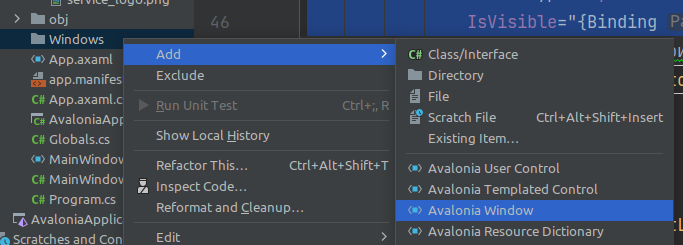

Предыдущая лекция |  | Следующая лекция
:----------------:|:----------:|:----------------:
[Пагинация, сортировка, фильтрация, поиск](./cs_pagination2.md) | [Содержание](../readme.md#тема-514-c-и-mysql) | [Создание, изменение продукции](./cs_edit_product2.md)

# Подсветка элементов по условию. Массовая смена цены продукции.

* [Подсветка элементов по условию](#раскраска-по-условию)
* [Массовая смена цены продукции](#массовая-смена-цены-продукции)
    - [Выделение нескольких элементов](#выделение-нескольких-элементов)
    - [Отображение кнопки "Изменить стоимость на ..."](#отображение-кнопки-изменить-стоимость-на)
    - [Вывод модального окна](#вывод-модального-окна)
    - [Сохранение введенной цены в БД](#сохранение-введенной-цены-в-бд)

>В списке продукции необходимо подсвечивать светло-красным цветом те продукты, которые не продавались агентами в последний месяц.

Критерий | Баллы
---------|:---:
Реализовано выделение (любым образом) продуктов, которые не продавались агентами в последний месяц | 1.5
Выделение реализовано в виде светло-красной подсветки элемента продукции | 0.5
**Итого** | **2**

В самом списке продукции данных о продажах нет. Судя по названиям таблиц данные эти должны быть в таблице **ProductSale**. Судя по связям этой таблицы, мы должны заполнить ещё таблицы **Agent** и **AgentType**.


На демо-экзамене до этого вы вряд-ли дойдёте (хотя критерий достаточно жирный), но в рамках курсовой/дипломной работы реализовать дополнительный функционал надо.

## Добавление данных вручную

1. Добавляем типы агентов

    Исходных данных для этой и последующих таблиц нет, поэтому вы можете писать туда что угодно (но близко к предметной области). Для типов агентов подойдут "индивидуальный предприниматель" и "Общество с ограниченной ответственностью" (для не обязательных таблиц много данных придумывать не надо, достаточно одной-двух записей)

    И так как исходных данных нет, то добавляем данные прямо в таблицы.

1. Добавляем агента

    Тут заполняем только обязательные поля. *AgentTypeID* смотрим в таблице **AgentType**.

1. Создание продаж продукции

    Добавляем несколько записей в таблицу **ProductSale**. Поля *AgentID* и *ProductID* смотрим в соответствующих таблицах. Дата продажи заполняется в формате `YYYY-MM-DD`

## Получение данных

Можно в методе получения данных с сервера добавить **Include** для виртуального списка **ProductSales**, но я уже упоминал в лекциях, что списки лучше загружать динамически. Мы это сделаем на следующем шаге, при получении цвета ячейки.

## Раскраска по условию

Тут элементарно. У элемента рамка (**Border**) задаем цвет фона:

```cs
<Border 
    BorderThickness="1" 
    BorderBrush="Black" 
    Background="{Binding BackgroundColor}"
                ^^^^^^^^^^^^^^^^^^^^^^^^^
    CornerRadius="5">
```

И добавляем в модель **Product** геттер *BackgroundColor*

```cs
public string BackgroundColor
{
    get
    {
        // вычисляем дату для сравнения ("сегодня" минус 30 дней)
        var compareDate = DateTime.Now.AddDays(-30);
        
        using (var context = new esmirnovContext())
        {
            // ищем количество продаж, совершённых позже указанной даты
            // фильтруя продажи по Id продукта
            var saleCount = context.ProductSales
                .Where(ps => ps.ProductId==this.Id)
                .Count(ps => ps.SaleDate >= compareDate);

            // возвращаем цвет, в зависимости от количества продаж 
            if (saleCount > 0) return "#fff"; // белый
            return "#fee"; // розовый
        }
    }
}
```

>Про цвета: их можно отдавать в формате **#RGB**. Причём, чем ближе к **F**, тем светлее (**#FFF** - белый)


## Массовая смена цены продукции

>Необходимо добавить возможность изменения минимальной стоимости продукции для агента сразу для нескольких выбранных продуктов. Для этой цели реализуйте возможность выделения сразу нескольких элементов в списке продукции, после чего должна появиться кнопка “Изменить стоимость на ...”. При нажатии на кнопку необходимо отобразить модальное окно с возможностью ввода числового значения, на которое и будет увеличена стоимость выбранных продуктов. По умолчанию в поле должно быть введено среднее значение цены на продукцию для агента. После нажатия кнопки “Изменить” стоимость выделенных продуктов должна быть изменена в базе данных, а также обновлена в интерфейсе.

Критерий | Баллы
---------|:---:
Реализована возможность выделения сразу нескольких элементов в списке | 0.2
После выделения элементов в списке появляется кнопка "Изменить стоимость на ..." | 0.3
При нажатии на кнопку отображается модальное окно для изменения цены | 0.1
В модальном окне есть возможность ввода числового значения | 0.1
По умолчанию введено значение средней цены выбранных продуктов | 0.2
Реализована проверка на ввод только числового значения | 0.2
После нажатия кнопки "Изменить" стоимость всех выбранных продуктов изменяется в БД | 0.5
После нажатия кнопки "Изменить" стоимость всех выбранных продуктов обновляется в списке | 0.2
**Итого** | **1.8**

### Выделение нескольких элементов

Возможность выделения нескольких элементов в **ListBox** есть, нужно только добавить аттрибут `SelectionMode="Multiple"`. Реализовать событие выбора и сосчитать количество выделенных элементов.

В **ListBox** нужно добавить название (мы потом будем по нему искать количество выделенных элементов) и обработчик события *SelectionChanged*

```cs
Name="ProductListBox"
SelectionMode="Multiple"
SelectionChanged="ProductListBox_OnSelectionChanged"
```

Реализуем обработчик *ProductListBox_OnSelectionChanged*:

```cs
public int productsSelectedCount = 0;
private void ProductListBox_OnSelectionChanged(
    object? sender, 
    SelectionChangedEventArgs e)
{
    if (ProductListBox != null)
    {
       productsSelectedCount = ProductListBox.  SelectedItems.Count;
    }
}
```

### Отображение кнопки "Изменить стоимость на ..."

Сначала просто добавляем эту кнопку в разметку (можно в панель управления, можно в левую панель)

```xml
<Button
    x:Name="CostChangeButton"
    IsVisible="True"
    Content="Изменить стоимость на..."
    />
```

Теперь, чтобы видимость кнопки зависела от количества выделенных элементов, мы привязываем атрибут *IsVisible* к свойству *costChangeButtonVisible* (дописав аттрибут `DataType`)

```xml
<Button
    x:Name="CostChangeButton"
    x:DataType="system:Boolean"
    IsVisible="{Binding #root.costChangeButtonVisible}"
    Content="Изменить стоимость на..."
    />
```

И реализуем это свойство в коде ОКНА

```cs
public string costChangeButtonVisible {
    get {
        return productsSelectedCount > 1;
    }
}
```

Осталось в обработчик события *ProductListBox_OnSelectionChanged* вставить вызов метода *Invalidate* для свойства *costChangeButtonVisible*

### Вывод модального окна

1. Добавляем кнопке обработчик события клика

    ```xml
    <Button
        x:Name="CostChangeButton"
        x:DataType="system:Boolean"
        IsVisible="{Binding #root.costChangeButtonVisible}"
        Click="CostChangeButton_OnClick"
        ^^^^^^^^^^^^^^^^^^^^^^^^^^^^^^
        Content="Изменить стоимость на..."
    />
    ```

1. Создаем и показываем модальное окно

    >Вспоминаем, что мы должны соблюдать файловую структуру проекта, т.е. все однотипные объекты распихивать по соответствующим папкам. 
    
    Создадим папку `Windows` и в неё добавим окно:

    

    Название окна должно быть осмысленным и с суффиксом *Window*. У меня получилось *EnterMinCostForAgentWindow*

    >Можно в каталог `Windows` перетащить и главное окно **MainWindow**.

    Опять же, все окна должны иметь нормальные заголовки. В разметке окна поменяйте атрибут *Title* элемента **Window** (это надо сделать и для основного окна)

    Содержимое у этого окна элементарное (текстовое поле и кнопка):

    ```xml
    <StackPanel
        Orientation="Vertical" Margin="0,50,0,0">

        <TextBox
            Name="CostTextBox"
            />
        <Button 
            Content="Изменить"/>
    </StackPanel>
    ```

    В коде этого окна меняем конструктор:

    ```cs
    public EnterMinCostForAgentWindow(decimal AvgCost)
                                      ^^^^^^^^^^^^^^^    
    {
        InitializeComponent();
        CostTextBox.Text = AvgCost.ToString();
    }
    ```

    **Во-первых**, в конструктор добавляем параметр (средняя цена). **Во-вторых**, записываем эту цену в текстовое поле.

1. По условиям задачи мы должны вычислить среднюю цену для выделенных элементов списка (я на вскидку не нашёл как преобразовать **IList** в **IEnumerable**, поэтому тупо перебираем список выбранных элементов, считаем сумму и, заодно, собираем список идентификаторов для последующего переопределения цены)

    >В **авалонии** окна запускаются асинхронно, поэтому если мы хотим получить результат выполнения диалога (а нам нужна сумма), то нужно использовать конструкцию *async/await*: метод, в котором нужно ждать выполнения асинхронной задачи должен иметь модификатор **async**, а перед функцией открытия окна должен быть модификатор **await**

    ```cs
    /* 
        обработчик события клика по кнопке "Изменить стоимость на..." в главном окне
        так как нам нужно дождаться результата ввода, то запускаем асинхронно
    */
    async private void CostChangeButton_OnClick(
        object? sender, 
        RoutedEventArgs e)
    {
        decimal sum = 0;
        List<int> idList = new List<int>();
        foreach (Product item in ProductListBox.SelectedItems){
            sum += item.MinCostForAgent;
            idList.Add(item.Id);
        }

        // создаём окно, передавая ему среднюю цену    
        var newWindow = new EnterMinCostForAgentWindow(
            sum / ProductListBox.SelectedItems.Count);

        // показываем МОДАЛЬНОЕ окно и ЖДЕМ результат
        var res = await newWindow.ShowDialog<decimal?>(this);
    }
    ```

    >Обратите внимание, в угловых скобках после *ShowDialog* указывается тип результата, возвращаемый окном. Результата может и не быть (хакрыли окно крестиком), поэтому тип нуллабельный.

1. Проверка на ввод только числового значения.

    ```cs
    private void Button_OnClick(
        object? sender, 
        RoutedEventArgs e)
    {
        try
        {
            // пробуем сконвертировать в число
            decimal Result = Convert.ToDecimal(CostTextBox.Text);
            // при присвоении результата свойству DialogResult модальное окно закрывается
            Close(Result);
        }
        catch (Exception)
        {
            // в авлонии нет MessageBox, поэтому его надо реализовать как обычное окно
            (new MessageBox("Стоимость должна быть числом")).ShowDialog(this);
        }
    }
    ```

### Сохранение введенной цены в БД

1. Запись новой цены в БД и обновление списка.

    Редактируем пункт 3, добавляя анализ результата модального окна

    ```cs
    ...
    var res = await newWindow.ShowDialog<decimal?>(this);
    if (res != null)
    {
        using (var context = new esmirnovContext())
        {
            try
            {
                // перебираем выделенные продукты
                foreach (var id in idList)
                {
                    var product = context.Products.Where(p => p.Id == id).FirstOrDefault();
                    if (product != null)
                    {
                        // меняем сумму для агента
                        product.MinCostForAgent = res ?? 0;
                    }
                }
                // сохраняем изменения
                context.SaveChanges();
            }
            catch (Exception exception)
            {
                (new MessageBox(exception.Message)).ShowDialog(this);
            }

            /* 
                перечитываем список продукции (так как эта операция повторяется, 
                то лучше её вынести в отдельный метод)
            */
            productList = context.Products
                .Include(product => product.ProductType)
                .Include(product => product.ProductMaterials)
                .ToList();
        }
    }
    ```

---

Предыдущая лекция |  | Следующая лекция
:----------------:|:----------:|:----------------:
[Пагинация, сортировка, фильтрация, поиск](./cs_pagination2.md) | [Содержание](../readme.md#тема-514-c-и-mysql) | [Создание, изменение продукции](./cs_edit_product2.md)
