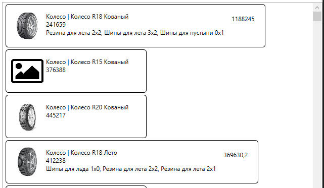
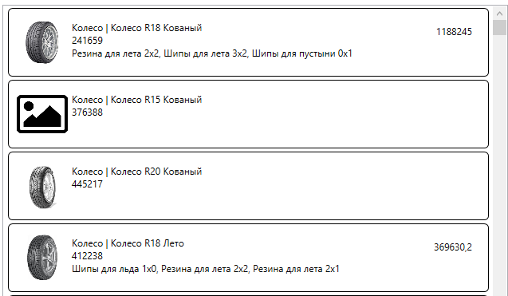

<table style="width: 100%;"><tr><td style="width: 40%;">
<a href="../articles/2.md">Создание подключения к БД MySQL. Получение данных с сервера.
</a></td><td style="width: 20%;">
<a href="../readme.md">Содержание
</a></td><td style="width: 40%;">
<a href="../articles/cs_pagination.md">Пагинация, сортировка, фильтрация, поиск
</a></td><tr></table>

# Вывод данных согласно макету (ListView, Image).

>Напоминаю как выглядит макет списка продукции
>
>
>Критерий | Баллы
>---------|:-----:
>Список продукции отображается в соответствии с макетом | 0.5
>У каждой продукции в списке отображается изображение | 0.3
>При отсутствии изображения отображается картинка-заглушка из ресурсов | 0.3

Для создания такого макета используется элемент **ListView**

В разметке вместо **DataGrid** вставляем **ListView**

```xml
<ListView
    Grid.Row="1"
    Grid.Column="1"
    ItemsSource="{Binding ProductList}"
>

</ListView>
```

Внутри него вставляем макет для элемента списка: пока у нас только прямоугольная рамка со скругленными углами (в этом макете вроде скрулять не надо, возможно осталось от другого шаблона)

```xml
<ListView.ItemTemplate>
    <DataTemplate>
        <Border 
            BorderThickness="1" 
            BorderBrush="Black" 
            CornerRadius="5">

            <!-- сюда потом вставить содержимое -->

        </Border>
    </DataTemplate>
</ListView.ItemTemplate>                
```

Внутри макета вставляем **Grid** из трёх колонок: для картинки, основного содержимого и стоимости.

```xml
<Grid 
    Margin="10" 
    HorizontalAlignment="Stretch">

    <Grid.ColumnDefinitions>
        <ColumnDefinition Width="64"/>
        <ColumnDefinition Width="*"/>
        <ColumnDefinition Width="auto"/>
    </Grid.ColumnDefinitions>

    <!-- сюда потом вставить содержимое -->

</Grid>
```

В первой колонке выводим изображение:

```xml
<Image
    Width="64" 
    Height="64"
    Source="{Binding ImagePreview,TargetNullValue={StaticResource defaultImage}}" />
```

Обратите внимание, вместо поля *Image* я вывожу вычисляемое поле *ImagePreview* - в геттере проверяю есть ли такая картинка, т.к. наличие данных в базе не означает наличие файла на диске

```cs
public Uri ImagePreview {
    get {
        var imageName = Environment.CurrentDirectory + (Image ?? "");
        return System.IO.File.Exists(imageName) ? new Uri(imageName) : null;
    }
}
```

1. Файлы подгружаемые с диска должны быть в формате **Uri**, иначе программа ищет их в ресурсах исполняемого файла
2. К имени файла добавляю путь к текущему каталогу 
3. Если такого файла нет, то возвращаю **null**, в этом случае срабатывает параметр привязки *TargetNullValue* - отображать изображение по-умолчанию.
4. Изображение по-умолчанию задается в ресурсах окна (первый элемент окна)

    ```xml
    <Window.Resources>
        <BitmapImage 
            x:Key='defaultImage' 
            UriSource='./Images/picture.png' />
    </Window.Resources>
    ```

    тут, как раз, указывается путь к изображению в ресурсах (в моём случае в приложении сознад каталог `Image` и в него ЗАГРУЖЕН файл)

Во второй колонке вывожу основную информацию о продукте: тип + название, ариткул и список материалов.

Так как данные выводятся в несколько строк, то заворачиваю их в **StackPanel** (тут можно использовать и **Grid**, но их и так уже много в разметке)

```xml
<StackPanel
    Grid.Column="1"
    Margin="5"
    Orientation="Vertical">

    <TextBlock 
        Text="{Binding TypeAndName}"/>

    <TextBlock 
        Text="{Binding ArticleNumber}"/>

    <TextBlock 
        Text="{Binding MaterialString}"/>
</StackPanel>
```

Вообще выводимый текст можно форматировать, но чтобы не запоминать лишних сущностей можно нарисовать ещё один геттер *TypeAndName*

```cs
public string TypeAndName {
    get {
        return ProductTypeTitle+" | "+Title;
    }
}
```

Артикул и список материалов выводятся как есть

На данный момент приложение выглядит примерно так



Видно, что размер элемента зависит от содержимого.

Чтобы это исправить нужно добавить в **ListView** стиль для элемента контейнера, в котором задать горизонтальное выравнивание по ширине:

```xml
<ListView
    Grid.Row="1"
    Grid.Column="1"
    ItemsSource="{Binding ProductList}"
>
    <ListView.ItemContainerStyle>
        <Style 
            TargetType="ListViewItem">
            <Setter 
                Property="HorizontalContentAlignment"
                Value="Stretch" />
        </Style>
    </ListView.ItemContainerStyle>
    ...
```

Теперь окно должно выглядеть как положено:



# Вывод данных "плиткой"

Такое задание было на одном из прошлых соревнований WorldSkills, вполне вероятно что появится и на демо-экзамене.

Компоненты **ListBox** и **ListView** по умолчанию инкапсулируют все элементы списка в специальную панель **VirtualizingStackPanel**, которая располагает все элементы по вертикали. Но с помощью свойства **ItemsPanel** можно переопределить панель элементов внутри списка. 

Мы будем использовать уже знакомую вам **WrapPanel**:

```xml
<ListView.ItemsPanel>
    <ItemsPanelTemplate>
        <WrapPanel 
            HorizontalAlignment="Center" />
    </ItemsPanelTemplate>
</ListView.ItemsPanel>
```

>Атрибут *HorizontalAlignment* используем, чтобы "плитки" центрировались.


Как видим, элементы отображаются горизонтальным списком, но нет переноса. Для включения переноса элементов нужно в **ListView** отключить горизонтальный скролл, добавив атрибут `ScrollViewer.HorizontalScrollBarVisibility="Disabled"`:


Свойство *ItemContainerStyle* уже не нужно и его можно убрать.

Размеры наших элементов по-прежнему зависят от содержимого - тут надо править шаблон **ItemTemplate**.

Итоговая разметка для вывода "плиткой" должна выглядеть примерно так:

```xml
<ListView
    ItemsSource="{Binding ProductList}"
    x:Name="ListView"
    ScrollViewer.HorizontalScrollBarVisibility="Disabled" 
>
    <ListView.ItemsPanel>
        <ItemsPanelTemplate>
            <WrapPanel 
                HorizontalAlignment="Center" />
        </ItemsPanelTemplate>
    </ListView.ItemsPanel>

    <!--ListView.ItemContainerStyle>
        <Style 
            TargetType="ListViewItem">
            <Setter 
                Property="HorizontalContentAlignment"
                Value="Stretch" />
        </Style>
    </-->
    
    
    <ListView.ItemTemplate>
        ...
    </ListView.ItemTemplate>
</ListView>    
```

<table style="width: 100%;"><tr><td style="width: 40%;">
<a href="../articles/cs_mysql_connection2.md">Создание подключения к БД MySQL. Получение данных с сервера.
</a></td><td style="width: 20%;">
<a href="../readme.md">Содержание
</a></td><td style="width: 40%;">
<a href="../articles/cs_pagination.md">Пагинация, сортировка, фильтрация, поиск
</a></td><tr></table>