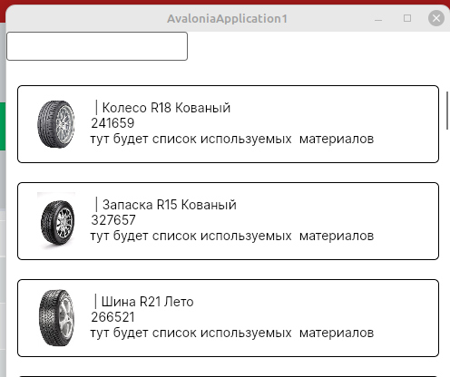
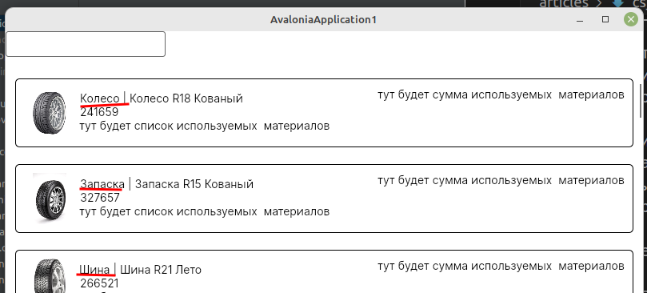

Предыдущая лекция |  | Следующая лекция
:----------------:|:----------:|:----------------:
[Создание подключения к БД MySQL. Получение данных с сервера.](./cs_mysql_connection3.md) | [Содержание](../readme.md#тема-514-c-и-mysql) | [Пагинация, сортировка, фильтрация, поиск](./cs_pagination2.md)

# Вывод данных согласно макету (ListBox, Image).

>Напоминаю как выглядит макет списка продукции
>
>
>Критерий | Баллы
>---------|:-----:
>Список продукции отображается в соответствии с макетом | 0.5
>У каждой продукции в списке отображается изображение | 0.3
>При отсутствии изображения отображается картинка-заглушка из ресурсов | 0.3

Для создания такого макета в **Авалонии** используется элемент **ListBox**

В разметке вместо **DataGrid** вставляем **ListBox**

```xml
<ListBox 
    Grid.Row="1"
    Background="White"
    x:DataType="model:Product"
    ItemsSource="{Binding #root.productList}">
    <!-- сюда потом вставить ListBox.ItemTemplate -->
</ListBox>
```

Внутри него вставляем шаблон для элемента списка (*ListBox.ItemTemplate*): пока у нас только прямоугольная рамка со скруглёнными углами (в этом макете вроде скрулять не надо, возможно осталось от другого шаблона)

```xml
<ListBox.ItemTemplate>
    <DataTemplate>
        <Border 
            BorderThickness="1" 
            BorderBrush="Black" 
            CornerRadius="5">

            <!-- сюда потом вставить содержимое: grid из трёх колонок -->

        </Border>
    </DataTemplate>
</ListBox.ItemTemplate>                
```

Внутри макета вставляем **Grid** из трёх колонок: для картинки, основного содержимого и стоимости.

```xml
<Grid 
    Margin="10" 
    HorizontalAlignment="Stretch">

    <Grid.ColumnDefinitions>
        <ColumnDefinition Width="64"/>
        <ColumnDefinition Width="*"/>
        <ColumnDefinition Width="auto"/>
    </Grid.ColumnDefinitions>

    <!-- сюда потом вставить колонки -->

</Grid>
```

**В первой** колонке выводим изображение:

**Авалонии** для вывода изображения нужно преобразовать имя файла в объект пиксельной графики: класс **Bitmap**. Есть два способа это сделать:

* Конвертер (в принципе ничего сложного, в инете куча примеров, но я не хочу пока нагружать вас лишними сущностями)
* Вычисляемое свойство. Этот вариант я и буду использовать. 

```xml
<Image
    Width="64" 
    Height="64"
    Source="{Binding ImageBitmap}" />
```


Обратите внимание, в классе **Product** нет поля *ImageBitmap*. Для получения картинки я использую вычисляемое свойство *ImageBitmap* - в геттере проверяю есть ли такая картинка, т.к. наличие названия в базе не означает наличие файла на диске.

Вычисляемое поле можно добавить в сгенерированный класс **Product** (файл `Models/Product.cs`), но этот файл может быть перезаписан при повторном реконструировании БД, поэтому лучше создавать свои классы в другом месте. Классы в C# могут быть описаны в нескольких файлах (главное чтобы они были в одном **namespace**), для этого используется ключевое слово **partial**:

На демо экзамене есть критерии оценки за логическую и файловую структуру, поэтому куда попало классы писать не надо. Создайте каталог `Classes` и в нём класс **Product**. В созданном классе поменяйте **namespace** (напоминаю, оно должно быть таким же, как у модели) и добавьте в класс **Product** вычисляемое свойство:  

```cs
namespace AvaloniaApplication1.esmirnov;

public partial class Product
{
    public Bitmap? ImageBitmap
    {
        get
        {
            var imageName = Environment.CurrentDirectory + (Image ?? "");
            // windows лояльно относится к разным слешам в пути, 
            // а вот linux не находит такие файлы, 
            // поэтому меняю обратные слеши на прямые
            imageName = imageName.Replace('\\', '/');

            // если файл существует, то возвращаю его
            // иначе картинку заглушку
            var result = System.IO.File.Exists(imageName) ? 
                new Bitmap(imageName) :
                new Bitmap(Environment.CurrentDirectory+"/picture.png");

            return result;
        }
    }
}
```

**Во второй** колонке вывожу основную информацию о продукте: _тип_ + _название_, _аритикул_ и _список материалов_.

Так как данные выводятся в несколько строк, то заворачиваю их в **StackPanel** (тут можно использовать и **Grid**, но их и так уже много в разметке)

```xml
<StackPanel
    Grid.Column="1"
    Margin="5"
    Orientation="Vertical">

    <TextBlock 
        Text="{Binding TypeAndName}"/>

    <TextBlock 
        Text="{Binding ArticleNumber}"/>

    <TextBlock 
        Text="{Binding MaterialString}"/>
</StackPanel>
```

Вообще выводимый текст можно форматировать сразу в разметке, но чтобы не запоминать лишних сущностей можно нарисовать ещё одно вычисляемое свойство *TypeAndName* (в том же классе **Product**)

```cs
public string TypeAndName
{
    get
    {
        // обратите внимание, мы читаем свойство TitleType виртуального поля ProductType
        return ProductType?.TitleType + " | " + Title;
    }
}
```

Артикул выводится как есть

**Строка материалов** (вычисляемое свойство *MaterialString*) должна формироваться динамически по таблице связей **ProductMaterial**, про неё раскажу ниже. Пока пишем заглушку:

```cs
public string MaterialString { get; } = "тут будет список используемых  материалов";
```

**В третьей** колонке выводим **сумму материалов**, т.е. опять динамически будем формировать по таблице связей.

```xml
<TextBlock 
    Grid.Column="2"
    Text="{Binding MaterialSum}"/>
```

И пока тоже заглушка:

```cs
public string MaterialSum { get; } = "тут будет сумма используемых  материалов";
```

Если мы сейчас запустим наше приложение, то не увидим **тип материала**. Дело в том, что по-умолчанию в модель загружаются данные только текущей таблицы (**Product**), а виртуальное свойство **ProductType** остаётся не заполненным. 



Для того, чтобы считать связанные данные, нужно при чтении данных использовать метод **Include** (можно несколько раз для нескольких связанных таблиц):

>Количество включений не ограничено, но всё сразу лучше не загружать - C# достаточно "умный", чтобы вычислять нужные свойства только при отображении, поэтому *строку материалов* и *сумму* можно считать отдельно

Меняем в конструкторе код получения данных:

```cs
using (var context = new esmirnovContext())
{
    productList = context.Products
        .Include(product => product.ProductType)
        .Include(product => product.ProductMaterials)
        .ToList();
}
```

Теперь типы выводятся нормально:



## Расчёт материалов

Материалы (название и цену) мы можем взять из таблицы **Material**, которая связана с продуктами (**Product**) отношением *многие-ко-многим* через таблицу **ProductMaterial**. Массив этих связей мы в продукты уже включили (*product.ProductMaterials*), осталось выбрать материалы (переписываем заглушки в файле `Classes/Product.cs`): 

```cs
private string? _materialString = null;
private double _materialSum = 0;

public string MaterialString
{
    get
    {
        if (_materialString == null)
        {
            using (var context = new esmirnovContext())
            {
                _materialString = "";
                foreach (var item in ProductMaterials)
                {
                    var material = context.Materials
                        .Where(m => m.Id == item.MaterialId).First();

                    _materialString += material?.Title + ", ";

                    _materialSum += Convert.ToDouble(material?.Cost ?? 0) *
                        (item.Count ?? 0);
                }
            }
        }
        return _materialString;
    }
}

public double MaterialSum
{
    get {
        return _materialSum;
    }
}
```

Что тут происходит?

**Во-первых**, чтобы каждый раз не пересчитывать данные мы их кешируем:

```cs
private string? _materialString = null;
private double _materialSum = 0;
```

Если материалы продукта вычисляются в первый раз (значение равно **null**), то происходит реальное чтение из базы, иначе возвращаем ранее вычисленное значение.

**Во-вторых**, перебираем список материалов и формируем строку и сумму материалов

```cs
// перебираем массив материалов продукта 
// (значения из связи ProductMaterials, 
// полученные вместе с основным запросом к базе)
foreach (var item in ProductMaterials)
{
    // ищем материал по его Id
    var material = context.Materials
        .Where(m => m.Id == item.MaterialId)
        .First();

    // формируем строку
    _materialString += material?.Title + ", ";

    // и цену, учитывая количество материалов
    _materialSum += Convert.ToDouble(material?.Cost ?? 0) * (item.Count ?? 0);
}
```

Теперь отображается всё что требуется по заданию, причём мы не написали ни одного запроса к БД, всё за нас сделал ORM фреймворк.


## Вывод данных "плиткой"

Такое задание было на одном из прошлых соревнований WorldSkills, вполне вероятно что появится и на демо-экзамене.

Компоненты **ListBox** и **ListView** по умолчанию инкапсулируют все элементы списка в специальную панель **VirtualizingStackPanel**, которая располагает все элементы по вертикали. Но с помощью тега **ItemsPanel** можно переопределить тип панели элементов. 

Мы будем использовать уже знакомую вам **WrapPanel**:

```xml
<ListBox ...>
    <ListBox.ItemsPanel>
        <ItemsPanelTemplate>
            <WrapPanel 
                HorizontalAlignment="Center" />
        </ItemsPanelTemplate>
    </ListBox.ItemsPanel>
    ...
</ListBox>
```

>Атрибут *HorizontalAlignment* используем, чтобы "плитки" центрировались.

И ещё нужно поменять ширину второй колонки элемента (у нас стоит "на всё свободное место", вместо этого нужно прописать фиксированное значение)

Получается примерно такое (первая ячейка получилась шире остальных из-за того, что третья колонка имеет ширину "auto" - это поправьте сами)


---

Предыдущая лекция |  | Следующая лекция
:----------------:|:----------:|:----------------:
[Создание подключения к БД MySQL. Получение данных с сервера.](./cs_mysql_connection3.md) | [Содержание](../readme.md#тема-514-c-и-mysql) | [Пагинация, сортировка, фильтрация, поиск](./cs_pagination2.md)
