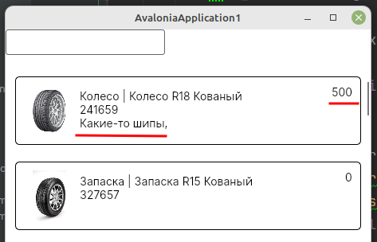
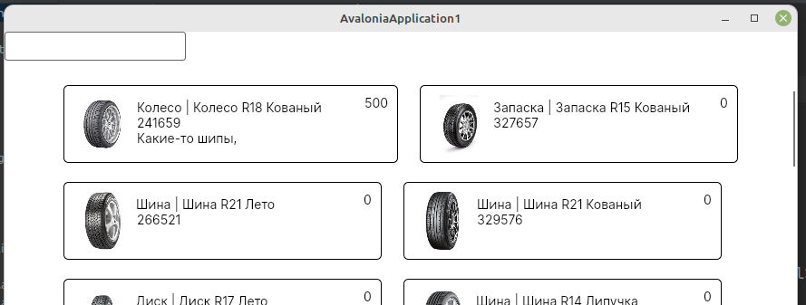

Предыдущая лекция |  | Следующая лекция
:----------------:|:----------:|:----------------:
[Создание подключения к БД MySQL. Получение данных с сервера.](./cs_mysql_connection3.md) | [Содержание](../readme.md#c-и-mysql) | [Пагинация, сортировка, фильтрация, поиск](./cs_pagination2.md)


# Вывод данных согласно макету (ListBox, Image).

>Напоминаю как выглядит макет списка продукции
>
>
>Критерий | Баллы
>---------|:-----:
>Список продукции отображается в соответствии с макетом | 0.5
>У каждой продукции в списке отображается изображение | 0.3
>При отсутствии изображения отображается картинка-заглушка из ресурсов | 0.3

Для создания такого макета используется элемент **ListBox**

В разметке вставляем **ListBox**

```xml
<ListBox 
    Grid.Row="1"
    Background="White"
    ItemsSource="{Binding productList}">
    <!-- сюда потом вставить ListBox.ItemTemplate -->
</ListBox>
```

Внутри него вставляем шаблон для элемента списка (*ListBox.ItemTemplate*): пока у нас только прямоугольная рамка со скруглёнными углами (в этом макете вроде скрулять не надо, возможно осталось от другого шаблона)

```xml
<ListBox.ItemTemplate>
    <DataTemplate>
        <Border 
            BorderThickness="1" 
            BorderBrush="Black" 
            CornerRadius="5">

            <!-- сюда потом вставить содержимое: grid из трёх колонок -->

        </Border>
    </DataTemplate>
</ListBox.ItemTemplate>                
```

Внутри макета вставляем **Grid** из трёх колонок: для картинки, основного содержимого и стоимости.

```xml
<Grid 
    Margin="10" 
    HorizontalAlignment="Stretch">

    <Grid.ColumnDefinitions>
        <ColumnDefinition Width="64"/>
        <ColumnDefinition Width="*"/>
        <ColumnDefinition Width="auto"/>
    </Grid.ColumnDefinitions>

    <!-- сюда потом вставить колонки -->

</Grid>
```

**В первой** колонке выводим изображение:

Для вывода изображения нужно указывать URI файла. Есть два способа это сделать:

* Конвертер (в принципе ничего сложного, в инете куча примеров, но я не хочу пока нагружать вас лишними сущностями)
* Вычисляемое свойство. Этот вариант я и буду использовать. 

```xml
<Image
    Width="64" 
    Height="64"
    Source="{Binding ImageUri}" />
```


Обратите внимание, в классе **Product** нет поля *ImageUri*. Для получения картинки я использую вычисляемое свойство *ImageUri* - в геттере проверяю есть ли такая картинка, т.к. наличие названия в базе не означает наличие файла на диске.

>На демо экзамене есть критерии оценки за логическую и файловую структуру, поэтому куда попало классы писать не надо. Создайте каталог `Classes` и в нём класс **Product**. В созданном классе поменяйте **namespace** (напоминаю, оно должно быть таким же, как у модели) и добавьте в класс **Product** вычисляемое свойство:  

```cs
namespace Application1.esmirnov;

public partial class Product
{
    public Uri ImageUri
    {
        get
        {
            var imageName = Environment.CurrentDirectory + (Image ?? "");
            return System.IO.File.Exists(imageName) ? new Uri(imageName) : null;
        }
    }
}
```

**Во второй** колонке вывожу основную информацию о продукте: _тип_ + _название_, _аритикул_ и _список материалов_.

Так как данные выводятся в несколько строк, то заворачиваю их в **StackPanel** (тут можно использовать и **Grid**, но их и так уже много в разметке)

```xml
<StackPanel
    Grid.Column="1"
    Margin="5"
    Orientation="Vertical">

    <TextBlock 
        Text="{Binding TypeAndName}"/>

    <TextBlock 
        Text="{Binding ArticleNumber}"/>

    <TextBlock 
        Text="{Binding MaterialString}"/>
</StackPanel>
```

Вообще выводимый текст можно форматировать сразу в разметке, но чтобы не запоминать лишних сущностей можно нарисовать ещё одно вычисляемое свойство *TypeAndName* (в том же классе **Product**)

```cs
public string TypeAndName
{
    get
    {
        // обратите внимание, мы читаем свойство TitleType виртуального поля ProductType
        return ProductTypeTitle + " | " + Title;
    }
}
```

Артикул и строку материалов выводим как есть

**В третьей** колонке выводим **сумму материалов**.

```xml
<TextBlock 
    Grid.Column="2"
    Text="{Binding MaterialSum}"/>
```



## Вывод данных "плиткой"

Такое задание было на одном из прошлых соревнований WorldSkills, вполне вероятно что появится и на демо-экзамене.

Компоненты **ListBox** и **ListView** по умолчанию инкапсулируют все элементы списка в специальную панель **VirtualizingStackPanel**, которая располагает все элементы по вертикали. Но с помощью тега **ItemsPanel** можно переопределить тип панели элементов. 

Мы будем использовать уже знакомую вам **WrapPanel**:

```xml
<ListBox ...>
    <ListBox.ItemsPanel>
        <ItemsPanelTemplate>
            <WrapPanel 
                HorizontalAlignment="Center" />
        </ItemsPanelTemplate>
    </ListBox.ItemsPanel>
    ...
</ListBox>
```

>Атрибут *HorizontalAlignment* используем, чтобы "плитки" центрировались.

И ещё нужно поменять ширину второй колонки элемента (у нас стоит "на всё свободное место", вместо этого нужно прописать фиксированное значение)

Получается примерно такое (первая ячейка получилась шире остальных из-за того, что третья колонка имеет ширину "auto" - это поправьте сами)



---

Предыдущая лекция |  | Следующая лекция
:----------------:|:----------:|:----------------:
[Создание подключения к БД MySQL. Получение данных с сервера.](./cs_mysql_connection3.md) | [Содержание](../readme.md#c-и-mysql) | [Пагинация, сортировка, фильтрация, поиск](./cs_pagination2.md)
