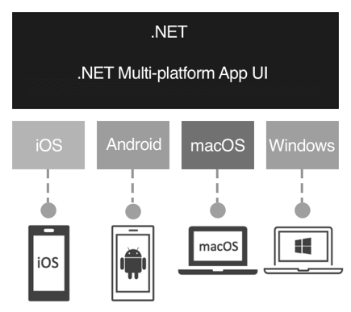
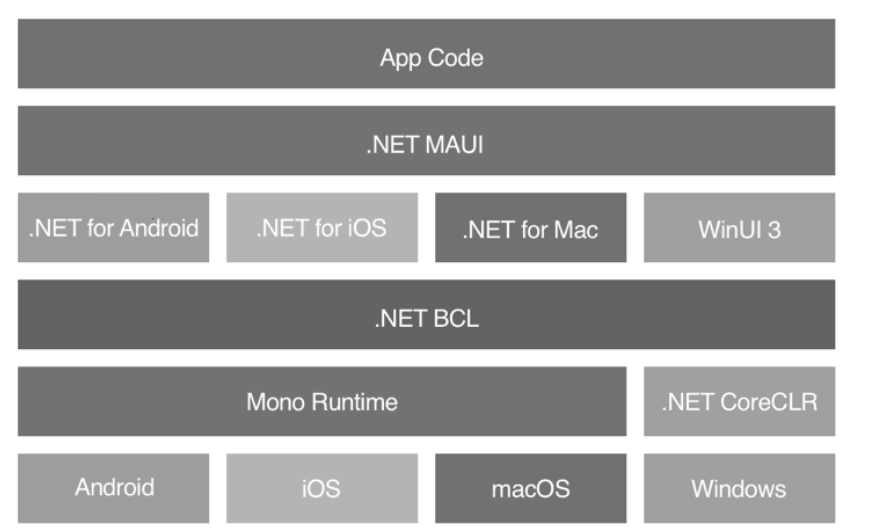

# Что такое MAUI, создание мобильного приложения для Android используя VSC

## Введение в .NET MAUI

[взято отсюда](https://metanit.com/sharp/maui/1.1.php)

**.NET Multi-platform App UI** или сокращенно **MAUI** представляет кроссплатформенный фреймворк от компании Microsoft для создания нативных мобильных и десктопных приложений с использованием языка программирования C# и языка разметки XAML. С помощью .NET MAUI можно разрабатывать приложения под такие операционные системы как Android, iOS, macOS и Windows, используя при этом один и тот же код.

Первая версия MAUI вышла в мае 2022 года, далее в ноябре 2024 года вышли обновления для .NET 9. Однако стоит отметить, что сам фреймворк .NET Multi-platform App UI фактически представляет эволюцию другого фреймворка - **Xamarin Forms**, который имеет более чем 10-летнюю историю и который с 2016 года был куплен и развивался компанией Microsoft. Поэтому, имя опыт работы с Xamarin Forms, не составит больших проблем перейти на .NET MAUI.

Также стоит отметить, что .NET MAUI - это opensource-фреймворк, код которого можно найти в репозитории на github по адресу https://github.com/dotnet/maui

Зачем использовать .NET Multi-platform App UI, какие преимущества она несет? При разработке приложения сразу под несколько платформ (iOS, Android, Windows, macOS) разработчики сталкиваются со следующими трудностями:

* различие в подходах построение графического интерфейса так или иначе влияет на разработку. Разработчики вынуждены подстраивать приложение под требования к интерфейсу на конкретной платформе
* разные API - различие в программных интерфейсах и реализациях тех или иных функциональностей также требует от программиста учет этих специфических особенностей
* разные платформы для разработки. Например, чтобы создавать приложения для iOS нам необходима соответствующая среда - Mac OS X и ряд специальных инструментов, типа XCode. А в качестве языка программирования выбирается Objective-C или Swift. Для Android мы можем использовать самый разный набор сред - Android Studio, Intellij IDEA, Eclipse и т.д. Но здесь для подавляющего большинства приложений применяется Java или Kotlin.

    А для создания приложений под Windows используется Visual Studio, а в качестве языков - C#, F#, VB.NET, C++

Такой диапазон платформ, средств разработки и языков программирования не может положительно сказываться на сроках создания приложений, и, в конечном счете, на денежных средствах, выделяемых на разработку. Было бы очень эффективно иметь один инструмент, который позволял легко и просто создавать приложения сразу для всех платформ. И именно таким инструментом и является платформа **MAUI**.

Преимущества разработки на MAUI:

* В процессе разработки создается единый проект, который использует общий код для всех платформ
* MAUI предоставляет прямой доступ к нативным API каждой платформы, в том числе к аппаратным возможностям платформ
* При создании приложений мы можем использовать платформу .NET и язык программирования C# (а также F#), который является достаточно производительным, и в тоже время ясным и простым для освоения и применения
* Богатая коллекция встроенных элементов управления
* Поддержка привязки данных
* Возможности настройки поведения визуального интерфейса и встроенного функционала
* Богатые возможности по работе с графикой
* Наличие hot reload, что упрощает разработку

### Поддерживаемые платформы

На момент написания данной статьи .NET Multi-platform App UI (.NET MAUI) официально поддерживает следующие платформы:

* Android 5.0 (API 21) и выше
* iOS 11 и выше
* macOS 10.15 и выше (с помощью Mac Catalyst)
* Windows 11 and Windows 10 версии 1809 и выше (с использованием WinUI 3).

Кроме того, подсистема .NET MAUI Blazor часть выше поднимает планку поддерживаемых версий:

* Android 7.0 (API 24) и выше
* iOS 14 и выше
* macOS 11 и выше (с помощью Mac Catalyst)

Также неофициально сообществом поддерживается Linux - проект maui-linux. Кроме того, компания Samsung осуществляет поддержку для ОС Tizen.

### Как работает MAUI

.NET MAUI объединяет API операционных систем Android, iOS, macOS и Windows в один единый API, который позволяет написать один общий код для всех поддерживаемых операционных систем и при необходимости добавлять для каждой отдельной платформы специфические для нее функциональности. Схематически работу .NET MAUI можно представить следующим образом:

.NET MAUI предоставляет единый фреймворк для создания приложений. Однако в процессе работы он опирается на ряд субплатформ, через которые идет взаимодействие с каждой отдельной операционной системой: .NET for Android, .NET for iOS, .NET for macOS и Windows UI 3 (WinUI 3). И в общем случае код приложения сначала обращается к платформе .NET MAUI, а та затем обращается к субплатформе для конкретной ОС. Хотя фреймворк также позволяет напрямую обращаться коду приложения к этим субплатформам.

Все эти субплатформы работают поверх библиотеки классов .NET Base Class Library (BCL). Эта библиотека позволяет абстрагироваться от деталей реализации конкретной платформы и зависит от среды выполнения .NET, в которой выполняется код. Для Android, iOS и macOS среду выполнения для приложения предоставляет фреймворк Mono (реализация .NET). На Windows среда выполнения предоставляется .NET CoreCLR.

Таким образом, разработчик может определить общую единую логику для приложения для каждой отдельной платформы. И также при необходимости может задействовать специфические для каждой платформы функциональности.

### Инструменты разработки

Разрабатывать приложения формально можно на Windows и MacOS. Однако если стоит задача разрабатывать приложения под iOS и MacOS, то для этого необходим MacOS.

В качестве среды разработки используется Visual Studio 2022 и выше. На MacOS в этом случае используется Visual Studio Code.

## Создание проекта

Для разработки на VS можете посмотреть статью на [metanit](https://metanit.com/sharp/maui/1.2.php), я же буду делать приложение испольуя VSC опираясь на [официальную инструкцию от Microsoft](https://learn.microsoft.com/ru-ru/dotnet/maui/get-started/first-app?view=net-maui-9.0&tabs=visual-studio-code&pivots=devices-android)

