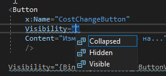
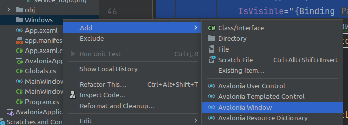

<table style="width: 100%;"><tr><td style="width: 40%;">
<a href="../articles/cs_pagination.md">Пагинация, сортировка, фильтрация, поиск
</a></td><td style="width: 20%;">
<a href="../readme.md">Содержание
</a></td><td style="width: 40%;">
<a href="../articles/cs_edit_product.md">Создание, изменение продукции
</a></td><tr></table>

# Массовая смена цены продукции

>Необходимо добавить возможность изменения минимальной стоимости продукции для агента сразу для нескольких выбранных продуктов. Для этой цели реализуйте возможность выделения сразу нескольких элементов в списке продукции, после чего должна появиться кнопка “Изменить стоимость на ...”. При нажатии на кнопку необходимо отобразить модальное окно с возможностью ввода числового значения, на которое и будет увеличена стоимость выбранных продуктов. По умолчанию в поле должно быть введено среднее значение цены на продукцию для агента. После нажатия кнопки “Изменить” стоимость выделенных продуктов должна быть изменена в базе данных, а также обновлена в интерфейсе.

Критерий | Баллы
---------|:---:
Реализована возможность выделения сразу нескольких элементов в списке | 0.2
После выделения элементов в списке появляется кнопка "Изменить стоимость на ..." | 0.3
При нажатии на кнопку отображается модальное окно для изменения цены | 0.1
В модальном окне есть возможность ввода числового значения | 0.1
По умолчанию введено значение средней цены выбранных продуктов | 0.2
Реализована проверка на ввод только числового значения | 0.2
После нажатия кнопки "Изменить" стоимость всех выбранных продуктов изменяется в БД | 0.5
После нажатия кнопки "Изменить" стоимость всех выбранных продуктов обновляется в списке | 0.2
**Итого** | **1.8**

## Выделение нескольких элементов

Возможность выделения нескольких элементов в **ListView** есть, специально её реаизовывать не надо. Надо лишь поймать это событие и сосчитать количество выделенных элементов.

В **ListView** нужно добавить название (мы потом будем по нему искать количество выделенных элементов) и обработчик события *SelectionChanged*

```cs
x:Name="ProductListView"
SelectionChanged="ListView_SelectionChanged"
```

Реализуем обработчик *ListView_SelectionChanged*:

```cs
public int ProductsSelectedCount = 0;
private void ListView_SelectionChanged(object sender, SelectionChangedEventArgs e)
{
    ProductsSelectedCount = ProductListView.SelectedItems.Count;
}
```

## Отображение кнопки "Изменить стоимость на ..."

Сначала просто добавляем эту кнопку в разметку

```xml
<Button
    x:Name="CostChangeButton"
    Visibility=""
    Content="Изменить стоимость на..."
    />
```

И запоминаем какие значения может прнимать атрибут *Visibility*



* **Collapsed** - элемент не отображается и НЕ ЗАНИМАЕТ МЕСТО в контейнере
* **Hidden** - элемент не отображается, но под него остается выделенное место
* **Visible** - элемент отображается

Теперь, чтобы видимость кнопки зависела от количества выделенных элементов, мы привязываем атрибут *Visibility* к свойству *CostChangeButtonVisible*

```xml
<Button
    x:Name="CostChangeButton"
    Visibility="{Binding CostChangeButtonVisible}"
    Content="Изменить стоимость на..."
    />
```

И реализуем это свойство в коде ОКНА

```cs
public string CostChangeButtonVisible {
    get {
        if (ProductsSelectedCount > 1) return "Visible";
        return "Collapsed";
    }
}
```

Осталось в обработчик события *ListView_SelectionChanged* вставить вызов метода PropertyChanged для свойства *CostChangeButtonVisible*

Чтобы не плодить кучу одинаковых методов, я добавил в параметры метода **Invalidate** имя свойства, которое изменилось

```cs
private void Invalidate(string ComponentName = "ProductList") {
    if (PropertyChanged != null)
        PropertyChanged(this, new PropertyChangedEventArgs(ComponentName));
}

private void ListView_SelectionChanged(object sender, SelectionChangedEventArgs e)
{
    ProductsSelectedCount = ProductListView.SelectedItems.Count;
    Invalidate("CostChangeButtonVisible");
}
```

## Вывод модального окна

1. Добавляем кнопке обработчик события клика

    ```xml
    <Button
        x:Name="CostChangeButton"
        Visibility="{Binding CostChangeButtonVisible}"
        Click="CostChangeButton_Click"
        ^^^^^^^^^^^^^^^^^^^^^^^^^^^^^^
        Content="Изменить стоимость на..."
    />
    ```

2. Создаем и показываем модальное окно

    Во-первых, вспоминаем, что мы должны соблюдать файловую структуру проекта, т.е. все однотипные объекты распихивать по соответствующим папкам. 
    
    Создадим папку `Windows` и в неё добавим окно (WPF)

    

    Название окна должно быть осмысленным и с суффиксом *Window*. У меня получилось *EnterMinCostForAgentWindow*

    >Можно в каталог `Windows` перетащить и главное окно **MainWindow**. Только в этом случае надо в разметке приложения (App.xaml) добавить название каталога:
    >
    >```xml
    ><Application x:Class="mysql.App"
    >   xmlns="http://schemas.microsoft.com/winfx/2006/xaml/presentation"
    >   xmlns:x="http://schemas.microsoft.com/winfx/2006/xaml"
    >   xmlns:local="clr-namespace:mysql"
    >   StartupUri="Windows/MainWindow.xaml">
    >               ^^^^^^^^
    >...

    Опять же, все окна должны иметь нормальные заголовки. В разметке окна поменяйте атрибут *Title* элемента **Window** (это надо сделать и для основного окна)

    Содержимое у этого окна элементарное (текстовое поле и кнопка):

    ```xml
    <Grid>
        <StackPanel
            Orientation="Vertical" Margin="0,50,0,0">

            <TextBox
                Name="CostTextBox"
                />
            <Button 
                Content="Изменить"/>
        </StackPanel>
    </Grid>
    ```

    В коде этого окна меняем конструктор:

    ```cs
    public EnterMinCostForAgentWindow(decimal AvgCost)
                                      ^^^^^^^^^^^^^^^    
    {
        InitializeComponent();
        CostTextBox.Text = AvgCost.ToString();
    }
    ```

    Во-первых, в конструктор добавляем параметр (средняя цена). Во-вторых, записываем эту цену в текстовое поле.

3. По условиям задачи мы должны вычислить среднюю цену для выделенных элементов списка (я на вскидку не нашёл как преобразовать **IList** в **IEnumerable**, поэтому тупо перебираем список выбранных элементов, считаем сумму и, заодно, собираем список идентификаторов)

    ```cs
    private void CostChangeButton_Click(object sender, RoutedEventArgs e)
    {
        decimal Sum = 0;
        List<int> idList = new List<int>();
        foreach (Product item in ProductListView.SelectedItems){
            Sum += item.MinCostForAgent;
            idList.Add(item.ID);
        }

        // создаём окно, передавая ему среднюю цену    
        var NewWindow = new EnterMinCostForAgentWindow(
            AvgSum / ProductListView.SelectedItems.Count);

        // показываем МОДАЛЬНОЕ окно    
        NewWindow.ShowDialog();
    }
    ```

4. Проверка на ввод только числового значения.

    ```cs
    private void Button_Click(object sender, RoutedEventArgs e)
    {
        try
        {
            // пробуем сконвертировать в число
            Result = Convert.ToDecimal(CostTextBox.Text);
            // при присвоении результата свойству DialogResult модальное окно закрывается
            DialogResult = true;
        }
        catch (Exception)
        {
            MessageBox.Show("Стоимость должна быть числом");
        }
    }
    ```

5. Запись новой цены в БД и обновление списка.

    * редактируем пункт 3, добавляя анализ результата

        ```cs
        if((bool)NewWindow.ShowDialog())
        {
            // вся работа с БД у нас в DataProvider-e, 
            // передаем список идентификаторов и новую цену
            Globals.DataProvider.SetAverageCostForAgent(idList, NewWindow.Result);
            // для перерисовки списка продукции просто перечитываем его
            ProductList = Globals.DataProvider.GetProducts();
        }
        ```

    * Описываем метод *SetAverageCostForAgent* в интерфейсе **IDataProvider**:

        ```cs
        void SetAverageCostForAgent(List<int> ProductIds, decimal NewCost);
        ```

    * И реализуем его в **MySQLDataProvider**-e:

        ```cs
        public void SetAverageCostForAgent(List<int> ProductIds, decimal NewCost)
        {
            try
            {
                Connection.Open();
                try
                {
                    // вместо значений записываем шаблоны
                    string Query = @"UPDATE 
                        Product 
                    SET MinCostForAgent=@MinCostForAgent 
                    WHERE ID=@ID";

                    // перебираем список идентификаторов
                    foreach (int item in ProductIds)
                    {
                        MySqlCommand Command = new MySqlCommand(Query, Connection);
                        // заменяем шаблоны параметрами
                        Command.Parameters.AddWithValue("@MinCostForAgent", NewCost);
                        Command.Parameters.AddWithValue("@ID", item);
                        // и выполняем запрос
                        Command.ExecuteNonQuery();
                    }
                }
                finally
                {
                    Connection.Close();
                }
            }
            catch (Exception)
            {
            }
        }
        ```
<table style="width: 100%;"><tr><td style="width: 40%;">
<a href="../articles/cs_pagination.md">Пагинация, сортировка, фильтрация, поиск
</a></td><td style="width: 20%;">
<a href="../readme.md">Содержание
</a></td><td style="width: 40%;">
<a href="../articles/cs_edit_product.md">Создание, изменение продукции
</a></td><tr></table>