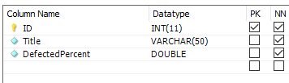

<table style="width: 100%;"><tr><td style="width: 40%;">
<a href="../articles/sql_import.md">Создание базы данных. Импорт данных.
</a></td><td style="width: 20%;">
<a href="../readme.md">Содержание
</a></td><td style="width: 40%;">
<a href="../articles/cs_mysql_connection2.md">---
</a></td><tr></table>

# Создание подключения к БД MySQL. Получение данных с сервера.

Дальше мы продолжим разбор задания прошлогоднего демо-экзамена. 

Базу мы развернули и данные в неё импортировали, теперь начнём разбор второй сессии: создание desktop-приложения.

>## Разработка desktop-приложений
>
>### Список продукции
>
>Необходимо реализовать вывод продукции, которая хранится в базе данных, согласно предоставленному макету (файл `product_list_layout.jpg` находится в ресурсах). При отсутствии изображения необходимо вывести картинку-заглушку из ресурсов (picture.png).
>
>
>
>...
>
>Стоимость продукта должна быть рассчитана исходя из используемых материалов.

По макету видно, что на первом экране уже нужны почти все данные, которые мы импортировали ранее: список продуктов (Product), список материалов (Material) продукта (через таблицу ProductMaterial).

Есть несколько вариантов работы с данными:

* Фреймворки (библиотеки) - предпочтительный вариант при реальной разработке. Есть платные и есть бесплатная **Entity**, входящая в состав **Visual Studio**. Но у **Entity** есть два минуса. Во-первых, она криво работает с **MySQL** (по крайней мере в прошлом году я так и не смог их подружить). Во-вторых, её не понятно как тестировать (в **Visual Studio** есть технологии для эмуляции тестового окружения, но только в **Enterprise** версии)

* Загрузака с помощью **DataAdapter** в наборы данных (**DataSet**). Для наборов данных можно даже установить связи между таблицами. Эта технология широко применялась в эпоху **Windows Forms**

* **WPF** "заточена" на работу с объектами. И так как от **Entity** мы отказались, то будем вручную создавать модели и грузить в них данные с помощью **DataReader**-a

>В рамках демо-экзамена требуется работать с моделями ("Основные сущности представлены отдельными классами", но стоит это всего 0,2 балла).

## Создание моделей

Шаблон приложения [берём](https://github.com/kolei/OAP/blob/master/articles/wpf_template.md) из лекций прошлого года.

Первым делом рисуем модели для данных. Если в прошлом году вы их разрабатывали сами, то сейчас придумывать ничего не надо - просто смотрим на структуру таблиц.

**Но**, для главного экрана мы можем использовать **сводную** таблицу, в которой будут все нужные нам данные!!!

```sql
SELECT 
    -- выбираем все поля из таблицы Product
	p.*,
    -- выбираем название продукта
	pt.Title AS ProductTypeTitle,
    -- выбираем список материалов и их сумму
	pp.MaterialList, pp.Total
FROM
	Product p
LEFT JOIN
	ProductType pt ON p.ProductTypeID = pt.ID 
LEFT JOIN 
    -- для выбора информации о метериалах используем подзапрос, 
    -- т.к. она связана через промежуточную таблицу
	(
        SELECT
            pm.ProductID, 
            -- GROUP_CONCAT объединяет указанные поля разделяя из сеператором
            GROUP_CONCAT(m.Title SEPARATOR ', ') as MaterialList, 
            SUM(pm.Count * m.Cost/m.CountInPack) as Total
	    FROM
	        Material m,
		    ProductMaterial pm
	    WHERE m.ID=pm.MaterialID
	    GROUP BY ProductID
    ) pp ON pp.ProductID = p.ID
```

>Про **LEFT JOIN** я раньше не рассказывал, в принципе это аналог добавления второй таблицы в секцию **FROM**, только условие добавления описывается не в секции **WHERE** а в параметре **ON**

### Модель "Продукт" (с данными о материалах)


```cs
public class Product
{
    public int ID { get; set; }
    public string Title { get; set; }
    public int ProductTypeID { get; set; }
    public string ArticleNumber { get; set; }
    public string Description { get; set; }
    public string Image { get; set; }
    public int ProductionPersonCount { get; set; }
    public int ProductionWorkshopNumber { get; set; }
    public decimal MinCostForAgent { get; set; }

    // данные из сводной таблицы
    public string ProductTypeTitle { get; set; }
    public string MaterialList { get; set; }
    public string Total { get; set; }
}
```

Если вы не уверены, что сможете написать сводный SQL-запрос, то описывайте остальные модели. Мы потом разберем, как извлечь сводные данные с помощью LINQ-запросов. Но на демо-экзамене можете сразу остальные модели не делать, а только если останется время, т.к. основная работа будет над таблицей **Product**

## Получение данных из базы

1. Создаем интерфейс поставщика данных

    ```cs
    interface IDataProvider
    {
        IEnumerable<Product> GetProducts();
    }
    ```

2. Создаем класс **MySqlDataProvider**, реализующий этот интерфейс

    ```cs
    class MySQLDataProvider: IDataProvider
    {
        // соединение с базой данных
        private MySqlConnection Connection;
    ```

    


    ```cs
        // в конструкторе создаём подключение
        public MySQLDataProvider()
        {
            try
            {
                Connection = new MySqlConnection("Server=kolei.ru;Database=ТУТ ВАША БАЗА;port=3306;UserId=ТУТ ВАШ ЛОГИН;password=ТУТ ПАРОЛЬ;");
            }
            catch (Exception)
            {
            }
        }

        public IEnumerable<Product> GetProducts()
        {
            List<Product> ProductList = new List<Product>();
            string Query = @"SELECT 
                p.*,
                pt.Title AS ProductTypeTitle,
                pp.MaterialList, pp.Total
            FROM
                Product p
            LEFT JOIN
                ProductType pt ON p.ProductTypeID = pt.ID
            LEFT JOIN
                (
                SELECT
                    pm.ProductID,
                    GROUP_CONCAT(m.Title SEPARATOR ', ') as MaterialList, 
                    SUM(pm.Count * m.Cost / m.CountInPack) as Total
                FROM
                    Material m,
		            ProductMaterial pm
                WHERE m.ID = pm.MaterialID
                GROUP BY ProductID
                ) pp ON pp.ProductID = p.ID";

            try
            {
                Connection.Open();
                try
                {
                    MySqlCommand Command = new MySqlCommand(Query, Connection);
                    MySqlDataReader Reader = Command.ExecuteReader();

                    while (Reader.Read())
                    {
                        Product NewProduct = new Product();
                        NewProduct.ID = Reader.GetInt32("ID");
                        NewProduct.Title = Reader.GetString("Title");
                        NewProduct.ProductTypeID = Reader.GetInt32("ProductTypeID");
                        NewProduct.ArticleNumber = Reader.GetString("ArticleNumber");
                        NewProduct.ProductionPersonCount = Reader.GetInt32("ProductionPersonCount");
                        NewProduct.ProductionWorkshopNumber = Reader.GetInt32("ProductionWorkshopNumber");
                        NewProduct.MinCostForAgent = Reader.GetInt32("MinCostForAgent");

                        // Методы Get<T> не поддерживают работу с NULL
                        // для полей, в которых может встретиться NULL (а лучше для всех)
                        // используйте следующий синтаксис
                        NewProduct.Description = Reader["Description"].ToString();
                        NewProduct.Image = Reader["Image"].ToString();

                        NewProduct.ProductTypeTitle = Reader["ProductTypeTitle"].ToString();
                        NewProduct.MaterialString = Reader["MaterialList"].ToString();
                        NewProduct.Total = Reader["Total"].ToString();

                        ProductList.Add(NewProduct);
                    }
                }
                finally
                {
                    Connection.Close();
                }
            }
            catch (Exception)
            {
            }

            return ProductList;
        }
    }
    ```

3. В конструкторе главного окна создаем поставщика данных и получаем с помощью него список продукции

    ```cs
    public IEnumerable<Product> ProductList { get; set; }

    public MainWindow()
    {
        InitializeComponent();
        DataContext = this;

        Globals.DataProvider = new MySQLDataProvider();
        ProductList = Globals.DataProvider.GetProducts();
        ...
    ```

4. В вёрстке главного окна пока выведем обычный **DataGrid**, чтобы проверить, всё-ли нормально

    ```xml
    <DataGrid
        Grid.Row="1"
        Grid.Column="1"
        CanUserAddRows="False"
        AutoGenerateColumns="False"
        ItemsSource="{Binding ProductList}">

        <DataGrid.Columns>
            <DataGridTextColumn
                Header="Название"
                Binding="{Binding Title}"/>
            <DataGridTextColumn
                Header="Артикул"
                Binding="{Binding ArticleNumber}"/>
            <DataGridTextColumn
                Header="Тип продукта"
                Binding="{Binding ProductTypeTitle}"/>
            <DataGridTextColumn
                Header="Стоимость материалов"
                Binding="{Binding Total}"/>
            <DataGridTextColumn
                Header="Используемые материалы"
                Binding="{Binding MaterialString}"/>

        </DataGrid.Columns>
    </DataGrid>
    ```

    


## Получение связанных данных (словари и связи многие-ко-многим)

>Для тех, кто не осилит сводный SQL-запрос

Нам нужно:

* вывести тип продукта
* подсчитать сумму материалов
* вывести список материалов

### Получение типа продукта (словарь)

1. Рисуем модель **ProductType**

    

    ```cs
    public class ProductType
    {
        public int ID { get; set; }
        public string Title { get; set; }
    }
    ```

2. В интерфейс добавляем метод **GetProductTypes** и реализуем его

    ```cs
    interface IDataProvider
    {
        IEnumerable<Product> GetProducts();
        IEnumerable<ProductType> GetProductTypes();
    }
    ```

    Переменную для хранения списка типов продукции делаем глобальной

    ```cs
    class Globals
    {
        public static IDataProvider DataProvider;
        public static IEnumerable<ProductType> ProductTypeList { get; set; }
    }
    ```

    В MysqlDataProvider реализуем добавленный метод    

    ```cs
    public IEnumerable<ProductType> GetProductTypes()
    {
        List<ProductType> productTypeList = new List<ProductType>();
        string Query = "SELECT * FROM ProductType";

        try
        {
            Connection.Open();
            try
            {
                MySqlCommand Command = new MySqlCommand(Query, Connection);
                MySqlDataReader Reader = Command.ExecuteReader();

                while (Reader.Read())
                {
                    ProductType NewProductType = new ProductType();
                    NewProductType.ID = Reader.GetInt32("ID");
                    NewProductType.Title = Reader.GetString("Title");

                    productTypeList.Add(NewProductType);
                }
            }
            finally
            {
                Connection.Close();
            }
        }
        catch (Exception)
        {
        }

        return productTypeList;

    }
    ```

3. В класс **Product** добавляем геттер, для вычисления типа продукции

    ```cs
    public string LinqTitle {
        get {
            return Globals.ProductTypeList
                .Where(t=>t.ID==ProductTypeID)
                .Select(t=>t.Title)
                .FirstOrDefault();
        }
    }
    ```

4. В разметке теперь можем использовать поле *LinqTitle* для отображения типа продукции.

### Получение списка материалов (многие-ко-многим)

>Тут подробно расписывать не буду, всё как в предыдущей части, просто покажу результирующий геттер

```cs
public string LinqMaterials {
    get {
        // выбираем идентификаторы материалов
        var PM = Globals.ProductMaterial
            .Where(t => t.ProductID == ID)
            .Select(t => t.MaterialID) 
            .ToList();

        // выбираем названия материалов
        var Materials = Globals.Material
            .Where(t => PM.Contains(t.ID))
            .Select(t => t.Title);

        var Result = "";

        foreach (string Material in Materials)
            Result += "," + Material;

        return Result;
    }
}
```
