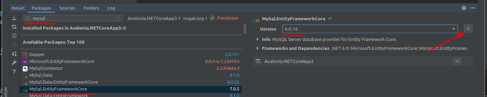
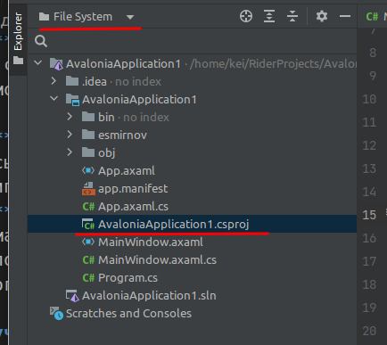

<table style="width: 100%;"><tr><td style="width: 40%;">
<a href="../articles/sql_import.md">Создание базы данных. Импорт данных.
</a></td><td style="width: 20%;">
<a href="../readme.md">Содержание
</a></td><td style="width: 40%;">
<a href="../articles/cs_layout2.md">Вывод данных согласно макету (ListView, Image).
</a></td><tr></table>

* [Создание подключения к БД MySQL](#создание-подключения-к-бд-mysql)
* [Получение данных с сервера](#получение-данных-с-сервера)

Дальше мы продолжим разбор задания одного из прошлых демо-экзаменов. 

Базу мы развернули и данные в неё импортировали, теперь начнём разбор второй сессии: создание desktop-приложения.

># Разработка desktop-приложений
>
>## Список продукции
>
>Необходимо реализовать вывод продукции, которая хранится в базе данных, согласно предоставленному макету (файл `product_list_layout.jpg` находится в ресурсах). При отсутствии изображения необходимо вывести картинку-заглушку из ресурсов (picture.png).
>
>
>
>...
>
>Стоимость продукта должна быть рассчитана исходя из используемых материалов.

# Создание подключения к БД MySQL.

По макету видно, что на первом экране уже нужны почти все данные, которые мы импортировали ранее: *наименование продукта* и *артикул* (таблица **Product**), *тип продукта* (**ProductType**), *список* материалов и *стоимость* материалов (**Material** через **ProductMaterial**).

Есть несколько вариантов работы с данными:

* ORM Фреймворки (библиотеки) - предпочтительный вариант, его мы и будем дальше использовать.

* Загрузака с помощью **DataAdapter** в наборы данных (**DataSet**). Для наборов данных можно даже установить связи между таблицами. Эта технология широко применялась в эпоху **Windows Forms** (этот способ рассматривался в [старых](./cs_mysql_connection.md#реализация-с-помощью-dataadapter) версиях лекций)

* Ещё один устаревший [вариант лекций](./cs_mysql_connection2.md) для **WPF** "заточен" на работу с объектами, в котором модели создавались вручную и данные в них грузились с помощью SQL-запросов и **DataReader**-a

**ORM** (Object-Relational Mapping, объектно-реляционное отображение) — технология программирования, суть которой заключается в создании «виртуальной объектной базы данных».

Благодаря этой технологии разработчики могут использовать язык программирования, с которым им удобно работать с базой данных, вместо написания операторов SQL или хранимых процедур. Это может значительно ускорить разработку приложений, особенно на начальном этапе. ORM также позволяет переключать приложение между различными реляционными базами данных. Например, приложение может быть переключено с MySQL на PostgreSQL с минимальными изменениями кода.

Ранее мы использовали **.NET Framework** + **WPF**, но с этого года перейдем на **.NET Core** + **Avalonia**.

**Во-первых**, **.NET Framework** работает только под ОС Windows и больше не поддерживается (последняя поддерживаемая версия C# - 4.7.2).

**Во-вторых**, ORM EntityFramewok не "дружит" с последними версиями MySQL коннектора

**.NET Core** - кроссплатформенная библиотека, поддерживает последние версии языка и ORM EntityFramewokCore нормально работает с MySQL.

**WPF** заменим на **Avalonia**, пока ограничимся ОС Windows, но в перспективе перейдём и на Linux/MacOS.

В качестве **IDE** будем использовать **JetBarains Rider**. Продует платный. Теоретически для неё есть бесплатные образовательные лицензии, но нам они недоступны. Активируйте ключём (гуглится по запросу "rider activation key", ключи действуют год и могут быть отозваны, поэтому конкретный ключ не указываю).

## Установка Rider

Ссылка для скачивания [Rider](https://www.jetbrains.com/ru-ru/rider/)

Установка Avalonia на Rider

1. Запустить собственно сам Rider

1. В основном окне выбрать вкладку *Configure -> Plugins*

    

1. Установить AvaloniaRider (в строке поиска введите "avalonia")

    

    При установке может выдать сообщение, что плагин разработан не в JetBrains и использовать на свой страх - соглашаемся (Accept)

1. После установки плагина перезагрузите IDE и установите шаблоны проектов для Avalonia. В консоли выполните команду: 

    ```
    dotnet new install Avalonia.Templates
    ```

    >Для .NET 6.0 и более ранних версий замените install на --install.
    >Версию .NET можно узнать выполнив в консоли команду `dotnet --version`

    Если шаблоны установлены нормально, то в окне создания нового проекта появится секция *Other*:

        

## Создание проекта, подключение пакетов для работы с БД.

Итак, создадим проект на C# по шаблону *Avalonia .NET Core App*

В *контекстном меню* проекта выберите "Manage NuGet Packages"


* Установите пакет "Microsoft.EntityFrameworkCore.Design"

    

    >Версия пакета должна соответствовать версии .NET. У меня стоит 6-я версия, вам нужно смотреть командой `dotnet --version`

* Установите пакет "MySql.EntityFrameworkCore"

    

    >Версия пакета должна соответствовать версии .NET.

## Создание подключения к БД (контекст).

Для подключения к базе данных нужно создать модели и контекст подключения (адрес сервера, название БД, логин и пароль). Тут есть два варианта:

1. **Application First** (сначала приложение) - в этом варианте модели и контекст подключения создаются руками в приложении, а **ORM** автоматически создает по ним одноимённые сущности в БД. (пример такого подхода расписан в [метаните](https://metanit.com/sharp/entityframeworkcore/7.2.php))

1. **DB First** (сначала база). В этом варианте база уже создана и нам нужен обратный процесс - [реконструировать](https://metanit.com/sharp/entityframeworkcore/1.3.php) модели и контекст по имеющейся БД. Мы будем использовать этот вариант.

В терминале (можно и в системной консоли, но обязательно в каталоге проекта) 


выполните команду (естественно, вписав свои базы и пароли):

```
dotnet ef dbcontext scaffold "server=kolei.ru;database=esmirnov;uid=esmirnov;password=111103;" MySql.EntityFrameworkCore -o esmirnov -f
```
параметры команды:

* "строка подключения": здесь вариант для MySQL

    - **server**: доменное имя или IP-адрес севрера (на демо экзамене будет что-то типа 192.168.1.32)
    - **database**: название базы данных на сервере MySQL. Для лабораторных работ выдаёт преподаватель, на демо экзамене `userXX`
    - **uid**: логин пользователя (обычно то же, что и название БД, но если у вас свой сервер MySQL, то там вы рулите сами)
    - **password**: пароль пользователя

* используемый провайдер БД (MySql.EntityFrameworkCore)

* **-o "Название каталога"**: название каталога в вашем проекте, в котором будут созданы контекст и модели БД

* **-f**: перезаписывать модели (при повторном запуске команды)

Эта команда создает контекст подключения (параметры в кавычках) к провайдеру (второй параметр) MySQL и модели сущностей в папке `esmirnov` вашего проекта.


Например, рассмотрим таблицу **Product**:

```cs
public partial class Product
{
    public Product()
    {
        ProductCostHistories = new HashSet<ProductCostHistory>();
        ProductMaterials = new HashSet<ProductMaterial>();
        ProductSales = new HashSet<ProductSale>();
    }

    public int Id { get; set; }
    public string Title { get; set; } = null!;
    public int ProductTypeId { get; set; }
    public string ArticleNumber { get; set; } = null!;
    public string? Description { get; set; }
    public string? Image { get; set; }
    public int? ProductionPersonCount { get; set; }
    public int? ProductionWorkshopNumber { get; set; }
    public decimal MinCostForAgent { get; set; }

    public virtual ProductType ProductType { get; set; } = null!;
    public virtual ICollection<ProductCostHistory> ProductCostHistories { get; set; }
    public virtual ICollection<ProductMaterial> ProductMaterials { get; set; }
    public virtual ICollection<ProductSale> ProductSales { get; set; }
}
```

1. Для всех полей таблицы созданы свойства класса (*Id*, *Title*...), причём необязательные поля имеют "нуллабельные" типы (**int? ProductionPersonCount**).
1. Для связей созданы виртуальные свойства или коллекции (в зависимости от направленности связи). 

    * **virtual ProductType ProductType** - тип продукции (ссылка на словарь), отношение много (продуктов) к одному (типу продукта)
    * **virtual ICollection<ProductMaterial> ProductMaterials** - материалы продукта - коллекция (список) материалов, используемых в этом продукте. Отношение один (продукт) ко многим (материалам продукта) 

## Получение данных с сервера и вывод на экран.

**DataGrid** в **Avalonia** не установлен по умолчанию. Установить можно двумя вариантами:

* выполнив команду `dotnet add package Avalonia.Controls.DataGrid`. Тут может возникнуть ситуация, когда версия **DataGrid** больше чем версия **Avalonia**. В этом случае проект не *соберется*. Удалите пакет командой `dotnet remove package Avalonia.Controls.DataGrid` и воспользуйтесь вторым вариантом

* Добавить ссылку в файл проекта:

    1. Переключите *Explorer* в режим *File System*:

         

    1. Откройте файл проекта *.csproj, найдите строчку `<PackageReference Include="Avalonia" Version="11.0.2" />` (версия у вас может быть другая)

    1. Добавьте следующей строкой пакет `<PackageReference Include="Avalonia.Controls.DataGrid" Version="11.0.2" />`

        

        >При редактировании версии пакета можно нажать комбинацию клавишь `Ctrl+Пробел` и выйдет подсказка с возможными вариантами версий

Для демонстрации работы используем прошлогоднюю [заготовку](https://github.com/kolei/OAP/blob/master/articles/wpf_template.md) - вывод в DBGrid

* XAML

    ```xml
    <Grid ShowGridLines="True">
        <Grid.RowDefinitions>
            <RowDefinition Height="auto"/>
            <RowDefinition />
            <RowDefinition Height="auto"/>
        </Grid.RowDefinitions>
        <Grid.ColumnDefinitions>
            <ColumnDefinition Width="200"/>
            <ColumnDefinition/>
        </Grid.ColumnDefinitions>

        <StackPanel 
            Orientation="Vertical"
            Grid.RowSpan="3"
            VerticalAlignment="Bottom">
            <!-- левая панель для кнопок -->
        </StackPanel>

        <WrapPanel
            Orientation="Horizontal"
            Grid.Column="1"
            MinHeight="50">
            <!-- минимальную высоту я тут поставил, чтобы верхнюю строку сетки было видно. В реальном приложении она не нужна -->
        </WrapPanel>

        <DataGrid
            Grid.Row="1"
            Grid.Column="1"
            CanUserAddRows="False"
            AutoGenerateColumns="False"
            ItemsSource="{Binding ProductList}">
            <DataGrid.Columns>
                <DataGridTextColumn
                    Header="Название"
                    Binding="{Binding Title}"/>
                <DataGridTextColumn
                    Header="Номер"
                    Binding="{Binding ArticleNumber}"/>
            </DataGrid.Columns>
        </DataGrid>
    </Grid>
    ```

* CS

    ```cs
    public partial class MainWindow : Window
    {
        public IEnumerable<Product> ProductList { get; set; }
        public MainWindow()
        {
            InitializeComponent();
            DataContext = this;
            using (var context = new esmirnovContext())
            {
                ProductList = context.Products.ToList();
            }
        }
    }
    ```

    Обратите внимание, **context.Products** это не модель, а виртуальный DbSet (коллекция сущностей), объявленный в классе контекста: `public virtual DbSet<Product> Products { get; set; }`. При чтении этой коллекции как раз и происходит обращение к БД (посылка SQL-команд)

Всё работает!!!

