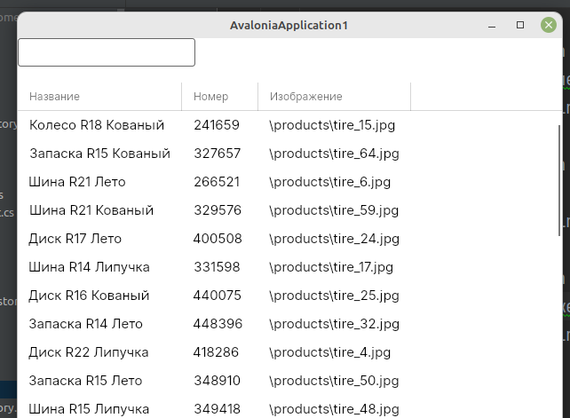

Предыдущая лекция |  | Следующая лекция
:----------------:|:----------:|:----------------:
[Хранимые процедуры. Триггеры.](./sql_trigger.md) | [Содержание](../readme.md#c-и-mysql) | [Вывод данных согласно макету (ListBox, Image). Вывод данных плиткой.](./cs_layout2.md)

# Создание подключения к БД MySQL. Получение данных с сервера.

* [Создание проекта, подключение пакетов для работы с БД](#создание-проекта-подключение-пакетов-для-работы-с-бд)
* [Создание подключения к БД (контекст)](#создание-подключения-к-бд-контекст)
* [Получение данных с сервера и вывод на экран](#получение-данных-с-сервера-и-вывод-на-экран)

Дальше мы продолжим разбор задания одного из прошлых демо-экзаменов. 

Базу мы развернули и данные в неё импортировали, теперь начнём разбор второй сессии: создание desktop-приложения.

>**Разработка desktop-приложений**
>
>**Список продукции**
>
>Необходимо реализовать вывод продукции, которая хранится в базе данных, согласно предоставленному макету (файл `product_list_layout.jpg` находится в ресурсах). При отсутствии изображения необходимо вывести картинку-заглушку из ресурсов (`picture.png`).
>
>
>
>...
>
>Стоимость продукта должна быть рассчитана исходя из используемых материалов.

По макету видно, что на первом экране уже нужны почти все данные, которые мы импортировали ранее: *наименование продукта* и *артикул* (таблица **Product**), *тип продукта* (**ProductType**), *список* материалов и *стоимость* материалов (**Material** через **ProductMaterial**).

Есть несколько вариантов работы с данными:

* ORM Фреймворки (библиотеки).

    **ORM** (Object-Relational Mapping, объектно-реляционное отображение) — технология программирования, суть которой заключается в создании «виртуальной объектной базы данных».

    Вариантов таких фреймворков много:
    
    1. **EntityFramework**

        Благодаря этой технологии разработчики могут использовать язык программирования, с которым им удобно работать с базой данных, вместо написания операторов SQL или хранимых процедур. Это может значительно ускорить разработку приложений, особенно на начальном этапе. ORM также позволяет переключать приложение между различными реляционными базами данных. Например, приложение может быть переключено с MySQL на PostgreSQL с минимальными изменениями кода.

    1. **Dapper**

        Как показал опыт, **EntityFramework** очень громоздкий и не всегда понятный.

        Есть более легковесные альтернативы, например **Dapper**. Это микро-фреймворк, который тоже может результат SQL-запроса поместить в модель, но при этом модель мы должны "нарисовать" сами и знать SQL-синтаксис.

* Загрузака с помощью **DataAdapter** в наборы данных (**DataSet**). Для наборов данных можно даже установить связи между таблицами. Эта технология широко применялась в эпоху **Windows Forms**

## Примеры работы с Dapper

1. В приложении прописать строку подключения (где-нибудь в глобальном статическом классе)

    ```cs
    static string connectionString = "Server=kolei.ru; User ID=esmirnov; Password=111103; Database=esmirnov";
    ```

1. Создать модели для нужных таблиц (мне лень все поля переписывать, смысл должен быть понятен).

    ```cs
    public class Product
    {
        public int ID { get; set; }
        public string Title { get; set; }
    }
    ```

1. Чтение данных:

    ```cs
    public List<Product> productList { get; set; }

    ...

    using (MySqlConnection db = new MySqlConnection(connectionString))
    {
            productList = db.Query<Product>(
            "SELECT ID,Title FROM Product")
            .ToList();
    }
    ```

    То есть мы считываем данные сразу в список продукции. **Обратите внимание**, названия полей в БД должны соответствовать свойствам модели. В этом ничего страшного нет, названия полей можно поменять при выборке используя конструкцию `AS`, например: `SELECT id AS ID FROM Product`.

1. Получение одной записи (здесь и далее непроверенный код из гугла)

    ```cs
    db.Query<User>(
        "SELECT * FROM Users WHERE Id = @id", new { id })
        .FirstOrDefault();
    ```

    Тут видно, как выполнять запросы с параметрами, вторым параметром в методе **Query** передаётся объект с параметрами, которые заменяют одноименные литералы в тексте запроса.

    Естественно, в качестве такого объекта может быть экземпляр соответствующей модели (см. следующий запрос)

1. Добавление записи в таблицу (в этом и последующих запросах результат не нужен, поэтому используется метод **Execute**)

    ```cs
    db.Execute(
        "INSERT INTO Users (Name, Age) VALUES (@Name, @Age)", 
        user);
    ```

    Здесь данные для запроса берутся сразу из модели (*user* это экземпляр класса **User**)

1. Редактирование записи:

    ```cs
    db.Execute(
        "UPDATE Users SET Name = @Name, Age = @Age WHERE Id = @Id", 
        user);
    ```

1. Удаление записи:

    ```cs
    db.Execute(
        "DELETE FROM Users WHERE Id = @id", 
        new { id });
    ```

## Создание проекта, подключение пакетов для работы с БД.

Рассмотрим реализацию задания по выводу списка продукции.

1. Создайте **WPF** проект.

1. Через **NuGet** или в консоли установить пакеты: **MySqlConnector** и **Dapper**

    ```
    dotnet add package MySqlConnector
    dotnet add package Dapper
    ```

<!-- ## Получение данных с сервера и вывод на экран. -->

<!-- Для демонстрации работы в `MainWindow.xaml` добавим DataGrid:

```xml
<DataGrid 
    Name="productsGrid"
    AutoGenerateColumns="False"
    x:DataType="model:Product"
    ItemsSource="{Binding #root.productList}"
>
    <DataGrid.Columns>
        <DataGridTextColumn
            Header="Название"
            Binding="{Binding Title}"
        />
        <DataGridTextColumn
            Header="Номер"
            Binding="{Binding ArticleNumber}"
        />
        <DataGridTextColumn
            Header="Изображение"
            Binding="{Binding Image}"
        />
    </DataGrid.Columns>
</DataGrid>
``` -->

<!-- Полученик данные из БД:

```cs
public partial class MainWindow : Window
{
    public IEnumerable<Product> productList { get; set; }
    public MainWindow()
    {
        // считываем данные ДО инициализации окна, 
        // иначе без INotifyPropertyChanged
        // авалония не понимает, что данные изменились
        using (var context = new esmirnovContext())
        {
            productList = context.Products.ToList();
        }
        InitializeComponent();
    }
}
```

>Обратите внимание, *context.Products* это не модель, а виртуальный **DbSet** (коллекция сущностей), объявленный в классе контекста: `public virtual DbSet<Product> Products { get; set; }`. При чтении этой коллекции как раз и происходит обращение к БД (посылка SQL-команд) -->

<!-- **Всё работает!!!**

 -->

---

Предыдущая лекция |  | Следующая лекция
:----------------:|:----------:|:----------------:
[Хранимые процедуры. Триггеры.](./sql_trigger.md) | [Содержание](../readme.md#c-и-mysql) | [Вывод данных согласно макету (ListBox, Image). Вывод данных плиткой.](./cs_layout2.md)
