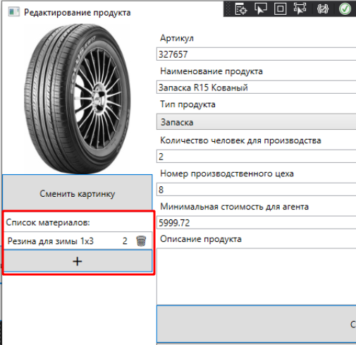
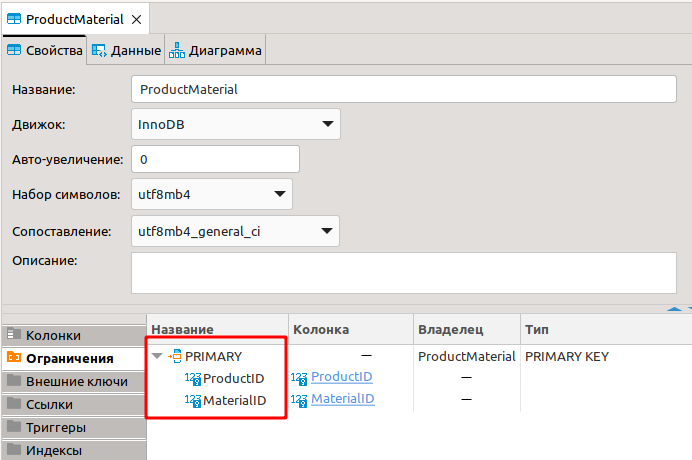

Предыдущая лекция |  | Следующая лекция
:----------------:|:----------:|:----------------:
[Создание, изменение, удаление продукции](./cs_edit_product2.md) | [Содержание](../readme.md#c-и-mysql) | [API. REST API. Создание сервера ASP.NET Core.](./api_asp_net_core.md)

# Вывод списка материалов продукта. CRUD материалов продукта

>**CRUD** - аббревиатура от слов **C**reate, **R**ead, **U**pdate, **D**elete - основные операции, которые вы должны уметь реализовывать с любым набором данных.

>**Задание:**
>Необходимо реализовать вывод списка материалов, используемых при производстве продукции, с указанием количества. В список можно добавлять новые позиции и удалять существующие. При добавлении материалы должны выбираться из выпадающего списка с возможностью поиска по наименованию.

В итоге должно получиться что-то подобное (список материалов продукта под картинкой):



Этот материал вы уже можете сделать самостоятельно, я лишь остановлюсь на паре новых моментов:

* [Read](#read-вывод-списка)
* [Delete](#delete-удаление-материала-продукта)

## Read (вывод списка)

Получаем из базы список материалов *редактируемого продукта* и выводим этот список используя **ListBox**

1. Получение списка материалов редактируемого продукта. 

    Список формируем в конструкторе окна **EditProductWindow**. 
    
    Материалы продукта (в принципе это очевидно по названию) хранятся в таблице **ProductMaterial**. Это, так называемая, **таблица связей**  - реализация отношения *многие (продукты) - ко - многим (материалам)*. При чтении надо учитывать, что нам нужны материалы только редактируемого продукта, т.е. указать фильтр по редактируемому продукту при выборке: 

    
    ```cs
    // реализуем геттер списка матриалов продукта
    public IEnumerable<ProductMaterial> productMaterialList { 
        get {
            // TODO чтение списка материалов
            return Globals.dataProvider.getProductMaterials(currentProduct.ID);
        } 
    }
    ```

1. Вывод списка материалов продукта

    Тут обычный **ListBox**, но в качестве одного из элементов мы нарисуем кнопку "Удалить", чтобы удалять элемент списка можно было не заходя в окно редактирования

    ```xml
    <ListView
        ItemsSource="{Binding productMaterialList}"
        MouseDoubleClick="ProductMaterialtListView_MouseDoubleClick"
    >
        <ListView.ItemContainerStyle>
            <Style 
                TargetType="ListViewItem"
            >
                <Setter 
                    Property="HorizontalContentAlignment"
                    Value="Stretch" />
            </Style>
        </ListView.ItemContainerStyle>
        <ListView.ItemTemplate>
            <DataTemplate>
                <Grid >
                    <!-- в списке 3 колонки: название материала, количество и кнопка удаления -->
                    <Grid.ColumnDefinitions>
                        <ColumnDefinition/>
                        <ColumnDefinition Width="auto"/>
                        <ColumnDefinition Width="auto"/>
                    </Grid.ColumnDefinitions>
                    <!-- тут вы уже должны сами сообразить как получить название материала -->
                    <TextBlock 
                        Text="{Binding MaterialTitle}"/>
                    <!-- этой колонке добавим границы слева и справа -->
                    <TextBlock     
                        Grid.Column="1" 
                        Margin="10,0"
                        Text="{Binding Count}"/>
                    <!-- кнопка "удалить" -->
                    <TextBlock
                        x:Name="DeleteMaterialTextBlock" 
                        Grid.Column="2"
                        Tag="{Binding Path=.}"
                        Text="🗑" 
                        MouseDown="DeleteMaterialTextBlock_MouseDown"/>
                </Grid>
            </DataTemplate>
        </ListView.ItemTemplate>
    </ListView>
    ```

    Рассмотрим подробнее реализацию кнопки "Удалить":

    - вместо элемента **Button** используем элемент **TextBlock** (стандартная кнопка выглядит слишком тяжеловесно в списке)
    - в качестве текста используем UTF символ корзины 
    - для того чтобы знать на каком элементе списка мы кликнули, сохраняем в атрубуте **Tag** ссылку на текущий элемент списка (**Path=.**). Атрибут **Tag** есть у всех визуальных элементов и в нём может храниться любой объект. 

## Delete (удаление материала продукта)

Реализуем обработчик клика по кнопке удаления:

```cs
private void DeleteMaterialTextBlock_MouseDown(object sender, MouseButtonEventArgs e)
{
    // sender (в параметрах метода) содержит указатель на визуальный элемент, по которому мы кликнули
    // (sender as TextBlock) приводит объект к типу TextBlock
    // (sender as TextBlock).Tag as ProductMaterial - атрибут Tag мы приводим к классу ProductMaterial
    var productMaterial = (sender as TextBlock).Tag as ProductMaterial;

    // TODO удаление материала
    Globals.dataProvider.deleteProductMaterial(productMaterial);
    Invalidate("productMaterialList");
}
```

При удалении матриала продукта нужно учитывать, что в этой таблице составной первичный ключ, поэтому для удаления нужно указывать оба поля в условии `WHERE`



---

Предыдущая лекция |  | Следующая лекция
:----------------:|:----------:|:----------------:
[Создание, изменение, удаление продукции](./cs_edit_product2.md) | [Содержание](../readme.md#c-и-mysql) | [API. REST API. Создание сервера ASP.NET Core.](./api_asp_net_core.md)
