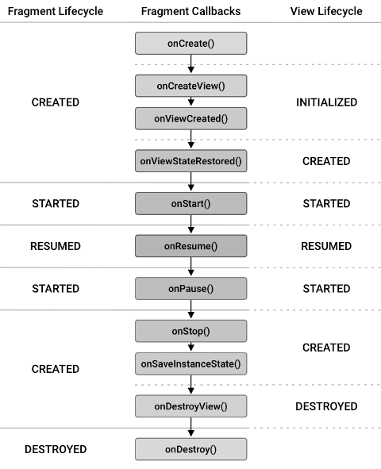

Предыдущая лекция | &nbsp; | Следующая лекция
:----------------:|:----------:|:----------------:
[Проект погода (продолжение)](./weather2.md) | [Содержание](../readme.md#практика-разработка-мобильных-приложений) | [Android Navigation. Знакомство с BottomNavigationView.](./android_bottom_navigation.md)


# Фрагменты

>Содрано [отсюда](https://metanit.com/java/android/8.1.php)

## Введение во фрагменты

Организация приложения на основе нескольких *activity* не всегда может быть оптимальной. Мир ОС Android довольно сильно фрагментирован и состоит из многих устройств. И если для мобильных аппаратов с небольшими экранами взаимодействие между разными *activity* выглядит довольно неплохо, то на больших экранах - планшетах, телевизорах окна *activity* смотрелись бы не очень в силу большого размера экрана. Собственно поэтому и появилась концепция фрагментов.

**Фрагмент** представляет кусочек визуального интерфейса приложения, который может использоваться повторно и многократно. У фрагмента может быть собственный файл разметки (layout), у фрагментов есть свой собственный жизненный цикл. Фрагмент существует в контексте *activity* и имеет свой жизненный цикл, вне *activity* обособлено он существовать не может. Каждая *activity* может иметь несколько фрагментов.


Для начала работы с фрагментами создадим новый проект с пустой MainActivity.

Фактически фрагмент - это обычный класс, который наследуется от класса **Fragment**. Однако как и класс **Activity**, фрагмент может использовать xml-файлы разметки для определения графического интерфейса. И таким образом, мы можем добавить по отдельности класс, который представляет фрагмент, и файл xml для хранения в нем разметки интерфейса, который будет использовать фрагмент.

Android Studio представляет готовый шаблон для добавления фрагмента.

Для этого нажмем на папку, где находится класс **MainActivity**, правой кнопкой мыши и в появившемся меню выберем **New -> Fragment -> Fragment(Blank)**:


>Обратите внимание на именование: имя класса состоит из описательной части (content) и суффикса, обозначающего тип элемента (fragment). Название файла разметки (layout) генерируется автоматически по названию класса.

В файле разметки `fragment_content.xml` в качестве корневого контейнера по умолчанию используется **FrameLayout**

```xml
<?xml version="1.0" encoding="utf-8"?>
<FrameLayout xmlns:android="http://schemas.android.com/apk/res/android"
    xmlns:tools="http://schemas.android.com/tools"
    android:layout_width="match_parent"
    android:layout_height="match_parent"
    tools:context=".ContentFragment">

</FrameLayout>
```

>В этом контейнере потомки никак не позиционируются и накладываются друг на друга. Можно либо задавать границы элементов потомков, либо положить другой контейнер (например, LinearLayout) и в него уже помещать все остальные.
>
>```xml
><LinearLayout
>    android:layout_width="match_parent"
>    android:layout_height="match_parent"
>    android:orientation="vertical">
>    <Button
>        android:id="@+id/updateButton"
>        android:layout_width="match_parent"
>        android:layout_height="wrap_content"
>        android:text="Обновить" />
>
>    <TextView
>        android:id="@+id/dateTextView"
>        android:layout_width="match_parent"
>        android:layout_height="wrap_content"
>        android:text="Hello from Fragment"
>        android:textSize="28sp"/>
>
></LinearLayout>
>```

Теперь мы можем поместить готовый фрагмент в основное окно. В разметку файла `activity_main.xml` добавьте контейнер **FragmentContainerView** из палитры элементов


Система запросит какой фрагмент вы хотите поместить в контейнер:


Не забудьте установить позицию и размер контейнера.

По сути **FragmentContainerView** представляет объект **View**, который расширяет класс **FrameLayout** и предназначен специально для работы с фрагментами. Собственно кроме фрагментов он больше ничего содержать не может.

Его атрибут `android:name` указывает на имя класса фрагмента, который будет использоваться.

Фрагмент успешно добавлен и приложение запускается и работает, но надо учитывать, что теперь логика работы с элементами фрагмента должна быть реализована в классе фрагмента (**ContentFragment**)

### Добавление фрагмента в коде

Кроме определения фрагмента в xaml-файле интерфейса мы можем добавить его динамически в activity.

```kt
override fun onCreate(savedInstanceState: Bundle?) {
    super.onCreate(savedInstanceState)
    setContentView(R.layout.activity_main)

    // добавление фрагмента
    if (savedInstanceState == null) {
        supportFragmentManager
            .beginTransaction()
            .add(R.id.fragmentContainerView,
                SecondFragment::class.java, null)
            .commit()
    }
}
```

Свойство *supportFragmentManager* является геттером для метода *getSupportFragmentManager()*, возвращающего объект **FragmentManager**, который управляет фрагментами.

Объект FragmentManager с помощью метода *beginTransaction()* создает объект **FragmentTransaction**.

**FragmentTransaction** выполняет два метода: *add()* и *commit()*. Метод *add()* добавляет фрагмент: `add(R.id.fragmentContainerView, SecondFragment::class.java, null)` - первым аргументом передается ресурс разметки, в который надо добавить фрагмент (это определенный в `activity_main.xml` элемент `androidx.fragment.app.FragmentContainerView`), вторым агрументом передаётся класс фрагмента, который надо добавить, третьим аргументом может передаваться *bundle* (параметры). И метод *commit()* подтвержает и завершает операцию добавления.

Итоговый результат такого добавления фрагмента будет тем же, что и при явном определении фрагмента через элемент **FragmentContainerView** в разметке интерфейса.

>Если вы назначили фрагмент при добавлении **FragmentContainerView**, то фрагменты наложатся друг на друга, надо в файле `activity_main.xml` убрать у элемента **FragmentContainerView** атрибут `android:name`:
>
>```xml
><androidx.fragment.app.FragmentContainerView
>    android:id="@+id/fragmentContainerView"
>    android:name="ru.yotc.fragments.BlankFragment"
>    ^^^^^^^^^^^^^^^^^^^^^^^^^^^^^^^^^^^^^^^^^^^^^^
>```

## Жизненный цикл фрагментов

Каждый класс фрагмента наследуется от базового класса Fragment и имеет свой жизненный цикл, состоящий из ряда этапов:



## Динамическая работа с фрагментами

Основано на [этой](https://startandroid.ru/ru/uroki/vse-uroki-spiskom/175-urok-105-android-3-fragments-dinamicheskaja-rabota.html) статье.

Размещать статические фрагменты мы уже умеем. Но гораздо интереснее работать с ними динамически. Система позволяет нам добавлять, удалять и заменять фрагменты друг другом. При этом мы можем сохранять все эти манипуляции в BackStack и кнопкой Назад отменять. В общем, все удобно и красиво.

>Подробнее про BackStack можно почитать [тут](https://habr.com/ru/post/186434/)

Создадим простое приложение с двумя фрагментами, которое будет уметь:

- добавлять первый фрагмент
- удалять первый фрагмент
- заменять первый фрагмент вторым фрагментом
- переключать режим сохранения в BackStack операций с фрагментами

Используем приложение с фрагментами из предыдущего раздела.

1. В классах фрагментов можно выкинуть все, кроме метода **onCreateView**

1. Рисуем разметку *activity_main.xml*

    ```xml
    <?xml version="1.0" encoding="utf-8"?>
    <androidx.constraintlayout.widget.ConstraintLayout
        xmlns:android="http://schemas.android.com/apk/res/android"
        xmlns:app="http://schemas.android.com/apk/res-auto"
        xmlns:tools="http://schemas.android.com/tools"
        android:layout_width="match_parent"
        android:layout_height="match_parent"
        tools:context=".MainActivity">

        <LinearLayout
            android:id="@+id/linearLayout"
            android:layout_width="match_parent"
            android:layout_height="wrap_content"
            android:orientation="vertical"
            app:layout_constraintEnd_toEndOf="parent"
            app:layout_constraintStart_toStartOf="parent"
            app:layout_constraintTop_toTopOf="parent">

            <Button
                android:id="@+id/btnAdd"
                android:layout_width="wrap_content"
                android:layout_height="wrap_content"
                android:onClick="onClick"
                android:text="Добавить"/>

            <Button
                android:id="@+id/btnRemove"
                android:layout_width="wrap_content"
                android:layout_height="wrap_content"
                android:onClick="onClick"
                android:text="Удалить"/>

            <Button
                android:id="@+id/btnReplace"
                android:layout_width="wrap_content"
                android:layout_height="wrap_content"
                android:onClick="onClick"
                android:text="Заменить"/>

            <CheckBox
                android:id="@+id/chbStack"
                android:layout_width="wrap_content"
                android:layout_height="wrap_content"
                android:text="Добавить в Back Stack"/>

        </LinearLayout>

        <FrameLayout
            android:id="@+id/frgmCont"
            android:layout_width="match_parent"
            android:layout_height="500dp"
            app:layout_constraintBottom_toBottomOf="parent"
            app:layout_constraintEnd_toEndOf="parent"
            app:layout_constraintStart_toStartOf="parent"
            app:layout_constraintTop_toBottomOf="@+id/linearLayout"/>
    </androidx.constraintlayout.widget.ConstraintLayout>
    ```

    Три кнопки для добавления, удаления и замены фрагментов. Чекбокс для включения использования BackStack. И FrameLayout – это контейнер, в котором будет происходить вся работа с фрагментами. Он должен быть типа ViewGroup. А элементы Fragment, которые мы использовали в предыдущем примере для размещения фрагментов, нам не нужны для динамической работы. 

1. Класс MainActivity.kt:

    ```kt
    class MainActivity : AppCompatActivity() {

        lateinit var frag1: Fragment1
        lateinit var frag2: Fragment2

        override fun onCreate(savedInstanceState: Bundle?) {
            super.onCreate(savedInstanceState)
            setContentView(R.layout.activity_main)

            frag1 = Fragment1()
            frag2 = Fragment2()
        }

        fun onClick(v: View){
            val fTrans = supportFragmentManager.beginTransaction()
            when(v.id){
                R.id.btnAdd -> fTrans.add(
                    R.id.frgmCont, frag1)
                R.id.btnRemove -> fTrans.remove(frag1)
                R.id.btnReplace -> fTrans.replace(
                    R.id.frgmCont, frag2)
            }
            if (chbStack.isChecked) fTrans.addToBackStack(null)
            fTrans.commit()
        }   
    }
    ```

    В конструкторе создаем фрагменты.

    В **onClick** мы получаем менеджер фрагментов с помощью геттера *supportFragmentManager*. Этот объект является основным для работы с фрагментами. Далее, чтобы добавить/удалить/заменить фрагмент, нам необходимо использовать транзакции. Они аналогичны транзакциям в БД, где мы открываем транзакцию, производим операции с БД, выполняем *commit*. Здесь мы открываем транзакцию, производим операции с фрагментами (добавляем, удаляем, заменяем), выполняем *commit*.

    Итак, мы получили **FragmentManager** и открыли транзакцию методом *beginTransaction*. Далее определяем, какая кнопка была нажата:

    если **Add**, то вызываем метод add, в который передаем id контейнера (тот самый FrameLayout из activity_main.xml) и объект фрагмента. В итоге, в контейнер будет помещен Fragment1

    если **Remove**, то вызываем метод remove, в который передаем объект фрагмента, который хотим убрать. В итоге, фрагмент удалится с экрана.

    если **Replace**, то вызываем метод replace, в который передаем id контейнера и объект фрагмента. В итоге, из контейнера удалится его текущий фрагмент (если он там есть) и добавится фрагмент, указанный нами.

    Далее проверяем чекбокс. Если он включен, то добавляем транзакцию в BackStack. Для этого используем метод addToBackStack. На вход можно подать строку-тэг. Я передаю null.

    Ну и вызываем commit, транзакция завершена.


Т.е. все достаточно просто и понятно. Скажу еще про пару интересных моментов.

Я в этом примере выполнял всего одну операцию в каждой транзакции. Но, разумеется, их может быть больше.

Когда мы удаляем фрагмент и не добавляем транзакцию в BackStack, то фрагмент уничтожается. Если же транзакция добавляется в BackStack, то, при удалении, фрагмент не уничтожается (onDestroy не вызывается), а останавливается (onStop).

В качестве самостоятельной работы: попробуйте немного изменить приложение и добавлять в один контейнер сразу два фрагмента.

## Доступ к фрагменту из Activity

Разберемся, как получить доступ к фрагменту из Activity. Для этого у **FragmentManager** есть метод *findFragmentById*, который на вход принимает id компонента fragment (если фрагмент статический) или id контейнера (если динамический).

В основном классе реализуем обработчик клика по кнопке btnFind:

```kt
btnFind.setOnClickListener {
    val frag1 = supportFragmentManager.findFragmentById(R.id.fragment1)
    frag1?.view?.findViewById<TextView>(R.id.textView)?.text = "Access to Fragment 1 from Activity"

    val frag2 = supportFragmentManager.findFragmentById(R.id.frgmCont)
    frag2?.view?.findViewById<TextView>(R.id.textView)?.text = "Access to Fragment 2 from Activity"
}
```

Используем метод findFragmentById. В первом случае на вход передаем id компонента fragment, т.к. Fragment1 у нас размещен именно так. При поиске Fragment2 указываем id контейнера, в который этот фрагмент был помещен. В результате метод findFragmentById возвращает нам объект Fragment.

Далее мы получаем доступ к его View с помощью геттера view, находим в нем TextView и меняем текст.

Запускаем приложение и проверяем:


Тексты в фрагментах обновились. Тем самым из Activity мы достучались до фрагментов и их компонентов.

На всякий случай проговорю одну вещь из разряда «Спасибо кэп!». Если посмотреть на код MainActivity, то можно заметить, что работая с frag2 в методе onCreate и с frag2 в методе onClick мы работаем с текущим фрагментом Fragment2. Это так и есть. Оба frag2 в итоге будут ссылаться на один объект. Так что, если вы динамически добавили фрагмент, то у вас уже есть ссылка на него, и искать его через findFragmentById вам уже не обязательно.

## Доступ к Activity из фрагмента 

Теперь попробуем из фрагмента поработать с Activity. Для этого фрагмент имеет метод getActivity (геттер *activity*).

Давайте перепишем обработчик кнопки в первом фрагменте. Будем менять текст кнопки btnFind.

```kt
button.setOnClickListener {
    //Log.d(LOG_TAG, "Button click in Fragment1")
    activity?.findViewById<Button>(R.id.btnFind)?.text = "Access from Fragment1"
}
```


Проверяем - все работает.

## Взаимодействие между фрагментами

Одна activity может использовать несколько фрагментов, например, с одной стороны список, а с другой - детальное описание выбранного элемента списка. В такой конфигурации activity использует два фрагмента, которые между собой должны взаимодействовать. Рассмотрим базовые принципы взаимодействия фрагментов в приложении.

>Подробнее [тут](https://metanit.com/java/android/8.5.php)

## Обработка в Activity события из фрагмента 

Рассмотрим следующий механизм: фрагмент генерирует некое событие и ставит Activity обработчиком.

Например, в Activity есть два фрагмента. Первый – список заголовков статей. Второй – отображает содержимое статьи, выбранной в первом. Мы нажимаем на заголовок статьи в первом фрагменте и получаем содержимое во втором. В этом случае, цель первого фрагмента – передать в Activity информацию о том, что выбран заголовок. А Activity дальше уже сама решает, что делать с этой информацией. Если, например, приложение запущено на планшете в горизонтальной ориентации, то можно отобразить содержимое статьи во втором фрагменте. Если же приложение запущено на смартфоне, то экран маловат для двух фрагментов и надо запускать отдельное Activity со вторым фрагментом, чтобы отобразить статью.

Фишка тут в том, что первому фрагменту неинтересны все эти терзания Activity. Фрагмент – обособленный модуль. Его дело - проинформировать, что выбрана статья такая-то. Ему не надо искать второй фрагмент и работать с ним – это дело Activity.

Фрагмент должен сообщить в Activity, что выбрана статья. Для этого он будет вызывать некий метод в Activity. И лучший способ тут – это использовать интерфейс, который мы опишем в фрагменте и который затем будет реализован в Activity. Схема известная и распространенная. Давайте реализуем. В нашем приложении никаких статей нет, поэтому будем просто передавать произвольную строку из второго фрагмента в Activity. А Activity уже будет отображать эту строку в первом фрагменте.

1. Описываем интерфейс FragmentEventListener, содержащий метод someEvent, который на вход получает строку (в примере этот интерфейс написан в классе Fragment2, но это не принципиально)

    ```kt
    interface FragmentEventListener {
       fun someEvent(s: String)
    }
    ```
1. Переписываем класс Fragment2 (читайте комментарии):

    ```kt
    class Fragment2: Fragment() {
        private val LOG_TAG = "kei"

        // добавляем переменную, которая будет хранить ссылку на интерфейс
        lateinit var eventListener: FragmentEventListener

        override fun onAttach(context: Context) {
            super.onAttach(context)
            // при присоединении к Activity проверяем, реализует ли она нужный интерфейс
            if(activity is FragmentEventListener)
                // запоминаем ссылку на объект
                eventListener = activity as FragmentEventListener
            else
                // выбрасываем исключение
                throw ClassCastException("${activity.toString()} must implement FragmentEventListener")
        }

        override fun onCreateView(
            inflater: LayoutInflater,
            container: ViewGroup?,
            savedInstanceState: Bundle?
        ): View? {
            val v = inflater.inflate(R.layout.fragment2, null)

            val button = v.findViewById<Button>(R.id.button)

            button.setOnClickListener {
                // при клике на кнопку вызываем метод интерфейса
                eventListener.someEvent("Test text from Fragment 2")
            }

            return v
        }
    }
    ```

1. Редактируем основной класс: он должен реализовывать интерфейс *FragmentEventListener* и по событию от второго фрагмента менять текст первого:

    ```kt
    class MainActivity : AppCompatActivity(), FragmentEventListener {

        override fun someEvent(s: String) {
            val frag1 = supportFragmentManager.findFragmentById(R.id.fragment1)
            frag1?.view?.findViewById<TextView>(R.id.textView)?.text = s
        }
        ...
    ```

Предыдущая лекция | &nbsp; | Следующая лекция
:----------------:|:----------:|:----------------:
[Проект погода (продолжение)](./weather2.md) | [Содержание](../readme.md#практика-разработка-мобильных-приложений) | [Android Navigation. Знакомство с BottomNavigationView.](./android_bottom_navigation.md)

