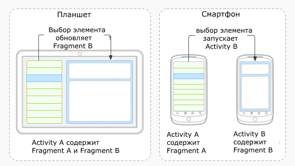
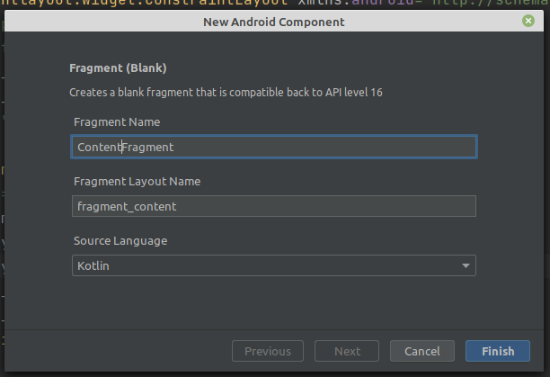
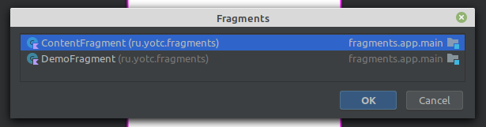

# Фрагменты

>Содрано [отсюда](https://metanit.com/java/android/8.1.php)

## Введение во фрагменты

Организация приложения на основе нескольких *activity* не всегда может быть оптимальной. Мир ОС Android довольно сильно фрагментирован и состоит из многих устройств. И если для мобильных аппаратов с небольшими экранами взаимодействие между разными *activity* выглядит довольно неплохо, то на больших экранах - планшетах, телевизорах окна *activity* смотрелись бы не очень в силу большого размера экрана. Собственно поэтому и появилась концепция фрагментов.

**Фрагмент** представляет кусочек визуального интерфейса приложения, который может использоваться повторно и многократно. У фрагмента может быть собственный файл разметки (layout), у фрагментов есть свой собственный жизненный цикл. Фрагмент существует в контексте *activity* и имеет свой жизненный цикл, вне *activity* обособлено он существовать не может. Каждая *activity* может иметь несколько фрагментов.



Для начала работы с фрагментами создадим новый проект с пустой MainActivity.

Фактически фрагмент - это обычный класс, который наследуется от класса **Fragment**. Однако как и класс **Activity**, фрагмент может использовать xml-файлы разметки для определения графического интерфейса. И таким образом, мы можем добавить по отдельности класс, который представляет фрагмент, и файл xml для хранения в нем разметки интерфейса, который будет использовать фрагмент.

Android Studio представляет готовый шаблон для добавления фрагмента.

Для этого нажмем на папку, где находится класс **MainActivity**, правой кнопкой мыши и в появившемся меню выберем **New -> Fragment -> Fragment(Blank)**:



>Обратите внимание на именование: имя класса состоит из описательной части (content) и суффикса, обозначающего тип элемента (fragment). Название файла разметки (layout) генерируется автоматически по названию класса.

В файле разметки `fragment_content.xml` в качестве корневого контейнера по умолчанию используется **FrameLayout**

```xml
<?xml version="1.0" encoding="utf-8"?>
<FrameLayout xmlns:android="http://schemas.android.com/apk/res/android"
    xmlns:tools="http://schemas.android.com/tools"
    android:layout_width="match_parent"
    android:layout_height="match_parent"
    tools:context=".ContentFragment">

</FrameLayout>
```

>В этом контейнере потомки никак не позиционируются и накладываются друг на друга. Можно либо задавать границы элементов потомков, либо положить другой контейнер (например, LinearLayout) и в него уже помещать все остальные.
>
>```xml
><LinearLayout
>    android:layout_width="match_parent"
>    android:layout_height="match_parent"
>    android:orientation="vertical">
>    <Button
>        android:id="@+id/updateButton"
>        android:layout_width="match_parent"
>        android:layout_height="wrap_content"
>        android:text="Обновить" />
>
>    <TextView
>        android:id="@+id/dateTextView"
>        android:layout_width="match_parent"
>        android:layout_height="wrap_content"
>        android:text="Hello from Fragment"
>        android:textSize="28sp"/>
>
></LinearLayout>
>```

Теперь мы можем поместить готовый фрагмент в основное окно. В разметку файла `activity_mail.xml` добавьте контейнер FragmentContainerView из палитры элементов


Система запросит какой фрагмент вы хотите поместить в контейнер:



Не забудьте установить позицию и размер контейнера

Фрагмент успешно добавлен и приложение запускается и работает, но надо учитывать, что теперь логика работы с элементами фрагмента должна быть реализована в классе фрагмента (**ContentFragment**)

