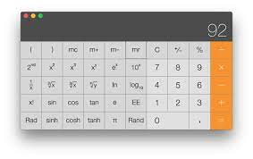
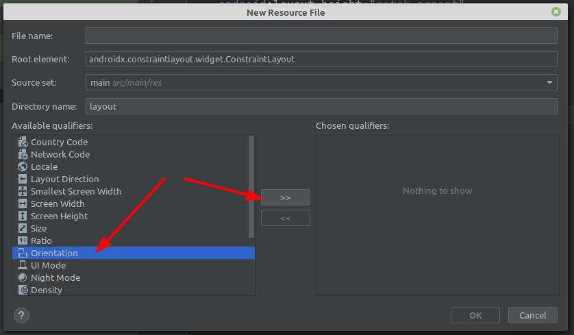
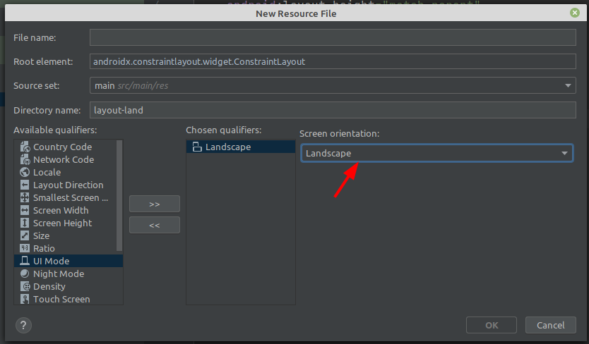
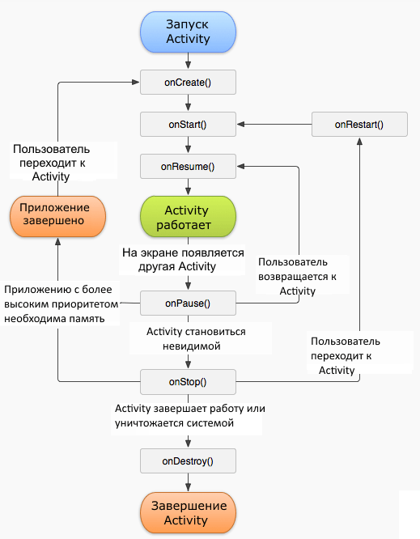
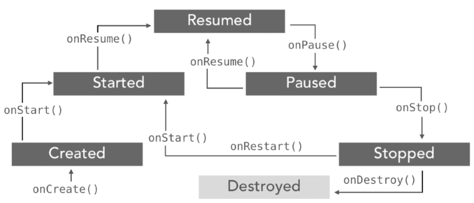

<table style="width: 100%;"><tr><td style="width: 40%;">
<a href="../articles/themes.md">Стили и темы. Ресурсы. Фигуры. Обработчики событий.
</a></td><td style="width: 20%;">
<a href="../readme.md">Содержание
</a></td><td style="width: 40%;">
<a href="../articles/weather.md">Проект погода (начало): геолокация, http(s)-запросы, разбор json, ImageView.
</a></td><tr></table>

# Ориентация экрана, жизненный цикл activity, сохранение данных

## Ориентация экрана

>Взято [отсюда](http://developer.alexanderklimov.ru/android/orientation.php#whereorientation)

При разработке мобильных приложений со сложным дизайном нередки ситуации, когда при изменении ориентации экрана все выглядит совсем не так, как Вам хотелось бы. В таких случаях выходом из ситуации может стать использование различных шаблонов для книжной и альбомной ориентации устройства. При этом переключение между шаблонами может осуществляться в автоматическом или динамическом (ручном) режиме.

Для автоматического режима достаточно создать дополнительнай файл шаблона для альбомной ориентации.

Создадим дополнительный шаблон с "инженерной" версией калькулятора:



Для этого добавим **одноименный** шаблон, указав ему ориентацию:




**Android Studio** автоматически создаст каталог `layout-land` и сохранит туда новый шаблон.

Когда вы создаёте альтернативную разметку, то не забывайте проверять наличие элементов, к которым будете обращаться программно, иначе получите ошибку.

## Жизненный цикл *activity*

>http://developer.alexanderklimov.ru/android/theory/activity_methods.php

Все приложения Android имеют строго определенный системой **жизненный цикл**. При запуске пользователем приложения система даёт этому приложению высокий приоритет. Каждое приложение запускается в виде отдельного процесса, что позволяет системе давать одним процессам более высокой приоритет, в отличие от других. Благодаря этому, например, при работе с одними приложениями Android позволяет не блокировать входящие звонки. После прекращения работы с приложением, система освобождает все связанные с ним ресурсы и переводит приложение в разряд низкоприоритетного и закрывает его.

Все объекты *activity*, которые есть в приложении, управляются системой в виде стека *activity*, который называется **back stack**. При запуске новой *activity* она помещается поверх стека и выводится на экран устройства, пока не появится новая *activity*. Когда текущая activity заканчивает свою работу (например, пользователь уходит из приложения), то она удаляется из стека, и возобновляет работу та activity, которая ранее была второй в стеке.

После запуска *activity* проходит через ряд событий, которые обрабатываются системой и для обработки которых существует ряд обратных вызовов:

```
protected void onCreate(Bundle saveInstanceState);
protected void onStart();
protected void onRestart();
protected void onResume();
protected void onPause();
protected void onStop();
protected void onDestroy();
```

Схематично взаимосвязь между всеми этими обратными вызовами можно представить следующим образом



Cледует отметить, что при изменении ориентации экрана (и не только) система завершает *activity* и затем создает ее заново, вызывая метод onCreate.

В целом переход между состояниями activity можно выразить следующей схемой:



Расмотрим несколько ситуаций. Если мы работаем с *Activity* и затем переключаемся на другое приложение, либо нажимаем на кнопку **Home**, то у *Activity* вызывается следующая цепочка методов: **onPause -> onStop**. *Activity* оказывается в состоянии **Stopped**. Если пользователь решит вернуться к *Activity*, то вызывается следующая цепочка методов: **onRestart -> onStart -> onResume**.

Другая ситуация, если пользователь нажимает на кнопку **Back (Назад)**, то вызывается следующая цепочка **onPause -> onStop -> onDestroy**. В результате *Activity* уничтожается. Если мы вдруг захотим вернуться к *Activity* через диспетчер задач или заново открыв приложение, то *activity* будет заново пересоздаваться через методы **onCreate -> onStart -> onResume**

## Сохранение состояния приложения

Выше был рассмотрен обычный жизненный цикл *Activity* в приложении на Android. Но есть еще два метода, которые вызываются при принудительном закрытии activity (например, при повороте экрана). Перед завершением работы вызывается метод **onSaveInstanceState**, который сохраняет состояние *Actiity*, а после создания *Activity* вызывается метод **onRestoreInstanceState**, который восстанавливает ее состояние. Оба этих метода в качестве параметра принимают объект **Bundle**, который как раз и хранит состояние *activity*:

```java
protected void onRestoreInstanceState(Bundle saveInstanceState);
protected void onSaveInstanceState(Bundle saveInstanceState);
```

Когда система завершает *activity* в принудительном порядке, чтобы освободить ресурсы для других приложений, пользователь может снова вызвать эту *activity* с сохранённым предыдущим состоянием. Чтобы зафиксировать состояние *activity* перед её уничтожением, в классе активности необходимо реализовать метод **onSaveinstancestate()**.

Сам метод вызывается прямо перед методом **onPause()**. Он предоставляет возможность сохранять состояние пользовательского интерфейса активности в объект **Bundle**, который потом будет передаваться в методы **onCreate()** и **onRestoreInstanceState()**. В объект **Bundle** можно записать параметры, динамическое состояние активности как пары "ключ-значение". Когда *activity* будет снова вызвана, объект Bundle передаётся системой в качестве параметра в методы **onCreate()** и **onRestoreInstanceState()**, которые вызываются после **onStart()**, чтобы один из них или они оба могли установить *activity* в предыдущее состояние. Прежде чем передавать изменённый параметр **Bundle** в обработчик родительского класса, сохраните значения с помощью методов **putXXX()** и восстановите с помощью **getXXX()**.

В отличие от базовых методов, методы **onSaveInstanceState()** и **onRestoreInstanceState()** не относятся к методам жизненного цикла *activity*. Система будет вызывать их не во всех случаях. Например, Android вызывает **onSaveinstancestate()** прежде, чем *activity* становится уязвимой к уничтожению системой, но не вызывает его, когда экземпляр *activity* разрушается пользовательским действием (при нажатии клавиши BACK). В этом случае нет никаких причин для сохранения состояния активности.

Метод **onSaveInstanceState()** вызывается системой в случае изменения конфигурации устройства в процессе выполнения приложения (например, при вращении устройства пользователем или выдвижении физической клавиатуры устройства.

Поскольку метод **onSaveinstanceState()** вызывается не во всех случаях, его необходимо использовать только для сохранения промежуточного состояния активности. Для сохранения данных лучше использовать метод **onPause()**.

```kt
var buffer = ""

override fun onSaveInstanceState(outState: Bundle, outPersistentState: PersistableBundle) {
    outState.putString("buffer", buffer)
    super.onSaveInstanceState(outState, outPersistentState)
}

override fun onRestoreInstanceState(savedInstanceState: Bundle) {
    super.onRestoreInstanceState(savedInstanceState)
    buffer = savedInstanceState.getString("buffer") ?: ""
}
```

<table style="width: 100%;"><tr><td style="width: 40%;">
<a href="../articles/themes.md">Стили и темы. Ресурсы. Фигуры. Обработчики событий.
</a></td><td style="width: 20%;">
<a href="../readme.md">Содержание
</a></td><td style="width: 40%;">
<a href="../articles/weather.md">Проект погода (начало): геолокация, http(s)-запросы, разбор json, ImageView.
</a></td><tr></table>
