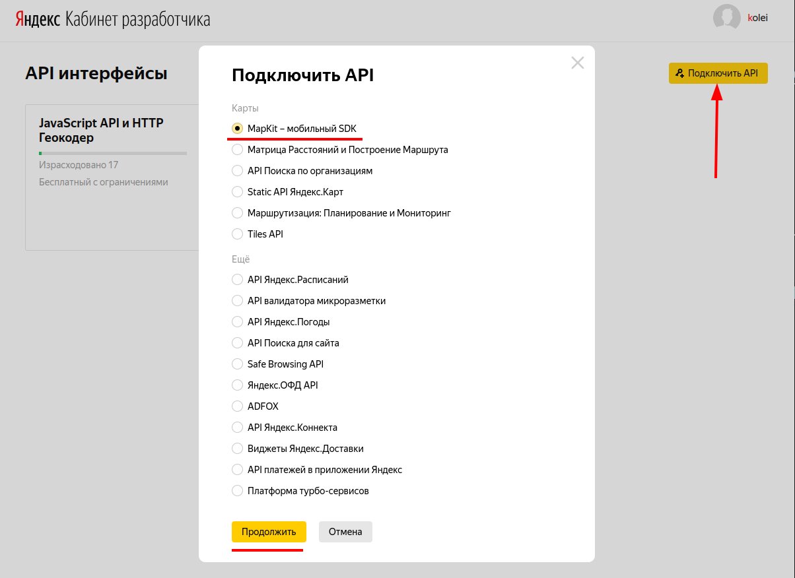
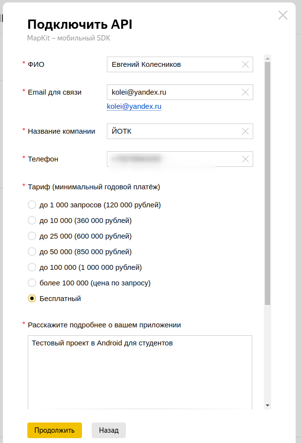
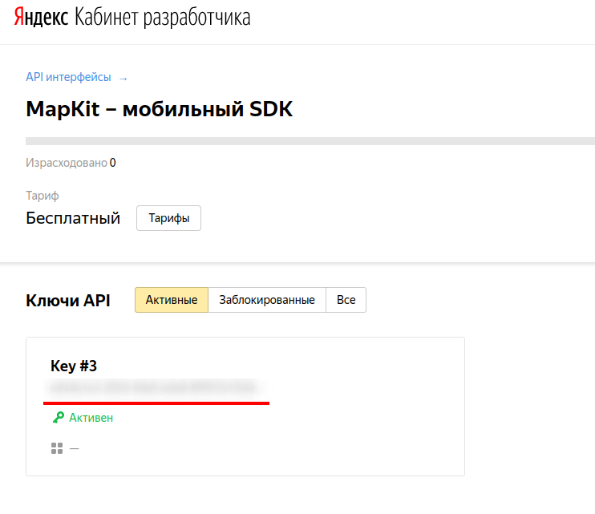
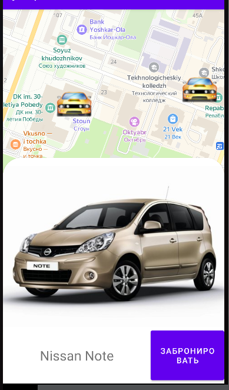
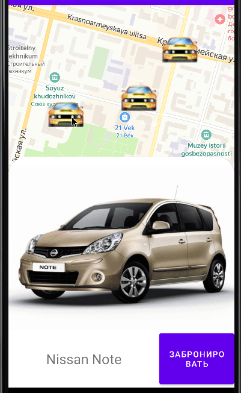

<table style="width: 100%;"><tr><td style="width: 40%;">
<a href="../articles/android_auth.md">Проект "база". Авторизация на сервере (Basic auth, token)
</a></td><td style="width: 20%;">
<a href="../readme.md">Содержание
</a></td><td style="width: 40%;">
<a href="../articles/wear_os.md">Wear OS
</a></td><tr></table>

# Работа с картами

>Этот вариант написан для [Яндекс.карт](https://yandex.ru/dev/maps/mapkit/doc/intro/concepts/about.html?from=mapkit)

>Описание API каршеринга доступно по ссылке:
>http://swagger.kolei.ru/?url=http://carsharing.kolei.ru/swagger/api.yml

### Шаг 1. Получите ключ для работы с MapKit

Переходим по [ссылке](https://developer.tech.yandex.ru/services/) (если у вас нет аккаунта yandex, то нужно сделать)

Нажмите "Подключить API" и выберите пакет "MapKit - мобильный SDK".



Заполните форму



В итоге у вас будет ключ



### Шаг 2. Установите библиотеку MapKit

Создайте проект, откройте `build.gradle` **проекта**, В секции `buildscript/repositories` добавьте репозитории **Maven Central** и **Google Maven** (этот блок должен быть ДО секции `plugins`):

```txt
buildscript {
    repositories {
        mavenCentral()
        maven {
            url "https://maven.google.com/"
        }
    }
}
```

Откройте файл `build.gradle` приложения (модуля). В секции *dependencies* добавьте зависимость:

```txt
implementation 'com.yandex.android:maps.mobile:4.2.2-lite'
```

### Шаг 3. Настройте библиотеку

1. Добавьте карту на Activity:

    ```xml
    <com.yandex.mapkit.mapview.MapView
        android:id="@+id/mapview"
        android:layout_width="match_parent"
        android:layout_height="match_parent"/>
    ```

1. Установите ваш API-ключ в методе *onCreate()* вашего наследника **Application** (судя по названию класса это должен быть наш класс **MyApp**, но я устанавливаю ключ в активности с картой):

    ```kt
    private lateinit var mapView: MapView
    val yotcLat = 56.639478
    val yotcLon = 47.892127  

    override fun onCreate(savedInstanceState: Bundle?) {
        super.onCreate(savedInstanceState)

        MapKitFactory.setApiKey( ТУТ ВАШ КЛЮЧ )
    ```

1. Инициализируйте карту в методе *onCreate()* нужного **Activity**:

    **Внимание!!! Инициализацию нужно делать до вызова *setContentView***

    ```kt
    MapKitFactory.setApiKey(apiKey)

    MapKitFactory.initialize(this)

    setContentView(R.layout.activity_main)

    // получение указателя на визуальный элемент "карта"
    mapView = findViewById(R.id.mapview)

    // перемещение камеры в нужную точку
    mapView.map.move(
        CameraPosition(
            Point(yotcLat, yotcLon),
            18.0f,  // зум
            0.0f, 
            0.0f
        ),
        Animation(Animation.Type.SMOOTH, 0f),
        null
    )
    ```

1. Передайте события *onStart* и *onStop* в **MapKitFactory** и **MapView**. Иначе **MapKit** не сможет отобразить карту и остановить обработку карты, когда **Activity** с картой становится невидимым для пользователя:

    ```kt
    override fun onStart() {
        super.onStart()
        MapKitFactory.getInstance().onStart()
        mapView.onStart()
    }

    override fun onStop() {
        mapView.onStop()
        MapKitFactory.getInstance().onStop()
        super.onStop()
    }
    ```

На этом этапе приложение уже должно нормально запускаться и показывать карту.

---

### Добавление маркеров на карту

У яндекс карт, насколько я понял, нет стандарного значка для маркера текущей локации, все маркеры делаются одинаково из картинок (есть варианты и из фигур, но их рассматривать не будем). Добавьте в ресурсы приложения картинку для маркера текущей локации (в каталог `res/drawable`) и создайте маркер (в конструкторе, после камеры):

```kt
val imageProvider: ImageProvider = ImageProvider
    .fromResource(
        this, 
        R.drawable.location_marker)

mapView
    .map
        .mapObjects
            .addPlacemark(
                Point(
                    yotcLat, 
                    yotcLon),
                imageProvider)
```

### Добавление маркеров автомобилей

В принципе само добавление маркеров аналогичное, но нам ещё нужно реализовать клик на маркере автомобиля, чтобы отображалась подробная информация об автомобиле (фотография, модель, остаток хода, тариф, кнопка перехода к бронированию).

Обработчик клика по маркеру у яндекса реализован со "слабой связанностью", т.е. сборщик мусора его уничтожит при ближайшей возможности. Чтобы этого не происходило, маркеры нужно хранить в отдельном списке.

1. В свойства класса добавьте массив для созданных маркеров и указатель на обработчик клика (тапа) по маркеру (пока пустой):

    ```kt
    private var carList = ArrayList<PlacemarkMapObject>()

    private var markerTapListener: MapObjectTapListener? = null
    ```

1. Добавьте методы для задания обработчика и для добавления маркера:

    ```kt
    private fun setTapListener(listener: MapObjectTapListener) {
        markerTapListener = listener
    }

    /*
        Это обёртка над addPlacemark
        в которой к маркеру цепляется обработчик событий 
        и полезная нагрузка
    */
    private fun addMarker(
        latitude: Double,
        longitude: Double,
        @DrawableRes imageRes: Int,
        userData: Any? = null
    ): PlacemarkMapObject 
    {
        val marker = mapView.map.mapObjects
            .addPlacemark(
                Point(latitude, longitude),
                ImageProvider
                    .fromResource(
                        this, 
                        imageRes)
        )
        marker.userData = userData
        markerTapListener?.let{ 
            marker
                .addTapListener(it) }
        return marker
    }
    ```

    В качестве "полезной нагрузки" будем хранить информацию об автомобиле. То есть у нас будет не список экземпляров класса **Car**, а список маркеров, в полезной нагрузке которых и будут хранится экземпляры **Car**

    То есть формирование списка маркеров будет происходить при получении ответа сервера на запрос списка автомобилей примерно так:

    ```kt
    for(...) {
        // создайте экземпляр информации об автомобиле
        val car = Car(...)

        markerList.add(
            addMarker(
                car.lat, 
                car.lon,
                R.drawable.car, 
                car
            )
        )
    }
    ```

---

### Отображение детальной информации об объекте

В яндекс картах я не нашёл аналога **InformationWindow** - окна, появляющегося при клике на маркер у гугла. Реализуем показ обычными визуальными элементами:

1. Добавьте в разметку окна **LinearLayout** с `id = detailInfo` и с необходимым содержимым. Задайте ему атрибут `visibility="gone"` (не показывать и не занимать место)

1. Задайте обработчик клика.

    ```kt
    setTapListener { mapObject, point ->
        detailInfo.visibility = View.VISIBLE
        // mapObject.userData содержит экземпляр Car, который вы задали при создании маркера
        val car = mapObject.userData as Car

        // тут в визуальные элементы вашего detailInfo внесите информацию об автомобиле (фото, модель...)

        ...

        true
    }
    ```

    Должно получиться что-то такое (я корневым элементом сделал CardView, чтобы углы были скруглённые)

    

### Использование библиотеки Glide для загрузки изображений

Библиотека **Glide** предназначена для асинхронной подгрузки изображений из сети, ресурсов или файловой системы, их кэширования и отображения. Библиотека имеет дополнительную функциональность в виде поддержки анимированных GIF-файлов и видео.

>Кстати, Google высоко оценивает качество библиотеки и даже включила её в состав одного шаблона в Android Studio.

1. Добавить в зависимости:

    ```txt
    implementation 'com.github.bumptech.glide:glide:4.14.2'
    annotationProcessor 'com.github.bumptech.glide:compiler:4.14.2'
    ```

1. При получении данных из АПИ сразу формировать полный URL картинки

    ```kt
    var car = Car(
        item.getString("model"),
        "http://carsharing.kolei.ru/images/${item.getString("photo")}"
    )
    ```

1. При необходимости загрузить изображение вызываем конструкцию

    ```kt
    Glide.with(this)
        .load(car.photoUrl)
        .into(carPhotoImageView)
    ```

    где

    * *this* - контекст (активность)
    * *car.photoUrl* - полный путь к изображению
    * *carPhotoImageView* - как должно быть понятно из названия, указатель на визуальный элемент

### Анимация появления информационного окна

Для начала поменяйте атрибуты контейнера:

* невидимость убрать
* добавить отрицательную нижнюю границу равную высоте контейнера: `android:layout_marginBottom="-432dp"`

Как уже писалось анимацию можно включить 

* программно:

    ```kt
    detailInfo
        .animate()
        .setDuration(200)
        .translationY(-resources.displayMetrics.ydpi * 400f / 160)
        .start()
    ```

    Метод *translationY* оперирует пикселями, поэтому мы должны преобразовать реальное разрешение экрана к размерности `dp` (160ppi). Цифра `400` это высота моего окна.  

* используя xml-разметку:

    ```xml
    <?xml version="1.0" encoding="utf-8"?>
    <set xmlns:android="http://schemas.android.com/apk/res/android">
        <objectAnimator
            android:duration="300"
            android:propertyName="translationY"
            android:valueTo="0dp"
            android:valueType="floatType"
            android:interpolator="@android:anim/decelerate_interpolator"/>
    </set>
    ```

Для не сложных преобразований проще использовать программную анимацию (только не забывать про перевод координат из `dp` в пиксели).

&nbsp;|&nbsp;
---|---
|Пример анимации