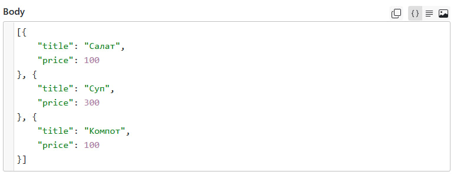
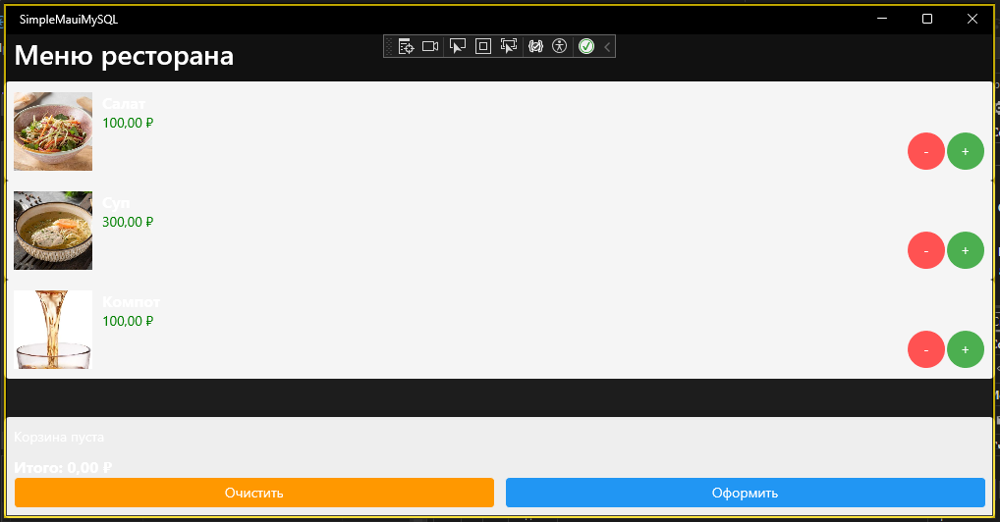
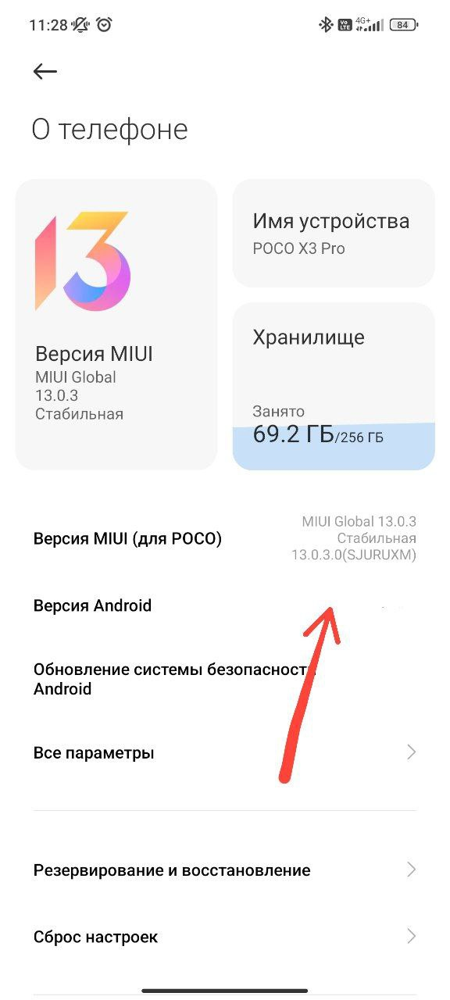
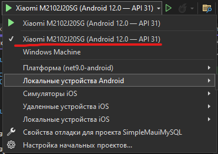
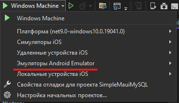
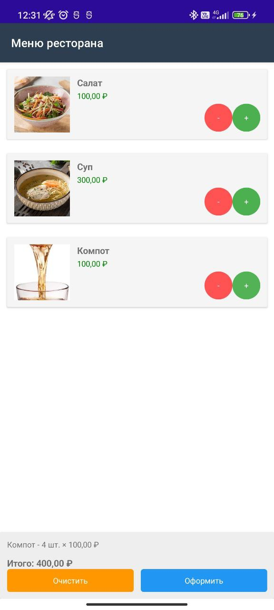

# Лекция: Разработка приложения "Меню ресторана" на .NET MAUI

## Введение в .NET MAUI

**.NET MAUI** (Multi-platform App UI) - это кроссплатформенный фреймворк для создания нативных мобильных и десктопных приложений. Основные компоненты:

>XAML - язык разметки для создания UI
>
>C# - бизнес-логика
>
>MVVM (Model-View-ViewModel) - архитектурный паттерн
>
>Библиотеки - для работы с сетью, БД и т.д.

**Поддерживаемые платформы**

* Мобильные: iOS, Android
* Десктоп: Windows (WinUI), macOS (Catalyst)
* В будущем: Linux (в разработке)

**Ключевые особенности**

* Единая кодовая база на C#
* Использование XAML для UI
* Доступ к нативным API платформ
* Горячая перезагрузка (Hot Reload)
* Встроенная поддержка MVVM

**.NET MAUI** представляет собой мощную эволюцию кроссплатформенных инструментов Microsoft, сочетающую в себе:

* Многолетний опыт Xamarin
* Мощь современного .NET
* Гибкость кроссплатформенной разработки
* Производительность нативных приложений

Это технология, которая позволяет создавать по-настоящему нативные приложения с экономией времени и ресурсов, что делает ее отличным выбором для современных мобильных и десктопных проектов.

## Оснавная структура страницы

```xml
<ContentPage xmlns="http://schemas.microsoft.com/dotnet/2021/maui"
             xmlns:x="http://schemas.microsoft.com/winfx/2009/xaml"
             x:Class="SimpleMauiMySQL.MainPage"
             Title="Меню ресторана">

    <Grid RowDefinitions="*, Auto">
        <!-- Область меню (верхняя часть) -->
        <CollectionView Grid.Row="0"
                       ItemsSource="{Binding MenuProducts}"
                       SelectionMode="None">
        </CollectionView>

        <!-- Область корзины (нижняя часть) -->
        <Frame Grid.Row="1"
               BackgroundColor="#f0f0f0"
               Padding="10">
        </Frame>
    </Grid>
</ContentPage>
```

## Создание модели данных

Создаем класс **Product.cs** для работы с данными из API:

```cs
public class Product
{
    public int id { get; set; }
    public string title { get; set; }
    public decimal price { get; set; }
       
    
    public int Quantity { get; set; }
}
```

**Объяснение:**

Базовые свойства соответствуют полям из API

>Проверить данные , которые находятся в api можно на сайте https://reqbin.com/



Инициализация в `MainPage`:

```cs
public partial class MainPage : ContentPage
{
    public ObservableCollection<Product> MenuProducts { get; } = new();
    
    public MainPage()
    {
        InitializeComponent();
        BindingContext = this;
    }
}
```

## Загрузка и отображение продуктов

Метод загрузки:

```cs
private async void LoadMenu()
{
    try
    {
        using var client = new HttpClient();
        var json = await client.GetStringAsync("https://restaurant.kolei.ru");
        var products = JsonSerializer.Deserialize<List<Product>>(json);
        
        foreach (var p in products)
        {
            MenuProducts.Add(p);
        }
    }
    catch (Exception ex)
    {
        await DisplayAlert("Ошибка", ex.Message, "OK");
    }
}
```

Вызываем в конструкторе:

```cs
public MainPage()
{
    InitializeComponent();
    BindingContext = this;
    LoadMenu(); // Добавляем вызов загрузки
}
```

## Добавление кнопок управления количества

```xml
<CollectionView.ItemTemplate>
    <DataTemplate>
        <Frame Margin="10" Padding="10">
            <Grid ColumnDefinitions="*,Auto,Auto,Auto,Auto">
                <!-- Название и цена -->
                <Label Text="{Binding title}" FontSize="16"/>
                <Label Grid.Column="1" Text="{Binding price, StringFormat='{0:C}'}"/>
                
                <!-- Кнопки управления -->
                <Button Grid.Column="2" Text="-" 
                        CommandParameter="{Binding .}"
                        Clicked="DecreaseProduct_Clicked"/>
                
                <Label Grid.Column="3" Text="{Binding Quantity}"
                       VerticalOptions="Center"/>
                
                <Button Grid.Column="4" Text="+" 
                        CommandParameter="{Binding .}"
                        Clicked="AddToCart_Clicked"/>
            </Grid>
        </Frame>
    </DataTemplate>
</CollectionView.ItemTemplate>
```

## Реализуем логику корзины

Добавляем коллекцию корзины:

```cs
public ObservableCollection<Product> CartItems { get; } = new();
```

Методы добавления/удаления:

```cs
private void AddToCart_Clicked(object sender, EventArgs e)
{
    if (sender is Button { BindingContext: Product product })
    {
        var existing = CartItems.FirstOrDefault(p => p.id == product.id);
        if (existing != null)
            existing.Quantity++;
        else
        {
            product.Quantity = 1;
            CartItems.Add(product);
        }
    }
}

private void DecreaseProduct_Clicked(object sender, EventArgs e)
{
    if (sender is Button { BindingContext: Product product })
    {
        var item = CartItems.FirstOrDefault(p => p.id == product.id);
        if (item != null)
        {
            if (item.Quantity > 1)
                item.Quantity--;
            else
                CartItems.Remove(item);
        }
    }
}
```

## Добавляем отображение корзины

Обновляем Frame корзины:

```xml
<Frame Grid.Row="1" BackgroundColor="#f0f0f0" Padding="10">
    <StackLayout>
        <Label Text="Ваша корзина:" FontAttributes="Bold"/>
        <Label Text="{Binding CartContent}"/>
        <Label Text="{Binding TotalAmount, StringFormat='Итого: {0:C}'}"
               FontAttributes="Bold"/>
        
        <Button Text="Очистить корзину"
                Clicked="ClearCart_Clicked"/>
    </StackLayout>
</Frame>
```

## Реализуем логику отображения корзины

Вычисляемые свойства:

```cs
public string CartContent => 
    CartItems.Count == 0 ? "Корзина пуста" : 
    string.Join("\n", CartItems.Select(i => $"{i.title} - {i.Quantity} шт."));

public decimal TotalAmount => 
    CartItems.Sum(item => item.price * item.Quantity);
```

Метод очистки:

```cs
private void ClearCart_Clicked(object sender, EventArgs e)
{
    CartItems.Clear();
}
```

## Добавляем обновление интерфейса

Метод обновления:
 
```cs
private void UpdateCart()
{
    OnPropertyChanged(nameof(CartContent));
    OnPropertyChanged(nameof(TotalAmount));
}
```

Обновляем методы работы с корзиной:

```cs
private void AddToCart_Clicked(object sender, EventArgs e)
{
    // ... существующая логика ...
    UpdateCart(); // Добавляем в конце
}

private void DecreaseProduct_Clicked(object sender, EventArgs e)
{
    // ... существующая логика ...
    UpdateCart(); // Добавляем в конце
}

private void ClearCart_Clicked(object sender, EventArgs e)
{
    CartItems.Clear();
    UpdateCart(); // Добавляем вызов
}
```

При скачивании проекта введите команду `dotnet workload restore` для того чтобы скачать все зависимости и пакеты.

Визуал проекта на Windows:



Если вы хотите запустить проект на Android, вам понадобится:

Устройство и USB-провод.

Включить режим разработчика на телефоне.





Нажмите 11 раз на версию телефона.


Включите отладку по USB.

Подключите устройство и найдите его в списке, затем запустите проект.



Также можно запустить проект с помощью эмулятора. Для этого выберите соответствующую опцию:



После этого начнется скачивание эмулятора и необходимых программ.

Визуал проекта на Android:


