# Использование MySQL Workbench для создания ER-диаграммы и DDL-скрипта

## Создание ER-диаграммы

1. Запустите **MySQL Workbench**, откройте вкладку **Модели** и создайте новую модель (иконка с плюсом)

    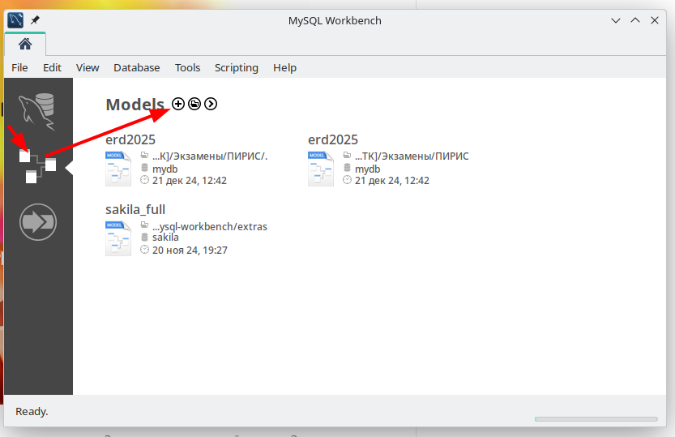

1. Переименуйте модель. Название модели будет использоваться в DDL-скрипте как название базы данных, поэтому название должно соответствовать задаче: например, `ekolesnikov_test` для лабораторных работ и `user01` при выполнени демо-экзамена.

    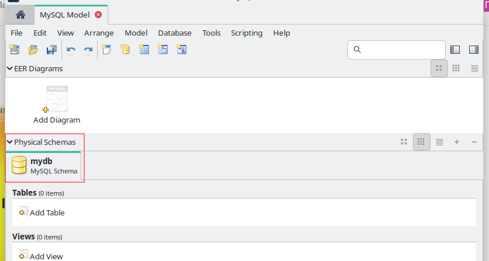

    двойной клик по названию модели откроет окно редактирования

    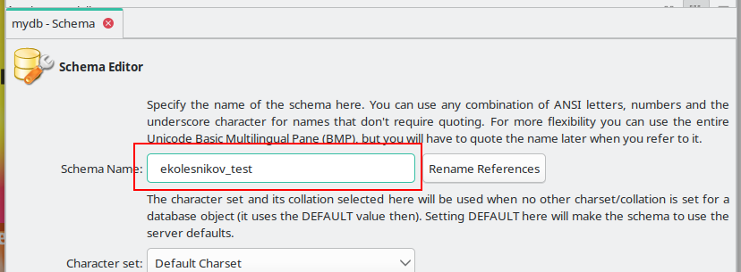

    >Кнопку "Rename References" нужно жать, если у вас уже есть диаграмма или таблицы

1. Добавьте диаграмму

    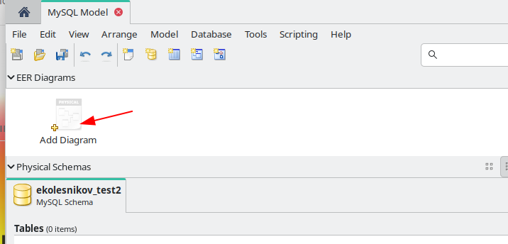

    Левую и правую панели можно скрыть, чтобы было больше места для диаграммы

    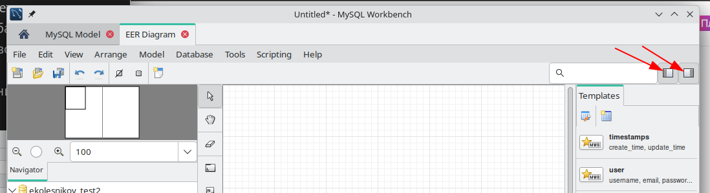

1. Для добавления таблиц и связей используется панель или быстрые клавиши (можно посмотреть, наведя курсор на иконку)

    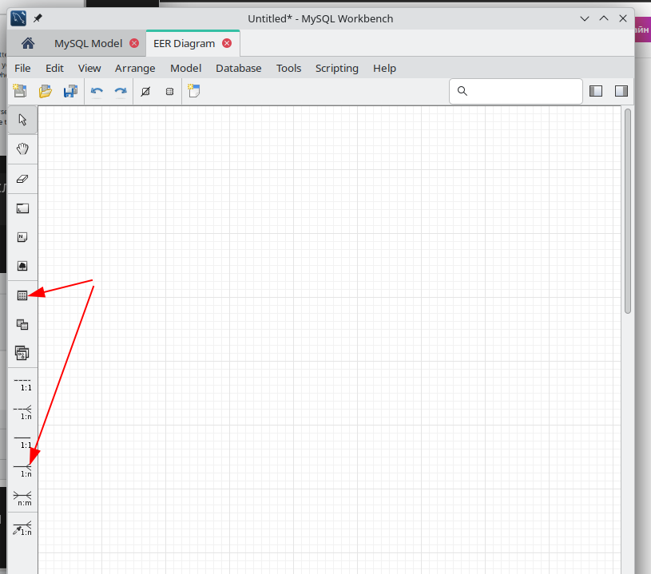

### Добавление сущностей (таблиц) в модель

1. Кликните по иконке "Новая таблица" (или нажмите быструю клавишу `T`)

    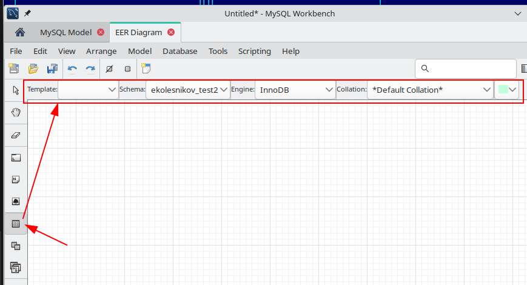

    В верхней панели появятся настройки таблицы, можно там ничего не менять и кликнуть мышкой в том месте диаграммы, куда вы хотите поместить новую таблицу

1. Двойным кликом по таблице можно открыть окно свойств, где задать название таблицы, добавить поля и их свойства

    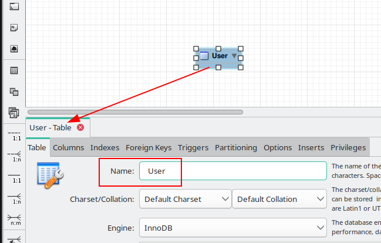

    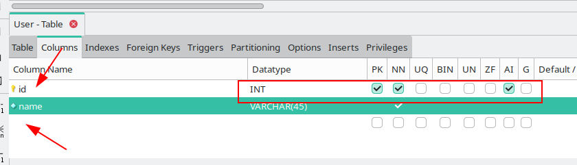

    >Двойной клик по свободному месту в конце списка полей добавляет новое поле

1. Создайте таблицы "Пользователь" (поле для внешнего ключа пока создавать не нужно) и "Роль"

### Создание связей 

#### "Один ко многим"

Кликните по иконке связи "один ко многим" (или нажмите быструю кнопку `4`), затем кликните сначала по той таблице, где "много" (Пользователь), а затем по той где "один" (Роль).

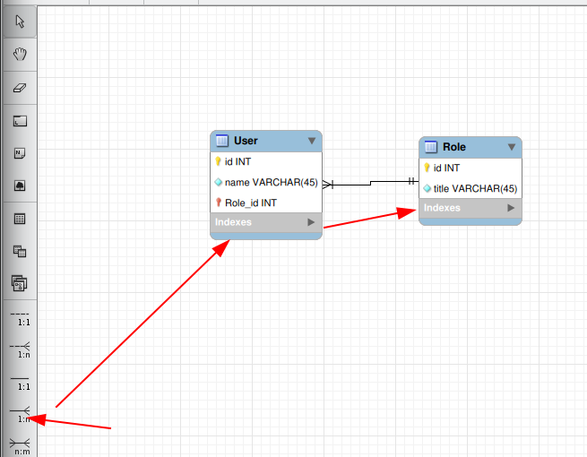

**MySQL Workbench** автоматически создаст поле для внешнего ключа, нужно только переименовать его в соответствии с используемыми соглашениями (для C# это **camelCase**, т.е. поле нужно назвать **roleId**)

#### "Многие ко многим"

Аналогично кликаете сначала по иконке связи, а затем по связываемым таблицам (я не стал создавать новые таблицы, использую существующие для примера). Система автоматически добавит таблицу связей и  все нужные связи

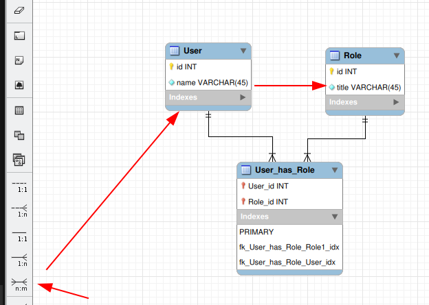

>Не забывайте переименовывать таблицы и поля в соответствии с используемыми соглашениями

## Создание DDL-скрипта

**MySQL Worbench** позволяет сгенерировать DDL-скипт для создания базы данных по модели

1. Выберите пункт меню "Database - Forward Engineer..."

    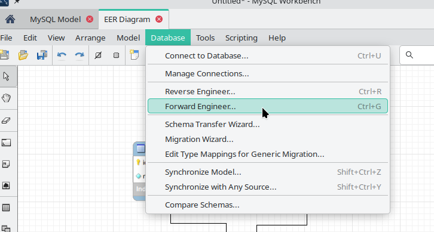

1. Введите параметры подключения к серверу (можно выбрать существующее подключение)    

    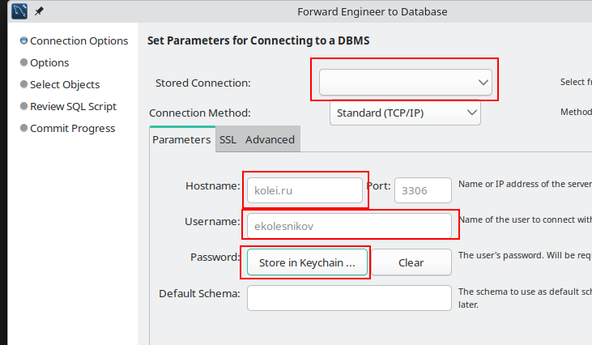

1. В настройках пока ничего менять не нужно

    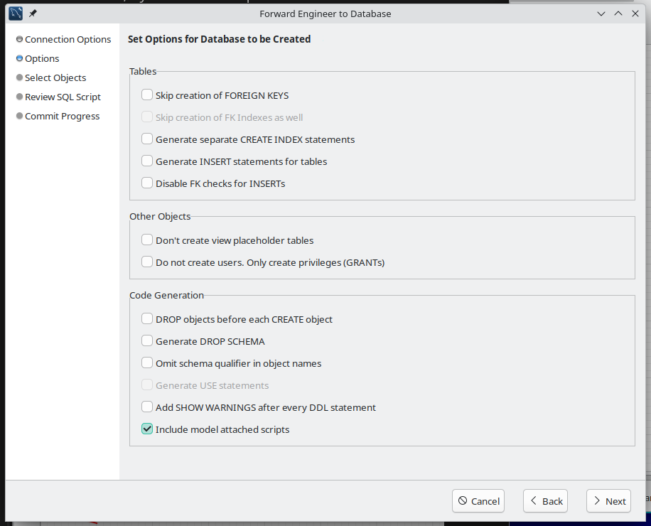

1. В окне выбора объектов тоже оставляем как есть

    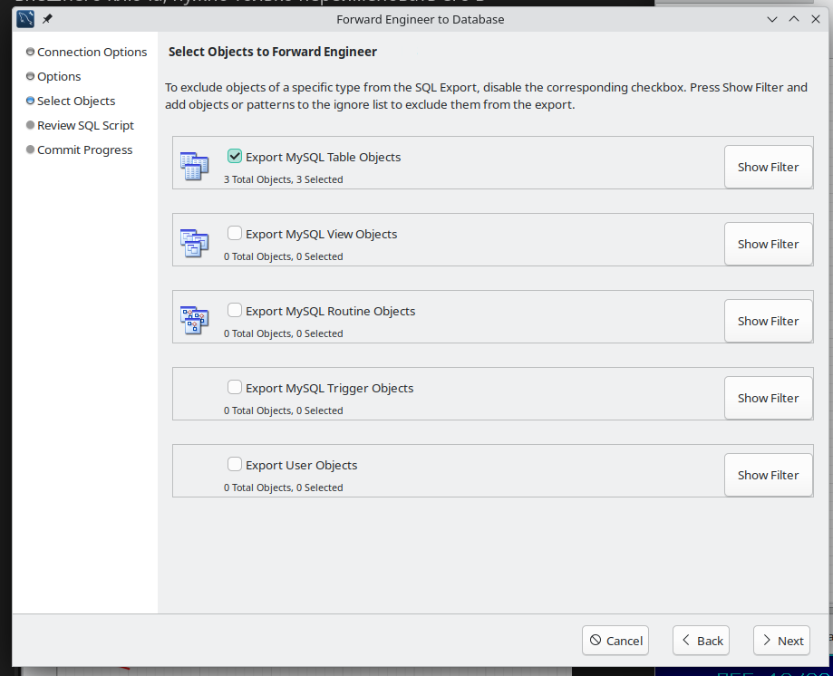

1. На следующем экране можно посмотреть сгенерированный скрипт и при необходимости внести правки

    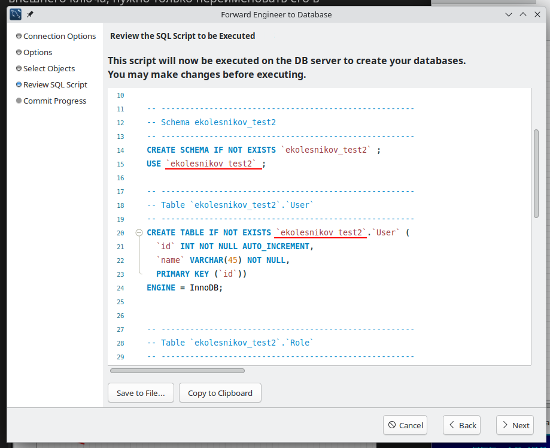

    1. Если на сервере запрещено создавать базы данных, то можно удалить строчку `CREATE SCHEMA ...`

1. Если при создании модели забыли дать ей нужное название, то можно вернуться на окно настроек и включить настройку "Ommit schema qualifier.."

    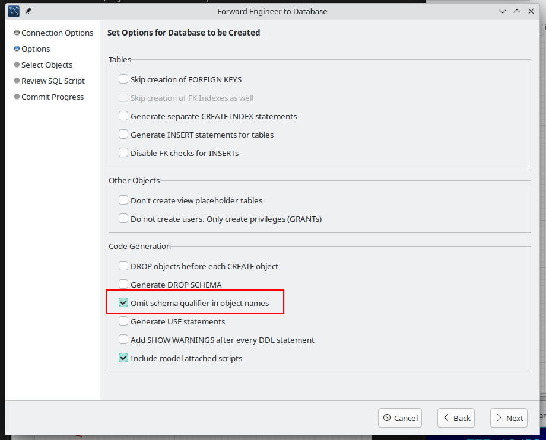

1. Вернувшись в окно DDL-скрипта не забудьте вписать строку `USE database_name`

    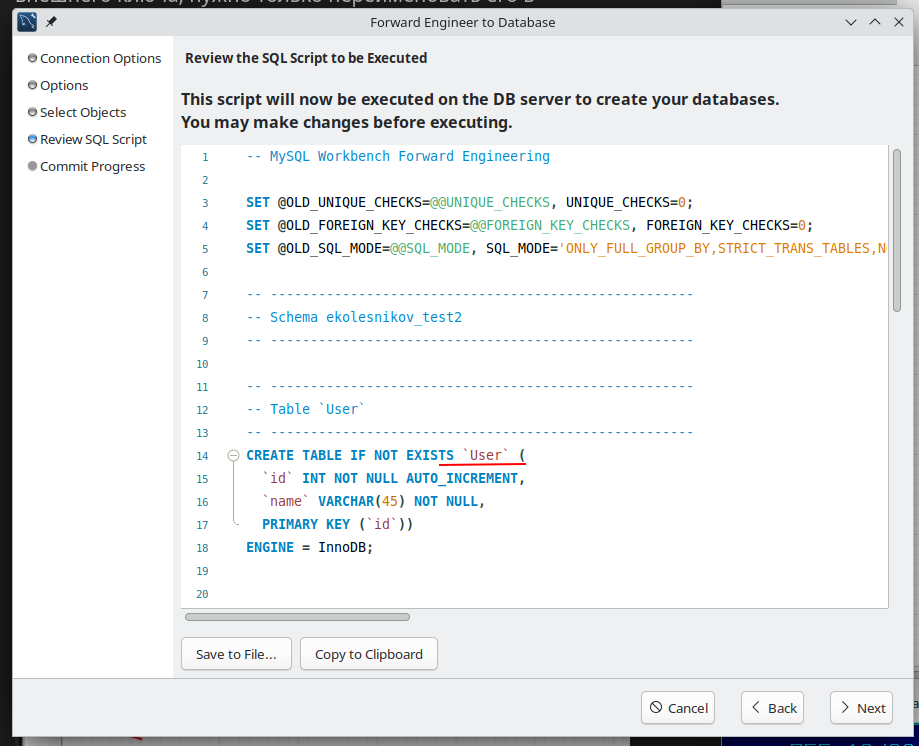

1. Можно скопировать получившийся скрипт в файл или буфер обмена, а можно сразу выполнить его в текущем сервере

    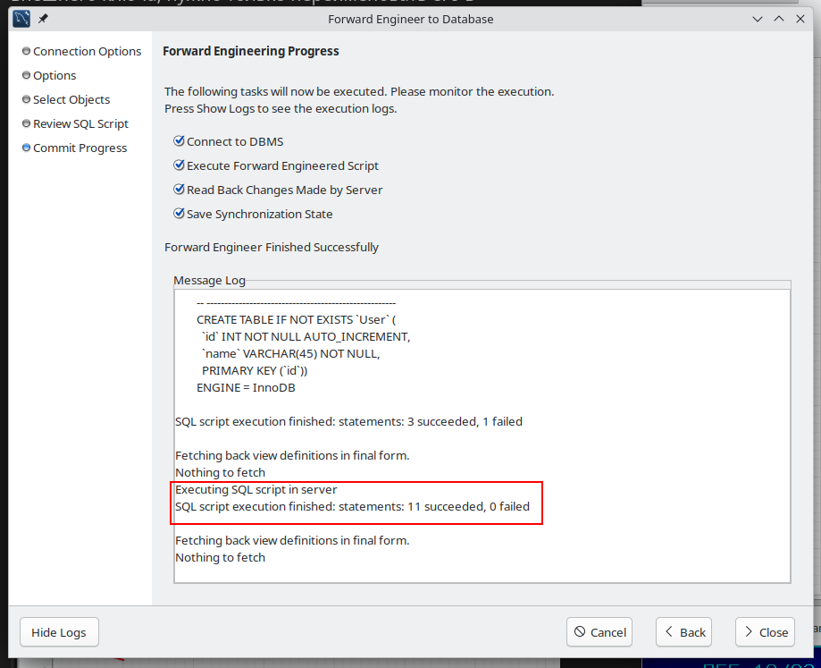
