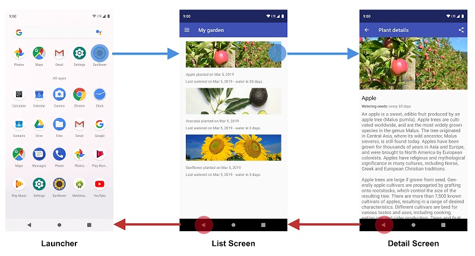
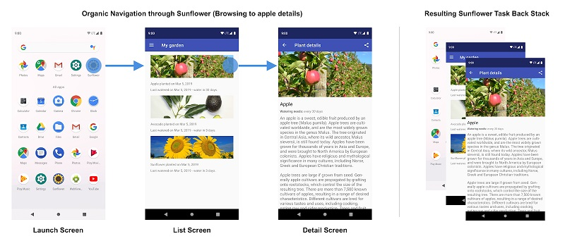
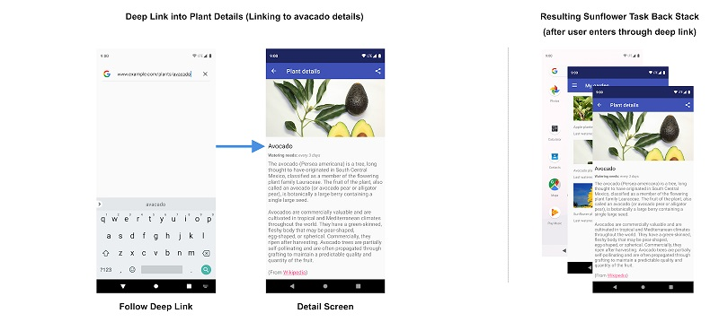

<table style="width: 100%;"><tr><td style="width: 40%;">
<a href="../articles/weather2.md">Проект погода (продолжение): SplashScreen (заставка). Выбор города. Выбор и отображение массива значений (почасовая, ежедневная). Разбор XML.
</a></td><td style="width: 20%;">
<a href="../readme.md">Содержание
</a></td><td style="width: 40%;">
<a href="../articles/android_auth.md">Проект "база". Авторизация на сервере (Basic auth, token). POST-запросы. API.
</a></td><tr></table>

>Содрано [отсюда](https://www.fandroid.info/android-app-navigation-principles/)

# Принципы навигации внутри и между андроид-приложениями

Продолжая лекции о разработке мобильных приложений, мы будем изучать компонент **Navigation**. Как понятно из его названия, этот компонент обеспечивает навигацию в андроид-приложениях. Для уточнения — речь идет о навигации пользователя внутри андроид приложения, а также между приложениями на устройстве.
Прежде чем мы начнем рассматривать сам компонент **Navigation**, ознакомимся с принципами навигации.

## Принципы навигации

Навигация между различными экранами и приложениями является основной частью пользовательского опыта. Следующие принципы устанавливают основу для согласованного и интуитивно понятного взаимодействия пользователя с приложениями. Компонент **Navigation** разработан для реализации этих принципов по умолчанию, гарантируя, что пользователи могут применять те же алгоритмы и шаблоны в навигации, когда они перемещаются между экранами в одном приложении и разными приложениями на устройстве.

>Даже если вы не используете компонент **Navigation** в своем проекте, ваше приложение должно следовать этим принципам разработки.

## Фиксированный пункт назначения

Каждое создаваемое вами приложение имеет фиксированный начальный пункт назначения. Это первый экран, который видит пользователь, когда запускает ваше приложение из панели запуска. Этот пункт назначения также является последним экраном, который видит пользователь, когда он возвращается к панели запуска после нажатия кнопки «Назад». Давайте рассмотрим приложение **Sunflower** в качестве примера.

При запуске приложения **Sunflower** из панели запуска первым экраном, который видит пользователь, является Экран списка , это список растений в саду. Это также последний экран, который они видят перед выходом из приложения. Если они нажимают кнопку «Назад» на экране списка, они возвращаются к панели запуска.

>Приложение может иметь одноразовую настройку или серию экранов входа в систему. Эти условные экраны не должны рассматриваться как начальные пункты назначения, поскольку пользователи видят эти экраны только в определенных случаях.

## Состояние навигации представлено в виде стека пунктов назначения.

Когда ваше приложение запускается впервые, на устройстве пользователя создается [новая задача](https://developer.android.com/guide/components/activities/tasks-and-back-stack) (task), и приложение отображает стартовый пункт  назначения. Он становится базовым пунктом назначения так называемого стека переходов назад, или бэкстека (back stack),   который является основой навигации вашего приложения. Вершина стека — это текущий экран, а предыдущие пункты назначения в стеке представляют историю посещенных экранов. Начальный пункт назначения приложения всегда находится в нижней части бэкстека.

Активити, которые запускаются, изменяют бэкстек, и всегда работают на вершине стека, либо помещая новый пункт назначения на вершину стека, либо выталкивая самый верхний пункт назначения из стека. При переходе к пункту назначения выбранный пункт оказывается на вершине стека.

Компонент [**Navigation**](https://developer.android.com/guide/navigation) управляет всеми вашими бэкстеками, хотя вы также можете сами ними управлять.

Подробнее о бэкстеке можно посмотреть [урок](https://www.fandroid.info/urok-25-task-i-backstack-aktiviti-android-prilozhenij-uroki-android-studio/) по ссылке.

## Кнопки «Вверх» и «Назад» идентичны в рамках задачи вашего приложения

Кнопка «Назад» появляется в системной навигационной панели внизу экрана и используется для навигации в обратном хронологическом порядке по истории экранов, с которыми пользователь недавно работал. Когда вы нажимаете кнопку «Назад», текущий пункт назначения выталкивается из верхней части бэкстека, а затем вы переходите к предыдущему пункту назначения.

Кнопка «Вверх» появляется на панели приложений в верхней части экрана. В задачах вашего приложения кнопки «Вверх» и «Назад» ведут себя одинаково.

## Кнопка «Вверх» никогда не выходит из приложения

Если пользователь находится в начальном пункте назначения приложения, кнопка «Вверх» не появляется, поскольку кнопка «Вверх» никогда не должна позволять  выход из приложения. Однако кнопка «Назад» отображается и при нажатии выполняет выход из приложения.

Когда ваше приложение запускается с использованием Deep Links на задачу другого приложения, кнопка «Вверх» переводит пользователей обратно на задачу вашего приложения через имитированный синтетическимй бэкстек, а не на приложение, которое вызвало ссылку Deep Links. Однако кнопка «Назад» возвращает вас к другому приложению.

## Глубокие ссылки (Deep Links) имитируют ручную навигацию

Будь то Deep Links или ручная навигация к определенному пункту назначения, вы можете использовать кнопку «Вверх» для навигации к предыдущему пункту назначения.

При глубокой привязке к месту назначения в рамках задачи вашего приложения любой существующий бэкстек для задачи вашего приложения удаляется и заменяется бэкстеком с Deep Links.

Снова используя приложение Sunflower в качестве примера, давайте предположим, что пользователь ранее запустил приложение с экрана запуска и перешел на экран детализации яблока. Если посмотреть на экран списка последних приложений, это означает, что существует задача, верхним крайним экраном которой является экран детализации яблока.

На этом этапе пользователь может нажать кнопку «Домой», чтобы перевести приложение в фоновый режим. Далее, скажем, это приложение имеет функцию глубоких ссылок, которая позволяет пользователям попадать из поиска по имени растения прямо на конкретный экран с подробным описанием. Открытие приложения через эту глубокую ссылку полностью заменяет текущий бэкстек Sunflower, показанный на рисунке 3, новым бэкстеком, как показано на рисунке 4:

Обратите внимание, что бэкстек Sunflower заменен синтетическим бэкстеком с подробным экраном авокадо вверху. Экран Мой сад, который является стартовым назначением, также был добавлен в бэкстек. Это важно, потому что синтетический бэкстек должен быть реалистичным. Он должен соответствовать бэкстеку, который мог бы быть достигнут путем органической навигации по приложению. Оригинальный бэкстек Sunflower пропал, включая знания приложения о том, что пользователь ранее был на экране сведений о яблоке.

Компонент Navigation поддерживает Deep Links и воссоздает реалистичный бэкстек для вас при связывании с любым пунктом назначения в вашем графе навигации.

# Навигация в приложении. Начало работы с Navigation Architecture Component

Сейчас на практике познакомимся с библиотекой **Navigation Architecture Component**, которая позволяет пользователям перемещаться между различными частями контента в вашем приложении. Компонент помогает реализовать навигацию, от простых нажатий кнопок до более сложных шаблонов, таких как панели приложений (appbars) и панель навигации (navigation drawer). Компонент навигации также обеспечивает согласованное и предсказуемое взаимодействие с пользователем, придерживаясь установленного набора принципов, о которых мы говорили выше.

**Navigation Architecture Component** упрощает осуществление навигации, а также помогает визуализировать navigation flow вашего приложения. Библиотека предоставляет ряд преимуществ, в том числе:

* Автоматическая обработка транзакций фрагментов
* Корректная обработка кнопок «Вверх» и «Назад» по умолчанию
* Поведение по умолчанию для анимации и переходов
* Deep linking как first class operation
* Реализация шаблонов навигации пользовательского интерфейса (таких как navigation drawer и bottom navigation) с небольшой дополнительной работой
* Безопасность типов при передаче информации во время навигации
* Инструменты Android Studio для визуализации и редактирования navigation flow приложения
 
Мы будем использовать готовый проект, в котором уже есть необходимые активити или фрагменты. Нам нужно настроить навигацию в приложении, используя Navigation Architecture Component.

Скачайте стартовый проект по [ссылке](https://drive.google.com/file/d/1js4p_QqMYc5ZyyN6DbrrzN-Lovv4Lb14)

## Обзор компонента навигации

Компонент навигации состоит из трех ключевых частей:

* Navigation graph: ресурс XML, который содержит всю связанную с навигацией информацию в одном централизованном месте. Это включает в себя все отдельные области содержимого в вашем приложении, называемые destinations (пункты назначения), а также возможные пути, которые пользователь может пройти через ваше приложение.
* NavHost: Пустой контейнер, который отображает пункты назначения из вашего графика навигации. Компонент Navigation содержит реализацию NavHost по умолчанию — NavHostFragment, которая отображает фрагменты — места назначения.
* NavController: Объект, который управляет навигацией приложения в NavHost. NavController управляет перемещениями контента мест назначения в NavHost , в процессе перемещения пользователей по приложению.
 

Мы используем объект NavController, сообщая ему путь в ресурсе Navigation Graph. Затем объекту NavController будет показан соответствующий пункт назначения в NavHostFragment.

Давайте посмотрим, как это выглядит на практике, начиная с нового ресурса Navigation Graph.

## Destinations

Компонент навигации представляет концепцию Destinations —  пункта назначения . Пункт назначения — это любое место, в котором вы можете перемещаться в приложении, обычно это фрагмент или активити. Они поддерживаются «из коробки», но вы также можете создавать свои собственные типы назначения, если это необходимо.

## Navigation Graph

Navigation Graph представляет собой новый тип ресурса , который определяет все возможные пути, доступные пользователю в приложении. Он показывает визуально все пункты назначения, которые могут быть достигнуты из данного пункта назначения. Редактор навигации Android Studio отображает Navigation Graph наглядно.

## Редактор навигации